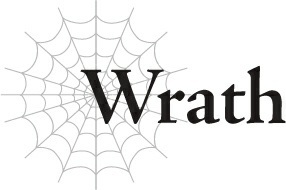

# Wrath

Tôi sẽ không gọi đây là sự chuộc lỗi.

Và nó chắc chắn cũng không phải là công lý.

Chỉ là tôi không muốn tất cả những mạng sống mà tôi đã tước đi trở nên vô ích.

Đó là điều nhiều nhất tôi có thể làm với đôi bàn tay nhuốm máu này.

Chiến trường là một mớ hỗn độn hỗn tạp giữa con người và ma tộc.

Không có đội hình chiến thuật hay các cuộc diễn tập có tổ chức nào cả, chỉ có sự hỗn loạn.

Không một mớ mưu lược nào có thể tạo nên sự khác biệt ở đây; tất cả những gì cả hai bên có thể làm chỉ là cố gắng đánh bại kẻ thù trước mặt mình.

Và tôi chắc chắn không thể đưa ra bất kỳ mệnh lệnh nào trên chiến trường.

Dù là ở kiếp này hay kiếp trước, tôi chưa bao giờ có bất kỳ kinh nghiệm nào trong việc dẫn dắt binh lính vào trận chiến.

Kể từ khi được giao phụ trách Quân đoàn 8, tôi đã học hỏi được khá nhiều điều, nhưng những nhân viên tham mưu đã gắn bó với lực lượng này từ lâu trước khi tôi đến có thể đưa ra những mệnh lệnh chính xác hơn tôi nhiều.

Thật lòng mà nói, tôi không được sinh ra để làm một chỉ huy.

Xét về thế mạnh, tôi sẽ hoạt động tốt hơn nếu chiến đấu trên tiền tuyến như một binh sĩ bình thường.

Nhưng cân nhắc đến mục tiêu của trận chiến này, tốt hơn là tôi không nên tự mình hoạt động quá hoang dã.

Nếu tôi làm vậy, chắc chắn sẽ có rất nhiều tổn thất về phía con người, nhưng lại không có nhiều về phía ma tộc.

Điều đó sẽ không tốt. Chúng tôi cần phe con người và ma tộc chịu tổn thất ngang nhau.

Vì vậy tôi không thể dẫn đầu cuộc tấn công trên tiền tuyến, nhưng điều đó cũng không có nghĩa là tôi có thể lùi lại phía sau và chỉ đưa ra mệnh lệnh.

Tôi không giỏi việc đó, là một chuyện.

Và nếu các binh sĩ Quân đoàn 8 nhận ra điều đó, họ sẽ mất đi mọi sự tôn trọng dành cho tôi.

Nói một cách thẳng thắn, Quân đoàn 8 là một nhóm người khá hỗn tạp.

Ban đầu, Quân đoàn 8 hầu như chỉ tồn tại trên danh nghĩa, với rất ít binh sĩ thực tế.

Nhưng cựu Chỉ huy Quân đoàn 8 đã từ bỏ chức danh rỗng tuếch đó và hiện đang tập trung vào chính trị.

Một số ít binh sĩ ban đầu thuộc Quân đoàn 8 đều đã được sáp nhập vào các đơn vị khác.

Vậy những binh sĩ mới này đến từ đâu? Chà, các đội quân tư nhân của một số lãnh chúa ma tộc phong kiến nhất định đã bị giải tán và chắp vá lại để tạo thành một lực lượng mới.

Cựu Chỉ huy Quân đoàn 9 Nereo... ông ta đã cố gắng ám sát Ariel đại nhân, vị Ma Vương, và thất bại.

Trước đó, ông ta cũng đã hỗ trợ cựu Chỉ huy Quân đoàn 7 Warkis trong việc âm mưu khởi binh nổi loạn.

Sau khi âm mưu của họ bị phanh phui, tư binh của Nereo và của những quý tộc liên kết với Nereo đều đã bị hợp nhất và bị cưỡng bức nhập ngũ từ các vùng tương ứng để tạo thành Quân đoàn 8 hiện tại.

Kết quả là, tinh thần chung của họ không hẳn là cao.

Một số người trong số họ thậm chí còn có thái độ nổi loạn rõ rệt.

Tất cả những gì tôi đang làm chỉ là dùng vũ lực để giữ họ trong khuôn khổ.

Nếu họ bắt đầu tin dù chỉ một giây rằng tôi không nắm quyền kiểm soát, mọi chuyện sẽ kết thúc.

Tôi chắc chắn sẽ có rất nhiều kẻ đào ngũ. Một số người trong số họ thậm chí có thể tận dụng cơ hội đó để tấn công tôi.

Vì tôi đã cố tình thể hiện cho họ thấy tôi mạnh mẽ như thế nào, tôi muốn nghĩ rằng chuyện đó sẽ không xảy ra, nhưng nếu có, tôi có lẽ sẽ phải quay lưỡi kiếm của mình vào chính những thuộc hạ của mình.

Tôi đoán điều đó cuối cùng sẽ làm tăng thêm số lượng người chết mà chúng tôi cần, nhưng rõ ràng tôi muốn tránh điều đó nếu có thể.

Vì vậy cuối cùng, giải pháp của tôi rất đơn giản và rõ ràng.

Nếu tôi không giỏi đưa ra mệnh lệnh, tôi chỉ việc không đưa ra chúng.

Thay vào đó, tôi sẽ làm cho trận chiến này trở nên hỗn loạn đến mức các mệnh lệnh trở nên vô nghĩa.

Và nếu tôi cũng có thể đảm bảo không có bất kỳ kẻ đào ngũ nào, điều đó sẽ thật hoàn hảo.

Dễ dàng đạt được bằng cách chỉ việc đặt một số mìn đất phía sau hàng ngũ của Quân đoàn 8.

Điều đó làm rõ rằng không có đường lui.

Và nếu họ vẫn cố tình làm vậy, tôi sẽ chém gục họ.

Khi tôi thông báo điều đó, họ đã bị rúng động đến mức gần như là buồn cười.

Sau đó, chỉ còn một việc duy nhất tôi cần làm: bắt đầu phá hủy pháo đài.

Bằng cách phóng các ma kiếm từ khoảng cách xa để tôi không bị nhìn thấy.

Điều đó nghĩa là loài người phải chạy ra khỏi pháo đài để trốn thoát, nên họ không còn lựa chọn nào khác ngoài việc đối mặt với chúng tôi.

Các đòn tấn công bằng ma kiếm của tôi có thể hạ gục hàng phòng thủ của họ một cách dễ dàng.

Không có ích gì khi cố gắng ẩn náu bên trong cả. Điều đó chỉ gây ra nhiều thương vong hơn mà thôi.

Vài tôi vẫn đang tiếp tục phóng kiếm để duy trì áp lực.

Quân đội ma tộc không thể rút lui, và quân đội loài người phải tiến lên.

Lựa chọn duy nhất còn lại là hai bên đâm sầm vào nhau.

Nếu họ về cơ bản bị ép buộc phải vào trận chiến, thì không có mục đích thực tế nào trong việc cố gắng lên chiến thuật hay đưa ra mệnh lệnh trên chiến trường hỗn loạn này cả.

Trong khi sự hỗn loạn ngự trị, tôi liên tục phóng ma kiếm vào phía sau quân đội loài người và chỉ chém gục những con người tiến thẳng về phía tôi trực diện.

Ngay cả với các ma kiếm của mình, tôi cũng đang cố gắng giữ cho thiệt hại ở mức tối thiểu.

Nếu tôi tiêu diệt quá nhiều quân đội loài người, sẽ không có nhiều thương vong về phía ma tộc.

Họ là đồng minh của tôi, dù muốn hay không, nên về mặt lý thuyết, tôi đáng lẽ phải cố gắng giảm thiểu tổn thất của họ, nhưng những gì tôi đang làm lại là điều ngược lại.

Tôi là một chỉ huy tàn nhẫn.

Những người đàn ông này đã vô cùng kém may mắn khi bị mắc kẹt với tôi dưới tư cách là người lãnh đạo.

Tôi cảm thấy có lỗi với họ, nhưng tôi không có lựa chọn nào khác.

Bởi vì đó là những gì tôi đã thề sẽ thực hiện.

Khi tôi tiếp tục ném ma kiếm và tiêu diệt những con người tiến về phía mình, tôi nghe thấy một tiếng gầm lớn kỳ lạ cắt ngang qua tiếng ồn ào điên cuồng của chiến trường.

“Ư-Ư-Ư-Ư-AAAAAAARGH!”

Nó kéo dài lâu đến mức tôi phải bị ấn tượng bởi dung tích phổi tuyệt vời đó.

Tiếng hét phát ra từ một hiệp sĩ, đang vung kiếm khi lao thẳng về phía tôi.

Qua những kẽ hở trên chiếc mũ giáp của ông ta, tôi có thể thấy ông ta là một ông lão đầy nếp nhăn.

Trông ông ta khá cao tuổi đối với tôi, nhưng ông ta đang chiến đấu nhiệt huyết hơn hầu hết những người khác ở đây.

Và ông ta trông có vẻ quen thuộc, hoặc ít nhất là phong cách kiếm thuật của ông ta thì có.

Đó chính là vị hiệp sĩ già đã tấn công tôi từ lâu khi tôi vẫn còn là một ogre.

“Hừm! Khí chất đáng sợ thật đấy! Ta có thể nhận ra ngươi chắc chắn phải là thủ lĩnh của đội quân ma tộc này! Họ gọi ta là Nyudoz! Hãy để chúng ta có một trận chiến công bằng và trung thực!”

Chà, ông lão này mãnh liệt thật...

Khi đến gần tôi, hiệp sĩ già Nyudoz bắt đầu hét lên về một trận chiến tay đôi, không màng đến sự hỗn loạn đang xoáy quanh chúng tôi.

Nói thật thì chuyện đó có vẻ hơi lạc điệu.

Chúng tôi đã vượt xa một trận chiến một chọi một “công bằng và trung thực” ở thời điểm này rồi.

Kẻ ngốc nào lại cố gắng thách đấu một trận đấu tay đôi ở giữa một chiến trường hỗn loạn chứ?

Kiểu người này, rõ ràng là vậy.

Nhưng sự ngu ngốc của ông ta gần như... mang lại cảm giác mới mẻ.

Ông ta là một kẻ ngốc, đúng vậy, nhưng ông ta rõ ràng đã tận hiến cho con đường mình đã chọn.

Ông lão đang sống một cuộc đời nghiêm túc đến ngu ngốc, giữ vững niềm tin và giá trị của mình.

Tôi hơi... chà, thực ra là hơi ghen tị một chút.

Nó khác xa với một kẻ như tôi, người đã luôn do dự và không chắc chắn suốt cuộc đời mình.

“Được thôi. Tôi chấp nhận.”

Tôi chỉ đi chệch khỏi con đường của mình để trả lời ông ta theo một ý thích nhất thời.

Tôi đã có thôi thúc muốn có một “trận chiến công bằng” với người này, chỉ có thế thôi.

Nyudoz dường như không nhớ rằng chúng tôi đã từng chiến đấu một lần trước đây, từ lâu rồi.

Công bằng mà nói, lúc đó tôi là một ogre, và bây giờ trông tôi khá khác biệt.

Nhưng tôi sẽ không bận tâm đến việc nói với ông ta điều đó.

Một gã như thế này có lẽ cũng chẳng quan tâm đến quá khứ đâu.

Tuy nhiên đối với tôi, tôi đoán đây là cơ hội cho một trận tái đấu?

Điều đó khiến tôi cảm thấy hơi kỳ lạ, nhưng nó không thay đổi được những gì tôi phải làm.

“Hãy bắt đầu nào!”

Nyudoz lao về phía trước một cách sắc bén.

Thật khó tin ông ta là một ông lão, chưa nói đến việc đang mặc một bộ giáp nặng nề, đánh giá qua tốc độ di chuyển của ông ta.

Con người được cho là có chỉ số thấp hơn ma tộc, nhưng ông ta chắc chắn có bộ pháp tốt hơn một ma tộc trung bình của các người.

Có bao nhiêu binh sĩ của Quân đoàn 8 có thể di chuyển như thế này chứ?

“?!”

Dù vậy, ông ta vẫn không thể theo kịp tôi.

Tôi đã mạnh lên rất nhiều kể từ khi còn là một ogre.

Ma kiếm của tôi chém ngọt qua lưỡi kiếm của ông ta.

Đó có lẽ là một thanh kiếm khá tốt, nhưng giữa chỉ số của tôi và những thanh ma kiếm tự tay chế tạo của tôi, một nhát chém mạnh duy nhất đã chia nó thành hai mảnh.

Thanh kiếm của tôi tiếp theo lóe sáng hướng về phía cổ của Nyudoz.

Trước khi ông ta kịp cố gắng tự vệ, đầu ông ta đã lăn trên mặt đất.

Bằng cách này, ít nhất, tôi nghĩ ông ta sẽ ra đi thanh thản mà không phải chịu bất kỳ đau đớn nào.

Có thể là tự phụ khi nghĩ về chuyện đó, nhưng đó là điều tốt nhất tôi có thể cống hiến cho ông ta.

Có vẻ như Nyudoz là người khá quan trọng đối với quân đội loài người. Những binh sĩ chứng kiến cái chết của ông ta đều lùi lại trong sự kinh hãi, rõ ràng là bị chấn động.

Ngay khi trụ cột đó sụp đổ, phần còn lại của binh lính đối phương cũng ngã xuống giống như những quân cờ domino vậy.

Chỉ như thế, Quân đoàn 8 đã giành được chiến thắng của mình.

---

[◀ Chương trước: Sophia](12_sophia.md) | [Chương tiếp theo: Hawkin ▶](13_hawkin.md)
