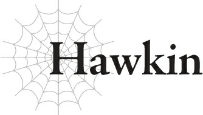

# Hawkin

“Hawkin. Trận này chú nên ngồi ngoài đi.”

Đó là đêm trước trận chiến lớn khi Đại ca của tôi, Jeskan, nói với tôi câu này.

“Tôi có thể hỏi tại sao Đại ca lại nói thế không?”

“...Chú biết rõ câu trả lời hơn bất kỳ ai mà, đúng không?”

Tôi đoán là mình không thể nói gì lại câu đó.

Phải, tôi biết tại sao.

Bởi vì tôi là thành viên yếu nhất trong tổ đội của Anh hùng...

Tổ đội năm người của chúng tôi gồm có thủ lĩnh, Anh hùng Julius; người bạn thuở nhỏ của cậu ấy, Hyrince; Thánh nữ Yaana; cùng với Đại ca và tôi.

Với tư cách là Anh hùng, Julius là người đứng đầu cả về ma pháp lẫn kiếm thuật.

Hyrince là người đỡ khiên của cậu ấy, một người đỡ đòn đáng tin cậy bảo vệ cả đội khỏi hầu hết các sát thương.

Người sử dụng ma pháp đa năng của chúng tôi, Thánh nữ Yaana, không chỉ giới hạn ở Trị liệu Ma pháp — cô ấy còn có thể tung ra các đòn tấn công ma pháp và hỗ trợ khác.

Đại ca Jeskan là một chuyên gia về đủ loại vũ khí, người tấn công giỏi thứ hai sau Julius.

So với họ, tôi giống như một kẻ hoạt động sau hậu trường hơn, nên tôi không có ích gì nhiều trong chiến đấu.

Nhiệm vụ của tôi là giữ cho tổ đội hoạt động trơn tru: phân loại các yêu cầu nhiệm vụ và thương lượng phần thưởng, giữ cho nhu yếu phẩm luôn đầy đủ, giải quyết các thủ tục giấy tờ liên quan đến việc di chuyển, duy trì mối quan hệ với các quốc gia khác nhau, đại loại thế.

Về cơ bản, là tất cả mọi thứ không liên quan đến việc chiến đấu.

Tất nhiên, tôi cũng hỗ trợ cả đội trong trận chiến bằng dao ném và các vật phẩm ma pháp này nọ.

Nhưng tôi biết rõ hơn ai hết rằng mình không thể mạnh mẽ bằng phần còn lại của nhóm.

Mọi người khác đều là những chuyên gia tầm cỡ thế giới trong lĩnh vực chuyên môn của họ, còn tôi thì sao? Tôi cá là mình có thể sẽ thua trong một trận đánh tay đôi với một binh sĩ bình thường đấy chứ.

Tất cả những gì tôi thực sự làm trong trận chiến là đưa ra bất kỳ sự hỗ trợ nào có thể và sử dụng mọi mánh khóe cuối cùng để giữ cho mọi thứ diễn ra trôi chảy.

“Trận chiến ngày mai có khả năng sẽ rơi vào hỗn loạn. Và nếu chuyện đó xảy ra, anh sẽ không thể bảo vệ chú được.”

Về cơ bản, Đại ca đang cố gắng để tôi ngồi dự bị.

Tất nhiên, tôi biết anh ấy làm vậy là vì tốt cho tôi.

Nhưng dù thế, Đại ca có thể trách tôi nếu tôi cảm thấy hơi nhói lòng khi nghe điều đó nói ra thành lời không?

Chúng ta đang chiến tranh với ma tộc.

Đây không giống bất kỳ điều gì tổ đội Anh hùng từng đối mặt trước đây.

Cho đến nay, chúng tôi chủ yếu chỉ chiến đấu với một số quái vật thực sự mạnh.

Thường là một con quái vật lớn đối đầu với năm người chúng tôi.

Vì bình thường chúng tôi có lợi thế về số lượng, điều đó đồng nghĩa với việc quái vật ít có khả năng nhắm vào tôi hơn.

Ngay cả khi nó làm vậy, Hyrince luôn che chở cho tôi, nên tôi hầu như không bao giờ rơi vào nguy hiểm.

Nhưng trận chiến này sẽ là chống lại cả một đội quân ma tộc khổng lồ. Đúng như Đại ca nói, khả năng cao là nó sẽ là một mớ hỗn độn, nên ngay cả Hyrince cũng không thể bảo vệ tất cả mọi người.

Nói cách khác, tôi sẽ phải tự lo liệu cho bản thân, nhưng ngay cả tôi cũng phải thừa nhận đó là một yêu cầu quá sức đối với kẻ như tôi.

“Tôi đoán là mình không thể làm Đại ca thay đổi ý định sao?”

“......”

Đại ca nhíu mày hơn thường lệ và khoanh tay lại, suy nghĩ một lúc.

“...Rõ ràng, người cần phải sống sót hơn bất kỳ ai trong tổ đội của chúng ta chính là Anh hùng Julius. Nhưng ngoại trừ cậu ấy, anh nghĩ mạng sống quan trọng nhất cần được bảo toàn chính là của chú, Hawkin.”

“?!”

Chà, điều đó thì tôi không ngờ tới đấy.

“Anh là một chiến binh hàng đầu. Hyrince được ban tặng sự nhanh trí. Yaana thân yêu của chúng ta được chọn ra từ tất cả các ứng cử viên Thánh nữ khác. Nhưng điều đó không có nghĩa là bọn anh không thể bị thay thế.”

“Khoan đã, Đại ca. Anh không thể có ý đó được.”

“Ồ, có đấy.” Đại ca uống một ngụm rượu lớn. “Anh là một mạo hiểm giả hạng A. Có những mạo hiểm giả hạng S vượt xa anh.”

“Nhưng Đại ca đã tự mình đạt được hạng A một mình cơ mà, đúng không?”

Sức mạnh của một mạo hiểm giả không chỉ phụ thuộc vào thứ hạng.

Một số người chứng tỏ giá trị của họ trong một tổ đội để nâng cao thứ hạng của mình; những người khác làm điều đó bằng những thành tựu ngoài trận chiến.

Đại ca đã tự mình đi lên hạng A hoàn toàn đơn độc.

Có một sự khác biệt khổng lồ giữa một người đạt hạng A trong một tổ đội và một người tự mình đạt được nó. Một mạo hiểm giả hạng A solo như Đại ca của tôi ở đây là quá đủ mạnh cho hạng S rồi.

Nếu anh ấy tham gia vào một tổ đội tử tế nào đó, anh ấy chắc chắn sẽ đạt được hạng S trong nháy mắt mà thôi.

Tuy nhiên, anh ấy đã gia nhập tổ đội Anh hùng trước khi điều đó xảy ra, nên anh ấy được xã hội coi là một trong những người theo đuôi Anh hùng, chứ không phải là một mạo hiểm giả.

Tất nhiên, điều đó nghĩa là những gì anh ấy làm trong tổ đội của chúng tôi không được tính vào thứ hạng mạo hiểm giả của anh ấy, nên anh ấy vẫn là hạng A.

“Đúng vậy. Bản thân anh có lẽ đủ mạnh cho hạng S.”

Chỉ có một số ít mạo hiểm giả gần như huyền thoại mới có thể đạt tới hạng S.

Đó là một tầm cao mà chỉ những mạo hiểm giả tài năng nhất mới có thể chạm tới.

“Nhưng chỉ có thế thôi. Có những mạo hiểm giả hạng S khác ngoài kia. Nghĩa là có những chiến binh khác mạnh bằng anh hoặc mạnh hơn.”

Ấy vậy mà, ở đây Đại ca của tôi lại nói rằng thành tựu đó hầu như chẳng đáng là bao.

“Hyrince và ngay cả cô Yaana cũng vậy. Có vô số ứng cử viên khác cho vị trí Thánh nữ.”

“Nhưng, Đại ca...”

“Tất nhiên, bọn anh có rất nhiều kinh nghiệm chiến đấu bên cạnh Julius. Bọn anh phối hợp ăn ý với nhau. Ngay cả một người có sức mạnh tương đương với một trong số bọn anh cũng không thể thay thế dễ dàng như vậy. Nhưng đó vẫn chỉ là vấn đề thời gian mà thôi.”

Đại ca nghiêng ly để uống thêm một ngụm rượu lớn nữa.

“Bọn anh không thực sự là những người không thể thay thế,” anh ấy kết luận một cách tự ti.

“Nhưng như thế không có nghĩa là tôi mới là người dễ bị thay thế nhất sao...?”

Đại ca vừa nói các chiến binh cấp hạng S khác có thể thay thế anh ấy, nhưng chúng ta vẫn đang nói về một nhóm các chiến binh tinh nhuệ hàng đầu.

Chắc chắn, có những người khác mạnh bằng anh ấy, nhưng điều đó không có nghĩa là họ sẽ nhảy vào cơ hội đăng ký đi theo Anh hùng.

Rất nhiều mạo hiểm giả có tổ đội gắn bó của riêng họ hoặc làm việc cho một quốc gia cụ thể.

Sẽ không dễ dàng gì để thuyết phục họ chuyển việc.

Mặt khác, những việc tôi làm thực sự không có gì hơn ngoài những công việc lặt vặt tẻ nhạt thông thường. Không cần bất kỳ tài năng đặc biệt nào, nên hầu như ai cũng có thể làm được.

Không nghi ngờ gì nữa, tôi sẽ là người dễ bị thay thế nhất trong tổ đội.

“Không. Ngược lại mới đúng. Sau Julius, chú là người khó thay thế nhất đấy.”

“Đại ca không cần phải cố gắng làm tôi cảm thấy tốt hơn đâu.”

“Anh không có làm thế, đồ ngốc này. Nghe đi.” Anh ấy rót một ít rượu vào cốc của tôi. “Chú biết Julius là người không thể thay thế, đúng không? Tại sao lại thế?”

“Chà, bởi vì cậu ấy là Anh hùng, tất nhiên rồi.”

“Chính xác.”

Đại ca gật đầu như thể đó là điều hiển nhiên, và đúng là như vậy.

Nhưng đó không phải là lý do duy nhất. Đó cũng là vì cậu ấy là Julius.

“Bởi vì Julius là Julius...?”

Tôi ngơ ngác nhìn Đại ca. Nếu đây là một câu đố, tôi chịu không hiểu nổi.

“Nếu Anh hùng chết, vị Anh hùng tiếp theo sẽ được chọn ngay lập tức. Nhưng đó sẽ là một người khác, chứ không phải Julius. Nên sẽ có một vị Anh hùng khác nếu người này chết, nhưng chắc chắn sẽ không có một Julius khác.”

“Chà, phải, tôi đoán là vậy.”

“Bây giờ, đây chỉ là giả thuyết thôi, nên đừng có giận đấy, nghe chưa? Nhưng nếu Julius chết, và chú được bảo phải phục vụ vị Anh hùng tiếp theo thay thế, chú có đồng ý không?”

“Hừm...”

Đó là một câu hỏi khó đấy.

Tôi đang phục vụ Anh hùng vì cậu ấy là Julius, nên nếu tôi phải chuyển sang phục vụ một vị Anh hùng mới nào đó mà tôi chưa từng gặp bao giờ, tôi đoán mình sẽ rất khó để chấp nhận chuyện đó ngay lập tức.

“Chính xác. Đó là vì cậu ấy là Julius.” Rồi Đại ca tiếp tục: “Và đối với chú cũng vậy.”

“À, ra vậy...”

“Chú nghe có vẻ không được thuyết phục cho lắm nhỉ.” Đại ca lắc đầu, uống cạn cốc rượu của mình rồi rót thêm một lượt khác.

“Hyrince, cô Yaana và anh đều ít nhiều chỉ là công cụ. Anh là vũ khí, Hyrince là khiên, và cô Yaana là thuốc hồi phục.”

“Như thế không phải hơi quá phũ phàng sao?”

“Chà, đó là một sự so sánh cực đoan. Nhưng như anh đã nói, bọn anh đều có thể bị thay thế. Nhưng giống như Julius, không có ai thay thế được cho chú cả, vì chú là người làm việc sau hậu trường, và chú có mối quan hệ với đủ loại người.”

Đúng là tôi có khá nhiều mối quan hệ thật.

Tôi quản lý các yêu cầu nhiệm vụ của tổ đội, thương lượng với hiệp hội mạo hiểm giả, Giáo hội, và nhiều nơi khác, chưa kể đến việc trò chuyện với các quý tộc và hoàng gia ở bất cứ nơi nào chúng tôi đi qua để thực hiện các nhiệm vụ đó.

Và khi tôi quản lý nhu yếu phẩm và trang bị của chúng tôi, tôi có cơ hội tiếp xúc không chỉ với nhiều thương nhân, mà còn với một số người ở thế giới ngầm mà tôi không thể đi sâu vào chi tiết được.

Tôi có thể là nô lệ của Đại ca, nhưng mọi người thường không thô lỗ với tôi, vì tôi hành động dưới danh nghĩa của Anh hùng mà.

Julius rất thân thiện, nên đôi khi cậu ấy tự mình giải quyết, nhưng xét về kinh nghiệm thực tế, tôi nghĩ mình là người có nhiều mối quan hệ làm ăn nhất trong số chúng tôi.

“Nhưng chuyện đó thì có liên quan gì chứ?”

“Có vô số người khác có thể chiến đấu tốt như bọn anh. Nhưng các mối quan hệ được xây dựng qua nhiều năm dựa trên sự tin tưởng khó khăn lắm mới có được. Ngay cả khi chúng ta gạt chuyện đó sang một bên, việc học cách thương lượng và giao tiếp tốt với người khác cũng không hề dễ dàng đâu.”

“Tôi đoán là không.”

Tôi có thể không phải là một nhân vật lớn, nhưng tôi đã làm việc sau hậu trường của tổ đội Anh hùng trong nhiều năm rồi.

Ngay cả khi họ kêu gọi một người khác làm công việc của tôi, tôi đoán cũng không dễ dàng gì để họ tiếp quản công việc từ nơi tôi dừng lại ngay lập tức.

“Bọn anh chỉ việc ra chiến trường và chiến đấu, nhưng chú mới là người lo liệu mọi thứ diễn ra trước và sau đó. Và chỉ vì chú làm những việc đó cho bọn anh nên bọn anh mới có thể tập trung vào chiến đấu. Không nghi ngờ gì nữa, chú chính là người giữ cho tổ đội của chúng ta tiếp tục hoạt động.”

“Chà, nghe Đại ca nói vậy tôi rất vui.”

Nghe điều đó thực sự rất yên lòng.

Theo những gì người ta đồn đại trên phố, tôi là thành viên duy nhất của tổ đội Anh hùng không hề nổi bật.

Julius rất nổi tiếng, còn Hyrince thì cực kỳ hút mắt các cô gái vì cậu ấy có vẻ ngoài đẹp trai đến mức ngớ ngẩn.

Sự nghiêm túc, tận tụy và thân thiện của cô Yaana cũng giúp cô ấy được yêu mến.

Và rất nhiều quý bà lớn tuổi có xu hướng là người hâm mộ Đại ca của tôi.

Trong khi đó, tất cả những gì mọi người nghĩ đến khi nói về tôi chỉ là gã giữ đồ, tên chỉ biết ném dao, và thậm chí là *ồ phải rồi, tôi quên mất gã đó đấy...*

Hửm? Thật buồn cười làm sao. Cứ như có nước mắt trong mắt tôi vậy...

Tôi biết rất rõ công việc của mình trong tổ đội không hề sang chảnh hay thú vị gì, nhưng tôi phải thừa nhận là việc không được ưa chuộng như vậy cũng hơi nhói lòng.

Nếu chỉ có thế thì không sao, nhưng một số người thậm chí còn nói những điều khó nghe về tôi...

Thỉnh thoảng, tôi lại nghe thấy những câu kiểu như: “Làm thế nào mà gã đó lại được vào tổ đội Anh hùng khi chỉ là một tên nô lệ chứ?”

Tin tôi đi, đôi khi tôi tự cảm thấy mình lạc lõng đủ rồi.

Mọi người khác hỗ trợ Anh hùng đều tuyệt vời: Hyrince là con trai của một công tước và là bạn thuở nhỏ của Julius, cô Yaana là Thánh nữ, và Đại ca của tôi là một mạo hiểm giả lành nghề đã tự mình đạt hạng A hoàn toàn đơn độc.

Vì tôi là thành viên duy nhất không có gì đặc biệt, nên mọi người chắc chắn sẽ cười nhạo tôi hết lần này đến lần khác.

Đó là lý do tại sao việc có ai đó đánh giá cao công việc của tôi lại có ý nghĩa lớn lao đối với tôi như vậy.

“Anh biết rất rõ rằng mọi mối quan hệ tốt đẹp mà chúng ta có được đều là nhờ sự làm việc chăm chỉ của chú. Hãy tự hào đi.”

“Chắc chắn rồi, tôi cũng muốn làm vậy lắm, nhưng tôi không có lý do gì...”

Tôi thực sự không có gì để tự hào cả.

Tôi không có địa vị xã hội cao như Hyrince — thực tế, tôi là một nô lệ.

Tôi không được chọn ra từ cả đống ứng cử viên khác như Yaana.

Và tôi không thể bắt người ta ngậm miệng lại bằng sức mạnh thuần túy như Đại ca.

Chẳng có một điều ấn tượng nào về tôi cả.

“Không có lý do sao? Câu đó nghe thật nực cười phát ra từ miệng của Đạo tặc Ngàn Dao đấy.”

“Xin Đại ca đừng gọi tôi bằng cái tên đó...”

Đó là biệt danh cũ của tôi.

“Tại sao không chứ? Theo một nghĩa nào đó, chú có khi còn nổi tiếng hơn bất kỳ ai trong chúng ta ấy chứ.”

Đại ca cười toe toét nhìn tôi.

Tôi đoán đúng là có rất nhiều người đã nghe nói về Đạo tặc Ngàn Dao thuở xưa.

Đó là cái tên tôi được gọi trước khi trở thành nô lệ của Đại ca.

Vào thời điểm đó, tôi chuyên đi trộm đồ của các quý tộc và thương nhân tham nhũng này nọ. Sau đó, tôi sẽ bán các món đồ đó đi và dùng số tiền mặt đó để nặc danh mua thức ăn cho các cô nhi viện và những thứ tương tự.

Những câu chuyện đó đã trở nên rất phổ biến với thường dân, và cuối cùng thậm chí còn có cả những vở kịch và bài hát của các nhạc sĩ hát rong về tôi nữa.

Từ đó, câu chuyện về Đạo tặc Ngàn Dao lan truyền khắp nơi, đó là cách một tên cướp thấp kém như tôi trở nên nổi tiếng.

Một mặt, tôi đã gặp được một số người hâm mộ lớn, những người đã giúp đỡ tôi trong những ngày tháng trộm cắp nhờ chuyện đó, nhưng mặt khác, cũng có những người không mấy thiện cảm với sự nổi tiếng của tôi...

Hóa ra, nổi tiếng không phải lúc nào cũng chỉ có hào quang và hoa hồng.

Một khi tin tức về tôi lan rộng, việc di chuyển xung quanh mà không bị chú ý ngày càng trở nên khó khăn hơn, và cuối cùng, tôi đã bị bắt khi đang cố gắng điều tra một nhóm buôn người tồi tệ.

Chúng bán tôi làm nô lệ, Đại ca đã mua tôi, và giờ chúng tôi ở đây.

“Ồ, hồi đó tôi còn trẻ người non dạ mà, Đại ca biết đấy.”

Ở thời điểm này, cái tên Đạo tặc Ngàn Dao mang lại cảm giác ngượng ngùng hơn bất cứ điều gì khác.

“Dù Đại ca có nói gì đi nữa — tất cả những gì tôi làm thực sự chỉ là trộm cắp mà thôi.”

“Chà, anh nghĩ điều đó thật đáng ngưỡng mộ đấy chứ. Nhiều tên quý tộc và thương nhân tồi tệ đã bị phơi bày những hành vi độc ác của mình vì chú đã cướp của chúng, và chúng đã bị xét xử thích đáng. Và cũng có rất nhiều trẻ mồ côi đã được cứu sống nhờ những khoản quyên góp của chú nữa.”

“Tôi đoán là mình cũng thấy vui vì chuyện đó.”

“Vậy thì tại sao không tự hào về nó chứ?”

Tôi cười mệt mỏi trước sự khích lệ của Đại ca.

“Chỉ là thật khó để tự hào khi tôi nhìn vào Julius.”

Đại ca không đưa ra câu trả lời ngay lập tức cho chuyện đó, nên tôi tiếp tục.

“Julius thực sự rất tuyệt vời, phải không Đại ca?”

Có nhiều từ ngữ để khen ngợi một người, nhưng chẳng có ích gì khi tỏ ra hoa mỹ về chuyện đó.

Khi tôi nhìn thấy Julius làm việc, tất cả những gì tôi có thể nghĩ là cậu ấy thật tuyệt vời.

“Nhìn cậu nhóc đó nỗ lực, tôi luôn nghĩ: ra là một Anh hùng thì phải như thế.”

“Đúng vậy.”

Đại ca gật đầu đồng ý. Không có ai xứng đáng với từ Anh hùng như Julius cả.

Cậu ấy theo đuổi những gì mình cho là đúng, bất kể điều gì xảy ra.

Điều đáng kinh ngạc hơn nữa là cậu ấy đã làm điều đó từ khi còn là một đứa trẻ.

So với những gì Julius đã làm, tất cả những việc làm của tôi thực sự chỉ là bỏ chạy mà thôi.

Tôi không có can đảm để đối mặt trực tiếp với cái ác, nên tôi đã sử dụng con đường không mấy đàng hoàng là trộm cắp để tránh một trận chiến trực diện.

Tôi không hối hận về những gì mình đã làm, nhưng tôi chắc chắn Julius sẽ không bao giờ làm điều gì hèn nhát như trộm cắp. Cậu ấy luôn chọn đối mặt trực tiếp với cái ác.

Bất kể điều đó có khó khăn đến nhường nào.

Khi nghĩ về chuyện đó, tôi cảm thấy ngượng ngùng về cách mình đã sống cuộc đời của mình.

Nếu tôi chiến đấu với cái ác bằng cách trộm cắp, điều đó không biến tôi thành một kẻ đạo đức giả sao?

Việc nhìn thấy điều thực sự ở Julius chỉ khiến tôi cảm thấy mình giống như một kẻ giả mạo hơn mà thôi.

“Anh hiểu rồi.” Đại ca gật đầu, như thể anh ấy hiểu tôi đến từ đâu. “Chà, anh sẽ không phủ nhận logic của chú. Nhưng anh cũng không thể nói là mình đồng ý hoàn toàn. Mỗi người đều có những điểm mạnh và điểm yếu khác nhau, đúng không? Julius đủ mạnh để sửa chữa những sai trái một cách trực tiếp. Chú thì không, nên chú đã làm tốt nhất có thể với sức mạnh mà chú có. Có gì sai với chuyện đó chứ?”

“Tôi đoán là có thể nói như vậy.”

Julius là một hoàng tộc và là Anh hùng.

Tôi chỉ là một tên trộm bình thường.

Điều đó đặt chúng tôi vào những vị trí thực sự khác nhau khi đối đầu với những tên quý tộc tham nhũng.

Tôi có thể đã hét lên về sự bất công cho đến khi mặt mũi tái mét, nhưng điều đó cũng chẳng mảy may tạo nên sự khác biệt nào đối với những kẻ nắm quyền cả.

Và nếu tôi cố gắng đối đầu với những tên quý tộc đó mà không có bất kỳ mánh khóe hay kế hoạch nào, bạn có thể cá là tôi sẽ bị xé xác ra thành trăm mảnh rồi.

“Chà, chuyện đó chỉ cho thấy tôi từng trẻ con và ngu ngốc như thế nào, chưa kể đến việc yếu đuối nữa.”

Ngay cả khi tôi không thể chiến đấu, chắc chắn phải có những việc khác tôi có thể làm ngoài việc trộm cắp.

Bây giờ khi đang làm việc sau hậu trường của tổ đội Anh hùng, những lựa chọn đó chỉ càng trở nên rõ ràng hơn mà thôi.

Tôi không có sức mạnh để tự mình đối đầu với những thương nhân và quý tộc tham nhũng, nhưng tôi đã có thể thuyết phục người khác làm điều đó.

Nhưng một điều đơn giản như vậy chưa từng xuất hiện trong đầu tôi, nên tôi chỉ việc tiếp tục trộm cắp.

Ngay cả khi tôi làm điều đó vì những lý do chính đáng, trộm cắp vẫn là một tội ác.

Thực tế là nó có thể đã giúp đỡ một số người không có nghĩa là nó không sai trái.

“Ồ, chú thật là bướng bỉnh.”

Đại ca của tôi thở dài một tiếng.

“E là tôi sinh ra đã như vậy rồi.”

“Hử.” Vẫn lắc đầu, anh ấy mỉm cười một chút. “À, chúng ta đi lệch đề tài rồi. Ôi trời.”

“...Đại ca có chắc là mình không chỉ đang lơ mơ vì uống quá nhiều không đấy?”

Chúng tôi có một trận chiến lớn vào ngày mai, nhưng Đại ca đã uống cả đống rượu trước mặt tôi.

“Hừ, đồ ngốc này! Làm sao anh có thể vào trận chiến mà không uống rượu trước chứ?!”

“Việc say rượu sẽ không ảnh hưởng đến khả năng chiến đấu của Đại ca chứ?”

“Anh không yếu đuối đến mức bị say chỉ bởi ngần này rượu đâu.”

Tôi không biết đó có phải là điều đáng để khoe khoang một cách tự tin như vậy không nữa...

“Uống thì anh vẫn uống, bất kể ai có nói gì đi chăng nữa. Mỗi chén rượu đều có thể là chén cuối cùng của anh.”

“Đại ca, chuyện đó...”

“Những người chiến đấu để kiếm sống như chúng ta phải chấp nhận sự thật đó. Chú hiểu mà, đúng không?”

“...Tôi đoán vậy.”

Vì tôi là một thành viên của tổ đội Anh hùng, tôi cũng phải ra chiến trường.

Yếu hơn những người khác, tôi chắc chắn đã có phần chia sẻ của mình về những lần cận kề với cái chết.

Tôi luôn biết rằng nếu tôi tiếp tục thế này, tôi sẽ chết vào một ngày nào đó.

Nếu tôi cảm thấy như vậy khi thường hỗ trợ họ từ phía sau nhiều nhất có thể, tôi chắc chắn những người như Đại ca của tôi, những người chiến đấu trên tiền tuyến, còn nhận thức rõ hơn về cái chết vào mọi lúc.

“Anh thậm chí còn không chắc liệu Julius có thể trở về sống sót hay không, chưa nói đến anh. Nhưng Julius cần những mối quan hệ đó của chú. Và trong trường hợp xấu nhất, nếu Julius chết, chú sẽ là một sự giúp đỡ to lớn cho vị Anh hùng tiếp theo.”

Ra đó là lý do Đại ca muốn tôi ở lại phía sau.

Nhưng...

“Tôi vẫn sẽ đi cùng Đại ca.”

“...Bất kể anh nói gì sao?”

“Bất kể điều gì.”

Đại ca lại lắc đầu và uống cạn phần rượu còn lại trong ly chỉ bằng một ngụm.

“Anh đã nghĩ chú sẽ nói như vậy mà.”

“Xin lỗi, Đại ca.”

Ngay cả khi đó chỉ là hình thức, về mặt kỹ thuật tôi là một nô lệ đang bất tuân mệnh lệnh của chủ nhân, nhưng tôi không thể lùi bước trong chuyện này.

Tôi cũng có lòng kiêu hãnh của một thành viên trong tổ đội Anh hùng chứ.

Tôi không thể là người duy nhất bỏ chạy với cái đuôi cụp giữa hai chân được.

Là một phần của tổ đội Anh hùng, tôi đã hạ quyết tâm từ lâu sẽ ra chiến trường bất kể nó có khắc nghiệt đến đâu.

“Tôi thực sự rất vui khi nghe Đại ca nói tôi quan trọng như vậy. Nhưng bất kỳ sức mạnh nào tôi có đều là dành cho Julius. Tôi có thể không phải là Hyrince, nhưng tôi vẫn không thể để Julius chết trước tôi được. Chúng tôi ở đây là vì Julius, từng người trong chúng tôi.”

Đại ca đang cố nói rằng nếu có chuyện gì xảy ra với Julius, tôi nên cho vị Anh hùng tiếp theo mượn sức mạnh của mình, nhưng tôi không biết liệu mọi chuyện có diễn ra suôn sẻ như vậy không.

Rất nhiều người trong chúng tôi chỉ tham gia vì Julius là cậu ấy, và tôi không phải là ngoại lệ.

Tôi không biết vị Anh hùng tiếp theo có thể là ai, nhưng sẽ là một yêu cầu quá sức để tôi giao phó vận mệnh của mình cho họ ngay từ đầu.

Vì vậy, lựa chọn tốt nhất của tôi là làm mọi cách để đảm bảo chuyện đó không xảy ra ngay từ đầu.

Rằng Julius không phải chết.

Ngay cả khi điều đó nghĩa là tôi phải chết trong quá trình này.

“Thật bướng bỉnh.”

“Vâng, tôi sinh ra đã như vậy rồi.”

Lặp lại cùng một cuộc đối thoại chúng tôi vừa có chỉ vài khoảnh khắc trước, cả hai chúng tôi đều kết thúc bằng việc mỉm cười.

Đại ca không cố gắng thuyết phục tôi từ bỏ sau đó nữa.

Tôi chắc chắn anh ấy đã biết ngay từ đầu rằng tôi sẽ không đồng ý ở lại phía sau.

Anh ấy chỉ nêu ra chuyện đó để cho tôi biết rằng tôi có lựa chọn mà thôi.

Thật lòng mà nói, một chủ nhân không cần phải chu đáo với nô lệ như vậy.

Mặc dù kiểu chu đáo đó chính xác là lý do tôi không bận tâm đến việc làm nô lệ nếu người đàn ông này là chủ nhân của mình.

“Đại ca.”

“Hử?”

“Cảm ơn Đại ca rất nhiều.”

“Ồ thôi đi. Nói những lời như vậy trước trận chiến là điềm gở đấy.”

Vì việc cảm ơn người khác một cách đặc biệt và những thứ tương tự vào ngày trước trận chiến khiến người ta có vẻ như không mong đợi sẽ sống sót, nên nó được hầu hết mọi người coi là điềm gở.

Nhưng tôi vẫn cảm thấy mình phải nói ra.

“Đại ca. Nếu tôi bắt đầu cản trở anh ngoài kia, xin đừng ngần ngại vứt bỏ tôi.”

“Này, nghe đây—”

“Nhiệm vụ của tôi là đảm bảo tổ đội Anh hùng có thể chiến đấu mà không cần lo lắng gì, đúng không? Vậy thì thật không đúng nếu tôi lại làm chậm bước chân của Đại ca, đúng chứ?”

“...”

“Nên hãy tập trung vào trận chiến, đừng bận tâm đến tôi. Và trên hết, hãy đảm bảo Julius được an toàn.”

“...Đã rõ.” Đại ca nhắm mắt, khoanh tay và miễn cưỡng gật đầu. “Đoán là chúng ta tốt hơn nên đi nghỉ ngơi thôi.”

Đại ca đã uống cạn chai rượu cuối cùng của mình, và thức ăn cũng đã hết sạch.

Trời đã khuya, nên giờ là lúc chúng tôi nên đi ngủ và bắt đầu tiết kiệm sức lực cho trận chiến.

“Có lẽ là vậy.”

“Hawkin.”

Khi Đại ca đứng dậy, anh ấy gọi tên tôi.

“Điều này không thay đổi được sự thật là chú rất quan trọng. Mọi người cần chú. Hãy nhớ lấy điều đó.”

“...Được rồi.”

Nói xong, Đại ca rời khỏi phòng.

Ngay cả tôi cũng không ngốc đến mức bỏ lỡ thực tế là anh ấy đang bảo tôi, theo cách vòng vo của mình, rằng không được chết.

“Đại ca cũng vậy.”

Tôi lẩm bẩm câu trả lời cuối cùng mặc dù anh ấy đã đi rồi.

---

[◀ Chương trước: Wrath](13_wrath.md) | [Chương tiếp theo: Agner ▶](15_agner.md)
