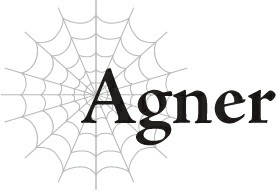

# Agner

Số mệnh.

Ý nghĩ cho rằng con đường của chúng ta đã được định đoạt sẵn từ khoảnh khắc chúng ta sinh ra và chúng ta không thể đi chệch khỏi nó.

Dù tốt hay xấu, vạn vật đều do số mệnh quyết định.

Thật là một cách nghĩ ngớ ngẩn.

Nhưng trong khi nó không hẳn là số mệnh theo đúng nghĩa đen, thì vẫn thực sự tồn tại một dòng chảy sự kiện nhất định không thể bất tuân.

Tôi đã dành cả cuộc đời mình để chiến đấu chống lại dòng chảy đó.

Cụ thể, tôi đã chiến đấu để giữ cho ma tộc không lao đầu vào sự hủy diệt, với hy vọng rằng một số người trong chúng tôi vẫn có thể sống sót.

Chắc chắn, bây giờ tôi là một trong những cựu binh lớn tuổi nhất trong số những người dân của mình, nhưng tất nhiên đã từng có thời tôi cũng trẻ tuổi và thiếu kinh nghiệm.

Ngay cả khi đó, ma tộc vốn đã ở trên bờ vực tuyệt chủng.

Cuộc chiến truyền kiếp chống lại loài người đang đẩy chúng tôi đến chỗ diệt vong.

Sự khác biệt về dân số của hai bên đơn giản là quá lớn.

Ngay cả khi ma tộc có các chỉ số tốt hơn con người, cuộc chiến này đã tiếp diễn quá lâu đến mức ngay cả các cuốn sách lịch sử cũng không thể xác định chính xác nó bắt đầu từ khi nào, nên việc cán cân bắt đầu nghiêng về phía chủng tộc có số lượng vượt trội là điều không thể tránh khỏi.

Nếu chúng tôi tiếp tục chiến đấu với con người, thất bại của chúng tôi chỉ là vấn đề thời gian.

Thực tế, ngay cả khi chúng tôi không làm gì cả, ma tộc cũng đã vượt quá giới hạn có thể phục hồi.

Tất cả những gì chúng tôi có thể làm là trì hoãn điều không thể tránh khỏi.

Ấy vậy mà, dường như không ai ngoài tôi nhận ra điều này.

Không, có lẽ một số người thực sự đã nhận ra và từ chối thừa nhận sự thật.

Tương lai đã được định hình vững chắc như đá...

Nhưng nó vẫn chưa thực sự diễn ra.

Thảm kịch này có thể là không thể tránh khỏi, nhưng nó sẽ không xảy ra trong thế hệ của chúng tôi.

Đối với hầu hết mọi người, việc đơn giản là tiếp tục đi trên cùng một con đường sẽ dễ dàng hơn.

Sự thay đổi luôn rất khó chấp nhận, bất kể ở thời đại nào.

Và vì những thay đổi cần thiết đều dựa trên việc thừa nhận sự hủy diệt cuối cùng của chúng tôi, nên không có gì ngạc nhiên khi những ma tộc khác muốn nhắm mắt trước sự thật.

Trên hết, Ma Vương sẽ không cho phép bất kỳ sự thay đổi nào như vậy.

Ma Vương là một con rối của hệ thống.

Một vật tế thần, người ta thậm chí có thể nói như vậy: một kẻ gánh tội độc ác có nhiệm vụ ép buộc ma tộc phải tiếp tục chiến đấu với con người.

Tôi thực sự thương hại những người mang tước hiệu Ma Vương, vì họ bị căm ghét không chỉ bởi kẻ thù truyền kiếp là con người mà ngay cả bởi chính những ma tộc đồng bào của họ.

Tuy nhiên, ma tộc không thể phớt lờ tầm ảnh hưởng của Ma Vương, và chính vì Ma Vương mà ma tộc không thể dừng cuộc chiến chống lại loài người.

Vận mệnh của thế giới được ưu tiên hơn vận mệnh của ma tộc.

Tôi đoán điều đó cũng tự nhiên thôi.

Thế giới sẽ tiếp tục tồn tại ngay cả khi ma tộc tuyệt chủng, nhưng ma tộc không thể sống sót nếu thiếu chính thế giới này, nên rõ ràng bên nào cần được ưu tiên hơn.

Thật khó để chấp nhận, vì nó ép buộc chúng tôi phải bước đi trên con đường hủy diệt, nhưng trong bức tranh toàn cảnh hơn, đó chỉ là một chuyện vặt vãnh.

Ma tộc hiểu điều đó, đó là lý do tại sao chúng tôi luôn tuân theo Ma Vương, ngay cả khi nhiều người trong chúng tôi bất mãn về chuyện đó.

Chúng tôi không có lựa chọn nào khác.

Ngay cả tôi cũng chỉ có thể tìm cách giảm thiểu tổn thất trong khi tiếp tục cuộc chiến, đồng thời chôn giấu những cảm xúc đáng xấu hổ đó trong lòng.

Có phải số phận của tôi là chỉ ngồi nhìn chủng tộc của mình tiếp tục hành quân về phía hủy diệt của chính nó sao?

Khi tôi cố gắng chiến đấu chống lại một dòng chảy mà tôi biết là không thể kháng cự, tôi đã tràn ngập sự tức giận, đau buồn, và cuối cùng là sự từ bỏ.

Nhưng tất cả đã thay đổi khi một thời đại mới không ngờ tới mở ra: một thời đại không có ma vương.

Ma Vương là người cai trị của ma tộc và đồng thời là người phát ngôn cho hệ thống.

Mục đích duy nhất của Ma Vương là thông báo cho ma tộc biết lý do tại sao họ phải tiếp tục chiến đấu chống lại loài người.

Sự thật là ma tộc không chỉ đơn thuần tuân theo tầm ảnh hưởng mạnh mẽ của Ma Vương — chúng tôi đang nuốt cay đắng và tiếp tục chiến đấu vì chúng tôi đã biết được sự thật khủng khiếp của hệ thống.

Tất nhiên, đó chỉ là trường hợp của những ma tộc cấp cao nhất mới có thể được diện kiến Ma Vương.

Nhưng như thế là quá đủ rồi.

Ngay cả bây giờ, tôi vẫn nhớ khuôn mặt của vị Ma Vương trước đây, méo mó vì sự điên loạn.

“Chúng ta phải chuộc lỗi...”

Vị Ma Vương trước đây thường xuyên lặp lại điều này.

Ông ấy đã thay đổi hoàn toàn sau khi có được tước hiệu Ma Vương.

Chính xác là vì kỹ năng [Cấm kỵ] cấp 10 đi kèm với nó.

Vị Ma Vương đó trông ngày càng hốc hác qua từng ngày, gửi chúng tôi vào trận chiến và thậm chí tự mình chiến đấu trên tiền tuyến, như thể đang tuyệt vọng chạy trốn khỏi một thứ gì đó.

Cho đến nay, rất ít người còn lại biết được người đàn ông đó đã dịu dàng thế nào trước khi trở thành một ma vương đáng sợ và áp đảo như vậy.

Nhưng việc trực tiếp chứng kiến những thay đổi đó khiến tôi khó có thể coi những sự thật về hệ thống mà ông ấy kể cho chúng tôi chỉ là những lời lảm nhảm của một kẻ điên.

Do đó, các ma tộc cấp cao đã tuân theo ông ấy, và thế là những kẻ dưới quyền họ cũng làm theo.

Chúng tôi bắt buộc phải làm vậy, ngay cả khi biết rằng điều đó một ngày nào đó sẽ đồng nghĩa với sự hủy diệt của chủng tộc chúng tôi.

Đó là cách mọi thứ được định sẵn để diễn ra.

Nhưng rồi vị Ma Vương đó biến mất, và không có người phát ngôn cho hệ thống dẫn dắt họ, nhận thức của ma tộc bắt đầu thay đổi.

Nhiều người cuối cùng đã nhận ra rằng chúng tôi không thể đủ khả năng tiếp tục chiến đấu với con người.

Cho đến lúc đó, sự điên loạn của Ma Vương đã đẩy chúng tôi vào việc tiếp tục cuộc chiến, nhưng không có ông ấy dẫn dắt, chúng tôi đã lấy lại được lý trí của mình.

Một khi không còn vị ma vương nào gào thét rằng thế giới sẽ lâm nguy nếu cuộc chiến không tiếp tục, thì việc lo lắng về mối nguy hiểm trước mắt rõ ràng hợp lý hơn nhiều so với một tương lai giả định xa vời nào đó.

Và thế là, trong một thời đại không có ma vương, chúng tôi đã hạn chế chiến đấu với loài người nhiều nhất có thể và tập trung vào việc phục hồi đất nước của mình.

Lần đầu tiên, thời gian đứng về phía tôi.

Điều đó là quá đủ để tắm mát tia hy vọng vốn đã gần như tắt ngấm của tôi bằng một luồng sáng mới.

Tốt hơn nữa, vị Ma Vương tiếp theo gần như chắc chắn sẽ là tôi.

Với việc Ma Vương mất tích, và biết rằng tôi là người kế nhiệm tiềm năng nhất, chúng tôi có thể tập trung vào việc hồi phục cho ma tộc trong suốt hai thế hệ và cải thiện đáng kể khả năng sống sót của mình.

Dù vậy, đó vẫn chỉ đơn giản là trì hoãn điều không thể tránh khỏi.

Và cũng có khả năng đáng sợ là tôi có thể thay đổi như người tiền nhiệm của mình một khi trở thành Ma Vương.

Nhưng tôi đã chuẩn bị cho khả năng đó bằng cách chỉ thị cho các phụ tá đáng tin cậy của mình giam giữ tôi lại và tiếp tục làm việc hướng tới sự phục hưng của chủng tộc chúng tôi nếu tôi thay đổi mạnh mẽ. Tôi thậm chí còn chuẩn bị sẵn một phòng giam cho việc tự giam lỏng chính mình.

Tôi muốn sẵn sàng cho mọi khả năng.

Nhưng rồi tôi đã bị chặn đứng bởi một cú sốc mà tôi không bao giờ có thể dự đoán được.

Nếu chỉ riêng điều đó là vấn đề, thì tôi chỉ đơn giản gọi đó là một sự tính toán sai lầm, chứ không phải một cú sốc.

Phương thức lựa chọn Ma Vương của hệ thống là không rõ ràng.

Tôi được nhiều người coi là người đủ điều kiện nhất, nhưng điều đó không có nghĩa là không có những ứng cử viên xứng đáng khác. Balto, chẳng hạn, có thể là một khả năng.

Nhưng vị Ma Vương được lựa chọn lại không phải là bất kỳ ai tôi từng hình dung.

Thực tế, đó là người tôi thậm chí chưa bao giờ biết đến sự tồn tại.

Không, điều đó là sai. Tôi đã từng nghe nói về họ.

Với tư cách là một nhân vật trong truyện cổ tích, đúng là như vậy.

Thần Thú cổ xưa nhất phục vụ nữ thần: đó chính là vị Ma Vương hiện tại của chúng tôi, Ariel đại nhân.

Ngài ấy là nhân vật trong truyền thuyết, người mà ngay cả sự tồn tại của ngài ấy tôi cũng từng nghi ngờ.

Ngay cả khi ngài ấy từng tồn tại, việc ngài ấy có thể sống sót cho đến thời hiện đại dường như lại càng bất khả thi hơn.

Thực tế, ngài ấy sở hữu ngoại hình của một cô bé, nên ai sẽ tin khi ngài ấy đột nhiên xuất hiện và tự xưng là Ma Vương chứ?

Thành thật mà nói, phản ứng đầu tiên của tôi là sự bối rối hơn là sự hoài nghi.

Đứa trẻ xa lạ này từ đâu ghé thăm, tuyên bố rằng mình đã trở thành Ma Vương và thậm chí còn đi xa đến mức tuyên bố rằng mình thực sự là Thần Thú trong truyền thuyết? Thật lố bịch.

Nhưng ngài ấy chắc chắn đã dự đoán được phản ứng đó, vì ngài ấy đã đưa cho tôi một viên Đá Thẩm định và yêu cầu tôi Thẩm định ngài ấy.

Khi nhìn thấy kết quả, tôi không còn có thể nghi ngờ những lời tuyên bố của ngài ấy nữa.

Các chỉ số của ngài ấy, tất cả đều quanh mức 90.000 hoặc cao hơn.

Danh sách khổng lồ các kỹ năng mạnh mẽ khác nhau của ngài ấy.

Người ta nói rằng bất kỳ ai có chỉ số vượt quá 1.000 đã nằm trong cảnh giới của những huyền thoại rồi.

Chỉ một tỷ lệ nhỏ nhất của con người từng đạt đến cột mốc đó, và ngay cả ma tộc cũng không thể làm được điều đó dễ dàng, dù các chỉ số của chúng tôi tự nhiên cao hơn.

Đã có một số ít ngoại lệ, chủ yếu là các anh hùng và ma vương, những người đạt được gấp đôi hoặc có thể là gấp ba con số đó.

Nhưng tôi chưa bao giờ nhìn thấy hay thậm chí nghe nói về bất kỳ ai có chỉ số năm chữ số, chứ đừng nói đến sáu chữ số.

Số lượng kỹ năng của ngài ấy cũng gấp nhiều lần so với bất kỳ binh sĩ bình thường nào.

Nhưng điều đáng sợ hơn cả số lượng chính là chất lượng.

Cấp độ kỹ năng càng cao, việc nâng cấp nó càng trở nên khó khăn hơn.

Có thể mất nửa đời người huấn luyện chỉ để nâng một kỹ năng duy nhất lên cấp độ tối đa. Nếu không có tài năng thiên bẩm, nhiều người thậm chí không thể thực hiện được điều đó một lần nào.

Và có một số kỹ năng được coi là không thể nâng lên mức tối đa, ngay cả khi người ta có tài năng thiên bẩm cho việc đó.

Ấy vậy mà, số lượng kỹ năng ngài ấy sở hữu ở cấp độ cao nhất là điều không tưởng.

Tôi đã vô cùng sửng sốt.

Chưa bao giờ tôi nghi ngờ đôi mắt của mình nhiều như ngày hôm đó.

Tôi cũng chưa bao giờ cảm thấy tuyệt vọng như vậy.

Tôi đã cố gắng hết sức để dự đoán và chuẩn bị cho mọi khả năng trong nỗ lực hồi phục cho chủng tộc của mình.

Nhưng việc Ariel đại nhân được bổ nhiệm làm Ma Vương nằm ngoài bất kỳ điều gì tôi có thể tưởng tượng.

Tôi vừa mới bắt đầu nhìn thấy ánh sáng ở cuối đường hầm. Nhưng rồi tôi đã bị đẩy vào vực thẳm của bóng tối bởi tuyên bố chiến tranh toàn diện của Ariel đại nhân chống lại loài người.

Các Ma Vương trước đây có thể là vật tế thần của hệ thống, nhưng họ vẫn bảo vệ sự tồn tại của ma tộc đến cùng.

Nhưng Ariel đại nhân không hề ngần ngại ném tất cả những điều đó sang một bên.

Ariel đại nhân chính là Ma Vương, không còn nghi ngờ gì nữa.

Và đối với tôi, ngài ấy cũng là kẻ mang lại tuyệt vọng.

Sức mạnh cá nhân tuyệt đối của ngài ấy giúp ngài ấy chắc chắn là thực thể mạnh nhất trên thế giới.

Những thực thể duy nhất có thể hy vọng chống lại ngài ấy chỉ có các quản trị viên hoặc những kẻ như Potimas.

Với sức mạnh khủng khiếp đó, ngài ấy đe dọa sẽ dồn ma tộc chúng tôi đến điểm kết thúc cuối cùng.

Nếu đó không phải là sự tuyệt vọng thực sự, thì là gì chứ?

Chúng tôi không thể phủ nhận ngài ấy, kẻo ngài ấy sẽ quay nanh vuốt của mình vào chúng tôi thay thế.

Ariel đại nhân sẽ không ngần ngại làm như vậy.

Từ khoảnh khắc Ariel đại nhân trở thành Ma Vương, chỉ còn lại hai lựa chọn duy nhất.

Phải là một trong hai: tiến hành cuộc chiến toàn diện chống lại loài người như Ariel đại nhân yêu cầu hoặc cố gắng chiến đấu với chính Ma Vương.

Tôi đã chọn vế sau.

Hãy để tôi thành thật: Đó là một sai lầm.

Tôi muốn đối mặt với ai hơn: Ariel đại nhân hay toàn thể nhân loại?

Thoạt nhìn, một số người có thể cho rằng việc đánh bại một cá nhân chắc chắn phải dễ dàng hơn việc đối đầu với cả một chủng tộc.

Nhưng không. Điều đó chắc chắn là sai lầm.

Một ma vương hay anh hùng có thể dễ dàng một mình cân cả một đội quân.

Đó chính là ý nghĩa của việc sở hữu các chỉ số cao hơn theo cấp số nhân.

Và chỉ số của Ariel đại nhân dễ dàng gấp mười lần so với bất kỳ ma vương hay anh hùng nào khác.

Một đội quân sao? Điều đó chẳng là gì đối với ngài ấy cả.

Ngài ấy rất có thể tự tay hủy diệt toàn bộ thế giới một mình.

Ngay cả khi ma tộc bằng cách nào đó kết hợp lực lượng với nhân loại và thách thức ngài ấy, tôi không thể hình dung nổi chúng tôi sẽ giành chiến thắng bằng cách nào.

Nếu việc chiến đấu với Ariel đại nhân là giải pháp thay thế, người ta sẽ có cơ hội chiến thắng cao hơn trước toàn thể nhân loại.

Tôi hiểu điều đó, và dù vậy, tôi vẫn đưa ra nước đi sai lầm.

Tôi không còn lựa chọn nào khác ngoài việc làm như vậy.

Ngay cả khi chúng tôi đánh bại nhân loại, ma tộc cuối cùng vẫn sẽ bị hủy diệt chừng nào Ariel đại nhân vẫn là Ma Vương.

Và đây không phải là số phận xa vời để các thế hệ tương lai phải lo lắng mà là một thảm kịch đang cận kề ngay trước mắt.

Tôi tiếp tục chiến đấu chống lại dòng chảy, cố gắng trì hoãn sự diệt vong của ma tộc bằng mọi cách cần thiết.

Số phận đen tối đó, thứ mà tôi từng cho rằng sẽ không bao giờ xảy ra trong cuộc đời mình, giờ đây đang rình rập gần hơn bao giờ hết.

Tôi không thể chấp nhận điều đó. Làm khác đi sẽ là thừa nhận mọi thứ tôi đã làm trong đời đều là vô ích.

Về mặt lý trí, tôi biết điều đó là không khôn ngoan, nhưng đây là một vấn đề vượt ra ngoài lý trí.

Tình thế của tôi đang nhanh chóng tiến gần đến chiếu tướng.

Tôi phải làm điều gì đó để cố gắng tránh nó, ngay cả khi tôi biết đó là nước đi sai lầm.

Và đúng như tôi dự đoán, nó đã không kết thúc tốt đẹp.

Kế hoạch cuối cùng của tôi lẽ tự nhiên đã kết thúc bằng thất bại.

Thực tế, nó còn tồi tệ hơn những gì tôi có thể dự đoán.

Tôi đã cố gắng thành lập một đội quân nổi dậy với cựu Chỉ huy Quân đoàn 7 Warkis đứng đầu, và tôi thậm chí còn lôi kéo cả Potimas, mối liên hệ mà tôi nghĩ là có cơ hội tốt nhất để đối phó với Ariel.

Ý định của tôi là để họ đối đầu với nhau, nhưng đội quân nổi dậy đã bị nghiền nát trước khi nó có thể được tập hợp đầy đủ, và Potimas đã rút lui trước khi tạo ra bất kỳ đóng góp lớn nào.

Không những không chiến đấu với nhau, Ariel đại nhân thậm chí không hề bước ra ngoài lâu đài của mình lấy một bước.

Ngài ấy không cần thiết phải làm vậy.

Kế hoạch của tôi đã thất bại trong việc đánh bại Ariel đại nhân — nó thậm chí không thể lay chuyển ngài ấy dù chỉ một chút.

Tồi tệ hơn nữa, ngài ấy biết rằng tôi chính là người đứng sau đội quân nổi dậy và sự tham gia của Potimas.

Với việc đó, con đường duy nhất còn lại phía trước là đánh bại loài người.

Đó là một sự thương hại nhỏ khi tôi không bị giết ngay tại chỗ.

...Mặc dù tôi bị cám dỗ hỏi liệu đó có thực sự là một sự thương hại không?

Chừng nào tôi còn sống, tôi có thể làm mọi thứ trong khả năng của mình để trì hoãn sự diệt vong của ma tộc.

Nhưng điều đó đã trở nên khó thực hiện hơn bao giờ hết.

Chừng nào Ariel đại nhân còn nắm quyền, sự tuyệt chủng của chúng tôi không thể tránh khỏi.

Ariel đại nhân đã sống từ thời cổ đại và có khả năng sẽ tiếp tục sống sót vào tương lai xa xôi.

Và thực thể gần như bất tử này tiếp tục ép buộc ma tộc vào chiến tranh.

Sự hủy diệt không thể tránh khỏi.

Tôi không thể ngăn cản nó; tôi không đủ mạnh mẽ.

Có ý nghĩa gì trong việc tiếp tục đấu tranh, khi biết rằng bất cứ điều gì tôi cố gắng làm đều sẽ kết thúc trong vô vọng không?

Chẳng phải sẽ là một cái kết tốt hơn nếu bị hành quyết ngay tại chỗ, thất bại của tôi được định đoạt sao?

Chẳng có ích gì khi tự hỏi.

Tôi vẫn còn sống.

Lựa chọn duy nhất của tôi là tiếp tục làm những gì tôi nghĩ là tốt nhất.

Sự thay đổi ngày càng trở nên khó khăn hơn theo tuổi tác.

Cuối cùng, tôi chắc chắn mình sẽ chỉ tiếp tục chiến đấu vô vọng chống lại dòng chảy cho đến khi nhắm mắt xuôi tay.

Sẽ không có cái kết huy hoàng nào chờ đợi tôi cả.

Tốt hơn hết, hãy bò lên phía trước qua vũng bùn, nghiến răng cho đến hơi thở cuối cùng.

“......”

Một người đàn ông đang đứng lườm bức tường thành pháo đài ở phía xa.

“Bình tĩnh lại đi, Bloe.”

“Tôi đang rất bình tĩnh đây, chết tiệt.”

Bất chấp câu trả lời của mình, Bloe đang dậm chân một cách thiếu kiên nhẫn.

Không ai có thể nhầm lẫn điều này với một dấu hiệu của sự điềm tĩnh.

“Tâm trạng tồi tệ sẽ không giúp cải thiện tình thế của chúng ta đâu. Với tư cách là một tướng quân, một phần công việc của cậu là làm một tấm gương điềm tĩnh cho cấp dưới của mình. Nhìn xung quanh cậu xem. Các binh sĩ của cậu không phải đã đủ lo lắng rồi sao?”

Bloe quét qua nét mặt của những người lính của mình.

Rõ ràng, sự bồn chồn của cậu ta chỉ càng làm trầm trọng thêm sự lo lắng của họ.

Trạng thái của một người lãnh đạo được phản chiếu ở những người đi theo anh ta.

Điều quan trọng là phải duy trì thái độ và biểu cảm điềm tĩnh vào mọi lúc.

“...Lỗi của tôi.”

Nhận ra sự lo lắng của mình đang gây ra ảnh hưởng tiêu cực đến binh lính, Bloe xin lỗi một cách vụng về.

“Chà. Dù sao thì các binh sĩ trên tiền tuyến của cậu cũng không thể nhìn thấy trạng thái thảm hại này của cậu được.”

“Hừ!”

Bloe gầm gừ để che giấu sự xấu hổ của mình.

Quân đoàn 7 của Bloe và Quân đoàn 1 của tôi hiện đang tấn công Pháo đài Kusorion: một pháo đài đặc biệt kiên cố neo giữ phòng tuyến phòng thủ chính của nhân loại và cũng chiếm giữ một vị trí chiến lược vô cùng quan trọng.

Tầm quan trọng của nó là điều dễ thấy, xét đến việc chúng tôi đang tấn công bằng hai quân đoàn, trong khi tất cả các pháo đài biên giới khác đều chỉ được giao cho mỗi quân đoàn một nơi.

Tuy nhiên, lúc này chỉ có Quân đoàn 7 là thực sự đang tấn công.

Hơn nữa là theo một cách liều lĩnh đơn giản là tự mời gọi thương vong.

Tất nhiên, sẽ có rất nhiều tổn thất về phía chúng tôi nếu làm theo chiến lược hiện tại.

Pháo đài Kusorion không phải là nơi có thể bị chinh phục trong một ngày. Nó đã đẩy lùi các cuộc xâm lăng của ma tộc trong nhiều năm qua, đạt được vô số đợt mở rộng và cải tiến công sự phòng thủ trên đường đi.

Chinh phục một pháo đài như vậy bình thường sẽ đòi hỏi quân số gấp vài lần phe phòng thủ, và ngay cả khi đó, cuộc chiến sẽ kéo dài trong nhiều tháng hoặc thậm chí nhiều năm.

Nhưng tất nhiên, ma tộc không có đủ dân số để triển khai một lực lượng xâm lược lớn như vậy, và lợi thế về chỉ số của chúng tôi chẳng giúp ích được gì nhiều trước một loạt các bức tường thành kiên cố.

Và chúng tôi khó có thể ở vị trí để dấn thân vào một trận chiến kéo dài nhiều năm.

Chúng tôi có một số nhu yếu phẩm từ việc áp đặt mức thuế chiến tranh cao lên người dân, nhưng loài người chắc chắn có nhiều thứ dư thừa hơn nhiều, và khả năng sản xuất thêm nhu yếu phẩm của chúng tôi bị giới hạn rất lớn.

Và trong khi ma tộc chúng tôi đã cưỡng bách nhập ngũ quá nhiều dân số đến mức không thể duy trì được lâu, loài người có thể dễ dàng kêu gọi viện trợ từ các nước khác và có được bất kỳ lượng viện binh nào.

Nói tóm lại, chúng tôi không có cơ hội giành chiến thắng trong một trận chiến kéo dài.

Do đó mới có chiến lược ngắn hạn này.

Tuy nhiên, cuộc tấn công liều lĩnh của chúng tôi đang gặp phải sự kháng cự đáng kể, và tổn thất của Quân đoàn 7 đã rất nặng nề rồi.

Nhiệm vụ của họ không phải là mở đường cho chúng tôi bằng một cuộc tấn công tự sát.

Không, mục đích của Quân đoàn 7 là làm mồi nhử để dụ kẻ thù ra ngoài.

Nhận tổn thất nặng nề nhưng sẽ bắt kẻ thù phải trả giá.

Trong khi đó, Quân đoàn 1 sẽ bảo toàn sức mạnh cho đến khi trận chiến khốc liệt này dịu đi.

Trái tim tôi hướng về Quân đoàn 7 vì sự hy sinh của họ, nhưng chúng tôi không còn lựa chọn nào khác.

Bloe cũng biết tất cả những điều này, đó là lý do tại sao cậu ta đang miễn cưỡng đi theo chiến lược này bất chấp cái giá phải trả.

Quân đoàn 7, rốt cuộc, được cấu thành từ những binh sĩ có liên quan đến cuộc nổi dậy trước đó.

Vì âm mưu bị phát hiện và nghiền nát từ lâu trước khi nó có thể được đưa vào hành động, họ thực tế chưa bao giờ có cơ hội để nổi loạn. Một sự ngụy biện nhỏ, nhưng kết quả là thủ lĩnh của họ, Warkis, đã bị hành quyết, trong khi các binh sĩ không bị trừng phạt.

...Ít nhất, không phải là chính thức.

Bạn có thể đoán được Quân đoàn 7 thực sự đang bị đối xử thế nào qua thực tế là họ đã bị đẩy lên tiền tuyến làm mồi nhử.

Về cơ bản, những binh sĩ muốn nổi loạn này là những xác sống, chỉ là những quân cờ tốt thí.

Bằng cách giao họ cho Bloe, người luôn phản đối Ariel đại nhân, ngài ấy đã tập hợp tất cả những kẻ bất đồng chính kiến của mình vào một đơn vị.

Vì Warkis và Nereo đã bị hành quyết, và tôi đã bày tỏ sự phục tùng của mình với Ariel đại nhân, điều đó đáng lẽ phải rõ ràng với bất kỳ ai có nửa bộ não rằng nổi loạn chống lại Ariel đại nhân là một hành động ngu xuẩn.

Bất kỳ ai không hiểu điều đó hiện đang nằm dưới quyền chỉ huy của Bloe.

Tất cả những chuyện này đều rất cố ý.

Dù Bloe cố gắng dẫn dắt họ vào một cuộc nổi loạn hay bị ép buộc phải cúi đầu trước Ariel đại nhân, ngài ấy đều giành chiến thắng bất kể thế nào.

Nếu họ nổi loạn, ngài ấy có thể nghiền nát họ để làm gương và sử dụng họ để bổ sung năng lượng cho hệ thống; nếu họ cúi đầu, họ chỉ đơn giản là sẽ bị nghiền nát trong trận chiến thay thế.

Cho đến nay, Bloe đã phải giữ cho họ luôn trong tầm kiểm soát, xoay xở đưa họ vào một quân đội chỉ để hy sinh họ ở đây.

Cậu ta chắc chắn là một nhà lãnh đạo lành nghề.

Nhưng Bloe quá xúc động và đã quá cởi mở trong sự thách thức của mình đối với Ariel đại nhân.

Thật bi kịch và cũng thật phù hợp khi sự ngu ngốc của cậu ta đã bị lợi dụng để chống lại chính mình, ép buộc cậu ta phải dẫn dắt một đội quân gồm những quân cờ tốt thí.

Nhưng ngay cả khi bị dồn vào chân tường và được giao những nhiệm vụ đau lòng như vậy, Bloe vẫn tiếp tục dẫn dắt Quân đoàn 7 với sự quyết tâm.

Cậu ta là một người đàn ông kiên định và đầy nhiệt huyết.

Đó là lý do tại sao cậu ta lo lắng cho Quân đoàn 7 tốt thí từ tận đáy lòng mình, thương tiếc cái chết của họ, và sục sôi với sự giận dữ và lo lắng.

Hy vọng rằng họ sẽ dụ được kẻ thù ra ngoài càng nhanh càng tốt.

“Bloe. Có vẻ như chúng đã cắn câu rồi.”

Và thế là tôi cập nhật cho cậu ta ngay khi tôi nhận ra.

“!”

“Chuẩn bị đi.”

Bloe ngước nhìn lên nhanh chóng, và tôi đưa ra mệnh lệnh nhanh cho cậu ta.

Mục tiêu của họ đã được hoàn thành.

Nhưng đó chỉ là bước đầu tiên mà thôi.

Chúng tôi đã thành công trong việc dụ kẻ thù ra ngoài chỉ với tổn thất lớn đối với Quân đoàn 7.

Và trận chiến thực sự bắt đầu ngay bây giờ.

Chúng tôi phải đánh bại kẻ thù mà chúng tôi đã dụ ra ngoài thực địa, nếu không chúng tôi không thể chiến thắng.

“Anh hùng đã đến rồi.”

Anh hùng: niềm hy vọng lớn nhất của nhân loại.

Chúng tôi phải hạ gục cậu ta tại đây và đập tan tinh thần của con người.

Tôi đã không thể đánh bại Ariel đại nhân, vị Ma Vương.

Và bây giờ tôi phải thực hiện một vụ cá cược đầy rủi ro khác.

Nhưng tôi không có lựa chọn nào khác ngoài việc đánh bạc, ngay cả khi tỷ lệ cược đang chống lại tôi.

Giống như Bloe, tôi đang hướng tới một thảm họa do chính tôi tạo ra.

**PHÁO ĐÀI KUSORION TRẬN CHIẾN TIÊU ĐIỂM!**

Chào mừng quay trở lại với chuyên mục White Giải Thích Tất Tần Tật!

Đại tá và Thằng Vô Lại đang tấn công một pháo đài được bao quanh bởi... không có gì cả!

Cái gì cơ? Phải có thứ gì đó chứ, bạn nói thế sao?

Chậc, chậc, chậc.

Thực tế là không có gì chính là điều đặc biệt về nó đấy!

Một cánh đồng bằng phẳng không có đặc điểm đặc biệt nào đồng nghĩa với việc binh lính rất dễ hành quân qua đây.

Bất kỳ vị trí nào dễ dàng cho một đội quân lớn chọc thủng đều là vị trí quan trọng!

Đối với phe loài người, đó là nơi họ phải giữ vững phòng tuyến bằng mọi giá.

Nếu không, cả một đội quân lớn có thể hiên ngang tiến thẳng vào trong.

Họ phải bảo vệ nơi này đến chết, bất kể chuyện gì xảy ra với các pháo đài khác.

Đó chính là Pháo đài Kusorion một cách ngắn gọn!

Đó là lý do tại sao chúng tôi gửi cả hai quân đoàn khổng lồ đến để chinh phục pháo đài vô cùng quan trọng này.

Phe bên kia cũng vậy — có vẻ như loài người đã bố trí nhiều người hơn để bảo vệ nơi này.

Trên hết, họ sở hữu lực lượng chiến đấu mạnh nhất của mình tại pháo đài này: Anh hùng.

Vì vậy, ở một góc chúng ta có Đại tá, người mạnh nhất trong số các ma tộc thông thường, và ở góc kia là Anh hùng, biểu tượng hy vọng của nhân loại.

Nói về một cuộc đọ sức lớn.

Bạn thậm chí có thể nói rằng trận chiến này sẽ quyết định kết quả của cuộc chiến.

Ngay cả tôi cũng đang đứng ngồi không yên ở đây này!

...Mà này, cái pháo đài này có cái tên nghe bựa thật đấy, nhỉ?

---

[◀ Chương trước: Hawkin](14_hawkin.md) | [Chương tiếp theo: Jeskan ▶](16_jeskan.md)
