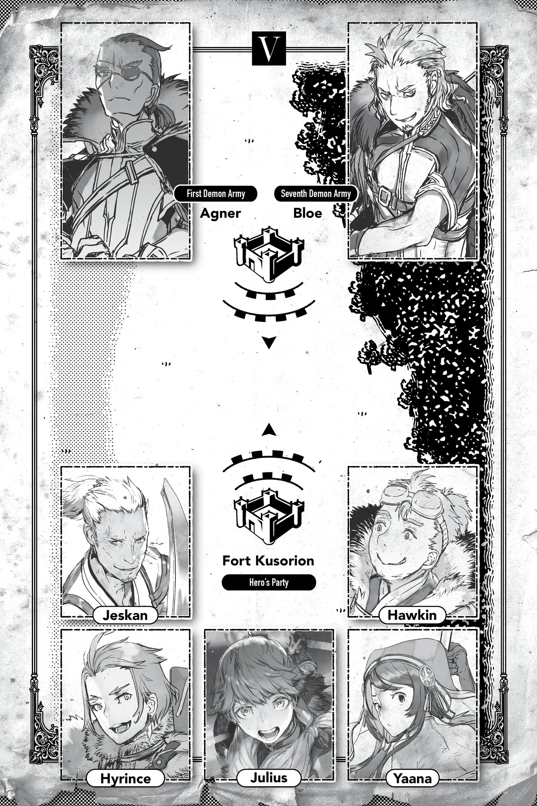

# Jeskan

Tôi trở thành mạo hiểm giả hoàn toàn là do ngẫu nhiên.

Cứ gọi đó là một sự trùng hợp nếu bạn muốn.

Chỉ là cách nhanh nhất để một thằng nhóc vô danh tiểu tốt kiếm được tiền là làm mạo hiểm giả — đó là lý do duy nhất.

Tôi sinh ra ở một nơi hẻo lánh.

Bạn thậm chí còn không thể gọi đó là một ngôi làng. Nó chỉ là vài túp lều lụp xụp tồi tàn tụm lại một chỗ.

Không có tường thành để ngăn cản quái vật, chỉ có một hàng rào gần như vô dụng làm bằng vài cành cây khẳng khiu.

Nếu nơi đó bị quái vật hoặc băng đảng cướp tấn công, tất cả chúng tôi sẽ chết.

Nhưng vì lý do nào đó, không ai từng cố gắng rời đi. Mọi người đều cho rằng bằng cách nào đó mọi chuyện sẽ ổn thôi, chỉ đơn giản vì từ trước đến nay vẫn luôn như vậy.

Như thể điều đó có thể là sự thật vậy.

Vì tôi dường như là người duy nhất nhận ra điều đó, tôi đã rời nhà từ khi còn nhỏ và trở thành mạo hiểm giả.

Chắc chắn, ban đầu việc kiếm sống rất khó khăn.

Ý tôi là, lúc đó tôi chỉ là một đứa trẻ.

Công việc chính của một mạo hiểm giả là tiêu diệt quái vật, nhưng trẻ con thì không thể đảm đương nổi loại việc đó.

Khi một con quái vật giết người, cấp độ của nó sẽ tăng vọt, và đôi khi nó thậm chí còn tiến hóa.

Đó là lý do tại sao có những quy tắc được đặt ra để ngăn các mạo hiểm giả bỏ mạng.

Vai trò của hiệp hội mạo hiểm giả là phân bổ các công việc thích hợp để trẻ em và những người mới vào nghề không nhận bất kỳ việc gì quá sức mình.

Nghĩa là dù ai cũng có thể làm mạo hiểm giả, nhưng không phải ai cũng có thể kiếm được tiền từ việc đó.

Những công việc được trả lương cao nhất là săn lùng quái vật, nhưng trẻ con rõ ràng không được phép làm những việc đó, nên ban đầu tôi chỉ nhận được những công việc lặt vặt và chạy vặt.

Tôi chạy đôn chạy đáo suốt cả ngày trời, chỉ kiếm đủ tiền để trả cho thức ăn và chỗ trọ qua đêm.

Và mọi chuyện cứ thế diễn ra trong một thời gian.

Không có gì lạ khi những đứa trẻ lang thang đường phố trở thành mạo hiểm giả như tôi đã làm.

Trong hầu hết các trường hợp, những đứa trẻ đó không thể duy trì lối sống đó lâu và cuối cùng đành phải tìm đến những tội lỗi vặt vãnh như móc túi để thay thế.

Nghe có vẻ hơi ngớ ngẩn, nhưng với một lần ra tay thành công, một kẻ móc túi lành nghề có thể có được số tiền tương đương với cả một ngày làm việc lương thiện.

Không có gì ngạc nhiên khi rất nhiều đứa trẻ cuối cùng lại chọn con đường đó khi thấy nó ít gian khổ hơn nhiều.

Ngay cả khi không phải tất cả chúng đều có thể sống sót đến năm sau.

Chắc chắn, móc túi có thể là một cách dễ dàng để kiếm tiền, nhưng cái giá phải trả là hủy hoại phần đời còn lại của bạn.

Những đứa trẻ đó chế giễu tôi vì đã kiên trì làm công việc lương thiện cực khổ, nhưng đối với tôi, chúng mới là những kẻ ngu ngốc.

Không phải tôi tránh móc túi vì nó là xấu, thực sự đấy. Chỉ là nó không đáng để đánh đổi.

Bạn có thể có được tiền trong ngắn hạn, nhưng khả năng cao là bạn sẽ phải bóc lịch trong tù về lâu về dài.

Rất nhiều đứa trẻ trong số chúng vẫn tiếp tục làm vậy, với sự tự tin vô căn cứ rằng mình sẽ không bao giờ bị bắt, nhưng điều đó rõ ràng là không đúng.

Giống như những người ở quê hương tôi, chúng tự phụ rằng mình là người đặc biệt, và tôi chịu không hiểu nổi tại sao.

Cuối cùng, quê hương tôi bị lũ cướp tiêu diệt, và không chừa một đứa trẻ móc túi nào là không bị bắt.

Tôi chưa bao giờ nghĩ mình là người đặc biệt. Tôi chỉ cố gắng tránh xa nguy hiểm.

Đó là sự khác biệt duy nhất giữa chúng và tôi.

Ai mà ngờ được tôi lại tiếp tục thành công với tư cách là một mạo hiểm giả và cuối cùng lại gia nhập tổ đội Anh hùng chứ?

Nếu bạn nói điều đó với tôi khi tôi còn là một đứa trẻ, tôi sẽ không bao giờ tin.

Ngay cả bây giờ, không ai ngạc nhiên về điều đó bằng chính tôi cả.

Tôi trở thành mạo hiểm giả do ngẫu nhiên, nhưng hóa ra, tôi đoán mình có năng khiếu với nghề này.

Mọi người gọi tôi là một chuyên gia có thể sử dụng đủ loại vũ khí, nhưng khi nghĩ về việc chuyện đó đã xảy ra thế nào, tôi không thể nhịn được cười.

Lý do duy nhất tôi giỏi sử dụng nhiều loại vũ khí khác nhau là vì tôi không có vũ khí của riêng mình.

Việc không có vũ khí làm sao lại dẫn đến việc biết cách sử dụng nhiều loại vũ khí như vậy chứ? Đó là điều hầu hết mọi người hỏi khi tôi kể cho họ nghe chuyện đó. Tất cả những gì nó thực sự có nghĩa là tôi đã sử dụng bất cứ thứ gì có được: vũ khí dùng lại của các mạo hiểm giả lớn tuổi hơn, những món bị hỏng đáng lẽ phải nằm trong đống phế liệu, những thứ đại loại thế.

Rốt cuộc, tôi không có tiền.

Ăn mày thì không có quyền đòi xôi gấc, nên tôi chỉ việc sử dụng bất cứ thứ gì trong tầm tay.

Vì chúng không được mua ở cửa hàng hay gì cả, nên không có thứ gì tôi chạm tay vào là bền lâu, thế là tôi đã tận dụng tối đa bất cứ thứ gì tìm được.

Dần dần, thu nhập của tôi bắt đầu ổn định, và vào thời điểm tôi có thể đủ tiền mua vũ khí thực sự, tôi đã có kinh nghiệm với đủ loại vũ khí rồi.

Nếu các mạo hiểm giả trẻ tuổi ngưỡng mộ tôi phát hiện ra sự thật nhàm chán này, họ chắc chắn sẽ rất đau lòng đấy.

Tôi nghe nói có một trào lưu trong số các tân binh là bắt chước tôi bằng cách sử dụng nhiều vũ khí.

Tôi không biết đó là điều tốt hay điều xấu nữa.

Ưu điểm và nhược điểm của việc sử dụng nhiều vũ khí là rất rõ ràng.

Một mặt, bạn có thể phản ứng với nhiều tình huống hơn.

Các kiểu tấn công khác nhau sẽ có hiệu quả với các loại quái vật khác nhau.

Chém, đập, đâm, giật: Mỗi kiểu đều hiệu quả hơn với một số kẻ thù nhất định và ít hiệu quả hơn với những kẻ khác.

Nếu bạn có thể ghi nhớ điều đó và sử dụng vũ khí phù hợp nhất với mục tiêu của mình, các trận chiến sẽ trở nên dễ dàng hơn nhiều.

Vậy nhược điểm là gì? Kỹ năng của bạn tăng chậm hơn, bạn phải mang theo cả đống vũ khí cồng kềnh, và việc giữ cho tất cả chúng luôn trong tình trạng tốt là một cực hình.

Rõ ràng, cách hiệu quả nhất để nâng cao cấp độ kỹ năng là chọn một loại vũ khí duy nhất và tiếp tục sử dụng nó. Nếu bạn sử dụng nhiều loại khác nhau, điều đó chỉ nghĩa là bạn có nhiều kỹ năng cần phải thăng cấp hơn, và bạn sẽ phải chia nhỏ kinh nghiệm của mình cho tất cả chúng.

Nếu tôi phải đấu kiếm với một mạo hiểm giả chỉ chuyên dùng kiếm, tôi có lẽ sẽ là người thua cuộc.

Rồi đến sự cồng kềnh.

Nếu bạn muốn đổi vũ khí tùy thuộc vào tình huống, điều đó nghĩa là bạn không có lựa chọn nào khác ngoài việc mang theo một đống vũ khí vào bất kỳ thời điểm nào.

Chuyện đó sẽ ổn nếu bạn có một chiếc túi có [Lưu trữ Không gian] hay gì đó tương tự, nhưng các vật phẩm [Ma pháp Không gian] thực sự rất đắt đỏ.

Nguồn cung thì ít mà nhu cầu thì vô kể, nên chúng được bán sạch ngay khi vừa tung ra thị trường, ngay cả khi giá cả cực kỳ cắt cổ.

Rồi giá cả lại càng tăng cao hơn, đó là một vòng lẩn quẩn.

Nhưng tôi tình cờ có một chiếc túi mà Hawkin đã mua được với giá hời, nên tôi có thể ra chiến trường mà không phải lo lắng về việc mang theo cả đống vũ khí lỉnh kỉnh.

Trước đó, tôi đã phải mang tất cả những thứ nặng nề đó trên lưng...

Tôi thực sự mắc nợ Hawkin vì chuyện đó.

Nhưng ngay cả khi vấn đề đó đã được giải quyết, tôi vẫn phải bảo dưỡng tất cả các vũ khí này liên tục, và chi phí không hề rẻ chút nào.

Vũ khí là công cụ bảo vệ mạng sống của bạn. Nếu bạn bỏ bê chúng và chúng bị gãy trong trận chiến, bạn có thể rơi vào nguy hiểm nghiêm trọng, vì vậy việc giữ cho chúng luôn trong tình trạng tốt nhất là rất quan trọng.

Tôi đã phải sử dụng rất nhiều vũ khí cũ bị hỏng khi mới bắt đầu, nên tôi biết chính xác nó có thể nguy hiểm như thế nào, để tôi nói cho bạn biết.

Những trải nghiệm đó đã tạo nên tôi của ngày hôm nay, nhưng tốt nhất là bạn nên sử dụng một vũ khí tử tế ngay từ đầu.

Sử dụng vài món vũ khí tử tế tốn kém rất nhiều tiền mặt.

Cả tiền mua lẫn tiền bảo dưỡng nữa.

Giá của một vũ khí tỷ lệ thuận với tính hiệu quả của nó.

Khi bạn là một mạo hiểm giả ở cấp độ của tôi, bạn phải sử dụng một số thứ có chất lượng khá tốt.

Nếu tôi sử dụng một vũ khí không thể chịu đựng được các chỉ số của mình, tôi sẽ phải thay thế nó sau mỗi cú vung.

Các mạo hiểm giả mạnh hơn gặt hái được lợi nhuận cao hơn, nhưng họ cũng phải chi tiêu nhiều hơn cho trang bị của mình.

Và trên hết, tôi phải mua vài loại khác nhau của những món vũ khí đắt đỏ đó.

Nó cũng không thể đắt đỏ vô lý được. Tôi cần một nghệ nhân mà tôi tin tưởng để chế tác chúng và đảm bảo đó là người thực hiện bảo dưỡng chúng nữa.

Thông thường Hawkin sẽ lo liệu loại việc đó.

Khi tôi đang điều tra một tổ chức buôn người theo yêu cầu của một quốc gia nọ, tôi chỉ tình cờ phát hiện Hawkin đang bị rao bán và đã mua cậu ấy, nhưng thành thật mà nói đó chắc chắn là quyết định sáng suốt nhất tôi từng đưa ra trong đời.

Không có Hawkin, chắc tôi đã phá sản từ lâu rồi...

Lý do tôi gia nhập tổ đội Anh hùng là vì tôi cảm thấy mình bắt đầu chạm đến giới hạn của sự nghiệp solo. Đó là sự thật.

Nhưng đối với phần còn lại của thế giới, có vẻ như tôi đã đạt đến giới hạn của khả năng chiến đấu solo và cuối cùng đã đi tìm kiếm một nhóm có thể theo kịp tôi.

Có một số ít mạo hiểm giả làm việc solo, nhưng hầu hết họ không tiến xa được.

Vì nghề nghiệp này đồng nghĩa với việc liên tục khiêu vũ với tử thần, nên việc tự mình xông pha đơn độc đơn giản là quá rủi ro.

Không giống như một tổ đội, nơi các thành viên khác có thể giúp đỡ nếu một người phạm sai lầm, một sơ suất nhỏ nhất cũng có thể cướp đi mạng sống của một mạo hiểm giả solo, và một kẻ thù vốn dễ dàng đánh bại bằng tinh thần đồng đội lại khó khăn hơn nhiều để thách thức khi cô độc.

Tất cả đều là những lý do chính đáng tại sao hầu hết mọi người lập đội với các mạo hiểm giả khác có sức mạnh tương đương để tạo thành các tổ đội.

Nhưng tôi đã luôn làm việc solo.

Không phải tôi đặc biệt muốn làm việc một mình hay gì cả.

Chỉ là, khi tôi mới bắt đầu, không ai muốn lập đội với một đứa nhóc nghèo rớt mồng tơi.

Nên tôi cứ tiếp tục làm việc solo, và điều tiếp theo tôi biết là tôi đã đạt đến hạng A, và không có mạo hiểm giả mạnh mẽ nào khác xung quanh tôi cả.

Giống như lý do tôi trở thành mạo hiểm giả, tôi vẫn solo vì sự ngẫu nhiên và không có gì hơn.

Nhưng chuyện đó lại là tốt nhất.

Với sức mạnh của mình, tôi có thể tự mình đối phó với hầu hết quái vật.

Tôi chỉ cần tránh chiến đấu với bất kỳ quái vật nào tôi không thể đối phó.

Giới hạn thực sự của những gì tôi có thể hoàn thành trong sự nghiệp solo của mình không được quyết định bởi sự thiếu hụt sức mạnh.

Nếu có thì đó là vì thiếu tiền...

Mạo hiểm giả kiếm tiền bằng cách đánh bại quái vật, với số tiền phụ thuộc vào sức mạnh của quái vật.

Nhưng những con quái vật mạnh mẽ đáng giá nhiều tiền không xuất hiện thường xuyên như vậy.

Nếu bạn đi đến những khu vực nguy hiểm nơi người bình thường không bao giờ đặt chân đến, bạn có thể tìm thấy những con quái vật nguy hiểm cấp hạng A trở lên, nhưng rất ít mạo hiểm giả có thể trở về từ những nơi đó.

Nếu một mạo hiểm giả solo như tôi đi đến một nơi như thế, bạn có thể cá là tôi sẽ không trở về lành lặn đâu.

Chắc chắn, tôi có thể sống sót nếu tránh bị bất kỳ con quái vật nào phát hiện, nhưng khi đó tôi sẽ không kiếm được tiền.

Nhưng săn bắn quá mức những con quái vật yếu hơn cũng không tốt.

Việc giữ cho số lượng của chúng ở mức thấp là rất quan trọng, nhưng nếu bạn săn bắn chúng quá nhiều, bạn có thể phá vỡ sự cân bằng mong manh của hệ sinh thái và gây ra những hậu quả không mong muốn.

Tốt nhất là giữ việc tiêu diệt ở một mức độ hợp lý.

Với sức mạnh của mình, tôi không phải lo lắng về việc không có đủ ăn, nhưng sức mạnh đó cũng đòi hỏi những vũ khí chất lượng cao có thể chịu được cường độ sử dụng nặng nề. Hơn nữa lại là nhiều vũ khí khác nhau.

Tôi có thể không có nguy cơ chết đói, nhưng phải tốn rất nhiều tiền để duy trì một kho vũ khí tử tế.

Không dễ để tìm thấy những yêu cầu nhiệm vụ giữ cho dòng tiền chảy vào đầy đủ.

Những yêu cầu nhiệm vụ trả lương cao nhất liên quan đến việc đánh bại quái vật mạnh hoặc làm việc cho chính phủ.

Dù có là hạng A đi nữa, với tư cách là một mạo hiểm giả solo, tôi không hề ngập trong cả hai loại yêu cầu nhiệm vụ đó.

Vì không có đủ yêu cầu nhiệm vụ phù hợp với sức mạnh của mình, tôi bắt đầu rơi vào tình trạng thâm hụt tài chính, đó là lý do tôi cảm thấy mình đã đạt đến giới hạn của sự nghiệp solo.

Một giới hạn khá đáng xấu hổ, tôi phải thừa nhận vậy.

Một lần nữa, xin lỗi vì đã hủy hoại giấc mơ của các mạo hiểm giả trẻ tuổi ngưỡng mộ tôi...

Trong mọi trường hợp, việc điều tra tổ chức buôn người đó theo lệnh của một chính phủ nào đó và gia nhập lực lượng chống buôn người chính xác là những gì tôi cần.

Các yêu cầu của chính phủ trả lương tương xứng tốt, và lực lượng này được tài trợ bởi nhiều quốc gia.

Trên hết, lực lượng này bao gồm các tinh anh từ khắp nơi trên thế giới.

Nếu mọi chuyện suôn sẻ, tôi có thể được mời làm việc cho một trong những quốc gia đó.

Với ý nghĩ đó, tôi đã gia nhập lực lượng với Hawkin đi cùng.

Hawkin hoàn toàn lo lắng cho vị anh hùng trẻ tuổi, nhưng lý do của tôi thực tế hơn nhiều.

Và khi lực lượng đó bị giải tán, tôi đã kết thúc bằng việc gia nhập tổ đội Anh hùng.

...Đó cũng là một bất ngờ đối với tôi.

Tôi chỉ nói chuyện với Julius tại bữa tiệc tổng kết theo một ý thích nhất thời, một thôi thúc ngẫu nhiên muốn đưa ra vài lời khuyên cuộc sống cho cậu nhóc vốn đã phải gánh vác quá nhiều trách nhiệm.

Thông qua các hoạt động của chúng tôi trong lực lượng, tôi đã hiểu rõ bản chất của Julius trẻ tuổi.

Thật lòng mà nói, cậu ấy có vẻ ngây thơ đối với tôi.

Tôi đã trải nghiệm rất nhiều với tư cách là một mạo hiểm giả, cả tốt lẫn xấu, nên gần như rất ngượng ngùng khi nhìn một người nghiêm túc và đơn giản như vậy... và cũng đáng lo ngại nữa.

Nghiêm túc không phải là điều xấu.

Chúng ta cần những người có khiếu công lý mạnh mẽ.

Nhưng sự thật là những vấn đề của thế giới không thể được giải quyết chỉ bằng tình cảm thuần túy.

Những người lớn thực sự phải có khả năng đón nhận cả điều xấu lẫn điều tốt ở mức độ ngang nhau.

Những người quá tập trung vào việc theo đuổi điều tốt đẹp trên thế giới này có thể bị nghiền nát khi họ phải đối mặt với sự đen tối và bẩn thỉu.

Sẽ là một chuyện nếu họ có thể xoay xở giả vờ như không nhìn thấy gì, nhưng một người có khiếu công lý quá mạnh mẽ có thể bị đau lòng ngay lập tức tại chỗ.

Tôi nghi ngờ một phần lý do Julius tham gia vào lực lượng tổ chức chống buôn người là để cậu ấy tiếp xúc với bóng tối từ sớm, để chuyện đó không xảy ra.

Đêm đó, tôi nghĩ mình sẽ cho cậu ấy một lời khuyên nhỏ đồng thời cảm nhận xem cậu ấy có thực sự hiểu điều đó hay không.

Và bạn nghĩ cậu ấy đã nói gì chứ?

“Cháu cũng đã học được trong thời gian tham gia lực lượng rằng con người cũng có thể dễ dàng đi vào con đường tà ác như thế nào. Nhưng đó chính là mục đích sức mạnh của cháu hướng tới.

“Cháu là Anh hùng, một biểu tượng hy vọng cho người dân. Một biểu tượng của công lý. Và là kẻ thù của cái ác. Cháu sẽ trở thành niềm hy vọng của nhân loại và cho họ thấy rằng cháu sẽ không bao giờ để cái ác chiến thắng.

“Cháu ở đây. Cháu là Anh hùng. Đó là điều cháu muốn cho mọi người biết. Chừng nào cháu làm được điều đó, cháu chắc chắn tương lai sẽ tràn ngập hy vọng.”

Cậu ấy rõ ràng hiểu được bóng tối và ánh sáng, nhưng thay vì nhắm mắt làm ngơ hay bị đau lòng, cậu ấy tuyên bố rằng mình sẽ biến chính bóng tối đó thành ánh sáng.

*Ra một Anh hùng thì phải như thế này*, tôi nghĩ vậy.

Lúc đó tôi đã hiểu tại sao cậu ấy là người duy nhất phù hợp để được gọi là Anh hùng, ngay cả khi chỉ là một đứa trẻ.

Và điều tiếp theo tôi biết là tôi đã đề nghị phục vụ cậu ấy.

Ngay cả bây giờ, tôi vẫn không biết tại sao mình lại làm vậy.

Hay tại sao Julius lại chấp nhận mà không hề do dự.

Bằng cách này hay cách khác, đó là cách tôi kết thúc với tư cách là một thành viên của tổ đội Anh hùng.

Bạn không bao giờ biết cuộc đời sẽ đưa bạn đi đến đâu đâu.

Nhưng tôi không hối hận về chuyện đó dù chỉ một giây.

Một điều là, một thành viên của tổ đội Anh hùng không phải lo lắng về tiền bạc.

Tôi đã có thể chiến đấu với khả năng tốt nhất của mình mà không sợ bị phá sản, mặc dù chủ yếu là vì Hawkin chạy đôn chạy đáo lo liệu mọi thứ.

Và việc ở trong tổ đội Anh hùng cũng mang lại rất nhiều danh tiếng nữa.

Một gã còn có thể muốn gì hơn chứ?

Đối với một đứa trẻ xuất phát điểm thực tế là một đứa trẻ mồ côi, tôi nghĩ mình đã tiến xa hơn dưới tư cách là một mạo hiểm giả so với những gì tôi có thể tưởng tượng.

Tôi hoàn toàn mãn nguyện.

Có vẻ như tôi không có nhiều tham vọng cho lắm, tôi đoán vậy.

Tôi thậm chí không trở thành một mạo hiểm giả hạng A vì tôi muốn mạnh hơn hay gì cả.

Tôi chỉ cố gắng làm cho cuộc sống của mình tốt hơn một chút, đấu tranh để thoát khỏi nghèo đói, và điều tiếp theo bạn biết đấy, đó là nơi tôi dừng chân.

Là một thành viên của tổ đội Anh hùng, tôi đã có nhiều của cải và danh tiếng hơn mức tôi từng cần, nên tôi không tìm kiếm thêm bất kỳ điều gì ngoài chuyện đó nữa.

Mọi người nói tôi không tham lam, nhưng tôi không nghĩ điều đó là đúng.

Tôi cũng có những ham muốn giống như bất kỳ ai khác.

Tôi muốn ăn đồ ăn ngon thỏa thích và dành những đêm của mình với một người phụ nữ tuyệt vời.

Có tiền làm tôi hạnh phúc, và cảm giác thật tuyệt khi được mọi người tâng bốc vì danh tiếng của mình.

Nhưng nếu bạn quá tham lam hoặc tham vọng, điều đó có thể dẫn đến sự diệt vong của chính bạn, nên tôi không muốn bất kỳ điều gì nhiều hơn những gì mình đang có.

Sự tận hiến vô cùng cao quý của Julius dành cho công lý có vẻ hơi nặng nề đối với tôi, nhưng tôi nghĩ bạn phải sống cuộc đời của mình theo một bộ quy tắc.

Các quy tắc được tạo ra vì một lý do, và việc phá vỡ chúng thường không đáng so với rủi ro.

Tôi không cao quý và thuần khiết trong sáng — tôi chỉ không bao giờ phá vỡ các quy tắc nếu nó không xứng đáng so với rủi ro.

Theo nghĩa đó, tôi có lẽ là thành viên duy nhất của tổ đội Anh hùng không phải là một người tốt và đức hạnh.

Thực tế thì không, tôi đoán còn có cả Hyrince nữa chứ...

Nhưng tôi đoán Julius có lẽ cần một người nhìn nhận mọi thứ từ một góc độ khác biệt.

Có lẽ cậu ấy thậm chí giữ Hyrince ở ngay bên cạnh vì nhận ra điều đó.

Vì tôi là người lớn tuổi nhất và tất cả, đôi khi tôi kết thúc bằng việc giống như người thầy dẫn dắt các thành viên khác trong tổ đội Anh hùng.

Ban đầu, tôi không nghĩ điều đó phù hợp với mình, nhưng tôi đã quen với nó qua nhiều năm.

Nên bây giờ tôi có phần cảm thấy mình giống như người bảo hộ của họ.

Nhưng đó không phải là một cảm giác tồi tệ.

...Có lẽ tôi đang trở nên mềm yếu hơn khi lớn tuổi.

Ngày xưa, tôi chắc chắn thà chết chứ không trông chừng một lũ nhóc tì.

Lý do chính tôi luôn làm việc solo là vì không có ai khác xung quanh ở cùng cấp độ hoặc sức mạnh với tôi, nhưng đó cũng là vì đối phó với người khác là một cực hình.

Nơi tôi sinh ra, chuyện ngồi lê đôi mách và đố kỵ đều khá phổ biến.

Mọi người đôi khi nghi ngờ tôi móc túi, mặc dù đó luôn là lời buộc tội vô căn cứ.

Với lịch sử khó chịu đó, tôi quyết định không lập đội với bất kỳ ai trừ khi tôi biết mình thực sự có thể tin tưởng họ.

Và khi nói đến Julius cùng những người còn lại trong tổ đội Anh hùng, họ tốt bụng đến mức chưa bao giờ có bất kỳ sự nghi ngờ nào cả.

Giống như những người này chưa từng nghe nói về sự ghen tị hay đố kỵ vậy.

Theo nghĩa đó, tôi không có gì phải lo lắng, nhưng tôi không quen ở vị trí dựa dẫm vào người khác hay thậm chí là dẫn dắt họ.

Nhưng bây giờ tôi đã mềm yếu đến mức thậm chí còn cân nhắc việc dạy dỗ các mạo hiểm giả trẻ tuổi sau khi nghỉ hưu.

Tôi đang già đi thật rồi.

Về mặt kỹ thuật, tôi vẫn ở độ tuổi trẻ hơn, nhưng tính theo mạo hiểm giả, tôi chắc chắn đã là một cựu binh vào lúc này.

Đặc thù của công việc này là bạn không thể làm nó quá lâu.

Sự suy yếu và chậm chạp dần đi kèm với tuổi tác có thể tạo nên sự khác biệt giữa sự sống và cái chết trong trận chiến.

Và việc cân bằng giữa sức mạnh và thu nhập trở nên khó khăn hơn, giống như những gì đã xảy ra trong trường hợp của tôi.

Nếu bạn kết hôn và có con, bạn rõ ràng cũng phải chăm sóc chúng nữa.

Một khi mạo hiểm giả đạt đến một độ tuổi hoặc cấp độ sức mạnh nhất định, họ thường bắt đầu tìm kiếm một công việc ổn định hơn.

Nhiều người thậm chí rửa tay gác kiếm khỏi công việc nguy hiểm này từ lâu trước khi họ đạt đến điểm đó.

Thời điểm đã đến để tôi bắt đầu suy nghĩ về những gì mình sẽ làm khi ngừng làm mạo hiểm giả.

Julius và những người khác hiện đã là những người trưởng thành.

Họ đủ mạnh mẽ để tự xoay xở tốt mà không cần tôi.

Một khi trận chiến vô cùng quan trọng này với ma tộc kết thúc, tôi sẽ bắt đầu tìm kiếm người kế nhiệm và tìm hiểu xem mình sẽ làm gì với bản thân từ nay về sau.

Tôi đã không có nhiều cơ hội để hình thành mối liên kết sâu sắc với bất kỳ ai qua nhiều năm, nên có lẽ tôi cũng nên tìm kiếm một người phụ nữ tốt.

Nhưng tôi đoán mình có thể dành thời gian để suy nghĩ về tất cả những điều đó sau khi sống sót qua cuộc chiến này.

Chúng tôi đã được triển khai đến Pháo đài Kusorion.

Nơi đây là pháo đài quan trọng nhất trong số các pháo đài lớn, khiến nó trở thành một địa điểm thích hợp để đích thân phòng thủ bởi Anh hùng Julius, quân bài tẩy của nhân loại.

Kẻ thù cũng biết điều này, đó là lý do tại sao chúng tấn công vô cùng hung hãn.

Sĩ quan chỉ huy của chúng tôi hét lớn mệnh lệnh, và các binh sĩ vội vã hành động.

Nhưng ngay cả những nỗ lực phòng thủ kiên quyết của họ cũng đang bị đẩy lùi trước sự liều lĩnh gần như tự hủy của ma tộc.

“Nằm xuống đi!”

Tôi đạp một chiếc thang đang tựa vào bức tường thành của pháo đài.

Tên ma tộc đang leo trên đó cũng bị ngã nhào, nhưng một chiếc thang khác gần như lập tức xuất hiện chỉ cách đó vài bước chân.

Vào thời điểm tôi đánh đổ chiếc đó, chiếc đầu tiên đã được dựng ngược trở lại.

Không có điểm dừng cho chuyện này.

Gần đó, một binh sĩ khác cũng đối phó với tình huống tương tự, nhưng kẻ thù tỏ ra quá mạnh để anh ta có thể đẩy thang xuống; một cuộc chiến nổ ra khi tên ma tộc đầu tiên trèo lên bức tường thành.

“Hây-a!”

Julius chém gục tên ma tộc chỉ bằng một nhát kiếm.

“Trị liệu, ngay lập tức!”

Cô nhóc Yaana sử dụng Trị liệu Ma pháp để giúp những người bị thương hồi phục.

“Lùi lại!”

Hyrince nâng khiên ở mép ngoài của bức tường thành để đẩy lùi một ma pháp của kẻ thù bay tới từ phía xa.

“Cho bọn bay chút quà này!”

Phía sau tấm khiên của Hyrince, Hawkin ném một thứ gì đó xuống những binh sĩ bên dưới bức tường thành.

Đánh giá qua những tiếng la hét kết quả, đó chắc chắn phải là một vật phẩm cực kỳ nguy hiểm.

Chúng tôi đang giữ vững khu vực bức tường thành của mình khá tốt, nhưng đơn giản là có quá nhiều kẻ thù.

Pháo đài Kusorion rất khổng lồ. Với các cuộc tấn công đến từ mọi phía, không đời nào chúng tôi có thể tự mình bao quát mọi nơi cùng một lúc.

“Á?!”

“Cẩn thận.”

Bức tường thành rung chuyển, và Yaana loạng choạng một chút.

Julius nhanh chóng đỡ lấy cô ấy và thấy mình đang ôm nâng cô ấy trong một khoảnh khắc.

Thoạt nhìn, trông giống như họ đang ôm nhau, và cả hai chắc chắn đều tỏ ra bối rối.

Nhưng đây là tổ đội Anh hùng.

Họ không ngốc đến mức làm điều gì đó như thế ở giữa một trận chiến.

Hai người họ nhanh chóng tách ra và quét mắt tìm nguồn gốc của cơn chấn động.

“...Không tốt rồi,” Julius lẩm bẩm một cách nghiêm trọng.

Ngay lập tức, có một cơn chấn động khác dưới chân chúng tôi.

Nó đến từ một cỗ máy công thành có hình dạng như một cây cột khổng lồ đang đâm sầm vào cổng chính.

“Chết tiệt! Các binh sĩ canh gác bên dưới đang làm cái quái gì thế hả?!”

Hyrince chửi thề, nhưng tôi chắc chắn các binh sĩ cũng không hề lơ là.

Họ đang cố gắng hết sức để ngăn chặn kẻ thù húc vào cổng, nhưng cỗ máy công thành có đà quá lớn để có thể ngăn chặn hoàn toàn.

Lũ ma tộc lùi lại để chuẩn bị húc cỗ máy công thành vào một lần nữa.

Phe phòng thủ bắn ma pháp vào chúng để cố gắng ngăn chặn, nhưng ngay cả một cú bắn trực diện cũng không làm chúng chậm lại.

Ngay cả khi bị thiêu rụi bởi lửa, bị giật bởi sấm sét, và mất đi chân tay vì Thổ Ma Pháp, lũ ma tộc vẫn đâm sầm vào cánh cổng một lần nữa.

“Chúng đã đột phá rồi...”

Tôi hầu như không nhận ra những lời đó đang phát ra từ miệng mình.

Lũ ma tộc tràn vào qua cánh cổng đã vỡ vụn.

Tất nhiên, Pháo đài Kusorion sẽ không thất thủ chỉ vì một cánh cổng bị phá vỡ.

Vẫn còn nhiều lớp phòng thủ bên trong, và phe tấn công thậm chí có thể để bản thân rơi vào một cuộc tấn công gọng kìm nếu họ không cẩn thận.

Nên vẫn chưa cần phải hoảng loạn, nhưng thực tế là Pháo đài Kusorion nổi tiếng kiên cố đã bị chọc thủng vẫn là một cú sốc đáng kể đối với các đồng minh của chúng tôi — điều này không tốt chút nào khi họ vốn đã bị uy hiếp bởi các cuộc tấn công hung hãn dữ dội của ma tộc.

Với đà này, tinh thần của phe ta có thể bị giáng một đòn nghiêm trọng.

“Julius, nước đi của chúng ta là gì?”

“...Đi thôi.”

Julius do dự một chút, rồi bắt đầu chạy về phía cổng trước.

“Chúng ta sẽ lo liệu mọi việc bên dưới! Đừng lo lắng! Cứ giữ vững vị trí ở trên này trước đã!”

Với một lời kêu gọi khuyến khích ngắn gọn gửi đến các binh sĩ, tôi bám sát gót Julius.

Nếu các binh sĩ trên này bắt đầu nhụt chí vì chúng tôi rời đi và điều đó tạo cơ hội cho kẻ thù đột phá lần nữa, nỗ lực của chúng tôi sẽ hoàn toàn bị lãng phí.

Chúng tôi cần họ tiếp tục bám trụ ngay cả sau khi chúng tôi rời đi.

Tổ đội Anh hùng lao về phía cổng, Julius dẫn đầu.

Khi chúng tôi đến bức tường thành gần nhất với nó, Julius chạy đà và nhảy thẳng vào cuộc hỗn chiến.

“Haaaaah!”

Với đà và trọng lực đứng về phía mình, cậu ấy đưa kiếm chém xuống một nhóm kẻ thù đang tụm lại một chỗ.

Một tiếng nổ vang vọng từ các bức tường thành khi Julius đáp xuống đống đổ nát của một binh sĩ đối phương.

Cậu ấy đã quét sạch cả một vệt ma tộc chỉ trong một đòn tấn công duy nhất.

Chỉ như thế, những kẻ thù lọt vào bên trong cổng đều đã bị quét sạch.

Tuy nhiên, Julius không thỏa mãn với điều đó, và chạy thẳng ra ngoài qua cánh cổng đã vỡ.

“Chúng ta cũng đi thôi! Bám sát vào!”

Hyrince bế xốc Yaana lên và nhảy xuống theo Julius.

Tôi bế Hawkin lên và làm tương tự theo cách đó.

Tất nhiên, tôi đã từng nghĩ đến việc cứ để Hawkin lại đó. Nhưng sau khi cậu ấy cho tôi thấy đêm qua cậu ấy đã kiên định như thế nào, tôi không thể phản bội lòng tin của cậu ấy.

Tôi sử dụng [Cơ động Chiều không gian] khi đáp xuống để đảm bảo nó không quá thô bạo đối với Hawkin.

Julius vốn đã bị khóa vào trận chiến với quân tiền tuyến của kẻ thù — hay đúng hơn, cậu ấy đang chém thẳng qua họ.

Với mỗi cú vung kiếm của Julius, một tên ma tộc khác lại ngã xuống.

Chỉ số của họ cao hơn con người bình thường, nhưng với tư cách là Anh hùng, Julius còn mạnh hơn.

Tôi chắc chắn chỉ có một số ít những ma tộc mạnh nhất mới có thể tự lo liệu được trong một trận chiến chống lại Julius.

...Nhưng tôi đoán bây giờ không phải là lúc đứng đó để tỏ ra ấn tượng.

“Đừng có tự mình chạy đi chứ!”

Hyrince bắt kịp Julius và nâng khiên lên.

Tôi đi tới đứng ở phía bên kia của Julius. “Hãy đẩy lùi chúng ngay tại đây và bây giờ nào.”

Lao vào trận chiến như thế này, cả hai quân đội chắc chắn sẽ chú ý.

Tinh thần của các đồng minh của chúng tôi sẽ được cải thiện khi họ thấy Anh hùng đáng tin cậy như thế nào, trong khi kẻ thù sẽ chùn bước trước sức mạnh đáng sợ của Anh hùng.

Tốt hơn là nên để Julius tự do hoạt động trên mặt đất vững chắc nơi cậu ấy có thể chiến đấu hết mình hơn là bắt cậu ấy bảo vệ một phần nhỏ của bức tường thành.

Julius dường như đồng ý với kế hoạch của tôi, khi cậu ấy tiếp tục tiến lên phía trước.

Cậu ấy mở đường đi qua kẻ thù dễ dàng như thể đang phát quang một cánh đồng trống vậy.

Tôi kết liễu bất kỳ kẻ thù nào Julius bỏ sót, trong khi Hyrince bảo vệ Yaana và Hawkin khi chúng tôi tiến lên, hai người họ hỗ trợ bằng các đòn tấn công tầm xa.

Sự phối hợp đồng đội của chúng tôi ở trạng thái đồng bộ hoàn hảo.

Chúng tôi chưa bao giờ chiến đấu trong một trận chiến lớn như vậy trước đây, nhưng sự hợp tác mà chúng tôi đã mài giũa khi chiến đấu với quái vật và băng cướp đang hoạt động hoàn hảo ở đây.

Kẻ thù trước đó có rất nhiều đà tiến, nhưng bây giờ chúng chắc chắn đang run rẩy trong giày của mình.

“Tránh ra!” Julius hét lên. “Chúng ta không có thù oán gì với những kẻ quay đầu rút lui vào lúc này cả!”

Nhưng không có tên ma tộc nào chuẩn bị bỏ chạy cả.

Tại sao chúng lại làm vậy chứ?

“À, Julius. Tôi không nghĩ chúng hiểu được ngôn ngữ của con người đâu, nhỉ?”

Sự quan sát điềm tĩnh của Hyrince là đúng.

Ma tộc nói ngôn ngữ của riêng họ, sau cùng là vậy...

Julius hơi đỏ mặt vì ngượng ngùng.

Một sự im lặng ngượng ngùng bao trùm, ngay cả khi chúng tôi đang ở ngay giữa chiến trường.

“Nhưng nó thực sự hoạt động như một lời đe dọa mà,” Yaana gợi ý một cách khích lệ.

“Phải, và sức mạnh điên rồ của cậu chắc chắn đang làm chúng sợ hãi đấy.”

Hawkin cũng đúng: Ngay cả khi chúng không hiểu những gì Julius nói, sức mạnh của cậu ấy chắc chắn không cần phiên dịch để được thấu hiểu.

“Thật tuyệt nếu chúng lấy đó làm tín hiệu để rút lui...”

Julius đưa ra một bình luận đầy hy vọng, nhưng tôi chắc chắn cậu ấy cũng biết rõ như những người còn lại trong chúng tôi rằng chuyện đó sẽ không xảy ra.

Ngay cả bây giờ, có một sự náo động đang lan rộng từ phía sau hàng ngũ của kẻ thù.

“Julius, có thứ gì đó đang đến.”

Tôi chắc chắn cậu ấy nhận ra điều đó, nhưng tôi vẫn cảnh báo cậu ấy.

Lũ ma tộc mở ra một con đường.

Và một kẻ thù trên lưng ngựa xuất hiện.

“Anh hùng! Hãy chuẩn bị đi!”

Chiến binh cưỡi ngựa hét lên bằng ngôn ngữ loài người, mặc dù hơi ngập ngừng, và chém xuống bằng thanh kiếm của mình.

Julius đỡ đòn trực diện, nhưng dù cuộc tấn công thất bại, chiến binh cưỡi ngựa chỉ việc kéo ngựa sang một bên và phi nước đại đi xa trong chốc lát.

...Gã này mạnh đấy.

Thực tế là hắn không bị đánh bại trong lần trao đổi chiêu thức đó với Julius là bằng chứng quá đủ.

Julius đã có thể tự vệ nhưng không thể phản công.

Ngay cả khi đó là một đòn đánh bất ngờ từ một chiến binh cưỡi ngựa, Julius là Anh hùng, nên thực tế là cậu ấy không thể lật ngược thế cờ ngay lập tức đồng nghĩa với việc kẻ thù phải rất mạnh mẽ.

Tên này chắc chắn phải là một trong những tinh anh của ma tộc.

“?! Hyrince! Phía trên chúng ta!”

Cảm nhận được điều gì đó kỳ lạ, tôi lớn tiếng cảnh báo Hyrince.

Hyrince hành động ngay lập tức, bảo vệ Yaana bằng tấm khiên của mình khỏi thứ gì đó đang trút xuống cô ấy từ trên cao.

“Hự!” anh ấy rên lên.

Có tiếng va chạm xầm xịch của một món vũ khí đâm vào khiên, nhưng trước khi âm thanh vang vọng dứt hẳn, thủ phạm đã trốn thoát.

Cái thứ chết tiệt đó nhanh thật.

Tôi cất cây rìu đang cầm đi và chuẩn bị cây cung thay thế.

Kẻ thù, một con quái vật giống chim khổng lồ, đang bay lượn trên không trung.

Và cưỡi trên lưng nó dường như là một người đàn ông đang ở thời kỳ đỉnh cao của cuộc đời.

Kẻ mới đến này là tin xấu đây.

[Cảm nhận Nguy hiểm] của tôi đưa ra một lời cảnh báo chói tai: Người đàn ông đó rất mạnh.

Chiến binh cưỡi ngựa trước đó vốn đã là một kẻ thù đáng gờm, nhưng gã này còn tồi tệ hơn.

“Ta là Bloe, Chỉ huy Quân đoàn 7 của quân đội ma tộc. Hãy chiến đấu nào, Anh hùng!”

Tên ma tộc tên Bloe tự giới thiệu mình bằng ngôn ngữ loài người và chuẩn bị kiếm của mình.

“Tôi là Julius, Anh hùng. Tôi chấp nhận thử thách của ông.”

Julius cũng rút lưỡi kiếm của mình ra.

“Hừm.”

Mặt khác, người đàn ông trên thú cưỡi bay nhìn Bloe với vẻ gì đó giống như sự tức giận bất lực.

“Ta đoán mình cũng nên tự giới thiệu bản thân. Ta là Agner, Chỉ huy Quân đoàn 1 của quân đội ma tộc. Hãy chuẩn bị bỏ mạng đi.”

Trái ngược với ngôn ngữ loài người bập bẹ của gã Bloe kia, gã này nói chuyện khá rõ ràng.

Tôi biết hắn phải là một kẻ tinh anh nào đó, nhưng không ngờ cả hai đều là chỉ huy quân đoàn...

Chúng chắc chắn đã nhắm vào tổ đội Anh hùng, hay cụ thể là bản thân Anh hùng Julius.

Nếu chúng có thể đánh bại Anh hùng, đó sẽ là một đòn giáng mạnh vào nhân loại.

Đó phải là mục tiêu của chúng.

Nhưng điều ngược lại cũng đúng.

Nếu chúng ta có thể đánh bại hai chỉ huy quân đoàn trong một trận chiến, tôi chắc chắn nó sẽ có ảnh hưởng nghiêm trọng đến ma tộc.

Đoán là đã đến lúc cho một trận quyết chiến rồi.

“Julius! Cháu đối phó với tên đó đi!”

“Đã rõ!”

Tôi chắc chắn Julius có thể tự mình đối phó với một chỉ huy quân đoàn.

Vấn đề là tên còn lại.

“Hyrince! Bảo vệ Yaana và Hawkin!”

“Cậu biết tôi sẽ làm vậy mà.”

“Cô nhóc, Hawkin, hai người làm nhiệm vụ hỗ trợ.”

“Tất nhiên rồi.”

“Có ngay!”

Sẽ là bốn đánh một, nhưng đó có thể là cơ hội duy nhất của chúng tôi.

Agner bắt đầu niệm ma pháp.

Tôi đã nghĩ vậy mà. Không trung là vị trí hoàn hảo để tung ra một cuộc tấn công tầm xa.

Lựa chọn duy nhất của chúng tôi là phản công bằng các đòn tầm xa của riêng mình hoặc tìm cách hạ gục hắn.

Trong khi hắn có thể tấn công chúng tôi theo bất cứ cách nào hắn muốn.

Trên hết, hắn có thể né tránh theo bất kỳ hướng nào, bao gồm cả lên hoặc xuống.

Chừng nào hắn còn ở trên không, chúng tôi còn ở thế bất lợi.

Chúng tôi phải tiêu diệt hắn trước khi hắn kịp hoàn thành phép thuật của mình!

Tôi đặt một mũi tên vào cung và bắn ngay lập tức, nhưng cùng lúc đó, Agner hoàn thành phép thuật của mình và tung ra.

Mũi tên và phép thuật đâm sầm vào nhau, và tất nhiên ma pháp giành chiến thắng.

Tôi nhanh chóng lùi lại một bước để tránh phép thuật — một ngọn thương đen đâm xuyên qua mặt đất.

Đó chắc chắn phải là phép thuật của Hắc Ám Ma Pháp, [Hắc Ám Thương].

Thật là một đối thủ phiền phức.

Phép thuật bóng tối là mặt đối lập của phép thuật ánh sáng và vô cùng nguy hiểm.

Chúng mạnh hơn các loại ma pháp khác ở cấp độ tương đương, và vì chúng được tạo ra từ một thứ trừu tượng như bóng tối, chúng rất khó né tránh.

Cũng không thể chém đứt chúng hoàn toàn bằng bất kỳ thanh kiếm thông thường nào.

Lựa chọn duy nhất là chặn chúng bằng khiên, và ngay cả khi đó nó cũng không hoạt động nếu tấm khiên không đủ mạnh.

Khiên của Hyrince đáng lẽ phải đối phó được, nhưng lựa chọn duy nhất của tôi là né tránh.

Trên hết, hắn thiết lập ma pháp cực kỳ nhanh.

Hắn không mất nhiều thời gian để thi triển hơn thời gian tôi chuẩn bị và bắn một mũi tên — ngoại trừ việc đòn tấn công của hắn chắc chắn mạnh hơn.

Hơn nữa, hắn có vị trí tốt hơn, vì hắn ở trên không.

Chuyện này thực sự không tốt chút nào.

...Tôi đoán mình có thể phải liều lĩnh một chút.

“Xin hãy yểm trợ cho tôi, cô nhóc.”

Tôi gật đầu với cô nhóc Yaana, rồi bắn một mũi tên khác.

Agner cũng bắn một phép thuật khác, nhưng lần này thay vì đâm sầm vào mũi tên của tôi, nó bay thẳng về phía tôi.

Nhanh quá!

Nhưng vì tôi biết nó đang đến, nên nó không nhanh đến mức tôi không thể né tránh.

Hắn chắc chắn đã căn thời gian để khớp với lúc tôi bắn mũi tên, nhưng mũi tên thực ra là một đòn nghi binh — nó bay về một hướng ngẫu nhiên nào đó.

Nếu tôi ngắm bắn hắn một cách tử tế, ma pháp có thể đã trúng đích trực diện, nhưng tôi chỉ giả vờ nhắm vào hắn khi bắt đầu nước đi tiếp theo của mình.

Tôi dồn hết sức lực vào chân, nhảy vọt qua phép thuật đang bay về phía mình, rồi kích hoạt [Cơ động Chiều không gian].

Nó rất khó kiểm soát, nhưng chỉ cần bạn duy trì sự tập trung, trong một khoảnh khắc ngắn ngủi bạn có thể chạy trên không trung như thể đang ở trên mặt đất vậy.

Sử dụng kỹ năng để tạo các điểm tựa dưới chân, tôi chạy nước rút thẳng về phía Agner.

Cái gì cơ?!

Tốc độ thiết lập ma pháp của hắn còn nhanh hơn tôi tưởng!

[Cơ động Chiều không gian] quá khó sử dụng để thực hiện các chuyển động chính xác.

Rất dễ né tránh một phép thuật nếu bạn biết nó đang đến và bắt đầu di chuyển trước, nhưng nếu không thì có thể là bất khả thi.

Hắn đã bắt được tôi rồi!

Tên khốn kiếp! Chắc chắn đó không phải là tốc độ tối đa của hắn lúc trước!

Hắn đang thử thách tôi hay chỉ đang khởi động thôi vậy?

Dù bằng cách nào, hắn đã không chiến đấu hết sức trước đó.

Tôi tiêu rồi!

Luồng Hắc Ám Ma Pháp bay về phía tôi nhưng đâm sầm vào một tia sáng bay đến từ phía sau tôi: Quang Ma Pháp của Yaana!

Tôi được cứu rồi!

Hắc Ám Ma Pháp và Quang Ma Pháp là hai thái cực đối lập.

Các phép thuật cùng cấp độ từ cả hai đều ngang tài ngang sức, và cả hai đều không có thực thể vật lý, nên chúng chỉ đơn giản là triệt tiêu lẫn nhau khi tiếp xúc.

Hơn nữa, Yaana đã nghiên cứu phương pháp tăng cường ma pháp của Ronandt, nên phép thuật của cô ấy mạnh hơn bình thường.

Ma pháp của Yaana sẽ giành chiến thắng.

Nhưng ngay cả khi sự nhẹ nhõm tràn ngập trong tôi, nó lập tức bị thay thế bởi một cơn đau nhói ở bụng.

Tôi không cần phải nhìn xuống cũng biết chuyện gì đã xảy ra: Phép thuật của hắn vừa đâm xuyên qua tôi.

Thật là một tên khốn mạnh mẽ.

Ma pháp của hắn thực sự đã đánh bại ma pháp của Yaana.

May mắn thay, có vẻ như phép thuật của cô ấy đã làm nó chậm lại đáng kể; đánh giá qua mức độ đau đớn, đó không phải là vết thương quá nghiêm trọng.

Hừm, chỉ là một cái lỗ trên bụng to bằng ngón tay út thôi mà.

Không đủ để làm tôi chậm lại!

Nén cơn đau xuống, tôi tiếp tục sử dụng kỹ năng [Cơ động Chiều không gian] và nhấn chân để nhanh chóng rút ngắn khoảng cách giữa mình và Agner.

Vì tôi đã quá gần để hắn có thể chống đỡ bằng ma pháp lúc này, hắn kéo dây cương của con quái vật chim để bay ra xa tôi.

“Không chạy thoát được đâu!”

Tôi chưa ở trên đỉnh đầu hắn, nhưng tôi vẫn vung vũ khí trong tay.

Là xích liêm!

Nó bay đi, và lưỡi liêm chém đứt cánh của con chim khổng lồ.

Sinh vật đó hét lên một tiếng đau đớn và vùng vẫy dữ dội.

Tôi giật mạnh sợi xích khi tiếp tục áp sát.

Agner rút kiếm ra, nhưng ngay cả hắn cũng không thể rơi vào một tư thế tốt khi đang ở trên lưng một con thú đang giãy giụa hoang dã.

Trong vòng vài giây, Agner và tôi đụng độ nhau giữa không trung.

Tôi giật mạnh xích liêm, lấy đi toàn bộ cánh của con chim trong quá trình đó.

Để trả đũa, kiếm của Agner cắn sâu vào vai tôi.

Có vẻ như hắn đã nhắm vào cổ tôi, nhưng chuyển động hoang dã của con chim đã khiến hắn chệch hướng.

May mắn đã đứng về phía tôi.

Nhưng đây vẫn là một vết thương nghiêm trọng.

Agner và con chim cùng rơi thẳng xuống đất.

Không thể kiểm soát [Cơ động Chiều không gian] của mình nữa, tôi rơi xuống không xa phía sau.

“Ối chà chà!”

Ngay trước khi tôi đâm sầm xuống đất, Hyrince đã đón lấy tôi giữa không trung.

Ngay lập tức, Yaana bắt đầu thi triển Trị liệu Ma pháp lên người tôi.

“Nếu phải đón lấy ai đó như thế này, tôi thà là một cô gái dễ thương còn hơn là một lão già chứ...”

“Rồi, rồi.”

Hyrince nói đùa, nhưng tôi tự rút mình ra khỏi vòng tay anh ấy và đứng dậy.

Trận chiến vẫn chưa kết thúc.

Hắn đã mất thú cưỡi bay, nhưng Agner vẫn đáp xuống đất mà không hề hề hấn gì.

Thật đáng để chấp nhận rủi ro nhằm kéo hắn xuống khỏi bầu trời, nhưng trận chiến thực sự chỉ mới bắt đầu thôi.

“Tập trung đi. Hắn rất mạnh đấy.”

Nghe vậy, Hyrince và những người khác chuyển sang chế độ chiến đấu.

Đối mặt với chúng tôi, Agner điềm tĩnh chuẩn bị sẵn sàng.

---

[◀ Chương trước: Hawkin](14_hawkin.md) | [Chương tiếp theo: Bloe ▶](17_bloe.md)
