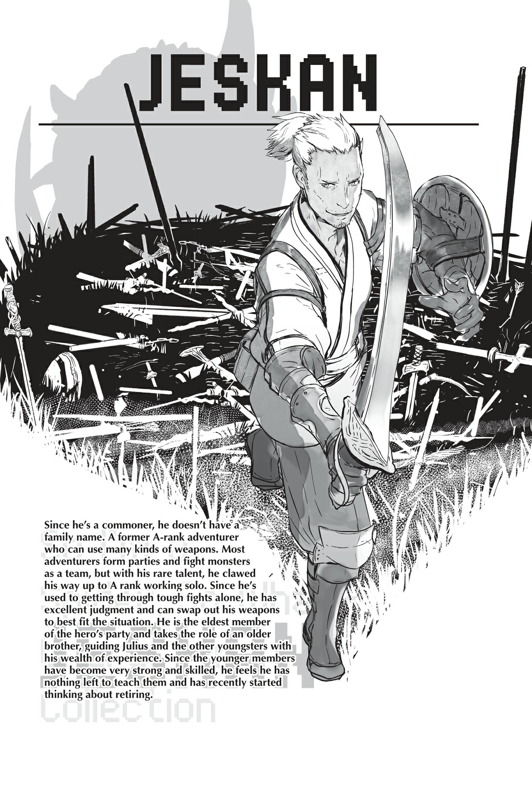
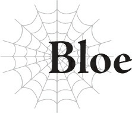

# Bloe

Thúc ngựa lao đi, tôi né tránh cơn mưa đạn ánh sáng của Anh hùng.

Nếu tôi dừng di chuyển, tôi sẽ bị thiêu rụi ngay tại chỗ!

Đối thủ của tôi là Anh hùng, kẻ thù truyền kiếp của Ma Vương.

Tôi biết chuyện này sẽ không dễ dàng — nhưng tôi vẫn phải đánh bại hắn.

Thật không may cho tôi, các đòn tấn công của Anh hùng rất tàn nhẫn, như thể chúng được thiết kế để đè bẹp những mảnh hy vọng cuối cùng của tôi vậy.

Trông hắn giống như một cậu nhóc ôn hòa, vậy mà hắn lại lao vào kết liễu tôi không một giây do dự.

Thật khó tin là tôi có thể sống sót trước sự mãnh liệt đó.

Thằng nhóc này đã phải trải qua bao nhiêu địa ngục để đạt được sức mạnh cỡ này chứ?

Anh hùng chiến đấu giống như một ma kiếm sĩ, chủ yếu sử dụng ma pháp, nhưng hắn cũng sử dụng thanh kiếm của mình giống như một bậc thầy.

Từ khoảnh khắc hắn chặn đòn tấn công trên lưng ngựa của tôi bằng thanh kiếm của mình, tôi biết hắn mạnh hơn tôi về mặt thể chất.

Nhưng hắn có vẻ chuyên về ma pháp hơn.

Nếu tôi ở quá xa, tôi sẽ trở thành bia đỡ đạn hoàn hảo cho ma pháp của hắn.

Nhưng nếu tôi tiếp cận gần, hắn vẫn có thanh kiếm của mình.

Hắn không có sơ hở nào cả.

Thông thường, mọi người đều có điểm mạnh và điểm yếu riêng của mình.

Tôi thì hơi tệ về ma pháp, trong khi Huey của Quân đoàn 6 thì không giỏi cận chiến.

Toàn bộ điểm mấu chốt của một trận chiến tay đôi là tìm ra nơi kẻ thù vượt trội và nơi họ thiếu sót, giữ trận chiến theo điều kiện của riêng mình, và ngăn kẻ thù sử dụng vũ khí tốt nhất của họ.

Nhưng Anh hùng dường như không có bất kỳ điểm yếu nào cả.

Cấp độ kỹ năng của hắn chắc chắn phải cao đến mức điên rồ.

Bình thường thì điều đó là bất khả thi, nhưng đây là Anh hùng chúng ta đang nói đến mà.

Đoán là điều đó nghĩa là hắn chơi theo bộ quy tắc đặc biệt của riêng mình, hả?

Bạn cần vô số thời gian để nâng cao cấp độ kỹ năng.

Khi bạn cố gắng nâng tất cả chúng cùng một lúc, hầu hết mọi người đều kết thúc bằng việc dở dở ương ương ở một đống thứ ngẫu nhiên.

Nếu bạn muốn trở nên mạnh mẽ, bạn phải chọn một thứ và tập trung vào nó để nâng cấp độ kỹ năng của nó lên.

Ngay cả trong số các chỉ huy quân đoàn chúng tôi, người duy nhất có sự cân bằng tốt giữa các kỹ năng được huấn luyện kỹ lưỡng là Agner.

Và lão già đó đã chiến đấu từ triều đại của Ma Vương từ hai thế hệ trước rồi, bạn biết đấy?

Sống lâu hơn phần còn lại của chúng tôi rất nhiều, nên không có gì ngạc nhiên khi lão ta có nhiều kinh nghiệm hơn.

Nhưng Agner gần như là ngoại lệ duy nhất cho quy tắc đó.

Sẽ là lý tưởng nếu nâng tất cả các kỹ năng của bạn lên cấp độ cao đồng đều, nhưng điều đó chắc chắn là không thực tế.

Nhưng Anh hùng giống như hiện thân của lý tưởng đó ngoài đời thực vậy.

...Tôi thực sự có thể thắng trận này sao?

Không, tôi không thể chùn bước vào lúc này được!

Tôi sẽ thắng! Tôi phải thắng!

Thúc dây cương, tôi thay đổi đường chạy của ngựa.

Tôi giỏi cận chiến hơn, đặc biệt là khi tôi nhanh chóng liên kết các đòn tấn công mạnh mẽ lại với nhau.

Kogou của Quân đoàn 3 có đòn tấn công đơn lẻ nặng nhất đánh bại tôi, và Darad của Quân đoàn 5 chắc chắn có nhiều kỹ thuật tinh tế hơn tôi.

Nhưng khi chúng tôi thực sự so tài, tôi mới là người chiến thắng.

Trong cận chiến không dùng ma pháp, tôi cá là mình có thể tự lo liệu được ngay cả khi đối đầu với Agner.

Tôi biết Anh hùng mạnh thế nào từ lần trao đổi chiêu thức đầu tiên đó, dù muốn hay không.

Nhưng tôi sẽ không có cơ hội chiến thắng nào nếu tôi để điều đó làm mình sợ hãi.

Giữ khoảng cách chỉ tổ khiến tôi bị ma pháp của hắn giết chết mà thôi.

Cơ hội chiến thắng duy nhất của tôi là ép vào cận chiến, nơi tôi vượt trội nhất.

“Aaaargh!”

Với một tiếng gầm vang dội, tôi lao thẳng về phía Anh hùng.

Hắn sẵn sàng thanh kiếm của mình để đón tiếp tôi.

Trận chiến bắt đầu rồi!

Và tôi sẽ thắng!

Tôi phải thắng! Bất kể thế nào!

“Trong trận chiến ngày mai, Quân đoàn 7 sẽ phải làm những quân cờ tốt thí.”

Agner đã nói thẳng với tôi điều này ngày hôm qua.

Lão ta nói binh sĩ của tôi sẽ hoạt động như mồi nhử để dụ Anh hùng ra ngoài.

Pháo đài Kusorion đặc biệt an toàn, ngay cả trong số tất cả các pháo đài của con người.

Không có cách nào hạ gục nó bằng cách tấn công quang minh chính đại cả.

Nên chiến lược của chúng tôi là dụ đấu sĩ mạnh nhất của nhân loại, Anh hùng, ra ngoài và tiêu diệt hắn để đè bẹp ý chí chiến đấu của con người.

Chuyện đó có vẻ giống như một nước đi đầy rủi ro đối với tôi.

Liệu chúng tôi có thực sự dụ được Anh hùng ra ngoài bằng cách đặt toàn bộ Quân đoàn 7 vào thế nguy hiểm không?

Và ngay cả khi chúng tôi xoay xở được chuyện đó, liệu chúng tôi có thể đánh bại hắn không?

Trên hết, nếu chúng tôi có thể hạ gục được Anh hùng, liệu điều đó có đủ để tiêu diệt ý chí chiến đấu của họ không?

Liệu điều này có thực sự đủ để hạ gục Pháo đài Kusorion không?

Kế hoạch của Agner dường như dựa trên quá nhiều giả định lạc quan — đối với tôi, toàn bộ chuyện này nghe giống như một canh bạc lớn vậy.

Không đời nào tôi có thể mạo hiểm mạng sống của tất cả binh lính của mình vào một chiến lược mơ hồ như thế.

Tôi đã nói thẳng với lão ta như vậy.

“Ta cũng nghĩ thế. Nhưng cậu vẫn sẽ phải làm vậy thôi. Dù có đánh bạc hay không, đó là cơ hội duy nhất chúng ta có để chiến thắng.”

Agner nở một nụ cười tự giễu, uể oải khác thường.

“Chúng ta đã bị đặt vào một tình thế khó khăn, cả cậu và ta.”

Nói xong câu đó, Agner nhìn quanh.

Vào thời điểm đó, chúng tôi đã cho tất cả thuộc hạ lui ra ngoài, nên không có ai khác ở đó cả.

“Ta có thể yêu cầu vị khách của chúng ta bước ra ngoài một lát không? Tại sao ư, đây chỉ là cuộc trò chuyện vặt vãnh giữa hai người đàn ông thôi mà. Chúng ta sẽ không thực hiện bất kỳ nước đi ngu ngốc nào ở thời điểm muộn màng này đâu.”

Nhưng vì lý do nào đó, Agner nói chuyện như thể có ai đó đang đứng ngay gần lắng nghe, và lão ta trực tiếp nói chuyện với sự hiện diện vô hình này.

Kỹ năng [Cảm nhận Hiện diện] của tôi không bắt được bất kỳ thứ gì, nhưng Agner dường như chắc chắn rằng có ai đó khác ở đó.

“Chà, không thể biết được liệu chuyện đó có hiệu quả hay không nữa...”

“Ngài Agner? Chuyện đó là thế nào vậy?”

“Đừng lo lắng về nó. Đằng nào thì cậu cũng chẳng thể làm gì được đâu.”

Tôi cảm thấy một luồng ớn lạnh.

Cứ như thể Agner đang nói rằng có ai đó đang theo dõi mọi hành động của tôi, mà tôi không hề nhận ra.

Liệu chuyện như thế có thể xảy ra ngay cả đối với Ma Vương không?

Ngay cả bây giờ, tôi vẫn rất khó tin ngài ấy lại bất khả xâm phạm như những gì anh trai tôi tuyên bố.

Nhưng vào khoảnh khắc đó, lần đầu tiên, tôi cảm nhận được một nỗi sợ hãi không thể tả thành lời.

“Ngay cả ta cũng không thể biết được liệu người quan sát của chúng ta có thực sự rời đi hay chưa. Nhưng dù sao thì ta cũng không định nói bất cứ điều gì có thể gây rắc rối cho chúng ta cả.”

Chúng tôi đang bị theo dõi bởi một kẻ mà ngay cả Agner cũng không thể phát hiện sao?

Theo bản năng, tôi nhìn quanh, điều đó khiến Agner cười khúc khích một cách khô khan.

Nhưng tất nhiên tôi không thể cảm nhận được bất cứ điều gì, nên tôi chỉ quay lại nhìn Agner đầy bối rối.

Để đáp lại, biểu cảm của Agner nghiêm túc trở lại, và lão ta bắt đầu nói chuyện với tôi.

“Bloe, cậu có thể cảm thấy mình là người duy nhất bị dồn vào thế bí, nhưng cậu đã sai lầm tai hại rồi. Không chỉ mình cậu đâu. Mà toàn bộ ma tộc đang gặp nguy hiểm đấy.”

Agner nghe có vẻ kiệt sức khi nói điều đó.

Lão ta luôn tỏ ra rất điềm tĩnh và kiên quyết một cách tàn nhẫn, nên đây là lần đầu tiên tôi thấy lão ta ở trong trạng thái như vậy.

“Ma tộc chúng ta chỉ còn lại hai lựa chọn. Đánh bại con người và sống sót hoặc thua cuộc và bị hủy diệt. Tất cả chỉ có thế mà thôi.”

“Chuyện thực sự không đơn giản như vậy, đúng không?”

“Không, ta e là nó chắc chắn là như vậy đấy.”

Thắng hay thua.

Sống sót hay diệt vong.

Tất cả hoặc không có gì.

Tôi không thể tưởng tượng số phận của chúng tôi lại là thứ gì đó đơn giản như thế, nhưng Agner khăng khăng là chỉ có vậy.

“Quy mô của một tình huống càng lớn, mọi thứ càng trở nên phức tạp. Nhưng có những ngoại lệ cho mọi quy tắc. Dịp này chính là một ngoại lệ như vậy. Bởi vì chính Ma Vương mong muốn kết quả đơn giản đó.”

Ma Vương.

Chỉ cần nghĩ đến người đàn bà đó là tôi đã cau mày.

Mọi thứ đều đi chệch hướng kể từ khi ngài ấy xuất hiện.

“Ngài Agner. Tại sao ngài lại phục vụ một kẻ như — ?”

“Đừng nói thêm một lời nào nữa.”

Tôi không biết tại sao một người mạnh mẽ như Agner lại phục tùng Ma Vương.

Nếu lão ta nổi loạn chống lại ngài ấy, có lẽ mọi thứ đã khác.

Nghĩ về chuyện đó, tôi bắt đầu nói điều gì đó cay đắng, nhưng lão ta đã ngắt lời tôi.

“...Chúng ta không thể thắng. Hay đúng hơn, ta không thể thắng. Ta đã không thể giành chiến thắng trước Ma Vương. Đó là câu trả lời của cậu.”

Câu trả lời đơn giản của Agner khiến tôi chết lặng.

Lão ta không thể thắng.

Tôi chưa bao giờ nghe Agner thừa nhận thất bại trước đây.

Ý nghĩa của chuyện đó là vô cùng nghiêm trọng.

“Tất nhiên ta sẽ không âm thầm chấp nhận sự diệt vong của chúng ta. Ta chỉ đơn giản xác định rằng đây là con đường hành động duy nhất còn mở ra cho chúng ta. Chúng ta không còn lựa chọn nào khác ngoài việc chiến thắng.”

Agner đánh giá rằng mình không thể đánh bại Ma Vương, nên lựa chọn duy nhất còn lại cho sự sống sót của ma tộc là đánh bại con người.

Tôi không muốn chấp nhận điều đó.

Nhưng tôi không có nhiều lựa chọn.

Không phải khi Agner là người nói ra điều đó.

“Chúng ta phải chiến thắng bằng mọi giá. Ngay cả khi đó là một canh bạc, đó là canh bạc chúng ta bắt buộc phải chơi. Không chỉ có Quân đoàn 7 gặp rủi ro đâu. Nếu chúng ta thua, từng ma tộc cuối cùng có khả năng sẽ bị hủy diệt.”

Đó là lý do tại sao lão ta cần Quân đoàn 7 dẫn đầu cuộc tấn công.

Tôi có thể nhận ra lão ta đã kiên định trên mặt trận này và không có gì tôi nói có thể thay đổi chiến lược lão ta đã chọn.

Chúng tôi phải chiến thắng.

Không chỉ có Quân đoàn 7 và tôi gặp nguy hiểm.

Số phận của toàn bộ ma tộc phụ thuộc vào chiến thắng của chúng tôi.

Sáng hôm sau — cụ thể là sáng nay — tôi đã giải thích ngắn gọn chiến lược cho các binh sĩ Quân đoàn 7.

Những người đàn ông và phụ nữ này đều đã tham gia vào đội quân nổi dậy do chỉ huy trước đó của họ, Warkis, dẫn đầu.

Kể từ khi cuộc nổi dậy bị phát hiện, Quân đoàn 7 đã bị đối xử tệ bạc và đành cam chịu số phận đau đớn hiện tại của họ.

Nhu yếu phẩm của họ được ưu tiên thấp nhất trong số tất cả các quân đoàn, họ không có trang bị đầy đủ, và có những ngày thậm chí không có đủ thức ăn để chia nhau.

Và giờ đây, mệnh lệnh của họ về cơ bản là “hãy ra ngoài kia và chết đi.”

Không đời nào chuyện đó lại không làm họ bận tâm.

Ấy vậy mà...

“Nếu thủ lĩnh đã nói thế.”

Các binh sĩ sẵn sàng chấp nhận sứ mệnh tự sát của họ.

“Chúng ta đã coi như chết một lần rồi. Vì chúng ta đang sống bằng thời gian vay mượn, chúng ta ít nhất muốn làm điều gì đó hữu ích trước khi chết.”

“Nhờ có thủ lĩnh mà chúng ta mới sống sót được đến tận bây giờ. Thủ lĩnh đã cứu mạng chúng ta, nên cứ sử dụng chúng theo bất kỳ cách nào thủ lĩnh thấy phù hợp.”

“Mấy người...”

Họ đang làm như thể tôi đã làm rất nhiều điều cho họ, nhưng chuyện không đến mức đó đâu.

Hầu hết các binh sĩ này đều vô cùng trung thành với Warkis.

Nhiều người trong số họ đã sẵn sàng cầm vũ khí lên và chết khi cố gắng trả thù cho ông ta.

Tôi đã trấn an họ tốt nhất có thể và đấm cho họ tỉnh ra khi tôi không có cách nào khác để ngăn cản họ.

Đôi khi tôi đi vòng quanh cầu xin thức ăn, vay mượn những gì có thể để binh lính của tôi có thể ăn, và thậm chí tự mình đi săn quái vật khi mọi chuyện trở nên tuyệt vọng.

Nhưng đó là tất cả những gì tôi có thể làm cho họ.

Hầu như không đủ để xứng đáng với việc họ giao mạng sống cho tôi.

Tôi chắc chắn họ cũng nhận ra điều đó.

Họ hoàn toàn nhận thức được rằng họ được phép sống, nhưng không được tha thứ.

Tất cả chuyện này chỉ có nghĩa là thời khắc trả nợ cuối cùng đã đến, nên họ sẵn sàng chết ở đây.

Và tất cả những gì tôi có thể làm là tiễn họ đến cái chết của mình.

Nên nếu tôi không muốn để những khoảnh khắc cuối cùng của họ trở nên lãng phí, tôi phải đảm bảo mình không thua cuộc, để tôi có thể đền đáp lại sự tin tưởng của họ dành cho một chỉ huy tồi tệ như tôi!

Tôi chém vào Anh hùng với tất cả những gì mình có.

Đà tiến của ngựa, sức mạnh của cơ thể, và trên hết, sự mãnh liệt trong cảm xúc của chúng tôi đều nằm sau nhát chém này.

Tôi phải thắng!

Nhưng bất chấp sự kiên định to lớn của tôi, Anh hùng vẫn chặn đứng đòn chém của tôi.

“Chậc!”

Một phần trong tôi đã hy vọng cuộc tấn công này có thể làm được điều đó, nhưng tôi biết nó sẽ không dễ dàng như vậy!

Nhưng vì hắn đã chặn đòn tấn công đầu tiên của tôi theo cùng một cách, tôi thực ra không mong đợi nó sẽ hiệu quả.

Tôi chỉ mới bắt đầu thôi!

“Nhận lấy này!”

Tôi vung kiếm chém xuống từ trên lưng ngựa.

Anh hùng nâng thanh kiếm của mình lên để đỡ nhát chém nặng nề đến từ phía trên.

Lưỡi kiếm của chúng tôi va chạm, và cả hai đều bị đánh bật ra.

Vì tôi có lợi thế về chiều cao, cán cân sức mạnh tạm thời nghiêng về phía tôi trong một khoảnh khắc.

Nhát chém xuống có sự hỗ trợ của trọng lực, trong khi Anh hùng phải sử dụng nhiều sức mạnh hơn thế để nâng thanh kiếm của mình lên.

Ấy vậy mà, chúng tôi vẫn ngang tài ngang sức.

Điều đó chỉ cho thấy chỉ số của Anh hùng cao hơn tôi.

Nhưng tôi sẽ không lùi bước. Tôi không thể.

Không phải về mặt thể chất, và cũng không phải về mặt cảm xúc.

Nếu tôi lùi bước ở đây, tất cả chúng tôi đều thua cuộc.

Đà vung kiếm của tôi đe dọa kéo cơ thể tôi về phía sau, nhưng tôi dùng lực cưỡng lại.

Tôi nghe thấy một tiếng rắc từ cánh tay đang giữ thanh kiếm tại chỗ, nhưng tôi nghiến răng chịu đựng, rồi vung kiếm chém xuống Anh hùng một lần nữa.

Anh hùng cũng kéo kiếm của mình trở lại, đối đầu trực diện với tôi.

“Chết tiệt!”

Lưỡi kiếm của tôi va chạm với của Anh hùng lần nữa.

Tôi vẫn chưa xong đâu!

Từ đó, tôi khởi động một loạt các đòn tấn công dồn dập.

Nó chỉ là một cuộc tấn công thô bạo không chút hoa mỹ, kỹ thuật chết tiệt đi cho rồi.

Nhưng trong một trận đấu kiếm tử tế, tôi có lẽ mới là người thua cuộc.

Tôi phải vượt qua bằng sức mạnh thuần túy!

Thanh kiếm của chúng tôi va chạm hai lần, rồi ba lần, nhưng hắn vẫn không chịu khuất phục.

“Hừ... ư-ự-ự!”

Thực tế, tôi mới là người gặp khó khăn trong việc theo kịp thanh kiếm của Anh hùng.

Mỗi lần lưỡi kiếm của chúng tôi chạm nhau, chậm rãi nhưng chắc chắn, đường kiếm của tôi lại chậm đi một chút.

Nếu trận đấu tay đôi cứ tiếp tục như thế này, tôi sẽ gặp rắc rối lớn.

Thảm họa đang ập xuống đầu tôi.

“Hây-a!”

Rồi, với một tiếng hét, Anh hùng chém mạnh đủ để đánh bật thanh kiếm của tôi sang một bên.

Tôi vung nó trở lại quá muộn và không có đủ sức lực.

Anh hùng không bỏ lỡ cơ hội đó.

Hắn nâng thanh kiếm của mình lên và chĩa thẳng vào tôi trong khi tôi vẫn đang hồi phục.

Tôi không có đủ thời gian để đưa lưỡi kiếm của mình trở lại vị trí.

Tôi tiêu đời rồi sao?!

Đột nhiên, con ngựa của tôi quay ngoắt lại, đẩy tôi lệch đi.

Phía sau tôi, tôi nghe thấy một âm thanh lớn và trầm đục.

“Cái gì cơ?!”

Mất thăng bằng, tôi nhào người ngã khỏi ngựa.

Tôi xoay xở lăn tròn trên mặt đất an toàn hai hoặc ba lần, rồi bật dậy bằng đà tiến và xoay người lại.

Trước mặt tôi là con ngựa yêu quý của tôi, bị mất một chân sau, đang đổ sụp xuống đất.

“Không...”

Tôi có thể đoán ngay ra chuyện gì đã xảy ra.

Người bạn đồng hành thân yêu của tôi đã bảo vệ tôi và tự nguyện đón lấy nhát chém của Anh hùng.

Chân của một con ngựa chính là mạng sống của nó. Mất đi dù chỉ một chân cũng đồng nghĩa với việc chấp nhận cái chết.

Một người nào đó có Trị liệu Ma pháp cấp cao có thể cứu được ngựa của tôi, nhưng cái nhìn qua lượng máu khổng lồ đang phun ra từ vết thương cho tôi biết quá rõ rằng không có người chữa trị nào có thể đến kịp lúc.

“...Xin lỗi! Và cảm ơn mày!”

Đó là tất cả những gì tôi có thể nói trước khi quay lại đối mặt với Anh hùng.

Tôi đã nuôi nấng con ngựa đó từ chính khoảnh khắc mẹ nó sinh ra nó.

Nó là đối tác đã ở bên tôi lâu hơn bất kỳ binh sĩ nào trong Quân đoàn 7, hay thậm chí là những đồng đội cũ của tôi ở Quân đoàn 4.

Và nó đã dâng hiến mạng sống của mình để bảo vệ tôi.

Nên tôi phải đảm bảo hành động trung thành cuối cùng của nó không trở nên vô ích.

Việc đau buồn sẽ phải chờ đợi.

Ngay lúc này, tôi cần tập trung vào việc chiến đấu với Anh hùng bằng tất cả những gì mình có!

“Aaaaargh!”

Hét lớn, tôi lao về phía Anh hùng.

Cuộc trao đổi của tôi với con ngựa chỉ kéo dài vài giây.

Thanh kiếm của Anh hùng vẫn đang hạ thấp sau khi chém gục ngựa của tôi.

Tuy nhiên, tôi biết điều đó không có nghĩa là hắn không có khả năng tự vệ. Sau trận chiến của chúng tôi từ trước đến nay, tôi nhận thức rõ rằng hắn không phải là một đối thủ dễ chơi như vậy.

Thằng nhóc đó chuyên về ma pháp, vậy mà hắn cũng vượt trội hơn tôi trong cận chiến.

Nhưng tôi không thể lùi bước lúc này!

Số phận của Quân đoàn 7, của ma tộc — tất cả đều đè nặng trên vai tôi!

Vì các binh sĩ Quân đoàn 7 đã ngã xuống trong trận chiến này và con ngựa yêu quý của tôi.

Vì những người nổi dậy đã chết trước cuộc chiến này, như Warkis, và những người tội nghiệp đã cố gắng chạy trốn khỏi sự cai trị bạo ngược của Ma Vương, và những người đã mất mạng trước khi họ kịp cố gắng làm vậy.

Vì mọi người bị ép buộc phải cố gắng làm điều không thể vì vị Ma Vương tồi tệ đó và đã chết trong tuyệt vọng.

Và đó không phải là tất cả.

Xem kìa, tôi biết những người như anh trai tôi và Agner đã làm việc chăm chỉ như thế nào trước khi vị Ma Vương đó xuất hiện, làm việc kiệt sức đến tận xương tủy để cố gắng giúp ma tộc phục hồi từ trạng thái tơi tả của mình.

Tôi lớn lên nhìn anh trai mình cống hiến hết mình cho công việc hành chính, hầu như không dừng lại để ngủ.

Và sau tất cả những nỗ lực đó, chúng tôi ở đây.

Tôi không định để những nỗ lực của anh trai mình trở nên vô nghĩa đâu!

Anh trai tôi, Agner, và rồi còn có...

Trong sâu thẳm tâm trí, tôi nhìn thấy White, luôn ẩn hiện phía sau vị Ma Vương tồi tệ đó.

Tôi không thể thua cuộc, chết tiệt. Tôi đơn giản là không thể!

“Phù... hộc!”

Tôi hít một hơi thật sâu, rồi trút tất cả ra bằng một đòn tấn công toàn lực khác.

Anh hùng gạt nó ra dễ dàng, tất nhiên rồi.

Tôi vẫn chưa xong đâu!

Rút kiếm lại, tôi thay đổi góc độ và thực hiện một cú vung khác ngay lập tức.

Hắn chặn và lại chặn. Phải tiếp tục! Không thể dừng lại!

Tôi sẽ không buông lỏng cho đến khi tôi sử dụng từng chút sức lực cuối cùng trong cơ thể mình!

“!!”

Điều tiếp theo tôi biết là tôi đang nín thở, và một nửa tầm nhìn của tôi đã trở nên mờ mịt.

Tôi đã mất dấu mọi thứ ngoại trừ Anh hùng, dõi theo thanh kiếm của hắn bằng mắt mình.

<Độ thuần thục đã đạt đến mức yêu cầu.

Kỹ năng [Gia tốc Tư duy LV 4] đã trở thành [Gia tốc Tư duy LV 5].>

Các kỹ năng hoạt động theo những cách thần bí; vì lý do nào đó, chúng tăng lên trong trận chiến thực tế như thế này dễ dàng hơn nhiều so với trong quá trình huấn luyện.

Một số người nói rằng sự căng thẳng khi đứng trên bờ vực cái chết thúc đẩy sự phát triển, và điều đó đặc biệt rõ ràng khi bạn đang chiến đấu với một người mạnh hơn mình.

Đôi khi, sự phát triển đó thậm chí có thể lật ngược thế cờ của trận chiến.

Nhưng nhờ có kỹ năng Gia tốc Tư duy vừa mới thăng cấp của mình, tôi có thể nhìn thấy các chuyển động của Anh hùng quá rõ ràng.

Rõ ràng là hắn có thể biết tôi sẽ tấn công thế nào trước khi tôi bắt đầu!

Sự phát triển tôi vừa trải qua chỉ làm cho sự khác biệt về năng lực của chúng tôi trở nên rõ ràng hơn mà thôi.

Tôi đang điên cuồng vung kiếm với không có gì khác trong tâm trí hay tầm nhìn của mình, nhưng Anh hùng có thể nhìn thấu mọi nước đi của tôi. Hắn chỉ đang đợi tôi để lộ sơ hở mà thôi!

Tôi không thể chạm tới hắn!

Ngay cả sau tất cả những chuyện này!

Nhưng tôi không thể thua!

Bạn nghĩ chúng tôi đã phải hy sinh bao nhiêu để đi được đến mức này chứ?!

Ấy vậy mà, ấy vậy mà!

Mặc dù các cơ quan nội tạng của tôi đã đông cứng lại vì căng thẳng, hơi thở của tôi lại bắt đầu dồn dập trở lại.

Những ngụm không khí cháy bỏng của chiến trường tràn vào, thiêu đốt phổi tôi.

Tôi cảm thấy những cú vung kiếm của mình chậm lại, chuyển động của mình mờ nhạt đi, sức lực của mình suy kiệt.

Tôi đã đạt đến giới hạn kiệt sức của mình rồi.

“Aaaaaagh!”

Tôi đẩy tất cả những thứ đó xuống bằng ý chí thuần túy và tiếp tục tấn công.

Nhưng...

“Thế vẫn không hiệu quả đâu.”

“Cái gì?”

Thanh kiếm của tôi bị đánh bật sang một bên.

Không thể chống lại đà tiến, tôi loạng choạng lùi lại cùng với nó.

Ngay lập tức, tôi phải đối mặt với một loạt đạn làm bằng ánh sáng.

Đó là Quang Ma Pháp của Anh hùng, tôi nhận ra điều đó — ngay khi đòn tấn công mạnh mẽ lao thẳng vào tôi.

“Hự! Á?!”

Không có thời gian để né tránh hay chặn lại hay thậm chí là suy nghĩ.

Hóa ra khoảng cách sức mạnh giữa Anh hùng và tôi lại xa đến mức này sao?!

Tôi bị thổi bay về phía sau, nhào lộn trên mặt đất và đáp xuống bằng cả hai tay và đầu gối.

Nhưng đây chưa phải là kết thúc. Không thể như thế được!

“Chưa đâu...”

Tôi sử dụng các kỹ năng để chữa lành vết thương của mình.

Nhưng tôi có thể cảm nhận được sức lực đang rút cạn khỏi cơ thể trong quá trình này.

Vết thương đã lành, nhưng tôi hầu như không còn thể lực để chiến đấu.

“Ông không nên cố quá làm gì nữa. Chắc hẳn đến giờ ông đã thấy tôi mạnh hơn nhường nào rồi.”

Có vẻ như Anh hùng cũng có thể biết tôi đang ở trong trạng thái nào.

“Tôi vẫn chưa thua đâu, chết tiệt! Nếu tôi bò về nhà như thế này, tôi sẽ không thể đối mặt với anh trai mình!”

Không chỉ có anh ấy.

Tôi sẽ làm thất vọng toàn bộ ma tộc!

“Nếu ông có anh chị em, chẳng phải đó lại càng là lý do để sống sót sao? Hãy rút quân đi. Chúng tôi sẽ không truy đuổi các ông đâu.”

...Tên khốn kiếp này!

Nếu chuyện đó dễ dàng như vậy thì đã chẳng có vấn đề gì rồi!

“Chúng tôi không thể rút lui, chết tiệt!”

Tôi đứng dậy và lao lên lần nữa.

Phần não bộ lý trí của tôi đang gào thét rằng tôi không thể thắng trận chiến này.

Tôi biết điều đó chứ!

Anh hùng đơn giản là quá mạnh.

Nhưng dù thế! Tôi phải cố gắng tiêu hao ít nhất một chút ma lực và thể lực của hắn!

Ngay cả khi tôi không thể thắng, tôi phải tin rằng việc làm hao mòn hắn có thể tạo ra sự khác biệt đủ để Agner đánh bại hắn!

Thanh kiếm của tôi bị gạt sang một bên dễ dàng, và một phát bắn ánh sáng khác bay về phía tôi.

Đó là cùng một cách tôi đã ngã xuống một phút trước.

Nhưng biết điều đó không đồng nghĩa với việc tôi có thể làm bất cứ điều gì với nó.

Tôi lại chạm đất lần nữa.

“Chưa... đâu...”

Tôi cố gắng đứng dậy một lần nữa, nhưng Anh hùng cắm thẳng thanh kiếm của hắn xuống đất ngay trước mắt tôi.

Nếu nó chỉ gần hơn một chút thôi, nó đã đi thẳng qua cổ tôi rồi.

“Đừng có đứng dậy nữa.”

Hắn không để tôi di chuyển.

Lời nói của Anh hùng chứa đựng một lời đe dọa rõ ràng: Nếu tôi cố gắng đứng lên, hắn sẽ chém gục tôi.

“Ông không phải là người duy nhất có những gánh nặng phải gánh vác đâu.”

Bất chấp sự trẻ tuổi của hắn, lời nói của hắn mang một trọng lượng nghiêm trọng.

Điều này đáng lẽ phải hiển nhiên, nhưng giống như chúng tôi đang chiến đấu vì số phận của ma tộc, Anh hùng đang chiến đấu vì nhân loại.

Hắn ở đây mang theo cùng những cảm xúc và sự kiên định như tôi sở hữu.

Nếu cả hai chúng tôi đều có những cảm xúc mạnh mẽ tương đương, thì kết quả này hoàn toàn là kết quả của sự khác biệt về sức mạnh của chúng tôi.

Cảm xúc của tôi không đủ để thay đổi mọi thứ nếu sự kiên định của kẻ thù cũng mạnh mẽ như vậy.

“Chết... tiệt... tất cả...!”

Các ngón tay của tôi cắm vào bùn đất.

Tôi muốn đứng dậy, nhưng tôi không thể.

Tại sao tôi không thể mạnh hơn chứ?!

Đủ mạnh để đánh bại Anh hùng!

Để đánh bại Ma Vương!

“Tôi không biết điều gì đang thúc đẩy ông chiến đấu, tất nhiên rồi. Tôi chắc rằng ông có những lý do tôi không thể bắt đầu hiểu được. Nhưng nếu các ông, ma tộc, khăng khăng phá hoại nền hòa bình với nhân loại, thì tôi sẽ chiến đấu với sự kiên định để bảo vệ đồng bào của mình.”

Bàn tay của Anh hùng siết chặt thanh kiếm của hắn.

“Tại sao chứ?” Một tia giận dữ len lỏi vào giọng nói của hắn. “Tại sao các ông phải khơi mào chiến tranh?! Tại sao cứ bắt chúng tôi phải chiến đấu chứ?!”

Nghe vậy, sự giận dữ của chính tôi cũng bùng phát.

Không phải chúng tôi chiến đấu vì chúng tôi muốn làm thế, đúng không!

“Bởi vì nếu chúng tôi không làm vậy, tất cả chúng tôi sẽ bị giết!”

“Cái gì?”

Anh hùng trông có vẻ ngạc nhiên trước câu trả lời của tôi, há hốc mồm nhìn tôi với một biểu cảm không thuộc về chiến trường.

Bằng cách nào đó, điều đó chỉ khiến tôi tức giận hơn. Cơn thịnh nộ của tôi chiếm lấy cơ thế, và tôi bắt đầu hét lên.

“Đó là Ma Vương! Ngài ấy nói ngài ấy sẽ quét sạch tất cả chúng tôi nếu chúng tôi không chiến đấu với con người và chiến thắng!”

“Ma Vương?”

“Phải, đúng vậy đấy, chết tiệt! Mọi thứ đều đi chệch hướng kể từ khi ngài ấy xuất hiện! Không phải chúng tôi muốn chiến đấu đâu, bạn biết đấy! Nhưng nếu chúng tôi không làm vậy, chúng tôi sẽ bị giết sạch! Ma tộc sẽ tiêu đời! Chết tiệt thật chứ! Tại sao?! Tại sao mọi chuyện lại phải như thế này?! Chết tiệt tất cả đi!”

Quên đi thanh kiếm ở cổ họng mình, tôi đấm mạnh nắm tay xuống đất.

Tầm nhìn của tôi nhòe đi vì nước mắt.

Thật nhục nhã, nhưng tôi chắc chắn mình sẽ chết ở đây đằng nào cũng vậy.

Một thằng đàn ông nên được phép khóc lóc thảm thiết tùy thích trong những khoảnh khắc cuối cùng của đời mình chứ.

“...Vậy nếu Ma Vương bị đánh bại, cuộc chiến này sẽ kết thúc chứ?”

“Hả?! Phải, nếu điều đó thậm chí có thể xảy ra!”

Khi tôi liều lĩnh thốt ra câu trả lời cho câu hỏi của Anh hùng, hắn rút thanh kiếm của mình lên khỏi mặt đất.

“Chà, vậy thì tôi đoán mình sẽ đi hạ gục Ma Vương vậy.”

Tôi không thể không ngơ ngác nhìn Anh hùng trước lời tuyên bố thản nhiên đó.

“...Cái gì cơ?”

“Nếu Ma Vương là nguyên nhân của cuộc chiến, thì tất cả những gì tôi phải làm là đánh bại ngài ấy. Hơn nữa...” Hắn dừng lại một lúc. “Đó là nghĩa vụ của Anh hùng để đánh bại Ma Vương, đúng không?”

Giọng điệu của hắn có phần đùa cợt, nhưng đôi mắt của hắn trông rất nghiêm túc.

Anh hùng có thể nói điều đó một cách tự tin như vậy chỉ vì hắn không biết Ma Vương mạnh đến nhường nào mà thôi.

...Nhưng đó có thực sự là trường hợp không?

Sự thật là tôi cũng không thực sự biết ngài ấy mạnh đến mức nào.

Tất cả những gì tôi biết là ngài ấy phải mạnh hơn tôi rất, rất nhiều.

Nhưng Anh hùng ở đây cũng mạnh hơn tôi rất nhiều.

...Điều đó nghĩa là hắn có thể đánh bại ngài ấy sao?

Thực sự ư?

Bởi vì nếu như vậy...

Đột nhiên, mặt đất rung chuyển.

Một luồng ớn lạnh chạy dọc sống lưng tôi.

Có thứ gì đó trong không khí, thứ gì đó đáng kinh ngạc hơn những gì tôi từng cảm nhận trước đây, thứ gì đó đủ mạnh để có thể thực sự nghiền nát tôi.

“Cái-cái quái gì thế...?”

Tôi không thể ngăn cơ thể mình run rẩy.

Chuyện này... chuyện này không thể là thật được.

Ngay cả Anh hùng cũng mở to mắt nhìn chằm chằm qua vai tôi.

Tôi không dám quay đầu lại.

Nhưng tôi biết mình không có lựa chọn nào khác.

Khi tôi từ từ nhìn qua vai mình, tôi thấy câu trả lời cho câu hỏi của mình.

Đó là một con quái vật khổng lồ đến mức không thể tin nổi.

Tám chiếc chân của nó cắm sâu vào lòng đất, và tám con mắt lườm xuống chúng tôi từ trên cao.

Tôi biết đây là cái gì.

Tôi chưa bao giờ tận mắt nhìn thấy một con trước đây, nhưng mọi người đều đã nghe nói về thảm họa thiên nhiên biết đi này. Nó là chất liệu của những câu chuyện cổ tích và ác mộng.

Và tên của nó là Taratect Nữ Vương.

Xét về xếp hạng nguy hiểm mà con người dành cho quái vật, nó là một quái vật cấp độ huyền thoại, loại thảm họa mà không một lượng con người nào có thể hy vọng đánh bại được.

Làm thế nào mà một thứ như thế lại đột ngột xuất hiện từ hư không chứ?!

Bất chấp sự bối rối của tôi, Taratect Nữ Vương đã bắt đầu di chuyển.

Nó nhắm miệng về phía Pháo đài Kusorion, và thế giới đột ngột đảo lộn.

Ban đầu, tôi không thể biết chuyện gì vừa xảy ra.

Hoặc có lẽ tôi đơn giản là không muốn biết.

Điều tiếp theo tôi biết là cả một phần lớn của Pháo đài Kusorion đã... biến mất.

Cùng với tất cả các binh sĩ Quân đoàn 7 đang tấn công nó.

“Cái... gì...”

Một tiếng thì thầm hoài nghi thoát ra khỏi miệng tôi.

Tôi quá bối rối để có thể suy nghĩ thấu đáo.

Nhưng mọi thứ chỉ đang diễn ra nhanh hơn.

Taratect Nữ Vương bắt đầu tiến về phía trước.

Nó hướng thẳng về phía Pháo đài Kusorion — hay đúng hơn là những gì còn lại của nó.

Nhưng vẫn còn rất nhiều con người ở đó.

Hầu hết bọn họ đang đứng trên pháo đài đổ nát, nhìn chằm chằm vào Taratect Nữ Vương trong sự kinh hoàng giống như tôi.

“Chạy đi!”

Đột nhiên, một giọng nói hét lên từ rất gần, vang vọng khắp chiến trường im ắng.

“Tôi sẽ câu giờ! Hãy chạy đi!”

Nói xong, Anh hùng bắt đầu chạy nước rút về phía Taratect Nữ Vương.

Hắn bị ngốc hay gì vậy...?

Đáng lẽ phải rõ ràng ngay từ cái nhìn đầu tiên là không ai có thể đánh bại được thứ đó chứ!

Nhưng hắn vẫn dũng cảm lao về phía con quái vật khổng lồ, trong khi tất cả những gì tôi có thể làm là nhìn chằm chằm.

Tôi sững sờ đến mức thậm chí còn chưa xoay xở đứng dậy được.

Ngoại trừ việc có ai đó đang đứng cạnh tôi.

Tôi chú ý đến đôi bàn chân trước, rồi nhìn lên để thấy White, Chỉ huy Quân đoàn 10.

Tôi hầu như không biết gì về cô ta, sức mạnh của cô ta, hay năng lực của cô ta — ngoại trừ thực tế là cô ta có mối liên kết sâu sắc với Ma Vương, tất nhiên rồi.

Nhưng tôi biết một điều về cô ta: cô ta có thể sử dụng [Ma pháp Không gian].

Sự xuất hiện đột ngột của Taratect Nữ Vương... [Ma pháp Không gian] của White.

Hai thứ đó ăn khớp với nhau trong tâm trí tôi.

“Đừng nói với tôi là cô đã triệu hồi thứ đó đấy nhé?”

Hét lên bất chấp bản thân, tôi bật dậy và tiến về phía cô ta.

Trông có vẻ giật mình trước thái độ của tôi, cô ta nghiêng người ra xa.

[Ma pháp Không gian] đòi hỏi một lượng lớn điểm kỹ năng để sở hữu — đủ để bạn phải từ bỏ việc học bất kỳ thứ gì khác.

Hầu hết những người sử dụng [Ma pháp Không gian] không có bất kỳ kỹ năng cấp cao nào khác; thực tế là họ hiếm khi có bất kỳ kỹ năng nào khác cho chuyện đó.

Nói cách khác, [Ma pháp Không gian] có lẽ là chuyên môn duy nhất của White.

Không phải là tôi không biết các năng lực khác của cô ta; chỉ đơn giản là cô ta không có mà thôi.

Cô ta có lẽ không mạnh hơn một người bình thường trong trận chiến.

Tôi đoán cô ta được phong làm chỉ huy vì [Ma pháp Không gian] rất hữu ích và giá trị, nhưng không đời nào cô ta nên có mặt trên một chiến trường nguy hiểm như thế này.

Bên cạnh đó, bản thân Quân đoàn 10 của White đóng vai trò hỗ trợ nhiều hơn.

Tôi không biết họ làm gì hay làm như thế nào, nhưng họ có lẽ là lực lượng thu thập tình báo của Ma Vương.

White chắc hẳn đã sử dụng [Ma pháp Không gian] của mình để gửi họ đến các khu vực khác nhằm thu thập thông tin.

Các nhiệm vụ của Quân đoàn 10 và nơi họ được triển khai cho phần này của cuộc chiến không được chia sẻ, điều này chỉ càng chứng minh cho giả thuyết của tôi: Họ chỉ làm việc sau hậu trường.

Vậy tại sao chỉ huy của một đơn vị không chiến đấu lại ở đây hoàn toàn cô độc chứ?!

Ồ, tôi sẽ kể cho bạn nghe tại sao đây!

Bởi vì cô ta bị bắt buộc phải dịch chuyển con Taratect Nữ Vương đó đến đây!

Theo lệnh của Ma Vương!

Ngài ấy chắc chắn đã mất trí mới gửi một người không chiến đấu không có sức mạnh như White đến để mang con quái vật đó tới đây!

“Đồ ngốc này! Nếu cô chết ngoài này thì sao hả?!”

White nghiêng đầu nhìn tôi, như thể cô ta không có manh mối nào về những gì tôi đang nói.

Thái độ không bận tâm của cô ta chỉ càng khiến tôi tức giận hơn.

Để dịch chuyển một thứ gì đó, người thi triển phải chạm tay vào nó.

Nói cách khác, White chắc chắn đã chạm vào Taratect Nữ Vương.

Bạn đang nói với tôi là cô ta đã đến gần thứ đó như vậy sao?!

Một nước đi sai lầm và cô ta chắc chắn sẽ mất mạng.

Một cô gái nhỏ nhắn mỏng manh thế này có lẽ sẽ bị thổi bay đến tận tuần sau nếu thứ đó chỉ cần cử động một thớ cơ!

“Tại sao thế quái nào cô lại không từ chối một nhiệm vụ nguy hiểm như vậy chứ?!”

Trông thậm chí còn bối rối hơn, White đặt tay lên trán trong tư thế suy nghĩ.

Chẳng có gì để suy nghĩ ở đây cả!

Cô thực sự sẽ đặt cược mạng sống của mình dễ dàng như vậy chỉ vì đó là cho Ma Vương sao?!

Cô ta luôn như thế này, chết tiệt thật.

Tôi không biết mối quan hệ giữa hai người họ là gì, nhưng mọi thứ cô gái này làm đều là vì lợi ích của Ma Vương.

Vị Ma Vương đáng ghét đó...!

Làm thế nào mà White lại kết thúc bằng việc làm việc cho kẻ như ngài ấy chứ?!

Và lại là tự nguyện của chính mình!

Tôi không hiểu, nhưng tôi chắc chắn cô ta sẽ không nói một lời nào ngay cả khi tôi phàn nàn về chuyện đó.

“Chết tiệt!”

Tôi chửi thề để trút bỏ sự thất vọng của mình trước khi quay gót.

“Cô mau biến khỏi đây ngay lập tức đi!”

Ngay cả vị Ma Vương đáng ghét đó cũng không thể kiểm soát một ác mộng như Taratect Nữ Vương. Điều đó là bất khả thi.

Ngài ấy chắc chắn chỉ sử dụng White để mang một con Taratect Nữ Vương hoang dã đến chiến trường!

Nghĩa là nó sẽ tấn công bất cứ thứ gì trên đường đi của nó.

Chắc chắn, nó đã phá hủy một phần lớn của Pháo đài Kusorion, nhưng nó cũng đã thổi bay một đống binh sĩ Quân đoàn 7 của tôi trong quá trình này.

Thứ này không thể phân biệt được sự khác biệt chết tiệt giữa đồng minh và kẻ thù.

Tôi phải tập hợp những người Quân đoàn 7 còn sống sót và đưa họ rời khỏi đây, ngay lập tức.

...Nếu điều đó thậm chí còn khả thi, tức là vậy.

Liệu tôi có thực sự có thể thoát khỏi con quái vật đó lành lặn không?

“Bloe.”

Khi tôi hướng đi thu thập các binh sĩ của mình, White cất tiếng gọi và ngăn tôi lại.

...Tôi nghĩ đó là lần đầu tiên tôi nghe thấy cô ta gọi tên tôi.

“Có chuyện gì?”

“Biến.”

White đưa tay ra phía tôi.

Không thể nào... Cô ta muốn tôi cùng dịch chuyển đi với cô ta sao?

“...Tôi trân trọng ý nghĩ đó, nhưng e là tôi không thể làm thế.”

Người con gái tôi thầm thương trộm nhớ đang đưa tay ra với tôi.

Nhưng thật không may, tôi không thể chấp nhận nó.

“Một chỉ huy không thể bỏ chạy trước binh lính của mình, đúng không?”

Tôi có trách nhiệm dẫn dắt những binh sĩ còn sống sót của mình.

“Cô đi trước đi không cần tôi đâu. Tôi sẽ theo ngay phía sau cô.”

Nói xong, tôi cắm đầu chạy mà không đợi nghe câu trả lời của cô ta.

Không có kẻ thù nào ở gần chúng tôi, nên tôi chắc chắn cô ta có thể trốn thoát an toàn bằng [Dịch chuyển].

Tôi phải tập hợp các thuộc hạ của mình và đưa họ rời khỏi đây.

...Tôi không thể chết như thế này được, chết tiệt.

Thua Anh hùng là một chuyện, nhưng không đời nào tôi lại để mình bị giẫm chết bởi một con Taratect Nữ Vương chết tiệt cả!

Tôi sẽ trở về sống sót — tôi thề đấy!

Và rồi tôi sẽ đấm vỡ mặt Ma Vương.

Bất kể chuyện gì xảy ra, tôi từ chối làm theo những gì ngài ấy nói nữa.

Tôi sẽ cho ngài ấy thấy sự kháng cự thực sự trông như thế nào.

Giống như vị Anh hùng đã lao thẳng về phía Taratect Nữ Vương, biết rõ rằng mình không thể chiến thắng!

Tuy nhiên, điều đầu tiên là! Tôi phải sống sót và rời khỏi đây!

Giữ vững quyết tâm của mình, tôi bước tới để chạy về phía đống đổ nát của Pháo đài Kusorion.

*Reng... reng... reng!*

Nhưng rồi một âm thanh kỳ lạ từ bên cạnh khiến tôi dừng bước.

Cái quái gì thế...?

---

[◀ Chương trước: Jeskan](16_jeskan.md) | [Chương tiếp theo: Balto ▶](18_balto.md)
