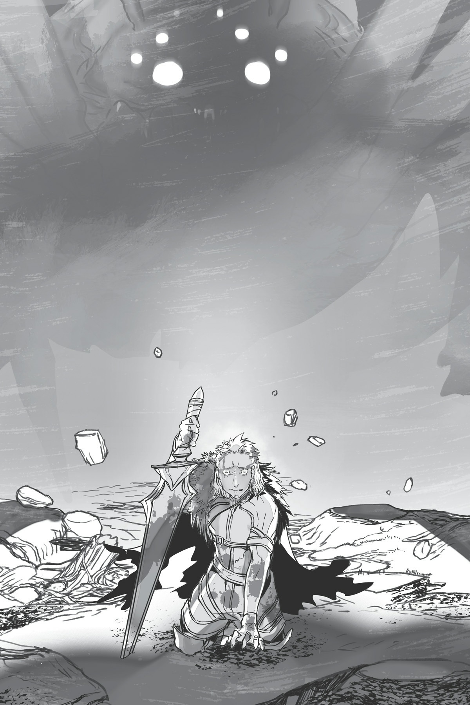
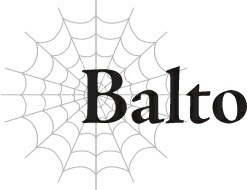

# Balto

Xin hãy trả lời!

Với một lời cầu nguyện thầm lặng, tôi giữ công cụ ma thuật gọi là “điện thoại thông minh” bên tai mình.

Công cụ ma thuật nhỏ hình phiến đá này là thiết bị liên lạc mà Ma Vương đã trao cho mỗi chỉ huy quân đoàn.

Nó cho phép bạn nói chuyện với ai đó bằng [Thần giao cách cảm] từ khoảng cách xa hơn nhiều so với bất kỳ công cụ ma thuật thông thường nào, hoặc ít nhất là tôi được nghe kể như vậy.

Và ngay lúc này, tôi đang sử dụng nó để cố gắng gọi cho em trai tôi, Bloe.

Phải, một phần là vì Ma Vương đã ra lệnh cho tôi làm vậy, nhưng hơn hết, đó là vì sự lo lắng cho sự an toàn của em trai.

Cố gắng kiềm chế những cảm xúc đang rối bời của mình, tôi nhớ lại cuộc trò chuyện với Ma Vương và ngài White từ vài khoảnh khắc trước.

Mọi con mắt đều đổ dồn vào hình ảnh hiển thị trên một trong các “màn hình”.

Nó cho thấy trận chiến tại Pháo đài Kusorion và thất bại cận kề của Bloe.

“Chà, thế thì không tốt rồi.”

Sự quan sát thờ ơ của Ma Vương đâm xuyên qua ngực tôi.

Bloe đang chiến đấu với Anh hùng, và chỉ nhìn thoáng qua cũng thấy rõ cậu ta đang thua cuộc.

Bất kỳ ai cũng có thể nhận ra thất bại của cậu ta chỉ là vấn đề thời gian.

Và thất bại đó chắc chắn sẽ đồng nghĩa với cái chết của cậu ta.

Ý nghĩ đó khiến tim tôi đập thình thịch trong lồng ngực đầy báo động.

“Ồ? Đúng lúc lắm, White.”

Tôi đã không nhận ra ngay lập tức do quá đau buồn, nhưng White đã dịch chuyển trở lại phòng.

“Có vẻ như Bloe sẽ chết với đà này mất,” Ma Vương nói nhẹ nhàng với cô ta.

Đối với tôi, cái chết của em trai tôi sẽ là một đòn giáng chí mạng.

Nhưng rõ ràng từ giọng điệu của Ma Vương rằng cái chết của cậu ta chẳng có nghĩa lý gì nhiều đối với ngài ấy.

Tôi tự hỏi liệu có cách nào để lật ngược thế cờ không, nhưng khi quan sát chiến trường từ xa, tôi chẳng thể làm gì được.

Gần đó, ngài Agner đang bị khóa vào trận chiến với các đồng đội của Anh hùng, nên thật nghi ngờ việc lão ta có thể chạy đến hỗ trợ Bloe hay không.

“Hừm. Ta đã nghĩ Agner có thể tự mình chống lại Anh hùng, nhưng có lẽ ta đã đánh giá lão ta quá cao chăng?”

“Agner đang chiến đấu rất vất vả. Tổ đội của Anh hùng thực sự rất mạnh.”

Trong một khoảnh khắc, tôi không thể phân biệt được ai vừa nói.

Chỉ sau đó tôi mới nhận ra rằng White đại nhân đã cất tiếng nói thay cho ngài Agner.

“Cái gì cơ? ...Oa, ta cứ nghĩ mình đang nghe nhầm đấy chứ. White, có phải cô vừa lên tiếng bênh vực cho Agner hay không vậy?”

Ma Vương có vẻ cũng ngạc nhiên như tôi.

White đại nhân hầu như không bao giờ mở miệng, nên tất nhiên đó là một sự ngạc nhiên lớn.

Trong những dịp hiếm hoi cô ta cất tiếng nói, đó thường là để thốt ra một từ duy nhất, chắc chắn chưa bao giờ là một hoặc hai câu rõ ràng như những lời cô ta vừa tuyên bố.

Tôi thậm chí chưa bao giờ nghe cô ta nói lâu như thế.

Trước câu hỏi của Ma Vương, White lại rơi vào im lặng.

“Hử. Vậy đó là gu của cô sao? Kiểu bố già à?”

Biểu cảm của Ma Vương trông có vẻ phức tạp.

White nhanh chóng lắc đầu, mái tóc của cô ta quất qua quất lại một cách dữ dội.

Rõ ràng, đó không phải là ý của cô ta.

“Ta biết, ta biết mà. Đó chỉ là một trò đùa thôi.”

Ma Vương cười toe toét một cách ngây thơ.

Vào khoảnh khắc đó, ngài ấy trông không khác gì một cô bé đang trêu chọc bạn mình.

Bạn sẽ không bao giờ tưởng tượng được ngài ấy là một ma vương đang có ý định mang lại sự hủy diệt cho ma tộc.

Nhưng nụ cười nhanh chóng biến mất, đôi mắt ngài ấy nheo lại.

Nhìn theo hướng nhìn của ngài ấy, tôi lập tức nhận ra Bloe đã bị Anh hùng ép phải quỳ xuống, trên bờ vực cái chết của chính mình.

“Bloe?!”

Tôi hét lên trước khi kịp ngăn mình lại.

Nhưng thay vì lấy đi mạng sống của Bloe ngay lập tức, Anh hùng lại đang nói chuyện với cậu ta.

“Chà, vậy thì tôi đoán mình sẽ đi hạ gục Ma Vương vậy.”

“...Cái gì cơ?”

“Nếu Ma Vương là nguyên nhân của cuộc chiến, thì tất cả những gì tôi phải làm là đánh bại ngài ấy. Hơn nữa... đó là nghĩa vụ của Anh hùng để đánh bại Ma Vương, đúng không?”

Giọng nói của Anh hùng vang lên từ màn hình.

“Ồ. Nói thẳng vào mặt ta luôn, tại sao lại không chứ?”

Nghe thấy điều này, Ma Vương để một nụ cười đen tối lan rộng trên khuôn mặt mình.

“Vậy thì hãy chuyển sang giai đoạn tiếp theo của kế hoạch thôi nào.”

Không có sự thương hại nào trong mắt ngài ấy, chỉ có cái nhìn của một kẻ hủy diệt máu lạnh.

Ngay khi Ma Vương ra lệnh, White đại nhân biến mất thông qua [Dịch chuyển], và một con Taratect Nữ Vương xuất hiện ngay bên cạnh Pháo đài Kusorion.

“Chào mừng trở lại... Hửm? Agner và Bloe đâu rồi?”

White đại nhân dịch chuyển trở lại, và Ma Vương nhìn cô ta một cách dò hỏi.

Cô ta đã trở về một mình.

Mặc dù cuộc trò chuyện của họ trước đó đã chỉ ra rằng White sẽ đi đón ngài Agner và Bloe.

White chỉ đơn giản lắc đầu.

Màn hình hiển thị Anh hùng đang chiến đấu với Taratect Nữ Vương, nên không có cách nào biết được Bloe và Agner đang ở đâu hay họ có an toàn hay không.

Một lần nữa, tâm trí tôi tràn ngập nỗi sợ hãi.

“Hử? Cái gì, họ chết rồi sao?”

Trước câu hỏi của Ma Vương, White đại nhân lại lắc đầu một lần nữa.

Tôi ước họ không làm những việc như vậy.

Thật nhẹ lòng khi biết cậu ta an toàn, nhưng cuộc đối thoại đó thực sự không tốt cho tim tôi chút nào.

“Hửm? Vậy chuyện gì đã xảy ra?”

“Agner vẫn đang chiến đấu.”

Đầu tiên, White báo cáo về tình hình của ngài Agner, mặc dù “báo cáo” của cô ta chỉ có ba từ đó.

Tôi không biết chi tiết, nhưng tôi đoán điều đó có nghĩa là ngài Agner vẫn đang ở giữa trận chiến nóng bỏng, nên cô ta không thể đón lão ta về.

“Còn Bloe?”

“Sơ tán binh lính.”

“À. Ta cá là cậu ta đã bảo cô rằng mình sẽ ở lại để đảm bảo quân đội của mình rút lui an toàn, đúng không?”

Một cái gật đầu.

Đó chính xác là kiểu điều Bloe sẽ nói, nhưng với tư cách là anh trai của cậu ta, tôi ước gì cậu ta chỉ việc trốn thoát cùng White đại nhân.

“Ư... trời ạ, thực sự sao? Nếu hai người đó bị giết trong đống hỗn độn này, thì mục đích của việc cử Taratect Nữ Vương vào ngay từ đầu là gì chứ?”

Ma Vương nhíu mày lo lắng.

...Ý ngài ấy thực sự là gì khi nói như vậy?

Nếu tôi hiểu những lời đó theo nghĩa đen, nó gần như nghe giống như ngài ấy đã gửi Taratect Nữ Vương đến với mục đích duy nhất là giải cứu ngài Agner và Bloe.

Nhưng liệu Ma Vương có thực sự làm một việc như vậy không?

Chắc chắn là không rồi.

“Này, Balto.”

Suy nghĩ của tôi bị cắt đứt bởi ai đó gọi tên tôi.

“Vâng?”

Tôi cẩn thận duy trì một biểu cảm bình tĩnh khi trả lời.

“Cậu có phiền gọi cho Bloe một cuộc gọi ngắn không?”

Điều đó đưa chúng tôi trở lại hiện tại.

Với một quái vật cấp độ huyền thoại như Taratect Nữ Vương đang hoành hành, Bloe có thể bị giết bất cứ lúc nào.

Đó là một cuộc chạy đua với thời gian.

Nếu cậu ta không trả lời cuộc gọi này, thì cậu ta có lẽ đã...

Ngăn chặn phần còn lại của ý nghĩ đó, tôi tập trung cầu nguyện rằng Bloe sẽ nhấc máy.

“Hử, cái này hoạt động rồi chứ?”

“Bloe!”

Lời cầu nguyện của tôi đã được lắng nghe — tôi nghe thấy tiếng của Bloe.

“Anh trai?!”

“Phải, là anh đây! Bloe, em có sao không?!”

“Vâng, bằng cách nào đó vẫn ổn.”

Giọng cậu ta nghe tốt hơn tôi mong đợi; tôi thở phào nhẹ nhõm.

Nếu cậu ta có thể nói chuyện thế này, điều đó nghĩa là cậu ta không ở giữa một cuộc chiến và chắc chắn chưa bị cuốn vào làn đạn lạc rồi thiệt mạng.

Vậy thì tôi cần nói với cậu ta ngay lập tức.

“Bloe, White đại nhân đang quay lại đón em đấy. Hãy bỏ lại binh lính của em và trở về cùng cô ta đi.”

“Cái gì cơ?!” Bloe quát lên, nghe có vẻ tức giận. “Anh thực sự bảo em bỏ mặc người của mình và trốn đi sao?”

“Đúng vậy.”

Bất chấp sự giận dữ của cậu ta, tôi không thể nhượng bộ ở điểm này.

Mạng sống của đứa em trai duy nhất của tôi đang gặp nguy hiểm.

“Xin lỗi, anh hai. Em sẽ không làm thế đâu, ngay cả khi đó là mệnh lệnh của anh.”

“...Anh đã nghĩ em sẽ nói thế mà.”

Bloe luôn luôn như vậy.

Cậu ta thể hiện lòng trắc ẩn của mình vào những thời điểm kỳ lạ nhất.

Đó là lý do tại sao các thuộc hạ của cậu ta lại tôn trọng cậu ta đến vậy, nhưng có thời điểm và địa điểm cho những việc như thế chứ.

“Bloe. Các binh sĩ Quân đoàn 7 là những kẻ nổi loạn trước đây. Em không nên lo lắng cho họ.”

“Trước đây, đúng không? Nhưng bây giờ họ là binh lính của em. Đó là lý do quá đủ để lo lắng cho họ rồi.”

Chết tiệt! Còn cảm xúc của tôi thì sao chứ?!

“Ngay cả như vậy! ...Bloe, xin em đấy. Em quan trọng với anh hơn bất kỳ ai trong số họ nhiều...”

“Anh hai...”

Mạng sống của em trai tôi có ý nghĩa đối với tôi hơn nhiều so với bất kỳ binh sĩ nào mà tôi thậm chí còn không biết mặt hay biết tên.

Có lẽ việc dành cho người thân của mình sự đối xử ưu ái khiến tôi trở thành một nhà lãnh đạo thất bại, nhưng đó là những cảm xúc chân thật của tôi.

“...Em xin lỗi.”

“...Em thực sự khăng khăng ở lại đó sao?”

Chúng tôi không xa cách đến mức tôi không thể đoán được Bloe đang xin lỗi vì điều gì.

Tôi biết chính xác ý của cậu ta, dù muốn hay không.

Cuối cùng, Bloe không thể bỏ rơi binh lính của mình.

“Vâng.”

“Anh hiểu rồi. Vậy hãy cẩn thận đừng để bị cuốn vào cuộc chiến giữa Taratect Nữ Vương và Anh hùng. Và hãy đảm bảo em phải trở về sống sót.”

Không có lượng thuyết phục nào từ phía tôi có thể làm thay đổi ý định của Bloe.

Tất cả những gì tôi có thể làm bây giờ là cầu nguyện cho sự an toàn của cậu ta.

“Em rõ rồi, anh hai.”

“Anh hùng chắc chắn sẽ bị giết bởi Taratect Nữ Vương thôi. Đừng làm điều gì đáng xấu hổ như vấp ngã vào giữa mớ hỗn độn đó và khiến mình bị giết, được chứ?”

Tôi cố gắng giữ giọng điệu đùa cợt.

“...Nghe này, anh hai.”

Ấy vậy mà, giọng của Bloe nghe nghiêm túc một cách kỳ lạ.

“Có chuyện gì thế?”

“Anh có vẻ chắc chắn rằng Anh hùng sẽ thua thứ đó nhỉ, hả?”

“Hửm? Chà, tất nhiên rồi.” Tôi không biết Bloe đang nghi ngờ về điều gì. “Taratect Nữ Vương là quái vật mạnh nhất trong số các quyến thuộc của Bệ hạ. Chắc chắn ngay cả Anh hùng cũng không thể đánh bại nó.”

“Nó là... cái gì cơ?”

Bloe thở ra một cách hoài nghi.

“Bloe? Có chuyện gì thế?”

“...Quyến thuộc của ngài ấy sao?”

“À... à, anh hiểu rồi. Hóa ra em không biết. Phải, Taratect Nữ Vương được tạo ra bởi Ma Vương.”

Tôi đã nghĩ mình đã dạy cho Bloe biết Ma Vương đáng sợ như thế nào, nhưng rõ ràng, tôi chưa bao giờ đề cập rằng ngài ấy cai trị toàn bộ chủng tộc quái vật taratect.

Điều đó giải thích tại sao Bloe lại tỏ ra ngạc nhiên như vậy.

“...Anh hai.”

“Có chuyện gì thế?”

“...Nếu đó là quyến thuộc của ngài ấy, điều đó nghĩa là bản thân Ma Vương còn mạnh hơn cả Taratect Nữ Vương sao?”

“Tất nhiên rồi,” tôi trả lời ngay lập tức.

Với các kỹ năng như [Thuần thú], có thể kiểm soát một quái vật mạnh hơn người sử dụng trong một số trường hợp nhất định.

Nhưng [Điều khiển Đồng loại] thì khác.

Trong trường hợp đó, người điều khiển luôn mạnh hơn quyến thuộc bị kiểm soát.

Khoảnh khắc quyến thuộc trở nên mạnh hơn người điều khiển, các hiệu ứng của [Điều khiển Đồng loại] không còn áp dụng nữa, nên không thể có chuyện quyến thuộc của Ma Vương lại mạnh hơn ngài ấy được.

“...Ha! Hóa ra là như vậy!”

Tôi có thể nhận ra từ âm hưởng tuyệt vọng trong giọng nói của Bloe rằng cậu ta cuối cùng đã hiểu được Ma Vương đáng sợ như thế nào.

“Cuối cùng em cũng hiểu rồi chứ?”

“Vâng, thật không may. Chết tiệt thật!”

Bloe gầm lên trong sự thất vọng.

“Anh rất vui khi nghe điều đó.”

Tôi thực sự có ý đó.

Nếu cậu ta cuối cùng cũng thấy được Ma Vương mạnh mẽ nhường nào, thì có lẽ thái độ của cậu ta sẽ cải thiện hơn một chút.

“Anh hùng đã nói điều gì đó về việc đánh bại Ma Vương, nhưng một điều như vậy là bất khả thi. Sức mạnh của Bệ hạ vượt xa sự so sánh đối với ngay cả Taratect Nữ Vương.”

Tôi nghi ngờ Anh hùng thậm chí còn không thể đánh bại con quái vật khổng lồ đó.

Bất chấp sự dũng cảm của hắn, hắn sẽ chết trước khi kịp tiếp cận Ma Vương.

“...Vậy là không có lựa chọn nào khác ngoài phục tùng Ma Vương, hả?”

“Đó là lựa chọn duy nhất của chúng ta. Đó là lý do tại sao chúng ta đang chiến đấu lúc này.”

Đây là con đường duy nhất còn lại cho ma tộc.

Mọi thứ, bao gồm cả số phận của ma tộc, đều phụ thuộc vào trận chiến này.

Nhưng ngay lúc này, tôi lo lắng cho Bloe hơn là toàn bộ ma tộc cộng lại.

“Bloe. Chỉ cần đảm bảo việc tự đưa mình trở về sống sót là ưu tiên hàng đầu của em. Rõ chưa?”

“Vâng. Em sẽ cố gắng hết sức.”

Có điều gì đó về câu trả lời đó khiến tôi tràn ngập sự lo lắng.

“Được rồi, em tốt hơn nên đi thôi.”

“À, đợi đã! Bloe?! Bloe!”

Tôi cố gắng gọi tên cậu ta, nhưng tôi không nghe thấy dù chỉ một chút tiếng của Bloe đáp lại.

---

[◀ Chương trước: Bloe](17_bloe.md) | [Chương tiếp theo: Yaana ▶](19_yaana.md)
