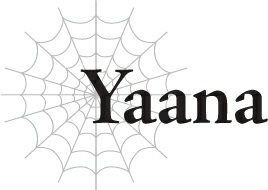

# Yaana

Có một lý do tại sao người ta gọi đó là rơi vào lưới tình.

“Ta hiểu rồi. Vậy ra Ma Vương đang nói rằng ngài ấy không còn cần đến ta nữa rồi...”

Khi tôi kinh hoàng nhìn chằm chằm vào Taratect Nữ Vương đột ngột xuất hiện, tôi nghe thấy một lời lẩm bẩm khẽ khàng phát ra từ Agner, chỉ huy quân đoàn của kẻ thù mà chúng tôi đang chiến đấu.

Agner cực kỳ mạnh mẽ.

Lão ta đủ kỹ năng để đấu kiếm với Jeskan trong khi vẫn duy trì một cơn mưa ma pháp nhắm vào Hawkin và tôi ở phía sau.

Điều đó buộc Hyrince phải bảo vệ chúng tôi, khiến Jeskan phải tự mình xoay sở đơn độc.

Jeskan đã xoay xở để sống sót nhờ sự trợ giúp từ Trị liệu Ma pháp của tôi, nhưng ngay cả khi tôi có thể chữa lành vết thương cho anh ấy, tôi cũng không thể khôi phục thể lực của anh ấy.

Anh ấy đang dần bị bào mòn, nên Hawkin đã sử dụng nhiều công cụ khác nhau để cố gắng giữ cho Agner luôn trong thế đề phòng, nhưng ngay cả chuyện đó cũng không đủ để xoay chuyển thế cờ có lợi cho chúng tôi.

Chúng tôi không có người tấn công chính là Julius, nhưng trận đấu vẫn là bốn đánh một. Thế mà, bằng cách nào đó, chúng tôi chỉ vừa vặn đối phó được với lão ta.

Thực tế, lão ta mới là người đang bào mòn chúng tôi.

Tôi chưa bao giờ chiến đấu với ai mạnh mẽ như vậy trước đây.

Tôi biết một số người mạnh mẽ như Julius và thầy của cậu ấy, Trưởng lão Ronandt, nhưng chúng tôi chưa bao giờ ở hai chiến tuyến đối lập.

Đây là lần đầu tiên tôi tham gia vào một trận chiến sinh tử với một người như thế.

Và chuyện đó thật đáng sợ.

Tồi tệ hơn nhiều so với bất kỳ trận chiến nào với quái vật.

Trong những tình huống đó, tôi chưa bao giờ nản lòng vì Julius luôn ở đó.

Nên nếu lần này chúng tôi cầm cự đủ lâu để Julius quay lại, chúng tôi vẫn có thể giành chiến thắng.

Đó là ý nghĩ duy nhất giúp tôi tiếp tục tiến lên trong suốt thời gian qua.

Nhưng bây giờ chuyện này lại...

Đòn tấn công hơi thở của Taratect Nữ Vương đánh trúng trực tiếp vào Pháo đài Kusorion.

Không có gì còn lại sau vết tích của nó.

Không có gì và không có ai...

Không phải bức tường thành kiên cố phía ngoài, bản thân pháo đài phía sau nó, những người đang phòng thủ, hay thậm chí là những kẻ đang tấn công nó...

“Chuyện này không thể là thật được...”

Giọng nói của chính tôi nghe có vẻ xa xăm, như thể nó thuộc về một ai đó khác.

Tôi chưa bao giờ nhìn thấy bất cứ điều gì như thế này trước đây.

Dù chúng tôi chiến đấu với quái vật hay con người, chúng tôi luôn chiến đấu để giành chiến thắng.

Bất kể trận chiến có khó khăn đến đâu, chúng tôi luôn có thể nhìn thấy con đường dẫn đến chiến thắng.

Nhưng lần này, tôi thậm chí không thể hình dung ra cảnh chúng tôi đánh bại thứ đó.

Nếu kẻ thù áp đảo mạnh mẽ đến nhường đó, thì đây thậm chí không còn là một trận chiến nữa rồi.

Nó là một cuộc tàn sát.

Chắc chắn, tôi đã từng chứng kiến nhiều cuộc tàn sát trước đây.

Cụ thể là dưới bàn tay của chính Julius.

Cả quái vật lẫn con người đều bị sát hại bởi Anh hùng.

Họ đã làm tất cả những gì có thể để kháng cự, tất nhiên rồi.

Nhưng có những điều đơn giản là không thể.

Có những đối thủ đơn giản là không thể bị đánh bại.

Và việc Taratect Nữ Vương trước mắt tôi là một kẻ thù không bao giờ có thể bị đánh bại là điều quá hiển nhiên đến đau lòng.

Những gì chúng tôi đang làm là chiến đấu, chứ không phải hủy diệt hàng loạt.

Nhưng trước sức mạnh hủy diệt có thể thổi bay cả một pháo đài như vậy, không một lượng con người nào có thể tạo nên sự khác biệt.

Tôi có thể chữa trị cho người bị thương, nhưng tôi không thể hồi sinh một ai đó đã bị xóa sổ mà không để lại một dấu vết nào.

Jeskan có tài năng với vô số vũ khí, nhưng với kích thước của thứ đó, anh ấy sẽ không thể để lại bất cứ thứ gì nhiều hơn một vết trầy xước trên sinh vật khổng lồ đó.

Dù Hawkin có chi bao nhiêu tiền cho bất kỳ số lượng vật phẩm nào, anh ấy chắc chắn cũng không thể phá hủy một pháo đài.

Và tấm khiên của Hyrince sẽ bị tiêu diệt cùng với chính bản thân Hyrince.

Vậy đây là quái vật cấp độ huyền thoại.

Vậy đây là sự tuyệt vọng.

Tôi ngạc nhiên là mình vẫn còn đứng vững được.

Đột nhiên, tôi nhận thấy âm thanh trầm đục của kim loại va chạm gần đó.

“Đừng có đứng đó ngây người ra nữa!”

Hyrince mắng tôi, và tôi cảm thấy như mắt mình đột ngột được mở ra.

Tôi không thể tin được là mình lại bị anh ấy mắng đấy!

“Tôi không có ngây người ra!”

“Vậy thì làm việc đi!”

Tôi tự động quát lại anh ấy, nhưng anh ấy hét lại bằng một giọng căng thẳng.

Giọng điệu của anh ấy cho tôi biết rằng mọi chuyện thậm chí còn tồi tệ hơn những gì tôi nhận ra.

Tiếng rung báo động nguy hiểm theo bản năng đó lập tức đưa tôi trở lại thực tại.

Rồi tôi nhận ra rằng ngay gần đó, Hyrince đang khóa khiên đấu kiếm với Agner.

“Cái gì cơ-?!”

Họ vẫn đang chiến đấu trong tình huống này sao?!

Cái gì? Á, ôi trời đất ơi!

Jeskan đang nằm trên đất, người đầy máu!

Agner chắc chắn đã đánh trúng anh ấy trong khi tôi vẫn còn đang bị sốc.

“Đại ca!”

“Đồ ngốc! Lùi lại đi!”

Hawkin bắt đầu chạy về phía Jeskan, nhưng mắt Agner đảo sang hướng cậu ấy, rời khỏi Hyrince.

Nếu cậu ấy nhảy vào lúc này, cậu ấy sẽ bị giết mất!

“Hawkin, không!”

Hawkin không bận tâm đến những lời cảnh báo của chúng tôi và chạy lên phía trước.

Ngay lập tức, Agner nhảy xa khỏi Hyrince và áp sát Hawkin.

“Hự?!”

Hawkin đã sẵn sàng dao găm của mình, nhưng nếu ngay cả Jeskan cũng chỉ vừa vặn theo kịp kiếm thuật của Agner, thì không đời nào Hawkin có thể chặn được lão ta.

Hyrince đuổi theo Agner, nhưng anh ấy không thể bắt kịp lúc này.

Đành trông cậy vào tôi vậy!

Tôi thi triển Quang Ma Pháp và bắn nó về phía Agner ngay lập tức!

Nhưng Agner rõ ràng đã thấy nó đang đến, và lão ta chống trả bằng Hắc Ám Ma Pháp.

Khoảnh khắc các phép thuật của chúng tôi triệt tiêu lẫn nhau, Agner chém xuống Hawkin.

“Á?!”

Lưỡi kiếm chém ngọt qua dao găm và cắn sâu vào người Hawkin.

Con dao găm nứt ra như một chiếc que củi, và một vết chém rộng mở ra trên cơ thể Hawkin.

“Bắt được ông rồi nhé!”

“Hử?!”

Khói trắng bốc ra từ vết thương hở của Hawkin, bay thẳng về phía Agner.

Bị bao trùm trong làn khói, Agner nhắm tịt đôi mắt đang cay xè của mình lại.

Chắc hẳn phải có tro gây mù trong áo giáp của Hawkin!

Khi Agner loạng choạng lùi lại, Hyrince đuổi kịp lão ta và đập mạnh lão ta bằng tấm khiên của mình.

Tấm khiên của Hyrince có khả năng phòng thủ cao, và nó vô cùng nặng nề, nên nó cũng là một món vũ khí cận chiến rất tốt.

Và đối diện với Hyrince, Jeskan đã gượng dậy bò lên, bất chấp vết thương của mình, và chạy lại với cây rìu của mình.

Chuyện này không được lên kế hoạch trước, nhưng vì tro gây mù đang phát huy tác dụng, nên đây là một cuộc tấn công gọng kìm có thời điểm hoàn hảo.

Chắc chắn, ngay cả Agner cũng không thể né tránh hay tự vệ trước chuyện này!

“Gàaaah!”

Với một tiếng gầm, Agner đỡ tấm khiên của Hyrince bằng tay không và của Jeskan bằng thanh kiếm của lão ta.

Lão ta chặn đứng cả hai đòn sao?!

Nhưng...!

“Hự?!”

Quang Ma Pháp của tôi đánh trúng trực tiếp vào lưng lão ta.

Tư thế của lão ta sụp đổ, và Hyrince cùng Jeskan đều tấn công lại mà không bỏ lỡ một nhịp nào.

Lần này chắc chắn...!

Tuy nhiên, ngay khi tôi nghĩ như vậy, có một luồng sáng bóng tối bùng nổ.

Hả?! Làm sao có thể như thế được?!

Agner kích hoạt Hắc Ám Ma Pháp ngay tại chỗ, thổi bay chính lão ta cũng như Hyrince và Jeskan.

“Á!”

Hawkin ở gần đó, nên cậu ấy cũng bị đánh bật lại, lăn lộn trên mặt đất.

Có vẻ như Hyrince đã xoay xở chặn được bằng khiên của mình ngay trước lúc đó, nhưng Jeskan vốn đã bị thương nặng, nên anh ấy đổ sụp xuống đất sau khi trúng phải lực vụ nổ trực diện.

Nếu tôi không chữa trị cho anh ấy ngay lập tức, mạng sống của anh ấy sẽ gặp nguy hiểm!

Ấy vậy mà, Agner vẫn đứng vững.

Lão ta ở ngay trung tâm vụ nổ, nên lão ta chịu phần lớn tác động, vậy mà lão ta vẫn chưa ngã xuống.

Agner tự mình chịu một lượng vết thương đáng kể trong trận chiến khốc liệt của chúng tôi trước khi Taratect Nữ Vương xuất hiện, và đó là chưa kể đến phép thuật tự hủy vừa rồi của lão ta nữa.

Lão ta chắc chắn cũng phải bị thương khủng khiếp lắm. Tôi có thể thấy từ đây rằng lão ta đang chảy máu ở nhiều chỗ.

Ấy vậy mà, đôi mắt mở to của lão ta, bất chấp việc bị đỏ ngầu do khói, vẫn tràn đầy ý chí chiến đấu như mọi khi.

Hyrince ngay lập tức di chuyển vào giữa Agner và tôi, kiếm và khiên sẵn sàng.

Tôi không thể chữa trị cho Jeskan trừ khi chúng tôi vượt qua được Agner bằng cách nào đó.

Tôi nên làm gì đây?!

Rồi tôi thấy Hawkin di chuyển từ khóe mắt mình.

Cậu ấy cầm một lọ thuốc hồi phục trong tay và đang lén lút đi về phía Jeskan để Agner không nhìn thấy cậu ấy.

Tôi không biết liệu một lọ thuốc hồi phục có đủ để chữa lành vết thương cho Jeskan hay không, nhưng ngay lúc này tôi không còn lựa chọn nào khác ngoài việc tin tưởng Hawkin.

Tất cả những gì tôi có thể làm là thu hút sự chú ý của Agner ở phía bên này.

“Tại sao...?”

Không suy nghĩ, tôi nói bằng một giọng run rẩy.

Nhưng đó không phải là một trò diễn; đó là những gì tôi thực sự cảm nhận được.

Tôi không hiểu tại sao chúng tôi lại phải làm thế này ngay lúc này chứ!

Lão ta không nhìn thấy thứ khổng lồ phía sau chúng tôi sao?!

“Đó là công việc của Anh hùng để đánh bại Ma Vương, ta được nghe kể như vậy.”

Agner đột nhiên mỉm cười.

“Cái gì cơ?”

“Ít nhất đó là những gì vị Anh hùng nhỏ tuổi kia đã tuyên bố.”

Tôi bối rối. Lão ta đang nói về Julius sao?

Điều đó có nghĩa là ngay cả khi đang chiến đấu với bốn người chúng tôi, Agner cũng đang theo dõi cả Julius sao?

Thật là một người đàn ông mạnh mẽ đến đáng sợ.

Và cũng thật nhục nhã làm sao.

Điều đó nghĩa là lão ta coi trận chiến này với chúng tôi không có gì hơn ngoài màn mở đầu trước trận quyết đấu với Anh hùng.

Lão ta hoàn toàn có ý định đánh bại chúng tôi rồi chiến đấu với Julius — và lão ta tự tin nó diễn ra theo cách đó đến mức lão ta đã theo dõi Julius trong suốt thời gian qua.

Trong trận chiến với bốn người chúng tôi.

Còn điều gì có thể làm nhụt chí hơn thế chứ?

“Chà, đó là câu trả lời của các người đấy.”

Không bận tâm đến cảm xúc của tôi, Agner tiếp tục, gật đầu về phía Taratect Nữ Vương.

“Đó là một thông điệp từ Ma Vương. Hãy cứ thử đi, nếu các người nghĩ mình có thể. Hử...”

Lão ta nghe có vẻ thích thú, và dù vậy bằng cách nào đó, nụ cười của lão ta có chút buồn bã.

Taratect Nữ Vương là một thông điệp từ Ma Vương, bảo Julius hãy cứ tiến lên và cố gắng giành chiến thắng sao?

Điều đó gần như khiến nó nghe có vẻ như Taratect Nữ Vương chính là Ma Vương vậy...

“Ông đang nói thứ đó chính là Ma Vương sao?”

“Chắc chắn là không rồi,” Agner trả lời một cách bác bỏ.

Tất nhiên là không phải rồi.

Một quái vật như thế không bao giờ có thể là Ma Vương được...

“Đó chỉ là một trong những quyến thuộc của ngài ấy mà thôi.”

...Cái gì cơ?

“Lẽ tự nhiên, bản thân Ma Vương còn mạnh hơn nhiều.”

......Cái gì?

“Giờ thì, Anh hùng. Nếu cậu thậm chí còn không thể đánh bại sinh vật đó, thì cậu còn cách rất xa để thách thức Ma Vương đấy.”

Agner cười khúc khích, ngay khi một tiếng gầm lớn vang lên ở hướng lão ta đang nhìn.

“Julius?!”

Âm thanh đó báo hiệu sự bắt đầu của trận chiến giữa Taratect Nữ Vương và Julius.

“Tên ngốc đó!”

Hyrince hét lên trong hoảng loạn.

Tôi không thể trách anh ấy. Quá liều lĩnh để thử đối đầu với một quái vật như thế, ngay cả đối với Julius!

“Vậy cậu ta định chấp nhận thử thách sao? Ta đoán đó là hành động phù hợp với một Anh hùng. Nhưng ta không thể nói đó là một quyết định khôn ngoan.”

Sự quan sát của Agner là hoàn toàn chính xác.

“Nhưng ta phải thừa nhận, ta tôn trọng sự kiên định của cậu ta.”

Trong một khoảnh khắc, Agner nở một nụ cười dịu dàng khác hẳn với bất kỳ biểu cảm nào tôi từng thấy trên mặt lão ta từ trước đến nay.

Tuy nhiên, vài giây sau đó, biểu cảm đó biến mất, được thay thế bằng một biểu cảm đồng cảm sâu sắc.

“Nhưng cậu ta không thể đánh bại Ma Vương đâu. Không ai có thể cả.”

Lời nói của lão ta gần như nghe giống như chúng được dựa trên kinh nghiệm thực tế vậy.

...Tôi nhớ những gì lão ta lẩm bẩm trước đó: “Vậy ra Ma Vương đang nói rằng ngài ấy đã xong việc với ta rồi sao...”

Có lẽ nào?

“Ông đã từng thách thức Ma Vương trước đây rồi sao?”

“Ma Vương là người mạnh nhất trong số tất cả ma tộc. Chỉ có thế mà thôi.”

Mặc dù lão ta không trực tiếp trả lời câu hỏi, nụ cười cay đắng của lão ta dường như là một lời thú nhận rằng lão ta đã từng bị đánh bại bởi Ma Vương trong quá khứ.

“Vậy ý ông là gì khi nói ngài ấy ‘không còn cần đến ông’ nữa?”

Tôi thốt ra câu hỏi trước khi kịp ngăn mình lại.

“Chính xác như những gì nghe được đấy. Thứ đó xuất hiện khi chúng ta vẫn đang ở giữa trận chiến. Nói cách khác, Ma Vương đã quyết định chôn cất các người và ta cùng một lúc.”

Tôi không ngờ lão ta sẽ trả lời, nhưng lão ta sẵn sàng giải thích lý lẽ của mình.

Agner đã bị bỏ rơi bởi Ma Vương.

“Vậy tại sao ông vẫn đang chiến đấu chứ?!”

Nếu thủ lĩnh của lão ta đang vứt bỏ lão ta, tại sao lão ta lại bận tâm tiếp tục chiến đấu với chúng tôi chứ?

Lão ta không còn bất kỳ lý do nào để làm một việc như thế cả.

“Vì lợi ích của ma tộc, tất nhiên rồi.”

“Nhưng chẳng phải Ma Vương đã bỏ rơi ông rồi sao?!”

“Ý cậu là gì chứ?”

“Hả?”

Tôi hoàn toàn không hiểu nổi Agner.

“Ta đã cống hiến cả cuộc đời mình cho Ma Vương vì ta xác định đó là cách duy nhất để giúp đỡ ma tộc. Việc vứt bỏ ta hay tiêu diệt ta là đặc quyền của Ma Vương. Ta không thể phủ nhận ngài ấy điều đó.”

Cách nghĩ đó và sự kiên định không thể lay chuyển đó khiến tôi rùng mình.

Chúng tôi đang nói cùng một ngôn ngữ, nhưng tôi vẫn không thể hiểu nổi lời nói của lão ta.

Thật không thể tưởng tượng nổi việc bị đánh bại đến mức bạn sẵn sàng để người cai trị giết chết mình.

Nghĩa là Agner sẵn sàng vứt bỏ mạng sống của chính mình trên chiến trường này sao?

“Ta được lệnh phải chinh phục Pháo đài Kusorion và đánh bại Anh hùng. Nên ta không được dừng chiến đấu cho đến khi hoàn thành các mục tiêu đó.”

Agner lại nâng thanh kiếm của mình lên.

“Giờ thì, ta tin là ta đã để các người câu giờ quá đủ rồi đấy.”

Tôi thở hắt ra.

Nhìn ra phía sau lão ta, tôi thấy Hawkin đã đến chỗ Jeskan và sử dụng thuốc hồi phục cho anh ấy.

Nhưng Jeskan vẫn không ở trong trạng thái có thể chiến đấu.

“Và ta cũng dành cho mình đủ thời gian để các vết thương tự chữa lành nữa.”

Điều đó khiến tôi nhận ra rằng, giống như chúng tôi đang cố gắng câu giờ, lão ta cũng nương theo đó để kiếm cho mình một thời gian nghỉ ngơi.

Lão ta chắc chắn có kỹ năng [HP Tự động Hồi phục] hay gì đó tương tự đã chữa lành các vết thương của mình.

Đó là một lệnh ngừng bắn tạm thời trên cơ sở nó cùng có lợi cho cả hai bên.

Bây giờ khi các vết thương của lão ta đã lành, nước đi tiếp theo của Agner sẽ là...

“Hyrince!”

“Tôi biết rồi!” Hyrince bắt đầu chạy cùng lúc khi Agner bắt đầu di chuyển.

Lão ta đang nhắm vào Hawkin và Jeskan, người vẫn đang nằm trên đất!

Agner chạy về phía hai người họ, định kết liễu họ một lần và mãi mãi.

Hawkin và Jeskan ở phía đối diện với Hyrince và tôi, với Agner ở giữa chúng tôi.

Nghĩa là vì Agner đang chạy về phía họ, lưng lão ta đang hướng về phía chúng tôi.

Nhưng...

“Tôi không đuổi kịp!”

Hyrince không đủ nhanh để bắt kịp Agner. Anh ấy không chậm chạp, tất nhiên rồi, nhưng chỉ số của anh ấy thiên về phòng thủ.

Bên cạnh đó, Agner có lợi thế chiến thuật về mặt năng lực cơ bản đằng nào cũng thế.

Chúng tôi có thể nhìn thấy tấm lưng không được bảo vệ của lão ta, nhưng chúng tôi không thể đuổi kịp.

Trong trường hợp đó...!

Tôi bắn một phép thuật Quang Ma Pháp vào lưng lão ta.

Chúng tôi không thể đuổi kịp về mặt thể chất, nhưng ma pháp của tôi thì có thể!

Ấy vậy mà — Agner né sang một bên mà không thèm nhìn lại phía sau.

?!

Làm thế nào lão ta liên tục làm được như vậy chứ?!

Lão ta có mắt ở sau gáy sao?!

Thông thường, ma pháp gần như là bất khả thi để tránh né.

Ngay cả một bậc thầy chiến đấu cũng sẽ gặp khó khăn khi né tránh thứ gì đó di chuyển nhanh hơn một mũi tên.

Nhưng Agner làm điều đó dễ dàng.

Đó không phải là khả năng của con người, mặc dù tôi đoán lão ta không phải con người.

Nhưng lão ta sẽ không thể né tránh đòn tiếp theo này, tôi chắc chắn thế!

Hyrince vung tay hết sức lực và ném tấm khiên của mình đi.

Tấm khiên đó không chỉ đơn thuần là phòng thủ: Đôi khi nó là một vũ khí cận chiến, và những lúc như thế này, nó trở thành một vật phóng nặng nề.

Tất nhiên, một người đỡ khiên để rơi tấm khiên của mình thực tế là hành động tự sát, nên Hyrince hiếm khi sử dụng đến nó.

Đó là điều khiến nó trở thành một vũ khí bí mật bất ngờ như vậy.

Ngay khi Agner bắt kịp Hawkin, tấm khiên bay thẳng về phía đầu lão ta!

Nhưng ngay khi nó chuẩn bị đánh trúng, lão ta nghiêng người sang một bên và khéo léo tránh được.

Làm thế nào chứ?!

Đến thời điểm này, tôi bắt đầu nghi ngờ Agner thực sự có một kỹ năng cho phép lão ta nhìn thấy phía sau mình.

Ít nhất, tốt nhất là giả định rằng lão ta có một kỹ năng cho phép lão ta theo dõi mọi thứ đang diễn ra xung quanh mình.

Nói cách khác, các đòn tấn công bất ngờ từ phía sau sẽ không hoạt động.

“Hừ?!”

Nhưng ngay cả lão ta cũng không thể phản ứng kịp trước một đòn tấn công bất ngờ từ phía trước.

Dao găm của Hawkin cắm ngập vào chân Agner.

Lão ta né được ma pháp của tôi và khiên của Hyrince, nhưng lão ta không thể tránh thêm cả dao găm của Hawkin trên hết nữa.

“Hawkin?!”

Nhưng nó phải trả giá bằng một cái giá: Hawkin nhận đòn trực diện từ kiếm của Agner.

Máu bắn ra khắp nơi.

Nó không giống lần trước, khi cậu ấy cố tình chịu đòn để giải phóng tro gây mù.

Lần này, thanh kiếm chém sâu vào cơ thể Hawkin.

“...Chơi hay lắm, ngài chỉ huy.”

Hawkin đổ sụp xuống.

“Chết tiệt!”

Hyrince lao vào Agner, nhưng lão ta vốn đã nâng thanh kiếm của mình lên, sẵn sàng đỡ đòn.

Không có tấm khiên của mình, tôi nghi ngờ Hyrince có thể giữ chân Agner được lâu.

“Gàaaah!”

Nhưng trước sự ngạc nhiên của tôi, Hyrince đè nặng lên lão ta và khiến Agner loạng choạng lùi lại.

Vẫn đang chảy máu, Jeskan cố gắng gượng dậy đứng lên và chém vào lão Agner đang loạng choạng bằng thanh kiếm của mình nữa.

“Hự?!”

Chuyển động rõ ràng mất đi sự tinh tế của mình, Agner chịu một đòn từ thanh ma kiếm rực lửa của Jeskan.

Nhưng đó dường như là sức lực cuối cùng của Jeskan; anh ấy sụp đổ trở lại trên mặt đất.

“Hê! Không tệ cho một nỗ lực cuối cùng, nhỉ?”

Ngay cả khi ngã xuống, Jeskan vẫn kịp nở một nụ cười cuối cùng.

Nằm bên cạnh anh ấy trên đất, Hawkin cũng nở một nụ cười tương tự.

Khi nhìn thấy con dao vẫn đang được nắm chặt trong tay Hawkin, tôi nhận ra tại sao các chuyển động của Agner lại đột ngột phản bội lão ta.

Đó là lưỡi ma kiếm Julius nhận được từ Trưởng lão Ronandt, được thấm nhuần các thuộc tính Tê liệt và Lôi.

Đó chắc chắn là thứ đang làm chậm Agner lại.

“Kết liễu nó ngay đi!”

“Rõ rồi!”

Jeskan hét lên, và Hyrince lớn tiếng đáp lại.

Thanh kiếm của anh ấy đâm trúng Agner khi lão ta vẫn đang loạng choạng sau đòn tấn công của Jeskan.

Lưỡi kiếm đâm xuyên qua ngực Agner.

“Hự! Đừng nghĩ các người đã thắng!” Agner gầm lên.

Lão ta lập tức tiến hành một đòn phản công.

“Cái gì cơ?!”

Hyrince ngay lập tức chặn nó bằng găng tay bảo vệ của mình nhưng để rơi thanh kiếm trong quá trình này.

Agner nhảy lên phía trước, và Hyrince lùi lại một bước.

May mắn thay, đòn tấn công của Agner đã bị làm chậm bởi chất tê liệt và vết thương của lão ta, nên có vẻ như không còn nhiều sức mạnh đằng sau nó.

Hyrince có vẻ không hề hấn gì.

“Khặc!”

Agner ho ra máu, nhưng lão ta vẫn đứng vững.

“Thật ngu xuẩn... nhưng ta phải... vẫn phải chiến đấu...”

Lão ta bắt đầu tự ổn định lại tư thế một lần nữa.

Thật là một sự kiên trì đáng kinh ngạc.

Điều gì đang thúc đẩy lão ta đi xa đến thế chứ...?

“Vì... ma... tộc...”

Agner nâng kiếm của mình lên.

Hyrince không có vũ khí, nhưng anh ấy vẫn tự gồng mình chuẩn bị sẵn sàng.

“......?”

Nhưng vài khoảnh khắc trôi qua, và Agner vẫn không di chuyển.

Hyrince bước lại gần lão ta.

“...Lão ta chết rồi.”

Agner đã cạn kiệt sức lực và qua đời trong khi vẫn đứng trên đôi chân của mình.

...Thật là một kẻ thù đáng sợ.

Chúng tôi chưa bao giờ đối mặt với một đối thủ mạnh mẽ có ý chí kiên định tương đương như vậy.

Ngay cả trong cái chết, lão ta vẫn giữ thanh kiếm của mình ở tư thế sẵn sàng...

Khoan đã, đây không phải là lúc để tỏ ra ấn tượng!

“Hawkin! Jeskan! Mọi người có sao không?!”

Tôi chạy lại chỗ hai người họ trên mặt đất và bắt đầu sử dụng Trị liệu Ma pháp ngay lập tức.

“‘Ổn’ thì có vẻ hơi quá lời, nhưng tôi vẫn còn sống.”

“Tôi cũng vậy.”

Jeskan và Hawkin trả lời một cách yếu ớt.

Nhưng có những nụ cười trên khuôn mặt họ.

“Chà, đại ca, tôi có chút tác dụng nào không?”

“Chú chắc chắn là có rồi. Chúng ta thắng được chỉ là nhờ chú thôi đấy.”

Hawkin cười toe toét đầy tự hào trước những lời nói của Jeskan.

Đó là sự thật; nếu không có cậu ấy, chúng tôi đã không bao giờ đánh bại được Agner.

Làn tro gây mù và con dao gây tê liệt. Đó là hai sơ hở lớn mà Hawkin đã tạo ra cho chúng tôi bằng cách đánh cược mạng sống của chính mình.

Đó là chìa khóa dẫn đến chiến thắng của chúng tôi.

Tôi chắc chắn nếu chúng tôi chiến đấu trực diện với lão ta mà không có Hawkin, chúng tôi đã thua cuộc rồi.

“Nhưng chúng tôi chỉ có thể đi được đến đây thôi.”

Jeskan tự kéo mình lên tư thế ngồi.

“Cô nhóc, Hyrince, đừng lo lắng cho chúng tôi. Đi đi.”

Jeskan chỉ tay về phía Taratect Nữ Vương khổng lồ.

Julius vẫn đang chiến đấu ở đằng kia.

“Nhưng còn vết thương của hai người thì sao?”

“Chúng đỡ hơn một chút nhờ Trị liệu Ma pháp của cô rồi. Chúng tôi cũng có thuốc hồi phục nữa, nên chúng tôi sẽ không chết đâu. Nhưng chúng tôi sẽ không thể quay lại tiền tuyến sớm được đâu. Không phải tôi, và cũng không phải Hawkin.”

Tất nhiên là không rồi.

Vết thương của họ hoàn toàn không phải là nhẹ.

Thực tế, nếu có gì thì những vết thương đó là...

“Chúng tôi sẽ tự chữa trị bằng thuốc hồi phục và rời khỏi đây để không làm chậm bước chân của hai người. Hyrince... cậu phải đi đón Julius và đưa cậu ấy trở về đấy.”

“Được. Tôi hiểu rồi. Đi thôi, Yaana.”

“Đ-đợi đã!”

“Cứ đi đi mà!”

“Phải đấy, đừng bận tâm đến tụi tôi.”

Jeskan xua chúng tôi đi tiếp bằng một cái phẩy tay, và Hawkin mỉm cười và vẫy tay yếu ớt, vẫn nằm rạp trên đất.

Hyrince nắm lấy tay tôi và kéo tôi đi xa khỏi họ, ngắt quãng Trị liệu Ma pháp của tôi.

“Đợi đã! Hyrince, đợi đã!”

Phớt lờ những lời phản đối của tôi, Hyrince tiếp tục di chuyển.

“Nhưng Jeskan và Hawkin thì...!”

“Tôi biết!!”

Hyrince hét lên mạnh mẽ đến mức tôi bắt đầu run rẩy.

“...Tôi biết,” anh ấy lặp lại nhỏ hơn. “Nhưng tôi không thể phớt lờ những tâm nguyện cuối cùng của họ được.”

À...

Ra là Hyrince cũng nhận ra điều đó.

Jeskan và Hawkin đã bị trọng thương chí mạng...

Đó không phải là kiểu vết thương bạn có thể chữa lành bằng một lọ thuốc hồi phục.

Thực tế, chúng nghiêm trọng đến mức ngay cả Trị liệu Ma pháp tốt nhất của tôi cũng có thể không cứu được họ.

Là Thánh nữ, tôi đã tập trung vào việc chữa trị trong một thời gian dài nên các đánh giá sức khỏe của tôi trên chiến trường hiếm khi sai lầm.

Điều đó nghĩa là nếu tôi sử dụng toàn bộ sức mạnh của mình, tôi vẫn có thể cứu được họ.

Bằng cách gửi Hyrince và tôi đến chỗ Julius đằng nào cũng vậy, họ đang bảo chúng tôi hãy cứu lấy Julius thay vì cứu họ.

Jeskan và Hawkin đều đã chuẩn bị sẵn sàng để chết vì điều này.

“......Hự... ực!”

Tôi không thể ngăn những giọt nước mắt rơi xuống.

Hai người họ là những đồng đội quý giá, những người bảo vệ đáng tin cậy, và gia đình không thể thay thế của chúng tôi.

Mặc dù tất cả chúng tôi đều bình đẳng trong tổ đội Anh hùng, họ là những người lớn tuổi nhất, nên họ đã chăm sóc chúng tôi giống như những người cha vậy.

Vì tôi được nuôi dưỡng trong nhà thờ, họ là những người gần gũi nhất với cha mẹ mà tôi từng biết.

Và giờ đây một phần gia đình của tôi sắp phải qua đời.

Cơ thể tôi run rẩy không kiểm soát được, mặc dù bên ngoài không hề lạnh.

Tôi không thể giữ cho suy nghĩ của mình mạch lạc, và tầm nhìn của tôi trở nên mờ mịt.

Trong một khoảnh khắc, tôi không thể biết đây là ác mộng hay thực tại.

Nhưng chẳng có ích gì khi cố gắng trốn tránh sự thật.

Chuyện này thực sự đang diễn ra.

Chúng tôi đã mất đi hai người đồng đội yêu quý của mình.

Là Thánh nữ, tôi đã đối mặt với cái chết nhiều lần trước đây.

Tôi đã có những bệnh nhân qua đời bất chấp sự chữa trị của tôi.

Tôi đã tước đi mạng sống của những kẻ thù của chúng tôi khi phục vụ trong tổ đội Anh hùng.

Nhưng mặc dù họ ở gần về mặt thể lý, những người đó vẫn là người lạ đối với tôi.

Ở đâu đó sâu thẳm, một phần trong tôi tin rằng chuyện đó sẽ không bao giờ xảy ra với chúng tôi.

Chừng nào chúng tôi còn có Julius, mọi thứ sẽ ổn thôi.

Tôi đã giao phó sự an toàn của mình cho giả định đó.

Có rất ít trận chiến gây ra mối đe dọa nghiêm trọng đến mạng sống của Anh hùng Julius, nên tôi tin rằng một trận chiến như vậy sẽ không bao giờ đến.

Bản thân Julius tự tin ngày đó sẽ đến vào một ngày nào đó, đó là lý do tôi tuyệt vọng cầu nguyện rằng nó sẽ không xảy ra.

Có một vài lần cận kề hiểm nguy, như các trận chiến với Thượng Long hay Thổ Tinh Linh, nhưng chúng tôi chưa bao giờ gặp phải một trận chiến báo hiệu sự diệt vong chắc chắn trước đây.

Nên tôi chắc chắn trận chiến này cũng sẽ ổn thôi.

Ít nhất, đó là những gì tôi muốn tin tưởng.

Nhưng bây giờ, Jeskan và Hawkin...

Và vào ngay chính khoảnh khắc này, Julius đang chiến đấu với Taratect Nữ Vương.

Nó là một quái vật cấp độ huyền thoại, cùng cấp độ nguy hiểm với phượng hoàng đã từng làm Hyrince bị thương nặng trước đây.

Ngay cả Julius cũng không thể đánh bại một quái vật như thế.

Cậu ấy sẽ chết mất.

Hình ảnh Julius nằm bất động trên đất lóe qua tâm trí tôi.

Tôi sợ lắm.

Không, không, không, không!

Julius không thể chết được! Tôi sợ lắm!

Sau khi mất đi Jeskan và Hawkin, tôi không thể nào chịu đựng được việc mất đi cả Julius nữa!

Tôi dồn thêm sức lực vào những bước chân loạng choạng của mình và tiếp tục chạy khi Hyrince kéo tay tôi đi cùng.

Đây không phải là lúc để ngoảnh mặt đi trước thực tại.

Tôi phải làm điều gì đó.

Tôi phải cứu lấy Julius.

Đó là khoảnh khắc Julius lọt vào tầm mắt của chúng tôi.

“...A?!”

Hơi thở của tôi nghẹn lại nơi cổ họng.

Julius đầy những vết thương, giáp trụ của cậu ấy rách nát tả tơi.

Nhưng cậu ấy vẫn giữ thanh kiếm của mình ở tư thế sẵn sàng, đối đầu với Taratect Nữ Vương.

Cậu ấy còn sống.

Một phần trong tôi nhẹ nhõm, nhưng tình trạng thảm hại của cậu ấy khiến tôi lo lắng rằng cậu ấy sẽ không còn sống được lâu nữa.

Mặt khác, Taratect Nữ Vương trông vẫn hoàn toàn khỏe mạnh.

Tôi không thể phát hiện ra một vết xước nghiêm trọng nào trên người nó, và hình dáng khổng lồ của nó vẫn đáng sợ giống như khi nó mới xuất hiện lần đầu.

Khi tôi nhìn vào, Taratect Nữ Vương nâng một trong những chiếc chân trước của nó lên và nện xuống phía Julius.

“Julius?!”

Tiếng hét của tôi bị nhấn chìm hoàn toàn bởi tiếng nổ xầm xịch sau đó đến mức nó thậm chí không lọt vào tai tôi.

Chỉ một bước duy nhất.

Nó đâm xuyên qua lòng đất, gửi lên một làn thác bụi bẩn.

Julius lăn lộn trên mặt đất.

Đó không phải là đòn trúng trực tiếp — Julius đã né được chân của Taratect Nữ Vương.

Nhưng chỉ riêng những làn sóng chấn động cũng đủ để thổi bay một con người.

Một luồng ớn lạnh chạy dọc sống lưng tôi khi Julius lăn tròn dừng lại.

Tôi không thể không lo lắng rằng cậu ấy có thể không bao giờ đứng dậy được nữa.

May mắn thay, Julius đứng dậy ngay lập tức, nên nỗi sợ hãi của tôi lần này là vô ích.

Nhưng nếu cậu ấy tiếp tục chiến đấu với Taratect Nữ Vương đó, tôi chỉ có thể cho rằng nỗi lo lắng đó sẽ trở thành hiện thực sớm chứ không muộn.

Đây không phải là một trận chiến — nó là một cuộc tàn sát.

Julius không có lấy một cơ hội chiến thắng nhỏ nhất. Kết quả đã rõ ràng ngay từ đầu.

Tôi phải tìm cách để thay đổi điều đó.

“Julius! Lùi lại đi!”

“?! Hyrince?! Yaana?!”

Hyrince bước lên phía trước Julius và chuẩn bị sẵn tấm khiên của mình.

Thông thường, việc ẩn nấp sau tấm khiên đó mang lại sự yên tâm sâu sắc, nhưng chống lại Taratect Nữ Vương, nó hầu như không tốt hơn một tấm ván gỗ mỏng là bao.

Tôi đứng cạnh Julius và bắt đầu chữa trị cho cậu ấy ngay lập tức.

“Hai người không được ở đây! Cả hai người, hãy chạy đến nơi an toàn ngay lập tức đi!”

“Đồ ngốc! Cậu mới là người cần phải chạy đấy! Tôi sẽ câu giờ! Yaana, hãy nắm lấy tên ngốc đó và rời khỏi đây ngay đi!”

“A! ...Được rồi!”

Tôi do dự một lúc, nhưng cuối cùng, tôi đồng ý với mệnh lệnh của Hyrince.

Anh ấy nói anh ấy sẽ câu giờ, nhưng tôi không thấy Hyrince có thể làm chậm bước chân của Taratect Nữ Vương bằng cách nào.

Nhưng anh ấy vẫn tự nguyện đánh cược mạng sống của mình để cho chúng tôi một cơ hội.

Tôi không thể đủ khả năng lãng phí những giây phút quý giá để tự hỏi liệu đó có phải là lựa chọn đúng đắn hay không.

Chúng tôi là tổ đội Anh hùng.

Ưu tiên hàng đầu của chúng tôi phải là mạng sống của Anh hùng, Julius.

Tuy nhiên, vượt ra ngoài ý thức nhiệm vụ chính thức đó, tất cả chúng tôi đều muốn Julius được sống.

Jeskan và Hawkin thậm chí còn gửi chúng tôi đi cứu Julius với cái giá là sự chữa trị của chính họ.

Tôi không thể để sự hy sinh của họ trở nên vô ích được.

Và tôi cũng phải làm điều đó vì Hyrince nữa, khi anh ấy đang đặt mình vào thế nguy hiểm ngay lúc này để câu giờ.

“Julius! Đi thôi!”

Tôi nắm lấy tay Julius, nhưng cậu ấy không di chuyển.

“Tớ không thể bỏ chạy lúc này được!”

Nói xong, cậu ấy lại quay mặt đối phó với Taratect Nữ Vương một lần nữa.

Chuyện đó là bất khả thi. Và điên rồ.

Bất kỳ ai cũng có thể thấy rằng không có cách nào đánh bại được thứ đó.

Nó thậm chí không còn là một trận chiến nữa rồi.

Tại sao cậu lại cố tình chạy về phía cái chết của mình chứ?

Điều đó cũng giống như chết một cách vô ích vậy.

“Julius! Cậu phải chạy đi!”

“Không! Tớ là Anh hùng! Tớ không thể bỏ chạy được!”

“Chính vì cậu là Anh hùng nên cậu mới phải chạy đấy! Cậu phải sống sót!”

Chúng tôi không có thời gian để lãng phí vào chuyện này.

Ngay cả khi ý nghĩ đó lóe qua tâm trí tôi, Hyrince biến mất trước mắt tôi.

Vài khoảnh khắc sau, một luồng gió lớn thổi ập về phía chúng tôi.

Tôi tự động che mặt mình lại.

Và khi gió lặng đi và tôi nhìn lên phía trước lần nữa, Taratect Nữ Vương đã ở ngay trước mặt chúng tôi.

“A...”

Hyrince đâu rồi...?

Tôi không biết chuyện gì đã xảy ra.

Nhưng Taratect Nữ Vương chắc chắn đã làm điều gì đó, có lẽ là gạt anh ấy đi bằng chân của nó.

Điều này có thể nghĩa là Hyrince đã đỡ đòn hộ chúng tôi và bị thổi bay đi.

Liệu Hyrince có ổn không?

Tôi lo lắng cho anh ấy, nhưng trước tiên tôi phải làm điều gì đó với tình huống hiện tại.

Julius vẫn đang cố gắng lao lên phía trước.

Tôi sử dụng tất cả sức lực của mình để kéo tay cậu ấy, vẫn đang được nắm chặt trong tay tôi.

Khi tôi gặp Julius lần đầu tiên, những cảm xúc ban đầu của tôi là sự đồng cảm.

Gần như tôi đang nhận ra một người cùng hội cùng thuyền với mình vậy.

Là một ứng cử viên Thánh nữ, tôi đã trải qua khóa đào tạo tại nhà thờ từ khi còn nhỏ.

Tôi có triển vọng ngay từ đầu không? Thật khó nói.

Tôi có phần tài năng, nhưng có rất nhiều ứng cử viên khác vượt trội hơn tôi nhiều.

Nhưng vì tôi bằng tuổi với Julius, tôi đã được chọn làm Thánh nữ vượt qua những ứng cử viên có trình độ cao hơn nhiều.

Tôi chưa bao giờ nghĩ mình sẽ được chọn, nên ban đầu tôi đã vô cùng vui mừng trước món quà bất ngờ này.

Nhưng tôi sẽ sớm nhận ra việc trở thành Thánh nữ vượt lên trên các đàn chị tài năng hơn của mình có ý nghĩa gì.

Rằng nó có nghĩa là đứng trên các ứng cử viên khác không được chọn.

Tôi phải sống theo tất cả những kỳ vọng của họ.

Chẳng mấy chốc tôi nhận ra áp lực đi kèm với nó lớn đến nhường nào.

Giống như tôi, Julius chịu áp lực khổng lồ đi kèm với việc làm Anh hùng, nên tôi đã cảm thấy một sự thân thuộc theo bản năng với cậu ấy.

Nhưng trong cuộc chiến chống lại tổ chức buôn người, tôi đã học được sự khác biệt như thế nào khi được các vị thần lựa chọn làm Anh hùng, trái ngược với việc được những con người khác lựa chọn làm Thánh nữ.

Julius là một Anh hùng thực sự.

Cậu ấy căm ghét cái ác, tìm kiếm công lý, và lao lên phía trước trên con đường đầy gai góc của mình không một chút do dự.

Và cậu ấy không chiến đấu vì cảm thấy mình không có lựa chọn nào khác, giống như tôi.

Cậu ấy làm vậy vì đó là những gì cậu ấy muốn làm.

Tôi trở thành Thánh nữ vì tôi làm theo những giáo lý tôi lớn lên cùng, trong khi Julius trở thành Anh hùng vì cậu ấy vốn đã là như thế. Thoạt nhìn có vẻ giống nhau, nhưng chúng không thể khác biệt hơn được nữa.

Nên cảm xúc tiếp theo tôi dành cho cậu ấy là sự ngưỡng mộ mãnh liệt.

Sự ngưỡng mộ mà một kẻ giả mạo cảm thấy sau khi nhìn thấy món đồ thật chính hiệu.

Nếu tôi ở bên Julius đủ lâu, có lẽ khiếu công lý nhân tạo của tôi sẽ trở thành điều có thật.

Điều đó sẽ làm tôi hạnh phúc.

Mặc dù trên thực tế, những ngày tháng trôi qua quá nhanh để tôi nghĩ về những điều như vậy.

Dành mỗi giờ thức giấc để chiến đấu bên cạnh Julius thật kiệt sức và cũng thật viên mãn.

Bởi vì Julius luôn chiến đấu vì những điều đúng đắn.

Cậu ấy luôn theo đuổi những gì mình tin tưởng.

Mặc dù đôi khi cậu ấy có thể tự nghi ngờ bản thân hết lần này đến lần khác, Julius luôn cố gắng hết sức để tiếp tục tiến lên phía trước với tất cả sức lực của mình.

Tôi đã quá bận rộn cố gắng theo kịp cậu ấy đến mức đầu óc tôi liên tục cảm thấy như đang quay cuồng.

Nhưng ở lại bên cạnh cậu ấy cũng thật bổ ích, bởi vì tôi biết mình đang làm tất cả những điều đó vì người dân và vì Julius.

Và ở đâu đó trên chặng đường, sự ngưỡng mộ đó đã trở thành tình yêu.

Ngay cả tôi cũng không chắc chắn chính xác chuyện đó đã xảy ra khi nào nữa.

Không có khoảnh khắc kịch tính nào khiến mọi thứ thay đổi cả. Tôi chỉ nhận ra vào một ngày nọ rằng mình đã yêu Julius mất rồi.

Tôi luôn muốn ở bên cậu ấy, được bước đi bên cạnh cậu ấy.

Nên tôi có nhận ra đấy, bạn biết đấy, rằng Julius không có ý định kết hôn với bất kỳ ai.

Cậu ấy biết tôi cảm thấy thế nào, và cậu ấy sẽ không đáp lại tình cảm của tôi.

Như thế không phải là quá đáng lắm sao?

Dẫn dắt tôi mà không có ý định đáp lại tình cảm của tôi là một hành động tàn nhẫn rõ rệt.

Nhưng tôi không thể ghét cậu ấy vì chuyện đó, bởi vì tôi biết cậu ấy nghĩ đó là một sự tử tế.

Julius luôn tự than thở về sự yếu đuối của chính mình.

Cậu ấy nghĩ rằng nếu mình mạnh hơn, cậu ấy có thể cứu được nhiều người hơn.

Và vì cái gọi là sự yếu đuối của mình, cậu ấy nói rằng mình chắc chắn sẽ làm điều gì đó ngu ngốc và tự hại mình vào một ngày nào đó.

Nếu Julius kết hôn, thì cậu ấy sẽ để lại người đó đau lòng và cô độc khi thời khắc định mệnh đó đến.

Đó là lý do cậu ấy nói mình sẽ không bao giờ kết hôn.

Điều này thật điển hình của Julius, tôi nghĩ vậy.

Không có người bình thường nào lại cư xử theo cách đó cả.

Rốt cuộc, cách nghĩ đó không để lại bất kỳ khoảng trống nào cho hạnh phúc của riêng Julius cả.

Nếu bạn hỏi tôi, Julius là một Anh hùng thực sự đến mức cứng nhắc.

Anh hùng là niềm hy vọng cuối cùng của nhân loại. Một người thực thi điều thiện để dẫn dắt mọi người đến hạnh phúc. Một chiến binh tiếp tục chiến đấu vì mục tiêu đó bất kể nó làm tổn thương cậu ấy nhiều nhường nào.

Khi nào bản thân Julius mới được hạnh phúc chứ? Không bao giờ cả.

Cậu ấy là người có bản chất tự hy sinh.

Nên cậu ấy nghĩ mình sẽ là người đầu tiên trong chúng tôi qua đời.

Nhưng... ôi, Julius ơi.

Cậu không biết sao?

Có rất nhiều người muốn cậu được sống, muốn cậu được hạnh phúc.

Giống như cậu cầu chúc cho hạnh phúc của người khác, chúng tôi luôn cầu chúc cho hạnh phúc của cậu.

Đó là lý do tại sao tôi muốn cậu được sống.

Tôi giật mạnh cánh tay Julius, kéo cậu ấy ra phía sau tôi.

Vào khoảnh khắc đó, khuôn mặt Julius đầy vẻ sốc.

Tôi tự hỏi nét mặt của mình trông như thế nào ngay lúc này nhỉ.

Tôi biết mình không phải là một mỹ nhân, nhưng tôi hy vọng khuôn mặt mình sẽ rạng rỡ trong những khoảnh khắc cuối cùng của đời mình, ít nhất là thế.

Tôi hy vọng mình đang nở một nụ cười đẹp nhất.

Chiếc chân khổng lồ của Taratect Nữ Vương nện xuống chúng tôi từ phía trên.

Julius, xin hãy sống sót nhé.

Hãy hạnh phúc nha.

A, nhưng mà...

Bất chấp bản thân, có một phần trong tôi hy vọng mình sẽ để lại một dấu vết trong trái tim Julius mãi mãi.

Tôi là một người phụ nữ ích kỷ, phải không?

Người ta gọi đó là rơi vào lưới tình bởi vì nó kéo những suy nghĩ và mong muốn của bạn xuống những tầm thấp mới.

Tôi vẫn đang rơi, ngày càng thấp hơn.

Nhưng bạn biết đấy, tôi sẽ không bao giờ hối hận vì đã yêu cậu đâu.

---

[◀ Chương trước: Balto](18_balto.md) | [Chương tiếp theo: Julius ▶](20_julius.md)
