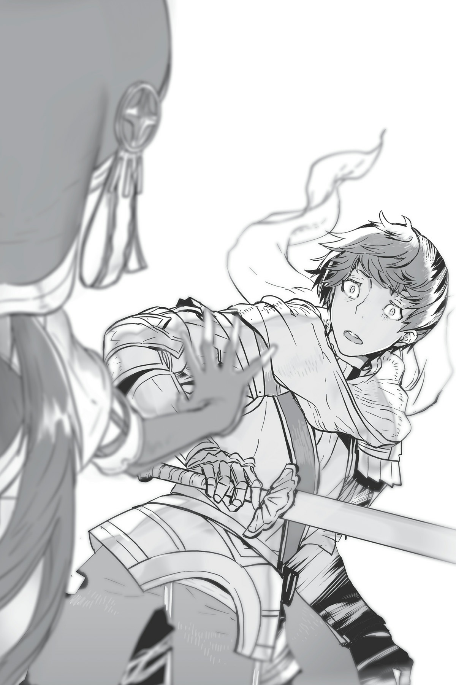
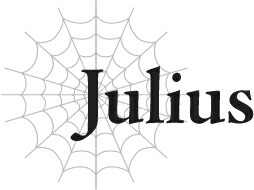

# Julius

Hễ có gặp gỡ, tất có biệt ly.

Sự chia ly đầu tiên của tôi là mất đi mẫu thân.

Bà chưa bao giờ đặc biệt khỏe mạnh, nhưng sau khi sinh Shun, tình trạng của bà xấu đi nhanh chóng cho đến khi qua đời.

“Liệu có khả năng chính cung hoàng hậu đã nhúng tay vào việc này không?”

Có những tin đồn đại loại như vậy, nhưng tôi không tin người vợ đầu tiên của cha tôi lại làm bất cứ điều gì bất cẩn như thế.

Tôi không thể gọi bà ấy là đồng minh của mình, nhưng tôi có một niềm tin nhất định ở bà ấy.

Dù tốt hay xấu, bà ấy vẫn là một nhân vật chủ chốt trong chính phủ của chúng tôi. Bà ấy chỉ thực hiện những hành động mà mình nghĩ là sẽ mang lại lợi ích cho vương quốc.

...Và thành thật mà nói, tôi không thực sự cần biết sự thật về việc mẫu thân tôi đã qua đời như thế nào.

Tôi chỉ là không muốn ghét bỏ bất kỳ ai vì chuyện đó.

Tôi đã vô cùng đau buồn về sự mất mát của mẫu thân, và tôi không muốn nỗi đau buồn đó biến thành lòng thù hận dành cho một người khác.

Không phải chính cung hoàng hậu, bất chấp những tin đồn.

Và không phải Shun, người mà theo một nghĩa nào đó đã được sinh ra bằng cái giá là mạng sống của mẫu thân tôi.

Tôi không muốn ghét một ai trong hai người họ.

Đặc biệt là Shun. Ghét em ấy dường như đồng nghĩa với việc từ chối bằng chứng cuối cùng cho thấy mẫu thân tôi từng sống, và điều đó làm tôi sợ hãi.

Một anh hùng không bao giờ nên ghét bỏ ai đó vì lý do cá nhân.

Loại cảm xúc đó sẽ không làm mẫu thân tôi tự hào.

Tôi liên tục tự nhắc nhở bản thân về điều đó, và thế là tôi có thể đơn giản là đau buồn trước cái chết của mẫu thân mà không oán giận bất kỳ ai vì chuyện đó.

Nếu có một người tôi giận dữ, đó có lẽ là chính bản thân tôi vì đã không đủ mạnh mẽ.

Nếu như tôi mạnh mẽ hơn, có lẽ tôi đã có thể cứu được mẫu thân.

Nỗi lòng đó đã ở lại bên tôi kể từ đó.

Khi tôi nhìn thấy những người mất đi gia đình của họ bởi tổ chức buôn người.

Những người có cha mẹ bị giết bởi quái vật.

Chiếc quan tài chứa thi thể của Ngài Tiva.

“Con người sống rồi một ngày nào đó sẽ chết. Chúng ta không thể thay đổi điều đó. Chúng ta cũng không thể chọn cách mình sẽ chết. Nhưng điều chúng ta có thể lựa chọn là cách mình sống. Cách ông ấy chết không quan trọng, điều quan trọng là cách ông ấy đã sống. Nghĩ về những gì con có thể làm cho người chết, những gì con đã có thể làm cho người chết, chỉ là một hình thức của sự kiêu ngạo mà thôi. Tất cả những gì người sống cần làm là đau buồn cho người chết và nhớ lại cách họ đã sống.”

Đó là những lời của thầy tôi, Trưởng lão Ronandt.

Tôi liên tục thấy mình ước gì mình mạnh mẽ hơn, và mỗi lần như vậy, tôi lại nhớ đến lời của thầy.

Mọi người rồi ai cũng sẽ chết vào một ngày nào đó.

Điều đó nghĩa là chắc chắn sẽ có những sự chia ly.

Tôi chắc chắn thầy tôi đã trải qua nhiều sự chia ly hơn tôi nhiều; không có cách nào để tránh chúng cả.

Tôi nghĩ thầy đang cố nói với tôi rằng tôi nên chấp nhận chúng khi chúng đến, thay vì cứ đắm chìm trong những tiếc nuối, và tiếp tục sống cuộc đời của mình một cách trọn vẹn nhất.

Nhưng đối với tôi, việc sống cuộc đời của mình một cách tốt nhất có thể đồng nghĩa với việc tôi không muốn nhìn thấy ai đó chết ngay trước mắt mình.

Nếu họ ở trong tầm tay, tôi muốn cứu họ.

Thực tế, ngay cả khi họ không ở trong tầm tay, tôi vẫn sẽ tìm cách để cứu họ bằng mọi cách.

Ngay cả khi điều đó đồng nghĩa với việc làm tổn thương chính mình trong quá trình này.

Đó là cách tôi muốn sống cuộc đời của mình.

Tôi chắc chắn thầy tôi sẽ nổi giận nếu nghe tôi nói như vậy.

Nhưng tôi đơn giản là không thể thay đổi cách mình sống.

Con xin lỗi, Sư phụ. Con có lẽ sẽ chết trẻ thôi.

“Hừm. Được rồi, đây là mệnh lệnh từ sư phụ của con. Con bị cấm chết trước ta. Rõ chưa? Và khi ta chết, con phải bám lấy quan tài của ta và khóc thậm chí còn to hơn con đã khóc ngày hôm nay đấy.”

Sư phụ, con có lẽ rốt cuộc sẽ không thể tuân theo mệnh lệnh đó rồi.

Nên nếu thời điểm đó đến, thầy sẽ phải mắng mỏ chiếc quan tài của con thay thế vậy.

*Đồ đệ tử ngốc nghếch!* thầy sẽ nói như vậy.

Phải, tôi đã chấp nhận cái chết của mình từ lâu rồi.

Nhưng... tôi không muốn để bất kỳ ai khác phải chết.

Đó là lý do tôi quyết định mình sẽ là người đầu tiên ra đi.

Tôi đã thề mình sẽ như vậy, thế mà...

Trước mắt tôi, Yaana biến mất khỏi tầm mắt bên dưới chiếc chân của Taratect Nữ Vương.

Tôi không thể xử lý những gì mình đang nhìn thấy.

Yaana vừa mới ở bên cạnh tôi chỉ một giây trước.

Tôi vẫn có thể cảm nhận được hơi ấm của cô ấy nơi cô ấy nắm lấy cánh tay tôi.

Nhưng... nhưng bây giờ...

Bây giờ tôi không còn nhìn thấy Yaana nữa.

Cô ấy đã biến mất rồi.

Mặc dù cô ấy vừa mới ở ngay đây.

Cô ấy đã ở đây...

Thay vào đó, tôi chỉ nhìn thấy chiếc chân của Taratect Nữ Vương.

Nghĩa là Yaana chắc chắn phải ở bên dưới đó...

“Tôi phải cứu cô ấy.”

Lời lẩm bẩm của chính tôi làm tôi giật mình trở lại thực tại.

Đúng vậy.

Tại sao tôi lại cứ đứng trơ ra đó trong sự bàng hoàng chứ?

Tôi phải cứu Yaana.

Sẽ ổn thôi. Tôi vẫn có thể giải cứu cô ấy.

Cô ấy sẽ không sao đâu. Cô ấy phải như thế!

Loạng choạng, tôi cố lết về phía Taratect Nữ Vương.

“Cậu đang làm cái quái gì thế hả?! Tỉnh lại đi!”

Rồi ai đó nắm lấy tay tôi từ phía sau.

Đầu tôi bị ấn xuống, buộc tôi phải nằm sát mặt đất.

Chiếc chân của Taratect Nữ Vương lướt qua ngay phía trên đầu tôi.

Một đòn tấn công quét ngang khác.

Ngay cả với chỉ số cao của tôi dưới tư cách Anh hùng, một đòn trúng trực diện duy nhất cũng có thể giết chết tôi.

Nhận ra mình vừa mới thoát chết trong gang tấc, tôi cuối cùng cũng bắt đầu lấy lại được sự điềm tĩnh của mình.

“Hyrince?”

“Này! Cậu cuối cùng cũng tỉnh lại rồi hả?!”

Chính Hyrince đã đè tôi xuống.

Anh ấy cũng đang nằm trên đất, vừa mới tránh được đòn tấn công của Taratect Nữ Vương trong gang tấc.

Trán anh ấy đang chảy máu, và hơi thở của anh ấy dồn dập.

Ngay cả tấm khiên của anh ấy cũng bị móp méo biến dạng, co rúm lại trước lực tác động khổng lồ mà nó phải gánh chịu.

Nhìn kỹ hơn, tôi nhận thấy cánh tay trái của anh ấy bị vặn vẹo ở một góc độ không tự nhiên.

Hyrince đã đứng trước Taratect Nữ Vương để chúng tôi có thể trốn thoát và đã đỡ đòn trực diện từ nó.

Có vẻ như anh ấy đã xoay xở tự bảo vệ mình bằng tấm khiên, nhưng ngay cả như vậy, nó cũng đã gây ra một số thiệt hại nghiêm trọng.

“Hyrince?! Cánh tay của anh!”

“Không có thời gian để lo lắng về chuyện đó lúc này đâu! Chúng ta phải rời khỏi đây ngay!”

Hyrince tự kéo mình lên bằng cánh tay phải lành lặn và túm cổ áo tôi kéo dậy.

“Đợi một chút! Tôi phải cứu Yaana!”

“?!”

Khi tôi cố ghìm chân lại, khuôn mặt Hyrince vặn vẹo vì tuyệt vọng.

Và rồi anh ấy nói ra điều đó.

“Yaana đã chết rồi!”

Những từ ngữ không thể chối cãi mà tôi không thể chịu đựng để nghe.

Cứ như thể thời gian đã ngừng trôi vậy.

Chắc hẳn tôi vốn đã biết rồi. Tôi chỉ không muốn thừa nhận điều đó mà thôi.

Yaana... đã chết.

Taratect Nữ Vương... đã giẫm lên cô ấy... và nghiền nát cô ấy đến chết.

“Cô ấy đã hy sinh mạng sống của mình để bảo vệ cậu, nên cậu phải sống sót!”

Hyrince nắm lấy vai tôi và kéo mạnh.

Rồi anh ấy nhảy lùi lại kéo tôi theo, đưa cả hai chúng tôi xuống đất một lần nữa.

Chiếc chân của Taratect Nữ Vương vút qua nơi chúng tôi vừa đứng chỉ vài khoảnh khắc trước.

Chính chiếc chân đã nghiền nát Yaana.

Vào khoảnh khắc đó, một thứ gì đó đã vỡ vụn bên trong tôi.

“Julius! Cậu có thể đứng dậy không?!”

“Được.”

Tôi nghe thấy một giọng nói lạnh lùng phát ra từ miệng mình, mặc dù nó không giống như của tôi.

“Julius?”

“Hyrince, anh đi trước đi.”

“Cậu đang làm cái quái gì thế...?”

“Tôi phải giết thứ này.”

Hyrince nghẹn thở trước sự mãnh liệt đột ngột của tôi.

Tôi đứng dậy và nâng thanh kiếm của mình lên.

“Julius! Việc này điên rồ quá!”

Hyrince cố gắng ngăn tôi lại, nhưng chuyện đó không còn quan trọng nữa.

Một anh hùng không được ghét bỏ bất kỳ ai vì lý do cá nhân.

Nhưng từ khoảnh khắc này trở đi, tôi không chiến đấu với tư cách Anh hùng. Tôi chiến đấu với tư cách là Julius Zagan Analeit!

Tôi đẩy Hyrince lùi lại.

Rồi, ngay khi chiếc chân của Taratect Nữ Vương lại quét ngang sang một bên, tôi cúi người xuống và tránh được nó.

Taratect Nữ Vương vô cùng khổng lồ.

Chính vì thế, các chuyển động của nó rất vụng về.

Nó nhanh đến điên cuồng so với kích thước của mình, nhưng nếu tôi biết một đòn tấn công đang đến, tôi có thể né tránh nó!

“Julius!”

Hyrince hét lên tên tôi từ phía sau, nhưng tôi tiếp tục lao về phía trước.

Sử dụng [Cơ động Chiều không gian], tôi chạy nước rút lên không trung cho đến khi ở ngay bên cạnh phần thân chính của Taratect Nữ Vương.

Tôi nhắm vào phần gốc chân của nó, nơi khớp chân của nó được gắn kết.

Lớp vỏ ngoài của nó có lẽ quá cứng để tôi có thể để lại dù chỉ một vết trầy xước.

Nhưng nếu tôi tấn công vào khớp xương...!

*Kenggggg!*

Nhưng thanh kiếm của tôi bị đánh bật ra không chút thương tiếc.

Quên lớp vỏ ngoài đi — tôi thậm chí không thể làm móp khớp xương, nơi đáng lẽ nó phải yếu hơn.

Tại sao chứ?!

Tại sao tôi lại bất lực đến thế này?!

Tôi tuyệt vọng trước sự yếu ớt của mình.

Nhưng không có thời gian cho việc đó: Phần bụng khổng lồ của Taratect Nữ Vương đang lao thẳng về phía tôi.

Nó đang cố nghiền nát tôi bằng cơ thể của mình!

Với kích thước khổng lồ của nó, chuyện đó sẽ vô cùng dễ dàng.

Vào vì kích thước đó, bán kính tấn công của nó lớn đến mức tôi không thể né tránh!

Không thể tránh được cú húc người của Taratect Nữ Vương, tôi bị đẩy rơi xuống đất.

Nhưng ngay trước khi va chạm, tôi đã sử dụng Thổ Ma Pháp để tạo ra một cái hang vừa đủ lớn để tôi có thể thoát thân an toàn.

Tôi trượt vào trong khe hở để tránh bị nghiền nát.

Taratect Nữ Vương, có lẽ cho rằng mình cuối cùng đã kết liễu được tôi, đứng dậy trở lại.

Tôi bò ra khỏi mặt đất và chạy.

Nó rất mạnh.

Các quái vật cấp độ huyền thoại thực sự rất kinh hoàng, mặc dù tôi vốn đã biết điều này.

Giống như Cơn ác mộng của Đại Mê Cung và phượng hoàng.

Tất cả các quái vật cấp độ huyền thoại tôi từng gặp đều có kích thước khổng lồ, và con này cũng không ngoại lệ.

Cuộc chiến của chúng tôi từ trước đến nay đã làm rõ sức mạnh của Taratect Nữ Vương một cách đau đớn.

Hầu hết sức mạnh của nó đến từ các chỉ số cao của mình.

Các đòn tấn công bằng những chiếc chân khổng lồ của nó rất đơn giản, nhưng thế là quá đủ để trở thành một vũ khí chết người.

Và khả năng phòng thủ của nó cao đến mức không đòn tấn công nào của tôi có thể chạm tới nó.

Đơn giản như vấn đề vốn có, nó giới hạn các lựa chọn của tôi một cách nghiêm trọng.

Về cơ bản, tôi cần một đòn tấn công có thể đâm thủng hàng phòng thủ của nó.

Và vì các đòn tấn công của tôi không thể chạm tới nó, bất kể vị thế của tôi dưới tư cách Anh hùng, điều đó cho thấy một nhiệm vụ như vậy sẽ bất khả thi đến nhường nào.

Nhưng tôi không thể lùi bước lúc này.

Tôi sẽ không lùi bước!

Phải, tôi biết rằng cái chết của Yaana là lỗi của tôi.

Bởi vì tôi đã khăng khăng rằng mình sẽ không bỏ chạy, Yaana đã chết để bảo vệ tôi.

Sự bướng bỉnh của tôi, ý thức trách nhiệm của tôi dưới tư cách Anh hùng — đó là những gì đã giết chết cô ấy!

Bởi vì tôi yếu đuối, bởi vì tôi đã không đủ mạnh mẽ!

Tôi biết rằng bỏ chạy là cơ hội tốt nhất để đảm bảo sự hy sinh của cô ấy không trở nên vô ích.

Nhưng nếu tôi làm vậy, tôi sẽ không bao giờ tha thứ cho bản thân mình.

Phải, tôi thực sự ghét một ai đó.

Tôi ghét bản thân mình vì đã bất lực.

Và tôi ghét con Taratect Nữ Vương này vì đã giết chết Yaana!

“Cậu có muốn sử dụng nó không?”

Ngay lúc đó, có một giọng nói vang lên trực tiếp trong đầu tôi.

Theo bản năng, mắt tôi liếc nhìn thanh kiếm còn lại ở thắt lưng mình.

Giọng nói thuộc về Quang Long Byaku, người sống bên trong thanh kiếm đó.

Thanh kiếm Anh Hùng.

Đó là món vũ khí mà chỉ Anh hùng mới có thể sử dụng, được cho là có thể đánh bại bất kỳ đối thủ nào nhưng chỉ có thể sử dụng một lần duy nhất.

Byaku đang hỏi liệu tôi có muốn sử dụng thanh kiếm đó lúc này không.

“...Không.”

Thành thật mà nói, tôi không thể nói đây không phải là một lời đề nghị hấp dẫn.

Taratect Nữ Vương là một quái vật đáng sợ.

Sẽ vô cùng khó khăn để tự mình chiến đấu với nó và giành chiến thắng, nhưng nếu tôi sử dụng Thanh kiếm Anh Hùng, tôi có thể đánh bại nó ngay lập tức.

Khi tôi có được Thanh kiếm Anh Hùng, tôi đã thề với Byaku rằng mình sẽ không sử dụng nó.

Vào thời điểm đó, tôi nghĩ việc sử dụng thanh kiếm này để đánh bại một sinh vật hay một người, đạt được điều đó bằng một sức mạnh không phải của riêng mình, sẽ không bao giờ là con đường dẫn đến nền hòa bình thực sự.

Điều đó vẫn không thay đổi.

Tôi vẫn tin rằng cách duy nhất để tạo ra hòa bình thực sự là thông qua nỗ lực bền bỉ của những người sống trong thời đại đó.

Nhưng ngay lúc này, tôi không định sử dụng nó vì một lý do khác.

“Nếu tôi sử dụng nó lúc này, tôi sẽ không thể sử dụng nó lên Ma Vương.”

Taratect Nữ Vương đã được gửi đến đây bởi Ma Vương.

Theo lời của tên tướng quân ma tộc tự xưng là Bloe kia, ma tộc đang bị ép buộc vào trận chiến vì Ma Vương.

Hắn nói họ sẽ bị quét sạch nếu không làm vậy.

Tôi hiểu rồi.

Nếu ngài ấy đủ mạnh để điều khiển một con Taratect Nữ Vương, không có gì lạ khi họ phải phục tùng ngài ấy.

Nói cách khác, Ma Vương chính là nguyên nhân của tất cả chuyện này!

Tôi thậm chí không thể tưởng tượng việc sử dụng Thanh kiếm Anh Hùng lên bất kỳ ai khác.

“Tôi biết trước đây tôi đã từng nói những lời cao ngạo về nó, nhưng rốt cuộc tôi vẫn sẽ sử dụng Thanh kiếm Anh Hùng thôi. Lên Ma Vương.”

Có vẻ như có lòng thù hận bên trong tôi.

Dành cho bản thân bất lực của mình.

Dành cho con Taratect Nữ Vương đã giết chết Yaana.

Và trên hết, dành cho Ma Vương đã gửi Taratect Nữ Vương đến đây!

Thanh kiếm Anh Hùng mất đi sức mạnh sau một lần sử dụng duy nhất.

Nếu Ma Vương có thể chỉ huy cả Taratect Nữ Vương, tôi chắc chắn mình không thể đánh bại ngài ấy.

Tôi sẽ cần đến sức mạnh của Thanh kiếm Anh Hùng.

...Tôi thật yếu đuối.

Quá yếu đuối để tự mình hoàn thành bất cứ điều gì.

Tôi thậm chí còn không thể bảo vệ được cô gái mình yêu...

Thật thảm hại, nhưng đó là lý do tôi phải sử dụng bất kỳ sự giúp đỡ nào có thể có được.

“Khi thời điểm đó đến, xin hãy cho tôi mượn sức mạnh của ông!”

“...Rất tốt, nếu đó là những gì cậu mong muốn.”

“Cảm ơn ông.”

“Không cần phải cảm ơn ta. Nhưng cậu định làm gì với thứ này lúc này đây?”

Taratect Nữ Vương đang hiện diện trước mặt tôi.

“Tôi định chiến thắng.”

Thành thật mà nói, tôi không biết mình sẽ làm thế nào để chuyện đó xảy ra.

Nhưng ngay cả như vậy, tôi vẫn phải chiến thắng.

“Nếu tôi thua, tôi sẽ quỳ gối tạ lỗi với Yaana ở thế giới bên kia.”

Có lẽ điều đó cũng sẽ ổn thôi.

Thắng hay thua, tôi sẽ không có bất kỳ điều gì hối tiếc.

Với quyết định đó, đầu óc tôi sáng suốt hơn một chút.

Nhưng tôi vẫn không có ý định thua cuộc.

Tôi sẽ trả thù cho Yaana. Cho dù đó có phải là những gì cô ấy mong muốn hay không.

Tôi chiến đấu vì đó là những gì tôi muốn làm!

Không phải với tư cách Anh hùng mà là Julius Zagan Analeit.

“Bắt đầu thôi!”

Tôi bắt đầu thiết lập ma pháp!

Một vài mánh khóe rẻ tiền sẽ không thể làm nên chuyện.

Tôi cần sử dụng tất cả sức mạnh mà mình có!

Thánh Quang Ma Pháp: [Thánh Quang Xạ Tuyến].

[Thánh Quang Xạ Tuyến] đánh trúng trực diện Taratect Nữ Vương.

Cơ thể khổng lồ của nó có thể là một món vũ khí khổng lồ, nhưng nó cũng là một bia đỡ đạn khổng lồ.

Nhưng khả năng phòng thủ của nó quá cao để chuyện đó có thể là một vấn đề nghiêm trọng.

Ngay cả một đòn trúng trực diện từ [Thánh Quang Xạ Tuyến] của tôi cũng không để lại một vết tích nào.

Tôi biết chuyện sẽ diễn ra theo cách đó, dù sao thì thế.

Bạn sẽ không thấy tôi nản lòng dễ dàng như vậy đâu!

Tám con mắt của Taratect Nữ Vương đảo về phía tôi.

Rồi một trong những chiếc chân của nó biến mất.

Nó không thực sự biến mất — nó chỉ di chuyển nhanh đến mức gần như không thể theo kịp.

“Hự!”

Tôi nhào người sang một bên vừa kịp lúc để tránh đòn đánh trực diện.

Ngay cả khi đó, một làn sóng chấn động bùng nổ như một vụ nổ lớn xảy ra ngay bên cạnh tôi, đập mạnh vào cơ thể tôi.

Nhưng tôi không có thời gian để lo lắng về điều đó.

Một chiếc chân khác vừa mới biến mất.

Bất chấp kích thước khổng lồ của nó, nó nhanh đến mức không thể tin được.

Tin vào bản năng của mình, tôi di chuyển sang một bên.

Một luồng gió lớn lướt qua tôi.

Đó chắc chắn là vì Taratect Nữ Vương lại vung chân lần nữa.

Tôi di chuyển đôi chân của mình và tiếp tục chạy xung quanh, biết rằng mình có thể bị nghiền nát nếu di chuyển chậm dù chỉ một giây.

Nhưng tôi không có cách nào chiến thắng nếu chỉ tiếp tục né tránh.

Khi chạy, tôi bắt đầu thi triển một phép thuật mới.

Rồi tôi tung ra một phát bắn [Thánh Quang Xạ Tuyến] khác.

Tôi nhắm vào những con mắt khổng lồ của nó!

Đôi mắt là điểm yếu của bất kỳ sinh vật sống nào.

Ngay cả với sức mạnh phòng thủ không thể tin nổi của Taratect Nữ Vương, đôi mắt của nó chắc chắn vẫn phải dễ bị tổn thương.

Chắc chắn rồi, Taratect Nữ Vương né tránh lần đầu tiên, mặc dù nó đã phớt lờ tất cả các đòn tấn công khác của tôi cho đến nay.

Nó khéo léo tránh được phát bắn [Thánh Quang Xạ Tuyến] đáng lẽ đã đánh trúng ngay mắt nó.

Điều đó chắc chắn có nghĩa là nếu tôi có thể đánh trúng mắt nó, tôi có thể gây sát thương cho Taratect Nữ Vương.

Thời gian giữa lúc thi triển ban đầu của [Thánh Quang Xạ Tuyến] và khi nó trúng đích là cực kỳ ngắn, nên thông thường nó không trượt.

Phải nói rằng, nó mất một thời gian để thiết lập, nên có thể dễ dàng đoán trước khi tôi chuẩn bị nó.

Tuy nhiên, ngay lúc nãy, Taratect Nữ Vương đã né được [Thánh Quang Xạ Tuyến] của tôi sau khi nó được bắn ra.

Nghĩa là Taratect Nữ Vương nhanh ngang ngửa với [Thánh Quang Xạ Tuyến] hoặc thậm chí còn nhanh hơn.

Không phải là nó không thể tránh được các đòn tấn công của tôi từ trước đến nay. Nó đơn giản là không né tránh chúng vì không có lý do gì để bận tâm cả.

Cách duy nhất tôi có thể gây sát thương cho Taratect Nữ Vương là dừng các chuyển động của nó bằng cách nào đó và đánh trúng mắt nó bằng tất cả sức mạnh của mình.

...Dừng thứ khổng lồ này di chuyển sao?

Liệu chuyện đó có khả thi không chứ?

Không, tôi không thể bị đe dọa lúc này được!

Tôi vốn đã biết trước khi vào trận rằng cơ hội chiến thắng của mình là rất mong manh!

Taratect Nữ Vương cũng là một sinh vật sống.

Nó không phải là vô địch, cũng không phải là bất tử.

Điều đó nghĩa là tôi có thể đánh bại nó.

Tôi có thể, và tôi sẽ làm được!

Tám con mắt của Taratect Nữ Vương hướng vào tôi.

Lần đầu tiên, tôi có thể nhìn thấy một cảm xúc trong những con mắt đó.

Sự kích động.

Cho đến nay, nó đã chiến đấu với tôi gần như tự động, mà không thể hiện bất kỳ sự quan tâm nào cả.

Có vẻ như trận chiến thực sự sắp bắt đầu rồi.

Ngay khi tôi bắt đầu gồng mình chuẩn bị, tôi đột ngột bị thổi bay đi.

“Hự?!”

Máu phun ra từ miệng tôi.

Tôi thậm chí không thể biết chuyện gì vừa xảy ra.

Tất cả các đòn tấn công của nó từ trước đến nay cũng đều đáng sợ, nhưng không đòn nào nhanh đến mức tôi không thể xử lý chuyện gì đang xảy ra cả.

Điều đó nghĩa là nó đã nương tay suốt thời gian qua sao?

Nhưng tại sao chứ?

Trong khi suy nghĩ của tôi xoay chuyển dữ dội, Taratect Nữ Vương từ từ bắt đầu bước đi.

Cố tình chậm rãi, như thể để phô diễn hình thể khổng lồ của nó.

“Hừ... ư-ự-ự!”

Tôi bật dậy đứng lên.

Để đáp lại, Taratect Nữ Vương từ từ nâng cao chân lên không trung.

Như thể nó muốn cho tôi thấy sự tuyệt vọng thực sự trông như thế nào.

Thành thật mà nói, thực sự có cảm giác như đây là giới hạn tôi có thể đi được rồi.

Tôi thậm chí còn liếc nhìn Thanh kiếm Anh Hùng ở hông mình, tự hỏi liệu mình có phải sử dụng nó rốt cuộc hay không.

Khi chiếc chân đó hạ xuống, tôi gần như chắc chắn rằng mình sắp chết.

Nhưng tôi đã không chết.

Một loạt các phép thuật khổng lồ đánh trúng vào bên hông của Taratect Nữ Vương.

“Hả?”

Ai trên đời này đã làm chuyện đó chứ?!

Nhìn về hướng ma pháp bay tới, tôi thấy một nhóm lớn binh sĩ đang lao về phía này trên lưng ngựa.

Các binh sĩ đã ở Pháo đài Kusorion.

“Tại sao chứ?”

Tôi đã nghĩ mình đã bảo họ chạy đi rồi cơ mà...

“Bảo vệ Ngài Anh hùng!”

“Chúng tôi ở đây để giúp đỡ!”

“Hãy cứ sử dụng bất cứ thứ gì mọi người có đi!”

Phi nước đại xung quanh trên lưng ngựa, các binh sĩ tiếp tục thi triển phép thuật.

Ma pháp như thế sẽ không làm tổn thương được Taratect Nữ Vương.

Nhưng, có lẽ bị làm phiền bởi nó, con quái vật khổng lồ hạ thấp chiếc chân mà nó định nện xuống tôi.

“Chúng tôi sẽ là kiểu binh sĩ gì nếu bắt Anh hùng phải làm mọi thứ chứ?!”

“Ngài Anh hùng đã cứu con tôi! Đây là cơ hội duy nhất của tôi để đền đáp ngài!”

“Chúng ta sẽ cho chúng thấy con người có thể làm gì khi bị dồn vào chân tường!”

Các binh sĩ hét lên khi họ lao lên phía trước, như thể họ đang trút bỏ tất cả nỗi sợ hãi của mình.

“Tất cả họ đều chạy đến đây để giúp cậu đấy.”

“Hyrince?!”

Bằng cách nào đó, Hyrince đang đứng bên cạnh tôi.

“Nhưng tôi nghĩ anh đã chạy đi rồi chứ?”

“Đồ ngốc! Không đời nào tôi lại bỏ lại cậu phía sau cả!”

Hyrince gõ vào đầu tôi bằng bàn tay trái bị gãy của anh ấy.

“Mọi người khác cũng vậy. Họ không thể chỉ việc chạy đi và bỏ lại cậu ở đây được. Mọi người đang hy vọng và cầu nguyện cho cậu được sống — cậu không hiểu sao? Điều đó bao gồm cả Yaana nữa.”

“......”

Tôi phải trả lời thế nào trước một điều như vậy đây?

Rốt cuộc, tôi đang ích kỷ ngay lúc này.

Tôi đang chiến đấu dưới tư cách một cá nhân, không phải Anh hùng.

“Tôi không thể bắt mọi người đi cùng với sự ích kỷ của mình...”

“Chắc chắn cậu có thể mà. Cậu luôn đặt bản thân mình sau cùng, cậu biết đấy? Sẽ không ai bận tâm nếu cậu muốn ích kỷ một lần trong đời đâu.”

Hyrince đảm bảo với tôi rằng mọi chuyện sẽ ổn thôi, ngay cả khi điều đó đồng nghĩa với việc kéo rất nhiều người vào một trận chiến sinh tử tuyệt vọng.

“Cậu sẽ chiến thắng, đúng không?”

“...Được.”

“Vậy thì hãy hoàn thành nó như một Anh hùng thực sự đi!”

“Rõ rồi!”

Taratect Nữ Vương bắt đầu di chuyển trở lại, như thể nó đang đợi cuộc trò chuyện của chúng tôi kết thúc.

Nhưng nó quay về phía các binh sĩ đang lao tới.

“Nguy rồi!”

Cái miệng của con quái vật khổng lồ mở ra.

Nó sắp sử dụng một đòn tấn công hơi thở.

Đòn tấn công tương tự đã phá hủy Pháo đài Kusorion!

Tôi nhảy vào giữa Taratect Nữ Vương và các binh sĩ.

“Julius?!”

Nhanh chóng, tôi thiết lập một phép thuật.

“Hãy nghe kỹ đây, Julius. Nếu tất cả những gì con muốn làm là sử dụng ma pháp, các kỹ năng là quá đủ cho việc đó. Nhưng nếu con thực sự muốn làm chủ ma pháp, điều đó là chưa đủ tốt. Con thường tạo ra và giải phóng các phép thuật như thế nào? Hãy nhận thức được điều đó, và tự hỏi bản thân làm thế nào con có thể thực hiện nó mạnh hơn, nhanh hơn, và chính xác hơn.”

Đó là những gì sư phụ của tôi đã dạy tôi.

Nên tôi cố gắng hết sức để lưu tâm.

Tôi đang sử dụng ma pháp như thế nào, và tôi muốn nó làm gì?

Ngay lúc này, điều tôi muốn là một tấm khiên kiên cố có thể bảo vệ tất cả mọi người!

“Thay vì cố gắng chịu đựng toàn bộ sức mạnh của nó, tôi chỉ đơn giản là thay đổi hướng đi của nó.”

Tôi nhớ lại điều gì đó Ngài Tiva từng nói.

“Nếu đối thủ của con quá mạnh, con sẽ không đạt được gì nhiều bằng cách cố gắng chặn các đòn tấn công của họ trực diện. Đôi khi, con phải tạo ra một sơ hở bằng cách chuyển hướng sức mạnh của họ.”

Đây chắc chắn phải là ý của ông ấy!

Tôi nghiêng tấm khiên ánh sáng tôi đã tạo ra ở một góc độ.

Khi đòn tấn công hơi thở của Taratect Nữ Vương gầm rú phóng ra, tôi chuyển hướng nó bằng tấm khiên của mình.

“Hừ... ư-ự-ự...!”

Tác động rất dữ dội.

Nó quá mạnh để tôi có thể chuyển hướng nó hoàn toàn.

Với đà này, nó sẽ chọc thủng mất!

“Nếu cậu không thể tự mình làm được, chúng ta chỉ việc cùng nhau làm chuyện đó, đúng không? Ngay cả khi cậu không đủ mạnh một mình, chúng ta sẽ đủ mạnh dưới tư cách là một đội. Hãy xem những gì vừa xảy ra. Cậu có thể không có cơ hội nếu cậu đơn độc, nhưng chúng tôi đã ở bên cậu. Đó là lý do tại sao tất cả chúng ta đều trở về sống sót. Cậu có những người bạn muốn chiến đấu bên cạnh cậu, thấy không? Nên hãy cố gắng dựa dẫm vào chúng tôi nhiều hơn đi.”

“Hyrince!”

Tôi gọi tên người bạn thân thiết đã nói những lời đó.

“Có ngay đây!”

Ngay lập tức, Hyrince chạy lại hỗ trợ tôi.

Anh ấy chắc hẳn đang đau đớn, vì tay anh ấy bị gãy, nhưng anh ấy vẫn đẩy với tất cả sức lực của mình.

“Aaaaah!”

Với sự giúp đỡ của Hyrince, tôi đẩy ngược hơi thở cho đến khi nó thay đổi hướng đi và nảy ra ngoài không trung một cách vô hại vào bầu trời.

Taratect Nữ Vương lùi lại, trông có vẻ sửng sốt lần đầu tiên.

“NGAY BÂY GIỜ!”

Các binh sĩ nắm lấy cơ hội đó để lao lên phía trước trên lưng ngựa.

Với khả năng phòng thủ cao của Taratect Nữ Vương, điều đó có lẽ sẽ không gây ra bất kỳ đau đớn nào cho nó.

Nhưng khi hàng chục hiệp sĩ lao vào cùng một lúc trong khoảnh khắc do dự ngắn ngủi của con quái vật, ngay cả khi nó không gây ra bất kỳ sát thương nào, thì nó cũng quá đủ để làm mất thăng bằng những chiếc chân đó.

Taratect Nữ Vương loạng choạng vài bước.

Đó là một sơ hở nhỏ nhưng rất rõ ràng.

“Đi đi!”

“Có ngay!”

Hyrince đẩy tôi lên phía trước, và tôi sử dụng đà tiến đó để nhảy lên thật cao.

Sử dụng [Cơ động Chiều không gian], tôi xoay người trên không trung, lấp đầy thanh kiếm của mình bằng ánh sáng thánh.

Taratect Nữ Vương lườm tôi.

Tôi chọn một trong những con mắt của nó và đâm thanh kiếm của mình vào đó với tất cả sức lực!

“!!!!!!!!!!!!!!!!!!”

Tiếng hét đau đớn của Taratect Nữ Vương làm rung chuyển cả không khí.

Tôi cuối cùng đã xoay xở gây ra được một số sát thương cho nó!

Tất cả những gì tôi làm chỉ là nghiền nát một con mắt, nhưng thế là quá đủ rồi!

“Vật phẩm ma pháp được tạo ra để sử dụng, cậu biết đấy? Chẳng có ích gì khi chết để bảo tồn chúng cả.”

“Vũ khí cũng là một phần sức mạnh của cậu. Có gì sai khi sử dụng chúng để giành chiến thắng chứ?”

Lời nói của Hawkin và Jeskan vang lên trong tâm trí tôi.

Phải, đây là thời điểm hoàn hảo để sử dụng thứ đó!

Tôi cúi người xuống và rút nó ra từ bao kiếm của mình.

Không, không phải Thanh kiếm Anh Hùng.

Đó là một thanh đoản kiếm.

Một thanh ma kiếm được biết đến là “ma kiếm bộc phá”.

Thanh ma kiếm cuối cùng trong số mười thanh ma kiếm mà sư phụ đã trao cho tôi!

Giống như Thanh kiếm Anh Hùng, chúng chỉ có thể được sử dụng một lần duy nhất.

Tôi đâm sâu thanh kiếm này vào con mắt bị thương của Taratect Nữ Vương.

“Haaaah!”

Rồi tôi thi triển một phát bắn [Thánh Quang Xạ Tuyến] để đưa nó vào sâu hơn nữa!

Có một vụ nổ xảy ra.

Và rồi là một khoảnh khắc im lặng.

“Nó đang đổ xuống sao?!”

Thân hình khổng lồ của Taratect Nữ Vương từ từ nghiêng sang một bên.

Tôi vội vã di chuyển ra xa nó.

Vài giây sau, con quái vật khổng lồ đâm sầm xuống đất, tạo ra những cơn chấn động lớn trong lòng đất.

“...Chúng ta... đã thắng sao?”

Hyrince lẩm bẩm trong sự hoài nghi.

Tôi từ từ nâng thanh kiếm của mình lên bầu trời.

“A... AAAAAAAAH!”

Một trong những binh sĩ lớn tiếng reo hò chiến thắng.

Tôi tiếp tục giữ cao thanh kiếm của mình, ghi nhận những tiếng reo hò.

Đừng khóc lúc này!

Chừng nào mọi người còn đang nhìn, tôi phải tiếp tục làm Anh hùng.

Sau đó, khi tôi ở một mình, đó mới là lúc tôi khóc hết nước mắt.

Nhưng tôi nghĩ mình ít nhất có thể được phép hét lên một tiếng.

“AAAAAAAAAH!”

Tôi làm được rồi, Yaana ơi.

Trong khi mọi người ăn mừng chiến thắng trước Taratect Nữ Vương, Hyrince nhanh chóng bước đi xa.

Nhận thấy anh ấy, tôi lặng lẽ đi theo.

Rồi Hyrince dừng lại.

Ngay khi tôi di chuyển để tham gia cùng anh ấy...

“Đừng có lại gần đây!”

...anh ấy hét lên ngăn bước chân tôi.

“Hyrince... cô ấy... ở đó sao?”

“Ừ...”

“Vậy thì tôi — ”

“Đừng! Julius, cậu không được phép bước qua đây đâu!”

Cô ấy ở ngay đây.

Nhưng Hyrince không cho phép tôi nhìn thấy cô ấy.

“Làm ơn đi. Tôi xin cậu đấy — đừng có bước qua đây. Đừng nhìn. Tôi chắc chắn Yaana cũng không muốn cậu nhìn thấy cô ấy như thế này đâu...”

Giọng Hyrince nghẹn ngào với những tiếng nức nở khó nhọc kiềm chế.

Yaana được giấu phía sau anh ấy, tấm lưng rộng của anh ấy chặn tầm nhìn của tôi.

Nhưng Hyrince đang cầu xin tôi đừng nhìn.

Chỉ riêng điều đó thôi là đủ để tôi tưởng tượng cô ấy chắc hẳn đang ở trong trạng thái khủng khiếp như thế nào.

Và tôi không thể mang bản thân phớt lờ lời nói của Hyrince để tự mình đi xem được.

Tôi không... đủ dũng cảm... để nhìn.

...Tôi là kiểu Anh hùng gì thế này chứ?

Làm sao tôi có thể tự gọi mình là Anh hùng nếu tôi thậm chí không thể bảo vệ được cô gái mình yêu cơ chứ?!

Nước mắt bắt đầu trào ra trong mắt tôi, nhưng tôi ghìm chúng xuống.

Chưa được đâu.

Tôi chưa thể khóc được.

“?! Julius!”

Nhờ tiếng hét cảnh báo của Hyrince, tôi vừa vặn đỡ được lưỡi kiếm đang lao về phía mình.

“Tặc!”

Tôi nghe thấy ai đó tặc lưỡi gần đó và lập tức vung kiếm về hướng đó.

Có tiếng kim loại va chạm chói tai khi vũ khí của chúng tôi đụng nhau.

Không ai khác chính là Bloe, tên tướng quân ma tộc tôi đã chiến đấu trước đó.

Hắn nhảy lùi lại, đòn đánh bất ngờ kết thúc bằng thất bại.

“Ông nghiêm túc vẫn muốn chiến đấu sao?!”

Taratect Nữ Vương đã chết.

Đó chắc chắn phải là món vũ khí bí mật lớn của ma tộc.

Vì chúng tôi đã đánh bại nó, chắc chắn tinh thần của họ đã bị phá vỡ vào lúc này rồi.

Vậy tại sao hắn vẫn muốn chiến đấu chứ?

Nhìn ra phía sau hắn, tôi nhận ra lũ ma tộc đã tập hợp tại điểm này.

Và theo vẻ bề ngoài, bọn họ vẫn đang hăm hở cho một cuộc chiến.

Nghe thấy tiếng động, các binh sĩ loài người cũng tiến lại tập hợp phía sau tôi.

“Hãy mang binh lính của ông và rời đi đi. Tôi không muốn chiến đấu nữa.”

Tôi bảo Bloe rút quân.

Hắn chắc chắn đã nhận ra trong trận chiến cuối cùng của chúng tôi rằng hắn không thể đánh bại tôi.

Vì đòn tấn công bất ngờ của hắn thất bại, hắn không có cách nào chiến thắng cả.

Và điều cuối cùng tôi muốn ngay lúc này là thêm một trận chiến nữa.

“Làm ơn đi. Đừng bắt tôi phải tiếp tục chiến đấu dựa trên lòng thù hận.”

Nếu chúng tôi chiến đấu ngay lúc này, tôi sẽ trút bỏ lòng thù hận của mình lên những ma tộc này.

Họ cũng có thể là nạn nhân của Ma Vương.

Đó là lý do tại sao tôi không muốn chiến đấu với họ.

“Chúng ta phải chiến đấu ngay lúc này thôi!”

Phớt lờ những cảm xúc chân thành của tôi, Bloe chuẩn bị kiếm của mình.

“Anh hùng! Cậu rất mạnh mẽ; tôi thừa nhận điều đó! Nhưng vẫn vô ích thôi! Nếu cậu gặp khó khăn như vậy trước một trong những quyến thuộc của ngài ấy, cậu sẽ không bao giờ đánh bại được Ma Vương đâu!”

Bloe bắt đầu nói huyên thuyên bằng ngôn ngữ của ma tộc, như thể hắn không thể tiếp tục ghép các câu bằng ngôn ngữ loài người được nữa.

“Cậu không thể thắng được đâu, chết tiệt!”

Giọng nói của hắn tràn đầy sự cay đắng.

“Tôi phải giết cậu tại đây và ngay bây giờ vì lợi ích của tất cả ma tộc!”

Rồi hắn lao về phía tôi.

Tôi chắc rằng hắn có lý do của riêng mình để không từ bỏ.

Nhưng tôi cũng vậy mà, bạn biết đấy!

Tôi không thể để mình bị giết lúc này sau khi Yaana đã chết để bảo vệ tôi!

Tôi gạt thanh kiếm của Bloe sang một bên và sử dụng cú đánh trả để chém vào người hắn.

Bloe đổ gục xuống trong một làn máu phun ra.

“Chết... tiệt... tất cả... Tại sao chứ...?”

Những lời nói ngập ngừng cuối cùng của hắn phát ra bằng ngôn ngữ ma tộc, nhưng tôi có thể đoán được ý nghĩa của chúng.

Tôi có thể cảm nhận được những cảm xúc đau khổ phía sau chúng.

Nhưng tôi không thể thể hiện sự nhân từ với một kẻ thù đang tấn công mình.

Nhìn xa khỏi thi thể của Bloe, tôi quay về phía lũ ma tộc còn lại.

“Tôi sẽ nói lại một lần nữa. Hãy rời đi ngay!”

Tôi đưa cho họ một lời cảnh báo cuối cùng.

Nếu họ vẫn khăng khăng lao vào tôi sau đó, thì tôi sẽ không còn lựa chọn nào khác...!

Nhưng rồi một cô gái duy nhất bước ra từ giữa lũ ma tộc.

Một cô gái trắng bệch đến mức khiến tôi rùng mình sống lưng.

“Hãy nghe kỹ đây, Julius. Con người rất yếu đuối. Vô cùng yếu đuối. Hầu hết con người thậm chí còn yếu hơn ta, đó là lý do tại sao họ nhìn ta và nói rằng ta mạnh mẽ. Nhưng ta cũng chỉ là con người mà thôi. Ta mạnh mẽ theo tiêu chuẩn con người, nhưng chỉ có thế.”

Từ hư không, tôi nhớ lại điều gì đó sư phụ từng nói với tôi.

“Đối với những người có sức mạnh thực sự, sức mạnh của con người bình thường chẳng là gì cả.”

Tôi đã tự mình trải nghiệm điều đó trước đây rồi.

Từ lâu rồi, khi tôi tận mắt chứng kiến quái vật đáng sợ được gọi là Cơn ác mộng của Đại Mê Cung.

Vì lý do nào đó, tôi cảm thấy nỗi sợ hãi tương tự lúc này.

Rồi cô gái mở mắt ra...

Một chiếc khăn quàng cổ bay xuống đất, chủ nhân của nó đã biến mất.

---

[◀ Chương trước: Yaana](19_yaana.md) | [Chương tiếp theo: White 2 ▶](21_white_2.md)
