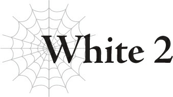

# White 2

“……”

Trong phòng trung tâm chỉ huy, bầu không khí hoàn toàn ngột ngạt.

Biểu cảm của Ma Vương rất nghiêm trọng.

Balto không có ở đây.

Anh ta đã được thông báo về cái chết của Bloe.

Sau khi nói rằng mình muốn yên tĩnh một mình vào lúc này, Balto đã rời khỏi phòng.

Tất cả những người còn lại chỉ có Ma Vương, Güli-güli — biệt danh Black — và tôi.

Phải, đúng vậy đấy. Chỉ huy Quân đoàn 9 bí ẩn, mật danh Black, thực chất chính là Güli-güli!

Được rồi, tôi biết bây giờ không phải là lúc đùa giỡn như vậy.

Tâm trạng u ám bao trùm căn phòng phần lớn là xuất phát từ Black ở đây.

“...Ta không có tư cách để phàn nàn.”

Cuối cùng, chậm rãi, Black cất tiếng nói.

“Xin lỗi, ta tin rằng mình cần một chút thời gian.”

Nói xong, Black cũng rời đi.

Chà, tôi không thể trách anh ta được.

Tôi chắc rằng anh ta có một số suy nghĩ về cách mọi chuyện diễn ra.

Ma Vương nhìn Black rời đi, rồi thở dài một tiếng nặng nề.

“...Không có gì diễn ra theo đúng kế hoạch cả, cậu biết chứ?”

“...Ừm.”

Thẳng thắn mà nói, trận chiến này là một thất bại hoàn toàn.

Chúng tôi có vài mục tiêu quan trọng, và chúng tôi hầu như không hoàn thành được mục tiêu nào trong số đó cả.

“Vậy là những chỉ huy quân đoàn chúng ta mất đi là Huey, Bloe và Agner sao...”

Ma Vương lẩm bẩm tên của các chỉ huy đã tử trận.

Trong ba người đó, tôi không quá đau lòng về tên nhóc shota Huey, nhưng sự mất mát của Agner thực sự rất khó chấp nhận. Lão ta là một người rất có năng lực về nhiều mặt.

Và rồi còn có Bloe nữa.

Cậu ta rất phiền phức này nọ, nhưng tôi không ghét cậu ta.

“...Vậy, White. Tại sao cô không đưa Agner và Bloe trở về?”

Sự nghi ngờ của Ma Vương là điều dễ hiểu.

Nếu tôi thực sự muốn, tôi đã có thể cưỡng chế dịch chuyển hai người họ và đưa họ trở về rồi.

Tùy thuộc vào góc nhìn của bạn, chuyện này trông có vẻ như tôi đã để mặc cho họ chết vậy.

“Nguyên tắc.”

“Hử?”

“Về nguyên tắc. Agner và Bloe đều đang chiến đấu đánh cược mạng sống của mình. Đã chuẩn bị sẵn sàng để chết. Can thiệp vào có vẻ không đúng lắm.”

Agner và Bloe đều biết mình gần như chắc chắn sẽ chết, nhưng họ vẫn chiến đấu đến cùng.

Tôi không thể mang bản thân đi bôi nhọ sự kiên định đó được.

Sự quyết tâm mãnh liệt của họ gợi nhớ cho tôi về những khoảnh khắc cuối cùng của Araba. Tôi không muốn can thiệp.

“Hiểu rồi.”

Ma Vương không gặng hỏi thêm về chuyện đó nữa.

Cái chết của Huey là một tai nạn nhỏ, nhưng chúng tôi không hề lên kế hoạch để Agner và Bloe chết, và chúng tôi đã có thể ngăn chặn nó.

Nhưng chúng tôi đã không làm vậy.

Cái chết của họ là một sự tính toán sai lầm nghiêm trọng.

Nhưng còn có một sự tính toán sai lầm còn lớn hơn thế nữa.

“Ta chưa bao giờ tưởng tượng được Anh hùng lại có thể đánh bại được con Nữ Vương đó.”

“...Vâng.”

Thảm họa bất ngờ lớn nhất là việc Anh hùng đánh bại Taratect Nữ Vương.

Không, bản thân việc cậu ta chiến thắng không phải là vấn đề.

Thực tế, chúng tôi gửi nó đi là để Anh hùng đánh bại nó... nhưng chỉ sau khi sử dụng Thanh kiếm Anh Hùng mà thôi.

“Ta vẫn không thể tin được cậu ta đã thắng mà không sử dụng thứ chết tiệt đó. Cân nhắc sự khác biệt về chỉ số và sức mạnh của họ, đó là một phép màu hay gì vậy?”

“Ừm.”

Tôi không thể trách ngài ấy vì đã phàn nằn.

Không đời nào Anh hùng có thể đánh bại được con Nữ Vương đó, bất kể cậu ta có cố gắng thế nào đi nữa.

Cậu ta bắt buộc phải sử dụng Thanh kiếm Anh Hùng để có bất kỳ cơ hội sống sót nào qua trận chiến, hoặc chúng tôi đã nghĩ như vậy.

Thanh kiếm đó cực kỳ nguy hiểm.

Đó là một thanh thần kiếm mà người bạn cũ D của chúng tôi đã để lại trong thế giới này, có khả năng tiêu diệt ngay cả một vị thần.

Nó chỉ sử dụng được một lần duy nhất, nhưng việc để một món vũ khí nguy hiểm như thế nằm lăn lóc xung quanh là không an toàn chút nào.

Nên khi biết rằng nó đã rơi vào tay của Anh hùng hiện tại, tôi đã quyết định ép cậu ta phải lãng phí nó.

Đó là mục đích tồn tại của con Nữ Vương đó, vì sẽ không có vấn đề gì nếu cậu ta đánh bại con đó.

Mục tiêu chính chỉ là thu thập năng lượng được giải phóng bởi Thanh kiếm Anh Hùng.

Nhưng bằng cách nào đó, cậu ta đã xoay xở không sử dụng nó.

Nói về một sự tính toán sai lầm nghiêm trọng.

“Chà, chúng ta không mất mát gì lớn, nên tôi đoán mọi chuyện vẫn ổn,” tôi nói thành lời. “Chúng ta luôn có thể tạo ra một con Nữ Vương khác mà. Dù sao đó cũng chỉ là một con Nữ Vương giả mà thôi.”

Thứ đó không phải là một con Taratect Nữ Vương thực sự.

Nó là một trong các phân thân của tôi.

Nhờ những năm huấn luyện của tôi, các “tôi tí hon” của tôi đã tiến hóa hoàn toàn thành các “tôi khổng lồ” rồi đấy!

Hắc-hắc-hắc!

Chúng không mạnh bằng một con Nữ Vương thực sự nhưng chắc chắn đủ gần để hạ gục Anh hùng một cách dễ dàng.

Hoặc tôi đã nghĩ như vậy...

Chắc chắn, tôi đã nương tay để Anh hùng có cơ hội sử dụng Thanh kiếm Anh Hùng, nhưng ai mà ngờ được cậu ta lại thực sự chiến thắng mà không cần đến nó chứ?

Thật không thể tin nổi.

“Vậy ra. Nỗ lực can thiệp của chúng ta vào hệ thống cũng thất bại luôn sao?”

Hự!

Sự thất bại cụ thể đó có phần là lỗi của tôi, hoặc ít nhất là do sự thiếu năng lực của tôi.

Trước đó, khi giết chết Anh hùng, tôi đã cố gắng thay đổi hệ thống cùng lúc và xóa bỏ sự tồn tại của các Anh hùng mãi mãi.

Nói cách khác, là loại bỏ tước hiệu Anh hùng.

Tước hiệu Anh hùng có một hiệu ứng đặc biệt chống lại tước hiệu Ma Vương.

Nó được thiết lập để Ma Vương không bao giờ có thể đánh bại được Anh hùng, bất kể chuyện gì xảy ra.

Tôi đã cố gắng can thiệp vào hệ thống để loại bỏ tước hiệu khó chịu đó, nhưng nó đã kết thúc bằng thất bại.

Có một lý do chính đáng cho chuyện đó, nhưng tôi không thể lấy đó làm cái cớ với Ma Vương được...

Nên tôi nghĩ mình sẽ chỉ giữ nó cho riêng mình và gọi đây là một sai sót về phía tôi.

“Nghĩa là một Anh hùng mới đã được sinh ra ở đâu đó rồi, hửm?”

Ma Vương thở dài một tiếng thậm chí còn lớn hơn.

Tước hiệu Anh hùng là một tước hiệu thừa kế.

Khi một anh hùng chết, một ai đó khác trên thế giới sẽ trở thành Anh hùng.

Điều đó nghĩa là không có nhiều ý nghĩa trong việc giết chết Anh hùng, vì dù đó là ai đi nữa, mối nguy hiểm chính là việc họ có thể đánh bại Ma Vương.

Nhưng dù thế, tôi không nghĩ chúng tôi phải lo lắng quá nhiều.

“Không đời nào vị Anh hùng tiếp theo lại giống như người đó đâu. Chắc chắn đấy.”

Trước lời tuyên bố chắc nịch của tôi, Ma Vương chỉ đáp lại “ừm hửm...”

Có chuyện gì với cái nhìn không chắc chắn mà ngài ấy dành cho tôi thế nhỉ?

“White, cô thực sự ngưỡng mộ vị Anh hùng đó nhỉ, hả? Cô dễ bị lung lay trước một khuôn mặt đẹp trai hay gì à?”

“Không. Không phải như thế đâu, được chứ?”

Tại sao tôi cảm thấy như chúng tôi vừa mới có một cuộc trò chuyện như thế này gần đây nhỉ?

“Ta đùa thôi mà. Nhưng đúng vậy. Ta phần nào hiểu được những gì cô đang nói. Đó quả là một Anh hùng tốt.”

“...Vâng.”

Tôi đã theo dõi vị Anh hùng đó qua các phân thân của mình trong một thời gian dài.

Cậu ấy đã có một cuộc sống khá khó khăn, nhưng cậu ấy chưa bao giờ ngừng sống một cách cao thượng.

Tôi không thể tưởng tượng một vị Anh hùng ấn tượng như thế lại xuất hiện lần nữa sớm đâu.

Ma Vương nghịch nghịch chiếc khăn quàng cổ mà Anh hùng đã đeo.

“White, nhìn cái này xem. Hóa ra, nó được làm bằng tơ nhện đấy.”

Ngài ấy chắc hẳn đã sử dụng [Thẩm định] hay gì đó tương tự để kiểm tra chất liệu của chiếc khăn.

“Ta nghe nói nó được giao dịch với giá cao trong thế giới con người, nhưng cô có tin được là Anh hùng lại đang đeo nó không?” Ngài ấy cười khúc khích một cách mỉa mai. “Thật không thể tin nổi.”

Ồ, nghiêm túc sao?

Nói về một sự trùng hợp ngẫu nhiên.

Hóa ra vị Anh hùng đối đầu với một ma vương nhện lại đeo một chiếc khăn làm bằng tơ nhện suốt thời gian qua.

“Vậy chúng ta nên làm gì với thứ này đây?”

Tôi không nghĩ chúng tôi cần phải làm bất cứ điều gì nhiều với nó, nhưng ngài thích làm gì thì làm.

Rồi một nụ cười đen tối lan rộng trên khuôn mặt Ma Vương.

“Chẳng phải em trai của Anh hùng là một người tái sinh sao? Vậy thì hãy trả lại thứ này cho cậu ta đi.”

Nói xong, Ma Vương bắt đầu truyền ma pháp vào chiếc khăn trong tay mình.

Tôi đoán ngài ấy đang đặt một loại hiệu ứng nào đó lên nó.

“Phải, phải rồi. Một món quà nhỏ cho em trai của Anh hùng, chứa đầy [Hộ vệ của Ma Vương]. Khá tuyệt đấy chứ, cô có nghĩ thế không?”

Ừm, không, chuyện đó đối với tôi thực ra có vẻ có ác ý khá tồi tệ đấy.

“A, ta rất muốn nhìn thấy biểu cảm trên khuôn mặt của Yamada khi cậu ta nhận được thứ này...”

Ma Vương cười toe toét đầy phấn khích, nhưng tôi phải nói rằng, đó là một nước đi khá tàn nhẫn.

Tội nghiệp Yamada...

Mãi cho đến sau này tôi mới biết được rằng bản thân Yamada đã được chọn làm Anh hùng mới.

---

[◀ Chương trước: Julius](20_julius.md) | [Chương tiếp theo: Epilogue ▶](22_epilogue.md)
