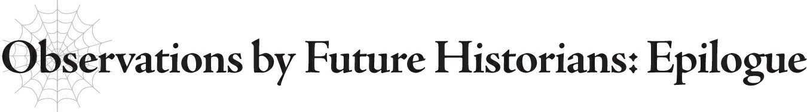

# Epilogue

Đại chiến Nhân-Ma được cho là đã kết thúc với chiến thắng thuộc về ma tộc.

Nhiều pháo đài đã rơi vào tay ma tộc, và Anh hùng, niềm hy vọng cuối cùng của nhân loại vào thời điểm đó, đã bị đánh bại.

Vị Anh hùng của thời kỳ đó, Julius Zagan Analeit, được nhiều người coi là vị Anh hùng cao quý nhất trong lịch sử, nhờ một phần không nhỏ vào nhiều ghi chép để lại bởi người em trai Schlain của cậu ấy, người đã ca ngợi vô số thành tựu và đức hạnh của cậu ấy; ngoài ra còn có nhiều tài liệu còn sót lại khác mô tả những thành tựu của cậu ấy nữa.

Đoạn trích dẫn trước đó từ nhật ký của một binh sĩ được cho là đã được viết sau khi người lính này tận mắt chứng kiến cái chết của Anh hùng Julius.

Trong trận Đại chiến này, nhân loại đã mất đi niềm hy vọng lớn nhất của họ.

Nhưng những ai quen thuộc với các sự kiện tiếp theo có lẽ đều biết rõ:

Ngay cả trận chiến trọng đại này cũng không có gì hơn ngoài một cuộc giao tranh sơ khởi.

Thời kỳ thực sự hỗn loạn.

Không, những từ ngữ sáo rỗng như vậy không thể mô tả đầy đủ những gì sẽ trở thành một bước ngoặt quan trọng trong lịch sử.

Và thời điểm đó đang nhanh chóng cận kề.

---

[◀ Chương trước: White 2](21_white_2.md) | [Chương tiếp theo: Afterword ▶](23_afterword.md)
