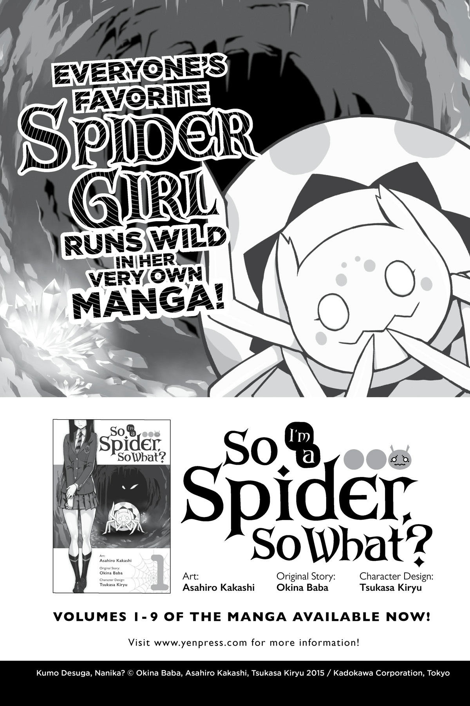
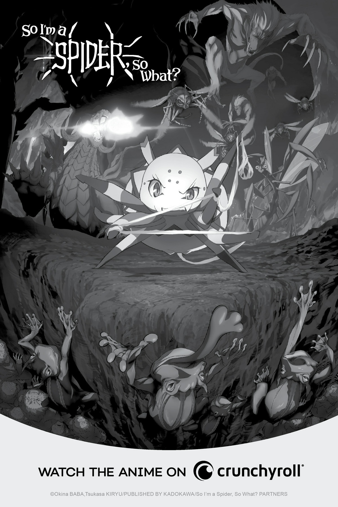

# Lời bạt

Bây giờ là mười hai giờ. Giữa trưa.

Không, khoan đã, đây là Tập 12. Đúng vậy.

Xin chào buổi chiều, tôi là Okina Baba.

Hoặc xin chào buổi tối, cho những ai tham gia cùng chúng tôi vào lúc mười hai giờ đêm.

Vì lý do nào đó, con số mười hai thường gợi lên cảm giác về một sự kết thúc.

Có mười hai giờ trên đồng hồ và mười hai tháng trong một năm.

Nhưng đừng sợ hãi!

Bộ truyện này chắc chắn vẫn chưa kết thúc đâu!

Tôi không biết... tôi chỉ cảm thấy mình có lẽ nên làm rõ điều đó.

Đặc biệt là vì vài câu chuyện đã đi đến hồi kết trong tập này.

Tôi sẽ không nói quá nhiều để không làm hỏng câu chuyện, nhưng tôi tự hỏi độc giả cảm thấy thế nào về cách các nhân vật sống cuộc đời của họ nhỉ?

Những người sống sót sẽ tiếp tục gánh vác ý chí của họ như thế nào?

Đó chính là kiểu tập truyện này hướng tới.

Mặc dù tôi đoán chuyện này cũng chẳng hẳn là spoil gì, vì kết quả vốn đã được đề cập trong các tập trước đó từ lâu rồi!

Theo cách đó, tôi nghĩ tập này là kiểu câu chuyện mà bạn trìu mến trông chừng những khoảnh khắc cuối cùng của họ ngay cả khi đã biết trước nó sẽ kết thúc như thế nào.

*Sụt sịt...*

Tôi nghe nói có một số tác giả khóc trong khi viết, và tôi nghĩ mình hiện tại phần nào hiểu được cảm giác đó rồi.

Tuy nhiên, tôi thì không khóc đâu nhé.

Hử? Thôi nào, đáng lẽ tác giả phải khóc chứ?

Chà, tôi không thể giúp gì được. Tôi là một kẻ tàn nhẫn không có trái tim mà.

Liệu một tác giả có trái tim có bắt nhân vật chính của mình phải trải qua một mê cung khó khăn như vậy không chứ?

Ha-ha-ha.

Mặc dù tôi thực sự đã suýt khóc vì một chuyện khác.

Phải đấy. Tôi suýt khóc vì quá bận rộn.

Tại sao tôi lại bận rộn như vậy, bạn hỏi ư?

Chà, tôi sẽ kể cho bạn nghe ngay bây giờ đây!

*Ta-daaa!*

Anime *Tôi là Nhện đấy, có sao không?* sẽ được phát sóng vào năm 2020!

*Yaaaay! Bốp-bốp-bốp-bốp!*

Đã là một sự chờ đợi dài lâu, tôi biết.

Nhưng anime cuối cùng đã được lên lịch phát sóng vào năm 2020.

Tôi đã làm việc chăm chỉ cho chuyện đó, đó là lý do tại sao tôi bận rộn như vậy.

Nhưng nhờ tất cả những điều đó, cuối cùng chúng ta đã đi được đến đây!

*Woooo!*

Nên anime sẽ bắt đầu phát sóng vào năm 2020 nhé!

Việc phát hành đã bị trì hoãn khá nhiều, nhưng cuối cùng nó cũng đang diễn ra rồi.

Bất kỳ ai đã chờ đợi trần trụi suốt thời gian qua có lẽ đến giờ đã đạt được giác ngộ rồi ấy chứ.

Đó là khoảng thời gian tôi bắt các bạn phải chờ đợi lâu như thế đấy.

Nhưng! Vì các bạn đã kiên nhẫn chờ đợi, chúng tôi đang cố gắng hết sức để đảm bảo nó đáp ứng được kỳ vọng của các bạn.

Oa...

Dự án chuyển thể anime lần đầu tiên được công bố vào năm 2018.

Và rồi...

Năm 2019 kết thúc, và giờ chúng ta đang ở năm 2020.

Nhưng bây giờ, cuối cùng! Cuối cùng!

Thời điểm đó cuối cùng cũng đã đến.

Nên cứ thoải mái giữ vững kỳ vọng của các bạn trong khi chờ đợi thêm thông tin về việc phát sóng anime nhé!

Và! Đi cùng với việc phát hành anime, chúng tôi dự định xuất bản một bộ sưu tập tài liệu tham khảo trong cuốn *Tôi là Nhện đấy, có sao không? EX*!

Giống như bất kỳ cuốn sách tham khảo nào, nó sẽ chứa hồ sơ nhân vật, cũng như lời giải thích về Đại Mê Cung Elroe cùng nhiều thứ thú vị khác.

Nó cũng sẽ bao gồm một số truyện ngắn độc quyền của cửa hàng từ các bản phát hành trước và một số truyện hoàn toàn mới nữa!

Xin vui lòng sử dụng nó để ôn lại trước khi xem anime nhé.

Phù, đó là rất nhiều thông báo đấy.

Năm 2020 chắc chắn sẽ là năm của nhện rồi!

Cuối cùng, cho phép tôi gửi lời cảm ơn thường lệ của mình.

Gửi Tsukasa Kiryu vì những bức vẽ minh họa tuyệt vời như mọi khi.

Thực sự, cảm ơn vì tất cả những gì bạn làm nhé!

Và xin lỗi vì đã tạo ra quá nhiều nhân vật nhé!

Tôi hầu như không bao giờ mô tả ngoại hình của các nhân vật trong văn bản, nên công việc đó luôn thuộc về Kiryu.

Ngay cả đối với thiết kế nhân vật anime, đóng góp của tôi cơ bản chỉ là nói: “Nếu Kiryu thích chúng, thì tôi thấy thế nào cũng ổn cả.”

Tôi thực sự xin lỗi!

Nhưng! Kẻ tàn nhẫn không có trái tim này dự định sẽ tiếp tục tận dụng sự tử tế của bạn chừng nào tôi còn có thể!

Cảm ơn Asahiro Kakashi, người thực hiện bản chuyển thể manga.

Manga rốt cuộc cũng được sử dụng làm tài liệu tham khảo cho anime nữa cơ đấy!

Nhìn thấy điều đó được kết hợp thực sự thuyết phục tôi một lần nữa rằng Kakashi quả thực rất tuyệt vời.

Tôi sẽ phụ thuộc vào bạn nhiều hơn nữa từ nay về sau đấy nhé!

Rồi có Gratinbird, người thực hiện manga ngoại truyện.

Câu chuyện kỳ lạ này vốn đã đủ siêu thực với nhân vật chính là nhện rồi, và giờ họa sĩ này lại bị mắc kẹt với công việc biến bốn bản sao của nhân vật chính thành một bộ manga hài siêu thực hơn nữa.

Bất kỳ ai nghĩ ra kế hoạch này thực sự là một thiên tài đấy.

Và Gratinbird cũng là một thiên tài tương đương khi thực hiện được nó.

Manga rất buồn cười, tôi không thể nhịn được cười thành tiếng, nên xin hãy đọc thử nó nhé.

Cảm ơn tất cả những người tham gia vào bản chuyển thể anime nữa.

Năm 2020! Cuối cùng nó cũng phát sóng rồi!

Gửi biên tập viên cô W của tôi và mọi người khác đã giúp đưa cuốn sách này ra thế giới.

Và gửi đến tất cả các bạn đã đón nhận cuốn sách này.

Cảm ơn các bạn từ tận đáy lòng mình.

---

[◀ Chương trước: Epilogue](22_epilogue.md) | [Chương tiếp theo: Yen newsletter ▶](24_yen_newsletter.md)
