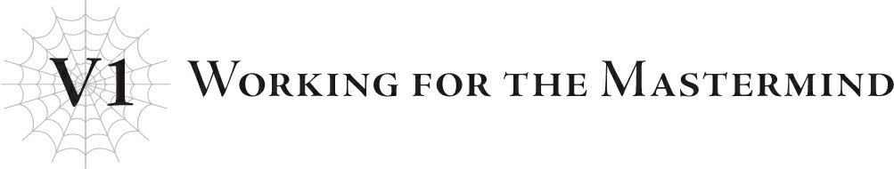
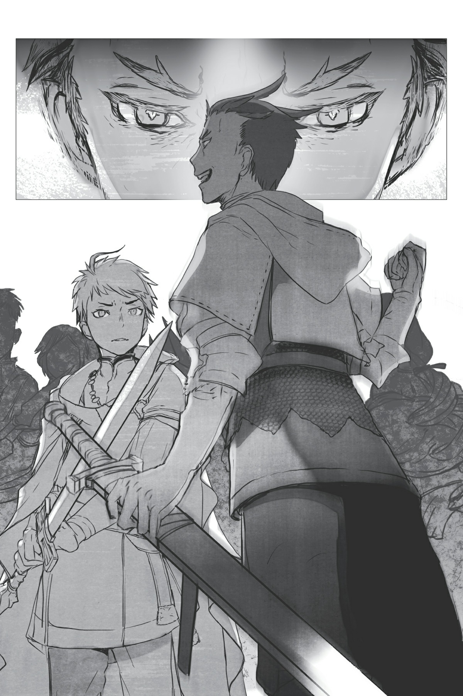
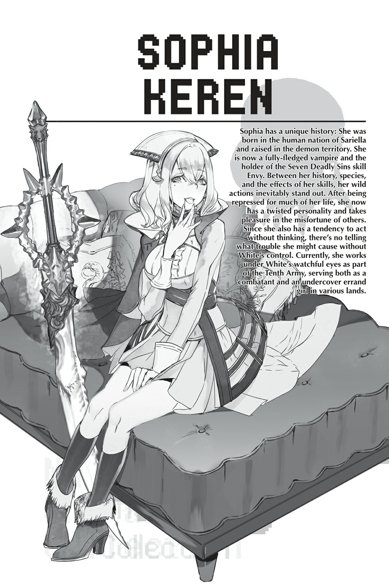

# Chương V1: Làm việc cho kẻ giật dây
*(Working for the Mastermind)*

“Hê hê hê. Cuối cùng cũng tới lúc. Cuối cùng ta cũng có thể bắt lũ khốn đó trả giá vì những gì chúng đã làm với ta!”

Trời đất ơi.

Có kẻ tự tưởng mình ngầu lòi lắm cơ...

“Này, Sophia! Đừng có đứng đực ra đó nữa! Đi thôi!”

“Đến đây, đến đây.”

Một gã khoác trên mình bộ giáp kín kẽ từ đầu đến chân gầm lên đầy sốt ruột khi tôi đang đảo tròn mắt.

Bình thường thì tôi sẽ không bao giờ cam chịu thái độ đối xử kiểu này dù chỉ một giây đâu, nhưng cứ nghĩ đến việc tên thua cuộc này thảm hại đến mức nào là tôi lại chẳng thể nổi giận nổi.

Gã đàn ông đang vác vai nghênh ngang nện bước trước mặt tôi là Hugo Baint Renxandt.

Hắn là hoàng tử của Đế quốc Renxandt và cũng là học sinh tại học viện của Vương quốc Analeit.

Cơ mà hắn cũng chẳng đi học mấy.

Nghe nói khoảng năm năm trước hắn đã gây ra họa lớn và bị đình chỉ học.

Tôi cũng chẳng biết chính xác hắn đã làm hỏng chuyện gì, vì tôi cũng không rảnh để mà bận tâm gặng hỏi. Tuy nhiên, nhìn vào cách hắn lải nhải về “lũ khốn đó”, tôi đoán là hắn đã chọc nhầm người rồi bị lật ngược thế cờ chăng?

Và tôi đoán một trong số “lũ khốn đó” có lẽ chính là Schlain, hoàng tử của vương quốc này, cũng là mục tiêu hiện tại của chúng tôi.

Mệt mỏi thật đấy.

Mà rốt cuộc tôi đang làm cái quái gì ở đây thế này?

Cái việc gọi là “giật dây sau màn” này ấy hả? Mọi người gọi nó như thế đúng không?

Dù thế nào thì nó cũng chẳng hợp với tôi chút nào.

Tôi thà cứ đấm thẳng vào mặt vấn đề một phát cho xong chuyện còn hơn.

Nhưng tôi chỉ biết tự nhủ rằng tất cả những việc này đều là cần thiết.

Hỗ trợ tên ngốc Hugo này là vai trò mà tôi được giao.

Hắn ta cũng là một người tái sinh, nhưng thực ra tôi giúp hắn chỉ vì Chủ nhân quyết định rằng mối thù hằn của hắn sẽ biến hắn thành một quân cờ tiện lợi cho mục đích của chúng tôi.

...Nghĩa là khi nghĩ theo hướng đó, hắn đúng là đáng thương thật.

Và tôi vẫn còn nhớ như in cái khoảnh khắc hắn bị biến thành một quân cờ.

“Khốn kiếp! Tao sẽ không để mọi chuyện kết thúc thế này đâu! Đây là thế giới của tao! Nó tồn tại vì tao, chỉ vì tao mà thôi! Làm sao tao có thể chấp nhận cái kết cục này chứ?! Mơ đi! Chưa kết thúc đâu, chừng nào mọi thứ chưa thuộc về tao thì chưa xong đâu!”

“Con khốn Elf đó! Tao sẽ báo thù! Tao sẽ bắt con khốn đó phải hối hận vì đã dám động vào tao!”

“Một ngày nào đó tao sẽ cướp đi mọi thứ của nó! Giống hệt như cách nó đã làm với tao!”

“Cứ đợi đấy! Tao sẽ hủy hoại tất cả những gì nó trân quý! Rồi tao sẽ đánh nó nhừ tử trong khi nó gào khóc thảm thiết bên đống đổ nát của những thứ đó!”

“Cứ chống mắt lên mà xem! Tao sẽ đoạt lại thế giới này cho riêng mình!”

Hugo vừa gào thét vừa nổi điên đập phá đồ đạc.

“Ta giúp ngươi một tay nhé?”

Vì hắn hoàn toàn chẳng thèm để ý đến sự hiện diện của tôi, tôi thấy chán quá nên đành chủ động lên tiếng trước.

“Đứa nào đấy?!”

Hugo giật mình quay ngoắt lại.

Chủ nhân đã dịch chuyển tôi thẳng vào phòng của Hugo, nên dưới góc nhìn của hắn, tôi như thể đột ngột hiện hình ngay sau lưng hắn vậy.

Tôi cũng chẳng thể trách hắn vì đã giật mình.

Đây là cơ hội hoàn hảo để dạy cho tên ngốc đang hoảng loạn này biết rằng tôi ở đẳng cấp vượt trội hơn hắn.

“Ta không phiền giúp ngươi một tay đâu, dẫu sao chúng ta cũng là những người cùng tái sinh mà, nhỉ?”

Tôi nở một nụ cười đầy ẩn ý nhưng tỏ vẻ bất cần.

“...Hả? Tái sinh?”

Chân mày Hugo cau lại.

À thì, tôi cứ ngỡ hắn không đến nỗi ngu ngốc tới mức chộp ngay lấy cơ hội hợp tác với một kẻ lạ mặt đáng nghi ngờ đột nhiên xuất hiện trong phòng mình...

“...Sao cũng được. Tao đếch quan tâm mày là cái thá gì. Miễn là trả thù được lũ khốn đó, tao sẵn sàng bắt tay với ác quỷ hay bất kỳ ai!”

À, hắn đúng là ngu ngốc tới mức đó thật.

“Được thôi! Tao tham gia!”

“Như vậy đó. Chủ nhân thấy thế nào?”

“Hả?”

Một chiếc bóng trắng toát lướt qua sau lưng Hugo.

Bóng người đó dùng một tay bịt chặt miệng Hugo, khiến hắn không thể hét lên tiếng nào.

Sau đó, khi hắn không còn động đậy được nữa, bàn tay còn lại khẽ chạm vào trán của hắn.

Một con nhện trắng tí hon, nhỏ đến mức có thể nằm gọn trên đầu ngón tay, bò dọc theo bàn tay rồi chui tọt vào tai Hugo...

Vài giây sau, cơ thể Hugo bắt đầu co giật dữ dội.

Cứ như thế, hắn trợn ngược mắt lên rồi ngất lịm đi.

Phải, câu chuyện đó đúng là khá là ghê tởm...

Ngay cả bây giờ, khi hắn đang nghênh ngang bước đi đầy tự tin, con nhện nhỏ đó vẫn đang nằm trong đầu hắn...

Hugo dường như không nhớ gì về sự việc đó, nhưng kể từ đó, hắn ngoan ngoãn một cách kỳ lạ mỗi khi tôi bảo hắn làm gì.

Vậy nên con nhện đó chắc chắn là đang tẩy não hắn rồi...

Không biết có con nào tương tự trong đầu mình không nhỉ...?

Tôi nhanh chóng lắc đầu để xua đi ý nghĩ đáng sợ đó.

Cô ấy đúng là đã đặt một lời nguyền kỳ lạ lên tôi, nhưng cô ấy sẽ không bao giờ đi xa đến mức nhét một con nhện vào đầu tôi đâu!

...Chắc thế.

...Không đâu, cô ấy sẽ không làm thế.

Chủ nhân đúng là sẽ hạ gục bất kỳ thứ gì cản đường cô ấy không chút thương tiếc, nhưng cô ấy thực ra lại khá mềm lòng với những người mình quan tâm.

Vì trên lý thuyết thì tôi cũng nằm trong số đó, tôi tin chắc cô ấy sẽ không làm chuyện như vậy.

Mặc dù chuẩn mực đạo đức của cô ấy có hơi khác người thường một chút, đồng nghĩa với việc đôi lúc cô ấy sẽ làm những chuyện cực kỳ đáng sợ mà không hề chớp mắt.

Nói nghiêm túc thì, có ai lại đi khơi mào cả một cuộc chiến chỉ để đạt được mục tiêu của mình không chứ?

Đặc biệt là một cuộc chiến quy mô lớn đến mức cả hai bên nhân loại và ma tộc đều phải chịu tổn thất nặng nề.

Nhưng chính việc cô ấy làm điều đó mà không một chút do dự mới khiến cô ấy trở thành chủ nhân của tôi, tôi đoán thế.

Ấy thế mà cô ấy lại bảo bọc người trong nhà một cách cực kỳ thái quá.

Điều đó thể hiện rõ qua thái độ của cô ấy đối với cô Ariel.

Cô Ariel mạnh hơn tôi kha khá, nhưng Chủ nhân thực sự bảo bọc cô ấy rất kỹ lưỡng, luôn đảm bảo giữ cô ấy tránh xa chiến trường và bất kỳ mối nguy hiểm nào dù là nhỏ nhất.

Thật lòng thì tôi có hơi ghen tị đấy.

Có thứ gì đó đang trỗi dậy trong lồng ngực, nhưng tôi đã dùng ý chí thép để đè nén nó xuống.

Suýt chút nữa thì nguy hiểm rồi.

Kỹ năng [Đố Kỵ] suýt nữa thì mất kiểm soát.

Kỹ năng [Đố Kỵ] mà tôi sở hữu vô cùng hiệu quả, nhưng nó cũng đi kèm với những tác dụng phụ nghiêm trọng.

Nó khiến việc kiểm soát cảm xúc của tôi trở nên khó khăn hơn nhiều.

Cảm xúc của tôi vốn đã thuộc dạng mãnh liệt, và kỹ năng [Đố Kỵ] lại càng đẩy chúng đến mức cực đoan hơn.

Tôi biết mình có thói quen xấu là hành động theo cảm tính mà không suy nghĩ, và tôi cũng muốn sửa nó lắm, nhưng nói thì lúc nào chẳng dễ hơn làm.

Mặc dù tôi đã có được kỹ năng [Kháng Dị giáo] để giúp giảm thiểu ảnh hưởng của [Đố Kỵ].

Tuy nhiên nó vẫn chưa tiến hóa thành [Vô hiệu Dị giáo], nên vẫn không thể triệt tiêu hoàn toàn các tác động.

Tôi phải tự kiềm chế bản thân.

Để tránh bị phát hiện, tôi hít thở sâu vài nhịp để lấy lại bình tĩnh.

Trong lúc đó, Hugo đã đi trước tôi và đến điểm hẹn.

Hắn đập cửa xông vào mà chẳng thèm gõ lấy một tiếng.

“...Ít nhất thì ngươi cũng phải gõ cửa chứ.”

“Thôi nào, chúng ta là đồng bọn mà, đúng không? Chấp nhận đi.”

Gã đàn ông đang đợi trong phòng chào đón Hugo bằng một cái nhíu mày ngày càng sâu.

Đó là đệ nhất hoàng tử Cylis, kẻ trông lúc nào cũng như đang khó ở hai mươi tư trên bảy.

Cũng như Hugo, hắn là một trong những quân cờ của chúng tôi.

Có thể gọi hắn là Quân cờ số hai.

Hắn là một kẻ tẻ nhạt, thảm hại và chẳng có điểm gì nổi bật ngoại trừ lòng kiêu hãnh hão huyền cùng với việc không chịu thừa nhận rằng các em trai của mình vượt trội hơn mình.

Hắn là đệ nhất hoàng tử, con trai của hoàng hậu danh chính ngôn thuận, thế nhưng đệ nhị hoàng tử Julius lại nổi tiếng hơn hắn gấp bội nhờ danh hiệu Anh hùng.

Và em ruột của Julius, đệ tứ hoàng tử Schlain, thì lại là một thần đồng từ thuở nhỏ.

Trong khi đó, Cylis – vị vua tương lai – cùng lắm cũng chỉ ở mức trung bình.

Thế nên hắn luôn nơm nớp lo sợ một trong những người em trai của mình sẽ cướp mất ngai vàng, hiểu chứ.

Khi chúng tôi đề nghị giúp hắn đuổi cổ người em trai của mình đi, hắn đã cắn câu ngay lập tức.

Về cơ bản thì đây chính là kiểu tranh giành quyền lực mà người ta vẫn thường thấy trong các câu chuyện truyền thuyết.

“Kế hoạch này sẽ thành công chứ?”

Cylis cố tỏ ra cao ngạo để che giấu sự sợ hãi của mình.

“Tất nhiên rồi,” Hugo gắt gỏng. “Mày nghĩ tao là ai chứ?”

Thật tình. Hắn cũng gan dạ gớm cho một kẻ đang phải đi mượn sức mạnh của người khác để đoạt lấy ngai vàng thay vì tự dựa vào chính mình.

Đúng là một kẻ thảm hại bé nhỏ.

Nhưng chính bản tính đó lại giúp chúng tôi dắt mũi hắn dễ dàng hơn bao giờ hết.

“Và không có ai nhìn thấy mặt ngươi chứ?”

“Tất nhiên! Nhìn xem ta đang mặc cái gì này!”

Hugo dang rộng hai tay rồi xoay một vòng để khoe bộ giáp của mình.

Hắn hiện đang khoác bộ giáp che kín toàn thân và đội một chiếc mũ bảo hiểm che khuất cả khuôn mặt.

Sẽ không ai có thể nhận ra kẻ bên trong là ai.

Điều đó nhìn qua là rõ ngay; cái gã tự xưng là hoàng tử này chắc chắn đang lo sốt vó lên nên mới hỏi một câu ngớ ngẩn như vậy.

Chẳng có gì phải lo cả, tên ngốc này.

Ngươi không biết ai đang đứng sau hậu thuẫn cho ngươi sao?

Thất bại là điều hoàn toàn bất khả thi.

Chà, mặc dù trên lý thuyết thì... điều đó chỉ đúng với mục tiêu của chúng tôi, chứ không nhất thiết là cho hai tên này.

Cylis lo lắng đi đi lại lại quanh phòng.

Trái lại, Hugo thản nhiên thả mình xuống ghế, vẻ mặt hoàn toàn bất cần.

Tôi tựa lưng vào tường, khoanh tay trước ngực và kiên nhẫn chờ đợi.

Chắc là sắp đến lúc rồi.

Lắng tai nghe kỹ, tôi nghe thấy tiếng gõ cửa ở căn phòng ngay sát vách.

“Con là Schlain đây ạ.”

“Hửm? Vào đi.”

“Con xin phép.”

Ah, vậy là bắt đầu rồi.

Mục tiêu của chúng tôi, Schlain, đã bước vào phòng bên cạnh.

“Có chuyện gì thế?”

Giọng nói đó là của chủ nhân căn phòng mà Schlain vừa bước vào: cha của hắn và Cylis, quốc vương của vương quốc này.

“Phụ hoàng là người gọi chúng con tới đúng không ạ? Người cần chúng con làm gì sao?”

“Hửm? Ta đâu có gọi các con.”

Ờ thì, tất nhiên là ông không gọi rồi.

Bởi vì chính chúng tôi mới là những kẻ đã dụ hắn tới đây mà.

Sau đó, mọi thứ rơi vào một bầu không khí im lặng đến bất thường.

Trái ngược hoàn toàn với sự im lặng đó, tôi cảm nhận được ma lực đang tràn ngập căn phòng bên cạnh.

Chúng đang sử dụng [Phong ma pháp] để cách âm.

Và rồi kẻ niệm phép cất tiếng.

“Á á á! Hoàng huynh! Anh đang làm gì thế?!”

Phụt.

Đúng là một diễn viên tồi.

Cô nàng vừa cất lên tiếng hét giả trân đó chính là kẻ đã niệm phép.

Lấy tiếng hét đó làm ám hiệu, Cylis lập tức lao ra khỏi phòng, đẩy tung cánh cửa bên cạnh rồi xông thẳng vào trong.

Hugo bám sát theo sau.

Tôi thong thả rảo bước đi theo hai tên đó.

“Có chuyện gì thế này?!”

“Hoàng huynh Schlain đã tấn công phụ hoàng!”

“Cái gì?! Schlain, em phát điên rồi sao?!”

Ồ? Nghe có vẻ như Cylis diễn cũng không tệ đấy chứ.

Có khi hắn nên đi diễn kịch thay vì bon chen giành ngai vàng nhỉ?

Chà, cơ mà giờ thì hơi muộn để đổi nghề rồi.

“Binh lính đâu! Schlain đã ám sát bệ hạ!”

Giọng của Cylis vang dội rõ mồn một khắp hành lang.

Thực ra đó là nhờ tôi đã dùng ma pháp để khuếch đại âm lượng giọng nói của hắn.

Bằng cách này, ngay cả những người chẳng biết chuyện gì đang xảy ra cũng nghe thấy rõ ràng.

“Bắt lấy hắn!”

Khi tôi vô tình ghé mắt nhìn vào trong phòng từ phía hành lang, Hugo đang vung kiếm chém về phía Schlain.

Căn phòng đang ở trong một tình trạng khá hỗn độn.

Quốc vương đã bị bắn xuyên qua trán và tử vong, Schlain đang ôm chặt vết thương vừa bị chém, và một cô gái trẻ nhỏ nhắn đang đứng đó với gương mặt vô cảm.

“Yo. Trông mày không được khỏe lắm nhỉ, ngài Anh hùng.”

“Cậu... Hugo...?”

“Chính xác.”

Hugo tháo mũ giáp ra.

“Hugo. Đừng có tự tiện để lộ mặt như vậy chứ.”

“Thôi nào, có sao đâu? Ta muốn nó được nhìn rõ mặt ta trước khi chết.”

Schlain trông hoàn toàn hoang mang trước cuộc đối thoại giữa Cylis và Hugo.

Vì thế, cậu ta thậm chí còn chẳng nhận ra tôi đã bước vào phòng.

“Mày đang thắc mắc lắm đúng không? Nghe này, ông anh cả của mày muốn ngai vàng. Còn tao muốn báo thù mày và cô Oka. Thế nên mày là cái gai trong mắt của cả hai bọn tao, hiểu chưa?”

“Nhưng... tại sao chứ...? Anh Cylis vốn đã là người kế vị ngai vàng rồi mà...”

“Buồn cười là mày lại nói thế đấy. Nghe này, trước khi về chầu diêm vương, lão vua ngu ngốc đó đã lên kế hoạch lập mày làm người thừa kế. Lão nghĩ rằng nếu mày được sắc phong làm vua trước khi được tuyên bố là Anh hùng, họ sẽ không muốn đẩy mày ra chiến trường!”

“Đời nào ta lại để ngai vàng của mình bị cướp mất vì một lý do ngớ ngẩn như vậy chứ!”

Đúng là quốc vương đã từng có ý định lập Schlain làm vị vua tiếp theo thật.

Chúng tôi thậm chí còn chẳng can thiệp gì vào phần đó.

Mặc dù phần còn lại thì hầu hết là do chúng tôi gây ra.

“Hoàng huynh. Thật không may, anh phải bỏ mạng tại đây rồi.”

Câu nói này thốt ra từ miệng Suelecia, công chúa của vương quốc này, người đã im lặng từ nãy đến giờ.

Vì là công chúa, nên tất nhiên cô ta cũng là em gái của Schlain và Cylis.

“Sue, tại sao chứ?”

“Em đã nhận ra tình yêu đích thực rồi, hoàng huynh yêu quý ạ. Em sẵn sàng làm mọi thứ vì tình yêu đó, kể cả có phải giết chính anh trai mình đi chăng nữa.”

Cô nàng Suelecia này nghe nói vốn dĩ bám Schlain như hình với bóng, nên chắc hẳn cậu ta phải sốc lắm trước biến cố này.

“Hugo! Là do cậu làm đúng không?!”

Tôi đoán việc cậu ta đoán ra được đến mức đó cũng là hợp lý thôi.

“Ối chà. Mày nhận ra rồi cơ à? Lâu lắc thật đấy. Đúng thế, tao làm đấy. Thế nào hả? Cảm giác bị cướp đi thứ gì đó ra sao? Tệ lắm đúng không? Tao biết rõ cảm giác đó lắm, vì chính tao cũng từng bị như vậy mà! Ha-ha-ha-ha!”

Hugo sở hữu một kỹ năng nhất định: [Ái Dục].

Giống như [Đố Kỵ] của tôi, nó thuộc về dòng kỹ năng đặc biệt mạnh mẽ được gọi là kỹ năng Thất Đại Tội.

Hiệu quả chính của nó là tẩy não.

Đó là cách hắn đang thao túng Suelecia.

“Hãy giải trừ cho em ấy ngay lập tức!”

“Mày nghĩ tao sẽ làm thế chỉ vì mày mở miệng xin xỏ tử tế chắc? Đúng là đồ ngu.”

Dù Hugo liên tục ném những lời khinh bỉ về phía Schlain, hắn hoàn toàn không biết rằng bản thân kẻ đi tẩy não cũng đang bị tẩy não.

Thật thảm hại.

Hắn đang đắm chìm trong cảm giác thượng đẳng nhất thời.

Nhưng chính vì quá kiêu ngạo, hắn đã quên mất rằng một con chuột bị dồn vào đường cùng cũng sẽ quay lại cắn.

“Hự! Sao mày vẫn còn nhiều sức mạnh thế?!”

Schlain tức giận đến mức vung nắm đấm thẳng vào Hugo.

Trông như cậu ta cũng chuẩn bị bồi thêm vài đòn ma pháp công kích nữa.

Tôi nghĩ mình nên ra tay giúp đỡ tên ngốc đó thôi.

“Ồ? Cậu ta cứng đầu hơn tôi tưởng đấy.”

“?!”

Tôi kích hoạt các kỹ năng [Thần Lân] và [Long Mạc] để ngăn chặn việc thi triển phép thuật.

Đồng thời, tôi cũng thôi che giấu sự hiện diện của mình, để cho luồng uy áp tràn ngập khắp căn phòng.

Ngay lập tức, Schlain lăn lộn sang một bên để giãn cách cự ly với chúng tôi.

Ồ, phản xạ cũng khá đấy chứ.

Trong khi tôi đang có chút ấn tượng, Schlain quay sang nhìn tôi, và một cảm giác kỳ lạ bao trùm lấy cơ thể tôi.

Cảm giác này... chắc chắn là [Thẩm định] rồi.

Nhưng cậu ta xui xẻo rồi.

Là người sở hữu kỹ năng [Đố Kỵ], tôi cũng là một Kẻ thống trị.

Tôi có thể dùng quyền hạn Kẻ thống trị của mình để chặn đứng phép [Thẩm định] đấy nhé.

Vì thế cậu ta sẽ không đời nào đọc được chỉ số của tôi.

“Sophia! Thằng này là của tao! Đừng có xía mũi vào chuyện của người khác!”

“Ồ, vậy hả? Nhưng tôi thấy có vẻ như cậu đang bị cậu ta đấm cho ra bã thì đúng hơn.”

Đồ ngốc. Nếu tôi không ra tay thì cậu đã gặp rắc rối to rồi.

“Đủ rồi! Ngừng cãi cọ và kết liễu Schlain nhanh lên!”

...Làm ơn đừng có ra lệnh cho tôi được không?

Vả lại, tôi không thể để bất kỳ ai giết Schlain được.

Thế nên chúng tôi cần nhân tố tiếp theo xuất hiện để giúp cậu ta trốn thoát.

“Ta không để các ngươi làm thế đâu!”

Đó, thấy chưa? Viện binh tới rồi kìa.

Một dáng người nhỏ nhắn nhảy tót vào phòng.

Cô ấy lập tức giải phóng ma pháp, thổi bay Hugo đi.

Mặc dù kỹ năng [Long Mạc] của tôi đã làm giảm đi uy lực của nó, nên hắn ta không bị thương tích gì đáng kể.

“Cô Oookaaa!!”

Thấy chưa? Nhìn kìa, hắn vẫn hoàn toàn khỏe mạnh bình thường.

Nhưng có lẽ tôi nên cản cô ấy lại để tránh việc tiếp tục tấn công hắn.

Kẻ đột nhập tí hon này là tộc Elf, người từng là cô giáo Oka của chúng tôi ở kiếp trước. Tôi dùng ma pháp của mình để triệt tiêu đòn ma pháp tiếp theo của cô ấy.

“Em... em sao?!”

Mắt cô ấy trợn tròn.

Dẫu sao thì chúng tôi cũng vừa chạm trán nhau gần đây thôi.

Và đó quả là một cảnh tượng khá chấn động.

Chẳng trách cô ấy lại kinh ngạc đến vậy khi thấy tôi xuất hiện ở đây.

“Shun! Chạy đi!”

Cô Oka dùng ma pháp để phá vỡ sàn nhà, khiến cát bụi bay mù mịt khắp nơi.

“Nhưng mà!”

“Không nhưng nhị gì hết! Hiện tại chúng ta phải rút lui trước đã!”

“Anh Hyrince?”

“Leston nói với tôi cậu đang gặp nguy hiểm, nên tôi lập tức chạy tới. Tôi biết cậu đang rất bối rối, nhưng trước mắt chúng ta phải rời khỏi đây đã.”

Tôi nghe thấy cuộc hội thoại này lẫn trong làn cát bụi, kế đó là tiếng bước chân chạy huỳnh huỵch.

“Các ngươi đang làm cái gì thế hả?! Đuổi theo chúng mau!”

Cylis hét lớn, nhưng cả Hugo và tôi đều phớt lờ hắn.

“Nào, giờ thì làm theo kế hoạch nhé?”

“Được thôi, hiểu rồi.”

Hugo nở một nụ cười nửa miệng rồi tiến sát về phía Cylis.

“...Cái gì thế này?”

Cảm nhận được điều bất thường, Cylis bước lùi lại phòng thủ.

“Ồ, có gì to tát đâu. Chỉ là muốn vọc vạch cái đầu của ngươi một chút thôi.”

“Cái—?!”

Bàn tay Hugo phóng ra, bóp chặt lấy khuôn mặt của Cylis.

“Ngươi đang làm trò gì thế hả?!”

“Thay đổi thỏa thuận một chút. Từ giờ trở đi, ngươi sẽ làm một quân cờ thí mạng cho bọn ta.”

“A... a á á á?!”

Cylis thét lên đau đớn.

Tôi quay lưng bước ra khỏi phòng mà không thèm nán lại xem kết cục.

Những gì Hugo đang làm với Cylis vào lúc này không phải là tẩy não — hắn đang hủy diệt tinh thần của gã.

Tại sao không tẩy não hắn ư? Vì có kẻ khác đã làm việc đó từ trước rồi.

Cylis vốn dĩ đã bị thao túng ngay từ đầu.

Tôi đoán bản thân hắn cũng chẳng nhận thức được việc đó đâu, và đó không phải là kiểm soát hoàn toàn, chỉ là khẽ dẫn dắt dòng suy nghĩ của hắn đi theo hướng mong muốn mà thôi, ít nhất tôi nghe kể là như vậy.

Nhưng kẻ giật dây kia có thể biến hắn thành một con rối vô hồn bất cứ lúc nào, miễn là họ không bận tâm đến việc làm tổn hại tinh thần của hắn như cách Hugo đang làm lúc này.

Và cách duy nhất để ghi đè lên sự kiểm soát đó là phải đập tan hoàn toàn tinh thần của hắn.

Về cơ bản, chúng tôi đang tẩy sạch mọi thứ khỏi trí não của hắn, bao gồm cả sự thao túng của kẻ kia.

Sự thật là có rất nhiều người khác trong vương quốc này cũng đang âm thầm bị kiểm soát giống hệt như Cylis.

Quốc vương là một trong số đó.

Đó là lý do tại sao chúng tôi đã hạ sát ông ta.

Chúng tôi cần phải lật đổ Vương quốc Analeit vì tầng lớp lãnh đạo cấp cao của họ đều đã trở thành nạn nhân của thuật thao túng tâm trí.

Chủ nhân thậm chí còn bảo rằng quyết định lập Schlain làm vị vua tiếp theo rất có thể cũng là kết quả của việc suy nghĩ của họ bị thao túng. Dù vậy, chúng tôi vẫn chưa biết chắc mục đích của họ là gì.

Theo phán đoán của Chủ nhân, khả năng cao là họ muốn giữ chân Schlain – vị Anh hùng – ở gần bên để dễ bề kiểm soát thay vì giao cậu ta cho Giáo hội.

Chúng tôi buộc phải nghiền nát vương quốc này để có thể tận diệt hoàn toàn sự thối nát tận gốc rễ.

Đó cũng là lý do vì sao chúng tôi hiện đang tiến hành một số công việc “diệt sâu bọ” bên trong lâu đài.

Chúng tôi sử dụng chính binh lính dưới quyền Cylis để tấn công những kẻ được xác định là đang bị thao túng tâm trí.

Và trà trộn trong số những binh lính đó là các thành viên cải trang của Quân đoàn 10.

Đời nào bọn họ lại không hoàn thành nhiệm vụ của mình.

Trong khi đó, tôi đang trên đường đi tiêu diệt kẻ chủ mưu đứng sau giật dây vương quốc này từ trong bóng tối.

“Chúc một ngày tốt lành.”

Tôi bước vào một trong những căn phòng dành cho khách quý của lâu đài.

Kẻ đang ngồi đợi tôi ở đó không ai khác chính là Potimas.

“...Ta biết ngay mà. Hóa ra lũ các ngươi là kẻ đứng sau cuộc hỗn loạn này.”

“Diệt trừ sâu bọ là một công trình lớn mà, ông biết đấy.”

“Hừm. Thật phiền phức.”

Potimas thong thả đứng dậy đối diện với tôi.

“...Với cơ thể này, ta không thể đánh bại ngươi.”

“Ồ? Thật vinh hạnh khi nghe ông thừa nhận thế.”

Gã đàn ông này có thể chiếm hữu các nhân bản cơ thể của hắn rồi điều khiển từ xa, trong khi bản thể thật vẫn đang trú ngụ tại làng Elf.

Thế nên bản thể thật sẽ chẳng bao giờ chết dù chúng tôi có tiêu diệt bao nhiêu cơ thể nhân bản đi chăng nữa.

Đó chắc hẳn là lý do tại sao hắn lại tỏ ra bình thản như vậy, cơ mà tôi cũng không ngờ hắn lại chịu bỏ cuộc mà không thèm chống trả lấy một chiêu.

“Ta có một lời nhắn gửi tới White và Ariel.” Gương mặt Potimas vẫn không chút biểu cảm, nhưng có một ngọn lửa u tối đang bùng cháy sâu thẳm trong đôi mắt hắn khi cất tiếng. “Ta đang đợi ở làng Elf. Hãy tới đi, và ta sẽ dùng toàn bộ sức mạnh để nghiền nát những ảo tưởng ngạo mạn của các ngươi.”

“Tôi nhất định sẽ chuyển lời.”

Mặc dù nếu là Chủ nhân, có lẽ cô ấy đã dùng một trong những phân thân nhện nhỏ của mình để nghe lén từ nãy đến giờ rồi.

Tôi không thể chịu đựng nổi việc nhìn cái bản mặt đáng ghét của hắn thêm một giây nào nữa, nên tôi nhanh chóng chém bay đầu hắn.

Thủ cấp của Potimas lăn lông lốc trên sàn nhà.

Cơ mà nói thật thì, Chủ nhân à...

Tôi không thể tin được là hắn lại đặt tên của cô ấy lên trước Ariel, kẻ thù truyền kiếp của hắn suốt bao nhiêu năm qua. Chắc hẳn đến thời điểm này mối thâm thù đại hận của hắn dành cho cô ấy đã sâu sắc lắm rồi.

Dù vậy tôi tin chắc cô ấy đã gây ra đủ chuyện điên rồ để xứng đáng nhận lấy sự thù ghét đó.

Giờ thì.

Chỉ cần Schlain trốn thoát an toàn, kế hoạch sẽ thành công tốt đẹp.

Nhưng như vậy thì chẳng thú vị gì mấy, đúng không?

Tôi đang cảm thấy hơi hụt hẵng một chút, đặc biệt là sau khi thấy Potimas thậm chí còn không thèm đánh trả.

Thế nên...

Có lẽ tôi sẽ đi tìm chút niềm vui cho bản thân vậy.

---

[◀ Chương trước: Chương 2: Đối phó với Anh hùng kiếm sống](02_ch2_dealing_with_the_hero_for_a_living.md) | [Chương tiếp theo: Hội thoại: Bi kịch của tộc Elf ▶](04_conversation_the_elfs_tragedy.md)
