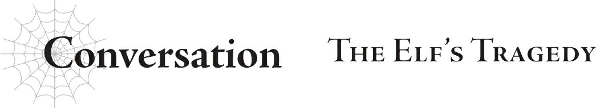

# Hội thoại: Bi kịch của tộc Elf
*(Conversation: The Elf’s Tragedy)*

“Ồ? Đã lâu không gặp.”

Một cô gái trẻ nở nụ cười ngọt ngào với tôi.

Lần cuối cùng tôi nhìn thấy em là nhiều năm trước, khi em vẫn còn là một cô bé nhỏ nhắn.

Em quá nhỏ bé, lại không có nơi nào để đi — một người mà tôi từng nghĩ mình phải bảo vệ.

Nhưng cho đến khi chúng tôi gặp lại nhau...

“Shouko... Negishi...”

“Cô có thể đừng gọi tôi bằng cái tên đó nữa được không?”

Negishi liếm đầu ngón tay của mình, vẻ mặt lộ rõ nét không hài lòng.

Cử chỉ đầy quyến rũ ấy khiến em trông trưởng thành hơn nhiều so với tuổi của mình.

Như thể em đang muốn chứng minh rõ ràng cho tôi thấy rằng mình không còn là một đứa trẻ, không còn cần sự bảo vệ của tôi nữa.

Huống chi thứ máu tươi em đang liếm trên ngón tay lại càng khẳng định điều đó.

“Châm ngôn của tôi là chuyện kiếp trước là quá khứ, còn đây là hiện tại. Tôi không còn là kiểu người cần sự thương hại của cô giáo mình nữa đâu.”

“Thương hại sao? Nhưng cô...”

Tôi không thể phủ nhận hoàn toàn những lời của Negishi.

Hoàn cảnh của em ở kiếp trước, dù có cố tưởng tượng thế nào đi nữa, cũng không thể gọi là tốt đẹp.

Em chắc chắn không thể hòa nhập với lớp học.

Cô đã cố gắng hết sức để tiếp cận em bất cứ khi nào có thể, nhưng nếu hỏi liệu điều đó xuất phát từ lòng kiêu hãnh của một người giáo viên hay sự thương hại dành cho một cá nhân, tôi phải thừa nhận rằng mình rất khó trả lời.

“Làm sao...?! Làm sao có thể như thế được?!” nhà triệu hồi Elf hét lên kinh hoàng.

Vệt máu trên tay Negishi là từ con quái vật mà ông ta đã triệu hồi.

Ông ta là một trong những nhà triệu hồi Elf nổi tiếng và mạnh mẽ nhất, và sinh vật mà ông ta triệu hồi là một trong những kẻ mạnh nhất.

Cấp độ nguy hiểm của nó là cấp S, một con quái vật ngang hàng với phi long và rồng, vậy mà nó đã nhanh chóng bị phanh thây đến mức không thể nhận dạng.

“Làm sao?! Làm sao có thể...?”

Trong lúc nhà triệu hồi tiếp tục gào thét trong điên loạn, giọng nói của ông ta đột nhiên bị cắt đứt.

Tôi nhìn qua thì thấy cơ thể ông ta đổ sụp xuống, đầu đã lìa khỏi cổ.

Chiếc chakram vừa lấy đầu ông ta bay ngược trở lại tay của một cô gái mặc đồ trắng, người dường như vừa xuất hiện từ hư không bên cạnh Negishi.

Trong lúc tôi đứng đó chết lặng, tất cả những người Elf khác xung quanh tôi đều đã biến mất.

Xác của họ giờ nằm la liệt trên mặt đất.

Một vũng máu lớn bắt đầu lan rộng xung quanh tôi.

“Tại sao... các em lại... làm chuyện này...?”

Câu hỏi tự động thốt ra từ môi tôi.

“Tại sao ư? Bởi vì tộc Elf là một mối phiền toái đối với chúng tôi.”

Negishi trả lời như thể đó là điều hiển nhiên.

“Chúng tôi?”

“Phải. Chúng tôi.”

“Vậy ra em thực sự đã đi theo ma tộc...”

Lần cuối tôi nhìn thấy Negishi là ở gần biên giới Đế quốc.

Sau đó, em bị đưa đến Lãnh địa Quỷ.

Nên tôi đã nghi ngờ rằng cuối cùng em cũng đứng về phía họ.

“Ma tộc sao? Phải, tôi đoán đó cũng là một cách nói.”

“Cái gì?”

Nhưng câu trả lời của em lại được diễn đạt một cách kỳ lạ.

“Về mặt kỹ thuật, chúng tôi đang bắt ma tộc phải làm việc cho mình. Nhưng tôi không nghĩ việc gộp chúng tôi chung với bọn họ là chính xác đâu.”

“Em không đi cùng ma tộc sao...?”

Vậy thì chuyện quái quỷ gì đang xảy ra thế này?

“Cô chắc là không biết về các Quản trị viên đâu nhỉ?”

Mắt tôi trợn tròn khi nghe thấy từ đó.

Làm sao? Tại sao?

Những "Quản trị viên" mà cô nhắc tới là những thực thể không thể tin nổi.

Mặc dù tôi đã được dạy về họ suốt cả đời, nhưng tôi chưa bao giờ chắc chắn liệu họ có thực sự tồn tại hay không.

“Tôi không thể tin được là tộc Elf lại cố gắng chống lại họ. Đúng là ngu ngốc hết chỗ nói.”

“Không thể nào! Ý em là em đang làm việc này dưới mệnh lệnh của các Quản trị viên sao?!”

“Chẳng phải tôi vừa nói thế rồi sao?”

“Cô Sophia.”

Trong lúc Negishi đảo mắt và nhún vai, cô gái mặc đồ trắng lên tiếng trách móc cô.

“Biết rồi, biết rồi. Tôi lại nói quá nhiều rồi đúng không? Cô thật là cứng nhắc.”

Negishi cười trêu chọc cô gái kia.

Nụ cười đó khiến em trông giống như một cô gái bình thường ở tuổi của mình...

... ngoại trừ việc em đang đứng giữa vũng máu do chính mình tạo ra.

Tôi không hiểu sao em có thể cười một cách thản nhiên như vậy trong hoàn cảnh tàn khốc này.

Đó là lúc tôi nhận ra em không còn là Negishi mà tôi từng biết nữa.

Em luôn là một đứa trẻ khó gần, nhưng cảm giác lúc này giống như tôi đang trò chuyện với một con quái thú hoàn toàn khác, một kẻ đáng sợ hơn nhiều.

“Thôi được rồi. Lần này tôi sẽ tha cho cô, dẫu sao chúng ta cũng là người quen cũ. Giờ cô đã thấy sự khác biệt về sức mạnh của chúng ta rồi đấy, đừng cản đường chúng tôi nữa.”

Sau đó, với một cái vẫy tay dứt khoát, em dẫn nhóm người mặc đồ trắng rời đi.

Tất cả chuyện này xảy ra không lâu trước đây.

Tôi đã ở Đế quốc, gần Lãnh địa Quỷ, để điều tra về các vụ mất tích liên tiếp của tộc Elf trong khu vực.

Mặc dù tôi đã mang theo nhà triệu hồi và vài người Elf lành nghề khác, tôi là người duy nhất sống sót.

Và đó chỉ là vì tôi được tha mạng, chứ không phải vì tôi đủ mạnh...

Tôi chắc chắn chuyện vừa rồi cũng tương tự như vậy...

Chúng tôi bỏ chạy đến một biệt thự mà Leston dùng làm căn cứ.

“Leston sẽ gặp chúng ta ở đây. Sau đó chúng ta sẽ lẻn ra khỏi đất nước này.”

“Cô Oka, đợi đã! Chúng ta phải làm gì đó với Hugo, nếu không thì Sue sẽ—!”

“Chúng ta không thể.”

Shun muốn quay lại chiến đấu với Hugo và ngăn chặn cuộc nổi loạn này, nhưng điều đó là không thể.

Nhất là chừng nào Negishi còn ở đó!

Ngay cả khi Shun hiện tại là Anh hùng, tôi nghi ngờ em ấy có thể thắng được một kẻ có thể dễ dàng tiêu diệt một quái vật cấp S mà không tốn chút sức lực nào.

Làm sao em ấy có thể tới được đây, khi mà cách đây không lâu vẫn còn ở Lãnh địa Quỷ xa xôi?

Tất cả những gì tôi có thể nghĩ là Hugo đã cho em ấy sử dụng cổng dịch chuyển.

Vương quốc và Đế quốc mỗi nơi đều có một cổng dịch chuyển, cho phép dịch chuyển tức thời qua khoảng cách xa xôi giữa hai bên.

Đế quốc giáp ranh với Lãnh địa Quỷ, và tôi biết rằng Negishi đằng nào cũng đang ám sát tộc Elf ở đó.

Tôi không biết bằng cách nào, nhưng em ấy chắc chắn đã tiếp xúc với Hugo trong lúc hoạt động ngầm ở Đế quốc.

Sau đó em ấy nhắm vào sức mạnh của Hugo và quyết định lợi dụng cậu ta...

Dù thế nào đi nữa, tình hình này không thể tồi tệ hơn được nữa.

Tôi không biết phe của Sophia có thể vươn tầm ảnh hưởng xa đến đâu với sức mạnh của họ. Chúng ta phải rời khỏi vương quốc này và tìm nơi trú ẩn an toàn.

“Nhưng cô Oka, nếu chúng ta có thể ngăn chặn Hugo, toàn bộ chuyện này sẽ lắng xuống. Chúng ta phải quay lại và bắt cậu ta...”

“Không.”

“Cô Oka!”

Ngay cả khi tôi giải thích Negishi nguy hiểm thế nào, tôi nghi ngờ Shun sẽ chấp nhận điều đó.

Vì vậy, tôi sẽ tiếp cận từ một góc độ khác.

“Giáo hội đã tuyên bố Anh hùng mới. Tên của cậu ta là Hugo Baint Renxandt.”

Thánh quốc Alleius là trụ sở chính của Thần Ngôn Giáo.

Chỉ vài ngày trước, Giáo hoàng của họ đã công bố tên của Anh hùng tiếp theo: Hugo.

Thông báo đó chính là lý do tôi vội vàng quay trở lại vương quốc này.

“Hả?”

Shun ngơ ngác nhìn tôi.

Tôi cũng có phản ứng tương tự khi lần đầu nghe tin này.

Danh hiệu là tuyệt đối, và Shun chắc chắn là người nắm giữ danh hiệu Anh hùng.

Ấy thế mà, Giáo hội lại tuyên bố Hugo mới là Anh hùng.

Rõ ràng, có điều gì đó mờ ám đang được thực hiện.

Và đúng như dự đoán, tôi đến nơi thì thấy thảm họa này đang diễn ra.

“Ngay cả Giáo hội cũng đang hợp tác với cậu ta.”

Đó là kết luận duy nhất tôi có thể đưa ra.

Như cô đã nói trước đó, danh hiệu là tuyệt đối.

Kỹ năng [Thẩm định] rất hiếm, nhưng vẫn có một số người trên thế giới sở hữu nó, chẳng hạn như chính em.

Và còn có cả sự tồn tại của Đá Thẩm định nữa.

Việc Hugo không phải là Anh hùng sẽ bị phát hiện ngay lập tức nếu dùng một trong hai thứ đó lên cậu ta.

Tuy nhiên Giáo hội vẫn đưa ra một tuyên bố nực cười như thế, chứng tỏ họ phải có động cơ ẩn giấu nào đó.

“Tộc Elf có ý kiến gì về lý do tại sao Giáo hội lại đồng lõa trong một âm mưu phi lý như vậy không?”

Anh Hyrince dường như cũng đi đến kết luận tương tự.

Tôi thì đã có câu trả lời cho riêng mình.

“Khả năng cao là chúng ta có thể giả định thuật tẩy não của Hugo đã cho phép cậu ta luồn lách vào Giáo hội.”

Trên đường tới đây Shun đã kể với cô rằng Sue đang bị Hugo kiểm soát.

Theo logic đó, cô kết luận rằng Hugo chắc chắn đã dùng sức mạnh ấy để kiểm soát Giáo hội và khiến họ tuyên bố cậu ta là Anh hùng mới.

“Không thể nào. Hiệu quả của tẩy não có giới hạn. Nó không đủ mạnh để kích động một tình huống thế này, đúng chứ?”

Hyrince tỏ ra nghi ngờ, nhưng nhìn vào những gì Sue đã làm, thật dễ dàng để thấy chuyện không phải như vậy.

Việc tẩy não ai đó đến mức khiến họ tự sát hoặc giết người khác là cực kỳ khó khăn.

Ngay cả ở Trái Đất, người ta cũng nói rằng việc dùng ám thị hay những thứ tương tự để bắt ai đó làm điều mà họ kịch liệt phản đối là chuyện gần như bất khả thi.

Điều tương tự cũng đúng ở thế giới này: Ngay cả khi một số kỹ năng có thể tạm thời khiến ai đó tuân lệnh người dùng, thuật tẩy não sẽ nhanh chóng thất bại nếu nạn nhân phản kháng đủ mạnh mẽ.

Nhưng có duy nhất một kỹ năng làm được tất cả những điều đó.

“Bình thường thì không. Nhưng có một ngoại lệ.”

“Ngoại lệ sao?”

“Một trong những kỹ năng thuộc dòng Thất Đại Tội cấp cao nhất, [Ái Dục]. Hiệu ứng tẩy não của nó mạnh hơn nhiều so với bất kỳ kỹ năng nào khác có thể gây ra. Cô không nghi ngờ gì việc Hugo hiện đang nắm giữ kỹ năng này.”

Có một số lượng giới hạn các kỹ năng đặc biệt trong thế giới này.

Chuỗi kỹ năng Thất Đại Tội và chuỗi kỹ năng Bảy Đức Tính.

Tôi đã biết được thông tin cơ bản về những kỹ năng này từ Potimas, sau khi gặng hỏi vì một số lý do riêng.

Và một trong những kỹ năng đó chính là [Ái Dục].

Nó sử dụng thuật tẩy não cực mạnh để ép buộc mục tiêu phải tuân phục người dùng.

Tất cả các kỹ năng Thất Đại Tội mà Potimas kể cho tôi nghe đều có những hiệu ứng phi thường, nhưng [Ái Dục] in đậm trong tâm trí tôi như một thứ đặc biệt kinh khủng.

Dù vậy, Potimas cũng chỉ suy đoán về hiệu ứng kỹ năng dựa trên một người từng sở hữu kỹ năng [Ái Dục] trong quá khứ, nên ông ta không biết chính xác mức độ hiệu quả của nó.

Vì vậy, tôi không biết chính xác Hugo có thể tẩy não bao nhiêu người cùng một lúc.

“Dù sao đi nữa, chúng ta không có cách nào biết được tầm ảnh hưởng của Hugo đã lan rộng đến đâu. Tốt nhất là nên giả định toàn bộ vương quốc này đã thất thủ.”

“Không thể nào...”

Trước mắt, lựa chọn tốt nhất của chúng ta là ưu tiên an toàn và tập hợp lại ở một nơi nào đó ngoài biên giới Vương quốc Analeit.

“Con không thể để chuyện đó xảy ra. Đó càng là lý do chúng ta không thể cứ thế để Hugo đi! Nếu chúng ta giải quyết cậu ta ngay bây giờ, có thể vẫn còn kịp để ngăn chặn chuyện này!”

“Không!”

Logic của Shun về mặt lý thuyết thì rất hợp lý, nhưng có một lý do khiến chúng ta không thể làm vậy!

“Chừng nào Sophia còn ở đó, chúng ta hoàn toàn không có cơ hội chiến thắng.”

Sophia, người từng được biết đến với tên gọi Negishi, ở một đẳng cấp sức mạnh hoàn toàn khác so với chúng tôi.

Tôi từng chiến đấu cho phe con người trong chiến tranh.

Mục tiêu của tôi là tiếp cận Tagawa và Kushitani, những người đang chiến đấu trong cùng một trận chiến, nhưng cả ba chúng tôi lại phải đối mặt với một tướng lĩnh ma tộc tên là Merazophis.

Sức mạnh của Merazophis áp đảo đến mức chỉ khi chúng tôi hợp lực chiến đấu, mới có cơ hội mỏng manh nhất để đánh trúng ông ta một đòn.

Chúng tôi không có cơ hội chiến thắng.

Một đòn đánh trúng duy nhất là tất cả những gì nỗ lực của chúng tôi đổi lại được.

Hóa ra Merazophis là cựu gia nhân phụng sự gia đình Negishi.

Theo nghiên cứu của Potimas, ông ta vốn dĩ chỉ là một con người bình thường, nhưng đã có được sức mạnh hiện tại sau khi năng lực của Negishi biến ông ta thành ma cà rồng.

Nói cách khác, Negishi — chủ nhân của Merazophis — còn mạnh mẽ hơn thế nữa.

Tôi không nói thế để khoe khoang, nhưng các chỉ số của tôi khá cao.

Thế mà tôi vẫn phải lập đội với Tagawa và Kushitani, những người có lẽ còn mạnh hơn cả tôi, mới có thể tạm thời đứng chung chiến tuyến với Merazophis.

Trong trận chiến khép kín đó, khi tôi nghĩ Tagawa có thể bị chém gục bất cứ lúc nào, tôi đã cảm nhận được nỗi sợ hãi cái chết một cách mãnh liệt dù bản thân đang hỗ trợ từ phía sau.

Tệ hơn nữa, tôi sợ rằng Tagawa và Kushitani sẽ bị giết ngay trước mắt mình, sợ đến mức tôi gần như không thể thở nổi.

Khi Kushitani bị trọng thương, nỗi sợ hãi lớn đến mức ruột gan tôi như đông đá.

Sau tất cả những chuyện đó, điều tốt nhất chúng tôi làm được chỉ là giữ lại được mạng sống và trốn thoát.

Ấy thế mà Negishi còn mạnh hơn cả Merazophis.

Chúng ta hoàn toàn không có cơ hội chiến thắng.

“Cô Oka, rốt cuộc cô ta là ai vậy ạ?”

Shun nhìn tôi với vẻ thảng thốt, có lẽ cuối cùng em ấy cũng nhận ra tôi nghiêm túc đến mức nào.

“Sophia là...”

Nhưng ngay khi tôi vừa mở miệng để giải thích về Negishi, Leston và những người khác đã đến.

Thời điểm thật không may mắn, nhưng lúc này, việc trốn thoát quan trọng hơn là giải thích.

Một khi đã đến nơi an toàn, tôi sẽ kể cho em ấy nghe mọi chuyện.

Tôi đã nghĩ như thế...

... cho đến khi Negishi lại chắn đường chúng tôi một lần nữa.

“Không ngờ lại gặp các người ở đây.”

---

[◀ Chương trước: Chương V1: Làm việc cho kẻ giật dây](03_v1_working_for_the_mastermind.md) | [Chương tiếp theo: Chương 3: Lật đổ một vương quốc kiếm sống ▶](05_ch3_overthrowing_a_kingdom_for_a_living.md)
