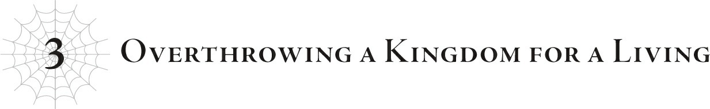
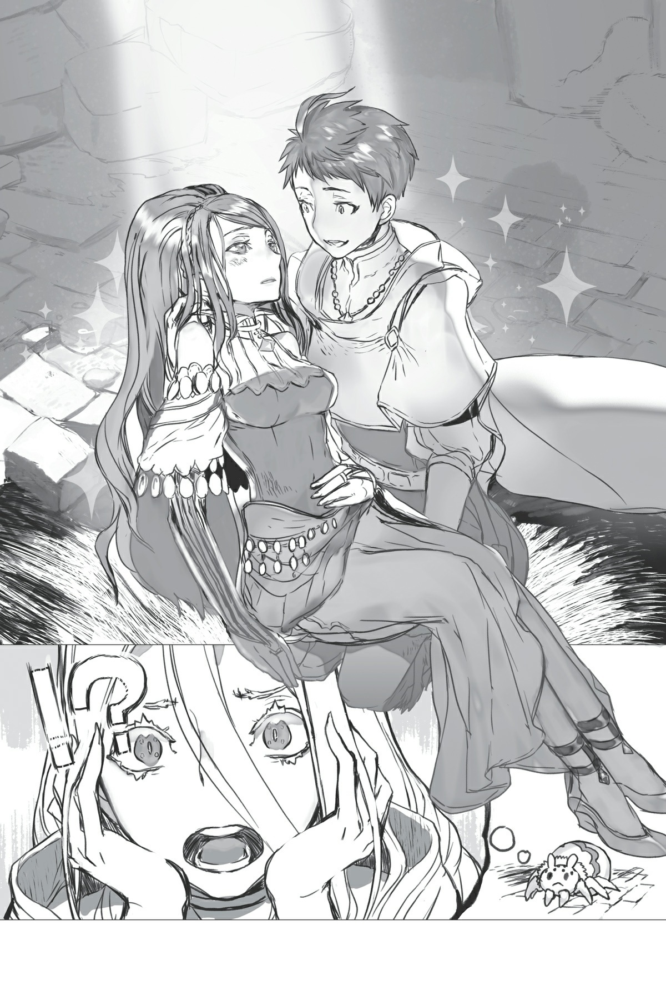

# Chương 3: Lật đổ một vương quốc kiếm sống
*(Overthrowing a Kingdom for a Living)*

Tôi vẫn luôn theo dõi mọi chuyện xảy ra thông qua các phân thân của mình, và chao ôi, chuyện này điên rồ thật đấy!

Đúng là một chuỗi sự kiện dồn dập!

Dưới góc nhìn của Yamada, cô em gái dễ thương của cậu ta đột nhiên sát hại phụ hoàng, rồi Natsume vốn đang bị lưu đày lại bất ngờ tái xuất.

Đã vậy, đệ nhất hoàng tử Cylis còn bắt tay với Natsume làm một cú đảo chính hoàng cung rồi đổ hết tội danh sát hại nhà vua lên đầu Yamada.

Quả là sét đánh ngang tai, ít nhất là đối với Yamada tội nghiệp, bạn biết đấy?

Đáng tiếc thay, chúng tôi không còn cách nào khác ngoài việc đổ oan cho Yamada và ép cậu ta phải trốn chạy khỏi vương đô.

Tội nghiệp ghê...

Hửm? Tôi không có tư cách nói câu đó khi chính mình là kẻ đứng sau gài bẫy cậu ta á?

Ừm, chắc bạn nói đúng rồi...

Nhưng dù thế nào đi nữa, nếu tôi không thúc đẩy mọi việc diễn ra như thế này, mọi thứ có khi đã rẽ sang một hướng còn bi thảm hơn nhiều.

Tôi chắc chắn kiểu gì Natsume cũng sẽ tìm cách trả thù Yamada và cô Oka bằng cách này hay cách khác.

Và đệ nhất hoàng tử Cylis, ngay cả khi không có chúng tôi can thiệp, có lẽ đằng nào cũng sẽ hành động dựa trên phức cảm tự ti của mình đối với các hoàng đệ và nỗi ám ảnh điên cuồng với ngai vàng.

Chưa kể Potimas cũng đang tha hóa cả tầng lớp thống trị cao nhất của vương quốc nữa!

Mấy quả bom hẹn giờ vốn đã được rải khắp mọi nơi rồi.

Nên những gì chúng tôi làm chỉ là kích nổ những quả bom đó theo hướng và thời điểm có lợi nhất cho mục đích của chúng tôi mà thôi.

Tôi đã gỡ bom giúp các người rồi đấy nhé! Không có chi!

Thấy chưa? Tôi đâu có làm gì sai!

...Bạn nghĩ sao? Có xuôi tai không?

Không ư? Vẫn là lỗi của tôi à?

Hừm. Thôi được rồi, tôi thừa nhận.

Tôi đúng là đã làm sai kha khá thứ!

Ví dụ như, chúng tôi đã thực sự giết đức vua.

Và ngay cả khi đức vua bị thao túng đi chăng nữa, cô bé tội nghiệp ra tay sát hại ông ta chắc chắn sẽ bị chấn thương tâm lý nặng nề vì chuyện đó.

Phải, tôi biết mình đã làm một số chuyện tồi tệ!

Nhưng tôi sẽ không dừng lại đâu!

Ý tôi là, cơ bản là tôi không thể.

Có lẽ có cách nào đó thông minh hơn để giải quyết chuyện này, nhưng đây là phương án tốt nhất mà tôi có thể nghĩ ra rồi.

Dù sao thì, chúng tôi đã lợi dụng sự hỗn loạn này để quét sạch tất cả quan chức vương quốc nằm dưới sự kiểm soát của Potimas, và bản thân Vampy cũng đã tự mình xử lý Potimas.

Như thường lệ, đó không phải là cơ thể thật của lão, nên lão ta chắc chắn sẽ sớm xuất hiện lại trong một cơ thể khác thôi, nhưng tôi nghĩ ít nhất chúng tôi đã thành công nhổ sạch tận gốc cái gai Potimas ra khỏi vương quốc này.

Như vậy thì nhiệm vụ của chúng tôi về cơ bản đã hoàn thành.

Giờ thì việc duy nhất còn lại là để Yamada và những người khác chạy trốn an toàn.

Không còn cả một vương quốc hậu thuẫn phía sau, Yamada sẽ không thể làm chuyện gì quá điên rồ nữa.

Chúng tôi chỉ cần cậu ta ẩn náu ở góc nào đó cho đến khi mọi chuyện kết thúc.

Tôi đã nghĩ thế, nhưng có vẻ cậu ta đang gặp khó khăn khi đối phó với những người bị Natsume tẩy não.

Cậu ta có vẻ bất lực trước một Ooshima đang bị tẩy não.

Hừm. Tôi cứ nghĩ Yamada đủ mạnh để hạ gục Ooshima một cách khá dễ dàng chứ, hay là tôi hơi đánh giá cao cậu ta quá nhỉ?

Không, tôi đoán chuyện này nghiêng về cảm xúc nhiều hơn là sức mạnh.

Cậu ta có lẽ không thể chĩa kiếm vào người bạn thân thiết từ kiếp trước của mình.

Tuy nhiên thì...

“Katia! Tỉnh táo lại đi!”

“Thật là thô lỗ. Tôi hoàn toàn tỉnh táo, cảm ơn. Cậu là kẻ phản quốc, và kẻ phản quốc phải bị trừng trị.”

Cái gì đây, hai người đang cãi lộn kiểu tình nhân đấy à?

Ooshima bắn Hỏa Ma pháp, và Yamada triệt tiêu nó bằng Thủy Ma pháp.

Nhìn thì ngầu đấy, nhưng vì tôi đã quen chứng kiến đủ kiểu trận chiến điên cuồng ở đẳng cấp hoàn toàn khác rồi, nên chuyện này chẳng mấy thú vị.

Ừ thì, họ chắc chắn đang dốc toàn lực, nhưng bằng cách nào đó nó cứ thiếu đi sự căng thẳng cần thiết...

Nên đứng từ góc độ của tôi, trông họ cứ như thể đang đùa giỡn với nhau vậy.

Tôi nhắc lại là họ thực sự đang chiến đấu hết mình đấy nhé, được chưa?

But khi bạn đã từng giao chiến với những quái vật cấp huyền thoại và những thứ tương tự rồi thì, ừm... bạn tự hiểu đi?

Thế nhưng, vì tôi vừa xem vừa lơ đãng một cách khá là bất lịch sự, kết cục là tôi đã phản ứng quá trễ.

CÁI GÌ CƠ—?!

Ooshima tự phát nổ cơ á?!

Đó là một đòn tự sát để rũ bỏ sự tẩy não của Natsume!

Khoan đã, nhưng vết thương đó rõ ràng là chí mạng mà...

Ôi hỏng rồi... Tôi làm hỏng việc rồi...

Tôi không nghĩ có người lại tự nổ tung bản thân chỉ vì không thể tự mình thoát khỏi sự tẩy não...

“Katia?!”

Yamada lao về phía Ooshima đang ngã quỵ và đỡ lấy cô bé trước khi cô chạm đất.

Nhưng vì Ooshima đã hứng trọn toàn bộ đòn tấn công toàn lực của chính mình mà không có bất kỳ sự phòng bị nào, ai cũng có thể thấy rõ vết thương của cô bé đã vô phương cứu chữa.

Chết tiệt... Tôi không ngờ chuyện này lại xảy ra...

Có vẻ như tôi đã đánh giá thấp sức mạnh ý chí của Ooshima rồi.

Thật không thể tin nổi cô bé lại có thể chống cự lại sự tẩy não từ một kỹ năng Thất Đại Tội, dù chỉ là trong một giây...

Chuyện này thực sự nằm ngoài mọi dự tính.

Aizz, tôi xin lỗi nhé, cô Oka...

Trong lúc tôi thầm xin lỗi, một vầng ánh sáng dịu nhẹ bao bọc lấy Yamada và Ooshima.

Ma pháp Trị liệu sao? Thứ đó chẳng giải quyết được gì lúc n—

Khoan đã! Đây không phải Ma pháp Trị liệu!!

Những gì Yamada đang làm chắc chắn hoàn toàn không phải Ma pháp Trị liệu?!

Bằng cách nào đó, những vết thương chắc chắn chí mạng của Ooshima đang lành lại.

“A... Shun...?”

“Katia, cậu trở lại bình thường rồi chứ?”

“Hử? Vết thương của tớ...?”

“Tớ đã chữa lành chúng.”

“Cậu... đúng là... vô lý... hết sức.”

“Đừng cố nói nữa. Chúng ta phải rời khỏi đây thôi.”

Hai người họ bắt đầu ve vãn tán tỉnh nhau, nhưng lúc này tôi không rảnh để tâm đến chuyện đó.

Sự việc vừa xảy ra chấn động đến mức cơ thể thật của tôi đã phải bật dậy khỏi ghế ngồi.

Vết thương của Ooshima chắc chắn đã vô phương cứu chữa.

Thực chất, tôi khá chắc Ooshima đã tắt thở từ trước khi Yamada kịp đỡ lấy cô bé.

Ma pháp Trị liệu thông thường không thể tức thời chữa lành vết thương chí mạng, và ngay cả [Kỳ Tích Ma Pháp], phiên bản nâng cấp cấp cao của Ma pháp Trị liệu, cũng không thể cải tử hoàn sinh.

Chỉ có duy nhất một kỹ năng có thể làm được điều này.

Kỹ năng thuộc dòng Bảy Đức Tính: [Từ Bi].

Đó là kỹ năng duy nhất trên thế giới này có khả năng hồi sinh người chết.

Và không ngờ người sở hữu nó lại chính là Yamada...

À thì, thật ra tôi cũng từng lờ mờ đoán được khả năng này.

Bản thân tôi vốn đã biết có một con người sở hữu kỹ năng [Từ Bi], chỉ là tôi không rõ đó là ai.

Nhưng các kỹ năng dòng Bảy Đức Tính, cũng giống như kỹ năng dòng Thất Đại Tội, cực kỳ khó để đạt được.

Tôi không nghĩ phần lớn con người ở thế giới này có thể sở hữu được chúng dù có cố tình tìm mọi cách đi chăng nữa.

Đồng nghĩa với việc khả năng ai đó vô tình nhận được nó lại càng thấp hơn.

Đó là lý do tại sao tôi đoán rất có thể người sở hữu [Từ Bi] là một kẻ ngoại lai đối với thế giới này: một người tái sinh.

Và nếu có ai đó có thể đạt được [Từ Bi], người đó rất có thể chính là Yamada.

Thực tế, một phần lý do tôi để Natsume tẩy não những người tái sinh như Ooshima và Hasebe was để tìm hiểu xem có ai trong số họ sở hữu kỹ năng dòng Bảy Đức Tính hay không.

Cả Ooshima và Hasebe đều không phải, nên bằng phương pháp loại trừ, người nắm giữ [Từ Bi] chắc chắn phải là một trong số những người: Yamada, cô Oka, Tagawa hoặc Kushitani.

Về mặt tính cách, nếu cô Oka sở hữu nó thì cũng không có gì đáng ngạc nhiên, nhưng vì tôi chưa từng thấy cô dùng nó để hồi sinh bất kỳ yêu tinh nào bị sát hại, nên có thể loại cô ra.

Vẫn còn lại Tagawa và Kushitani, nhưng Yamada có vẻ là sự lựa chọn hợp lý hơn cả.

Tuy nhiên, cách duy nhất để xác nhận là dùng [Thẩm định] lên Yamada hoặc bắt cậu ta thực sự sử dụng kỹ năng đó, mà tôi thì không thể tự dưng quẳng một cái xác chết ngay trước mặt cậu ta chỉ để thử nghiệm được.

Tôi đoán chuyện này đúng là trong cái rủi có cái may, vì nhờ có cơ hội (không) may mắn này mà tôi đã tận mắt chứng kiến cậu ta sử dụng nó.

Mặc dù trước đó tôi đã có linh cảm là cậu ta rồi, nhưng vì không thể chắc chắn nên tôi chưa đưa nó vào kế hoạch của mình. Bây giờ đã biết rõ, đây có thể là một cơ hội lớn.

Cái giá phải trả khi sử dụng [Từ Bi] chính là cấp độ kỹ năng [Cấm kỵ] của bản thân sẽ tăng lên.

[Từ Bi] cho phép hồi sinh người chết, một điều cực kỳ khó khăn ngay cả trong khuôn khổ hệ thống của thế giới này.

Nhưng một khi bạn đã hồi sinh người chết, bạn sẽ phải đối mặt với [Cấm kỵ], thứ hé lộ bản chất thực sự của hệ thống.

Khi đã biết được điều đó, bạn chắc chắn sẽ nhận ra ý nghĩa thực sự của việc cải tử hoàn sinh là gì.

D đúng là một kẻ có sở thích bệnh hoạn như mọi khi.

Lúc nào cũng chực chờ chà đạp và bóp nát trái tim người khác.

Nhưng biết đâu tôi có thể lợi dụng điều này làm lợi thế cho mình.

Tôi sẽ dụ Yamada tới và để mọi người chết ngay trước mắt cậu ta.

Không nghi ngờ gì việc cậu ta sẽ hồi sinh họ.

Và rồi cấp độ [Cấm kỵ] của cậu ta sẽ tăng lên.

Cuống cùng, khi đạt cấp tối đa, Yamada sẽ thấu hiểu toàn bộ sự thật về thế giới này.

Và khi đó, cậu ta sẽ phải đối mặt với một sự lựa chọn.

Cậu ta sẽ chống lại chúng tôi? Hay sẽ bắt tay hợp tác cùng chúng tôi?

Tôi cho rằng giả vờ như không thấy gì cũng là một lựa chọn.

Chẳng có một con người bình thường nào có thể gánh vác cả thế giới trên vai mình.

Còn nếu cậu ta chọn đối đầu với chúng tôi, thì dĩ nhiên tôi sẽ nghiền nát cậu ta thôi.

Nhưng tôi không nghĩ Yamada có thể làm thế.

Dẫu sao thì cậu ta vốn cũng chỉ là một đứa trẻ thuộc tầng lớp trung lưu bình thường.

Phải, giờ cậu ta là anh hùng hay gì đó tương tự, nhưng ban đầu cậu ta chỉ là một cậu bé bình thường.

Nên tôi tin chắc cậu ta không thể gánh nổi vận mệnh của thế giới đâu.

Tôi sẽ dồn cậu ta vào việc tự tìm ra sự thật rồi bắt cậu ta phải đầu hàng từ bỏ.

Đúng thế. Vốn dĩ tôi định để cậu ta chạy trốn rồi ẩn náu ở đâu đó, nhưng giờ thì tôi thay đổi kế hoạch rồi.

Hiện tại chúng tôi vẫn cần cậu ta rời khỏi vương đô, nhưng tôi nghĩ rốt cuộc mình sẽ để Yamada hoạt động năng nổ hơn một chút vậy.

Đầu óc tôi xoay chuyển liên tục khi thiết lập một kế hoạch mới.

Giờ Ooshima đã bị hạ gục, chướng ngại lớn nhất trên đường trốn chạy của họ đã biến mất, nên phần đó đáng lẽ phải dễ dàng.

“Thật trùng hợp khi gặp nhau ở đây nhỉ.”

CÁI GÌ CƠƠƠƠƠ?!

Ơ kìa, Vampy? Cô đang làm cái trò mèo gì thế hả?

Tại sao chính xác cô lại đứng chắn đường bọn họ như thể một con trùm cuối siêu to khổng lồ vậy?!

“À, đây. Quà tặng cô đấy, cô Oka.”

“P... Potimas?!”

“K-Không thể nào!”

Và giờ cô lại thảy cái đầu của Potimas cho cô ấy một cách đầy kịch tính thế kia á?!

Rõ ràng chuyện đó sẽ khiến tất cả mọi người khiếp vía rồi!

Vampy! Nghiêm túc đấy, cô đang nghĩ cái gì trong đầu thế hả?!

Cô nàng liếm một ít máu của Potimas dính trên tay.

“Thật ghê tởm. Phải chăng tính cách thối nát của lão đã khiến mùi vị máu cũng tệ hại như thế này?”

Eo ơi, đừng có liếm cái đống máu đó. Bẩn lắm! Mau nhổ ra đi!

“Em đã làm chuyện này... với Potimas sao?”

“Còn có lời giải thích nào khác nữa sao?”

“Nhưng em...!”

“Cô không định nói là em sẽ không bao giờ giết người đấy chứ? Sau tất cả, bản thân cô cũng đã nhuốm máu không ít rồi mà. Đây không phải là Nhật Bản. Những quy tắc tương tự không áp dụng ở nơi này, và cô biết rõ điều đó.”

Tranh luận với cô Oka thì cũng tốt thôi, nhưng tiếp theo cô tính làm cái trò gì đấy?

Cái quái gì thế này? Tôi đã giải thích rõ là chúng ta sẽ để nhóm Yamada chạy trốn khỏi vương đô rồi mà đúng không? Cô nàng không quên đấy chứ?

Thế tại sao cô Oka và những người khác trông như thể chuẩn bị lao vào tử chiến với Vampy thế kia?

“Cô Oka, cô muốn chiến đấu với em sao? Ôi dào, thôi đi. Chủ nhân đã dặn em không được động vào một sợi tóc của cô rồi.”

Thấy chưa?! Tôi biết ngay mà! Tôi đã nói thế thật đúng không?!

Thế thì tại sao hiện tại cô lại đứng chắn đường bọn họ làm gì?!

Kể cả những kẻ mềm lòng đó cũng sẽ phải cố liều mạng chiến đấu với cô nếu cô làm thế đấy!

“Nhưng em đoán là cô không cho em sự lựa chọn rồi. Đây chỉ là tự vệ thôi nên không phải lỗi của em, đúng chứ?”

LỖI RÀNH RÀNH RA ĐẤY, ĐỒ ĐẦN NÀY!

K-Không, không sao đâu, mọi chuyện sẽ ổn thôi.

Tôi chắc chắn rốt cuộc Vampy vẫn định để họ đi thôi.

Và nếu tình hình chuyển biến xấu, Phelmina sẽ thay mặt tôi can thiệp và ngăn cô nàng lại! Tôi đoán thế!

Ngay lúc đó, một chiếc chakram bay thẳng về phía Yamada.

...Khoan, cái gì cơ? Đó chẳng phải vũ khí của Phelmina sao?

Chỉ riêng Vampy thôi đã quá mạnh so với sức chịu đựng của đám người này rồi. Giờ lại thêm cả Phelmina nữa, thì làm sao tổ đội Yamada có cơ hội chiến thắng nào chứ?

Khoác trên mình bộ trang phục màu đen, Phelmina ngăn cản Yamada khi cậu ta định lao đến hỗ trợ cô Oka.

Một Wald cũng mặc đồ đen tương tự lao thẳng xuống tấn công Hyrince, người đang bế Anna trên tay.

Họ không mặc đồ trắng như thường lệ vì trang phục đó quá nổi bật đối với các nhiệm vụ ngầm trong vương quốc.

Dẫu sao thì mọi người cũng bắt đầu nhận ra trang phục màu trắng đồng nghĩa với Quân đoàn 10 rồi.

Tôi không biết có ai trong vương quốc này nhận thức được điều đó chưa, nhưng chỉ để tránh bị phát hiện và trà trộn lẫn với binh lính của Cylis, tôi đã bảo họ mặc đồ đen.

Tuy nhiên, ba cái chuyện đó lúc này chẳng quan trọng nữa.

Vampy liên tục triệt tiêu ma pháp của cô Oka, chậm rãi nhưng chắc chắn thu hẹp khoảng cách giữa cả hai.

Khi Vampy nhận được kỹ năng [Đố Kỵ], cô nàng cũng đạt được một danh hiệu ban cho cô kỹ năng [Thần Lân].

Đây là phiên bản nâng cấp của kỹ năng [Long Lân] mà loài rồng và phi long sở hữu.

Nó có hai tác dụng chính: tạo vảy trên cơ thể người sử dụng để tăng cường phòng ngự và can thiệp cản trở cấu trúc liên kết ma pháp.

Thế nên nó vừa tăng phòng thủ vật lý, vừa đối phó hiệu quả với các đòn tấn công phép thuật bằng cách cản trở quá trình niệm phép của đối thủ.

Đây là một kỹ năng cực kỳ mạnh mẽ, một trong những biện pháp phòng thủ tối thượng nhất.

Và đối với ma pháp, khi kết hợp nó với những hiệu ứng tương tự từ kỹ năng [Long Mạc], nó có thể triệt tiêu gần như hoàn toàn hầu hết mọi loại ma pháp.

Vì cô Oka dường như phát triển theo hướng thuần ma pháp, cô ấy là một đối thủ cực kỳ kỵ giơ với Vampy.

Cộng thêm sự chênh lệch chỉ số khổng lồ giữa hai bên, cô ấy hầu như không có lấy một cơ hội chiến thắng nào.

Vampy nhận thức rõ điều đó nên đang chậm rãi, ung dung bước về phía cô Oka.

Cô Oka cố gắng ngăn cản cô nàng bằng [Phong ma pháp], nhưng vì ma pháp hoàn toàn vô dụng trước Vampy, đòn tấn công đó theo đúng nghĩa đen chỉ như gió thoảng bụi bay.

“Á!”

Cuối cùng, Vampy tóm chặt lấy chiếc cổ mảnh mai của cô Oka.

Nghiêm túc đấy, cái quái gì thế hả trời?!

Đầu óc cô bị làm sao thế hả?!

Cứ đà này, chuyến phiêu lưu của tổ đội Yamada sẽ phải đi đến hồi kết thúc một cách yểu mệnh ngay tại nơi này mất thôi!

Aizz! Nếu đã đến nước này, tôi không còn lựa chọn nào khác ngoài việc tự mình xuất đầu lộ diện dưới tư cách một người lạ bí ẩn nào đó để cứu họ vậy!

Thế nhưng, ngay khi tôi chuẩn bị nghiêm túc cân nhắc cái kế hoạch nửa mùa này, một con phi long màu trắng từ đâu bay tới.

Chẳng phải đó là...?

“Fei?”

Lời nói của Yamada vang lên trùng khớp với dòng suy nghĩ của tôi khi cậu ta gọi tên con phi long.

Fei chính là Shinohara, đúng chứ nhỉ...?

Cô bé vốn từng là một Địa Long, nhưng kể từ khi thiết lập giao ước triệu hồi với Anh hùng Yamada, cô bé đã đi theo một lộ trình tiến hóa đặc biệt để trở thành một Quang Phi Long.

Vì đây là một đợt tiến hóa đặc biệt, cô bé đã chui vào trong cái kén nào đó suốt một thời gian dài, nhưng xem ra quá trình tiến hóa đã hoàn tất vừa vặn ngay khoảnh khắc ngàn cân treo sợi tóc.

Thật sự luôn, đúng là thời điểm hoàn hảo!

...Nhưng có hơi quá hoàn hảo không đấy?

Không chừng đây lại là tác dụng từ kỹ năng [Thần bảo hộ] của Yamada hoạt động chăng?

“Ừ, cậu đến vừa kịp lúc lắm.”

Trong lúc tôi vẫn mải suy nghĩ về đống đó, có vẻ như Yamada và Shinohara đang giao tiếp bằng ngoại cảm với nhau.

“Shun! Lên lưng con phi long đó rồi mau thoát khỏi đây đi!”

Ngay khi tam hoàng tử Leston hét lớn, mọi người lập tức hành động.

“Đừng lo cho bọn anh! Shun, cả Hyrince nữa! Mau đưa cô Oka chạy đi!”

“Shun! Đi thôi!”

Hyrince lao nhanh về phía Yamada, trên tay đang ôm cô Oka và Anna đã bất tỉnh nhân sự.

“Cậu nghĩ bọn tôi sẽ để các người trốn thoát dễ dàng thế sao?”

Vampy bước lên cản đường bọn họ.

Ơ kìa, alo?! Đáng lẽ cô phải để họ chạy trốn chứ!

Nghiêm túc đấy, cô đang làm cái trò thế hả?!

May mắn thay, trong lúc Shinohara phun hơi thở rồng để kiềm chế ép Vampy và những người khác lùi lại, nhóm Shun đã kịp leo lên lưng cô bé và bay vút đi.

Phù. Cuối cùng thì họ cũng trốn thoát được.

Ái chà, đòn phun thở cuối cùng đó nướng Wald cũng ra trò đấy nhỉ...

Thôi thì, cậu ta chắc cũng không chết được đâu.

Vampy và Phelmina nhanh chóng đánh ngất Leston cùng những người chọn ở lại bọc lót.

Phelmina khẽ nói điều gì đó với Vampy, nhưng cô nàng chỉ bực bội phẩy tay gạt đi.

Hay lắm Phelmina! Nói thẳng vào mặt cô nàng đi em!

Cơ mà chính tôi đằng nào cũng phải tự mình trừng trị Vampy một trận mới được...

---

[◀ Chương trước: Hội thoại: Bi kịch của tộc Elf](04_conversation_the_elfs_tragedy.md) | [Chương tiếp theo: Chương 4: Đàm phán với tai to mặt lớn kiếm sống ▶](06_ch4_negotiating_with_bigwigs_for_a_living.md)
