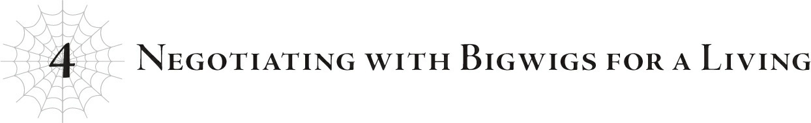

# Chương 4: Đàm phán với tai to mặt lớn kiếm sống
*(Negotiating with Bigwigs for a Living)*

Thế nên tôi đang trừng trị cô nàng đây.

“Khoan đã nào! Cuối cùng em vẫn để bọn họ đi rồi còn gì?! Với lại! Nếu cứ để họ rời đi như thế, ai biết được họ sẽ làm ra chuyện gì chứ?! Thế nên em mới dùng hiệu ứng trạng thái [Hôn Mê] lên cô Oka! Bây giờ bọn họ sẽ không thể manh động trong ít nhất mười lăm ngày tới! Thấy chưa! Em thông minh ghê chưa! Nên chủ nhân thực sự phải tha cho em đi chứ!”

Một lời bào chữa khá thuyết phục.

Nhưng vẫn phải chịu phạt!

“Pgyaaaah!”

Trong lúc Vampy hét lên như một con chim bị bóp cổ, Phelmina đứng nhìn với nụ cười tự mãn đầy thỏa mãn.

Nhưng cô cũng tự biết mình là đồng phạm trong vụ này chứ hả?

“Éc?!”

Thế nên tôi phạt cả cô bé luôn.

Cơ mà nói đi cũng phải nói lại, cuối cùng thì Yamada và những người khác vẫn chạy thoát được, và việc làm cho cô Oka ngủ sâu thực ra là một nước đi tương đối thông minh. Tôi rộng lượng tha cho họ với một hình phạt nhẹ nhàng.

Vì danh dự của Vampy và Phelmina, tôi sẽ không đi sâu vào chi tiết hình phạt làm gì.

Hiệu ứng trạng thái bất thường [Hôn Mê] mà Vampy dùng lên cô Oka hình như là phiên bản cao cấp của trạng thái [Ngủ].

Đúng như tên gọi, nó đưa người ta vào một giấc ngủ mà không thể tỉnh lại theo cách bình thường, và cực kỳ khó để giải trừ.

Tôi hoàn toàn không biết cô nàng đã học được kỹ năng có hiệu ứng trạng thái kiểu đó từ lúc nào...

Thậm chí, tôi còn chưa từng nghe nói đến trạng thái bất thường nào như vậy...

Hừm. Tôi cứ ngỡ mình đã nắm lòng hầu hết mọi kỹ năng tồn tại trên đời, nhưng xem ra đây là một lời nhắc nhở rằng vẫn còn những kỹ năng ngoài kia mà tôi chưa biết đến.

Theo lời Vampy, trạng thái hôn mê cô nàng dùng lên cô Oka sẽ tự động biến mất sau khoảng mười lăm ngày.

Tại sao lại là mười lăm ngày? Bởi vì nếu lâu hơn thế, cơ thể cô ấy sẽ bắt đầu suy kiệt nhanh chóng và sẽ chết mà không bao giờ tỉnh lại nữa.

Ghê thật đấy!

Mà nghĩ lại thì cũng hợp lý. Người ta đâu thể ăn uống gì khi đang hôn mê, nên nếu tình trạng đó kéo dài như thế, kiểu gì cũng có chuyện chẳng lành.

Chừng nào cô Oka còn hôn mê, Yamada và những người khác sẽ không thể di chuyển quá nhiều, và cô Oka cũng không thể nhồi nhét tư tưởng cho họ được nữa.

Dù sao thì nguồn thông tin của cô Oka cũng là từ Potimas.

Với tính cách của lão ta, lão chắc chắn đã dạy cho cô ấy những lời nói dối méo mó tai hại.

Ai mà biết được chuyện đó có thể khiến đám Yamada làm ra chuyện gì điên rồ chứ.

Theo nghĩa đó, việc đưa cô Oka vào trạng thái hôn mê chắc chắn là một quyết định sáng suốt.

Việc này sẽ giữ chân Yamada và những người khác tại chỗ trong mười lăm ngày tới, và trong thời gian đó chúng tôi có thể tập trung vào những việc khác.

Chúng tôi thực sự có vô số việc phải làm.

Đầu tiên là vấn đề nội vụ của lãnh địa quỷ.

Chúng tôi đã đùn đẩy hết đống đó cho Balto.

Kể từ khi đại chiến kết thúc cho đến nay, cậu Oni cùng các thống lĩnh khác vẫn luôn tập trung vào công tác thu dọn sau chiến tranh, nhưng giờ hầu hết mọi việc đã ổn định.

Giờ Ngực Bự cũng đã quay lại, chúng tôi có lẽ có thể trở lại nhịp làm việc như bình thường.

Và nước đi tiếp theo của chúng tôi sẽ là: một cuộc viễn chinh vũ trang đến làng Elf!

Phải, bạn không nghe nhầm đâu! Làng Elf chuẩn bị tiêu đời rồi!

Giờ đại chiến Nhân-Ma đã kết thúc, đã đến lúc chúng tôi tống khứ cái tên Potimas phiền phức chết tiệt kia đi, điều đó hiển nhiên đồng nghĩa với việc chúng tôi sẽ phát động chiến dịch san phẳng làng Elf.

Chúng tôi không nói về mấy cái cơ thể dùng một lần mà Potimas cứ liên tục ném vào chúng tôi đâu nhé.

Không, lần này chúng tôi sẽ nghiền nát bản thể thật của lão ta.

And điều đó đòi hỏi chúng tôi phải san phẳng tận gốc cả cái làng Elf chết tiệt kia.

Đó chính xác là lý do tại sao chúng tôi phải kìm hãm cô Oka và những người khác lại, bạn biết đấy?

Cô Oka là một Elf, và chúng tôi không thể để cô ấy bị cuốn vào chuyện này.

Tôi không chắc liệu chúng tôi có thể để mắt đến cô Oka và những người khác trong khi đang chiến đấu với Potimas hay không.

Chắc chắn đây sẽ là một trận chiến khốc liệt điên cuồng.

Tôi thực sự có ý định giải cứu những người tái sinh đang bị giam lỏng ở làng Elf, nhưng thành thật mà nói, cuối cùng chúng tôi có thể sẽ phải bỏ mặc họ.

Trận chiến với Potimas nguy hiểm đến mức đó đấy.

Thế nên dĩ nhiên tôi muốn giảm thiểu mọi mối bận tâm gây xao nhãng nhiều nhất có thể.

Khi đối đầu với Potimas, tôi muốn thực hiện nó trong những điều kiện lý tưởng nhất.

Nhưng có một vấn đề thế này. Để điều đó xảy ra, có một kẻ mà chúng tôi buộc phải đối mặt...

Giáo hoàng Dustin của Thần Ngôn Giáo.

Không đời nào chúng tôi có thể phát động một cuộc chiến tổng lực chống lại Potimas mà không có sự giúp đỡ của ông ta.

“...Lại thêm một yêu cầu vô lý nữa.”

Thế là, ừm, chúng tôi đã ở đây!

Thánh quốc Alleius, trụ sở chính của Thần Ngôn Giáo siêu nổi tiếng!

Ngồi đối diện với tôi, hay nói đúng hơn là ở hướng xéo góc với tôi, chính là Giáo hoàng Dustin.

Bạn thắc mắc tại sao ông ta không ngồi ngay trước mặt tôi ư?

“Ông làm được mà đúng không? Nào, làm đi chứ.”

Bởi vì người ngồi trực diện đối mặt với ông ta chính là Ma Vương, đang nở một nụ cười rạng rỡ.

Giáo hoàng về cơ bản là thủ lĩnh tối cao của nhân loại.

Còn Ma Vương là thủ lĩnh tối cao của ma tộc.

Bình thường, bạn sẽ không bao giờ nghĩ hai người này lại có ngày chạm mặt nhau.

Ấy thế mà, hiện tại họ lại đang ngồi đối diện đối chất và thậm chí là trò chuyện với nhau.

Bình thường, sự kiện kiểu này chắc chắn sẽ được ghi vào sử sách.

Và trong một tình cảnh phi lý như vậy, Ma Vương lại đang công khai gây sức ép, thậm chí là đe dọa cả Giáo hoàng.

Trời ạ, mụ ta đúng là không phải dạng vừa đâu.

Đáp lại, Giáo hoàng thở dài thườn thượt.

“Cô muốn ta cho phép quân đội ma tộc đi qua lãnh thổ của loài người. Cô hiểu rõ việc đó sẽ kéo theo những hệ lụy gì đúng chứ?”

Phải. Đó chính là chủ đề chính của ngày hôm nay.

Làm ơn cho quân đội ma tộc đi qua đất của loài người để chúng tôi đi tiêu diệt làng Elf đi mà.

Tóm lại là: Chúng tôi biết mình là quân địch, nhưng cho chúng tôi đi qua nhờ tí nhé?

Không cần phải có trí tưởng tượng quá phong phú cũng hiểu được tại sao Giáo hoàng lại gọi đây là một yêu cầu vô lý.

Có quốc gia nào trên đời lại cho phép quân đội của kẻ thù đi qua biên giới của mình chứ?

Chưa kể đến việc Ma Vương và Giáo hoàng trên danh nghĩa là kẻ thù của nhau.

Vì họ lần lượt là đại diện cho hai chủng tộc Ma và Người.

Họ chỉ đang tạm thời hợp tác với nhau vì hiện tại có chung một kẻ thù là tộc Elf.

Kiểu như kẻ thù của kẻ thù là bạn vậy.

Mặc dù thực tế họ đều là kẻ thù chung của nhau chứ không hẳn là thế chân vạc ba bên.

Việc loại bỏ Potimas là cấp bách hơn, nên họ sẽ hợp tác một chút ở khía cạnh đó, nhưng điều đó không làm thay đổi sự thật rằng họ cũng là kẻ thù của nhau.

Chưa kể, ma tộc và nhân loại vừa mới trải qua một trận đại chiến ra trò.

Đòi hỏi ông ta cho phép quân đội ma tộc đi qua an toàn trong hoàn cảnh như vậy thực sự là một yêu cầu bồng bột, nực cười và liều lĩnh.

Thế nhưng. Thế nhưng tôi phải nói thế này!

Thực chất chỉ có Ma Vương và Giáo hoàng là tạm thời hợp tác với nhau mà thôi.

Không phải ma tộc và nhân loại—chỉ có Ma Vương và Giáo hoàng.

Phần đó rất quan trọng.

Cả hai người họ trên lý thuyết đều đứng ở đỉnh cao của chủng tộc mình, nhưng không ai trong số họ có quyền kiểm soát tuyệt đối cả.

Ma Vương kiểm soát khá chặt chẽ nhờ vào sự thống trị bằng nỗi sợ hãi của mình, nhưng điều đó không có nghĩa là tất cả mọi người đều hào hứng với chuyện đó.

Và vì Giáo hoàng thực chất chỉ đứng đầu một tôn giáo phổ biến, ông ta cũng không thể kiểm soát hoàn toàn loài người.

Tôn giáo là một hình thức kiểm soát tiện lợi để kích động người dân hành động, nhưng suy cho cùng, nó chỉ tác động vào tư tưởng của con người, nên rất khó để ép buộc họ tin vào điều gì đó mà bản thân họ không đồng tình.

Chẳng hạn như chuyện: “Hãy hòa giải với ma tộc”.

Đặc biệt là khi Thần Ngôn Giáo đã luôn rêu rao ma tộc là kẻ thù truyền kiếp của nhân loại từ muôn đời nay.

Nếu một trong hai bên đột ngột thay đổi lập trường chính thức của mình, họ sẽ nhanh chóng mất đi khả năng liên kết lực lượng của phe mình.

Và vì Thần Ngôn Giáo ít nhiều được xây dựng trên sự đoàn kết nhất trí, việc đó về cơ bản sẽ là dấu chấm hết cho họ.

Dù vậy tôi sẵn sàng cá là một số quý tộc và hoàng gia cuồng tín kiểu gì cũng sẽ nghĩ: “Ồ, nếu đó đã là ý muốn của Thần Ngôn Giáo thì chịu thôi!”, nên tôi không nghĩ họ sẽ sụp đổ dễ dàng như thế đâu.

Dù không có quyền kiểm soát hợp pháp đối với họ, việc Giáo hoàng có thể thao túng người dân đến mức này chỉ bằng tư tưởng quả thực rất ấn tượng.

Thảo nào ngay cả Ma Vương cũng phải công nhận ông ta là một thế lực lớn.

Và ngay lúc này, Giáo hoàng đang nói rằng yêu cầu này là quá mức vô lý.

Hừm. Ma Vương cứ liên tục ép buộc ông ta phải làm, nhưng thành thật mà nói, tôi không nghĩ chuyện này sẽ thành công.

Ngay cả tôi cũng nhận ra đây là một đòi hỏi cực kỳ lớn. Tôi đoán mình sẽ phải tự tay dịch chuyển cả quân đội vượt qua lãnh thổ loài người thôi...

“Việc chuẩn bị các bước đệm cho chuyện này đã gặp rất nhiều khó khăn.”

Khoan đã, sao tự dưng chuyện đó lại có vẻ khả thi thế kia?!

...Hả? Thật á?

“Ahaaa! Ta biết ngay là ông kiểu gì cũng làm được mà! Phải rồi!”

Ma Vương cười rạng rỡ và khen ngợi Giáo hoàng.

Nhưng tôi biết thừa mụ ta đang thực sự nghĩ gì trong đầu. *Cái quái gì thế, lão già này làm thật đấy à...?* Chắc là vậy rồi.

Ý tôi là, khi tôi nói chuyện với ông ta trước đó, lão già này đã bảo ngay cả ông ta cũng không thể thực hiện nổi chuyện điên rồ như vậy!

Thế mà bây giờ khi nói chuyện với Ma Vương thì chuyện lại thành ra thế này đây.

Kế hoạch ban đầu của chúng tôi là mở màn bằng một yêu cầu phi lý, để rồi sau đó nói: “Thôi được rồi, nếu không làm được thế thì ít nhất hãy giúp chúng tôi bằng mọi cách có thể!”. Đó là một đòn đe dọa hoàn hảo... hắng giọng! Ý tôi là chiến thuật đàm phán hoàn hảo.

Một chiến thuật cơ bản là bắt đầu bằng việc đòi hỏi quá nhiều, sau đó mới đưa ra yêu cầu thực sự để khiến nó nghe có vẻ dễ dàng hơn khi so sánh, đúng chứ?

Ma Vương và tôi đã cùng nhau cười khoái chí về việc ông ta sẽ không bao giờ cho phép quân đội ma tộc đi qua lãnh thổ loài người, nên chúng tôi sẽ tận dụng chuyện đó để vắt kiệt bất cứ thứ gì có thể từ ông ta, ít nhất ý tưởng ban đầu là như thế...

Nhưng lão già này vừa mới nói cái gì cơ?

"Gặp nhiều khó khăn khi chuẩn bị các bước đệm" á?

Chẳng phải điều đó có nghĩa là ông ta đã sẵn sàng bật đèn xanh cho chúng tôi bất cứ lúc nào rồi sao?

...Lão già này thuộc kiểu gian lận gì thế không biết?

Nghe kỹ đây hỡi những người tái sinh. Tốt nhất các bạn đừng bao giờ cố gắng đi cửa sau trong chính trị.

Rõ ràng là bạn không thể qua mặt một kẻ lừa lọc bằng một kế hoạch nửa mùa đâu...

“Nhưng ông có chắc chắn về chuyện này không đấy? Chuyện này có hơi quá sức không, ngay cả đối với tôn giáo nổi tiếng nhất thế giới?”

A! Ma Vương! Đừng có hỏi ông ta câu đó!

Nụ cười của Giáo hoàng sâu hơn, như thể ông ta đã phát hiện ra sự hoảng loạn trong lòng tôi.

“Đúng vậy, chắc chắn là thế rồi. Sự ân huệ này đã phải trả một cái giá không hề nhỏ, bất chấp mọi hậu quả. Vì vậy...” Giáo hoàng dừng lại một chút, đôi mắt ông híp lại nở một nụ cười. “Ta sẽ không chấp nhận bất kỳ kết quả thất bại nào đâu, hiểu chứ?”

ÉC?!

Đáng sợ quá vậy?! Làm sao lão già này lại đáng sợ đến thế trong khi lão chẳng hề mạnh một chút nào?!

Chúng tôi đến đây để đe dọa ông ta, nhưng rốt cuộc lại bị đe dọa ngược lại!

“...Chúng ta sẽ không thất bại đâu. Ông cứ tin chắc như thế đi.”

Trong khi tôi hoàn toàn bị lão già làm cho khiếp sợ, Ma Vương vẫn giữ được vẻ bình tĩnh tuyệt đối.

“Đây chính là thời khắc mà chúng ta đã luôn chờ đợi,” cô tiếp tục, “suốt bấy lâu nay...”

Dù giọng nói của cô rất khẽ, nhưng ánh mắt của cô thì hoàn toàn ngược lại.

Những cảm xúc mãnh liệt đang cuộn trào đằng sau vẻ mặt điềm tĩnh của cô.

“Đúng vậy. Quả thực, chúng ta đã chờ đợi thời khắc này suốt một khoảng thời gian rất, rất dài rồi.”

Ánh mắt của Giáo hoàng cũng tương tự như vậy.

Hai người họ đã chiến đấu chống lại Potimas suốt một thời gian dài đằng đẵng.

Tôi từng nghe cụm từ “mối thù truyền kiếp” trước đây, nhưng sự căm ghét của họ dành cho Potimas thậm chí còn được tích lũy lâu hơn bất kỳ mối thâm thù nào như thế.

Tôi cũng cực kỳ ghét Potimas, nhưng tôi cá là cảm xúc của mình chẳng thấm tháp gì khi so với họ.

Đơn giản là họ có nhiều thời gian để căm ghét lão ta hơn tôi rất nhiều.

Thậm chí sự việc đã đi đến mức họ căm ghét bất cứ thứ gì có liên quan đến lão.

Cả Ma Vương lẫn Giáo hoàng thực sự căm ghét Potimas đến mức họ về cơ bản đã tiến hành thanh trừng hàng loạt bất cứ ai trông giống như một Elf.

Dẫu vậy, vì loài Elf về cơ bản chỉ là những bản sao nhân bản của Potimas, tôi đoán chuyện đó cũng là điều khó tránh khỏi.

Chưa kể dạo gần đây, phần lớn công cuộc thanh trừng Elf này đều do Quân đoàn 10 thực hiện dưới mệnh lệnh của tôi... Tôi thực sự cũng chẳng có tư cách gì để phán xét người khác.

But ngay cả khi tâm trí tôi đang bay bổng lan man như vậy, khi nhìn Ma Vương và Giáo hoàng im lặng đăm chiêu nhìn về phía xa xăm với biểu cảm gần như hoài niệm, tôi thực sự có thể cảm nhận được mồ hôi lạnh đang chảy ròng ròng sau lưng.

Eo ôi. Chúng tôi thực sự không thể để xảy ra bất kỳ sai sót nào trong vụ này.

Dĩ nhiên là tôi không hề có ý định thất bại, nhưng bạn biết đấy?

Đối thủ chúng tôi đang đối đầu là Potimas đấy, nhớ chứ?

Không đời nào tên khốn đó lại không thủ sẵn một vài quân bài tẩy trong tay áo.

Vài tùy thuộc vào bản chất của những quân bài tẩy đó, rốt cuộc chúng tôi có thể sẽ phải tạm thời rút lui hay gì đó tương tự.

But tôi không thể tưởng tượng nổi mình sẽ nói ra lời đó khi chứng kiến biểu cảm của Ma Vương và Giáo hoàng lúc này...

Họ đang tỏa ra bầu không khí kiểu: “Sau một trăm năm, cuối cùng chúng ta cũng gặp nhau! Hãy giải quyết dứt điểm một lần và mãi mãi nào!”.

...Thực tế thì, có lẽ thời gian đã trôi qua lâu hơn một trăm năm rất nhiều.

Tôi không thể trách họ vì có những cảm xúc mãnh liệt như vậy về chuyện này.

Và sự thành bại của âm mưu tiêu diệt Potimas này lại đang nằm gọn trong tay tôi.

Ơ kìa, có phải tự dưng bụng tôi bắt đầu đau nhói lên không thế?

Bởi vì áp lực này đúng là quá khủng khiếp mà.

...K-Không sao đâu, ổn cả thôi! Mọi chuyện rồi sẽ ổn thôi!

Đây chính là những gì tôi đã chuẩn bị suốt bấy lâu nay!

Tôi có thể làm được!

Tôi chỉ cần tin vào bản thân!

Ít nhất thì, tôi sẽ liên tục tự nhủ với bản thân như vậy.

Nhưng mà này, tôi cũng thực sự muốn quét sạch Potimas một lần và mãi mãi nếu có thể, giống như mong muốn của họ vậy.

Nhất là khi tôi nghĩ về những gì lão ta đã bắt cả hai người họ phải chịu đựng.

Bản thân tôi cũng gặp không ít rắc rối cá nhân do Potimas gây ra, thế nên tôi muốn đặt dấu chấm hết cho chuyện đó và để Ma Vương cùng Giáo hoàng được thỏa mãn.

Và vì Giáo hoàng đã chuẩn bị sẵn các bước đệm cho chúng tôi, chuyện này sẽ trở nên dễ dàng hơn nhiều.

Kế hoạch ban đầu của chúng tôi giả định rằng ngay cả ông ta cũng không thể xin phép cho quân đội ma tộc hành quân qua lãnh thổ của loài người.

Thế nên dù biết sẽ vô cùng khó khăn, tôi vẫn lên kế hoạch tự mình dịch chuyển toàn bộ quân đội trực tiếp đến làng Elf.

Bạn phải biết là việc đó sẽ tiêu tốn một lượng năng lượng khổng lồ đấy!

Nhưng chúng tôi đành phải coi đó là một sự hy sinh cần thiết.

Nhưng bây giờ, nếu có thể đi qua lãnh thổ loài người, chúng tôi sẽ không phải gánh chịu khoản chi phí khổng lồ đó nữa!

Đồng nghĩa với việc chúng tôi có thể sử dụng toàn bộ lượng năng lượng tiết kiệm được vào những việc khác.

Việc này sẽ giúp gia tăng đáng kể cơ hội đánh bại Potimas của chúng tôi.

Nhưng nó cũng kéo theo một số rắc rối khác.

Bởi vì việc dịch chuyển chỉ mất vài giây, quân đội ma tộc thực chất vẫn chưa hề bắt đầu chuẩn bị cho công tác hành quân.

Ngoại trừ việc giờ đây chúng tôi phải cho họ diễu hành hành quân qua đất của loài người, nghĩa là chúng tôi phải lên kế hoạch chi tiết cho việc chuẩn bị và quá trình hành quân thực tế.

Ma Vương và Giáo hoàng đang bàn bạc chi tiết về các vấn đề đó.

Xem ra mọi chuyện sẽ vô cùng bận rộn khi chúng tôi trở lại lãnh địa quỷ đây...

Chúng tôi sẽ phải chuẩn bị một cách cực kỳ khẩn trương.

Nhất là khi chúng tôi muốn hiện thực hóa tâm nguyện lớn nhất suốt bao năm qua của Ma Vương và Giáo hoàng một cách suôn sẻ nhất.

---

[◀ Chương trước: Chương 3: Lật đổ một vương quốc kiếm sống](05_ch3_overthrowing_a_kingdom_for_a_living.md) | [Chương tiếp theo: Chương đặc biệt: Con đường của Oni ▶](07_special_the_path_of_the_oni.md)
