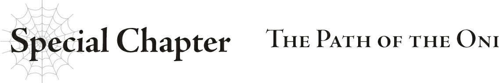

# Chương đặc biệt: Con đường của Oni
*(Special Chapter: The Path of the Oni)*

Chuộc tội.

Mỗi khi nhắm mắt lại, từ đó lại nổi lên, như thể có ai đó đang nói trực tiếp trong đầu tôi.

Ngay cả khi mở mắt ra, từ đó vẫn ở đó.

Dù ngủ hay thức, nó vẫn bám theo tôi không dứt.

Chuộc tội.

Đây chính là hiệu ứng của Cấm kỵ cấp 10.

Tri thức được ban cho những kẻ phạm phải cấm kỵ và nâng cấp độ kỹ năng này lên mức tối đa, cùng với cái giá phải trả cho tri thức ấy.

Những kẻ nâng tối đa kỹ năng Cấm kỵ phải sống chung với từ này trong suốt phần đời còn lại của họ.

Chuộc tội.

Một từ hướng về tất cả con người đang sống trong thế giới này.

Cấm kỵ tồn tại để giúp con người nhận thức được tội lỗi của chính mình, những hành động đã đẩy thế giới này đến bờ vực hủy diệt.

Nhưng nếu điều đó là thật, thì những người tái sinh từng sống ở một thế giới hoàn toàn khác như chúng tôi có gì để chuộc tội, và phải chuộc tội như thế nào?

Câu trả lời là...

Tôi không ngờ việc thu dọn tàn cuộc sau một trận chiến lại vất vả đến thế.

Khi hoàn thành phần lớn công việc, tôi kiệt sức ngã gục xuống.

Nhờ các chỉ số và kỹ năng, thể chất của tôi thực ra không quá mệt mỏi.

Nhưng gánh nặng về mặt tâm lý và tinh thần thì nặng nề hơn nhiều.

Suy cho cùng, công việc hiện tại của tôi là nhận dạng những người tử trận, chuẩn bị tiền tuất gửi cho thân nhân của họ, vân vân.

Thương vong của Quân đoàn 8, đội hình do tôi dẫn dắt, là vô cùng lớn.

Ít nhất một nửa trong số đó là do tôi ép họ phải lao vào kẻ thù trong một cuộc tấn công không khác gì tự sát.

Mỗi lần nhìn vào danh sách những cái tên, tôi như nghe thấy tiếng gào thét oán hận của họ dành cho mình.

Và rồi còn cả cảnh tượng gia quyến ôm lấy thi thể người thân được mang về mà khóc nức nở.

Tôi phải gửi lời chia buồn đến họ mà không được phép để lộ bất kỳ cảm xúc thật nào sau những lời nói đó.

Tôi không thể để lộ bất kỳ cảm xúc nào.

Tôi không có quyền làm vậy.

Bởi vì tôi phải là một cấp trên nhẫn tâm, kẻ đã tàn nhẫn đẩy họ vào chỗ chết.

Thực sự, ngay lúc này tôi thậm chí còn không được phép đắm chìm vào những xúc cảm này.

Tôi buộc mình phải gạt bỏ mọi suy nghĩ và tập trung xử lý hậu quả.

Vì chính tay tôi đã phá hủy pháo đài nơi chúng tôi chiến đấu, nên nó không còn giá trị chiến lược để chiếm đóng nữa.

Chẳng có ích gì khi tuyên bố quyền sở hữu đối với một đống đổ nát.

Nhưng chúng tôi phải thu hồi xác của những người tử trận từ cả hai phe còn sót lại trên chiến trường, cũng như quân nhu bị bỏ lại bên trong pháo đài.

Nếu không, những kẻ cướp bóc chiến trường sẽ nẫng tay trên tất cả.

Hầu hết quân nhu trong pháo đài đã bị hủy hoại đến mức không thể sử dụng khi tôi cho nổ tung mọi thứ, nhưng may mắn thay, vẫn còn một số tài nguyên sót lại không bị phá hủy trong trận chiến mà tôi đã thu hồi được.

Công tác thu gom thi thể mới là phần khó khăn hơn nhiều.

Tất nhiên, phần lớn những người chịu trách nhiệm thu gom xác là những người sống sót và tân binh của Quân đoàn 8.

Đa số họ là bạn bè và người quen của người đã khuất.

Đã có vài lần có người phát hiện ra thi thể của bạn mình rồi sụp đổ khóc nghẹn, không thể tiếp tục làm việc được nữa.

Tôi chính là kẻ phải chịu trách nhiệm cho tất cả bi kịch này.

Nó khiến tôi nghẹn ngào không thốt nên lời.

Nhưng dù vậy, tôi không được phép im lặng.

Tôi phải bảo những người lính đang nức nở kia hãy "ngừng khóc và làm việc đi" mà không có một chút nhân từ nào.

Nếu họ nhìn tôi bằng ánh mắt căm thù, tôi sẽ trừng mắt nhìn lại dữ dội hơn nữa.

Áp lực từ cái trừng mắt của tôi buộc họ phải cúi đầu và khuất phục.

Các thành viên của Quân đoàn 8 là một tập hợp hỗn tạp những kẻ chưa từng có bất kỳ mối liên hệ nào với tôi.

Ngay từ đầu, họ đã không có lý do gì để trung thành với tôi cả.

Và giờ đây khi tôi đã ép họ hành quân vào chỗ chết và khiến nhiều đồng đội của họ bỏ mạng, sự thiếu trung thành đó đang chuyển hóa thành sự phẫn nộ và nỗi sợ hãi.

Thành sự căm hận đối với những cái chết vô nghĩa.

Nhưng họ không thể phản kháng tôi.

Nỗi tuyệt vọng sinh ra từ đó hiện rõ một cách đau đớn.

Tôi đã trở thành một vị tướng độc ác kiểm soát binh lính bằng nỗi sợ hãi.

Chẳng có chút công lý nào trong bức tranh đó cả.

Nhưng đây là con đường tôi đã chọn.

Đã quá muộn để quay đầu rồi.

Trút một tiếng thở dài, tôi đứng dậy khỏi chiếc ghế trong phòng riêng của mình.

Hôm nay chúng tôi có một cuộc họp với tất cả các thống lĩnh.

Tôi rời phòng riêng và tiến về phía phòng họp.

Trên đường đi, tôi tình cờ gặp anh Merazophis.

“Chào cậu.”

“Chào anh.”

Chúng tôi trao đổi những lời chào ngắn gọn tương đương.

Anh Merazophis là người hầu của cô Sophia.

Kể từ khi tôi trở thành thống lĩnh, anh ấy cũng luôn quan tâm che chở tôi với tư cách là tiền bối.

Anh ấy vốn luôn là một người đàn ông trầm lặng không thích chuyện phiếm, nhưng hôm nay trông anh ấy có vẻ đặc biệt u ám.

Tôi chắc chắn anh ấy cũng đang cảm thấy phiền muộn vì những lý do tương tự như tôi.

Khuôn mặt vốn đã nhợt nhạt của anh ấy trông còn nhợt nhạt hơn thường lệ.

Cả hai chúng tôi im lặng cùng bước về phía phòng họp.

Khi chúng tôi mở cửa bước vào, Thống lĩnh Darad đã ngồi sẵn ở đó, với tâm trạng cũng nặng nề không kém gì hai chúng tôi.

Nhưng không giống như sự kiệt sức về mặt tinh thần của chúng tôi, Darad trông giống như bị vắt kiệt sức lực về mặt thể chất hơn.

Khác với anh Merazophis và tôi, Thống lĩnh Darad là một ác quỷ bình thường.

Chỉ số của anh ta tự nhiên thấp hơn chúng tôi.

Giữa cuộc chiến và công tác thu dọn tàn cuộc sau đó, anh ta chắc chắn đã hoàn toàn kiệt sức.

“À. Ngài Merazophis và ngài Wrath.”

Ngay cả giọng nói của anh ta cũng thiếu đi sức sống thường ngày.

Người đàn ông này rõ ràng đã kiệt quệ.

“Anh đã vất vả rồi,” tôi lỡ lời buột miệng nói.

“Hửm. Ta trông kiệt sức đến thế cơ à?”

“Vâng, đại khái là thế.”

Chẳng có ích gì nếu cố phủ nhận, nên tôi trả lời thành thật.

“Ta thật thảm hại làm sao. Thất bại thảm hại trong trận chiến lớn nhất từ trước đến nay, rồi lại tự bêu xấu mình một lần nữa trong quá trình dọn dẹp đống hỗn độn của chính mình. Đúng là đủ để khiến một người mất đi niềm tin vào bản thân mà.”

Thống lĩnh Darad cười gượng gạo.

May mắn thay, Thống lĩnh Kogou bước vào đúng lúc đó.

Vị thống lĩnh khổng lồ cảm nhận được bầu không khí trong phòng liền trở nên ngượng ngập và tỏ vẻ hối lỗi khi khép nép bước về chỗ ngồi của mình.

Thống lĩnh Kogou trông cũng nhợt nhạt.

Có vẻ như tất cả các thống lĩnh đều đang bị làm việc quá sức ở một mức độ nào đó.

Tôi cũng về chỗ ngồi của mình và đợi cuộc họp bắt đầu.

Một lúc sau, cô White bước vào phòng.

Có lẽ đó là do tôi tưởng tượng, nhưng có vẻ như cô ấy đã liếc nhìn Thống lĩnh Kogou khi bước vào.

Mặc dù vì mắt cô ấy luôn nhắm nghiền, nên hơi khó để biết cô ấy đang nhìn đi đâu.

“Chào mọi người. Xem ra ai cũng có mặt đông đủ rồi nhỉ.”

Trong lúc tôi đang mải chú ý đến cô White thì cô Ariel cũng bước vào.

Vẫn còn thiếu vài thống lĩnh, nhưng tôi đoán những người còn lại sẽ không đến hôm nay.

Quan trọng hơn, anh Balto đứng bên cạnh cô Ariel trông vô cùng khốn khổ.

Anh ta nhợt nhạt đến mức trông như thể có thể đột tử bất cứ lúc nào. Anh ta có ổn không thế?

“Thống lĩnh Quân đoàn 2 vẫn chưa quay lại. Hôm nay cô ấy sẽ không có mặt ở đây.”

Cô Ariel cho biết Thống lĩnh Quân đoàn 2, Sanatoria, sẽ không tham gia cùng chúng tôi hôm nay.

Hiện tại, cô ấy cùng Quân đoàn 2 đang trên đường quay trở về từ pháo đài đó.

Trong cuộc họp trước, cô Ariel đã tuyên bố mục tiêu tiếp theo của chúng tôi là làng Elf.

Một số thống lĩnh đang liên lạc với tộc Elf; Thống lĩnh Quân đoàn 9 cũ Warkis đã thông đồng với chúng.

Cô Ariel và cô White không nói cho tôi biết đó là những ai, nhưng qua ngữ cảnh, tôi đoán Thống lĩnh Sanatoria là một trong số họ.

Đó chỉ là phỏng đoán, nhưng tôi gần như chắc chắn mình đã đúng.

Và nếu tôi có thể nhận ra điều đó, thì không đời nào cô Ariel và cô White lại không biết.

Nghĩa là hiện tại, họ đang cố tình để cô ấy tự do.

Tôi không thể hiểu nổi tại sao họ lại làm vậy nếu chúng tôi sắp sửa hành quân đến làng Elf để quét sạch toàn bộ chủng tộc của họ.

Nhưng hiểu rõ tính cách của cô Ariel và cô White, tôi chắc chắn có một lý do rất thuyết phục mà mắt thường không thể thấy ngay được.

“Vậy thì, ta tập hợp các ngươi ở đây vì một lý do rất quan trọng. Chúng ta sẽ thảo luận về kế hoạch tấn công làng Elf.”

Hửm? Tôi giữ sự ngạc nhiên lại cho riêng mình.

Thông thường, cô Ariel sẽ để anh Balto chịu trách nhiệm điều hành những cuộc họp này.

Nhưng lần này, đích thân cô Ariel lại đứng ra giải quyết.

Có điều gì đó kỳ lạ đang diễn ra.

Tôi không thể ngăn mình có một linh cảm xấu về chuyện này.

Và hầu như mọi lần, linh cảm xấu của tôi đều đúng.

“Thực ra kế hoạch có chút thay đổi. Chúng ta sẽ phải đẩy lịch trình lên sớm hơn nhiều.”

Các thống lĩnh đều im lặng như tờ, cứ như thể họ quên cả thở.

Tôi không thể trách phản ứng đó của họ. Chúng tôi chỉ vừa mới gần như hoàn thành công tác dọn dẹp hậu chiến, vậy mà giờ lại phải hành quân ngay lập tức.

Kế hoạch ban đầu đã khá bận rộn và eo hẹp thời gian rồi. Nếu còn đẩy lịch trình lên sớm hơn nữa, thì đây có thể biến thành một cuộc hành quân tử thần theo đúng nghĩa đen.

“Ừm, xin lỗi nhé!”

Cô Ariel gãi đầu và xin lỗi bằng một giọng điệu nhẹ nhàng.

Điều này chẳng mang lại sự an ủi nào cả, nhưng có lẽ cô ấy thực sự cảm thấy áy náy trong lòng.

Xét cho cùng, cô Ariel thực chất là một người rất tốt.

Nhưng lời xin lỗi của cô ấy sẽ không làm cho núi công việc trước mắt chúng tôi nhỏ đi chút nào.

Thuật ngữ 'bóc lột sức lao động' thoáng qua trong tâm trí tôi.

Con người có thể làm được những điều phi thường nếu họ ép buộc bản thân. Chúng tôi đã xoay xở tái cơ cấu quân đội và sẵn sàng hành quân vừa kịp lúc.

Có lẽ đó là nhờ tất cả các thống lĩnh đã hợp tác và chạy đôn chạy đáo như điên để hoàn thành công tác chuẩn bị.

Anh Balto và Thống lĩnh Darad là những người đặc biệt hợp tác; tôi cảm thấy họ đã cởi mở hơn rất nhiều trong giai đoạn chuẩn bị này.

Đáng ngạc nhiên hơn nữa, Thống lĩnh Sanatoria cũng khá giúp ích, mặc cho sự thật là cô ấy rất có thể đang bí mật hợp tác với tộc Elf.

Khi quay trở lại lâu đài Ma Vương, cô ấy thực sự đã phối hợp với những người như anh Balto, người đã ở lại phía sau để duy trì hoạt động ở lãnh địa quỷ trong suốt trận chiến, và Thống lĩnh Darad. Cô ấy chủ động tham gia vào các nỗ lực phục hồi, nâng cấp phòng thủ cho các binh sĩ chuẩn bị tiến đến làng Elf, vân vân.

Mặc dù không giống như anh Balto và Thống lĩnh Darad, cô ấy không đề xuất cho mượn lực lượng của mình cho chuyến viễn chinh đến làng Elf.

Dù vậy, cô ấy đã giúp đỡ rất nhiều.

Tôi đoán Thống lĩnh Sanatoria chắc hẳn đã quyết định cắt đứt liên lạc với tộc Elf và đi theo cô Ariel.

Đối với tôi điều đó có vẻ giống như một nước đi cơ hội, nhưng đó thực sự không phải việc của tôi.

Mặt khác, Thống lĩnh Quân đoàn 3 Kogou lại kiên quyết bất hợp tác.

Anh ta vốn luôn đứng về phe nổi loạn, và anh ta cũng phản đối cuộc tấn công tiếp theo này.

Nói vậy chứ, mặc dù không chủ động giúp đỡ, anh ta cũng không cố gắng ngăn cản chúng tôi.

Nếu ai đó như anh Balto đưa ra mệnh lệnh, anh ta vẫn sẽ làm, dù là làm một cách nửa vời.

Nhút nhát. Thiếu quyết đoán. Đó là ấn tượng của tôi về Thống lĩnh Kogou.

Tôi biết nghe thế có hơi khắc nghiệt, nhưng tôi không thể khác được.

Trong khi những người còn lại trong chúng tôi làm việc quên ăn quên ngủ, anh ta lại là thống lĩnh duy nhất liên tục từ chối giúp đỡ.

Xét về mặt kỹ thuật, tôi đoán Thống lĩnh Quân đoàn 9 Hắc cũng chẳng giúp ích gì, nhưng anh ta có một vị thế đặc biệt khác hẳn với các thống lĩnh còn lại của chúng tôi.

Còn về vị thống lĩnh khác có vị trí đặc biệt, cô White, bản thân cô ấy có vẻ cũng khá bận rộn.

Mặc dù tôi chưa từng thực sự thấy cô ấy trông có vẻ bận rộn.

Về mặt chính thức, công việc thực tế của Quân đoàn 10 của cô White vẫn là một bí ẩn, nhưng tôi tình cờ biết rằng cô White dịch chuyển họ đi khắp nơi để làm những công việc vặt khác nhau.

Việc tôi không nhìn thấy bất kỳ thành viên nào của Quân đoàn 10 trong suốt thời gian tập kết lực lượng chính là bằng chứng cho thấy họ đang bận rộn.

Tuy nhiên, hôm nay họ đã có mặt cho buổi khởi hành.

...Mặc dù tôi không thấy một vài thành viên, chẳng hạn như cô Sophia.

Tôi đoán những người không có mặt ở đây là đang hành quân cùng quân đội đế quốc.

Trước khi chúng tôi rời đi, Natsume — hay đúng hơn là Hugo — đã dẫn dắt quân đội đế quốc tiến về phía làng Elf.

Chúng tôi sẽ hành quân ngay sau họ, với tư cách là đội hình thứ hai trong hàng ngũ chiến đấu.

Tôi liếc nhìn xung quanh quân đội ma tộc khi chúng tôi chuẩn bị xuất phát.

Điều đầu tiên đập vào mắt tôi là những lá cờ chiến của đế quốc.

Có nhiều cờ đến mức chỉ nhìn lướt qua cũng để lại ấn tượng mạnh mẽ.

Tôi sẵn sàng cá rằng chính cô White là người đã chuẩn bị chúng.

Chúng tôi sẽ giả vờ là một phần của quân đội đế quốc trong khi hành quân.

Về bề ngoài, ma tộc và con người trông hoàn toàn giống nhau.

Vì vậy, chỉ cần chúng tôi phô trương sự liên kết này một cách trơ trẽn và lan truyền tin tức trước rằng quân đội đế quốc sắp hành quân qua, sẽ không ai mảy may nghi ngờ.

Có một vài trường hợp ngoại lệ có ngoại hình nổi bật, chẳng hạn như tôi, nhưng tất cả những gì chúng tôi phải làm là che đậy bằng áo giáp toàn thân và những thứ tương tự.

Ngay lúc này, ở các vùng đất của con người, có lẽ họ đều đã sẵn sàng cho quân đội đế quốc đi qua.

Mà không hề biết rằng chúng tôi thực chất là quân đội ma tộc.

Tôi chắc chắn Giáo hoàng đã đảm bảo điều đó.

Ấn tượng đầu tiên của tôi về Giáo hoàng là ông ta là một ông lão bình thường, hay ít nhất tôi đã nghĩ như vậy.

Ông ta không có chút dấu vết nào của hào quang kẻ thực sự mạnh mẽ. Nếu tôi vòng tay qua cổ ông ta và siết nhẹ một chút, tôi có thể dễ dàng siết cổ ông ta đến chết.

Tôi hoàn toàn chắc chắn về điều đó.

Và tôi không hề sai.

Giáo hoàng cực kỳ yếu, và tôi có thể dễ dàng tiêu diệt ông ta chỉ bằng một đòn tấn công duy nhất.

Nhưng đó chỉ là về mặt sức mạnh vật lý.

Cô Ariel, trong số tất cả mọi người, lại gọi ông ta là một con quái vật.

Tôi đã được tận mắt chứng kiến một phần khía cạnh đó của ông ta.

“Đó chính là lý do tại sao ta sẽ không cho phép núi xương sông máu của những người hy sinh đổ xuống một cách vô ích.”

Tôi chắc chắn Giáo hoàng không hề biết những lời đó đã chấn động tâm can tôi đến mức nào.

Tôi gặp Giáo hoàng lần đầu khi cô White và cô Ariel đưa tôi đi cùng để viếng thăm Thánh quốc Alleius.

Ngay trước cuộc chiến, đó là một cuộc gặp gỡ giữa những kẻ thù không đội trời chung: thủ lĩnh của ma tộc và người đứng đầu Thần Ngôn Giáo, người về cơ bản có thể được gọi là thủ lĩnh của loài người.

Vì lý do nào đó, tôi cũng được phép dự thính cuộc gặp gỡ định mệnh này.

Cô Ariel và Giáo hoàng trước đó đã đạt được sự đồng thuận rằng họ sẽ hợp tác với nhau sau cuộc chiến để hạ gục tộc Elf như một mặt trận thống nhất, và họ rõ ràng đã lập một giao ước bí mật.

Vì vậy, mục tiêu của cuộc gặp này là để trao đổi ý tưởng và thẳng thắn thảo luận về kế hoạch hành động cho giai đoạn sau cuộc chiến và sau khi đánh bại tộc Elf.

Cô Ariel là một nhân chứng sống thực sự, một thực thể đã tồn tại từ trước khi hệ thống được tạo ra.

Và từ những gì cô ấy kể cho tôi nghe, Giáo hoàng sở hữu một kỹ năng cực kỳ bất thường cho phép ông ta tái sinh lặp đi lặp lại với ký ức của tất cả các kiếp trước còn nguyên vẹn.

Điều đó có nghĩa là ông ta là một nhân chứng sống của lịch sử giống như Ariel, ngay cả khi ông ta được tái sinh nhiều lần thay vì sống sót qua suốt ngần ấy thời gian.

Và nếu ông ta biết lịch sử thực sự của thế giới này, điều đó có nghĩa là ông ta cũng biết tất cả về hệ thống.

Cấm kỵ đã dạy tôi sự thật về hệ thống.

Cụ thể là, những hành động ngu xuẩn của con người đã đẩy thế giới này đến bờ vực hủy diệt, và một nữ thần đơn độc đã tự hiến tế bản thân để ngăn chặn sự hủy diệt đó.

Nhưng đó chỉ là một giải pháp tạm thời, và thế giới này vẫn đang có nguy cơ sụp đổ.

Hệ thống về cơ bản là một đại ma pháp thu thập điểm kinh nghiệm mà mỗi sinh vật tích lũy được trong suốt cuộc đời của họ, sức mạnh được phản ánh trong các chỉ số và kỹ năng của họ, và thu hồi nó sau khi sinh vật đó chết, sử dụng nó để phục hồi thế giới và giữ cho nó không rơi vào cảnh điêu tàn.

Cô Ariel và Giáo hoàng biết sự thật về hệ thống này.

Đó là lý do tại sao cô Ariel đưa ma tộc chống lại loài người với tư cách là Ma Vương và cung cấp cho hệ thống nhiều năng lượng hơn bằng cách gây ra những cái chết hàng loạt.

Và lý do Thần Ngôn Giáo dạy các tín đồ rèn luyện kỹ năng của họ và lắng nghe "giọng nói của Thần" thường xuyên hơn là để tăng lượng năng lượng họ cung cấp cho hệ thống trong suốt cuộc đời.

Khi cư dân của thế giới này lớn lên, họ nghe thấy các thông báo mỗi khi họ đạt được kỹ năng mới, thăng cấp, vân vân trong hệ thống.

Rất ít người cảm thấy kỳ lạ khi coi đó là giọng nói của Thần.

Dù sao thì họ cũng đã nghe nó cả đời rồi.

Nhưng khi những người tái sinh khác tìm hiểu về các giáo luật của Thần Ngôn Giáo, họ có thể chỉ nghĩ rằng thế giới này có một số tín ngưỡng rất kỳ lạ.

Nếu tôi phát hiện ra giáo lý đó mà không biết gì khác, tôi chắc chắn cũng sẽ nghĩ như vậy.

Với những người tái sinh khác, chúng tôi thậm chí có thể đã nói đùa về nó.

Thần Ngôn Giáo ngớ ngẩn thật đấy, chúng tôi sẽ nói thế.

Nhưng biết được sự thật, chuyện đó chẳng có gì đáng cười cả.

Thần Ngôn Giáo thực chất sử dụng khuôn khổ tôn giáo để tống tiền toàn bộ nhân loại.

Nó bảo họ hãy trở thành một phần nền móng cho thế giới.

Vì họ được nuôi dưỡng với giáo lý này từ khi mới lọt lòng, bị tiêm nhiễm bởi nó, họ hoàn toàn tin rằng mình đang tuân theo các giáo lý của Thần Ngôn Giáo bằng ý chí tự do của chính mình.

Nó cực kỳ hiệu quả. Trên thực tế, hiệu quả đến mức đáng sợ.

Tôi chắc chắn nó khiến tôi cảm thấy bất an vì nó coi mạng sống như những món hàng tiêu dùng.

Nó gần giống như một trang trại: nuôi gia súc dưới dạng con người và xuất chuồng để đem đi ăn thịt.

Và điều đáng lo ngại hơn là con người hoàn toàn không biết họ đang bị nuôi như gia súc...

Nhưng người tạo ra trang trại này không ai khác chính là Giáo hoàng của Thần Ngôn Giáo.

Càng tìm hiểu về tôn giáo đó, tôi càng nhận ra Giáo hoàng đáng sợ đến mức nào.

Khả năng tổ chức của ông ta mới là điều khiến ông ta trở nên đáng sợ như vậy.

Thần Ngôn Giáo có tầm ảnh hưởng lên hầu như mọi quốc gia loài người.

Một trong những ngoại lệ duy nhất là Sariella, một quốc gia thờ phụng Nữ Thần thay thế, nhưng vẫn có các nhà thờ ở mọi quốc gia loài người khác.

Ngay cả những ngôi làng nhỏ nhất cũng có giáo đường, gieo rắc cội rễ của Thần Ngôn Giáo.

Trẻ nhỏ nhận được phước lành của Giáo hội và lớn lên khi nghe những giáo lý của nó.

Đến khi trưởng thành, họ đã là những tín đồ trung thành của Thần Ngôn Giáo.

Đó là cách Giáo hội nắm giữ trái tim của mọi người và có được sự kiểm soát ngầm đối với nhân loại.

Không chỉ vậy, các nhà thờ nằm rải rác khắp thế giới còn được sử dụng làm trung tâm thu thập thông tin hoặc các điểm trung chuyển để truyền đạt thông tin.

Có vẻ như, hầu hết những người làm việc dưới quyền Giáo hội đều học được kỹ năng [Viễn Thoại], một phiên bản nâng cấp của [Thần giao cách cảm]. Kỹ năng này cho phép người dùng giao tiếp với nhau từ khoảng cách rất xa.

Họ dùng kỹ năng này để truyền đạt thông tin, theo kiểu nối đuôi truyền tin, đến tận trụ sở Thần Ngôn Giáo ở Thánh quốc Alleius.

Nó có thể không hoàn toàn cập nhật theo thời gian thực, nhưng đó vẫn là một cách cực kỳ nhanh chóng để thu thập thông tin từ những vùng đất xa xôi.

Giáo hoàng hiểu rất rõ thông tin mới có thể vô giá đến mức nào.

Trong thế giới không có ô tô hay máy bay này, việc di chuyển mất rất nhiều thời gian.

Ngoài các ngoại lệ như cổng dịch chuyển và [Viễn Thoại], cách nhanh nhất để truyền đạt thông tin là bằng liên lạc viên cưỡi ngựa, nhưng ngay cả cách đó cũng thường quá chậm.

Nhưng bằng cách bố trí những người dùng [Viễn Thoại] ở mọi quốc gia, Giáo hoàng có thể giảm thiểu thời gian trễ trong việc truyền tin xuống mức tối thiểu.

Sau đó, ông ta phân tích thông tin đó và thực hiện các bước đi tương ứng.

Trên hết, ông ta còn có các cơ chế khác để củng cố Giáo hội.

Quan trọng hơn cả là, trong khi cấu trúc này đòi hỏi rất nhiều người, thứ mà nó không yêu cầu chính là tài năng đặc biệt của bất kỳ cá nhân nào.

[Viễn Thoại] là một kỹ năng nâng cao, nhưng chỉ cần học được [Thần giao cách cảm], tất cả những gì cần thiết tiếp theo chỉ là luyện tập.

Tương tự như vậy, tất cả các kỹ năng cần thiết để làm việc cho tổ chức tôn giáo này đều hoàn toàn bình thường.

Bất kỳ ai cũng có thể học được chúng nếu họ chú tâm.

Nói cách khác, đó là một công việc mà ai cũng có thể làm được.

Và điều đó thực sự quan trọng.

Bởi vì nó có nghĩa là ông ta có thể đào tạo ra bất kỳ số lượng người thay thế nào.

Thay vì đặt việc quản lý tổ chức vào tay một người xuất chúng duy nhất, ông ta sử dụng đại chúng để hỗ trợ nó.

Và vì ai cũng có thể làm được, các vị trí trống dễ dàng được bù đắp, với vô số người thay thế sẵn sàng lấp đầy khoảng trống.

Nếu một người mất đi, người khác có thể thế chỗ ngay lập tức.

Ngay cả bản thân Giáo hoàng cũng không ngoại lệ đối với quy tắc đó; khi người thừa kế cái tên Dustin vắng mặt, một Giáo hoàng khác sẽ tiếp quản vai trò này.

Và ngay cả trong những thời kỳ Dustin không đứng đầu, Giáo hội Thần Ngôn Giáo cũng chưa bao giờ lung lay.

Nền móng của tôn giáo này kiên cố và vững chãi đến mức đáng sợ.

Thần Ngôn Giáo đã tồn tại hàng trăm năm, củng cố vị trí của mình như một phần không thể thiếu của xã hội loài người.

Phải, Giáo hoàng chắc chắn là một người phi thường.

Nhưng thay vì dùng sức mạnh của chính mình, ông ta sử dụng người khác để kiểm soát nhân loại.

Ông ta thực sự là một vị vua của loài người.

Bản chất của ông ta khiến ông ta nổi bật ngay cả trong số tất cả những con người phi thường mà tôi từng gặp.

Cô Ariel, cô White, cô Sophia, anh Merazophis... tất cả họ đều cực kỳ mạnh mẽ theo cách riêng của mình, vì vậy họ chưa bao giờ phụ thuộc vào những kẻ dưới quyền.

Vì bản thân họ đã hoàn hảo, là những cá thể trọn vẹn, họ chưa bao giờ bận tâm đến việc trở thành những vị vua chỉ huy người khác bằng sức mạnh của mình.

Người duy nhất tôi gặp phù hợp với vai trò của một vị vua có lẽ là ông Agner quá cố, Thống lĩnh Quân đoàn 1.

Ông Agner không chỉ dẫn dắt Quân đoàn 1 — ông đã dẫn dắt toàn bộ ma tộc với sự tận tụy lớn lao.

Nhưng ngay cả khi đó, tôi phải thừa nhận rằng tổ chức của ông Agner vẫn hoàn toàn phụ thuộc vào sức mạnh của ông và uy quyền đi kèm với nó.

Không có ông, những người đi theo ông không thể tự đứng vững trên đôi chân của mình.

Nhưng sự kiểm soát của Giáo hoàng không mong manh đến mức mọi thứ sẽ sụp đổ sau khi mất đi một người duy nhất.

Ông ta có lẽ đã nhận ra điểm mạnh và giới hạn của bản thân ngay từ đầu và tập trung vào việc xây dựng một tổ chức ngay lập tức.

Ông ta có tầm nhìn đáng kinh ngạc cho phép dự đoán những bước phát triển trong tương lai.

Và vì ông ta thực sự đã xoay xở để khiến Thần Ngôn Giáo trở nên to lớn như vậy, không nghi ngờ gì khi ông ta sở hữu sự khôn ngoan và chiến lược không thể tin nổi.

Hiện tại, hầu hết những điều này chỉ là những gì tôi học được từ cô Ariel.

Khi được cô ấy dạy về Thần Ngôn Giáo, tôi đã nghĩ mình hiểu Giáo hoàng xuất chúng đến mức nào.

...Nhưng khi gặp mặt ông ta trực tiếp, tôi nhận ra mình vẫn còn rất nhiều điều phải học.

“Chúng ta sẽ giết Anh hùng. Điều đó đã được định đoạt rồi.”

“Nhưng nếu làm thế, nhân loại sẽ không còn có thể đứng vững trước cô, Ma Vương. Liệu điều này có hơi quá phiến diện chăng?”

“Và ông nghĩ Anh hùng sẽ lãng phí bao nhiêu năng lượng để đối đầu với ta? Cả hai chúng ta đều sẽ tốt hơn nếu chuyện đó không xảy ra, ông có nghĩ vậy không?”

“…Ta hiểu rồi. Vậy cô không chỉ giết Anh hùng, mà còn muốn xóa bỏ hoàn toàn cơ cấu Anh hùng sao?”

“Kế hoạch là như thế.”

“Lợi và hại của việc làm đó là gì?”

Giáo hoàng và cô Ariel đang thẳng thắn thảo luận về cách xử lý Anh hùng.

Theo những gì tôi nghe được, Anh hùng đó chính là anh trai của người bạn thân nhất kiếp trước của tôi, Shun.

Và Giáo hoàng đang dùng việc triệt hạ một tổ chức buôn người do tộc Elf bí mật điều hành như một cách để giúp Anh hùng đó tích lũy cả kinh nghiệm chiến đấu lẫn danh tiếng.

Vì cuộc xung đột với ma tộc vào thời điểm đó chỉ giới hạn ở một cuộc chiến tranh lạnh, nên Anh hùng không có nơi nào để tạo dựng danh tiếng cho mình.

Vì thế Giáo hoàng quyết định nhất tiễn tam điêu: giúp Anh hùng có thêm kinh nghiệm thực chiến, lan truyền tin tức về những chiến công của cậu ta, và đồng thời đập tan âm mưu của tộc Elf.

Kết quả là, Anh hùng Julius đã trở nên rất được lòng dân chúng, và bằng cách tích lũy kinh nghiệm qua việc chiến đấu với tổ chức buôn người, cậu ta đã nâng cấp độ của mình lên ngang tầm với các Anh hùng tiền nhiệm.

Và rồi, sau khi giám sát sự trưởng thành của Anh hùng theo cách này, Giáo hoàng lại vứt bỏ cậu ta không một chút do dự khi đối mặt với những lợi ích có được từ việc đó.

“Ông muốn ta tuyên bố Hugo Baint Renxandt là Anh hùng mới sao?”

“Đúng vậy. Người thực sự là Schlain Zagan Analeit.”

“Và tại sao chúng ta lại phải che giấu điều đó?”

“Bởi vì Hugo là một quân cờ của White yêu quý của chúng ta. Mặc dù ta không nghĩ cậu ta biết chuyện đó. Việc gọi một con người mà chúng ta có thể hoàn toàn kiểm soát là Anh hùng chính thức sẽ giúp mọi việc dễ dàng hơn nhiều cho chúng ta.”

“Ta hiểu rồi. Điều này có liên quan gì đến những hoạt động đáng ngờ mà Potimas đang tiến hành ở Vương quốc Analeit không?”

“Chắc chắn rồi. Nếu chúng ta muốn đá Potimas ra khỏi Vương quốc Analeit, trước hết chúng ta sẽ phải gây ra một số rắc rối nghiêm trọng ở đó. Và chúng ta cần toàn bộ xã hội tin rằng Hugo mới là người đúng.”

“Thế nên ông đã kết luận rằng cách nhanh nhất và hiệu quả nhất để xây dựng niềm tin đó là tuyên bố Hoàng tử Hugo là Anh hùng, hửm?”

“Ta rất vui vì ông hiểu nhanh như vậy.”

“Nhưng nếu lời nói dối đó bị phanh phui, Thần Ngôn Giáo sẽ mất đi rất nhiều uy tín. Cô định đền bù cho chuyện đó thế nào đây?”

“Tiêu diệt tộc Elf là một phần thưởng khá hời rồi đúng không? Chúng ta dự định sử dụng Hugo cho việc đó nữa, nên Giáo hội của ông có thể nhận một nửa công lao vì đã giúp đỡ. Nếu có chuyện gì trục trặc, cứ tuyên bố rằng ông đã bị Hugo tẩy não.”

Ông ta sẽ không ngần ngại làm giả danh tính của Anh hùng thực sự nếu việc đó có lợi cho mục đích của mình.

Hoặc đẩy toàn bộ một vương quốc vào cảnh hỗn loạn nếu việc đó đồng nghĩa với việc đánh bại Potimas.

Một mặt, bạn có thể nói ông ta có cái nhìn bao quát về bức tranh toàn cảnh.

Mặt khác, điều đó thật máy móc đến đáng sợ, xem mạng sống con người chỉ như những con số.

Nếu từ bỏ một người có thể cứu được từ hai người trở lên, thì ông ta sẽ từ bỏ người đó không chút do dự, ngay cả khi đó là Anh hùng.

Of course, nếu sự hữu dụng của Anh hùng lớn hơn số người được cứu, tôi đoán ông ta sẽ không vứt bỏ cậu ta.

Nhưng đó sẽ không phải vì ông ta đang cân nhắc đến cá nhân đó — không, tất cả những gì quan trọng chỉ là năng lực của quân cờ mang tên Anh hùng.

Một con quái vật chính trị, gạt bỏ mọi cảm xúc cá nhân hay sự tử tế của con người.

To the human race, ông ta là một vị vua, một người bảo vệ tuyệt đối, một đồng minh.

Ấy vậy mà, chính ông ta lại thiếu đi nhân tính trong các nguyên tắc của mình.

What kind of sick joke is it khi người dẫn dắt nhân loại lại tự mình không có nhân tính?

Tôi không thể hiểu nổi điều đó.

Vì thế tôi đã buột miệng đưa ra một nhận xét.

“Ông nói muốn bảo vệ nhân loại, nhưng ông lại sẵn lòng dâng hiến họ dễ dàng như vậy.”

Ông ta phản hồi:

“Nếu cách duy nhất để cứu số đông là giết chết số ít, thì ta sẽ giết số ít không chút do dự.”

Sau đó cô Sophia khịt mũi.

“Thật là một trò nực cười, tàn sát chính những người mà mình muốn cứu.”

Theo những gì tôi được nghe kể, quê hương của cô Sophia đã bị phá hủy bởi một giáo phái của Thần Ngôn Giáo, và Potimas đã lợi dụng sự hỗn loạn đó để sát hại cha mẹ cô.

Việc cô giữ lòng căm oán đối với Giáo hội là điều dễ hiểu.

Nhưng Giáo hoàng cũng phản hồi lời buộc tội của Sophia một cách bình tĩnh.

“Đó chính là lý do tại sao ta sẽ không cho phép núi xương sông máu của những người hy sinh đổ xuống một cách vô ích.”

Tư tưởng đó đã làm tôi chết lặng.

Không những ông ta không tự hào về những gì mình đã làm, mà dường như ông ta còn đang xin lỗi núi xác chết mà mình đã tạo ra.

Nhưng ông ta vẫn từ chối dừng lại.

Nếu dừng lại, ông ta sẽ để tất cả những cái chết đó, những sự hy sinh đó, trở nên vô ích.

Có lẽ đây chính là hình thức chuộc tội của Giáo hoàng.

Một sự chuộc tội vô tận, tiến trình của nó dẫn ông ta đến việc tích lũy thêm nhiều tội lỗi cần phải trả giá.

Ấy thế mà, ông ta vẫn tiếp tục, dù biết sẽ không có điểm dừng, không có sự tha thứ.

Trải nghiệm đó khắc nghiệt biết bao?

Nó làm tôi rùng mình.

Đó có lẽ là lần đầu tiên tôi nhận ra Giáo hoàng thực sự là một kẻ không thể thấu hiểu đến mức nào.

Tôi vẫn chưa quyết định được mình nên sống cuộc đời mình như thế nào.

Tôi được sinh ra như một goblin, rồi ngôi làng goblin nơi tôi lớn lên bị phá hủy, và tôi bị buộc phải làm việc cho Buirimus, chính kẻ đã tàn sát ngôi làng của tôi.

Sau đó tôi nhận được kỹ năng [Phẫn Nộ], thoát khỏi ách nô lệ của Buirimus, và trả thù cho các đồng bào đã khuất của mình.

Sau đó tôi nửa phần mất đi lý trí vì kỹ năng [Phẫn Nộ] và đi khắp nơi chém giết tất cả những gì trong tầm mắt.

Việc tôi gặp được cô White và những người khác rồi được phong ấn [Phẫn Nộ] để lấy lại nhận thức không khác gì một phép màu.

Nếu tôi tiếp tục lang thang trong tình trạng nửa điên nửa tỉnh đó, tôi có lẽ đã sớm cạn kiệt sức lực và chết gục ở xó xỉnh nào đó rồi.

Tôi thật may mắn khi còn sống.

Không giống như những người tôi đã giết.

Vì tôi đã may mắn được cứu sống, tôi nghĩ nhiệm vụ của mình là phải tiếp tục sống.

Và nếu tiếp tục sống, tôi muốn đạt được một điều gì đó.

Nhưng tôi vẫn chưa nghĩ ra chính xác mình nên làm gì.

Tôi chỉ đi theo sau cô Ariel, cô White và những người khác.

Họ đang cố gắng làm một điều gì đó phi thường và cứu thế giới, còn tôi chỉ đi theo như một kẻ ăn theo theo một cách nhỏ bé nào đó.

Mà không hề thực sự đối diện với những tội lỗi mình đã phạm phải.

Tất cả những gì tôi làm chỉ là đứng nhìn đầy ngưỡng mộ những con người biết rõ họ muốn gì và theo đuổi nó không chút do dự.

Nhưng một phần trong tôi vẫn tự hỏi.

Liệu một kẻ không có định hướng như tôi thực sự có quyền chiến đấu bên cạnh họ sao?

Tôi không thể ngăn mình lo lắng về điều đó.

Liệu việc lấy đi mạng sống của con người vì lợi ích lớn lao hơn có thực sự được gọi là công lý?

Tôi chắc chắn cô Ariel và cô White đã tìm ra câu trả lời cho điều đó rồi.

Nhưng tôi không thể đi đến kết luận dễ dàng như vậy.

Ở kiếp trước, tôi ghét bất cứ điều gì mà tôi cho là sai trái.

Tôi gần như bị ám ảnh bởi việc đảm bảo mọi thứ mình làm đều đúng đắn.

Nhưng khi bị khống chế bởi kỹ năng [Phẫn Nộ] và sát hại những người vô tội, điều đó rõ ràng là sai trái.

Kể từ đó, tôi đã mất đi phương hướng về cách mình muốn sống.

Tôi đã lạc lối khỏi con đường chính nghĩa.

Tôi không thể tìm thấy một con đường mới để đi theo và chỉ biết bám theo bóng lưng của cô Ariel và cô White ở phía xa.

Trong khoảnh khắc đó, những lời của Giáo hoàng giống như một ngọn hải đăng soi sáng.

Biết rằng những gì bạn đang làm là không đúng đắn, biết rằng đó là một tội lỗi, nhưng bạn vẫn tiếp tục tiến lên vì lợi ích lớn lao hơn.

Giáo hoàng đã cho tôi thấy rằng đây cũng là một cách để sống.

Tôi chắc chắn đó sẽ là một con đường đau đớn và đầy thử thách.

Nhưng vào chính khoảnh khắc đó, tôi nhận ra đó là con đường mình nên chọn để tiến bước.

Chuộc tội.

Từ ngữ đó vang vọng từ kỹ năng Cấm kỵ.

Được rồi, thế thì...

Tôi sẽ chuộc tội.

Tôi sẽ chai sạn lòng mình để phạm thêm nhiều tội lỗi nữa và chuộc lỗi cho cả những tội lỗi đó.

Để đền bù cho cái chết của những người vô tội mà tôi đã giết.

Để đảm bảo rằng họ không chết một cách vô ích.

Không, ngay cả điều đó cũng thật ích kỷ.

Gọi đó là chuộc tội thì quá vĩ đại rồi.

Tôi sẽ lấy đi vô số mạng sống vì lý do ích kỷ của riêng mình.

Tôi sẽ không xin lỗi.

Và tôi sẽ không ngoảnh lại nhìn nữa.

Tôi sẽ tiếp tục chất thêm chồng chất lên những núi xác chết đó.

Và tôi sẽ phục vụ cho lợi ích lớn lao hơn.

Đó là cách duy nhất tôi có thể tiến bước.

Như vậy, tôi đã dẫn dắt Quân đoàn 8 trong cuộc chiến và gây ra vô số hy sinh cho cả hai phe.

Và giờ đây, tôi đang dẫn đầu cuộc hành quân đến làng Elf.

Mục tiêu của chúng tôi là tiêu diệt tộc Elf.

Tiến hành diệt chủng cả một chủng tộc.

Tôi chắc chắn nhiều sinh mạng sẽ phải nằm lại.

“Xuất phát!”

Theo hiệu lệnh của cô Ariel, tôi bắt đầu bước đi.

Tiến lên, luôn luôn tiến lên.

Tôi sẽ không bao giờ dừng lại nữa.

---

[◀ Chương trước: Chương 4: Đàm phán với tai to mặt lớn kiếm sống](06_ch4_negotiating_with_bigwigs_for_a_living.md) | [Chương tiếp theo: Chương 5: Điều phối giao thông và hành hình kiếm sống](08_ch5_doing_traffic_control_and_executions_for_a_living.md)
