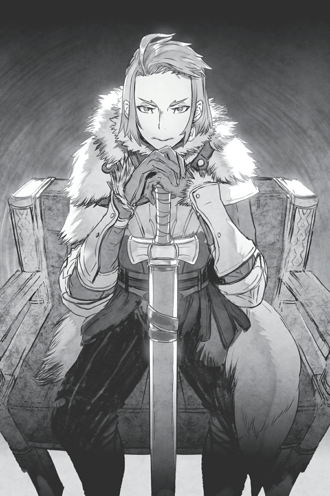
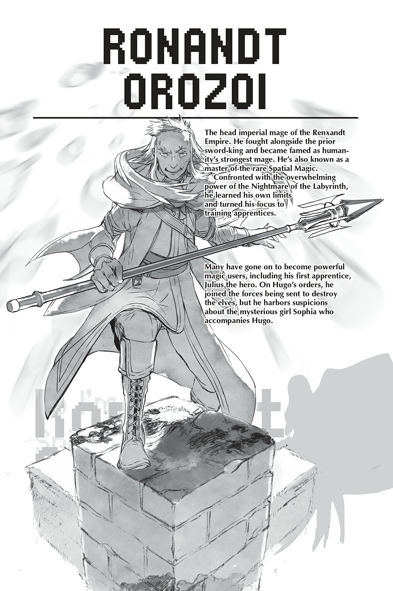

# Chương 5: Điều phối giao thông và hành hình kiếm sống
*(Chapter 5: Doing Traffic Control and Executions for a Living)*

Bậ-ận-n qu-uá-á đ-đi-i.

Tôi đang bậ-ận, bậ-ận lắm lắm lu-uôn-n.

Chú nhện bậ-ận rộ-ộn.

Lời bài hát do chính tác giả tự biên tự diễn.

Ờm, alo? Ngày nghỉ của tôi đâu rồi?

Cuối tuần của tôi đâu?

Ngày lễ đâu?

Rồi còn nghỉ hè, nghỉ đông, nghỉ xuân, hay Tuần lễ Vàng nữa?!

Tôi đã phải làm việc không ngừng nghỉ suốt mấy ngày liền rồi đấy!

Bộ Luật Tiêu chuẩn Lao động không được áp dụng cho quân đội ma tộc hả?!

Tất cả là tại lão Giáo hoàng ngu ngốc đó làm việc quá hiệu quả.

Về lý thuyết, có một đối tác kinh doanh xuất chúng thì cũng tốt thật, nhưng không phải khi điều đó đồng nghĩa với việc bạn phải làm việc nhanh hơn gấp bội chỉ để bắt kịp họ...

Thôi nào. Không có cái gì dễ dàng một chút được à?

Điều này cho thấy giao du với người khác chẳng bao giờ mang lại kết quả tốt đẹp cả.

Nói cách khác, làm một kẻ cô độc ru rú ở nhà mới là lối sống lý tưởng nhất!

Khi bạn nhúng tay vào việc của người khác, họ sẽ đùn đẩy cho bạn một đống việc, và rồi bạn sẽ kết thúc bằng việc bận rộn vắt chân lên cổ giống như tôi đây.

Vậy nên rõ ràng, tốt nhất là tự làm những gì mình muốn, một mình, theo tốc độ của riêng mình!

Bằng cách đó, nếu có thất bại, bạn cũng chỉ có thể tự trách mình.

Và mặc dù bạn có thể tự trách bản thân, nhưng người khác sẽ không đổ lỗi cho bạn.

Tự chịu trách nhiệm.

Một cụm từ tuyệt vời làm sao...

Vậy chính xác thì tôi đang muốn nói cái gì?

Cơ bản là, tôi chỉ không muốn làm hỏng việc này để rồi bị lão Giáo hoàng nổi giận lôi đình thôi...

Kiểu như, từ trước đến nay, tôi hầu như chỉ chạy lăng xăng tự làm bất cứ điều gì mình thích theo ý mình đúng không?

Nên dù có thất bại thì đó cũng là việc riêng của tôi chứ chẳng liên quan đến ai.

Nhưng nếu lần này tôi thất bại thì lão Giáo hoàng sẽ nghĩ gì đây?

Dưới góc nhìn của lão, Ma Vương tất nhiên mới là thủ lĩnh phe chúng tôi.

Vậy nên trách nhiệm cho thất bại sẽ đổ thẳng lên đầu Ma Vương.

Ôi, đau bụng quá đi mất.

Đó chính là lý do tôi phải cày cuốc như điên suốt thời gian qua.

Khác với kế hoạch dịch chuyển ban đầu của tôi, việc hành quân băng qua lãnh thổ loài người sẽ mất vài ngày. Nếu dùng ma pháp dịch chuyển của tôi thì chỉ trong nháy mắt thôi.

Và vì sẽ mất thêm vài ngày, nghĩa là chúng tôi phải đẩy nhanh mọi việc tương ứng.

Thêm vào đó, chúng tôi phải chuẩn bị lương thảo cho chuyến đi và những thứ tương tự.

À thì, phần đó tôi đã giao cho Balto lo liệu.

Còn lại thì mỗi quân đoàn tự chuẩn bị phần của mình.

Thế thì bạn sẽ hỏi chính xác thì tôi đã làm cái gì đúng không? Ờ thì, vô số việc mà ngoài tôi ra chẳng ai làm nổi chứ sao nữa, hơ hơ.

Đầu tiên là giải quyết vài việc ở đế quốc.

Vì ban đầu định di chuyển bằng dịch chuyển, tôi đã không nghĩ đến chuyện đi qua đế quốc, nghĩa là trước đó tôi chưa chuẩn bị bất kỳ sự sắp đặt nào cả.

Chúng tôi đã nói với Giáo hoàng rằng chúng tôi đã lôi kéo Natsume về phe mình, nên lão ta có vẻ nghĩ rằng đế quốc hiện nằm dưới sự quản lý của chúng tôi hay gì đó.

Nói cách khác, trong cuộc họp lão đã bảo sẽ để chúng tôi tự xử lý.

Cảm ơn nhé, nhưng tôi ước gì lão đừng làm thế...

Kỹ năng `[Ái Dục]` của Natsume chỉ có thể kiểm soát hoàn toàn một vài người bị tẩy não cùng một lúc.

Về mặt lý thuyết thì không có giới hạn thực tế về số lượng, nhưng ngặt nỗi, phải mất rất nhiều thời gian thiết lập mới có thể tẩy não hoàn toàn một người.

Nó chắc chắn không phải kiểu chỉ cần búng tay một cái rồi bảo "Úm ba la! Ngươi đã bị ta thôi miên!" đâu.

Cậu ta phải sử dụng nó lên họ lặp đi lặp lại nhiều lần theo thời gian để hiệu quả thực sự ngấm sâu vào.

Nếu chỉ dùng một lần, hiệu quả sẽ biến mất và họ sẽ trở lại bình thường nhanh thôi.

Và ngay cả khi đã bị tẩy não hoàn toàn, hiệu quả vẫn sẽ yếu đi theo thời gian nếu không được làm mới.

Tuy nhiên, khi hiệu quả tẩy não đã được áp dụng quá nhiều lần như vậy, người đó cũng sẽ mất một khoảng thời gian dài tương ứng để tỉnh táo lại. Và nếu có ai đó cố gắng ép họ tỉnh lại bằng Ma pháp Trị liệu hay gì đó, thì trạng thái tẩy não càng kéo dài sẽ càng khó hóa giải hơn.

Không giống như tôi, anh bạn Natsume chỉ có một cơ thể duy nhất, và ngay cả việc tôi đưa cậu ta dịch chuyển đi khắp nơi để tẩy não những người khác nhau cũng có giới hạn.

Một phần là vì lượng MP của Natsume cũng chỉ có hạn.

Đúng vậy, kỹ năng `[Ái Dục]` cần tiêu tốn MP để kích hoạt.

Và vì MP của Natsume hạn hẹp như thế, chúng tôi phải lựa chọn cẩn thận xem nên tẩy não ai.

Chúng tôi đã thực hiện việc đó với những nhân vật quan trọng nhất của đế quốc rồi, chủ yếu là để củng cố địa vị của Natsume.

Bạn biết đấy, chẳng hạn như cha của Natsume, Kiếm Vương của đế quốc.

Rồi cả những lãnh chúa có tầm ảnh hưởng lớn và tương tự thế.

Nhưng phần lớn chỉ là các quan chức dân sự.

Trời ạ, tôi phải nói với bạn rằng, nội bộ chính trị của đế quốc đã bị thối nát trầm trọng...

Hầu hết bọn họ đang kẹt trong một cuộc chiến chính trị bẩn thỉu toàn diện.

Các quan chức dân sự đều ăn chặn tiền bạc, hành xử bất công, đủ mọi trò bỉ ổi tương tự.

Trong khi đó, các tướng lĩnh quân đội thì đầu óc toàn cơ bắp đến mức bị đám quan chức kia lừa phái đi những vùng xa xôi để kiềm chế quyền lực.

Kiếm Vương đã cố gắng đưa các sĩ quan quân đội vào khuôn khổ và hạn chế đám quan chức tham nhũng, nhưng các tướng lĩnh bị ám ảnh bởi sức mạnh lại không chấp nhận Kiếm Vương vì họ cho rằng ông quá thiên về chính trị.

Thế nên thay vì khéo léo điều khiển được ai đó, vị vua ở đây lại hoàn toàn bị cô lập.

Và giờ đây, các tướng lĩnh đang giữ khoảng cách với Kiếm Vương và từ chối giúp duy trì trị an ở thủ đô.

Đồng nghĩa với việc đám quan chức dân sự tham nhũng thích làm gì thì làm.

Ừ thì, toàn bộ chuyện này trông khá là nực cười.

Tôi hoàn toàn có thể hình dung ra một bộ phim hay phim truyền hình cổ trang hoành tráng về đề tài này với Kiếm Vương là nhân vật chính.

Dù sao thì, vì tình hình ở đế quốc là như thế, tất cả những gì chúng tôi phải làm là thuyết phục đám quan chức tham nhũng đó về phe mình, thế là mọi chuyện diễn ra êm đẹp.

Chúng tôi thậm chí không cần phải tẩy não tất cả bọn họ — một số kẻ sẵn sàng làm theo những gì chúng tôi yêu cầu nếu được đút lót.

Ý tôi là, điều đó giúp mọi chuyện dễ dàng hơn cho tôi thật đấy, nhưng mà... ôi trời...

Ngài Kiếm Vương à, ngài cứ khóc nếu muốn nhé.

Dù sao thì ngài đang bị chính con trai ruột của mình tẩy não mà.

Hả? Bạn hỏi ai bắt cậu ta làm thế á?

Ồ phải rồi, là tôi đấy.

Người đàn bà bí ẩn giật dây đằng sau một đế quốc thối nát.

Bạn có thể gọi tôi là "yêu nữ làm lũng đoạn triều đình" nếu muốn nhé, okay?

Vậy nên, đế quốc hiện đã nằm chắc trong tay chúng tôi, nhưng vẫn chưa hẳn là kín kẽ.

Ví dụ như, chúng tôi đã kéo được hơn một nửa số quan chức dân sự về phe mình, nhưng lại bỏ mặc đám tướng lĩnh kia.

Hầu hết bọn họ đều có lãnh thổ nằm gần hoặc giáp ranh trực tiếp với lãnh địa ma tộc.

Nếu chúng tôi muốn đi qua đế quốc, kiểu gì cũng phải đi qua đất phong của họ bằng cách này hay cách khác.

Cho nên tôi sẽ phải xử lý chuyện đó.

Ngoài ra, chúng tôi sẽ sử dụng cổng dịch chuyển để đi từ đế quốc sang quốc gia loài người tiếp theo.

Tất nhiên chúng tôi không thể hành quân bộ từ lãnh địa ma tộc đến tận làng Elf băng qua cả một lục địa rồi.

Đế quốc đủ lớn để sở hữu nhiều cổng dịch chuyển, nhưng sau trận đại chiến vừa rồi, danh sách chờ để sử dụng chúng dài dằng dặc.

Có viện binh từ các quốc gia khác gửi đến đế quốc đang tìm cách trở về nhà, những mạo hiểm giả gia nhập quân tình nguyện, vân vân và mây mây.

Chưa kể đến việc phân phối hàng hóa bị tạm dừng trong chiến tranh để ưu tiên vận chuyển binh lính.

Cơ bản là, vì cổng dịch chuyển quá tiện lợi nên chúng hiển nhiên sẽ bị quá tải trong các tình huống khẩn cấp như thế này.

Thêm vào đó, giờ đây chúng còn phải được dùng để dịch chuyển Natsume và quân đội đế quốc tiến về phía làng Elf, nghĩa là tình trạng tắc nghẽn vô cùng nghiêm trọng.

Và chúng tôi phải chen chân vào để sử dụng một cổng bằng cách nào đó.

Dù cho tất cả đều đã được đặt chỗ trước từ sớm.

Chúng tôi cần phải chen ngang trước mặt tất cả những người đang xếp hàng chờ sử dụng cổng dịch chuyển.

Chúng tôi, cả một đội quân.

Ha ha ha. Đúng vậy, việc này đòi hỏi phải luồn lách khéo léo lắm đây!

Nên tôi đã phái Quân đoàn 10 chạy đôn chạy đáo khắp nơi để giải quyết đủ loại rắc rối trong đế quốc.

Chính xác thì tôi đã giải quyết chúng như thế nào á? Ờ thì, có những chuyện trên đời này tốt nhất là bạn không nên biết thì hơn. Tôi chỉ có thể nói thế thôi.

Chẳng hạn như lý do tại sao một vị tướng nọ cùng cả gia tộc của ông ta bỗng nhiên mất tích một cách bí ẩn chẳng hạn.

Nghe này, vận mệnh của cả thế giới đang bị đe dọa theo đúng nghĩa đen — chúng tôi phải làm bất cứ giá nào.

Và không có thời gian để lãng phí...

Nghĩa là tôi cũng không thể tiêu tốn toàn bộ thời gian ở đế quốc được.

Chúng tôi vẫn chưa giải quyết xong việc ở Vương quốc Analeit nữa kìa.

Theo kế hoạch ban đầu, lẽ ra lúc này tôi phải tập trung vào đó rồi.

Nhưng vì kế hoạch ở bên đó đột ngột thay đổi, tôi cũng đã phải chuyển bớt tài nguyên sang bên đó.

Về cơ bản, tôi đang rơi vào cảnh lưỡng đầu thọ địch, chiến đấu trên hai mặt trận cùng lúc.

Hèn chi tôi lại bận tối mắt tối mũi như thế này!

Dù sao thì, giờ chúng ta đang ở Vương quốc Analeit.

Cụ thể là bên trong hoàng thành, nơi vừa xảy ra cuộc đảo chính vài ngày trước.

Lúc này đã là nửa đêm, và mọi người đều đang say giấc nồng.

Mặc dù nói thế, nhưng nơi này lại quá yên tĩnh.

Suy cho cùng, đây là một tòa lâu đài rộng lớn đến vô lý, mà hiện tại chỉ có một nắm người ở bên trong.

Nên sự im lặng bao trùm đến mức tĩnh mịch đến đáng sợ.

Đêm nay, nhóm Yamada chắc sẽ đột nhập vào lâu đài này.

Tôi biết điều này vì chúng tôi vừa mới thông báo rằng Tam hoàng tử Leston cùng cha mẹ của Ooshima, những người bị chúng tôi bắt giữ trong cuộc đảo chính, sắp bị hành hình.

Hiểu rõ tính cách của Yamada và Ooshima, bọn họ chắc chắn sẽ cố gắng thực hiện một cuộc giải cứu.

Thực tế, các phân thân đang giám sát nhóm Yamada đã nhìn thấy họ rời khỏi nơi ẩn náu rồi.

Thế nên tôi đã cho dọn sạch tòa lâu đài ở mức độ nhất định để họ dễ bề hành sự.

Bạn hỏi tại sao tôi lại phải tốn công làm thế á? Ờ thì, có thể gọi đó là một thí nghiệm.

Thành thật mà nói thì về mặt kỹ thuật, tôi không nhất thiết phải làm cái thí nghiệm cụ thể này... Nhưng nó sẽ là một sự bảo hiểm hữu ích khi tôi chiến đấu với Potimas, hay đúng hơn là tiêu diệt lão ta tận gốc.

Nếu thí nghiệm này thành công, nó sẽ mở ra một lựa chọn mới cho tôi.

Mặc dù ngay cả khi thành công, tôi cũng chẳng muốn dùng đến lựa chọn đó chút nào nếu có thể tránh được. Cứ coi đó là hạ sách cuối cùng đi.

Ờm, thì, hừm... cái thí nghiệm là lý do số một, nhưng cũng có hàng tá lý do nhỏ nhặt khác nữa, và khi cộng dồn lại thì việc thực hiện nó vẫn hợp lý hơn là không làm.

Chẳng hạn như, nó sẽ khiến nhóm Yamada bận rộn hơn nữa.

Nhưng tôi có thực sự cần phải nhồi nhét nó vào lịch trình trong khoảng thời gian bận rộn điên cuồng này không? Ờ... hình như là không cần thiết cho lắm?

...Thật lòng mà nói, tôi hơi bị ám ảnh với việc hoàn thành mọi kế hoạch đã vạch ra, chứ đáng lẽ tôi có thể hoãn lại hoặc dời lịch một vài việc kém quan trọng hơn mà nhỉ?

...Thôi được rồi, có lẽ thế. Nhưng dù sao thì! Kế hoạch đã lên rồi, nên tôi nghĩ mình vẫn nên thực hiện nó!

Nếu tôi hoãn lại hay dời lịch, các kế hoạch sau này sẽ còn bị xáo trộn nhiều hơn!

Nói cách khác, ý tôi ở đây là làm vẫn tốt hơn! Phải rồi!

Chắc chắn là thế.

Trong lúc tôi đang thầm gật đầu đồng ý với bản thân, tôi bỗng cảm nhận được một sự dao động trong lự... à không, trong không gian.

Hửm? Có kẻ đang cố dịch chuyển vào đây sao?

Nếu lúc này có ai đó xuất hiện bằng phép dịch chuyển, tôi đoán đó là Güli-güli chăng?

Không, khoan đã, tôi rút lại lời vừa rồi.

Cấu trúc của cổng dịch chuyển này có trình độ kỹ thuật kém xa so với của Güli-güli.

Nói thẳng ra là khá cẩu thả.

Hơn nữa, nếu là Güli-güli thì anh ta đã có mặt ngay khi tôi vừa cảm nhận được rồi.

Nếu mất nhiều thời gian thế này mới xuất hiện thì không thể là anh ta được.

Tôi đoán khách quan mà nói thì cấu trúc này cũng tàm tạm, nhưng xét đến việc Güli-güli là một vị thần thực thụ, thì đương nhiên nó chẳng thể nào so sánh được.

Thực ra, chỉ riêng việc họ có thể sử dụng `[Ma pháp Không gian]` đã chứng tỏ trình độ của họ khá đáng gờm rồi.

Tôi và Güli-güli là ngoại lệ, chứ bình thường `[Ma pháp Không gian]` đâu phải thứ muốn dùng là dùng được. Trên thế giới này chỉ có vài người sử dụng được nó thôi.

Ngay cả Ma Vương cũng chỉ vừa đủ khả năng dùng `[Ma pháp Không gian]` cơ bản thôi đấy, biết chưa?

Dù sao thì, không hiểu sao tôi lại đi bênh vực cho kẻ ẩn danh này làm gì nữa. Kẻ nào sắp xuất hiện đây? Tôi chuẩn bị tinh thần.

Và ngay sau đó, một lão già xuất hiện.

A, biết ngay mà. Lão ta.

Tôi đã thấy lão già này trước đây rồi. Thực tế là khá nhiều lần.

Hình như lão tên là Ronandt thì phải.

Ờ thì, tên lão cũng chẳng quan trọng lắm, nhưng lão là Đại pháp sư Hoàng gia của đế quốc và chắc chắn là kẻ mạnh nhất ở đó. Trên thực tế, nếu xét riêng về ma pháp, lão có lẽ là con người mạnh nhất.

Lão cũng từng là thầy dạy ma pháp của Anh hùng Julius và có rất nhiều mối quan hệ khác.

Tôi chắc chắn xếp lão vào nhóm những nhân vật sừng sỏ nhất của nhân loại.

Dù sao thì, lão cũng là chuyên gia hàng đầu về `[Ma pháp Không gian]`, sở hữu cấp độ kỹ năng cao nhất trong số những con người tôi từng gặp.

Nên khi cảm nhận được có ai đó đang dịch chuyển đến đây, lão là giả thuyết số một của tôi.

Câu hỏi là, tại sao lão già này lại xuất hiện ở đây vào đúng thời điểm này?

Tôi cứ tưởng lão đang đi cùng Natsume và quân đội đế quốc chứ. Vì lão mạnh hơn Natsume rất nhiều nên chúng tôi không thể tẩy não hay gì được, nhưng bỏ phí sức mạnh của lão thì tiếc quá, nên chúng tôi chỉ ra lệnh cho lão tham gia chuyến viễn chinh. Chuyện này khá dễ dàng vì chúng tôi đang nắm giữ Kiếm Vương của đế quốc trong tay.

Và hiện tại, quân đội đế quốc đáng lẽ phải đang tiến về phía làng Elf.

Thế thì chính xác là lão già này đang làm cái quái gì ở đây thay vì đi cùng họ?

Hừm. Ờ thì, giả thuyết rõ ràng nhất là lão đến đây để trợ giúp nhóm Yamada đúng không?

Tôi không nghĩ lão từng gặp Yamada trước đây, nhưng lão đã dạy anh trai cậu ta. Và lão cũng từng gặp Hyrince, người đang đi cùng Yamada lúc này. ...Được rồi, nhưng lão có thực sự vội vã dịch chuyển đến đây chỉ vì lý do đó không? Nghe không hợp lý cho lắm.

Mà kệ đi. Thêm một lão già vào cuộc cũng chẳng thay đổi được những gì tôi cần làm — tôi đoán là không vấn đề gì. Dù sao thì người duy nhất tôi thực sự cần cho thí nghiệm này là Yamada.

Thẳng thắn mà nói, phe cậu ta có mạnh thế nào cũng chẳng quan trọng. Vì tòa lâu đài này hầu như trống không mà, nhớ chứ? Sẽ không có trận chiến lớn nào xảy ra đâu. Nên việc lão già tham gia cùng họ cũng chả khác biệt gì. Xin lỗi vì đã bắt ông tốn công vô ích nhé ông già, nhưng ở đây chẳng có việc gì cho ông làm đâu, okay?

Lão già đang đứng trên nóc hoàng thành. Cực kỳ cẩn thận để không bị phát hiện, tôi ẩn giấu sự hiện diện của mình và quan sát lão.

Lão cũng không cử động, có lẽ đang dò xét tình hình bên trong lâu đài.

Không lâu sau, lão nhíu mày đầy nghi hoặc. Phải thôi, lâu đài lúc này trống trơn mà. Nếu xuất hiện để cứu giá mà lại thấy nơi này chẳng có bóng dáng kẻ địch nào, lão phản ứng thế cũng phải.

“Hừm, ổn thôi.”

ỔN CÁI NỖI GÌ?!

Tôi thầm gào thét trước lời thì thầm bất cẩn của lão già. Thôi nào, dùng cái đầu suy nghĩ chút đi chứ! Lâu đài bị bỏ trống rõ ràng là có vấn đề đúng không?! Ông định bỏ qua dễ dàng thế thật đấy à?! Nào, thể hiện phong thái của một Đại pháp sư Đế quốc đi xem nào! Làm CÁI GÌ ĐÓ đi!

Nhưng thay vào đó, lão già lại mất hứng thú với bên trong lâu đài và bắt đầu ngước nhìn lên bầu trời.

Ôi trời, lão này đúng là một kẻ lập dị! Bạn biết kiểu người đó rồi đấy. Những kẻ chỉ làm theo ý mình mà không quan tâm đến ai khác.

Thường thì những người như vậy không có khả năng làm việc nhóm hay hợp tác với người khác.

Hầy. Thật sự đấy, ông nên cố gắng hòa đồng với mọi người hơn một chút đi, giống như tôi nè.

Thế rồi sao? Lão già này đang đợi nhóm Yamada xuất hiện à? Có lẽ lão định hội quân với họ rồi cùng đột nhập vào lâu đài. Dù tôi khá nghi ngờ việc lão có thể phối hợp ăn ý với nhóm Yamada. Nhìn là biết thế nào họ cũng sẽ cãi nhau thôi.

Thấy chưa? Nhìn kìa, Yamada vừa xuất hiện là lão già đã bắn ma pháp vào... Xin lỗi, cái gì cơ? Hửm? Hửmmm? Lão già này đang làm cái quái gì thế? Lão bắn ma pháp... vào nhóm Yamada á...? Cái gì? Cái gì cơ?? Thật không thể tin nổi. Tại sao ông lại làm thế chứ?

Kiểu như, lão già đang bay trên không trung và nã hàng loạt ma pháp vào họ. Nhóm Yamada đang cưỡi trên lưng Shinohara dưới dạng rồng bay cao trên trời. Và giờ họ đang bị các tia laser bắn xối xả.

Shinohara đang bay khá cao, nhưng các tia laser nhắm bắn cực kỳ chính xác. Cô nàng đang phải né tránh điên cuồng.

Mà, tôi đoán đó là khả năng nhắm bắn khá ấn tượng, xứng tầm với một Đại pháp sư Đế quốc. Nhưng chắc tôi không nên đứng đây ngưỡng mộ điều đó lúc này nhỉ? Tôi không biết tại sao lão già lại tấn công nhóm Yamada, nhưng cứ đà này, họ có khi sẽ bỏ chạy mất dép thôi.

Lão chắc chắn đang giữ khoảng cách với họ. Shinohara cố gắng thu hẹp khoảng cách, nhưng càng lại gần thì càng tiến sâu vào tầm ma pháp của lão già, biến họ thành bia đỡ cho những câu chú mạnh và rộng hơn. Hơn nữa, thời gian từ lúc niệm phép đến khi va chạm sẽ càng ngắn lại.

Nói cách khác, nó sẽ khiến việc né tránh trở nên khó khăn hơn, và nếu trúng đòn sẽ gây sát thương lớn hơn. Một nhân vật chính trong manga nào đó từng nói rằng dao nhanh hơn súng trong cận chiến, hay đại loại thế, nhưng điều đó chắc chắn không đồng nghĩa với việc súng hoàn toàn vô dụng ở cự ly gần. Cụm từ "bắn trực diện ở cự ly gần" tồn tại là có lý do của nó.

Khi chiến đấu với một pháp sư thực sự lành nghề, bạn phải tiếp cận họ mới có cơ hội chiến thắng, nhưng chỉ cần lại gần thôi thì không tự động đảm bảo chiến thắng đâu. Liệu Yamada có thể tiếp cận được lão già không? Thực ra, tôi khá cần cậu ta tiếp cận và chiến thắng đấy, nếu không kế hoạch của tôi sẽ đổ bể hết!

Những tia sáng bắn ra từ cây trượng của lão già, và Shinohara vừa né tránh vừa áp sát. Nhưng đúng như tôi lo ngại, khả năng tránh né của cô nàng đã chạm giới hạn khi tiến lại gần, và một tia laser đã sượt qua má Yamada.

Cậu ta đã dựng một kết giới để bảo vệ bản thân, nhưng có vẻ như nó không thể ngăn hoàn toàn cú đánh: Máu bắt đầu rỉ xuống má cậu ta. Không hiểu sao, điều đó lại kích thích quyết tâm của Shinohara, và cô nàng bắt đầu lao lên. Cô từ bỏ hoàn toàn việc né tránh và phóng thẳng về phía lão già. Nhưng làm thế sẽ chỉ biến cô thành một tấm bia hoàn hảo. Đúng như dự đoán, lão bắn một tia laser trực diện về phía Shinohara.

Yamada tạo ra một chiếc khiên ánh sáng để chặn tia laser.

À, ra là họ định chặn đòn như thế này để thu hẹp khoảng cách. Thêm vài tia laser nữa bắn ra, và Yamada chặn đứng từng tia một. Rồi khi đã đủ gần, Yamada nhảy khỏi lưng Shinohara và chém kiếm xuống lão già! Chà. Trông cứ như cảnh trong phim hành động ấy. Nhưng tiếc thay, lão già vẫn ở một đẳng cấp hoàn toàn khác.

Kiếm của Yamada chỉ chém vào không khí. Dưới góc nhìn của Yamada, có lẽ cậu ta chẳng hiểu chuyện gì vừa xảy ra, nhưng tôi thì nhìn thấy rất rõ khoảnh khắc đó.

Đó là `[Dịch chuyển Cự ly ngắn]`. Lão già đã dùng dịch chuyển để ra phía sau Yamada.

“Hừm. Chà, ta cho là thế này cũng tạm đạt điểm đỗ.”

Giờ lão lại đang nói mấy lời đáng ghét với Yamada.

Ngay khoảnh khắc tiếp theo, lão lại nã một loạt ma pháp khác vào vị anh hùng trẻ tuổi của chúng ta.

Có vẻ lão đang sử dụng ma pháp cấp thấp với tốc độ bắn nhanh liên hồi.

Các phép thuật bạn học được khi cấp độ kỹ năng ma pháp tăng lên thường mạnh mẽ hơn, nhưng chúng cũng tốn nhiều thời gian niệm chú hơn. Thế nên, lão già đã chọn sử dụng những phép cấp thấp yếu hơn với số lượng lớn và tốc độ cao để biến trận đấu thành một trò chơi né đạn đối với Yamada.

Đối với một con người, lão già này quả thực rất giỏi.

Yamada dùng kiếm và những chiếc khiên ánh sáng ma pháp khi nãy để đỡ đòn. Nhưng cậu ta chỉ vừa đủ sức chống đỡ. Tôi không thấy cậu ta có cơ hội phản công, và thực tế, ngay cả việc phòng thủ của cậu ta cũng chẳng trụ được bao lâu nữa.

“Aaaa!”

Tình thế thay đổi khi Hyrince nhảy xuống từ lưng Shinohara. Anh ta chém lưỡi kiếm xuống đầu lão già khi đang rơi xuống.

Giống hệt như cách đối phó với Yamada lúc nãy, lão già thoát thân bằng `[Dịch chuyển Cự ly ngắn]`.

Lão già dịch chuyển ra sau lưng Yamada. Hyrince tiếp đất, anh ta và Yamada nhanh chóng thay đổi tư thế thủ. Tôi đoán họ đang muốn thiết lập lại thế trận.

Nhưng giờ đây, Shinohara đã ở trên trời ngay phía trên lão già, và Ooshima trên lưng cô cũng đã sẵn sàng tấn công.

Một chọi bốn.

Ngay cả lão già này cũng sẽ gặp khó khăn khi đối mặt với bất lợi quân số như thế. Và có vẻ lão cũng nhận ra điều đó.

“Ôi trời... Thế này thì quá sức rồi. Ta thua, ta thua. Lão già này rút lui đây.”

Nói đoạn, lão dịch chuyển đi mất.

Một phép `[Dịch chuyển]` thực sự lần này, chứ không phải cự ly ngắn.

Vì lão đã bắt đầu chuẩn bị niệm chú dịch chuyển ngay sau khi né đòn của Hyrince bằng `[Dịch chuyển Cự ly ngắn]`...

...Lão chắc hẳn đã biết mình không thể thắng từ lúc đó.

...Thế thì, ờ.

Rốt cuộc lão đến đây để làm gì vậy?

Bỏ qua vụ tấn công kỳ lạ của lão già lập dị kia, nhóm Yamada đã đến để giải cứu người thân sắp bị hành hình. Tôi dám chắc cuộc tấn công của lão già đã khiến họ trở tay không kịp. Khỉ thật, ngay cả tôi còn không ngờ tới nữa là. Nghiêm túc đấy, lão già đó nghĩ cái gì vậy chứ...?

Nhóm Yamada thận trọng dò xét bên trong lâu đài trống rỗng. Họ tiến bước một cách dè chừng, rõ ràng đang đề phòng bẫy. Nhưng đây không hẳn là một cái bẫy. Không hoàn toàn là vậy. Nên họ đã đến được phòng ngai vàng mà không gặp bất kỳ trở ngại nào.

Ở đó, Nhất hoàng tử Cylis đang ngồi trên ngai vàng đợi họ.

Xếp hàng trước mặt hắn là những người đã bị thông báo sẽ hành hình: Tam hoàng tử Leston, vợ chồng Công tước, và một người phụ nữ lớn tuổi tên là Klevea.

Người tên Klevea này vốn là hầu gái của Yamada. Nếu bạn hỏi tôi, cô ấy trông có vẻ hơi quá vạm vỡ để làm hầu gái, nhưng hình như trước đây cô ấy từng là binh lính.

Cô ấy bị bắt cùng với Leston trong cuộc đảo chính, nên tôi đã ném cô ấy vào chung một lượt luôn.

Các đao phủ đứng phía sau bốn tù nhân. Và ngay khi nhóm Yamada vừa bước vào phòng, họ vung kiếm chém đầu bốn nạn nhân ngay trước mắt họ trước khi bất kỳ ai kịp ngăn cản.

Thế rồi Yamada vội vã lao lên và sử dụng một kỹ năng nhất định. Kỹ năng hồi sinh: `[Từ Bi]`.

Trong lúc tôi âm thầm quan sát, Tam hoàng tử và các tù nhân khác đều được hồi sinh.

Trời ạ, như thế thì quá dễ dàng rồi. Chúng ta đang nói về mạng sống con người đấy. Nhưng sức mạnh thần thánh thậm chí có thể thao túng cả sự sống và cái chết.

Nhìn thấy sức mạnh phi lý của D được thể hiện như thế này có chút bất an.

Ý tôi là, không phải tôi không thể hồi sinh người chết. Nhưng điều đó chỉ khả thi trong thế giới này, nơi có hệ thống tồn tại. Sức mạnh của tôi bị giới hạn, và nó chỉ hoạt động vì khái niệm về sự sống và cái chết ở thế giới này khác biệt so với các thế giới khác.

Tôi sẽ không bao giờ có thể hồi sinh người chết ở một thế giới không có hệ thống này, dù có cố gắng đến đâu đi nữa. Và D đã xây dựng toàn bộ hệ thống đó từ con số không.

Ngay cả trước khi trở thành thần, tôi cũng chưa bao giờ biết được D mạnh đến mức nào, và giờ khi bản thân đã là thần, tôi vẫn chưa thấy bất kỳ giới hạn nào đối với sức mạnh của D. Thực sự là đáng sợ.

Hồi sinh người chết thực sự là một phép màu, thế mà Yamada có thể làm được chỉ với một cái giá rất nhỏ.

Cậu ta không hề biết việc đó phi lý đến mức nào đâu. Một kỳ tích như thế đáng lẽ phải trả giá đắt hơn nhiều so với việc chỉ tăng vài cấp độ kỹ năng `[Cấm Kỵ]`.

Hơn nữa, ngay từ đầu tôi đã chẳng thèm bám víu vào việc giữ mạng sống đến thế nếu việc hồi sinh người chết lại dễ dàng như vậy.

Hừm.

Tôi đã giới hạn số người ở con số bốn đề phòng trường hợp Yamada hết MP, nhưng có lẽ tôi nên nhét thêm vài người nữa chăng?

Theo những gì tôi thấy, có vẻ như kỹ năng `[Cấm Kỵ]` của cậu ta chưa đạt cấp tối đa. Tuy nhiên, nó chắc cũng đã tăng bốn cấp rồi, nên toàn bộ nỗ lực này không phải là vô ích.

Với lại, việc tăng cấp kỹ năng `[Cấm Kỵ]` của Yamada chỉ là phần thưởng thêm thôi. Cả chuyện này thực ra chỉ là một màn phụ. Dù có thất bại thì cũng chẳng phải chuyện gì to tát. Dù sao thì thí nghiệm của tôi cũng đã hoàn thành rồi.

Tôi liếc nhìn vào linh hồn của Tam hoàng tử vừa được hồi sinh.

Đúng vậy.

Linh hồn ký sinh của Potimas đã bị trục xuất khỏi người cậu ta.

Tất cả những gì tôi thực sự cần biết là liệu có thể loại bỏ ảnh hưởng của Potimas bằng cách chết đi một lần hay không. Đó chính là mục tiêu cốt lõi của thí nghiệm này: Điều gì sẽ xảy ra nếu bạn giết một kẻ bị ký sinh bởi Potimas, rồi hồi sinh họ lại? Và giờ chúng tôi đã biết câu trả lời.

Dựa trên cách thức hoạt động của hệ thống, tôi đã có linh cảm rằng các kỹ năng sẽ không tiếp tục tác động lên linh hồn của một kẻ đã chết, và giờ tôi đã chắc chắn.

Vậy chính xác thì điều này có nghĩa là gì? Nếu bạn giết ai đó rồi hồi sinh họ, họ có thể được giải phóng khỏi sự kiểm soát của Potimas.

Đó là một phương pháp khá bạo lực, nhưng giờ tôi biết rằng nếu rơi vào đường cùng, ít nhất vẫn có một cách để giải thoát cô Oka khỏi nanh vuốt của Potimas. ...Mặc dù vì phương pháp đó đồng nghĩa với việc phải giết cô Oka, dù chỉ là tạm thời, nên tôi vẫn muốn tránh làm thế nếu có thể.

Thêm nữa, đối tượng chúng tôi sử dụng trong thí nghiệm này là con người, không phải elf. Vì con người nằm ngoài phạm vi kỹ năng `[Điều khiển Đồng loại]` của Potimas, tôi hình dung việc lão kiểm soát ký sinh lên họ có thể sẽ khó khăn hơn. Nghĩa là dù việc giết đi một lần có hiệu quả với con người, thì với elf chưa chắc đã như vậy. Cho nên suy cho cùng, tôi vẫn nên giữ cách này làm biện pháp cuối cùng trong các biện pháp cuối cùng.

À thì, tôi ổn rồi. Giờ tôi chỉ cần đảm bảo nhóm Yamada trốn thoát an toàn thôi.

“Shun, cậu đi kiểm tra cổng dịch chuyển giúp tôi nhé. Tôi đoán là nó đã hỏng và không hoạt động được đâu, nhưng cứ kiểm tra cho chắc. Tôi sẽ ở lại đây canh chừng Leston và những người khác.”

“Được rồi.”

Nghe có vẻ Yamada và những người bạn nhỏ của cậu ta sắp đi kiểm tra cổng dịch chuyển rồi.

Đó là một trong những phương thức di chuyển chính của thế giới này. Vì bạn có thể băng qua lục địa khác trong tích tắc, nên nó vô cùng tiện lợi.

Nếu muốn sang lục địa khác mà không dùng cổng dịch chuyển, bạn phải vượt qua đại dương đầy rẫy thủy long hoặc tự mình băng qua Mê cung Lớn Elroe.

Và việc vượt đại dương cơ bản là bất khả thi, biến mê cung thành lựa chọn thực tế duy nhất.

Thế nên Yamada mới đi kiểm tra cổng dịch chuyển. Dĩ nhiên, tôi đã bảo Natsume phá hủy nó trước rồi.

Tôi đâu dễ gì để họ qua lục địa khác dễ dàng như vậy.

Nhưng tôi đoán lý do duy nhất gã đó gợi ý đi kiểm tra chỉ là để chắc chắn, như hắn nói, và để có thể hành động tự do hơn một chút.

Cánh cửa căn phòng tôi đang ở mở ra.

Thậm chí không thèm gõ cửa. Đúng là bất lịch sự.

“Trò đó thật tệ hại, ngay cả đối với cô.”

Và đó là câu đầu tiên anh ta thốt ra khi vừa bước qua cửa.

Giận hả?

Ồ phải rồi, anh ta đang giận lắm.

Bằng chứng là anh ta dậm chân huỳnh huỵch bước vào phòng rồi ngồi xuống chiếc ghế đối diện tôi một cách thô lỗ và cộc cằn.

“Cô đã để Trưởng lão Ronandt, sư phụ của Julius, đối đầu với em trai của Julius là Shun. Tôi chắc chắn nó đã tạo nên một màn kịch đầy kịch tính, nhưng hãy nghĩ đến cảm xúc của những người phải tham gia như chúng tôi đi. Cô có biết Trưởng lão Ronandt đã cảm thấy thế nào khi chọn cách rút lui không?”

Chà, thực sự là không.

Lão già đó tự ý mò đến đây đấy chứ.

Không phải vấn đề của tôi. Chẳng liên quan đến tôi. Cũng chả phải lỗi của tôi.

Nhưng để làm rõ rằng tôi sẽ không chịu khuất phục trước áp lực, tôi phớt lờ anh ta và nhấp một ngụm trà.

“Hành động đó thực sự là tàn nhẫn.”

Ờ, phải rồi. Xin lỗi nhé.

Tôi không phải con người, và cũng chưa bao giờ là con người cả.

Nhưng bị sỉ nhục như thế thì cũng chẳng dễ chịu gì. Ngay cả tôi cũng thấy bực mình khi liên tục bị vu oan giá họa như vậy.

“Mà ông cũng chẳng giống thần gì cả, Hắc.”

Thế là tôi cũng nói thẳng vào mặt ông ta.

Bởi vì người đàn ông tên Hyrince đang ngồi trước mặt tôi thực chất chính là phân thân của Hắc, hay còn gọi là Güli-güli.

“Đúng vậy. Ta cũng nghĩ thế. Cô chỉ vừa mới thăng thần, vậy mà trông cô còn giống thần hơn cả ta nhiều.” Güli-güli thở dài thườn thượt. “Và ta biết rằng dù ta có nói gì lúc này thì cũng chỉ là đang giận cá chém thớt lên cô mà thôi. Ta hiểu con đường cô chọn là lối thoát tốt nhất. Thế nhưng, dù vậy... ta vẫn thấy thật khó để kiềm chế những cảm xúc này.”

Ông ta đang đau buồn.

Chà, tôi cũng không thể trách ông ta được. Ông ta đã đóng vai bạn thân của Anh hùng Julius đời trước nhưng lại phải trơ mắt nhìn cậu ta chết trước mặt mình, và giờ đến lượt em trai của Julius phải trải qua đủ loại gian khổ. Tôi chắc chắn việc phải chứng kiến tận mắt ở cự ly gần như thế quả thực là quá sức chịu đựng đối với ông ta.

Nhưng nhắc lại lần nữa, đó chẳng phải việc của tôi. Chính ông ta là kẻ đã chạy lăng xăng đóng vai đồng minh của phe chính nghĩa bên cạnh Anh hùng, bất chấp công việc thực sự của mình là giám sát thế giới này. Cho nên tôi phớt lờ cảm xúc của Güli-güli và đi thẳng vào công việc thực tế.

“Đã xác nhận việc tách rời bằng cách hồi sinh thành công.”

“Ta hiểu rồi. Thật may mắn làm sao. Nếu việc tách rời thất bại, chúng ta sẽ phải giết họ một lần nữa.”

Ông ta trông thực sự nhẹ nhõm từ tận đáy lòng.

Dưới thân phận Hyrince, ông ta đã có khá nhiều tương tác với Tam hoàng tử; tôi chắc rằng ông ta đã hy vọng có thể để cậu ta sống sót.

Tôi cũng mừng vì điều đó. Đâu phải tôi muốn đi khắp nơi giết người vô cớ đâu chứ.

Tuy nhiên, tôi không thể đồng tình với câu tiếp theo của ông ta.

“Nếu vậy, có lẽ chúng ta cũng nên để cậu ta hồi sinh cả đức vua nữa.”

Về cơ bản là ông ta ước gì chúng tôi có thể cứu được tất cả mọi người.

Dù cho ông ta biết rõ điều đó không nằm trong kế hoạch.

“Ta biết, ta biết chứ. Cô đang nghĩ ta đứng về phe họ quá nhiều đúng không? Ta đã giao phó chuyện này cho cô và phe của cô rồi. Nên ta không có ý định chất vấn phương pháp của các cô.”

“Tốt.”

Dù cho ông vừa mới cằn nhằn nhức cả tai tôi cách đây một phút!

Nhưng thôi được rồi, tôi sẽ bỏ qua chuyện đó.

Hãy biết ơn vì tôi quá tốt bụng đi nhé.

“Điểm đến tiếp theo là làng Elf đúng không?”

Ừm, ừm.

Chúng tôi đang trên đường tới đó rồi đây.

“Vì ta hiểu rõ cô và Ariel, ta chắc chắn không lo lắng. Nhưng hắn ta cũng đã tích lũy được rất nhiều mánh khóe trong suốt cuộc đời dài đằng đẵng của mình. Hãy sẵn sàng cho mọi tình huống.”

Lời khuyên từ người đi trước hả?

Tôi đã tự biết rõ điều đó rồi — đừng lo.

Chúng tôi sẽ chuẩn bị sẵn sàng mọi thứ trước khi thách thức lão ta. Tuyệt đối không có khả năng chúng tôi sẽ thua đâu.

Đó chỉ là vấn đề thương vong của chúng tôi sẽ nhiều hay ít mà thôi.

Tôi đã dốc toàn lực cho chuyện này rồi đấy nhé.

Với lại, tôi cũng sợ những gì lão Giáo hoàng sẽ làm nếu tôi thất bại lắm.

“Shun sắp quay lại rồi. Ta xin phép.”

Nói rồi, Güli-güli rời khỏi phòng.

Chỉ cần ông ta còn bảo vệ nhóm Yamada thì sẽ không có chuyện gì điên rồ xảy ra với họ đâu.

Nên tôi không cần phải lo lắng gì cả.

Tôi biết ông ta sẽ không bao giờ để Yamada và những người khác chết.

Mặc dù nếu họ có chết, người đàn ông đó vẫn có thể đưa họ trở lại cuộc sống nếu ông ta thực sự cố gắng, giống như tôi vậy.

Người đàn ông tên Hyrince thực chất là phân thân của Güli-güli.

Chính xác hơn, Güli-güli đã chuyển một phần linh hồn của mình vào đứa con chết yểu của một quý tộc trong vương quốc.

Linh hồn thuộc về một vị thần, nhưng vì thể xác là của một con người bình thường, nên cơ thể đó vẫn lớn lên bình thường và có các chỉ số hiển thị được.

Mặc dù về mặt kỹ thuật, anh ta có thể sử dụng một phần sức mạnh đầy đủ của Güli-güli thông qua mối liên kết linh hồn đó, nên nếu thực sự muốn, anh ta vẫn sở hữu sức mạnh của thần linh.

Vì cơ thể ban đầu thuộc về một con người vốn chẳng liên quan gì đến Güli-güli, nên ngoại hình của họ không hề giống nhau một chút nào.

Hình như thỉnh thoảng Güli-güli vẫn tạo ra các bản sao của mình như thế này để hoạt động trong xã hội loài người.

Tuy nhiên, tôi chả hiểu tại sao nữa.

Tôi đoán chắc ông ta chỉ rảnh rỗi sinh nông nổi, hoặc muốn trải nghiệm cảm giác đa sầu đa cảm khi hòa nhập với con người, hay vì lý do phi lý nào đó khác.

Ý tôi là, việc đó đâu có cần thiết cho việc quản lý thế giới.

Nên nó chẳng qua chỉ là một trò chơi.

Dĩ nhiên, người ta vẫn có thể dồn tình cảm vào một trò chơi mà.

Ông ta từng là bạn thân của Anh hùng Julius, họ đã cùng nhau chia ngọt sẻ bùi.

Và rồi tôi đã giết Julius.

Tôi chắc rằng Güli-güli phải có những cảm xúc vô cùng phức tạp về chuyện đó.

Dù cho về mặt lý thuyết, ông ta hiểu rằng điều đó là hoàn toàn cần thiết.

Nên có lẽ đó là lý do ông ta lại bận tâm đến Yamada nhiều đến thế.

Như một kiểu chuộc tội hay gì đó.

Vì đã để anh trai cậu ta chết.

Đó chắc chắn là lý do ông ta bảo bọc cậu ta quá mức, cứ hễ tôi để xảy ra chuyện nhỏ nhặt nhất với Yamada là ông ta lại mò đến cằn nhằn với tôi, giống như vừa rồi.

Nhưng mà nói về cảm xúc con người...

Lẽ nào lão già đó tuyên bố không thể thắng rồi bỏ chạy là vì đối phương là em trai của đệ tử lão sao?

Hóa ra ngay cả con quái vật cổ đại đó cũng có những loại cảm xúc như vậy hả?

Hiểu rồi, hiểu rồi.

...Không, nhưng chuyện đó vẫn không hợp lý lắm đúng không?

Tại sao tự dưng lão lại xuất hiện, tự dưng khai chiến với Yamada, rồi lại tự dưng xúc động dạt dào rồi bỏ chạy chứ?

Tôi chịu, chả hiểu nổi.

...Nghiêm túc đấy, rốt cuộc lão già đó đến đây làm gì vậy?

Tôi đoán là cảm xúc của con người vẫn là một thứ gì đó nằm quá xa tầm hiểu biết của tôi rồi.

---

[◀ Chương trước: Chương đặc biệt: Con đường của Oni](07_special_the_path_of_the_oni.md) | [Chương tiếp theo: Đoạn phụ: Giáo hoàng và Quản trị viên cùng uống rượu](09_interlude_the_pontiff_and_the_administrator_share_a_drink.md)
