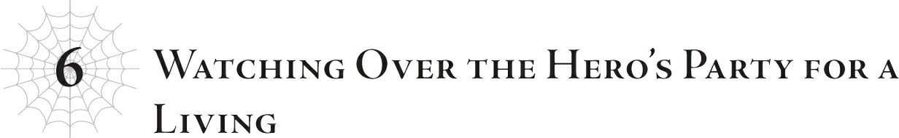

# Chương 6: Giám sát nhóm Anh hùng kiếm sống
*(Chapter 6: Watching Over the Hero’s Party for a Living)*

Sau khi hoàn thành xong các thí nghiệm hồi sinh với tam hoàng tử và đồng bọn, tôi chẳng còn việc gì để làm ở Vương quốc Analeit nữa.

Dĩ nhiên bên đó vẫn đang hỗn loạn tột cùng, nhưng đó đâu phải là vấn đề của tôi.

Đức vua đã băng hà, nhất hoàng tử thì vô dụng, tam hoàng tử thì bị nghi ngờ có liên quan đến vụ phản loạn, vân vân và mây mây.

Haizz, đúng là trò drama cung đình rắc rối.

Một cuộc chiến tranh đoạt vương vị không khoan nhượng đã bắt đầu!

Dù rằng chính tôi là kẻ đứng sau giật dây toàn bộ chuyện đó.

Giờ tôi chỉ cần Yamada bị cuốn vào đống bòng bong này nữa thôi.

Ít nhất đó từng là kế hoạch, nhưng giờ lại phát sinh một vấn đề mới.

Cô Oka đã tỉnh dậy và báo cho cậu ta biết rằng quân đội đế quốc, dẫn đầu bởi Natsume, đang tiến đánh làng Elf.

Hình như tộc Elf sở hữu một hệ thống Viễn Thoại nào đó để truyền tin, giống như Thần Ngôn Giáo vậy.

Chiến dịch thanh trừng tộc Elf trên toàn thế giới của chúng tôi vẫn đang tiến triển khá tốt, nhưng có vẻ vẫn còn sót lại kha khá mống.

Tốt nhất là phải đảm bảo quét sạch tận gốc từng tên một trước khi chúng tôi tấn công và phá hủy làng Elf.

Vì Quân đoàn 10 đã hoàn thành tất cả nhiệm vụ tại đế quốc và vương quốc, nên đó sẽ là công việc tiếp theo của họ.

Tôi cũng thấy hơi áy náy khi giao thêm việc cho họ ngay sau một thời kỳ bận rộn như vậy, nhưng chuyện này siêu cấp quan trọng nên họ bắt buộc phải chấp nhận thôi.

Bóc lột nhân viên ư?

Nào, môi trường quân đội vốn dĩ là thế mà... tôi khá chắc là vậy.

Hơn nữa, vốn dĩ tôi đã lên kế hoạch cử Quân đoàn 10 đi dọn dẹp nốt lũ Elf trước khi đống việc phát sinh tại đế quốc ập đến rồi. Nên thật ra, đây chỉ là quay lại với quỹ đạo công việc bình thường thôi.

Nói cách khác, tất cả là tại lão Giáo hoàng khiến họ bận rộn đến điên cuồng như bây giờ, chứ không phải tôi.

Tôi vô tội nhé.

Chưa kể, các bạn nghĩ ai mới là người phải đi lùng sục lũ Elf ở khắp các quốc gia rồi dịch chuyển các thành viên Quân đoàn 10 đến tận nơi hả?

Tôi mới là người bận rộn nhất ở đây này!

Cái nơi làm việc này đúng là bóc lột sức lao động quá đáng mà.

Tôi nên nộp đơn xin nghỉ phép có lương.

A, tôi có thể mường tượng ra cảnh Ma Vương cười toe toét và nói "không đời nào" rồi.

Chán ghê chưa.

Dù sao thì, quay lại chủ đề chính nào: Vì Yamada và những người bạn nghe được từ cô Oka rằng làng Elf đang gặp nguy hiểm, họ đã quyết định bỏ mặc vương quốc của mình để tự thân đi đối đầu với Natsume vì lý do nào đó.

Por qué? (Tại sao thế?)

Tôi hoàn toàn chẳng thể hiểu nổi.

Kiểu như, cái gì cơ? Ý tôi là...

Ừ thì, tôi cũng đoán được tại sao họ lại nghĩ ra như thế?

Nhân loại và ma tộc hiện đang có chiến tranh, và họ có lẽ nghĩ rằng sẽ rất nguy hiểm cho toàn bộ nhân loại nếu cứ để Natsume làm càn theo ý hắn.

Nhưng điều đó có thực sự đồng nghĩa với việc cậu nên bỏ mặc cái vương quốc đang sụp đổ ngay trước mắt để đi hạ bệ Natsume không?

Tôi cứ nghĩ tam hoàng tử, người đang ở lại vương quốc, sẽ muốn có Anh hùng Yamada thực sự chiến đấu bên phe mình chứ.

Biết đấy, vì anh ta có thể sẽ phải giao tranh với phe của nhất hoàng tử.

Ừ thì, nghe có vẻ hay ho khi nói rằng tam hoàng tử có tầm nhìn xa trông rộng, nhưng chẳng phải lúc này anh ta đang nhìn quá xa mà bỏ lỡ rắc rối ngay dưới mũi mình sao?

Vương quốc rất có thể sẽ kết thúc trong một cuộc nội chiến tàn khốc...

Nhưng tôi đoán Yamada chẳng mảy may nghĩ đến những điều đó khi anh trai cậu ta tiễn cậu ta đi.

Khi tam hoàng tử mở lời nhờ vả, cậu ta lập tức đồng ý kiểu: "Dĩ nhiên rồi ạ".

Cậu ta chắc chỉ phản xạ theo kiểu mình không thể để Natsume nhởn nhơ làm loạn hay gì đó, chứ chẳng thèm suy nghĩ về tình hình của chính vương quốc mình.

Tôi thà để Yamada ở lại vương quốc hơn, nhưng giờ thì có vẻ như họ định gửi thẳng cậu ta đến làng Elf luôn rồi...

Chắc sẽ rất kỳ quặc nếu chỉ một mình Hyrince đứng ra phản đối.

Quả nhiên, Hyrince giữ im lặng, và quyết định được thông qua với sự đồng thuận tuyệt đối: Yamada sẽ đi đến làng Elf.

Chết tiệt thật chứ.

Được rồi, nhưng đằng nào cậu ta cũng chẳng đời nào đến được làng Elf trước quân đội đế quốc đâu... hoặc tôi đã ngốc nghếch nghĩ như thế.

Nhưng ý tôi là, thôi nào! Tôi đã đề phòng chuyện này có thể xảy ra, nên đã chuẩn bị trước một số thứ để đảm bảo họ không thể đi từ Daztrudia sang Kasanagara, lục địa nơi làng Elf tọa lạc.

Tất nhiên là có sự trợ giúp từ Thần Ngôn Giáo rồi!

Bất cứ khi nào gặp rắc rối, cứ gọi cho Giáo hội.

Sẽ rất có lợi khi bạn thực sự liên lạc được với gã đứng đầu có thể hồi đáp những lời cầu nguyện của bạn.

Tuy nhiên, cũng không hẳn là tôi đã làm gì đao to búa lớn.

Tôi chỉ bảo họ phao tin về cuộc phản loạn ở Vương quốc Analeit và treo thưởng truy nã nhóm Yamada.

Vì trên danh nghĩa chính thức, những gì xảy ra ở Vương quốc Analeit là Yamada đã sát hại đức vua và âm mưu cướp ngôi.

Biến bọn họ thành tội phạm bị truy nã sẽ nhanh chóng và hiệu quả hơn là đi khắp nơi dặn dò mọi người không cho họ sử dụng các cổng dịch chuyển này nọ.

Cổng dịch chuyển vốn là cách nhanh nhất để đi từ lục địa này sang lục địa khác.

Đó cũng là lý do tại sao chúng tôi phá hủy cổng dịch chuyển ở Vương quốc Analeit, nhằm ngăn cậu ta sử dụng nó trong trường hợp đi được đến bước đó.

Giờ đây khi đã nằm trong danh sách truy nã, nhóm Yamada sẽ khó di chuyển hơn nhiều.

Tất nhiên, lực lượng an ninh không có ảnh hay gì cả, nghĩa là người bình thường sẽ không biết mặt mũi họ ra sao. Dù vậy, tôi hình dung lính gác địa phương và những người tương tự vẫn sẽ dòm ngó canh chừng bọn họ.

Thế nhưng lũ khốn đó lại cưỡi trên lưng Shinohara, người đã tiến hóa thành một quang phi long.

Quang phi long ư?

Nói đúng hơn là phi long bay vèo vèo thì có!

...Xin lỗi, xin hãy tha thứ cho sự tồn tại của tôi. Trò đùa nhạt nhẽo quá. Tôi hối hận lắm rồi.

Ngay cả trong trò chơi điện tử, phương tiện bay cũng là thứ bạn chỉ nhận được ở giai đoạn cuối game vì chúng giúp việc di chuyển trở nên siêu dễ dàng.

Bạn chẳng cần lo lắng về đường sá này nọ, và có thể bay vượt qua mọi chướng ngại vật như những ngọn núi.

Trong cái thế giới đầy rẫy quái vật này, hầu hết các con đường đều phải đi vòng vèo để tránh các khu vực tập trung nhiều quái vật, đồng nghĩa với việc tốn nhiều thời gian hơn để đi đến bất cứ đâu.

Nhưng nếu có thể phớt lờ chuyện đó và bay qua tất cả mọi thứ, bạn sẽ đến nơi nhanh hơn rất nhiều.

Về cơ bản, họ đang đi con đường ngắn nhất có thể.

Điều này cũng có nghĩa là họ không cần phải dừng chân tại nhiều thị trấn và làng mạc, từ đó giảm thiểu nguy cơ bị phát hiện.

Họ chắc chắn chưa bị bắt một lần nào.

Đây quả là tin xấu rồi, thưa quý vị.

Các tính toán của tôi đều dựa trên việc họ đi bộ, nhưng với tốc độ di chuyển bằng đường hàng không thế này, có khi họ sẽ đến kịp thật sao?

...Không, không, dĩ nhiên là không đời nào!

Ý tôi là, các bạn có biết họ đang hướng tới đâu không? Mê! Cung! Lớn! Elroe!

Rõ ràng là họ không thể bay lượn bên trong mê cung, nên chắc chắn họ sẽ phải đi chậm lại.

Thêm vào đó, Mê cung Lớn Elroe lại cực kỳ rộng lớn và phức tạp nữa.

Nếu bị lạc đường, việc tìm lối ra gần như là bất khả thi.

Ở đó thậm chí còn có cả nghề hướng dẫn viên mê cung.

Chúng tôi đã bố trí binh lính canh giữ lối vào Mê cung Lớn Elroe rồi.

Và tôi cũng đảm bảo rằng tất cả các hướng dẫn viên mê cung đều biết về vụ việc xảy ra ở Vương quốc Analeit cũng như lệnh truy nã nhóm Yamada.

Nên họ sẽ không thể nào tìm được người dẫn đường.

Cố gắng băng qua Mê cung Lớn Elroe mà không có người dẫn đường chẳng khác nào tự sát.

Tôi phải biết rõ điều đó chứ, vì tôi đã sống ở đó rất lâu mà.

Chắc chắn là vậy rồi.

Nếu không thì họ sẽ làm gì, bay qua đại dương sao?

Tôi nghĩ thế thì cũng là tự sát mà thôi.

Đại dương ngoài kia đầy rẫy Thủy Long.

Giờ đây khi Shinohara đã tiến hóa thành quang phi long, tôi chắc chắn cô nàng có thể cân được một hai con Thủy Long, nhưng tôi nghi ngờ việc cô nàng có thể chống đỡ chúng không ngừng nghỉ trong khi vẫn phải chở mọi người bay đường dài.

Bạn sẽ phải bay cả ngày lẫn đêm mà không biết khi nào một con rồng sẽ bắn tia sáng hay phun nước vào mình từ dưới đại dương, biết chứ?

Cô nàng không có đủ thể lực lẫn tinh thần cho việc đó đâu.

Nghĩa là cuộc phiêu lưu của nhóm Yamada sẽ kết thúc tại đây...

Biết đấy, vì con đường nào cũng dẫn tới tự sát cả mà.

Tôi chắc chắn Hyrince sẽ ngăn họ lại nếu họ cố làm điều gì ngớ ngẩn như vậy.

Hy vọng là họ sẽ chỉ giết thời gian ở Daztrudia từ giờ trở đi.

...Hoặc tôi đã nghĩ thế, như một kẻ ngốc.

Một trong các phân thân của tôi hiện đang bí mật bám theo nhóm Yamada.

Đoán xem họ đang ở đâu nào? Ngay trong Mê cung Lớn Elroe đấy.

Thôi nào, tại sao chứ?!

Họ đã tìm được một người dẫn đường mê cung với sự dễ dàng đến ngỡ ngàng, hoàn toàn phớt lờ lối ra chính đang được canh phòng nghiêm ngặt bởi đế quốc, và thản nhiên đi vào thông qua một lối vào bí mật dưới đáy đại dương.

Cho tôi xin đi!

Người dẫn đường mà nhóm Yamada tìm được là một lão già tóc bạc phong trần tên là Basgath.

Nhìn lão trông hơi quen quen nhỉ?

À, hóa ra lão chính là con người đầu tiên phát hiện ra tôi khi tôi còn là một bé nhện nhỏ nhắn.

Vì lý do nào đó, lão ta lại đang ba hoa bốc phét với họ về việc lão đã trốn thoát khỏi tôi ngày xưa như thế nào.

Và lão hướng dẫn viên mê cung già với cái tên nghe đầy mùi cháy nổ này hóa ra lại là cha của người từng dẫn đường cho Hyrince ngày trước, đó là lý do vì sao lần này lão đồng ý dẫn đường cho nhóm Yamada.

Ừm, alo? Hyrince ơi?

Giờ họ có một người dẫn đường siêu đẳng nhờ ơn của anh đấy!

Anh định tính sao đây hả?!

Mà lão già này thực sự rất giỏi nhé.

Thỉnh thoảng tôi vẫn ghé qua Mê cung Lớn Elroe để thăm lũ nhện con của mình, và tôi phải thừa nhận là nhân tiện tôi cũng tranh thủ rình mò lũ người ở trong đó luôn.

Nếu có một điều tôi rút ra được trong quá trình này, thì đó là hướng dẫn viên cũng có dăm bảy loại.

Ngay cả những người dẫn đường giàu kinh nghiệm đôi khi cũng bị nhầm đường, biết chứ?

Thế mà lão già này lại đang dẫn đường một cách điêu luyện qua mê cung mà không cần thèm liếc nhìn bản đồ lấy một cái. Chỉ có những người dẫn đường xuất chúng nhất mới làm được như thế.

Lão này đúng là một cựu binh dày dạn kinh nghiệm, y hệt vẻ bề ngoài của mình.

Thế là chuyến hành trình của nhóm Yamada giờ đang diễn ra quá đỗi suôn sẻ.

Chỉ số của họ cũng tương đối cao, giúp cho tốc độ di chuyển càng nhanh hơn nữa.

Thế này thì thực sự, thực sự rất tệ!

Cứ đà này, họ sẽ băng qua Mê cung Lớn Elroe khi vẫn còn thừa mứa thời gian.

Cách duy nhất để vào làng Elf là sử dụng một trong những cổng dịch chuyển bí mật của bọn chúng, nhưng nếu họ sử dụng cái cổng gần nhất với lối ra Mê cung Lớn Elroe mà tôi biết, họ sẽ đến đó trước cả thời điểm quân đội đế quốc dự kiến đặt chân tới.

Ồ, nhân tiện thì, tôi khá chắc là mình biết tất cả các cổng dịch chuyển của tộc Elf.

Các phân thân tí hon của tôi là đỉnh nhất trong khoản thu thập tin tức mà!

Ý tôi là, chúng là những con nhện có kích thước bằng lòng bàn tay, rất khó bị phát hiện. Trừ phi bạn đặc biệt để mắt kỹ lưỡng, bằng không thì cực kỳ khó thấy chúng.

Và tôi đã rải hàng ngàn con như thế khắp thế giới, tạo nên mạng lưới thông tin siêu mạnh mẽ của riêng mình.

Dù sao thì, tôi luôn đặc biệt chú ý đến tộc Elf, nên việc định vị các cổng dịch chuyển của chúng rất dễ dàng, chỉ bằng cách cử các phân thân gián điệp bám đuôi những tên lén lút.

Dẫu sao thì thỉnh thoảng chúng vẫn phải ra ra vào vào mà.

Nên tôi nghĩ ít nhất là mình biết tất cả các cổng dịch chuyển đã được sử dụng kể từ khi tôi phái các phân thân đi.

Dù nếu có cái nào lâu rồi không dùng đến, tôi cũng chịu chẳng cách nào tìm ra.

Hì. Tui Elf chắc đang nghĩ chúng tôi không biết các cổng dịch chuyển của chúng ở đâu.

Hô hô hô. Lũ ngốc.

Chúng hẳn đang chế giễu chúng tôi, nghĩ chúng tôi là lũ ngu ngốc chẳng biết cái gì, nhưng giờ chúng sắp sửa được nếm mùi gậy ông đập lưng ông rồi.

Phụt. Hahaha!

Thôi được rồi, đây không phải lúc để cười nhạo tộc Elf.

Tôi nên làm gì với nhóm Yamada đây?

Cứ đà này, nếu mọi chuyện tiếp tục suôn sẻ, họ sẽ đến làng Elf đúng giờ.

Hừm.

Có nên thả lũ nhện con xua quân tấn công họ không?

Tôi đang nói về lũ nhện trắng do các Phân thân Tư duy cũ của tôi tạo ra.

Về cơ bản, họ đã sử dụng kỹ năng [Đẻ Trứng] để sản xuất hàng loạt lũ nhện con.

...Có điều họ thế nào lại cùng các Phân thân Tư duy đi tấn công một thị trấn loài người, và kết cục là tôi phải dịch chuyển những con sống sót trở lại Mê cung Lớn Elroe này.

Kể từ đó, bọn chúng có vẻ tự sinh tự tại hoạt động trong Mê cung.

Sau khi thần hóa, tôi có ghé qua chào một tiếng, thế là bọn chúng bám dính lấy tôi siêu cấp nhiệt tình luôn.

Tôi đoán bọn chúng vẫn nhận ra tôi là phụ huynh ngay cả sau khi tôi đã trở thành thần.

Mặc dù về mặt kỹ thuật, chính các Phân thân Tư duy của tôi đã tạo ra chúng chứ không phải tôi...

Dù sao thì, theo những gì tôi nghe được, người ta gọi lũ nhện con này là Tàn tích của Cơn Ác Mộng.

Ồ, còn tôi thì được gọi là Cơn Ác Mộng của Mê cung.

Vì chúng là những quái vật nhện xuất hiện sau khi Cơn Ác Mộng biến mất, nên người ta tự mặc định là có mối liên hệ nào đó ở đây.

Cũng hợp lý thôi, vì đúng là thế thật mà.

Có lẽ mình nên phái lũ nhện con đi theo nhóm Yamada để câu giờ... Khoan đã... có lẽ không nên. Nhóm Yamada chắc chắn sẽ bị giết sạch mất.

Ngay cả khi chỉ có một con nhện con trong số đó thôi cũng đã suýt hạ gục cựu Anh hùng Julius rồi...

Mà Yamada cũng chẳng mạnh hơn Julius ngày trước bao nhiêu, nên nếu phải chiến đấu với cả một đàn nhện như thế, tổ đội của cậu ta chắc chắn sẽ bị xóa sổ.

Tôi thực sự nghĩ chỉ số của Yamada có lẽ cao hơn Julius trước đây, nhưng cậu ta lại có quá ít kinh nghiệm chiến đấu thực tế.

Tinh thần và lòng quyết tâm cũng không vững vàng bằng.

Nên trên thực tế, giỏi lắm cậu ta chỉ mạnh ngang Anh hùng Julius, hoặc có khi còn yếu hơn.

Dù sao thì Julius cũng từng đánh bại được một phân thân của Taratect Nữ Vương cơ mà.

Mặc dù nói là vậy, nhưng với trình độ sức mạnh của anh ta, về mặt lý thuyết đáng lẽ anh ta không thể thắng nổi con đó... thế mà anh ta vẫn làm được.

Sức mạnh tiềm ẩn của Anh hùng thật đáng sợ.

Và vì Yamada sở hữu kỹ năng Thần bảo hộ điên rồ kia cộng thêm danh hiệu Anh hùng, tôi phải cực kỳ cẩn trọng.

Hừm. Hừmmmm.

Nghiêm túc đấy, tôi nên làm thế nào đây?

Khá là khó để cản đường nhóm Yamada mà không vô tình giết chết bọn họ.

Chúng tôi phải làm thế nào để trì hoãn họ mà vẫn giữ mạng cho tất cả, hiểu chứ?

Giết phắt bọn họ đi thì đơn giản hơn nhiều.

Nhưng tôi sẽ không làm thế, dĩ nhiên là vì có cô Oka đi cùng rồi.

Dù vậy, kể cả chúng tôi có làm họ bị thương nhẹ, chỉ cần một chút Ma pháp Trị liệu là xong ngay, rồi đâu lại vào đấy.

Chuyện đó thậm chí chẳng làm họ chậm đi tí nào.

Hay là trực tiếp dịch chuyển họ về lại vương quốc luôn nhỉ?

...Không ổn, thế không được.

Tôi không có đủ tay chân rảnh rỗi.

Nói thật, hiện tại tôi bận muốn điên đầu nên chẳng có thời gian để trực tiếp đi chọc phá nhóm Yamada.

Cách tốt nhất tôi có thể làm là phái kẻ khác đi quấy nhiễu, nhưng lựa chọn duy nhất của tôi trong Mê cung Lớn Elroe là lũ nhện con.

Mà nếu tôi ra lệnh cho lũ nhện nhóc ác đó, tôi hoàn toàn có thể tưởng tượng ra cảnh bọn chúng phấn khích quá đà rồi làm quá tay.

Ngay cả lần một con trong số chúng tấn công Anh hùng Julius, đó cũng là vì bọn chúng biết được tôi có kế hoạch tiêu diệt anh ta trong cuộc chiến, thế là chúng muốn giải quyết hộ tôi trước thời hạn.

Nếu tôi bảo bọn chúng làm chậm nhóm Yamada lại, tôi có thể mường tượng ra cảnh bọn chúng làm chuyện gì đó cực kỳ kinh dị như chặt chân họ chẳng hạn.

Hoặc tệ hơn là quá trớn rồi giết sạch luôn.

Nếu chúng giết bất cứ ai ngoại trừ Yamada, cậu ta vẫn có thể hồi sinh họ, nhưng trăm phần trăm chuyện đó vẫn quá nguy hiểm. Tốt nhất là không nên liều mạng.

Thật lòng thì, tôi quá bận để tâm đến chuyện này lúc này. Đằng nào cũng không thể tác động nhiều đến bọn họ, nên có lẽ tốt nhất là tôi cứ mặc kệ, không can thiệp vào nữa.

Nói thẳng ra là tôi không có thời gian để lãng phí cho họ.

Đến việc giám sát bọn họ như thế này đã là giới hạn tối đa của tôi rồi.

Dù vậy, tôi phải thừa nhận rằng xem họ diễn trò thực ra khá là vui nhộn.

Vui ở điểm nào á?

Ồ, biết mà. Đủ thứ chuyện trên đời luôn.

Tôi không bao giờ chán, chắc chắn là vậy.

Lúc nào tôi đang xem họ cũng đâm đầu vào hết tình huống dở khóc dở cười này đến tình huống điên rồ khác.

Chẳng hạn như vụ Shinohara biến thành người.

Hoặc vụ hóa ra cô nàng hoàn toàn không biết bơi.

Trời ạ, cái kỹ năng Nhân hóa đó quả là một cú sốc lớn.

Tôi đã phải trải qua bao nhiêu khó khăn gian khổ để tiến hóa thành arachne, thế mà cô nàng lại có thể hóa thành người dễ như bỡn!

Ngay cả sau khi đã tiến hóa thành arachne, tôi vẫn phải trở thành một vị thần chết tiệt thì mới có được hình dạng con người hoàn chỉnh, biết không hả!

Và trong danh sách kỹ năng tùy chọn của tôi cũng chẳng có kỹ năng Nhân hóa nào cả!

Thật không công bằng chút nào khi loài rồng mặc định có khả năng đó!

Nếu quái vật rồng có, thì nhện cũng phải có chứ!

Nhưng thôi kệ đi. Sao cũng được.

Đặc biệt là sau tất cả những chuyện đó, mọi người phát hiện ra Shinohara không biết bơi, chuyện này hẳn phải vô cùng ngượng ngùng đối với cô nàng.

Xùy. Tôi không thể tin nổi kẻ bắt nạt kiêu ngạo đó lại không biết bơi.

Các bạn nghĩ tôi có thể nhìn cảnh đó mà nhịn cười được sao?

Không, không đời nào!

Á ha ha ha ha!

Tôi không thể kiềm chế nổi việc hả hê trước sự chật vật của cô nàng, có lẽ vì tôi vẫn còn giữ những ký ức bị cô nàng bắt nạt.

Mặc dù người thực sự bị bắt nạt là Wakaba Hiiro thật, hay còn gọi là D.

Mà tôi đoán dưới góc nhìn của D, chuyện đó chắc chỉ giống như bị một con cún con vô hại sủa vào mặt mà thôi.

Nhưng vì những ký ức này mang lại cảm giác khó chịu cho tôi, nên tôi đoán D cũng chẳng thấy dễ chịu gì.

Tôi đoán thế.

Dù sao thì, sau đó cô nàng Shinohara không biết bơi tội nghiệp đã bị một con Thủy Long đuổi theo dưới nước, chỉ biết đập nước toán loạn như một kẻ ngốc.

A, cảnh đó vui ghê cơ.

Rồi đòn phun thở của con rồng hất tung cô nàng lên, làm hỏng cả đồ bơi của cô nàng, và thế là Yamada được khuyến mãi một màn fanservice nhẹ nhàng, toàn bộ chuyện đó quả thực siêu buồn cười.

Shinohara có vẻ không thực sự coi Yamada là một người đàn ông, nhưng vì cô nàng bị ép chặt vào người cậu ta trong bộ dạng thiếu đoan trang như thế, dĩ nhiên cậu ta cũng phải liếc nhìn một chút rồi.

Cái gì thế này, phim hài tình cảm à?

Rõ ràng là sau chuyện này sẽ còn hàng tá khoảnh khắc lãng mạn tình cờ khác, và rồi cô nàng chắc chắn sẽ đổ Yamada đứ đừ cho xem...

Rồi nó sẽ phát triển thành một mối tình tay ba, và bùm, chúng ta sẽ có một bộ phim truyền hình dài tập kịch tính! Trời đất, Yamada sẽ bị đâm chết hay một trong các cô gái kia sẽ ra tay đây? Hóng ghê nha.

Khoan, chờ chút.

Xét theo hiệu ứng của kỹ năng Thần bảo hộ của Yamada, chẳng phải nhiều khả năng mọi chuyện sẽ giữ nguyên ở tuyến hài tình cảm rồi bằng cách nào đó tiến tới cái kết harem sao?

Thật là một kỹ năng tai tiếng! Tôi quyết không thèm ghen tị đâu nhé!

Nếu mọi cô gái gia nhập phe Yamada đều kết thúc bằng việc đem lòng yêu cậu ta, thì cái kỹ năng đó còn đáng sợ hơn tôi tưởng!

Và có vẻ như tỷ lệ cao các cô nàng đã đổ rầm rầm rồi.

Ví dụ như em gái cậu ta đúng không? Rồi Hasebe? Và cả Ooshima nữa?

Shinohara thì chưa đến mức đó, và tôi không nghĩ cô Oka lại có cảm xúc kiểu như vậy.

Tôi cũng không thực sự nghĩ cô nàng hầu gái nửa Elf trước đây của cậu ta, Anna, lại yêu cậu ta.

Nó giống lòng trung thành hơn là tình yêu, nếu phải mô tả?

Mặc dù tôi đoán các bạn có thể lập luận rằng lời thề trung thành có mối liên hệ khá chặt chẽ với một lời tuyên bố tình yêu.

Chỉ là sắc thái biểu đạt hơi khác một chút mà thôi.

...Hử?

Tôi chỉ đùa thôi, nhưng có phải do tôi hoang tưởng hay thực sự Yamada đang sở hữu một hậu cung vây quanh thế kia?

Dù chuyện đó hiện đang phải tạm hoãn nhờ công của Natsume.

...Tôi tự hỏi bao nhiêu phần trong số này là do tác động của kỹ năng Thần bảo hộ nhỉ?

Nếu họ đổ Yamada vì phẩm hạnh cá nhân của cậu ta thì không nói làm gì, chứ nếu chỉ vì một cái kỹ năng thì quả thực hơi sai trái đấy.

Thế đấy, đó là lý do vì sao rất khó lên kế hoạch đối phó với một kỹ năng khi không biết rõ tác dụng chính xác của nó.

Nhỡ đâu cái khoảnh khắc hưởng sái may mắn khi họ bị con Thủy Long thổi bay kia cũng là nhờ Thần bảo hộ thì sao?

Nhưng nếu đúng là vậy, chẳng phải đồng nghĩa với việc sâu trong thâm tâm, Yamada đang thầm mong đợi những sự kiện như thế xảy ra sao...?

Th-thì, cậu ta đang ở độ tuổi đó mà, tôi đoán thế...

Nói vui vậy thôi chứ theo dõi chuyến phiêu lưu của nhóm Yamada thực sự mang lại cảm giác khá là ấm lòng.

Tôi đoán có thể nói là chẳng có chút màu sắc bi kịch nào trong đó cả.

Dạo gần đây, những người tôi tiếp xúc dường như ai cũng mang một nỗi tuyệt vọng nhất định vì một quá khứ bi thảm nào đó, biết đấy?

Có những kẻ đang cố gắng đấu tranh chống lại số phận nghiệt ngã của ma tộc, như Agner, Balto, Warkis...

Chưa kể đến lão Giáo hoàng, người đã sáng lập cả một tôn giáo chỉ để bảo vệ nhân loại và làm việc cật lực gần như là vĩnh viễn.

Thêm nữa là Black, người về cơ bản đang bị kẹt giữa muôn vàn khó khăn rắc rối.

Và dĩ nhiên là cả Ma Vương, người đã đứng lên để cứu lấy Nữ thần.

Từng người trong số họ đều bị dồn đến tận cùng của sự tuyệt vọng, thế nhưng họ vẫn tiếp tục phản kháng mà không bao giờ bỏ cuộc.

Nhìn họ mà thấy xót xa.

Nhưng Yamada và những người bạn thì không có bầu không khí bi kịch đó.

Dĩ nhiên họ cũng đã trải qua nhiều chuyện, và cũng chẳng phải họ đang xem nhẹ chuyện này.

Nhưng dù vậy, họ vẫn như đang thiếu đi thứ gì đó.

Sự quyết tâm.

Tôi đoán có lẽ là vì họ vẫn chưa rơi vào những hoàn cảnh thực sự thử thách sự quyết tâm của bản thân.

Anh hùng Julius chọn con đường của riêng mình phần lớn là vì lòng quyết tâm của anh ta liên tục bị thách thức.

Nhưng vì nhóm này vẫn chưa trải nghiệm thứ mà tôi gọi là nỗi đau thực sự, nên trông họ vẫn chưa thực sự vững vàng.

Mặc dù tôi đoán chắc chẳng ai muốn làm quen với một thế giới bạo lực chém giết như thế này đâu.

Nhưng đây chính là thế giới mà Anh hùng Julius muốn bảo vệ.

Vì vậy, mặc dù tôi chắc chắn những người này hoàn toàn nghiêm túc, tôi vẫn không thể không cảm thấy có chút ấm áp và nhẹ lòng khi giám sát họ.

Xem những người như Agner chỉ tổ thêm căng thẳng, và cuối cùng tôi lại phải tự mình tiễn ông ta vào chỗ chết, nên chuyện đó cũng chẳng giúp ích gì.

...Nhưng nếu Yamada và đồng bọn thực sự tới được làng Elf, họ chắc chắn sẽ bị cuốn vào cơn bão sắp đổ bộ.

Tôi nghi ngờ lúc đó mọi chuyện sẽ còn ấm lòng đối với họ nữa.

Bởi vì nếu họ can dự vào trận chiến ở làng Elf, họ sẽ nhận ra thế giới này thực sự tồi tệ đến nhường nào.

Tôi thực sự đã hy vọng họ cứ ngồi yên ngoan ngoãn cho đến khi mọi chuyện kết thúc, mà không cần phải biết đến bất kỳ điều gì trong số đó.

Nhưng nếu chuyến đi của họ diễn ra suôn sẻ thế này, điều đó chứng tỏ đây mới là thứ bản thân Yamada thực sự mong muốn.

Đến lúc này, tôi chắc chắn phải nghi ngờ rằng kỹ năng Thần bảo hộ đang phát huy tác dụng ở đây.

Và nếu đó là những gì Yamada muốn, nếu họ sẽ đến được đó bất kể thứ gì đang chờ đợi phía trước, thì họ sẽ phải tự gánh chịu bất kỳ kết cục nào xảy ra ở đó.

Ngay cả khi đó là thứ đi ngược lại với nguyện vọng của cậu ta.

Thế đấy, vừa có tiếng cười, vài giọt nước mắt, lại thêm chút lải nhải sến sẩm đến mức tôi muốn tự cười nhạo mình vì đã để cảm xúc trồi sụt như đi tàu lượn siêu tốc vậy, nhưng tóm lại là: Đúng thế, tôi vẫn đang theo dõi Yamada và những người bạn.

Có vẻ Hyrince cũng không muốn họ đến làng Elf quá nhanh, vì anh ta hình như đã tự mình bày ra một chướng ngại vật.

Ngay khi nhóm Yamada đặt chân vào Mê cung Lớn Elroe, một thứ điên rồ nhất đã xuất hiện.

Cụ thể là một con Địa Long.

Nó là một con mới tiến hóa, yếu đến mức thậm chí không thể so sánh với Araba.

Tôi đoán anh ta đã để một con phi long ở Tầng Trên nhanh chóng tàn sát một đống quái vật trên đó để nó có thể lên cấp và tiến hóa.

Trời ạ, đúng là phá hoại cả hệ sinh thái. Lại nữa rồi.

Tôi trợn tròn mắt ngán ngẩm nhìn nhóm Yamada chiến đấu.

Rồng thì vẫn là rồng, dù có là một con rồng tương đối yếu đi nữa.

Chỉ số và kỹ năng của nó vượt xa bất kỳ con quái vật thông thường nào.

Ngay cả Julius cũng chưa từng đánh bại một con rồng. (Mặc dù tôi cá là anh ta có thể đối đầu với một con hạ cấp rồng nếu bắt gặp.)

Nhưng đối với đám Yamada, sinh vật này chắc chắn là con quái vật mạnh nhất mà họ từng đối mặt từ trước đến nay.

Nhân tiện, nếu không xét đến các phân loại kiểu như quái vật này nọ, đối thủ mạnh nhất mà Yamada từng đối đầu chính là Vampy nhà chúng tôi.

Cô nàng thừa sức đánh bại một con Địa Long như thế mà không cần tốn một giọt mồ hôi.

Nói cách khác, nếu họ thậm chí không thể hạ nổi một con Địa Long sơ sinh như thế này, họ chắc chắn sẽ không có cửa đấu với Vampy.

Dù vậy, chỉ số của Yamada đủ cao để cậu ta có lẽ không thua cuộc, cho dù có thể phải chật vật một chút.

Hơn nữa, cậu ta đâu có đơn độc—cậu ta còn có những đồng minh như Shinohara.

Giờ đây khi đã tiến hóa thành quang phi long, chỉ số của Shinohara thậm chí còn cao hơn cả Yamada.

Chỉ số của quái vật dường như tăng nhanh hơn con người, giống hệt tôi ngày xưa vậy.

Mặc dù về mặt kỹ thuật cô nàng vẫn chỉ là phi long, nhưng vẻ ngoài và chỉ số của Shinohara có vẻ đã ngang ngửa với một con rồng thực thụ.

Thấy chưa? Ngay vừa rồi, cô nàng đã đấm con Địa Long bay vèo đi kìa.

Hãy tưởng tượng một con rồng bị một cô bé đấm thẳng vào mặt và ngã chổng vó...

Ý tôi là, các bạn có thể trách tôi khi nghĩ cảnh đó trông hơi thảm hại không?

Có vẻ tôi không phải là người duy nhất thấy chuyện đó thật đáng xấu hổ: Bản thân con Địa Long đang giận sôi máu và lao vào Shinohara trong cơn thịnh nộ.

Nhưng Shinohara dễ dàng đỡ được cú cào vuốt của nó.

Niềm kiêu hãnh của Địa Long xem như vứt đi...

Sau đó, họ sử dụng loại ma pháp bão lửa nào đó để kìm chân con Địa Long, và Yamada tung ra đòn kết liễu. Cứ thế, con Địa Long đã chầu trời.

Vĩnh biệt nhé, niềm kiêu hãnh ngọt ngào...

Ồ. Đừng nói đến việc làm họ chậm lại, chẳng phải về cơ bản anh vừa dâng tặng cho Yamada một đống điểm kinh nghiệm cùng danh hiệu Kẻ diệt Rồng trên đĩa bạc sao?

A, có khi đó mới là điều Hyrince thực sự nhắm tới ngay từ đầu.

Kiểu như, nếu thấy không thể ngăn cản được cậu ta, thì thà giúp cậu ta mạnh lên một chút còn hơn?

Hừm. Thì, hiện tại chẳng cách nào biết được Hyrince thực sự đang nghĩ gì, nhưng chuyện này hoàn toàn có lợi cho Yamada.

Lại là kỹ năng Thần bảo hộ phát huy tác dụng chăng...?

Đến nước này, tôi thực sự bị cám dỗ để đổ hết mọi sự may mắn mà Yamada gặp phải cho cái kỹ năng Thần bảo hộ kia.

Khoan đã, cái gì thế kia?

“Anh hùng?”

Một con nhện con nhà tôi đang bất ngờ làm khách mời danh dự, bắt chuyện với đám Yamada qua [Truyền tin bằng Thần giao cách cảm].

Hả? Lũ nhóc các người đang làm gì ở đó thế?

Ừm, chờ chút coi, tôi không muốn các người làm chuyện gì kỳ quặc đâu đấy...

Tệ thật. Hiện tại tay tôi đang bận làm việc khác, nên nếu đội quân nhện con quyết định tấn công nhóm Yamada, tôi không thể ngăn chúng lại được.

Phải làm sao đây?!

“Anh hùng.” “Kẻ thống trị?”

“Kẻ thống trị.” “Kẻ thống trị.” “Kẻ thống trị.” “Kẻ thống trị.” “Kẻ thống trị.” “Kẻ thống trị.”

Ôi trời ơi, một bầy nhện con lúc nhúc đang bu quanh họ kìa!

“Không thể Giám định?”

“Không thể Giám định.” “Không thể Giám định.” “Không thể Giám định.” “Không thể Giám định.” “Không thể Giám định.” “Không thể Giám định.”

“Kẻ thống trị?”

“Kẻ thống trị.” “Kẻ thống trị.” “Kẻ thống trị.” “Kẻ thống trị.” “Kẻ thống trị.” “Kẻ thống trị.”

“Người tái sinh?”

“Người tái sinh.” “Người tái sinh.” “Người tái sinh.” “Người tái sinh.” “Người tái sinh.” “Người tái sinh.”

“Nhưng họ yếu xìu à?”

“Yếu.” “Yếu.” “Yếu.” “Yếu.” “Yếu.” “Yếu.”

“Yếu. Yếu.” “Yếu. Yếu.” “Yếu. Yếu.” “Yếu. Yếu.” “Yếu. Yếu.” “Yếu. Yếu.”

Này này! Không phải cứ thấy họ yếu là các người được phép tấn công đâu nhé!

“Các ngươi biết về người tái sinh sao?!”

Lại là Yamada nữa.

Cái tên này hoàn toàn không biết sợ hay sao thế?!

Tôi không thể tin nổi cậu ta lại đang thực sự trò chuyện với đội quân nhện con.

Cậu ta không lo chúng sẽ lao vào cắn xé mình à?

“Biết chứ.” “Biết chứ.” “Dĩ nhiên là biết.”

“Tại sao các ngươi lại biết?”

Phù. Ít nhất thì có vẻ bọn chúng không định lao vào vồ cậu ta ngay lập tức.

“Chủ nhân.” “Chủ nhân.”

“Mẹ.” “Mẹ.”

Được rồi, các người đang nói về tôi đấy phỏng?

“Vị ‘Chủ nhân’ đó cũng là người tái sinh sao?”

“Rồi sẽ biết thôi.” “Sắp sửa được biết thôi.” “Sắp biết thôi.” “Sắp được biết.”

Ừ, tôi đoán điều đó đúng đấy.

Nếu Yamada và đồng bọn thực sự tới được làng Elf, chúng tôi có lẽ sẽ gặp mặt trực tiếp thôi.

“Ý các ngươi là sao?”

“Tuyên cáo.” “Công bố.”

“Sự khởi đầu của kết thúc.”

“Thế giới bắt đầu.”

“Thế giới lụi tàn.”

“Xin hãy đợi đã! Thế nghĩa a sao?!”

Phải đấy, nghiêm túc thì thế nghĩa là sao chứ?!

Lũ nhóc này có thực sự hiểu mình đang nói cái gì không vậy?

Không phải bọn chúng chỉ đang cố nói mấy câu tỏ vẻ ngầu lòi và bí hiểm một cách vô cớ đấy chứ?

“Không cần biết đâu.”

“Đằng nào các người cũng chết thôi.”

“Tất cả sẽ phải chết.”

“Cứ ráng mà giãy giụa để sống sót đi.”

Nói xong, lũ nhện con biến mất, bỏ lại Yamada và tổ đội của cậu ta ngơ ngác.

Haizz, giờ sao nữa đây...?

Có vẻ như con cái tôi đang trải qua giai đoạn dậy thì ẩm ương thích tỏ vẻ ngầu lòi thì phải...

Giờ đây khi đã rời khỏi tầm mắt của nhóm Yamada, bọn chúng đang nhảy nhót tưng bừng trông vô cùng đắc ý, kiểu như "Chúng ta làm tốt lắm!".

Tôi đã dạy dỗ sai lầm ở chỗ nào để các người ra nông nỗi này hả?

...Thôi thì, bọn chúng không tấn công cậu ta, nên tôi đoán thế cũng tạm ổn.

Bọn chúng chỉ bắn ra vài câu nhảm nhí bí hiểm không cần thiết và làm nhóm Yamada sợ khiếp vía... Rốt cuộc chúng muốn đạt được cái gì thế nhỉ?

Tôi hoàn toàn chịu không biết chúng đang nghĩ gì, mặc dù về cơ bản chúng chính là con cháu của tôi.

Đó là một lời cảnh báo hay gì chăng?

Chịu thôi, tôi không nghĩ chuyện đó sẽ giúp ích gì đâu.

Đến nước này, có vẻ như những gì Yamada và đám bạn của cậu ta cố gắng làm cũng chẳng còn ý nghĩa gì nữa. Họ đã lún quá sâu vào chuyện vượt tầm kiểm soát của mình rồi.

Theo một góc nhìn nào đó, tôi đoán lũ nhện con có thể đã thành công trong việc giúp tổ đội kia chuẩn bị tâm lý sẵn sàng cho tình huống xấu nhất.

Nghĩa là về mặt kỹ thuật, đây cũng là một sự kiện tích cực cho Yamada sao?

...Ai mà biết được.

Thần bảo hộ đâu phải là vạn năng; tôi có lẽ không nên cứ đổ lỗi cho nó vì mọi chuyện vặt vãnh.

Ví dụ như nếu nó vạn năng, âm mưu của Natsume ngay từ đầu đã chẳng thể thành công rồi.

Thêm nữa là em gái cậu ta và Hasebe vẫn đang nằm trong nanh vuốt của Natsume...

Cẩn thận hơn thì cũng chẳng hại gì, nhưng tôi đoán mình cũng không nên hoang tưởng quá mức làm gì.

Trước mắt, tôi cứ tiếp tục giám sát nhóm Yamada vậy.

---

[◀ Chương trước: Đoạn phụ: Giáo hoàng và Quản trị viên cùng uống rượu](09_interlude_the_pontiff_and_the_administrator_share_a_drink.md) | [Chương tiếp theo: Đoạn phụ: Em gái Anh hùng, con rối của Tà thần, và chú chó săn ▶](11_interlude_the_heros_sister_the_evil_gods_puppet_and_the_hunting_dog.md)
