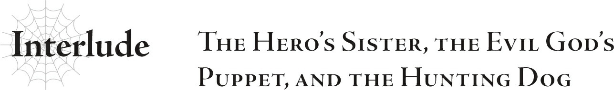

# Đoạn phụ: Em gái Anh hùng, con rối của Tà thần, và chú chó săn
*(Interlude: The Hero's Sister, the Evil God's Puppet, and the Hunting Dog)*

Tôi nhìn xuống thế giới từ ô cửa sổ.

Phía dưới, tôi có thể thấy quân đội đế quốc đang giải tán, hướng về những căn phòng đã được phân phó cho họ.

Trong số đó, tôi nhận ra gương mặt của Yuri, ứng cử viên Thánh nữ, và không tự chủ được mà cau mày.

“Chào nhé. Trông cô vẫn cau có như thường lệ nhỉ, vị hôn thê yêu quý của ta.”

Cửa phòng tôi mở ra mà không thèm gõ lấy một tiếng, và Hugo ló đầu vào.

“Câm miệng đi, tên anh hùng giả mạo.”

“Ồ, đáng sợ quá đi mất.”

Với vẻ mặt không chút bận tâm, hắn bước vào phòng rồi tự nhiên ngả lưng xuống chiếc ghế sofa.

“Và đừng có gọi tôi là vị hôn thê của anh. Thật kinh tởm.”

“Chà, lạnh lùng ghê nhỉ. Vậy thì gọi là Sue nhé.”

“Cũng đừng gọi tôi là Sue. Chỉ có hoàng huynh yêu quý và những người thân thiết nhất của tôi mới được phép gọi như thế.”

“Được rồi, được rồi. Vậy thì là Công chúa Suresia nhé.”

Hugo nhún vai cùng một nụ cười toe toét đểu giả.

Chỉ nhìn thấy hắn thôi cũng đủ làm tôi lộn mửa, vì thế tôi lại hướng tầm mắt trở lại phía cửa sổ.

Quân đội đế quốc đang tiến dần đến làng Elf.

Các binh sĩ sẽ nghỉ ngơi ở đây ngày hôm nay, rồi ngày mai sẽ sử dụng cổng dịch chuyển để di chuyển đến địa điểm tiếp theo.

Và căn phòng này đã được chỉ định cho Hugo và tôi.

Về mặt danh nghĩa, hai chúng tôi đã đính hôn với nhau, dù chuyện này hoàn toàn đi ngược lại với ý muốn của tôi.

Nhiều khả năng, sự sắp xếp này chỉ nhằm tạo cảm giác tự nhiên khi hai chúng tôi xuất hiện và hành động cùng nhau.

Nhưng ngay cả khi chỉ là một màn kịch, ý nghĩ đính hôn với tên đàn ông này cũng đủ khiến tôi muốn nôn mửa.

Tôi đã giết phắt hắn ngay lúc này nếu không phải vì hoàng huynh của mình.

Đúng thế, tất cả chuyện này hoàn toàn là vì người anh trai yêu dấu của tôi.

Nên tôi bắt buộc phải chịu đựng, bất kể mọi chuyện có tồi tệ đến nhường nào.

Một ngày nọ, tôi đã gặp một vị tà thần.

Dù có vẻ ngoài trắng muốt tinh khôi, cô ta hoàn toàn là một kẻ tà ác.

Khi tôi định tự tay trừng trị tên ngu ngốc tội lỗi tên Hugo vì âm mưu hãm hại anh trai tôi, tôi lại bắt gặp vị tà thần đó đang làm gì đó với Hugo.

Bản năng mách bảo tôi rằng tôi không thể đánh bại cô ta.

Nếu tôi cố gắng chống lại, tôi sẽ chết.

Khi tôi đứng chết trân trong nỗi sợ hãi thực sự lần đầu tiên trong đời, vị tà thần đó đã thì thầm vào tai tôi.

“Ta có nên giữ cho anh trai ngươi không bị tổn hại gì không?”

Kể từ khoảnh khắc đó, tôi đã trở thành nô lệ của vị thần ấy.

Cô ta hứa rằng chỉ cần tôi tuân theo mệnh lệnh, cô ta sẽ không đụng đến một sợi tóc nào của anh trai tôi.

Vì hoàng huynh, tôi thề sẽ vượt qua mọi thử thách...

“Chúng ta sẽ sớm đến làng Elf thôi.”

Ngay cả khi không thèm nhìn, tôi cũng biết Hugo đang cười đểu.

Hắn ta lúc nào cũng vậy, dù tình hình chẳng có gì đáng cười cả.

“Hắc hắc. Ta không thể chờ đợi thêm nữa.”

Tôi chỉ ước hắn câm miệng lại và ngừng làm bẩn tai tôi.

Nếu giọng nói của hoàng huynh tựa như một bản giao hưởng từ thiên đường, thì giọng của tên này giống như tiếng gảy rít tai trên những sợi dây đàn gỉ sét.

Ôi, lúc này tôi thèm được nghe giọng nói của anh trai biết bao...

Chỉ vài từ ngắn ngủi thôi cũng đủ xoa dịu những mảnh vỡ nát trong tim tôi...

“Tôi hy vọng cô không phiền nếu tôi tham gia cùng.”

Hừ.

Lại thêm một kẻ phiền toái nữa xuất hiện.

“Xin chào, công chúa nhỏ.”

Đây chính là cấp dưới của vị tà thần, Sophia Keren.

“Ngươi muốn gì?”

“Tất nhiên là tôi đến để xem tình hình của cô thế nào rồi.”

“Vậy thì ngươi đã thấy rồi đấy, đúng không? Làm ơn biến đi cho.”

Phải chịu đựng sự hiện diện của Hugo, một kẻ ngứa mắt đến mức không thể dung thứ, đã là quá đủ rồi. Nếu phải chịu đựng thêm nữa, tôi chắc chắn sẽ phát điên vì căng thẳng mất.

“Chà, thật thô lộ làm sao. Chúng ta ít nhất cũng có thể tán gẫu một chút chứ?”

“Tôi không có gì để nói với những kẻ như ngươi cả.”

“Ồ, ra vậy. Thế mà tôi cứ ngỡ mình sẽ đến để an ủi cô bé tội nghiệp đang rơi nước mắt, kẻ đã giả vờ bị tẩy não rồi phản bội người anh trai quý giá của mình chứ.”

“Ngươi...! Chuyện đó không liên quan gì đến ngươi! Ngươi chỉ là con chó săn trung thành của thần!”

Tôi không hề giả vờ — lần đó tôi thực sự đã bị tẩy não!

Vì lý do nào đó, có lẽ là theo mệnh lệnh của vị tà thần, tôi hoàn toàn không thể kiểm soát được cơ thể mình khi ra tay sát hại phụ hoàng.

Tại sao cô ta lại làm một chuyện như thế chứ?

Đây chỉ là suy đoán của tôi, nhưng tôi nghĩ có lẽ cô ta đang cho tôi một lối thoát.

Để chuyện đó không phải là lỗi của tôi — tôi chỉ bị tẩy não mà thôi.

Vị tà thần đó vừa xảo quyệt vừa tàn nhẫn, nhưng thỉnh thoảng, cô ta lại thể hiện sự tử tế nửa vời.

Thật lòng mà nói, sẽ dễ hiểu hơn nhiều nếu cô ta đơn thuần là một kẻ tà ác thuần túy từ đầu đến cuối...

“Ồ, thế sao? Nhưng chẳng phải bây giờ cô cũng đang ở chung một thuyền sao? Đó là lý do tại sao cô phản bội anh trai mình.”

“Không! Tôi không bao giờ phản bội anh trai mình!”

Đó là ranh giới duy nhất tôi quyết không bao giờ bước qua!

“Nhưng dù sao thì cô cũng đang tuân lệnh chủ nhân của chúng tôi. Điều đó biến cô thành kẻ thù của nhân loại đấy.”

“Hự...!”

“Được rồi đấy. Đó chính là nét mặt mà tôi muốn thấy.”

Khóe môi Sophia cong lên một nụ cười đầy thỏa mãn.

“Ngươi là kẻ tồi tệ nhất.”

“Tôi sẽ coi đó là một lời khen.”

Thật là một kẻ đáng ghê tởm.

Cô ta thậm chí còn có vẻ tà ác hơn cả bản thân vị tà thần kia.

Tôi ước gì cô ta chết quách đi cho rồi...

“Này, Sophia. Cô thậm chí không thèm chào ta lấy một tiếng à?”

“Ồ? Tôi không nhận ra là cậu cũng ở đây đấy.”

Sophia lườm Hugo như thể đang nhìn một loài ký sinh trùng.

“Đừng có làm vẻ mặt đó chứ. Ta cũng biết tổn thương đấy, biết không?”

“Ồ, thế sao?”

Và có gì sai khi nhìn một con sâu như nhìn một con sâu chứ?

Mắt tôi chắc sẽ thối rữa ra mất khi phải thu vào tầm mắt cả một con sâu lẫn một con ả ác quỷ cùng một lúc.

“Sao rồi? Cô đã lấy được kỹ năng Thất Đại Tội hay Bảy Đức Tính nào chưa, công chúa?”

“...Chưa, vẫn chưa.”

“Chà, tiếc thật đấy. Cô đã quên mất lời hứa với Chủ nhân rồi sao?”

Hự.

Tôi đúng là đã có một lời hứa với vị tà thần đó.

Tôi nói sẽ giúp đỡ cô ta, và tôi sẽ đạt được một trong các kỹ năng Thất Đại Tội hoặc Bảy Đức Tính.

Nếu tôi làm được điều đó, cô ta sẽ đảm bảo sự tự do cho anh trai tôi và thả tôi đi.

Nhưng tôi vẫn chưa làm được.

“Thôi, tôi đoán chuyện đó cũng chả quan trọng mấy. Dù sao thì tôi cũng không nghĩ Chủ nhân lại kỳ vọng nhiều vào cô đâu.”

“Hừ! Xem ra có những kẻ sinh ra đã ở đẳng cấp khác biệt rồi.”

Tôi siết chặt nắm tay.

Thật sỉ nhục làm sao!

Tôi không thể chấp nhận được việc bị một kẻ rác rưởi như thế coi thường!

“Vẻ mặt đó lại càng tuyệt hơn nữa.” Nụ cười đểu của Sophia càng rộng hơn. “Một cô công chúa nhỏ được nuông chiều, lớn lên trong nhung lụa chẳng thiếu thứ gì, giờ đang run rẩy trong nhục nhã. Đúng là một cảnh tượng mãn nhãn.”

Kẻ cặn bã. Kẻ đê tiện nhất trong những kẻ đê tiện.

“……”

Nhìn xem, ngay cả một kẻ cực kỳ cặn bã như Hugo trông cũng có vẻ e ngại.

Tại sao một kẻ cặn bã khiến ngay cả một kẻ cặn bã khác phải e ngại lại xứng đáng được sống chứ?

Tôi ước gì bọn chúng chết hết đi...

Ngoài anh trai tôi ra, sự tồn tại của lũ rác rưởi lảng vảng trên thế giới này thì có ý nghĩa gì chứ?

Tôi ước gì tất cả mọi người ngoại trừ anh trai và tôi đều chết hết đi.

“Nhưng kế hoạch có hoạt động bình thường không nếu con nhóc này không kịp hoàn thành đúng hạn?”

“Chắc sẽ ổn thôi. Nghe bảo càng có nhiều kỹ năng Kẻ Thống Trị được kích hoạt thì càng tốt, nhưng tôi nghe nói là số lượng tối thiểu đã đạt đủ rồi. Tôi đoán nếu có thêm thì mọi chuyện sẽ dễ dàng hơn thôi, đúng chứ?”

“Ờ, chắc vậy. Tôi cũng chả quan tâm, vì tôi còn không biết cách sử dụng... cái gì mà chìa khóa của các kỹ năng Kẻ Thống Trị ấy nhỉ? Sao cũng được.”

Tôi không hiểu sao hắn lại có thể vô tư như thế khi đang bị kiểm soát bởi một vị tà thần và rõ ràng là đang nắm giữ hai “chiếc chìa khóa” đó.

Theo như tôi biết, hiện tại bọn họ đã có tổng cộng sáu chiếc chìa khóa: [Tham Lam] và [Ái Dục] của Hugo, [Đố Kỵ] của Sophia, và một vài kỹ năng của những người tôi chưa từng gặp mặt, cụ thể là một người tên Wrath sở hữu kỹ năng tương ứng (Phẫn Nộ), một người tên Merazophis sở hữu [Kiên Trì], và [Bạo Thực] của Ma Vương Ariel.

Tôi cũng không biết những chiếc chìa khóa này dùng để làm gì.

Nhưng tôi nghi ngờ việc vị tà thần kia sẽ sử dụng chúng cho một mục đích tốt đẹp nào đó.

“Chẳng phải vấn đề lớn hơn là Yuri không đạt được cái nào sao? Cô ta cũng là một người tái sinh giống chúng ta mà, chết tiệt thật.”

“Tôi tin là có những người phù hợp với nó hơn những người khác, ngay cả trong số các người tái sinh.”

Tôi cũng thấy hơi tội nghiệp cho Yuri.

Dù cô ta chỉ là một ả tu nữ lẳng lơ thối nát luôn cố gắng quyến rũ anh trai tôi, nhưng thật tàn nhẫn khi cô ta bị tẩy não và bị ép phải thực hiện những mệnh lệnh tàn ác của bọn họ...

Nhưng tôi đoán mình cũng không thực sự bận tâm, vì dù sao cô ta cũng đã dám dụ dỗ anh trai tôi.

Có lẽ cô ta sẽ thất bại rồi đi chầu rìa cùng với vị thần mà cô ta hằng tôn kính.

Vì cô ta là một tín đồ sùng đạo mà, tôi đoán cô ta sẽ thích điều đó.

“Ồ, nhắc mới nhớ. Tôi nghe nói người anh trai yêu dấu của cô đang hướng về làng Elf đấy. Cô biết chưa?”

“?!”

Hoàng huynh của tôi sao?!

“Có lẽ cô sẽ có một cuộc đoàn tụ cảm động ở đó đấy.”

Hoàng huynh...

Tôi muốn gặp anh ấy.

Nhưng tôi cũng rất sợ.

Tôi sẽ phải nói gì với anh ấy đây...?

“Tôi nghe nói cô Oka cũng đi cùng cậu ta nữa. Chưa kể đến Katia, Fei, Anna... cậu ta quả là rất được lòng các quý cô nhỉ?”

Lũ hồ ly tinh đó...

Tôi hiểu rồi.

Trong khi tôi phải đau khổ thế này, bọn họ lại đang tranh thủ quấn quýt bên cạnh người anh trai yêu dấu của tôi...

Tôi đã luôn nghi ngờ người phụ nữ tên “cô Oka” đó.

Và cả Katia nữa.

Tôi từng nghĩ cô ta là bạn, nhưng nếu cô ta dám chạm vào anh trai tôi, tôi sẽ không tỏ ra nhân từ đâu...

“Này... con nhóc này tuy mở miệng ra là chửi bới người khác, nhưng bản thân nó cũng đâu có tốt lành gì đúng không? Nhìn là biết nó không đang nghĩ điều gì tốt đẹp hay lành mạnh rồi, ta nói có sai đâu chứ?”

“Chủ nhân tất nhiên sẽ không bao giờ thu nhận một người thực sự tử tế rồi. Cô ấy luôn chọn lọc để không cảm thấy quá cắn rứt lương tâm nếu họ phải chịu đựng một chút đau khổ.”

“Hì, hiểu rồi. Nghe cũng có lý đấy.”

Lũ cặn bã đang nói chuyện qua lại với nhau, nhưng đó chỉ là những lời ríu rít lảm nhảm vô nghĩa của đống rác rưởi giả dạng con người.

Tôi sẽ không bận tâm đến bọn chúng.

---

[◀ Chương trước: Chương 6: Giám sát nhóm Anh hùng kiếm sống](10_ch6_watching_over_the_heros_party_for_a_living.md) | [Chương tiếp theo: Chương 7: Tổng kết mọi việc và lên kế hoạch tiếp theo kiếm sống ▶](12_ch7_summing_things_up_and_planning_what_comes_next_for_a_living.md)
