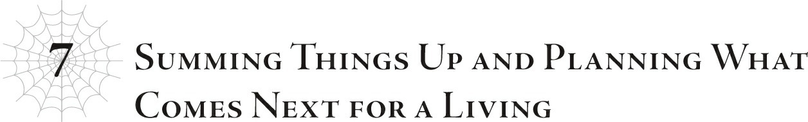

# Chương 7: Tổng kết mọi việc và lên kế hoạch tiếp theo kiếm sống
*(Chapter 7: Summing Things Up and Planning What Comes Next for a Living)*

Xét đến việc dạo gần đây tôi bận rộn một cách điên cuồng như thế nào, mọi người hẳn sẽ tự hỏi tại sao tôi lại không xử lý bớt mấy chuyện này trước khi mọi thứ vỡ lở, đúng không?

Thế thì, để tôi làm rõ chuyện đó ngay bây giờ luôn nhé!

Tôi làm gì có thời gian!

Trước đây tôi cũng cực kỳ bận rộn rồi, dù không đến nỗi tệ hại như bây giờ!

Dù sao thì, về mặt lý thuyết tôi cũng là một Thống lĩnh mà.

Tôi phải quản lý quân lính và đủ thứ việc linh tinh khác.

Và đoán xem?

Đã thế, lực lượng nòng cốt của tôi lại là Quân đoàn 10, một quân đoàn mà trên danh nghĩa chẳng có nổi mấy mống lính.

Tôi đã phải thu gom những kẻ thua cuộc thậm chí còn không chen chân nổi vào các sư đoàn thừa thãi khác, lập nên Quân đoàn 10 từ một lũ trẻ rắc rối không thể tìm được chỗ dung thân ở bất kỳ nơi nào khác, bạn biết chứ?

Bạn nghĩ phải mất bao lâu để thuần phục... à ý tôi là huấn luyện họ thành những người lính thực thụ, trang bị vũ khí cho họ, và uốn nắn họ đạt đến mức độ hoạt động tối thiểu của một quân đội?

Ngày qua ngày, tôi dành từng giây từng phút để chuẩn bị cho họ ra trận mà không có nổi một khoảnh khắc ngơi nghỉ.

Đúng là bóc lột sức lao động mà.

Tôi yêu cầu! Một kỳ nghỉ có lương!

A, lại bị từ chối rồi...

Và còn gì nữa nào?

Tôi cũng phải làm một đống việc khác cùng một lúc nữa.

Trước hết là nâng cấp các phân thân tí hon của mình.

Bạn biết đấy, những phân thân thu thập thông tin mà tôi đã trình làng trong trận chiến lớn đó.

Về cơ bản, tôi đã lấy các phân thân nhện cỡ lòng bàn tay được tạo ra lúc đầu và làm cho chúng mạnh hơn.

Chúng vẫn giữ nguyên kích thước đó, nhưng ẩn mình tốt hơn, miễn nhiễm với mọi kỹ năng dò tìm, và thậm chí có thể truyền trực tiếp tất cả những gì chúng nhìn thấy và nghe thấy về cho tôi.

Tôi còn mở rộng tính năng đó nhiều hơn nữa trong chiến tranh để giờ đây chúng cũng có thể truyền những hình ảnh đó sang các màn hình đặc biệt.

Chúng giống như những chiếc máy ảnh siêu cấp tự vận hành cực kỳ hiệu quả vậy!

Tôi đã rải hàng ngàn con như thế khắp hành tinh, dùng chúng để thu thập đủ loại thông tin trong thời gian thực.

Đó cũng là cách tôi nắm được chi tiết vị trí của tất cả lũ Elf.

Chưa kể đến các cổng dịch chuyển ẩn của chúng nữa.

Hắc hắc.

Thần Ngôn Giáo và tộc Elf đều khá nhạy bén trong việc thu thập thông tin, nhưng không ai trong số họ có thể xách dép cho tôi được đâuuu!

Mặc dù vậy, những phân thân gián điệp nhỏ bé này không có chút lực chiến nào và rất dễ bị nghiền nát chỉ bởi một bước chân vô tình, điều này hơi đáng tiếc một chút.

Chuyện đó không xảy ra thường xuyên lắm vì chúng ẩn mình rất tốt, nhưng thỉnh thoảng vẫn có tai nạn và mấy thứ đại loại thế.

Nhưng tôi đoán chúng ta chỉ đành coi đó là chi phí tổn hao khi làm ăn lén lút vậy.

Dù rằng việc thay thế khi chúng bị bẹp rúm cũng là một nỗi phiền phức cực kỳ lớn.

Thế nên tôi vừa phải vận hành vài ngàn con nhện gián điệp cùng lúc với đống việc này, đúng không? Và đó là trong khi vẫn đang sản xuất một đống phân thân chiến đấu cùng thời điểm đấy.

Như bạn có thể tưởng tượng, phân thân chiến đấu là những phiên bản tí hon của tôi được dùng để chiến đấu thay vì làm gián điệp.

Khác với phân thân gián điệp, chúng có nhiều hình dạng và kích thước khác nhau tùy theo mục đích sử dụng.

Đầu tiên, chúng tôi có các phân thân chiến đấu đa năng được sản xuất hàng loạt!

Chúng trông ít nhiều giống tôi thời còn là Zana Horowa, hình dạng mà tôi đã tiến hóa ngay trước khi trở thành Arachne.

Về cơ bản, một cơ thể màu trắng với hai chân trước là lưỡi hái.

Và chúng cũng mạnh xấp xỉ tôi hồi đó.

Chúng bắn ma pháp như mưa—tôi đoán về mặt kỹ thuật bây giờ gọi là thuật thức rồi—chúng sử dụng Tà Nhãn điên cuồng, và phản công bằng lưỡi hái nếu kẻ địch đến quá gần.

Tất nhiên là chúng cũng được trang bị đầy đủ tơ và độc nữa.

Như bạn có thể suy ra từ việc tôi gọi chúng là sản xuất hàng loạt, tôi có rất nhiều phân thân chiến đấu đa năng này.

Bao nhiêu á? Ồ, đó là bí mật quân sự.

Tiếp theo là các phân thân Taratect Nữ Vương.

Đó là thứ tôi đã gửi đến để đối phó với Anh hùng Julius trong cuộc chiến đó.

Chúng là các phân thân tôi tạo ra dựa trên hình mẫu của Mẹ, những thực thể khổng lồ ở đẳng cấp 'siêu to khổng lồ', chuyên nghiền nát mọi thứ bằng sức mạnh thuần túy từ cơ thể hộ pháp của mình.

Thú thật, năng lực tổng thể của chúng không cao hơn nhiều so với phân thân chiến đấu đa năng.

Nhưng vì kích thước vật lý quá lớn, chi phí chế tạo chúng tốn kém hơn nhiều, nghĩa là tôi chỉ tạo ra một số lượng rất ít.

Cuối cùng, là quân bài tẩy của tôi: các phân thân chuyên không gian.

Đúng như tên gọi, chúng chuyên về thuật thức không gian. Chúng có cùng hình dạng và kích thước cỡ lòng bàn tay như phân thân gián điệp, nhưng năng lực thì ở một đẳng cấp hoàn toàn khác.

Chúng có thể tạo ra các chiều không gian khác, ăn mòn cấu trúc không gian—những thứ điên rồ kiểu thế.

Kể từ khi trở thành thần, không hiểu vì lý do gì mà tôi đã phát triển khả năng thích ứng cực kỳ cao với thuật thức không gian, và các phân thân này được nạp đầy tinh hoa từ tất cả những tiến trình đó.

Chúng có thể cắt đứt không gian để lấy đầu hay bất kỳ thứ gì khác. Nếu không có cách nào để khắc chế điều đó, không kẻ địch nào có cơ hội chống lại các phân thân chuyên không gian này.

Ý tôi là, chúng có thể dịch chuyển phần thân của bạn tách rời khỏi phần còn lại của cơ thể.

Ngay cả khi bạn cố gắng chạy trốn, chúng cũng có thể can thiệp vào chính không gian, thế nên chẳng có nơi nào để đi cả.

Cách duy nhất để chống lại chúng là can thiệp sâu hơn nữa vào sự can thiệp không gian của tôi; bạn phải giỏi khoản đó ít nhất là ngang bằng, hoặc có khả năng là hơn thế.

Nếu tính theo thuật ngữ của hệ thống, tôi nghĩ ngay cả khi đạt cấp tối đa của `[Ma pháp Chiều không gian]`, dạng tiến hóa của `[Ma pháp Không gian]`, cũng không đủ để cứu mạng bạn.

Nói cách khác, về cơ bản là bất khả thi để chống lại tôi đối với bất kỳ ai hoạt động trong giới hạn của hệ thống.

Trời ạ, tôi mạnh thật đấy. Quáaaa mạnh luôn.

Các phân thân chiến đấu này thường tồn tại trong một chiều không gian riêng biệt do các phân thân chuyên không gian tạo ra.

Tôi có thể triệu gọi chúng ra bất cứ khi nào cần thiết.

Mặc dù cho đến nay, lần duy nhất chúng xuất hiện ngoài thế giới thực là khi tôi gửi một phân thân Nữ Vương đi đối phó với Anh hùng Julius.

Tôi không có lười biếng đâu nhé; tôi chỉ đang để chúng ở chế độ tiết kiệm điện để bảo tồn năng lượng thôi.

Đừng có hiểu lầm đấy.

Khi nhóm Vampy tiêu diệt những quái vật cấp huyền thoại và mấy thứ tương tự, tôi đã đem chúng cho các phân thân trong chiều không gian riêng ăn, tích lũy năng lượng, và tạo thêm phân thân mới bất cứ khi nào lượng năng lượng tích trữ vượt quá một mức nhất định.

Tôi đã và đang tăng dần số lượng phân thân chiến đấu của mình một cách chậm rãi nhưng chắc chắn bằng quy trình đó.

Xét đến việc chúng bắt đầu từ những chú nhện cỡ lòng bàn tay dễ thương nhưng vô dụng, chúng thực sự đã tiến một bước rất dài, chắc chắn rồi.

Nói nghiêm túc thì lúc đầu mấy thứ đó hoàn toàn vô giá trị.

Chậm mà chắc, tôi đoán thế.

Không phải mọi thứ đều giống như kỹ năng, nơi bạn được đảm bảo sẽ mạnh lên nếu tiếp tục rèn luyện, nhưng tôi nghĩ bạn vẫn chắc chắn sẽ đạt được một mức độ kết quả nhất định nếu bỏ ra nhiều công sức.

Dù sao thì, tôi vẫn còn một loại phân thân nữa, một kiểu khá kỳ lạ.

Những con này liên quan mật thiết đến một công việc khác mà tôi đang làm bên cạnh vị trí Thống lĩnh của mình.

Các phân thân này được gọi là phân thân liên quan hệ thống.

Tôi đoán là bạn có thể tự mình chắp vá thông tin được rồi.

Về cơ bản, các phân thân này gánh vác nhiều nhiệm vụ khác nhau liên quan đến hệ thống.

Mục tiêu tối thượng của tôi là phá hủy hệ thống và sử dụng năng lượng được giải phóng để hồi sinh thế giới này.

Có rất nhiều sự chuẩn bị kỹ lưỡng liên quan, như bạn có thể tưởng tượng.

Và để thực hiện tất cả những sự chuẩn bị đó, tôi cần phải hiểu rõ cách thức hoạt động của hệ thống đến từng chi tiết nhỏ nhặt nhất.

Dù sao thì đây cũng là một canh bạc được ăn cả ngã về không với vận mệnh thế giới đang ngàn cân treo sợi tóc.

Bạn không thể quá cẩn thận, thậm chí đến mức có vẻ như hơi hoang tưởng.

Vì thế, ngay cả trong những giai đoạn đầu, tôi đã đổ một đống công sức thêm vào việc điều tra hệ thống.

Giữa công việc Thống lĩnh và tất cả những việc liên quan đến phân thân đó, tôi chắc chắn là bận ngập đầu. Nhưng thành thật mà nói, chính cuộc điều tra hệ thống này mới là thứ tiêu tốn phần lớn tài nguyên của tôi.

Thực tế là tôi đã tạo ra các phân thân dành riêng cho mục đích này hẳn sẽ cho bạn biết tôi đã bỏ ra bao nhiêu nỗ lực vào đây.

Tóm lại là, tôi chẳng có lấy một giây nghỉ ngơi nào hết!

Mọi người đã hiểu chưa hả?

Ngay cả trước khi mọi chuyện trở nên bận rộn như hiện tại, tôi vẫn bận đến điên cuồng! Ai trong chúng ta dám bước đến trước mặt con nhện siêu bận rộn của quá khứ đó và bảo cô ấy rằng: Này, mọi chuyện sắp tới sẽ còn bận rộn hơn nữa đấy, nên cố mà vắt kiệt sức đi chứ?!

Ngay cả khi tôi biết trước tương lai, tôi cũng sẽ nói: Xin lỗi nhé, tôi đạt đến giới hạn rồi!

Làm ơn đi, Luật Tiêu chuẩn Lao động ơi, hãy thể hiện vai trò của mình ở đây đi! A, đây là dị giới, nghĩa là cái đó không tồn tại ở đây... đúng rồiii...

Chán như gián luôn.

Nhưng tôi vẫn sẽ làm thôi, vì ngay từ đầu chính tôi là người đã quyết định gánh vác tất cả chuyện này mà!

Vậy nên để tôi tóm tắt cho bạn những gì chúng ta đã biết về hệ thống cho đến nay nhé.

Trước hết, hệ thống chính xác là cái gì? Ồ, đó là một thuật thức siêu khổng lồ được tạo ra bởi D!

Mục đích chính của nó là phân phát kỹ năng, chỉ số và đủ thứ cho tất cả các sinh vật sống trên thế giới này, thu thập tất cả những thứ đó dưới dạng năng lượng khi những sinh vật đó chết đi, và sử dụng năng lượng đó để hồi sinh thế giới đang hấp hối này!

Trời ạ, câu đó dài thật đấy! Tóm tắt ngắn gọn ở đâu rồi?!

Và thế vẫn là đơn giản hóa nó đi khá nhiều rồi đấy, cho bạn biết thế.

Về cơ bản, hệ thống là một thuật thức quái đản ép buộc bất kỳ sinh vật sống nào trên thế giới này phải tích lũy năng lượng khi còn sống, rồi hoàn trả lại toàn bộ khi chết đi giống như mấy tên cho vay nặng lãi bệnh hoạn đến đòi nợ vậy.

Rèn luyện kỹ năng và chỉ số là phương thức chính để tích lũy nguồn năng lượng đó, một tính năng giống như trò chơi mà tôi nghĩ có lẽ là sở thích cá nhân của D.

Và năng lượng đó được dùng để giúp phục hồi thế giới này, nơi đang trên bờ vực hủy diệt.

Nếu bạn thắc mắc tại sao cả thế giới lại phải phụ thuộc vào một hệ thống phức tạp như vậy ngay từ đầu, thì nghe vẻ là do con người trên hành tinh này thực sự đã làm hỏng bét mọi chuyện từ rất lâu về trước rồi.

Nếu bạn muốn biết chi tiết về phần đó, hãy hỏi `[Cấm kỵ]`.

Nó thậm chí còn đi kèm với một dịch vụ miễn phí nơi bạn luôn phải nghe thấy một giọng nói vang lên từ 'chuộc tội' suốt ngày đêm, bất kể lúc ngủ hay lúc thức.

Dù tôi đã lách luật thoát khỏi cái bản hợp đồng nhỏ bé đó khi trở thành thần! Nó lúc nào cũng khá phiền nhiễu, nên thế là nhẹ cả người.

Dù sao thì, thế là đủ về `[Cấm kỵ]` rồi. Từ những gì tôi nghe kể, con người thời xa xưa đã tiêu tán năng lượng của thế giới này cho đến khi nó gần như cạn kiệt hoàn toàn. Sau đó, vị Nữ thần này đã trở thành vật tế để lấp đầy khoảng trống đó.

Bản thân tôi cũng không thực sự biết rõ chi tiết.

Thực lòng mà nói, tôi nghĩ mình cũng chẳng cần phải biết.

Tôi đoán là việc biết nhiều hơn về chuyện đó chỉ tổ làm tôi lộn mửa thôi.

Sau khi dành thời gian với những người đã có mặt khi chuyện đó xảy ra—như Hắc, Giáo hoàng, và đặc biệt là Ma Vương—tôi chắc chắn có cảm giác rằng đã có một số chuyện kinh khủng diễn ra.

Và vì các sinh vật sống trên thế giới này bị mắc kẹt trong một vòng luân hồi địa ngục nơi chúng chết đi, bị lột sạch năng lượng, rồi lại tái sinh vào chính thế giới đó một lần nữa, tôi nghi ngờ chuyện đó cũng được dùng làm một hình phạt.

Mặc dù tôi ước gì họ đừng kéo những người tái sinh từ Trái Đất như chúng tôi vào rắc rối của họ!

Quay lại chủ đề về hệ thống. Bên cạnh những chức năng cơ bản đó, D cũng thêm vào một đống tính năng chỉ để cho vui.

Nó bao gồm hầu hết các khía cạnh giống như trò chơi, như kỹ năng và quái vật.

Tôi không nghĩ những thứ như kỹ năng, chỉ số, cấp độ, vân vân thực sự cần thiết để khiến các sinh vật sống tích trữ năng lượng.

Phần đó chắc chắn bốc mùi D đang nghịch ngợm giải trí rồi.

Còn về quái vật thì sao, bạn hỏi thế à? Cái đó hơi khó định nghĩa hơn một chút.

Ngay cả khi ý tưởng ban đầu về kỹ năng và mấy thứ đó chỉ là để giải trí, một khi bạn đã chọn nó làm phương pháp tích lũy năng lượng, bạn cần phải bắt mọi người chiến đấu lẫn nhau.

Quái vật được tạo ra để cho con người có thứ gì đó chiến đấu.

Nếu đây là một trò chơi điện tử, chúng là các nhân vật phe địch.

And hệ thống đã tạo ra những kẻ địch đó.

Nhưng tôi có ấn tượng rằng hệ thống chỉ tạo ra quái vật vào lúc ban đầu, và chúng đã tự sinh sản tự nhiên kể từ đó.

Vì tốn năng lượng để sản xuất quái vật, nên việc quái vật tự phối giống đằng nào cũng có lợi hơn cho mục đích của hệ thống.

Cuối cùng, điều này nghĩa là lũ quái vật đang tồn tại hiện nay là sự pha trộn của nhiều yếu tố: hậu duệ của những con quái vật ban đầu do hệ thống tạo ra, những loài động vật vốn đã tồn tại ở thế giới này thích nghi với môi trường hiện tại, và một vài sự kết hợp trong số đó, đến mức bạn thậm chí không thể phân loại hết chúng được nữa.

Tại thời điểm này, tất cả những gì hệ thống thực sự tác động lên quái vật là in hằn vào chúng bản năng tấn công con người ngay khi nhìn thấy.

Tôi biết điều đó nghe có vẻ là một nỗi phiền phức khổng lồ từ góc nhìn của loài người, nhưng cũng chẳng có giải pháp thay thế rõ ràng nào nếu hệ thống cần các sinh vật sống chiến đấu lẫn nhau.

Bên cạnh đó, quái vật hiện nay là một phần không thể thiếu của chuỗi thức ăn. Sẽ còn tệ hơn cho thế giới nếu chúng đột ngột biến mất.

Ngoài quái vật, hệ thống còn có những cách khác để khiến con người chiến đấu lẫn nhau.

Cụ thể là, Anh hùng và Ma Vương.

Anh hùng là con người. Ma Vương, một ác quỷ.

Mỗi người dẫn dắt tộc người tương ứng của mình và chiến đấu chống lại nhau.

Cả hai cũng nhận được những danh hiệu đi kèm với các đặc quyền và khả năng bất thường nữa.

Anh hùng nhận được hiệu ứng đặc biệt là có khả năng sánh ngang với ma vương và có thể sử dụng Anh Hùng Kiếm. Cộng thêm việc Anh hùng có thể tăng sức mạnh khi gặp khủng hoảng.

Trong khi ma vương không có hiệu ứng đặc biệt chống lại anh hùng, họ có thể sử dụng Ma Vương Kiếm.

Nghe có vẻ hơi thiên vị Anh hùng, nhưng đó là vì con người và ma tộc có các chỉ số cơ bản cũng như tuổi thọ khác nhau; nó về cơ bản là một mức chấp bởi ma vương thường có xu hướng mạnh hơn anh hùng.

Nếu không có chuyện đó, nhân loại có thể dễ dàng bị phó mặc hoàn toàn cho sự định đoạt của một ma vương trong suốt nhiều thời đại.

Vấn đề ở đây là với hiệu ứng chống ma vương của anh hùng, cậu ta có thể chiến đấu ngang ngửa bất kể ma vương có mạnh hơn bao nhiêu đi chăng nữa.

Có điều điều đó nghĩa là để một anh hùng yếu hơn bắt kịp một ma vương mạnh mẽ, một lượng lớn năng lượng phải được rút từ đâu đó ra.

Nên về cơ bản, hiệu ứng chống ma vương thực chất là một sự tăng sức mạnh bằng cách đánh cắp năng lượng từ các phần khác của hệ thống.

Và tôi đã đề cập rằng Ma Vương hiện tại là mạnh nhất trong lịch sử chưa nhỉ?

Kiểu như, các chỉ số trung bình của cô ấy dao động quanh mức 100.000.

Chuyện gì sẽ xảy ra nếu anh hùng cố gắng chiến đấu với cô ấy?

Một lượng năng lượng khổng lồ sẽ bị rút ra khỏi hệ thống và hoàn toàn bị lãng phí, chính là thế đấy.

Chúng tôi không thể vung tay quá trán như vậy khi đang cố gắng tiết kiệm năng lượng ở đây!

Hơn nữa, toàn bộ chuyện này cũng đồng nghĩa với việc sự tồn tại của anh hùng là một mối đe dọa đối với sự an toàn của Ma Vương, đó là lý do tại sao tôi đã thổi bay Julius trong cuộc chiến và nhân tiện hack hệ thống để cố gắng loại bỏ chính sự tồn tại của tính năng anh hùng.

As chúng ta đều biết, chuyện đó đã kết thúc trong một thất bại thảm hại.

Tôi đã nghiên cứu hệ thống khá kỹ lưỡng và nghĩ mình sẽ có thể làm được, nhưng tôi đoán đó là sự lạc quan quá mức.

Nhưng tôi đã học được bài học của mình, đó là lý do tại sao giờ đây tôi đang cố gắng đào sâu hơn nữa sự hiểu biết và kiểm soát đối với hệ thống.

Và những gì tôi thực sự cần cho sự kiểm soát đó chính là các kỹ năng Kẻ thống trị.

Chúng ta đang nói về các kỹ năng dòng Thất Đại Tội và các kỹ năng dòng Bảy Đức Tính.

Những kỹ năng này thực chất đóng vai trò như những chiếc chìa khóa để truy cập vào hệ thống.

Một khi bạn sở hữu một kỹ năng Kẻ thống trị và thiết lập quyền hạn thống trị của mình bằng thông tin thu được từ `[Cấm kỵ]`, bạn sẽ nhận được một đống đặc quyền đặc biệt.

Như khả năng chặn `[Thẩm định]`, thực hiện tìm kiếm chính hệ thống, vân vân.

Dù vậy, sử dụng những đặc quyền đặc biệt đó quá thường xuyên sẽ bào mòn linh hồn của bạn, thế nên tôi không khuyến khích việc lạm dụng chúng—ngoại trừ việc chặn `[Thẩm định]`, thứ dường như không thực sự tốn kém gì.

Khả năng chặn `[Thẩm định]` đã tỏ ra khá hữu dụng vài lần trước khi tôi trở thành thần.

Dù sao thì, trong lúc điều tra hệ thống, tôi đã phát hiện ra rằng bạn có thể sử dụng các kỹ năng Kẻ thống trị này làm chìa khóa để truy cập vào một loại menu bí mật.

Khi quyền hạn thống trị của bạn được xác nhận, một danh sách những việc bạn có thể làm về cơ bản sẽ được cài đặt vào đầu bạn, nhưng thứ này chắc chắn không nằm trong danh sách đó.

Nói cách khác, bạn sẽ không có cách nào biết về nó trừ khi bạn đã kiểm tra kỹ lưỡng hệ thống giống như tôi.

Thế nên tôi đã làm tất cả những điều đó và phát hiện ra menu bí mật.

Và bạn có tin được không...

Nó chứa chương trình tự hủy của hệ thống.

Đúng như tôi nghi ngờ, với tính cách vặn vẹo tồi tệ của D, tất nhiên cô ta sẽ cài vào một cửa hậu ẩn.

Nó thậm chí còn đi kèm with một file README nhỏ xinh giải thích cách sử dụng.

Cười ra nước mắt luôn.

Làm bạn phải tự hỏi liệu ngay từ đầu có ý nghĩa gì khi từ từ tích lũy năng lượng thông qua menu chính thức hay không.

Và nếu tôi còn cảm thấy như vậy, tôi chắc chắn chuyện đó còn tệ hơn đối với những người như Ma Vương và Giáo hoàng, những người thực sự đã từ từ, cẩn thận tích lũy suốt ngần ấy năm trời...

Nhưng may mắn thay, vì Ma Vương đã cận kề bờ vực bỏ cuộc, cô ấy rất vui mừng khi cuối cùng cũng nhìn thấy ánh sáng ở cuối đường hầm.

Dù tôi chắc chắn cô ấy ước mình biết đến phương pháp này sớm hơn.

Ý tôi là, nếu họ kích hoạt thứ này ngay sau khi hệ thống được tạo ra, thế giới có lẽ đã được cứu từ lâu rồi.

Họ sẽ không phải chịu đựng vòng lặp kéo dài lê thê của việc sống, chết, và truyền năng lượng thông qua các kênh chính thức.

Tôi chắc rằng đã có nhiều bi kịch trong lịch sử hơn mức bạn có thể đếm được, và Ma Vương cùng Giáo hoàng có lẽ đã chứng kiến tất cả.

Vì vậy, tôi hình dung việc biết được rằng những điều đó có lẽ không cần thiết phải xảy ra ngay từ đầu hẳn là một cú sốc lớn.

Nhưng bạn không thể thay đổi quá khứ, nên tôi đoán chẳng ích gì khi cứ dằn vặt về nó.

Tôi không thể sửa đổi những bi kịch đã xảy ra. Tôi chỉ có thể cố gắng tạo nên một tương lai tốt đẹp hơn.

Cứ để những người du hành thời gian xử lý các cuộc khủng hoảng trong quá khứ đi, dù tôi không biết liệu có ai tồn tại mà có thể xoay xở được chuyện như thế hay không.

Ý tôi là, D sở hữu một lượng tri thức điên rồ—tôi sẽ không ngạc nhiên nếu cô ta làm được.

Có điều nếu không có gì khác biệt, tôi chắc chắn là không thể rồi.

Tôi phải tập trung vào những gì mình có thể làm thay vì cứ dằn vặt về những gì không thể.

Nhưng khoan đã!

Có một việc tôi không thể tự mình thực hiện!

Và đó là gia tăng số lượng người sở hữu kỹ năng Kẻ thống trị.

Kỹ năng Kẻ thống trị chính là những chiếc chìa khóa dẫn vào hệ thống.

Thấy không, bạn thực sự cần tất cả các chìa khóa kỹ năng Kẻ thống trị để kích hoạt chương trình tự hủy trong menu bí mật của hệ thống.

Từng! Chiếc! Chìa! Khóa! Một!

Đúng rồi đấy. Trò chơi này bất khả thi!

Có vài kỹ năng Kẻ thống trị thậm chí hiện còn chưa thuộc về bất kỳ ai.

Tệ hơn nữa, một trong những người thực sự sở hữu kỹ năng Kẻ thống trị lại là kẻ sẽ tuyệt đối không bao giờ hợp tác với chúng tôi.

Bạn đoán đúng rồi đấy: Potimas.

Thật sự đấy! Tại sao tên đó cứ phải ngáng đường chúng tôi ở mọi ngã rẽ thế chứ?!

Sự tồn tại của gã đó là cái gai trong mắt tôi!

Bạn có biết tôi đã cảm thấy thế nào khi tìm ra cách kích hoạt cái menu bí mật này không?!

Tôi đã muốn đâm đầu vào tường luôn cho rồi!

Nhưng đúng như vị huấn luyện viên bóng rổ nổi tiếng nào đó từng nói: “Nếu từ bỏ, trận đấu sẽ kết thúc ngay tại đó.”

Tôi đã vắt óc suy nghĩ xem mình có thể làm được gì, và cuối cùng, tôi quyết định chơi ăn gian.

Chìa khóa, cửa, mở...

Đúng rồi, bẻ khóa thôi!

...Này bạn độc giả kia ơi, người vừa mới nghĩ Cái quái gì thế này? ấy.

Nếu cách tiếp cận trực tiếp không hoạt động, bạn chỉ việc sử dụng các biện pháp thay thế thôi!

Bản thân cái menu bí mật này đã là một biện pháp lách luật rồi, nên chẳng có gì sai khi sử dụng thêm một biện pháp lách luật khác đè lên nó cả, nếu bạn hỏi tôi!

Hơn nữa, tôi cũng không có lựa chọn nào khác, bởi vì nếu không tôi sẽ chẳng bao giờ có thể lấy được chìa khóa từ tất cả những người nắm giữ kỹ năng Kẻ thống trị.

Dù sao thì, tôi đã ngồi xuống lập danh sách những người có khả năng đạt được kỹ năng Kẻ thống trị.

Sau đó, tôi quyết định chiêu mộ càng nhiều càng tốt.

Phe chúng tôi ban đầu đã có ba người sở hữu kỹ năng Kẻ thống trị: Ma Vương có `[Bạo Thực]`, Vampy có `[Đố Kỵ]`, và cậu Oni có `[Phẫn Nộ]`.

Tiếp theo, tôi bắt đầu tiến hành giám sát chặt chẽ các thống lĩnh quân đội ma tộc, những con người nổi tiếng, các bạn học tái sinh, và những nhân vật quan trọng khác.

Các phân thân gián điệp của tôi chắc chắn đã phát huy tác dụng lớn ở khoản đó.

Và tiếp theo thì bạn biết rồi đấy, Mera đã có được kỹ năng `[Kiên Trì]`.

Đó thực sự là một cú sốc.

Mera ban đầu chỉ là một người bình thường thôi, bạn biết chứ?

Anh ấy đã trải qua một cuộc đời khá dữ dội kể từ đó, đặc biệt là từ khi bị biến thành ma cà rồng và đủ thứ, nhưng tôi vẫn không thể tin nổi anh ấy lại tiến xa đến mức có được kỹ năng Kẻ thống trị.

Đáng lẽ là siêuuu khó để có được những kỹ năng đó đấy, bạn biết không.

Ý tôi là, ngay cả Anh hùng Julius còn chẳng có cái nào!

Nếu ngay cả người bảo vệ được chỉ định của nhân loại cũng không thể đạt được, thì đó chắc chắn là một bộ kỹ năng cực kỳ hiếm.

...Mặc dù tôi đoán mình không có tư cách nói thế, vì tôi từng có tới bốn cái, hoặc năm cái nếu tính cả `Trí Tuệ`.

Nhân tiện, có vẻ như kỹ năng `Trí Tuệ` được tạo ra dành riêng cho tôi.

Tôi đã nhận được nó khi đạt cấp tối đa của `Thẩm định` và `Phát hiện`, nhưng Ma Vương cũng làm điều tương tự mà rốt cuộc cô ấy lại không có được `Trí Tuệ`.

Úp, tôi lạc đề rồi.

Dù sao thì, Mera thực sự đã rất cố gắng.

Làm tốt lắm, Mera.

Hãy tiếp tục phát huy nhé.

Kiên trì chính là mấu chốt ở đây.

Hãy cho tôi thấy một con người bình thường thực sự có thể làm được những gì nào.

Mặc dù tôi đoán giờ anh ấy là ma cà rồng rồi, không còn là con người nữa.

Trong khi đó, ở phía loài người, Natsume thực sự đã làm hỏng bét mọi chuyện.

Hắn đã cố gắng âm mưu một vụ ám sát để trả thù Yamada.

Dù chuyện đó đã kết thúc trong thất bại nhờ có cô Oka.

Trên hết, cô ấy thậm chí còn sử dụng quyền hạn thống trị của mình để xóa bỏ toàn bộ kỹ năng của Natsume.

Vì cô Oka có thể sử dụng những Đặc quyền Giai cấp Thống trị đó, điều đó nghĩa là cô ấy sở hữu một kỹ năng Kẻ thống trị.

Và cô ấy thậm chí đã thiết lập xong quyền hạn thống trị của mình.

Không đời nào cô Oka lại đạt cấp tối đa của kỹ năng `[Cấm kỵ]`, thế nên Potimas chắc chắn đã chỉ cho cô ấy cách làm. Tôi chắc là hắn cũng đã thiết lập xong quyền hạn thống trị của mình rồi, lẽ tự nhiên thôi.

Nhiều khả năng, kỹ năng Kẻ thống trị của cô Oka là `[Nhân Ái]`, một trong Bảy Đức Tính.

Tôi cũng từng sở hữu cái đó.

Tôi nhận được nó khi đang cứu mạng vô số người; nó chỉ ngẫu nhiên đi kèm với một trong những danh hiệu tôi đạt được.

Không rõ liệu cô Oka có nó bằng cách tương tự hay cô ấy đã sử dụng điểm kỹ năng để mua.

But việc cô ấy có được kỹ năng đó bằng cách nào không quan trọng lắm, miễn là cô ấy có nó.

Tuy nhiên, chừng nào Potimas còn lảng vảng xung quanh, tôi không thể thực sự tiếp cận cô ấy.

Thế nên nếu cô Oka sở hữu kỹ năng Kẻ thống trị, điều đó cũng có nghĩa là phe tôi bớt đi một chiếc chìa khóa có thể sử dụng.

Chuyện đó đau thật đấy, chắc chắn rồi.

But tôi cũng chẳng thể làm gì được.

Đằng nào thì việc lấy được tất cả chìa khóa vốn dĩ đã là điều không tưởng.

Cơ mà, cô Oka thực sự đã làm quá tay rồi.

Trong số tất cả các đặc quyền thống trị, việc xóa bỏ kỹ năng ngốn một phần linh hồn đặc biệt lớn.

Thông thường, điều đó lẽ ra phải gây ra tổn hại nghiêm trọng cho linh hồn cô ấy, đủ để cô ấy mất đi một đống kỹ năng và bị sụt giảm chỉ số nghiêm trọng trong quá trình đó.

Mỉa mai thay, có lẽ chính nhờ có Potimas mà cô Oka mới thoát nạn mà không hề hấn gì.

Một phần linh hồn của Potimas bám chặt lấy cô ấy như một loài ký sinh trùng.

Thực ra, điều đó đúng với tất cả lũ Elf, chứ không chỉ riêng cô Oka.

Tôi nghĩ đây là hiệu ứng từ kỹ năng dòng Bảy Đức Tính của Potimas, `[Cần Mẫn]`.

Hắn có thể tiếp quản những kẻ bị mình lây nhiễm và sử dụng họ làm thế thân cơ thể của chính mình.

Một khi ai đó đã bị tiếp quản một lần, họ không bao giờ có thể trở lại bản ngã cũ.

Nói cách khác, Potimas về cơ bản đã bắt cô Oka làm con tin.

Nhưng hãy chú ý thì quá khứ nhé.

Đó là trước khi xảy ra vụ Natsume hóa điên.

Cô Oka đã sử dụng các đặc quyền thống trị của mình theo cách lẽ ra sẽ thiêu rụi linh hồn cô ấy, nhưng một cách thần kỳ, nó lại tiêu thụ phần linh hồn ký sinh của Potimas đang bám trên người cô ấy thay thế.

Tôi không nghĩ ngay cả Potimas cũng lường trước được điều này.

Nhờ vậy, phần linh hồn Potimas bám vào cô Oka đã bị suy yếu nghiêm trọng, khiến hắn khó lòng chiếm đoạt cơ thể cô ấy hơn nhiều.

Dù nói vậy, nó chỉ là khó hơn chứ không phải hoàn toàn bất khả thi, điều đó vẫn rất đáng lo ngại.

Cơ mà đằng nào thì, mỗi khi Potimas gặp rắc rối, tôi đều phải ăn mừng cái đã!

Hơn nữa, đó thậm chí không phải là lợi thế duy nhất chúng tôi đạt được từ sự cố nhỏ này.

Chúng tôi cũng đã thành công trong việc tẩy nã—ý tôi là chiêu mộ Natsume về phe mình.

Hửm? Có phải tôi vừa định nói tẩy não không?

Không đâu, bạn tưởng tượng thôi.

Làm gì có thứ gọi là các phân thân tẩy não mà tôi đã tiện tay không nhắc tới lúc nãy chứ.

Và chắc chắn không có một con nhện cỡ đầu ngón tay bên trong não của Natsume hay bất cứ thứ gì tương tự đâu! Đây là cái gì, phim kinh dị chắc?

Ha ha ha.

Xem nào, nếu chúng tôi cứ mặc kệ hắn, hắn chắc chắn sẽ lại hóa điên và lần này chắc chắn sẽ bị xử tử cho mà xem. Thế thì tại sao tôi lại không tận dụng hắn để làm lợi cho phe mình chứ?

Và thế là tôi thực sự trúng độc đắc: Hắn đã đạt được không chỉ một mà là hai kỹ năng Kẻ thống trị, `[Ái Dục]` và `[Tham Lam]`!

Đúng là món hời lớn mà.

Phe tôi đã thực hiện đủ loại trò nghịch ngợm nhờ vào hiệu ứng tẩy não của `[Ái Dục]`, vì thế giờ đây tôi có thể khẳng định chắc chắn rằng mình đã đưa ra lựa chọn đúng đắn!

Mặc dù tôi không ngờ em gái nhỏ của Yamada lại tấn công trong lúc chúng tôi đang tẩy nã—ý tôi là thuyết phục Natsume.

Phải thừa nhận là ý nghĩ dùng vũ lực để bắt cô bé im lặng đã thoáng qua trong đầu tôi một giây—nhưng khi thực sự nghĩ kỹ lại, cô bé thực chất khá thông minh và tài năng, đủ để cô bé làm tốt việc sát cánh cùng một người tái sinh như Yamada.

Chẳng phải điều đó có nghĩa là cô bé có cơ hội nhận được kỹ năng Kẻ thống trị sao?

Đó là lý do tại sao tôi đã rất tốt bụng tiếp cận cô bé để đề xuất cô bé hợp tác với mình, đổi lại là việc không gây hại gì cho Yamada.

Vì cô bé hơi quá ám ảnh với anh trai mình, mối đe dọa—à không, khoan đã, ý tôi là lời đề nghị, chắc chắn chỉ là một lời đề nghị—đã lập tức có tác dụng với cô bé.

Đáng tiếc là cô bé vẫn chưa thể đạt được kỹ năng Kẻ thống trị nào.

Nhưng xem xét việc cô bé vẫn giúp đỡ chúng tôi một vài việc vặt khác, tôi đã giữ lời hứa không làm tổn thương Yamada.

Ít nhất là bằng chính tay tôi!

Tôi chưa bao giờ hứa rằng Natsume sẽ không làm tổn thương cậu ta đâu nhé, được chứ?

Và tôi vẫn đảm bảo rằng cậu ta còn sống, đúng chứ?

Thế nên tôi không hề thất hứa đâu nha.

Dù sao thì, đùa thế đủ rồi, tôi đang lên kế hoạch đảm bảo cô bé không bị cuốn vào những làn sóng xung kích chắc chắn sẽ ập đến khi chúng tôi phá hủy hệ thống, coi như lời cảm ơn vì đã giúp đỡ.

Đặc biệt là vì tôi cũng phần nào bắt cô bé tự tay giết chết cha ruột của mình.

Tôi quả thực đã để Natsume tẩy não cô bé và ép buộc cô bé làm vậy, ít nhất là để đảm bảo chuyện đó đi ngược lại ý chí của cô bé, nhưng chuyện đó có lẽ vẫn gây ra một chút chấn thương tâm lý nhỏ đối với cô bé.

Tiếp theo, tôi đã sử dụng khả năng tẩy não của Natsume để kiểm soát các học sinh tái sinh khác như Ooshima và Hasebe, đồng thời kiểm tra xem họ có sở hữu kỹ năng Kẻ thống trị nào không.

Nếu có, tôi đã lên kế hoạch đánh cắp chìa khóa từ họ trong khi họ vẫn đang bị tẩy não, nhưng đáng buồn là không ai trong số họ có cả.

Tôi không tẩy não Yamada, vì tôi đã hứa với em gái cậu ta rồi.

Chưa kể đến vấn đề nhỏ về kỹ năng `[Thần bảo hộ]` nữa.

Tôi thừa nhận, một phần là vì tôi chỉ sợ chuyện gì đó kỳ dị sẽ xảy ra nếu tôi thử bất kỳ trò gì lên người cậu ta.

Tuy nhiên, việc Yamada hóa ra lại sở hữu kỹ năng `[Từ Bi]` chắc chắn là một đòn đau.

Có lẽ tôi nên nuốt lời hứa với em gái cậu ta để cướp phắt chiếc chìa khóa từ cậu ta luôn cho rồi...

Mà thôi, nước chảy qua cầu rồi, tiếc nuối cũng vô ích.

Và Shinohara thì thường dính lấy Yamada như hình với bóng, nghĩa là tôi cũng không thể động vào cô bé.

Đó là tình hình với các học sinh tái sinh tại học viện loài người.

Ngoài những người đó ra, còn có Tagawa và Kushitani, hai học sinh tái sinh khác đang đi khắp thế giới dưới tư cách mạo hiểm giả và cũng đã tích lũy được một lượng kinh nghiệm chiến đấu khá tốt.

Không ai trong hai người họ dường như có được kỹ năng Kẻ thống trị theo như tôi có thể nhận biết, thế nên tôi chỉ mắt nhắm mắt mở theo dõi họ thôi, nhưng sau đó họ lại đụng độ với Mera trong chiến tranh và rốt cuộc lại đi theo cô Oka đến cái làng Elf ngớ ngẩn đó.

Có lẽ tôi có thể ngăn họ lại nếu cố gắng, nhưng lúc đó phe tôi can thiệp vào trông sẽ rất kỳ lạ, và tôi cũng quá bận rộn với công tác dọn dẹp hậu chiến nên đành ngó lơ họ luôn.

Cũng có một người tái sinh tên Kusama đang làm việc dưới quyền Giáo hoàng, nhưng cậu ta cũng không có kỹ năng Kẻ thống trị, đặt cậu ta chắc chắn vào cột bỏ qua.

Hửm? Tôi gạt bỏ Kusama quá dễ dàng á?

Không phải lỗi của tôi đâu. Cậu ta vốn dĩ là kiểu người như thế mà.

Những người tái sinh khác đều đang bị giam lỏng trong làng Elf, và tôi thực sự nghi ngờ họ có thể đạt được kỹ năng Kẻ thống trị trong tình cảnh đó, nghĩa là họ cũng bị ngó lơ luôn.

Tóm lại, những người sở hữu kỹ năng Kẻ thống trị hiện tại gồm có:

Phẫn Nộ: Cậu Oni.

Đố Kỵ: Vampy.

Tham Lam và Ái Dục: Natsume.

Bạo Thực: Ma Vương.

Kiêu Hãnh và Lười Biếng: Cả hai đều chưa có chủ.

Từ Bi: Yamada.

Kiên Trì: Mera.

Cần Mẫn: Potimas.

Nhân Ái: Cô Oka.

Tiết Chế: Giáo hoàng.

Trinh Tiết và Khiêm Nhường: Cả hai đều chưa có chủ.

Trong số mười bốn cái, tôi đã thu được chìa khóa của sáu cái.

Bốn cái chưa có chủ, và bốn cái thuộc về các thành viên của những phe phái khác.

Tôi rất muốn nắm giữ được ít nhất một nửa số đó, nhưng đây có lẽ là điều tốt nhất tôi có thể làm rồi...

Tôi sẽ đành phải dùng cách bẻ khóa cho số còn lại thôi.

Là vậy đấy.

Liên quan đến phần đó, rõ ràng là độ khó sẽ thay đổi tùy thuộc vào trạng thái của kỹ năng Kẻ thống trị.

Cụ thể, theo thứ tự từ độ khó cao nhất đến thấp nhất: đã thiết lập quyền hạn > chưa thiết lập quyền hạn > chưa có chủ.

Các kỹ năng chưa có chủ về cơ bản giống như chiếc chìa khóa nằm lăn lóc không ai canh giữ gần ổ khóa, nhưng nếu có ai đó sở hữu kỹ năng Kẻ thống trị tương ứng, nó sẽ trở nên khó khăn hơn nhiều vì về cơ bản có người khác đang mang chiếc chìa khóa đó bên mình.

Và nếu họ cũng đã thiết lập quyền hạn thống trị của mình, điều đó giống như thể có thêm các biện pháp an ninh bổ sung xung quanh chính cái ổ khóa vậy.

Chính nhờ phạm vi độ khó này mà tôi đã có thể phát hiện ra có ai đó vốn đã sở hữu kỹ năng `[Từ Bi]`.

Nói cách khác, những cái khó giải quyết nhất vào lúc này chính là `[Cần Mẫn]`, `[Tiết Chế]`, và `[Nhân Ái]`.

`[Từ Bi]` đứng ở vị trí thứ tư.

Chỉ cần tôi có thể giải quyết được bốn cái này bằng cách nào đó, những cái chưa có chủ sẽ đủ đơn giản.

Tôi sắp sửa đập Potimas ra bã rồi, nghĩa là `[Cần Mẫn]` sẽ trở lại trạng thái chưa có chủ.

Vì thế tôi sẽ cứ đợi để cạy nó ra sau khi xong xuôi mọi chuyện.

Còn về `[Nhân Ái]`, tôi có thể thuyết phục cô Oka giao lại chiếc chìa khóa một khi Potimas thực sự đã chết hẳn.

Tôi không biết liệu cô ấy có đồng ý hay không, nhưng nếu tôi có cơ hội giải quyết nó một cách hòa bình, tôi cũng nên đợi đến lúc đó.

Điều đó có nghĩa là cái đó cũng tạm thời bị hoãn lại cho đến khi tôi tàn sát Potimas.

Tôi không chắc liệu mình có thể làm gì nhiều đối với `[Tiết Chế]` hay không...

Cứ tạm thời gác cái đó sang một bên đã.

Tôi có thể đưa ra quyết định về nó sau khi giết Potimas.

Như vậy chỉ còn lại `[Từ Bi]` là ưu tiên hàng đầu.

Chắc chắn tốt nhất là bẻ cái khóa đó trước khi Yamada thiết lập xong quyền hạn của mình.

Một khi cậu ta đạt cấp tối đa của `[Cấm kỵ]`, sẽ thật tuyệt nếu cậu ta quyết định giúp đỡ chúng tôi... Nhưng nếu không, thì đó sẽ là một nỗi phiền phức cực kỳ lớn.

Cạy nó ra trước thời điểm đó chắc chắn sẽ an toàn hơn.

Điều tương tự cũng áp dụng cho bốn cái chưa có chủ.

Tôi đã cố gắng cầm cự lâu nhất có thể, nhưng tôi nghi ngờ việc có bất kỳ nhân tố nào bên phe tôi sẽ có được kỹ năng Kẻ thống trị sớm vào lúc này, ngay cả khi tôi trì hoãn thêm một thời gian nữa.

Nếu có gì xảy ra, khả năng cao là ai đó bên phe địch sẽ đạt được một cái thay thế.

Ngay cả trong số những người bên phe tôi có khả năng đạt được, vẫn có một cơ hội rất thực tế là họ có thể mất mạng trong trận chiến ở làng Elf.

Chuyện đó thậm chí còn đúng với cả những người vốn đã sở hữu kỹ năng Kẻ thống trị, như Vampy và cậu Oni.

And nếu họ chết, một ghế Kẻ thống trị khác sẽ lại bị trống.

Tốt hơn là ít nhất hãy sử dụng những chiếc chìa khóa tôi đang có lúc này để mở nhiều khóa nhất có thể trước khi bất kỳ chuyện nào như vậy xảy ra.

“Thế nhé, tôi đi giải quyết chuyện kia loáng một cái đây.”

“Hửm. Cậu không thể để mấy 'phân thân liên quan hệ thống' đó xử lý như mọi khi à?”

Tôi báo cáo lại với Ma Vương trước khi xuất phát, dù sao thì việc giao tiếp cũng rất quan trọng.

Chúng tôi đang ở trên một cỗ xe ngựa kéo—hoặc đúng hơn là xe nhện kéo.

Nó về cơ bản là một chiếc giỏ lộng lẫy được mang trên lưng của các Arch Taratect.

Một sự xa hoa tột bực.

“Không. Điều khiển từ xa ở khoảng cách quá xa đối với một công việc quan trọng thế này thì rủi ro lắm.”

“Hiểu rồi...”

Mặc dù tôi có thể hiểu tại sao Ma Vương lại muốn tôi trì hoãn.

Chúng tôi đang ở ngay giữa quá trình chuẩn bị cho trận chiến với Potimas, điều rõ ràng là cực kỳ quan trọng đối với cô ấy.

Tôi có thể thu thập thông tin về kẻ địch nhanh hơn bất kỳ ai khác trên thế giới này, tôi có thể dịch chuyển đến bất cứ đâu vào bất cứ lúc nào, và tôi thậm chí có thể dàn trận toàn bộ đội hình bằng cách đó. Vì tôi là lực lượng mạnh nhất bên phe chúng tôi, nên không lạ khi cô ấy muốn giữ tôi ở gần bên cạnh.

Hả?! Khoan đã, tôi tài năng đến mức đáng sợ luôn ấy chứ!

Là do tôi hoang tưởng, hay tôi thực sự quá tài giỏi so với mức cho phép rồi?!

Chuyện này có được phép không thế?

Tôi sẽ không bị cấm tài khoản vì hack game chứ?

Tôi chỉ đơn giản là tài năng đến thế thôi. Thậm chí có chút rợn người nữa.

“White... cậu lại đang nghĩ mấy thứ ngớ ngẩn rồi phải không...?”

“Tôi không biết cậu đang nói gì cả.”

“Tớ cá chắc mỗi khi cậu nói thế là tớ lại đoán trúng phóc rồi.”

“Tôi không biết cậu đang nói gì cả...”

Ma Vương đảo mắt và nhún vai một cách đầy cường điệu.

Grrr. Tôi bị xúc phạm rồi đấy nhé!

Và tôi cũng muốn nộp đơn khiếu nại chống lại môi trường làm việc cực kỳ độc hại trong quân đội ma tộc nữa!

Dưới tư cách là Giám đốc điều hành, Ma Vương nên trả cho tôi một khoản bồi thường đi chứ!

“……”

Vì lý do nào đó, Ma Vương nắm chặt lấy tay tôi và kéo tôi về phía cô ấy.

Cái gì cơ—?

Trong lúc tôi đang đứng chết trân tại chỗ, cô ấy đặt tôi nằm xuống và nhanh chóng bọc kín tôi trong sợi tơ của chính mình.

Sợi tơ được dệt xốp mềm như bông và quấn quanh toàn bộ cơ thể tôi.

Ừm, cái gì cơ—?

“Để ngày mai rồi làm tiếp. Đêm nay, cậu ngủ ngay ở đây đi.”

Ngủ?

Trong tình trạng bị bó giò như thế này á?

Được rồi, tôi thừa nhận là cái kén này thực sự siêu mềm mại và thoải mái, nhưng mà vẫn thế nào ấy.

Nếu tôi ngủ trong trạng thái được bọc lại một cách đáng yêu trong cỗ xe của Ma Vương thế này, thì thể diện của tôi để đi đâu hả?

“White, cậu có nhận ra trông cậu lúc này kiệt sức thế nào không?”

“Thật không đấy?”

Lộ liễu đến mức đó à?

Tôi đoán dạo này mình đã làm việc tăng ca hơi quá nhiều rồi.

Mặc dù tôi là một vị thần, tôi vẫn có một cơ thể vật lý có thể biết mệt mỏi.

Có vẻ như tôi đã thúc ép bản thân hơi quá mức.

“Nhưng không còn nhiều thời gian...”

“Sẽ còn tệ hơn nếu cậu ngủ gật rồi làm hỏng việc đấy.”

Cũng đúng!

Người ta bảo rằng hiệu suất công việc sẽ giảm đi khi bạn mệt mỏi, thế nên việc nghỉ ngơi đều đặn trong lúc làm việc thực chất sẽ mang lại hiệu quả cao hơn về mặt tổng thể.

“Được rồi.”

“Tốt. Cho tất cả các phân thân của cậu nghỉ ngơi luôn đi, trừ những con tối thiểu bắt buộc phải hoạt động.”

“Ôi trời ơi...”

Nhưng như thế thì toàn bộ mạng lưới giám sát trên toàn thế giới của tôi sẽ phải tạm thời ngừng hoạt động mất...

“Sao? Tớ đang đợi đấy.”

“...Được rồi.”

Trời ạ, Ma Vương hôm nay hơi bị ép người quá đáng đấy nhé.

Có vẻ như cô ấy chuẩn bị ép tôi đi ngủ bằng mọi giá cho bằng được.

“...Tớ biết là tớ đang dựa dẫm vào cậu quá nhiều mà.”

“Hửm?”

Ma Vương lầm bầm điều gì đó với một vẻ mặt hơi ân hận.

“Nên khi thấy cậu kiệt sức thế này... ừm... cậu biết đấy. Tớ chỉ muốn cậu nghỉ ngơi thôi.”

“...Tôi làm thế vì tôi muốn vậy, được chứ? Đừng có trưng ra bộ mặt đó.”

“Xin lỗi. À không. Tớ đoán lúc này tớ nên nói lời cảm ơn mới đúng.”

“Ừ, chính xác.”

“Khi mọi chuyện kết thúc, tớ thực sự muốn cảm ơn cậu một lần nữa, một cách đàng hoàng. Thế nên đừng có gục ngã trước đó nhé, được không?”

“Hiểu rồi, sếp.”

Trong trường hợp này, tôi đoán đã đến giờ đi ngủ rồi!

Tôi sẽ chìm đắm trong giấc nồng thôi!

Chúc ngủ ngon!

---

[◀ Chương trước: Đoạn phụ: Em gái Anh hùng, con rối của Tà thần, và chú chó săn](11_interlude_the_heros_sister_the_evil_gods_puppet_and_the_hunting_dog.md) | [Chương tiếp theo: Chương đặc biệt: Một người bà chiêm ngưỡng sự chăm chỉ của hậu duệ ▶](13_special_a_grandma_admires_her_progenys_hard_work.md)
