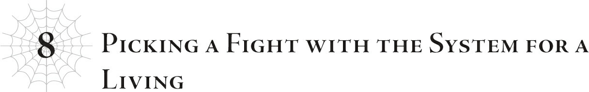
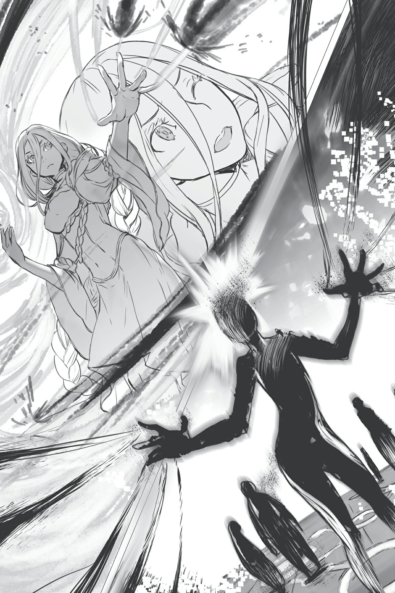

# Chương 8: Gây chiến với Hệ thống kiếm sống
*(Chapter 8: Picking Fight with the System for a Living)*

Aaa, nằm thế này thật dễ chịu và thoải mái quá đi mất.

Tôi đã ngủ một giấc rất ngon, đúng thế đấy.

Bây giờ tôi cảm thấy sảng khoái và tràn đầy năng lượng rồi.

“Chào buổi sáng.”

“Chào buổi sáng.”

Tôi chui ra khỏi cái kén mềm mại.

“Được rồi, lần này tôi đi thật đấy.”

“Ừm. À, cơ mà trước đó, cầm lấy cái này đi.”

Hửm?

Ma Vương đưa cho tôi một thứ gì đó.

“...Hả?”

“Cậu cần cái đó mà, đúng không?”

Phải rồi, vật mà cô ấy đưa cho tôi chắc chắn là thứ tôi đang cần.

“Cảm ơn nhé. Giúp ích nhiều lắm đấy.”

“Có gì đâu mà khách sáo. Người đang giúp tớ là cậu cơ mà.”

Nhưng thứ này chắc chắn sẽ giúp công việc của tôi dễ thở hơn nhiều.

“Đây là tất cả những gì tớ có thể làm rồi...”

...Cô thực sự không cần phải bận tâm về chuyện đó đâu.

Dù sao thì, lý do ngay từ đầu tôi quyết định cứu thế giới này chính là vì bản thân Ma Vương mà.

“Được rồi, tôi sẽ về sớm thôi.”

“Ừm, đi đường bình an nhé. Cẩn thận đấy.”

...Màn đối thoại vừa rồi làm chúng tôi nghe giống như một gia đình vậy.

Trời ạ, tôi thấy hơi ngượng rồi đấy nhé.

Tôi lập tức dịch chuyển đi để che giấu sự xấu hổ của mình.

Khi tôi xuất hiện trở lại, đó là một không gian thực sự rất kỳ lạ.

Đây chính là trung tâm của hệ thống.

Một ma pháp trận khổng lồ tạo thành những hoa văn hình học phức tạp trải dài khắp sàn nhà.

Nó thậm chí còn lan rộng lên cả tường và trần nhà, tỏa ra luồng ánh sáng mờ ảo, huyền bí.

Và ở chính giữa là một người phụ nữ, nửa thân dưới của cô ấy đã biến mất như thể đang tan chảy vào không gian, lơ lửng giữa không trung giống như đang bị ma pháp trận trói buộc tại đó.

Nữ thần Sariel.

Lõi của hệ thống, vật tế hiến dâng cho thế giới này, và là người quan trọng mà Ma Vương gọi là Mẹ.

`<Độ thông thạo đã đạt đến mức yêu cầu.>`

`<Kinh nghiệm đã đạt đến mức yêu cầu.>`

`<Độ thông thạo đã đạt đến mức yêu cầu.>`

Và dù đôi môi của Nữ thần không hề mấp máy, âm thanh hỗn loạn từ giọng nói của cô ấy vẫn vang vọng và chồng chéo lên nhau không ngớt trong căn phòng này.

Những thông báo hệ thống mà Thần Ngôn Giáo coi là tiếng nói của thần.

Đến nơi này khiến tôi cảm thấy cực kỳ khó chịu.

Tại sao ư? À thì, mọi thứ đập vào mắt trong căn phòng này đều đáng sợ, thế thôi.

Có lẽ vì nó phơi bày việc con người trong quá khứ thực sự ích kỷ đến nhường nào, hoặc cũng có thể là dù Ma Vương vô cùng kính yêu và tha thiết muốn cứu cô ấy, nhưng bản thân Nữ thần lại không hề chia sẻ mong muốn đó.

“......”

Tôi lắc đầu nhẹ để xua tan những suy nghĩ ấy.

Khắp căn phòng bí ẩn, rải rác đây đó là những con nhện trắng nhỏ bé.

Đó là các phân thân liên quan hệ thống của tôi, và chúng đã ở tư thế sẵn sàng.

Có mười bốn ma pháp trận đặc biệt nổi bật trong phòng, phân bố xung quanh Nữ thần ở trung tâm.

Đó là các ổ khóa.

Tôi có thể mở chúng bằng cách đưa các chìa khóa tương ứng vào.

Đầu tiên, tôi sẽ mở bảy ổ khóa mà tôi đã có sẵn chìa.

Sáu chiếc tôi đã có từ trước, và chiếc thứ bảy mà Ma Vương đưa cho tôi trước khi tôi đi.

Vì tôi đang mở chúng một cách hợp lệ nên cho đến giờ vẫn chưa có vấn đề gì.

Phần tiếp theo mới là thử thách thực sự.

Tôi di chuyển các phân thân liên quan hệ thống đến tiếp xúc với các ma pháp trận tương ứng với những kỹ năng Kẻ thống trị chưa có chủ.

Công cuộc bẻ khóa chuẩn bị bắt đầu.

Nhưng đúng lúc đó, một giọng nói sắc lẹm đột ngột vang lên ngắt lời.

“Phát hiện sự bất thường.”

Khác với những giọng nói chồng chéo vang vọng suốt từ nãy đến giờ, câu này rõ ràng được phát ra từ chính miệng của Nữ thần.

“Xác nhận có sự can thiệp từ bên ngoài. Kích hoạt cơ chế phòng vệ.”

...Ừm, đúng như tôi dự đoán.

Sức mạnh bắt đầu tụ lại xung quanh Nữ thần.

Đó chính là cơ chế phòng vệ hay thứ gì đó tương tự đang chuẩn bị khai hỏa.

Dù sao thì tôi cũng đang có hành vi xâm nhập gia cư bất hợp pháp mà.

Nên việc ở đây có hệ thống chống trộm cũng chẳng có gì đáng ngạc nhiên.

Thực tình, tôi đã biết trước chuyện này sẽ xảy ra rồi.

Nhất là vì tôi đã từng kích hoạt cơ chế phòng vệ này một lần trước đây.

Chính là trong cuộc chiến, khi tôi cố gắng xóa bỏ chức năng Anh hùng.

Cơ chế phòng vệ đã kích hoạt y như thế này, và các phân thân đang cố gắng chỉnh sửa hệ thống của tôi đều bị tiêu diệt hoàn toàn về mặt lý thuyết.

Kết quả là tôi đã thất bại trong việc loại bỏ chức năng Anh hùng, và trong số bao nhiêu người, Yamada lại là kẻ được chọn làm Anh hùng mới.

Vì các phân thân liên quan hệ thống không được chế tạo để chiến đấu, nên đây là công việc vượt quá khả năng của chúng.

Những luồng năng lượng ngưng tụ xung quanh Nữ thần, dần hình thành các bóng đen.

Chúng trở thành những chiếc bóng đen kịt, chỉ vừa vặn mang hình dáng của con người.

Tổng cộng có mười hai bóng đen.

Liệu có thể gọi mấy thứ này là người không nhỉ?

“Bắt đầu tiêu diệt.”

Trong lúc suy nghĩ của tôi đang vẩn vơ theo một hướng ngớ ngẩn, Nữ thần ra lệnh, và tất cả các bóng đen lập tức chuyển động cùng lúc.

Chúng lao thẳng về phía tôi—và khoan đã, nhanh quá vậy?!

Ngay khi tôi nhanh chân lách người sang một bên, một nắm đấm sượt qua mặt tôi kèm theo một luồng gió lốc.

Một trong những bóng đen đã áp sát tôi với tốc độ nhanh đến điên cuồng và suýt chút nữa đã đấm trúng mũi tôi.

Chết tiệt, nhanh thật đấy!

Nhanh kinh hoàng luôn!

Úi chà!

Phù, hú vía.

Có lẽ tôi đã không đủ cẩn thận rồi.

Kể từ khi sử dụng thành thạo sức mạnh thần thánh của mình, có vẻ tôi đã hơi tự mãn một chút.

Sao tôi lại có thể suýt bị đấm trúng bởi một cú đấm báo trước lộ liễu như thế được chứ?

Khoan đã, lại một con nữa sao?!

Vẫn là bóng đen đó lại lao về phía tôi.

Về cơ bản nó chỉ vung nắm đấm một cách hoang dại, chẳng có chút kỹ thuật hay trau chuốt nào cả.

Nhưng với tốc độ không tưởng đó, nó vẫn là một mối đe dọa khá nghiêm trọng!

Dù vậy, vì nó lao tới theo một đường thẳng nên việc né tránh cũng khá đơn giản.

Tôi lách người né cú đấm lộ liễu kia và tránh được nó một lần nữa.

Ngay sau khi cái bóng đen lướt qua, một tiếng nổ lớn vang lên theo sau.

Âm thanh phát ra muộn hơn—điều đó có nghĩa là nó đang di chuyển nhanh hơn tốc độ âm thanh sao?!

Chẳng lẽ xét về tốc độ thuần túy, những bóng đen này còn nhanh hơn cả Ma Vương ư?

Trong lúc tôi đang tự hỏi về điều đó, một lưỡi dao vô hình bay thẳng về phía tôi.

Úp, hóa ra chúng không chỉ có mỗi tốc độ.

Khoan đã, đây là tơ sao?!

Những vũ khí đang lao về phía tôi là các sợi tơ cực kỳ mảnh, mắt thường không thể nhìn thấy được.

Có tổng cộng mười sợi tất cả.

Có vẻ như một trong những bóng đen đã bắn tơ ra từ mười đầu ngón tay của nó và đang điều khiển chúng.

Hắc. Ngươi nghĩ ngươi có thể đấu tơ với ta sao?!

Đến lúc dạy cho ngươi biết thế nào là lễ độ rồi!

Tôi sẽ lật ngược thế cờ trong nháy mắt cho xem!

Thế là tôi cũng bắn mười sợi tơ ra từ mười đầu ngón tay của mình, chặn đứng đòn tấn công của bóng đen kia.

Ha ha ha! Ngươi nghĩ mấy sợi tơ yếu ớt đó có thể chạm được tới chân ta—khoan đã, á á á—?!

Chúng tôi thực sự ngang tài ngang sức!

Nhưng làm sao có thể chứ?!

Ngươi muốn bảo với ta là có một người dùng tơ có thể chiến đấu ngang hàng với tôi sao?!

Những sợi tơ của chúng tôi quất vào nhau tanh tách như những chiếc roi da, xoay vần và lừa lọc lẫn nhau bằng những cú kéo và xoắn khi chúng tôi cố gắng cắt đứt tơ của đối phương.

Đó là một cuộc đọ sức vô cùng gay cấn.

Và rồi bóng đen tốc độ lại lao tới phía tôi!

Tôi đành tạm gác cuộc chiến với bóng đen tơ sang một bên để lùi lại giãn khoảng cách.

Thế rồi một bóng đen khác đột ngột xuất hiện ở ngay phía sau tôi.

Ngươi mò tới đó từ lúc nào thế hả?!

Không có thời gian để quay đầu lại, tôi bắn thẳng một ngọn `Hắc Thương` từ lưng ra phía sau.

Nhìn thì không được ngầu cho lắm, nhưng tôi có thể thi triển thuật thức từ bất kỳ bộ phận nào trên cơ thể!

Kẻ định đánh úp tôi lại bị tôi đánh úp ngược lại!

Hoặc ít nhất là tôi đã nghĩ thế—nhưng rồi nó biến mất đột ngột y như lúc xuất hiện.

Lần này, tôi cẩn thận cảm nhận sự hiện diện của nó và phát hiện ra cách nó dịch chuyển xung quanh!

Bóng đen đó đang biến cơ thể thành dạng sương mù để tạo cảm giác như thể nó đã biến mất.

Quả nhiên, làn sương mù tụ lại và hiện hình trở lại thành bóng đen.

Khả năng giống như ma cà rồng đó là thế nào vậy?!

Vampy cũng có thể làm trò đó mà, đúng không?! Dù cô ấy và Mera thực sự chưa bao giờ dùng đến nó!

Và giờ lại thêm tơơơ nữa sao?!

Tơ bao vây lấy tôi hoàn toàn, nhốt tôi vào bên trong.

Rút lui! Dịch chuyển!

Tôi trốn thoát bằng `[Dịch chuyển Cự ly ngắn]`.

Phù. Giờ tôi có thể lấy lại—khoan đã, cái gì—?!

Bóng đen tốc độ vừa mới sượt qua tôi sao?!

Khoan đã, dừng cuộc chơi chút coi!

Cho xin một giây đi!

`[Phân tách Không gian]`!

Tôi cắt đứt không gian xung quanh mình, tạo ra một rào chắn chân không hình lập phương.

Vì toàn bộ không gian đã được tách biệt, nên không đòn tấn công vật lý hay ma pháp nào có thể xuyên qua được.

Bạn phải có trình độ thuật thức không gian ở đẳng cấp của tôi thì mới mong đột nhập vào được từ bên ngoài.

Nói cách khác, rào chắn này gần như là vô địch.

Nhược điểm duy nhất là nó cũng chặn đứng hoàn toàn ánh sáng và âm thanh, nghĩa là tôi cũng không thể biết chuyện gì đang xảy ra ở bên ngoài.

Dù sao đi nữa, thứ này sẽ bảo vệ tôi khỏi các đòn tấn công của kẻ địch.

Tôi sẽ tận dụng khoảnh khắc này để bình tĩnh lại một chút.

Được rồi, các bóng đen thuộc cơ chế phòng vệ của hệ thống mạnh hơn nhiều so với những gì tôi kỳ vọng.

Có thể tôi đã bất cẩn, tự mãn hay gì đó, nhưng ngay cả như thế, việc chúng có thể dồn tôi vào chân tường thế này chẳng phải là rất kỳ lạ sao?

Tôi là thần đấy, nhớ không?

Xét về mặt năng lượng, tôi chắc chắn mình mạnh hơn nhiều so với thời còn là Arachne...

Tuy nhiên, thế mạnh hiện tại của tôi là thuật thức không gian. Nếu tính theo chỉ số hệ thống, tôi nghĩ mình vẫn sẽ thua Ma Vương một chút.

Dù vậy, tôi ước tính bản thân cũng sở hữu nguồn sức mạnh tương đương với mức chỉ số khoảng 50.000 đến 60.000.

Vậy thì việc tôi vẫn chật vật chống đỡ trước mấy thứ này có nghĩa là thế quái nào chứ?

Giống như tôi đang phải chiến đấu với một lũ có sức mạnh ngang tầm Ma Vương vậy.

Không, tôi nghĩ riêng lẻ từng con thì chắc là yếu hơn Ma Vương, nhưng vẫn cực mạnh.

Có lẽ so sánh với Vampy hay cậu Oni thì hợp lý hơn?

Đúng vậy, tầm đó có vẻ chuẩn xác.

Và có tới mười hai con như thế chứ không ít...

Hơn thế nữa, cho đến nay, tôi mới chỉ xác nhận được khả năng của ba con: bóng đen tốc độ, bóng đen tơ và bóng đen sương mù.

Tôi còn chưa biết chín con còn lại có thể làm được những gì.

Xem xét độ độc đáo của ba con đầu tiên, tôi thực sự nghi ngờ việc chín con còn lại chỉ là những kẻ chiến đấu đại trà được sản xuất hàng loạt.

Tốt nhất là cứ nên giả định rằng chúng cũng sở hữu những năng lực điên rồ nào đó đi.

Tôi đoán mình cũng nên trông đợi điều này từ cơ chế phòng vệ bảo vệ chính hệ thống chứ.

Tình huống này chưa đến mức tuyệt vọng, nhưng chắc chắn là sẽ khó nhằn hơn tôi tưởng ban đầu rồi.

Được rồi!

Tôi đã bình tĩnh lại một chút.

Hãy thử lại lần nữa xem nào.

...Trước hết, việc tắt rào chắn ngay bây giờ sẽ rất nguy hiểm.

Thay vào đó, tôi sẽ dịch chuyển thẳng ra một vị trí bên ngoài rào chắn.

Ngay lập tức, tôi thoát khỏi không gian tối tăm và không có một tiếng động kia.

Và thứ đầu tiên đập vào mắt tôi là, trời đất ơi, cả một đàn nhung nhúc những... thứ gì đó.

Có quá nhiều sinh vật dạng bóng đen đến mức bạn thậm chí không thể nhìn thấy cái hộp `[Phân tách Không gian]` mà tôi vừa ở bên trong một giây trước.

Ừm, tôi khá chắc là lúc trước đâu có mấy thứ này...

Mấy sinh vật này từ đâu chui ra vậy...?

Ồ, thôi khỏi cần đoán nữa. Tôi nhìn thấy nguồn gốc của chúng ngay kia rồi.

Một trong những bóng đen hình người đang liên tục tạo ra một đống quái vật.

Tên kia rõ ràng là thủ phạm rồi.

Chẳng lẽ nó cứ liên tục sinh ra lũ quái vật vô hạn này nếu tôi không ngăn nó lại sao...?

Xem ra tôi phải tiêu diệt tên đó thật nhanh mới được.

À, nhưng trước hết...

Tôi tạo ra một bức tường `[Phân tách Không gian]` ngay trước mặt mình.

Thế rồi bóng đen tốc độ tông sầm vào đó.

Nếu ngươi cứ liên tục dùng một chiêu thức trong khoảng thời gian ngắn như vậy, thì dù ngươi có nhanh đến mấy tôi cũng sẽ nhìn thấu thôi, đồ ngốc.

Bóng đen tốc độ đâm vào bức tường `[Phân tách Không gian]` khi đang ở vận tốc tối đa của nó, và kết quả là nó phải nhận toàn bộ lực phản chấn.

Một bức tường bình thường có lẽ sẽ hấp thụ một phần lực tác động, nhưng đây là một vết cắt thực sự trong cấu trúc không gian chứ không phải bức tường vật lý thông thường.

If tông vào nó, bạn sẽ phải chịu đựng từng chút lực tác động trực diện vào mặt mình.

Bóng đen tốc độ ngã quỵ xuống sàn.

Đã giải quyết xong một con.

...Hoặc là tôi đã nghĩ thế, cho đến khi một tia sáng từ một bóng đen khác bắn trúng lưng của con đang bị thương.

Bóng đen tốc độ lập tức bật dậy như chưa hề có cuộc chia ly.

Ugh. Chúng có cả trị liệu sư sao...?

Nếu bóng đen trị liệu có thể hồi phục cho những con khác, tôi phải tiêu diệt nó trước, nếu không nó sẽ liên tục hồi sinh cho lũ bóng đen kia mất.

Vậy là bóng đen triệu hồi và bóng đen trị liệu.

Đó là hai mục tiêu ưu tiên hàng đầu của tôi, nhưng tôi nên nhắm vào con nào trước đây?

Tôi đoán có lẽ là con trị liệu.

Chẳng có ích gì nếu hạ gục bóng đen triệu hồi trước mà bóng đen trị liệu lại lập tức hồi sinh nó.

Tiêu diệt trị liệu sư. Không nhân nhượng.

Tất cả những gì tôi phải làm bây giờ là né tránh bóng đen tốc độ đã hồi phục, bóng đen tơ, bóng đen sương mù, đàn quái vật bóng đêm, và bất kỳ thứ gì khác lao về phía tôi, đồng thời nhắm thẳng vào bóng đen trị liệu.

Bóng đen tốc độ chỉ biết dùng các đòn húc thẳng đơn giản, còn bóng đen tơ thì thực ra sẽ dễ tránh hơn nếu tôi không cố đấu tơ với nó.

Chỉ cần tôi cẩn trọng với bóng đen sương mù, tôi có thể biết khi nào nó sắp sửa hiện hình.

Trước đây tôi không kịp phản ứng vì không ngờ tới và phải chống đỡ một đòn tấn công khác cùng lúc, nhưng giờ thì mánh khóe của nó đã bị lộ rồi.

Còn về đàn quái vật bóng đêm nhung nhúc kia thì cũng chẳng có gì đáng ngại.

Nói thật lòng thì, lũ tay sai này khá yếu.

Tôi thậm chí có thể quét sạch toàn bộ chúng bằng vài quả đạn hắc ám được triệu gọi liên tục làm màn sương khói che mắt.

So với các bóng đen, chúng cơ bản là tầm thường.

Dù có lẽ đó là lý do vì sao bóng đen triệu hồi có thể tạo ra chúng nhanh đến thế.

Tôi vừa quét sạch đợt này thì đợt khác đã lập tức ùa ra. Cực kỳ phiền phức luôn.

Hơn thế nữa, chúng phối hợp tác chiến với nhau khá ăn ý.

Đó có lẽ là nhờ bóng đen đứng cạnh bóng đen triệu hồi, liên tục chỉ tay về phía tôi và ra lệnh bằng các cử chỉ.

Chẳng lẽ đó là năng lực liên quan đến chỉ huy sao?

Cũng có thể nó đang ban cho chúng một loại bùa lợi tăng cường chỉ số nào đó nữa.

Có vẻ nó đang ra lệnh cho tất cả các bóng đen, bao gồm cả lũ quái thú kia, đó là lý do tại sao chúng có thể phối hợp các đòn tấn công nhắm vào tôi.

Chuyện này cũng khá là phiền đây.

Nhưng dù thế nào đi nữa, bóng đen trị liệu vẫn là ưu tiên số một!

Né tránh các đòn tấn công liên tục từ lũ quái thú, bóng đen tốc độ vân vân, tôi phóng một ngọn `Hắc Thương` về phía bóng đen trị liệu.

Đòn tấn công của tôi lao vun vút về phía mục tiêu, nhưng rồi một bóng đen khác đột ngột nhảy ra chắn trước mặt con trị liệu và đỡ đòn.

Con này có một chiếc khiên.

Không thể tin nổi là nó chặn được thuật thức của tôi...

Xem ra bóng đen này cũng khá mạnh đây.

Mỗi con trong số chúng hẳn phải có chỉ số lên tới hàng chục ngàn. Có khi còn ngang ngửa với quái vật cấp huyền thoại ấy chứ?

Sẽ là bất khả thi nếu phải đối đầu với mười hai con như thế này nếu sức mạnh của bạn bị trói buộc bởi các giới hạn của hệ thống, đúng không?

Ma Vương có lẽ có thể xử lý được chúng...

Không, tôi đoán dù là cô ấy thì việc đơn đấu với cả lũ cũng rất khó khăn đấy chứ nhỉ?

Có lẽ cô ấy sẽ làm được nếu mang theo lũ nhện rối và thêm một số viện binh khác?

Nếu ngay cả Ma Vương cũng thấy khó khăn thì đây bình thường đúng là một màn chơi có độ khó không tưởng rồi.

Xem ra điều này có nghĩa là hệ thống thực sự không muốn bạn gian lận.

Nhưng tôi vẫn sẽ làm đấy!

Bóng đen trị liệu đột ngột bị chia làm đôi.

Tôi đã dùng `[Phân tách Không gian]` để cắt nó ra làm hai nửa.

Vì tôi can thiệp trực tiếp vào cấu trúc của không gian, nên về mặt vật lý là không thể phòng đỡ được.

Bạn phải giỏi thao tác không gian ít nhất là ngang bằng tôi, nếu không thì cách duy nhất là phải né tránh.

Nhưng tôi cực kỳ tự tin vào khả năng không gian của mình, và đòn này hoàn toàn không có dấu hiệu báo trước, khiến việc cảm nhận hay dự đoán để né tránh gần như là bất khả thi.

Nói cách khác, đây là một đòn tấn công hoàn toàn gian lận, về cơ bản là sẽ giết chết mục tiêu ngay khi kích hoạt.

Thế là giải quyết xong một con.

...Ngoại trừ việc tôi lại sai lầm. Một lần nữa.

Một bóng đen trông khá tròn trịa chạy đến bên bóng đen trị liệu và rọi ánh sáng vào nó.

Bóng đen trị liệu lại đứng dậy như thể chưa có chuyện gì xảy ra.

Ôi, thôi đi mà.

Ngươi thậm chí có thể hồi sinh người chết sao?

Và ngoài con trị liệu đó ra còn có một con khác nữa à?!

Tôi đâu có được báo trước về vụ này đâu!

Thôi nào, đùa tôi chắc! Nghe đây hả hệ thống!

Tôi biết đây là cơ chế phòng vệ của lõi hệ thống, nhưng ngươi có thực sự nên ban cho chúng khả năng hồi sinh người chết—thứ về cơ bản đứng đầu trong danh sách những điều cấm kỵ tuyệt đối ở thế giới này không hả?

Ý tôi là, ngươi chỉ có thể thu thập năng lượng khi ai đó chết đi trong thế giới này, nên việc ngăn cản điều đó bằng cách hồi sinh ai đó đáng lẽ phải là chuyện không tưởng chứ.

Tôi sẽ không nói là nó phạm quy, nhưng nó chắc chắn một trăm phần trăm đi ngược lại phép lịch sự thông thường.

Và bản thân hệ thống lại dám ngang nhiên vi phạm cái quy tắc ngầm này sao? Hửửửm?

Chỉ có duy nhất một kỹ năng có thể hồi sinh người chết, đó chính là `[Từ Bi]` của Yamada.

Ngươi đang hoàn toàn phá hỏng sự cân bằng của trò chơi rồi đấy, ông bạn ạ.

Đây có phải là hình phạt từ người quản trị đối với một người chơi vi phạm quy tắc không vậy?

Tôi có nên thấy biết ơn vì tài khoản của mình không bị khóa ngay tại chỗ không đây?

Với sức mạnh của D, tôi chắc chắn cô ta có thể áp đặt một hình phạt xóa sổ tôi ngay lập tức nếu cô ta thực sự muốn.

Vì điều đó không xảy ra, nghĩa là cô ta vẫn đang nương tay một chút.

Và nếu cô ta vẫn đang nương tay, thì D vẫn muốn đây là một thử thách có thể vượt qua được.

Dù tôi khá chắc là cô đã thiết lập sai lệch nghiêm trọng độ khó của màn này rồi!

Hay là cô cố tình làm thế?

Có phải D đang đòi hỏi tôi phải tự mình xoay xở trước một thứ điên rồ như thế này không?

...Được rồi, thực ra thì tôi hoàn toàn có thể hình dung ra điều đó.

D về cơ bản đã nói rằng cô ta thấy chán thế giới này và muốn vứt bỏ nó vì nó cứ đứng dậm chân tại chỗ.

Nói cách khác, con người ở thế giới này không đáp ứng được các tiêu chuẩn của D.

Đúng là phong cách của Tà thần mà.

Bắt họ chơi ở chế độ siêu khó, rồi sau đó thấy chán và ném họ sang một bên chỉ vì họ không thể phá đảo...

Chẳng phải như thế là hơi bị quá ích kỷ sao?

Nhưng tôi đoán điều đó chỉ có nghĩa là cô ta quá mạnh đến mức người ta buộc phải tha thứ cho cô ta, hay đúng hơn là không còn lựa chọn nào khác ngoài việc để cô ta thích làm gì thì làm.

Ngay cả tôi cũng chẳng có tư cách gì để phàn nàn.

Tôi đoán đây là một ví dụ thực tế của việc quyền lực tuyệt đối sẽ tha hóa tuyệt đối...

Có khi việc thế giới này rơi vào tình cảnh hỗn độn thế này thực sự là lỗi của D đấy nhỉ?

Tiêu chuẩn của cô ta quá cao, khiến việc chiến thắng trở thành bất khả thi...

Điều đó chắc chắn sẽ lý giải vì sao Ma Vương, Giáo hoàng, và tất cả bọn họ chưa bao giờ được đền đáp xứng đáng bất chấp mọi nỗ lực không ngừng nghỉ của mình.

Nghĩ đến đây thực sự bắt đầu làm tôi thấy ngứa mắt rồi đấy nhé.

Tại sao Ma Vương lại phải chịu đựng đau khổ vì những đòi hỏi ngu ngốc của cái tên khốn đó chứ?

Thực ra, chính tôi cũng đang phải chịu khổ vì nó ngay giây phút này đây!

Tôi sử dụng `[Phân tách Không gian]` để cắt đôi bóng đen tốc độ.

Nhưng ngay sau đó, bóng đen tơ, bóng đen sương mù và một lũ quái thú ào ạt lao vào tôi, buộc tôi phải quay về thế phòng thủ.

Và trong lúc tôi đang bận né tránh, bóng đen hồi sinh lại đưa con bóng đen tốc độ ngu ngốc kia trở lại.

Chúng tôi cứ lặp đi lặp lại cái vòng tuần hoàn này mãi.

Tôi tiêu diệt bóng đen tốc độ nhiều nhất, nhưng cũng đã hạ gục bóng đen tơ và bóng đen sương mù mỗi con vài lần.

Nhưng cứ mỗi lần như thế, chúng lại được hồi sinh.

Nếu tôi giết chúng ngay lập tức bằng `[Phân tách Không gian]`, bóng đen hồi sinh sẽ chữa trị cho chúng; còn nếu tôi không hạ gục được chỉ bằng một đòn, bóng đen trị liệu sẽ làm việc đó thay thế.

Tôi cảm thấy mình như đang chơi một trò đập chuột không có hồi kết vậy.

Có vẻ như bóng đen hồi sinh là con duy nhất có thể đưa người chết trở lại, chứ không phải con trị liệu.

Nên nếu tôi có thể tiêu diệt con đó trước, mọi chuyện sẽ dễ thở hơn rất nhiều, nhưng rõ ràng là kẻ địch cũng nhận thức quá rõ điều đó.

Thế nên các bóng đen khác đã ra sức bảo vệ bóng đen hồi sinh một cách điên cuồng.

Bóng đen dùng khiên và bóng đen kết giới liên tục canh giữ nó không rời một bước.

Về mặt lý thuyết, `[Phân tách Không gian]` của tôi vẫn có thể hạ gục mục tiêu bất kể có những bức tường chắn đường đi chăng nữa.

...Nhưng trên thực tế, chúng đã tìm ra cách để ngăn chặn tôi.

Bạn hỏi bằng cách nào mà chúng có thể phòng thủ trước một đòn tấn công tức tử bất chấp khoảng cách hay hàng phòng ngự của kẻ địch ư?

Về nguyên lý thì nó tương tự như hiệu ứng triệt tiêu ma pháp của loài rồng.

Vảy rồng và các kỹ năng liên quan đến kết giới sẽ can thiệp vào các thành phần cấu tạo cơ bản của ma pháp, làm suy yếu hiệu quả của phép thuật.

Và phần cấu tạo đó thực ra cũng không có gì khác biệt đối với thuật thức.

Về mặt lý thuyết, bất kỳ kỹ năng nào có thể chặn ma pháp thì cũng có thể cản trở thuật thức của tôi.

Chỉ là nó đòi hỏi một công suất đầu ra cao hơn nhiều, vì thứ mà các ngươi phải chặn là thuật thức của tôi cơ mà.

Tôi là một cựu chuyên gia ma pháp từng sở hữu kỹ năng `[Cực đỉnh Thần bí]` đấy nhé, biết chưa?

Dù bây giờ nó là thuật thức chứ không phải ma pháp nữa, tôi vẫn mạnh mẽ như cũ thôi!

...Tôi nghĩ thế.

Nhưng hiện tại, thuật thức của tôi đang bị cản trở.

Bởi bóng đen dùng khiên và bóng đen kết giới.

Một con rõ ràng đang cầm một chiếc khiên đơn giản, còn con kia thì tạo ra các tấm kết giới trong suốt đơn giản.

Tôi nghĩ chính con sau mới là kẻ đang chặn thuật thức của tôi.

Nhưng thật khó tin là chỉ một mình nó có thể đơn phương vô hiệu hóa sức mạnh của tôi, nên tôi giả định bóng đen dùng khiên cũng sở hữu một loại hiệu ứng cản trở nào đó.

Về cơ bản, hai con đó đang hợp lực để bóp nghẹt ma lực của tôi.

Mặc dù thuật thức không gian là sở trường của tôi, và tôi có thể triển khai nó mà không tốn nhiều công sức, nhưng nó vẫn sử dụng các cổ tự cấp cao cực kỳ phức tạp.

Nên việc tôi không thể xuyên phá được phòng tuyến phong tỏa của hai cái bóng đen ngu ngốc kia hoàn toàn không phải lỗi của tôi nhé!

Ít nhất thì đó là cái cớ tôi sẽ dùng.

Trong thực tế, thuật thức không gian vốn dĩ bắt nguồn từ chính cấu trúc của không gian.

Nếu phần không gian mục tiêu nằm trong phạm vi cản trở, cấu trúc sẽ bị sụp đổ ngay khi vừa bắt đầu kích hoạt, khiến nó dễ bị kết giới hơn các loại thuật thức khác.

Bạn hẳn sẽ nghĩ thế thì tôi cứ bắn chúng từ xa bằng các loại thuật thức khác là được chứ gì, nhưng trò đó cũng không hoạt động nốt.

Tôi đã thử phóng vài ngọn `Hắc Thương`, nhưng chúng lập tức mất đi phần lớn uy lực ngay khi chạm vào kết giới, rồi bị bóng đen dùng khiên chặn lại và tiêu tán hoàn toàn.

Grrr.

Khả năng gây nhiễu ma pháp của lũ này mạnh đến điên cuồng luôn.

Có khi còn ngang ngửa với Vampy ấy chứ nhỉ?

Nhờ danh hiệu `[Kẻ Thống Trị Đố Kỵ]`, Vampy sở hữu kỹ năng đã đạt cấp tối đa là `[Thần Lân]`, kỹ năng vảy kháng ma mạnh nhất của loài rồng.

Về cơ bản, đó là kỹ năng chặn ma pháp mạnh nhất từng tồn tại.

Theo như tôi có thể nhận thấy, bóng đen dùng khiên và bóng đen kết giới có khả năng cản trở ma pháp ngang ngửa với của Vampy.

Thực ra, không biết có phải ảo giác không nhưng hình như cái kết giới đó còn mạnh hơn cả của cô ấy nữa?

Trời ạ, phiền phức quá đi mất.

Tôi biết phải làm sao với mấy tên này đây...?

Nghiêm túc đấy, mỗi con trong số chúng đều đủ mạnh để tự mình chọi cả một đội quân...

Làm sao tôi có thể chiến đấu với mười hai con như thế này được chứ...?

Bây giờ tôi thực sự bắt đầu phát ngán rồi đấy.

Cho đến nay, chúng ta có bóng đen tốc độ, bóng đen tơ, bóng đen sương mù, bóng đen triệu hồi, bóng đen chỉ huy, bóng đen trị liệu, bóng đen hồi sinh, bóng đen dùng khiên và bóng đen kết giới.

Tổng cộng là chín con.

Còn về ba con còn lại: Một con chỉ đứng yên trước mặt Nữ thần suốt từ nãy đến giờ không hề di chuyển.

Hai con kia thì đang rượt đuổi các phân thân liên quan hệ thống của tôi chạy vòng quanh.

Một con trong số đó dường như sở hữu cả một đống năng lực đa dạng; nó đang sử dụng đủ loại ma pháp để nã đạn vào các phân thân của tôi khi chúng chạy trốn trối chết.

Và nó cũng có vẻ như có năng lực kiểu như tâm động lực học (telekinesis) nữa, vì có cả đống kiếm, rìu, thương và các loại vũ khí khác nhau đang lơ lửng xung quanh nó chẳng vì lý do gì cả.

Nhưng việc chúng lơ lửng ở đó đồng nghĩa với việc nó có thể sử dụng tất cả đống vũ khí đó cùng lúc.

Đúng là một tên khốn đa tài đa nghệ.

Còn con cuối cùng thì, ừm, tôi cũng không rõ lắm.

Tôi có thể thấy nó đang cố làm gì đó với các phân thân của tôi, nhưng cho đến nay chúng vẫn kháng cự được tất cả các đòn tấn công của nó.

Trông như thể chúng đang bị tấn công bởi thứ gì đó vô hình, nhưng tôi không thể biết chính xác chuyện gì đang xảy ra.

Dù sao thì vì các phân thân vẫn hoàn toàn kháng cự được nên tôi có lẽ cứ lờ nó đi cũng được.

Nhưng xem xét việc tất cả các bóng đen khác đều mạnh mẽ như thế, tôi có cảm giác là nếu các phân thân sẩy chân thất bại trong việc kháng cự ở bất kỳ thời điểm nào, kết cục chắc chắn sẽ không mấy tốt đẹp.

Tuy nhiên vì nó đang nhắm vào các phân thân chứ không phải tôi, tôi giả định đó không phải thứ gì quá điên rồ như cái chết tức tử hay tương tự.

Khoan đã, ngộ nhỡ nó đúng là thế thì sao?

Kiểu như, nhỡ đâu chúng đang lên kế hoạch tiêu diệt các phân thân trông có vẻ yếu ớt trước thì sao.

Nhưng trò đó không hoạt động, nên là...

Trong trường hợp đó, tôi nghĩ sẽ hiệu quả hơn nếu nó giúp những con khác chiến đấu với tôi thay vì lãng phí thời gian đuổi theo các phân thân.

Và ngay khi ý nghĩ đó vừa lóe lên trong đầu tôi, bóng đen chỉ huy ra hiệu bằng cử chỉ nào đó và lập tức điều động hai con đó chuyển sang tấn công tôi thay thế.

Hừm.

Tôi không thể biết thứ gì đang đánh trúng các phân thân của mình, nhưng nếu nó thử nghiệm chiêu đó lên tôi, có lẽ tôi có thể phân tích được chăng?

Bóng đen bí ẩn vốn đang truy đuổi các phân thân quay người về phía tôi, và... ơ, ngươi đang làm cái trò mèo gì thế hả, người anh em?

Nó đang tạo dáng một cái tư thế rất kỳ quặc.

Kiểu như, cái tư thế kỳ lạ và khó tả nhất mà bạn có thể tưởng tượng ra ấy.

Nó đang cố tỏ ra ngầu lòi, hay là...?

Vì nó chỉ là một cái bóng đen kịt nên chẳng có khuôn mặt nào để nói tới cả, nhưng tôi gần như có thể tưởng tượng ra cảnh nó đang nháy mắt hay gì đó tương tự.

Đồng thời, đòn tấn công bí ẩn mà nó dùng lên các phân thân cũng lao về phía tôi, nhưng tất nhiên là tôi dễ dàng kháng cự được nó.

Ừm, được rồi...

Tôi nên phản ứng thế nào với chuyện này đây?

Ngươi không thể tự dưng quăng một trò hề ngớ ngẩn vào giữa một cảnh chiến đấu siêu nghiêm trọng thế này được chứ...

Bóng đen đổi tư thế tạo dáng khác.

Hả? Nghiêm túc đấy, tôi phải làm gì ở đây bây giờ?

Vì một đòn tấn công vô hình khác lại ập đến cùng lúc, việc tạo dáng chắc chắn phải có ý nghĩa nào đó, nhưng thế này thì hơi quá rồi...

Uuu, tôi đoán mình sẽ thử phân tích đòn tấn công bí ẩn này xem sao nhé?

Tôi hé nhìn vào bản chất của các đòn tấn công vô hình mà bóng đen bí ẩn kia đang liên tục gửi đến tôi.

...Àaa, tôi hiểu rồi.

Đó là một loại tấn công thuộc tính mê hoặc.

Loại đòn tấn công nhằm mục đích bắt mục tiêu phải tuân theo mệnh lệnh của mình.

Điều đó có nghĩa là những tư thế tạo dáng đó thực sự là để trông cho ngầu lòi...

Tôi đoán chúng được dùng để tăng cường hiệu quả mê hoặc hay gì đó tương tự.

Nhưng tôi là nhện, và tôi không có hứng thú lắm với chuyện tình yêu liên chủng tộc đâu...

Thêm nữa, tôi cũng là thần rồi, nhớ không?

Thần linh được cho là những thực thể tự bản thân đã hoàn hảo, nghĩa là họ không thực sự cần phải duy trì nòi giống. Hơn nữa, họ cũng hầu như không bao giờ chết.

Mục đích của việc sinh sản thường là để truyền lại bộ gen của bạn cho các thế hệ tương lai, đúng chứ?

Nhưng thần linh không có tuổi thọ giới hạn, và cái chết là một khái niệm xa lạ đối với các vị thần, nghĩa là họ có thể cứ thế tiếp tục tồn tại mà không cần sinh sản.

Và cảm xúc lãng mạn về mặt lý thuyết có liên quan đến việc sinh sản, và trạng thái bị `[Mê hoặc]` là một trạng thái bất thường tác động vào những cảm xúc lãng mạn đó, nên là...

Về cơ bản, điều tôi muốn nói là hiệu ứng mê hoặc không thực sự có tác dụng đối với thần linh...

Mặc dù rất nhiều vị thần trong thần thoại Trái Đất có những bộ phim truyền hình tình cảm dài tập vô cùng cẩu huyết.

Nhưng đó lại là câu chuyện khác rồi.

Dù sao đi nữa, nó không thực sự ảnh hưởng đến tôi.

Vì thứ này đã cố gắng dùng nó lên các phân thân mang hình dáng nhện rõ mồn một của tôi, nên nó hẳn phải hoạt động trên các loài khác, nhưng tôi nghĩ thế này thì hơi bị khiên cưỡng quá rồi đấy.

Và ngay cả khi tôi có những cảm xúc kiểu đó, tôi cũng sẽ không bao giờ đi rung động trước một cái bóng đen mờ ảo đang cố tạo dáng tỏ ra ngầu lòi đâu nhé!

Nếu ít nhất đó là một người có ngoại hình thu hút thì về mặt lý thuyết ý đồ đó còn có thể truyền tải được, chứ một cái bóng đen ngốc nghếch làm trò này thì hoàn toàn vô lý hết sức!

Bóng đen bí ẩn, hay tôi nên gọi là bóng đen mê hoặc, vẫn tiếp tục ra sức tạo dáng nhiệt tình và thậm chí cuối cùng còn thử cả vài điệu nhảy nữa, nhưng nó chưa bao giờ có tác dụng với tôi cả...

Thành thật mà nói, nhìn nó tự diễn một mình cả một buổi biểu diễn như thế làm tôi thấy hơi tội nghiệp cho nó luôn đấy.

...Dù sao thì, nó cũng không làm phiền tôi lắm. Tôi sẽ cứ lờ nó đi vậy.

Vì bóng đen đa tài chỉ đang đuổi theo các phân thân của tôi chứ không tấn công tôi, nên tôi cũng tạm thời để nó yên luôn.

Các phân thân liên quan hệ thống của tôi không có chút khả năng chiến đấu nào; chúng không thể trốn tránh các đòn tấn công của bóng đen đa tài mãi được.

Nhưng tôi có rất nhiều phân thân, nên chỉ cần chúng tập trung hoàn toàn vào việc né tránh, chúng ít nhất cũng có thể câu kéo thêm một chút thời gian.

Cũng phải mất một lúc thì lũ đó mới bị tiêu diệt hết được.

Miễn là tôi có thể tận dụng thời gian đó để tấn công các bóng đen khác và lật ngược thế cờ nghiêng về phía mình, tôi sẽ không phải lo lắng về chuyện đó.

Mặc dù trước hết tôi sẽ phải làm gì đó với con bóng đen hồi sinh này.

Và để làm được điều đó, tôi phải giải quyết bóng đen dùng khiên và bóng đen kết giới.

Và để đối phó với chúng, tôi bắt buộc phải tiếp cận cận chiến, vì các đòn tấn công tầm xa chẳng đi đến đâu cả, nhưng bóng đen tốc độ, bóng đen tơ và bóng đen sương mù đều cản đường tôi mỗi khi tôi cố gắng làm thế.

Thế là tôi lại cố gắng tiêu diệt ba con tiên phong đó trước, nhưng tất nhiên là bóng đen hồi sinh lại lập tức đưa chúng trở lại...

Và cái vòng lặp đó cứ thế tiếp diễn mãi không thôi.

Ugh, nghiêm túc đấy, đây là cái trò chơi tệ hại nhất tôi từng chơi!

Trong số ba kẻ tấn công tiên phong, bóng đen tốc độ không phải là mối đe dọa lớn.

Nó chắc chắn là nhanh đến điên cuồng, nhưng đòn tấn công duy nhất của nó dường như chỉ là húc thẳng một đường. Tôi sẽ không mắc bẫy trước một thứ cơ bản như thế.

Vấn đề nằm ở hai con còn lại.

Bóng đen tơ cực kỳ khó đoán.

Nó điều khiển mười sợi tơ, tấn công theo những quỹ đạo liên tục thay đổi.

Và nó có thể âm thầm gạt bỏ các đòn tấn công từ bất kỳ góc độ nào, đến mức bạn phải tự hỏi liệu nó có mắt ở sau gáy hay không.

Tôi không biết những cái bóng đen này có mắt hay không nữa, nhưng tạm thời đừng bận tâm về chuyện đó.

Ít nhất thì, dựa trên việc các bóng đen khác có xu hướng quay mặt về phía tôi và cố gắng dõi theo chuyển động của tôi, tôi giả định chúng sở hữu thị giác tương tự như con người bình thường.

Bóng đen tơ dường như là ngoại lệ duy nhất.

Con này có một loại năng lực dò tìm nào đó, nên nó không cần phải phụ thuộc vào thị giác.

Thế nhưng, phương thức tấn công của nó lại là những sợi tơ mỏng manh, khó nhìn thấy một cách ngớ ngẩn kia.

Cảm ơn nhé! Tôi ghét nó lắm đấy!

Mỗi khi tôi lọt vào hướng nhìn của bóng đen tơ, tôi có thể cảm nhận được năng lượng của mình đang bị hút đi một cách từ từ.

Tôi đoán đó là một thứ gì đó giống như `[Chú Oán Tà Nhãn]`, có hiệu ứng làm giảm dần HP, MP và tất cả các chỉ số của mục tiêu.

Bây giờ tôi đã là thần nên về mặt kỹ thuật không còn các chỉ số và đống rác rưởi đó nữa, nhưng có vẻ như nó có thể trực tiếp rút cạn mức năng lượng nội tại của tôi thay thế.

Vì lượng năng lượng bị mất đi là khá nhỏ nhặt nên nó không gây ra nhiều thiệt hại đáng kể, nhưng nó vẫn không đem lại cảm giác dễ chịu gì cho cam.

Kết cục là tôi cứ theo bản năng muốn tránh khỏi hướng nhìn của bóng đen tơ, điều này càng giúp kẻ địch dễ dàng đọc vị chuyển động của tôi hơn.

Vì nó gây ra quá ít sát thương nên tôi đáng lẽ chỉ cần lờ nó đi là được, và tôi thực sự đã cố gắng làm thế, nhưng tôi vẫn không thể ngăn bản thân theo bản năng muốn né tránh nó.

Lại cảm ơn phát nữa nhé! Tôi ghét tất cả những thứ này!

Và tệ hơn nữa, con này có thể né được cả `[Phân tách Không gian]`!

Tôi nghĩ có lẽ là vì nó có khả năng dò tìm không phụ thuộc vào thị giác—nó nắm bắt được một điềm báo vô cùng mờ nhạt nào đó và bằng cách nào đó né được các đòn tấn công của tôi.

Nên tôi không thể tiêu diệt nó chỉ bằng cách tung ra một đòn tấn công mà không suy nghĩ được.

Tôi phải lồng ghép thêm vài cú lừa hoặc kết hợp nó với các đòn tấn công khác.

Việc đó lại thêm một bước vào quy trình, cho đối thủ của tôi có thêm chừng đó thời gian.

Nhưng khoan đã! Vẫn chưa hết đâu!

Thỉnh thoảng, bóng đen tơ trúng phải một đòn `[Phân tách Không gian]` mà vẫn không chết.

Tôi hoàn toàn không hiểu làm sao lại thế được, nhưng bằng cách nào đó, nó vẫn tiếp tục di chuyển ngay cả với những vết thương rõ ràng là chí mạng.

Khi chuyện đó xảy ra, bóng đen trị liệu có thể chữa trị cho nó từ xa mà không cần bóng đen hồi sinh phải ra tay. Nói cách khác, nó phiền hà đến phát điên lên được.

Nó có thể né được `[Phân tách Không gian]` và đôi khi thậm chí còn sống sót ngay cả khi bị đánh trúng.

Tóm lại là: Tôi ghét nó!

Nhưng nếu tôi cố lờ nó đi, tôi sẽ phải nhận một loạt tơ và Tà Nhãn bắn tới không ngừng nghỉ để trả giá.

Ta ghét ngươi! Làm ơn chết đi giùm cái!

Đây là trận chiến tồi tệ nhất từ trước đến nay.

Nó mạnh, nhưng điều tồi tệ hơn là kiểu sức mạnh này tôi chưa bao giờ gặp phải trước đây.

Hầu hết những đối thủ mạnh nhất tôi từng đối đầu chỉ đơn giản là siêu mạnh, thế thôi.

Những kiểu xảo quyệt và ranh ma thay vì chỉ mạnh mẽ thuần túy thế này hiếm gặp hơn nhiều.

Có lẽ có vài con người với chỉ số thấp xoay xở để chiến đấu một cách ranh ma như vậy, nhưng một khi chỉ số của bạn đã vượt mốc 10.000, việc giải quyết mọi chuyện bằng sức mạnh cơ bắp thô bạo thường sẽ dễ dàng hơn nhiều.

Ngay cả một bậc thầy võ thuật cũng không thể chọi lại một tàu tuần dương Aegis, bạn hiểu ý tôi chứ?

Mà nếu thế thì thà tự mình kiếm một chiếc tàu tuần dương Aegis cho rồi, thế có phải dễ dàng hơn bao nhiêu không.

Nhưng cái bóng đen tơ này lại là trường hợp hiếm hoi sở hữu sức mạnh của một tàu tuần dương Aegis nhưng lại chiến đấu như một bậc thầy võ thuật.

...Được rồi, ngay cả tôi cũng không rõ mình đang muốn đi đâu với cái ví dụ đó nữa.

Dù sao thì, trái ngược hoàn toàn với bóng đen tơ ranh ma, bóng đen sương mù lại hoàn toàn dựa vào sức mạnh thuần túy của nó.

Đánh úp từ dạng sương mù.

Hóa thành một con sói khổng lồ lao vào tôi.

Tung ra những cú đấm dựa trên các chỉ số cao đến ngu ngốc của nó.

Các đòn tấn công ma pháp hệ bóng tối.

Những cú húc liều lĩnh dựa vào sự dẻo dai và khả năng tái sinh của chính nó.

Nếu bóng đen tơ chiến đấu bằng các chiến thuật thông minh của con người, thì bóng đen sương mù lại chiến đấu bằng sự bạo lực nguyên bản của một con quái vật trong phim kinh dị.

Cụ thể hơn thì, nó thực sự là một ma cà rồng.

Phong cách chiến đấu của nó khác với Vampy và Mera, nhưng phạm vi năng lực của nó chắc chắn đem lại cảm giác quen thuộc.

Trong khi Vampy và Mera sử dụng các chiến thuật tương tự như con người để tối đa hóa sức mạnh của họ, bóng đen sương mù này lại giống như sức mạnh thuần túy của một ma cà rồng hơn.

Kiểu như một ma cà rồng tiêu chuẩn vậy, tôi đoán thế.

Mặc dù tôi cũng không biết liệu có ma cà rồng nào thực sự được gọi là "tiêu chuẩn" hay không.

Xét đến việc nó cơ bản là một con quái vật trong hình hài nhân loại, có lẽ nó giống Ma Vương hơn là giống Vampy hay Mera.

Bạn có thể gọi đó là sức mạnh áp đảo của các chỉ số và kỹ năng, tôi đoán vậy.

Con này không khéo léo gần bằng bóng đen tơ, nhưng nó có sức mạnh thuần túy để bù đắp cho sự khác biệt đó.

Mặc dù vì ma cà rồng vốn dĩ đã ranh ma theo tự nhiên, tôi đoán nó cũng không hẳn chỉ đơn giản là "sức mạnh thuần túy".

Dù sao đi nữa, nó chắc chắn là rất mạnh.

Bóng đen tơ đôi khi sống sót sau `[Phân tách Không gian]` bằng thứ có vẻ như là ý chí thuần túy, nhưng đôi lúc bóng đen sương mù cũng xoay xở để sống sót được nốt.

Tuy nhiên trong trường hợp của nó, tôi nghĩ đó là vấn đề về việc sở hữu sinh mệnh lực và khả năng tái sinh siêu cao mà thôi!

Kẻ quái nào có thể tự dính các phần cơ thể lại với nhau và tự lành ngay lập tức khi cơ thể bị cắt làm đôi chứ?

Đôi khi nó thậm chí còn sử dụng khả năng tái sinh điên rồ đó để lao thẳng vào tôi mà không thèm phòng thủ, một trò chắc chắn là bất khả thi để đối phó đối với bất kỳ ai ngoại trừ tôi.

Các ngươi nghe rõ chưa! Ít nhất thì tôi vẫn đối phó được đấy nhé!

Dù nó có mạnh thế nào đi nữa, nó vẫn không thể xách dép cho Ma Vương được, và thậm chí có thể còn yếu hơn Vampy về nhiều mặt.

Nhưng nó vẫn sẽ là một mối đe dọa nghiêm trọng đối với bất kỳ con người thời hiện đại nào.

Mà nếu chỉ có một mình nó, tôi có thể xử lý dễ như ăn cháo.

Vấn đề là khi chúng hợp tác chiến đấu chống lại tôi, mọi chuyện trở nên khó khăn hơn rất nhiều, ngay cả khi bóng đen tơ và bóng đen sương mù không đến nỗi quá tệ nếu đấu tay đôi.

Và để mọi chuyện tồi tệ hơn, bóng đen tốc độ sẽ lao thẳng vào tôi nếu tôi chậm lại dù chỉ một giây.

Tôi rất dễ bỏ quên nó nếu chỉ tập trung hoàn toàn vào bóng đen tơ và bóng đen sương mù.

Thêm vào đó, làn sóng quái thú vô tận từ bóng đen triệu hồi cũng gây khó chịu ở một mức độ nào đó.

Chúng không đủ mạnh để đáng lưu tâm, nhưng vì có quá nhiều nên chúng gây mất tập trung đến phát điên.

Chúng cứ như một đàn ruồi giấm vo ve trước mặt tôi ở mọi ngã rẽ vậy.

Còn thứ gì có thể gây phiền nhiễu hơn thế nữa chứ?

Nếu không có một kế hoạch cụ thể để giải quyết tất cả những vấn đề khác nhau này, tôi chẳng làm được gì ngoài việc lãng phí thời gian.

Nhưng tôi cũng không gặp nguy cơ bị hạ gục.

Tôi biết mình cứ lải nhải về việc chúng mạnh thế nào, nhưng các bóng đen vẫn sở hữu các thông số cơ bản thấp hơn tôi nhiều.

Sự phối hợp của chúng đúng là một nỗi đau nhức nhối, và chúng chắc chắn đang trì hoãn các kế hoạch của tôi, nhưng chúng không có cách nào thực sự để kết liễu tôi cả.

Vì tôi có thể nhấp nháy khắp nơi bằng dịch chuyển và sử dụng `[Phân tách Không gian]` làm rào chắn phòng thủ tối thượng, nên việc các bóng đen này có thể thực sự đả thương tôi là khá khó khăn (mặc dù tôi sẽ không nói là bất khả thi).

Ngây cả khi chúng xoay xở làm tôi bị thương, tôi vẫn có thể tái sinh miễn là không cạn kiệt năng lượng.

Tôi từng sở hữu kỹ năng `[Bất Tử]` đấy nhé, biết chưa.

Làm sao bạn có thể sống sót nếu tất cả những gì còn lại chỉ là cái đầu?

Làm thế nào để bạn tự mọc lại cơ thể từ đó?

Phải rồi, tôi đã tìm ra những phương pháp đó và học được cách tái hiện lại chúng.

Nên trừ khi tôi bị phân rã đến tận cấp độ nguyên tử, tôi sẽ không chết đâu.

Bạn gọi đó là gian lận ư?

Sao cũng được!

Đó chỉ là một cái giá quá nhỏ để trả miễn là tôi không chết. Chiến thắng là tất cả những gì quan trọng!

Nói tất cả những điều này để khẳng định rằng miễn là các bóng đen không còn mánh khóe nào khác giấu trong tay áo, chúng không thể đánh bại tôi.

Còn ở chiều ngược lại thì sao? Thực ra, tôi có thể đánh bại chúng nếu đó là tất cả những gì tôi cần làm.

Này bạn độc giả kia ơi! Người vừa mới nghĩ “Đúng là một tuyên bố táo bạo đối với kẻ đã kéo dài trận chiến này suốt mấy trang truyện rồi đấy”!

Tôi đâu có muốn trận chiến này kéo dài lê thê thế này đâu chứ, biết chưa hả!

Đúng là tôi có thể đánh bại các bóng đen nếu mọi chuyện chỉ đơn giản như vậy.

Vấn đề là tôi không biết chuyện gì sẽ xảy ra với nơi này nếu tôi làm thế, đó là lý do vì sao tôi vẫn chưa thực sự đánh bại chúng.

Ý tôi là, nơi này siêu quan trọng đúng không? Đây là trái tim của hệ thống và đủ thứ nữa. Nên tôi không thể cứ thế thổi bay tất cả các bóng đen cùng một lúc được! Tôi có thể sẽ làm...

gây ra thiệt hại nghiêm trọng cho nơi này, đó là điều tôi đang muốn nói...

Ngộ nhỡ tôi làm hỏng thứ gì đó và gây ra một lỗi kỳ lạ nào đó trong hệ thống thì sao?!

Eo ôi!

Trong kịch bản tồi tệ nhất, tôi thậm chí có thể thổi bay luôn cả Nữ thần, ép hệ thống phải dừng hoạt động và sụp đổ, rồi BÙM! Giây tiếp theo bạn biết đấy, thế giới bị hủy diệt!

Nghiêm túc đấy, chuyện đó có thể xảy ra.

Đáng sợ chưa kìa?

Điều cuối cùng tôi muốn là tạo ra một cái kết cục tồi tệ (bad end) sau khi chúng tôi đã đi được đến tận bước này.

Nên rõ ràng là, tôi phải tiến hành với sự thận trọng tột độ ở đây.

Nói cách khác, tôi phải tìm cách loại bỏ các bóng đen mà không làm tổn hại đến hệ thống hay Nữ thần.

Đó là lý do vì sao bất kỳ loại tấn công diện rộng công suất cao nào cũng không phải là một lựa chọn, vì nó cũng sẽ đánh trúng Nữ thần và/hoặc hệ thống.

Ngay cả khi tôi giới hạn khu vực mục tiêu bằng cách tăng cường uy lực của các ngọn `Hắc Thương` và nện thẳng vào các bóng đen hay gì đó, nó vẫn có thể xuyên qua bóng đen và làm hỏng bức tường phía sau, dẫn đến lỗi hệ thống, nên tôi cũng không thể làm thế nốt.

Lý do tôi sử dụng `[Phân tách Không gian]` rất nhiều trong trận chiến này là vì đó là cách duy nhất tôi có thể nhắm vào một khu vực chính xác mà vẫn đảm bảo khả năng tiêu diệt cao.

Nếu tôi không phải lo lắng về việc gây thiệt hại cho hệ thống hay Nữ thần, các lựa chọn của tôi chắc chắn sẽ rộng mở hơn nhiều, nhưng mà...

Hừm.

Tôi có thể cảm thấy tất cả thời gian lãng phí này đang trôi qua kẽ tay.

Vì các chuyển động của tôi bị hạn chế quá mức, tôi thậm chí còn đang xem truyền hình trực tiếp cuộc phiêu lưu của Nhóm Yamada trong Mê cung Lớn Elroe trong lúc chiến đấu nữa cơ.

Mặc dù rõ ràng là tôi không thể dành đủ sự chú ý để làm gì nhiều hơn ngoài việc liếc nhìn một cái.

Đây đúng là một tình huống kỳ lạ, tôi bảo thật đấy, bị kẹt trong trận đọ súng căng thẳng không ngừng nghỉ này nhưng đồng thời lại chẳng có nhiều việc để làm.

Nó giống như cuộc chiến ngàn năm của riêng tôi vậy.

Được rồi, thực ra thì chưa đến một ngàn năm đâu, nhưng vài ngày thực sự đã trôi qua kể từ khi trận chiến này bắt đầu.

Yamada và những người bạn đang lướt đi vù vù qua Mê cung Lớn Elroe, trong khi tôi thậm chí còn không thể đánh bại nổi một bóng đen duy nhất.

Điều đó nghĩa là tôi cũng không có thời gian để cố gắng làm chậm bước chân của bọn họ lại nốt.

KHOAN ĐÃ. Đừng nói với tôi chuyện này cũng là vì `[Thần bảo hộ]` đấy nhé?!

Tôi bị kẹt lại trong trận chiến siêu dài này chỉ để không thể ngăn chặn bọn họ sao?!

...Được rồi, thế thì chắc là nghĩ nhiều quá rồi.

Tôi mới là người chọn thời điểm này để cố gắng can thiệp vào hệ thống.

Tôi không thể cứ đổ lỗi mọi thứ cho `[Thần bảo hộ]` được. Như thế không tốt.

Dù vậy, bằng cách này hay cách khác, diễn biến này chắc chắn đang có lợi cho Nhóm Yamada.

Ugh. Không đờiii nào.

Tôi phải nhanh chóng hành động ở đây mới được.

Hừm.

Có vẻ như lũ bóng đen này không bao giờ cạn kiệt năng lượng...

Thông thường, bất kỳ ai cũng sẽ mất đi đà chiến đấu ở một khía cạnh nào đó sau khi đánh nhau lâu như thế này.

Bạn sẽ cạn kiệt thể lực hoặc ma lực hay thứ gì đó tương tự.

Ngay cả tôi cũng không ngoại lệ—tôi không thể chiến đấu mãi mãi được.

Trong trường hợp của tôi, tôi có hàng tấn năng lượng tích trữ, và tôi đang cẩn thận bảo tồn nó nhiều nhất có thể, đó là lý do vì sao tôi có thể duy trì được lâu như vậy.

Chưa kể đến việc tôi không thể sử dụng bất kỳ chiêu thức lớn nào trong căn phòng này, buộc tôi phải kiềm chế.

Trái lại, các bóng đen rõ ràng là đang dốc toàn lực.

Đặc biệt là bóng đen tốc độ—nó đã liên tục chạy hết tốc lực không ngừng nghỉ.

Thế mà bằng cách nào đó, chúng đã liều lĩnh hoạt động hết công suất trong suốt nhiều ngày qua rồi.

Xem xét độ mạnh của các bóng đen này, việc chúng có thể chiến đấu với toàn bộ sức mạnh trong khoảng một ngày hoặc hơn thế là có lý.

Nhưng vài ngày liên tiếp ư? Thôi đi mà.

Đáng lẽ chúng phải bắt đầu hụt hơi vào thời điểm này rồi chứ.

Tuy nhiên vì chúng không hề có dấu hiệu đó, tôi có lẽ nên giả định rằng chúng đang nhận được nguồn hỗ trợ vô hạn từ chính hệ thống.

Điều đó sẽ giải thích vì sao chúng dường như luôn có đầy MP và SP ở mọi thời điểm.

Tôi đã để bản thân bị cuốn vào trận chiến dài hơi này vì hy vọng chúng sẽ tự vắt kiệt sức mình, nhưng nếu chuyện đó không xảy ra, tôi sẽ phải thay đổi cách tiếp cận.

Tôi cần phải phá vỡ thế bế tắc này, ngay cả khi phải dùng đến biện pháp mạnh bạo hơn một chút so với mong muốn.

Nhất là vì bóng đen đa tài kia đã tiêu hao số lượng phân thân liên quan hệ thống của tôi kha khá rồi.

Một khi chúng biến mất hoàn toàn, nó có lẽ sẽ tham gia vào việc tấn công tôi tiếp theo...

Liệu điều đó có nghĩa là dấu chấm hết cho tôi không? Tôi không nghĩ thế, nhưng nó sẽ khiến mọi chuyện càng thêm phiền hà hơn hiện tại rất nhiều.

Và còn một lý do nữa khiến tôi muốn kết thúc chuyện này càng nhanh càng tốt.

Nếu các bóng đen đang nhận được sự hỗ trợ từ hệ thống, điều đó có nghĩa là hệ thống đang cung cấp năng lượng cho chúng—nghĩa là chúng ta càng chiến đấu lâu, chúng càng lãng phí nhiều năng lượng mà chúng tôi đã tiết kiệm được trong hệ thống.

Các bóng đen có lẽ không sử dụng một lượng năng lượng khổng lồ cho trận chiến này, nhưng nó vẫn đang bị lãng phí, bất kể lượng đó có nhỏ đến thế nào.

Đó là nguồn năng lượng chúng tôi thu thập được bằng cách khơi mào một cuộc chiến tranh khổng lồ và để vô số người bỏ mạng trên chiến trường.

Tôi không thể để nó bị thất thoát được.

Sau tất cả những hy sinh đã tạo nên nguồn năng lượng tích trữ này, thật sai lầm nếu để bất kỳ phần nào của nó tiếp tục bị lãng phí trong trận chiến vô nghĩa này.

Nên hãy nhanh chóng kết thúc nó thôi.

...Nói là vậy, nhưng chính xác thì tôi phải làm gì đây?

Tôi có thể dễ dàng quét sạch toàn bộ các bóng đen trong một lượt, chắc chắn rồi.

Vấn đề là làm sao để làm điều đó mà không gây ra bất kỳ tổn hại nào cho hệ thống hay Nữ thần.

Ý tưởng số một: Sử dụng một vụ nổ lớn diện rộng để tiêu diệt tất cả chúng và hy vọng nó không gây ra thêm thiệt hại nào.

Không đời nào.

Sẽ là quá nguy hiểm nếu đặt cược mọi thứ vào một bước đi đầy rủi ro với vô số biến số chưa biết khi mà thất bại có khả năng dẫn đến sự hủy diệt của toàn thế giới.

Hệ thống liệu có thực sự dễ vỡ đến thế không? Chắc là không, nhưng Nữ thần vốn đã biến mất từ thắt lưng trở xuống và trông phần còn lại của cô ấy như thể có thể tan biến bất cứ lúc nào.

Nhìn bề ngoài, cô ấy có vẻ yếu ớt đến mức chỉ một quả đạn bay lạc vô tình trúng phải cũng có thể đẩy cô ấy đến cửa tử.

Nếu tôi ngộ sát cô ấy bằng một tai nạn ngớ ngẩn như vậy, tôi sẽ không bao giờ dám nhìn mặt Ma Vương nữa.

Ý tưởng số hai: Từ từ tăng hỏa lực của các đòn tấn công và kết liễu bóng đen hồi sinh một khi uy lực vượt qua được hàng phòng thủ của bóng đen dùng khiên và bóng đen kết giới.

Kế hoạch này nghe có vẻ khá thực tế, nhưng thực ra lại cực kỳ khó để thực hiện...

Thuật thức và ma pháp khá giống nhau.

Ý tôi là, ngay cả bản thân hệ thống ma pháp vốn dĩ cũng chỉ là một thuật thức khổng lồ mà thôi.

Theo cách đó, bạn có thể nói ma pháp là một phần của thuật thức.

Giống như ma pháp, thuật thức đòi hỏi cấu trúc kiến tạo, về cơ bản là bản thiết kế cho một phép thuật.

Bạn tạo ra một cổ tự theo một khuôn mẫu và nạp năng lượng vào đó để kích hoạt thuật thức.

Bây giờ, những bản thiết kế đó thực chất đã xác định trước đòn tấn công sẽ mạnh đến mức nào và các thứ đại loại thế.

Ví dụ, nếu bạn cố gắng làm một tòa nhà lớn hơn chỉ bằng cách lấy bản thiết kế sẵn có rồi nhân tỷ lệ nó lên y nguyên, kết quả có lẽ sẽ không mấy tốt đẹp đâu.

Bởi vì khi thay đổi kích thước của tòa nhà, bạn phải thay đổi những thứ như kích thước của các dầm đỡ, vật liệu, và đủ thứ linh tinh khác.

Tương tự như vậy, nếu muốn làm cho thuật thức mạnh hơn, bạn phải thay đổi cấu trúc kiến tạo của nó.

Thông thường, điều đó cũng đúng với ma pháp, nhưng ngày trước khi tôi còn có sự hỗ trợ của kỹ năng `[Cực đỉnh Thần bí]`, tôi hầu như có thể thay đổi mọi thứ theo bất kỳ cách nào mình muốn.

Nhưng giờ đây khi không còn `[Cực đỉnh Thần bí]` nữa, tôi phải thực hiện những loại thay đổi đó một cách thủ công.

Và việc đó thì hoàn toàn không dễ dàng chút nào.

Nếu chỉ là giải phóng một loạt cấu trúc kiến tạo mà tôi đã hoàn thành sẵn, chuyện đó tuy tự bản thân nó cũng không đơn giản, nhưng tôi đã nắm bắt được cách làm qua việc tự luyện tập suốt vài năm qua.

Như tôi đã liên tục nói, các cấu trúc kiến tạo cho thuật thức về cơ bản giống như các bản thiết kế: Bạn lắp ráp các cổ tự theo đúng bản thiết kế, sau đó nạp năng lượng vào để kích hoạt chúng.

Nếu bạn làm đi làm lại cùng một thứ và nạp cùng một lượng năng lượng vào đó mỗi lần, dần dần bạn sẽ ghi nhớ đến từng chi tiết nhỏ nhặt nhất và hoàn thành nó nhanh hơn nhiều.

Nó giống như việc người ta luyện tập lắp ráp một khẩu súng đã bị tháo rời thành các bộ phận riêng lẻ, nạp đạn vào và bóp cò vậy.

Súng thì cũng luôn có một mức hỏa lực cố định.

Một ví dụ vô cùng thực tế, tôi tự thấy thế đấy.

Nếu muốn làm nó mạnh hơn, bạn sẽ phải bắt đầu bằng cách quay lại bàn vẽ và xem xét lại cấu trúc cơ bản của chính khẩu súng đó.

Thành thật mà nói, chuyện đó cực kỳ phiền phức.

Nếu thực sự muốn, tôi vẫn có thể điều chỉnh uy lực một chút, bạn biết chứ?

Nhưng chỉ ở mức rất đại khái mà thôi.

Vì tôi không biết cần bao nhiêu sức mạnh để xuyên phá hàng phòng thủ của đối phương, tôi sẽ phải điều chỉnh hỏa lực của mình vô cùng cẩn thận.

Nhưng hiện tại, tất cả những gì tôi có thể làm là những thay đổi rất lớn—như chuyển từ súng lục sang súng trường, bazooka, và rồi đến pháo sóng thần (wave cannon).

Đó là những gì tốt nhất tôi có thể làm với các thuật thức có sẵn trong tay.

Nếu định làm thế, tôi nghĩ cách tốt nhất sẽ là cố gắng tăng dần sức mạnh của các ngọn `Hắc Thương`, nhưng chuyện đó sẽ giống như việc tăng dần lượng thuốc súng nhồi vào đạn của một khẩu súng lục vậy.

Sớm muộn gì cũng có thứ gì đó phát nổ cho mà xem...

Nhưng việc thay đổi chính bản thân thuật thức sẽ giống như việc cố biến một khẩu súng lục thành một khẩu súng trường.

Và nếu tôi bắn chúng bằng súng trường, rồi nó lại hóa ra quá mạnh, đâm xuyên qua mục tiêu và găm thẳng vào Nữ thần thì...

Nếu tôi thực sự dành thời gian để thay đổi cấu trúc kiến tạo của các ngọn `Hắc Thương` rồi thử nghiệm mọi thứ, tôi nghĩ về mặt lý thuyết thì có thể, nhưng việc đó có khi phải mất hàng thế kỷ mất...

Được rồi, dẹp cái ý tưởng đó qua một bên luôn đi.

Ý tưởng số ba: Triệu hồi một số phân thân chiến đấu.

Nếu tôi đưa các phân thân chiến đấu vào đây, tôi có thể quét sạch các bóng đen ngu ngốc này bằng ưu thế số lượng.

Có mười hai con, nhưng tôi có thể gọi ra nhiềuuu hơn thế rất nhiều và có lẽ sẽ chiến thắng một cách dễ dàng.

Phương pháp này sẽ là cách dễ nhất và đảm bảo nhất để xóa sổ các bóng đen.

Tôi chỉ có hai mối bận tâm ở đây.

Một là, do giới hạn năng lực trí óc của chính mình, tôi sẽ phải tạm thời dừng tất cả các phân thân thu thập thông tin để tập trung vào việc điều khiển các phân thân chiến đấu.

Dù tin hay không, vẫn có một giới hạn cho số lượng phân thân tôi có thể kiểm soát cùng lúc, bất chấp việc tôi có tuyệt vời và đỉnh cao đến nhường nào đi chăng nữa.

Nên đối với bất kỳ lượng phân thân chiến đấu nào tôi đưa vào, tôi sẽ phải ngừng quản lý một lượng phân thân thu thập thông tin tương đương.

Về điểm này, bóng đen đa tài đã tiêu diệt một vài phân thân liên quan hệ thống của tôi, giải phóng được một vài chỗ trống rồi.

Thêm vào đó, miễn là tôi có thể quét sạch tất cả các bóng đen trong một khoảng thời gian ngắn, tôi không cần phải dừng các phân thân gián điệp quá lâu.

Và tôi có thể chọn tắt những con ở các vị trí mà tôi có lẽ không cần theo dõi quá sát sao.

Nên mối bận tâm này thực ra không phải là vấn đề quá lớn.

Mối bận tâm thứ hai mới thực sự nghiêm trọng đây.

Nhưng nó cũng có thể chỉ là một mối lo vô căn cứ...

Nghe thì có vẻ không siêu quan trọng, nhưng về cơ bản tôi đang có một sự nghi ngờ ngầm về một chuyện.

Cụ thể là: Nếu tôi gọi viện binh vào, chẳng lẽ bọn chúng không làm điều tương tự sao?

Ý tôi là, lũ này trông hoàn toàn giống như hàng sản xuất hàng loạt ấy, biết không?

Khi thực sự chiến đấu, mỗi bóng đen có những năng lực cá nhân hoàn toàn độc đáo, nhưng ai có thể nhận ra điều đó chỉ bằng một cái liếc mắt chứ?

Chúng trông hoàn toàn giống nhau, ngoại trừ việc bóng đen hồi sinh trông hơi tròn trịa một chút.

Và với việc chúng trông rập khuôn như thế, ai dám chắc chúng không thể tự đẻ ra thêm nữa chứ?

Và ai bảo điều đó sẽ không chính là thứ xảy ra khi chúng thấy tôi đang đưa viện binh phe địch vào dưới góc nhìn của chúng?

Ý tôi là, gia tăng quân số để tương thích với số lượng kẻ thù là điều bình thường như cân đường hộp sữa trong chiến đấu mà.

Tôi có thể thử triệu hồi chỉ một con để xem chuyện gì xảy ra, nhưng tôi sợ làm thế nhỡ đâu chúng lập tức nhân đôi số lượng hay gì đó tương tự.

Hy vọng là tôi chỉ đang lo xa, và đây là những bóng đen duy nhất chúng có sẵn.

Nhưng cơ chế phòng vệ này là do D tạo ra, nên là...

Bạn không bao giờ biết được chuyện gì có thể xảy ra đâu.

Thật đáng nể khi cô ta luôn là người không đáng tin cậy một cách vô cùng ổn định như thế.

Chuyện này thậm chí có thể biến thành một cuộc chiến toàn diện giữa các phân thân của tôi và các bóng đen...

Một cảnh tượng thật là nổi da gà...

Nhưng đây vẫn là kế hoạch thực tế nhất tôi nghĩ ra được cho đến nay, và miễn là không còn bóng đen nào khác đang phục kích sẵn, thì đó sẽ là một chiến thắng dễ dàng.

Hừm, hừm, hừửửm...

À thì, cứ lo lắng về nó cũng chẳng đưa tôi đến đâu cả, nên hay là tôi cứ liều một phen triệu hồi một phân thân xem sao nhỉ?

Nhưng tôi đoán mình đã dành quá nhiều thời gian để suy nghĩ về nó, vì đột nhiên, bóng đen tốc độ đã lao đến sát sạt ngay trên đầu tôi.

Ôi chết tiệt.

Nó thực sự sắp đâm trúng tôi rồi.

Không kịp nghĩ ngợi gì cả, tôi đưa tay ra ngoài theo một phản xạ hoàn toàn bản năng.

Trò đó đâu có ngăn được nó tông sầm vào tôi đâu...

Nhưng rồi lực va chạm mà tôi đang chuẩn bị đón nhận đã không bao giờ đến, thay vào đó, tôi có thể cảm nhận được sức nặng của một thứ gì đó đang được nắm chặt trong bàn tay tôi vừa đưa ra phía cái bóng đen.

Ồ, tôi hiểu rồi. Đó là một lưỡi hái lớn màu trắng.

Tôi gần như quên mất là mình có sở hữu cái thứ này luôn đấy...

Tôi đã chế tạo lưỡi hái này bằng chiếc lưỡi hái ở một trong những chân trước của chính mình trước khi trở thành thần. Thế rồi khi toàn bộ sự kiện đó xảy ra, nó đã hấp thụ một phần năng lượng từ một quả bom về mặt lý thuyết có thể phá hủy cả một lục địa.

Nó được làm từ một phần cơ thể tôi, và về cơ bản nó đã trải qua quá trình thần hóa cùng với tôi.

Đó có lẽ là lý do vì sao thỉnh thoảng nó lại phớt lờ ý muốn của tôi và tự ý làm mấy trò ngớ ngẩn kiểu này.

Phải thừa nhận rằng, hầu hết thời gian thì "mấy trò ngớ ngẩn" đó lại tình cờ cứu mạng tôi vào những lúc tôi cần nhất, nhưng dù vậy.

Tôi chắc chắn có ấn tượng rằng thứ này có ý chí của riêng nó. Đó không chỉ là do tôi tưởng tượng ra đâu, đúng chứ?

Ngay cả lúc này đây, bằng cách nào đó nó đang tỏa ra một bầu không khí vô cùng đắc ý.

Nhưng tôi đoán thế cũng công bằng thôi.

Vì nó vừa xuất hiện một cách thần kỳ trong giờ phút hiểm nghèo của tôi, giải cứu tôi khỏi tình thế ngặt nghèo, và tiện tay thổi bay luôn cả bóng đen tốc độ nữa.

Phải rồi...

Nó đã thổi bay bóng đen đang lao thẳng về phía tôi...

Không để lại một dấu vết nào, thực sự là như thế...

À thì, phải rồi, tôi đoán lưỡi hái này vẫn luôn sở hữu một loại hiệu ứng giống như thuộc tính Hủ thực.

Hủ thực là một thuộc tính siêu nguy hiểm có thể xóa sổ mục tiêu đến mức không còn một hạt bụi nào sót lại. Ví dụ, nó đã sát hại Anh hùng Julius mà không cho cậu ta bất kỳ cơ hội kháng cự nào.

Tôi đoán ngay cả những bóng đen này cũng không có cơ hội chống lại nó đâu.

Và không có bóng đen mới nào xuất hiện để lập tức thay thế đồng bọn vừa nằm xuống của chúng.

Có lẽ sự xuất hiện của lưỡi hái không được tính là viện binh, hoặc có lẽ vốn dĩ ngay từ đầu chẳng có bóng đen dự phòng nào cả.

Dù thế nào đi nữa, bây giờ khi đã có trong tay một vũ khí có thể tiêu diệt đối thủ ngay tức khắc, tôi hoàn toàn không cần phải triệu hồi các phân thân nữa.

Được rồi, giờ là lúc chém lũ này ra thành trăm mảnh thôi!

Tôi lao thẳng về phía bóng đen sương mù và vung lưỡi hái.

Bóng đen có vẻ biết rằng việc trúng một đòn từ lưỡi hái này sẽ là tin dữ, nên nó lập tức biến thành sương mù để cố gắng chạy trốn.

Ha ha ha ha!

Mơ đi cưng!

Biến thành sương mù, về cơ bản là phân tách thành các hạt siêu nhỏ, có lẽ sẽ giúp bạn né được hầu hết các đòn tấn công.

Nhưng vấn đề ở đây là!

Thuộc tính Hủ thực là một đòn tấn công tức tử, bạn biết không?

Bất kể bạn có phân chia cơ thể mình ra mịn đến mức nào, tất cả những gì đòn tấn công này cần làm chỉ là chạm vào một phần nhỏ của bạn, và cái chết sẽ lập tức lan rộng ra toàn bộ cơ thể còn lại của bạn.

Lưỡi hái chém thẳng qua bóng đen sương mù đang ở dạng sương khói, đánh tan nó vào cõi hư vô.

Tuyệt vời thật đấy.

Vũ khí này chẳng phải là quá bá đạo (OP) rồi sao?

Gần đây tôi ít khi sử dụng nó vì nó có xu hướng hơi quá đà (overkill), nhưng chiếc lưỡi hái này thực sự rất mạnh.

Xem ra từ đây mọi chuyện sẽ trôi chảy (hay đúng hơn là chém ngọt sớt) thôi.

Bóng đen tơ là mục tiêu tiếp theo.

Mười sợi tơ bắn về phía tôi—nhưng tôi cũng là một người dùng tơ cơ mà.

Tôi biết rõ tất cả các cách khác nhau để tấn công bằng tơ.

Chặn đứng chúng hoàn toàn không phải vấn đề đối với tôi.

Thực ra, tất cả những gì tôi thực sự cần làm là quét sạch chúng bằng lưỡi hái của mình, dễ như ăn kẹo.

Tôi chém đứt lìa các sợi tơ và áp sát chính bóng đen tơ.

Ngay khi nó có vẻ như đang nhìn thẳng vào tôi, tôi cảm thấy một cảm giác kỳ lạ chạy khắp cơ thể.

...Xem ra nó vừa làm gì đó với tôi.

Dù vậy, tôi đã kháng cự lại bất kể thứ đó là gì.

Đó có lẽ là một chiêu Tà Nhãn giãy chết, nhưng tôi kháng cự nó một cách dễ dàng và chém trúng đích bằng lưỡi hái của mình.

Nếu bóng đen đó sở hữu một chiêu Tà Nhãn mang thuộc tính Hủ thực, thì có lẽ mọi chuyện đã suýt soát hơn rồi.

Tôi đoán lực phản chấn từ một đòn như vậy cũng sẽ giết chết người dùng, nhưng tất nhiên bóng đen hồi sinh có thể hồi phục cho nó từ xa.

Thế thì bạn sẽ dễ dàng rơi vào một cái vòng lặp đáng sợ của việc tự sát bằng Tà Nhãn thuộc tính Hủ thực, hồi sinh, rồi lại lặp đi lặp lại.

Trò đó có lẽ sẽ nguy hiểm đối với cả tôi đấy.

Dù sao thì, chiếc lưỡi hái của tôi chính là minh chứng rõ ràng nhất cho thấy thuộc tính Hủ thực đáng sợ đến nhường nào.

Dù thế nào đi nữa, thế là xong lũ bóng đen tiên phong.

Giờ tôi chỉ cần dọn dẹp nốt lũ hậu phương—nhưng rồi bóng đen đa tài đột ngột đổi mục tiêu và lao về phía tôi thay thế.

Nó bắt đầu bắn ma pháp điên cuồng vào tôi và liên tục phóng từng món trong số đống vũ khí bảy sắc cầu vồng đang lơ lửng kia về phía tôi hết món này đến món khác.

Nhưng dù nó có rất nhiều chiêu trò, không có đòn nào trong số đó thực sự mạnh mẽ khi đứng độc lập cả.

Về cơ bản chỉ là làm màu mà thôi.

Tôi dễ dàng gạt bỏ ma pháp và vũ khí đang lao tới, sau đó chém đứt đôi chính bóng đen đa tài bằng lưỡi hái của mình.

Cơ thể của nó tách làm hai nửa, rồi tan biến trong vòng vài giây.

Ô hô hô.

Thế mà trước đây các ngươi dám làm khó tôi đến thế kia đấy!

Trời ơi, cảm giác này thật là sướng quá đi mất...

Xem ra tôi đã tích tụ khá nhiều căng thẳng trong suốt trận chiến kéo dài quá mức cần thiết này.

Cảm giác tiêu diệt kẻ thù chỉ bằng một đòn thực sự quá đỗi sảng khoái!

Ừm, tôi có thể sẽ nghiện cái cảm giác này mất thôi...

Được rồi, tiếp theo, cuối cùng cũng đến lượt ngươi rồi! Bóng đen hồi sinh!

Tôi xác định vị trí mục tiêu và lao lên phía trước.

Bóng đen dùng khiên và bóng đen kết giới đứng chắn đường tôi, nhưng chuyện đó bây giờ không còn quan trọng nữa rồi!

Một nhát chém, hai nhát chém.

Chỉ mất chừng đó để bóng đen dùng khiên và bóng đen kết giới tan biến.

Giờ đây tất cả những gì còn lại là bóng đen hồi sinh đang đứng đó hoàn toàn không có khả năng tự vệ.

Ngươi thực sự đã làm cho mọi chuyện khó khăn hơn rất nhiều đối với tôi đấy, biết chưa hả?!

Ha ha ha. Xin lỗi nhé, làm ơn chết đi giùm cái!

Tôi giáng chiếc lưỡi hái xuống.

Thế rồi một cái bóng khác lao ra đẩy bóng đen hồi sinh sang một bên.

Đó là bóng đen mê hoặc, kẻ đã diễn cái màn độc diễn tạo dáng ngầu lòi vô nghĩa suốt từ nãy đến giờ.

Ồ. Nó đã hy sinh bản thân để cứu bóng đen hồi sinh.

Suốt thời gian qua nó hoàn toàn vô dụng, thế mà đến tận giây phút cuối cùng lại thực sự làm nên trò anh hùng nghĩa khí đấy chứ nhỉ?

Tiếc là tôi sẽ chỉ việc vung ngược lưỡi hái lại và chém bay luôn cả bóng đen hồi sinh mà thôi.

Tàn nhẫn ư?

Nghe này, tôi biết chuyện đó rất buồn, nhưng chiến tranh là thế đấy.

Đôi khi bạn chỉ việc tàn sát binh lính địch một cách không thương tiếc mà thôi!

Bây giờ tất cả những gì còn lại là bóng đen trị liệu, bóng đen triệu hồi, và bóng đen chỉ huy, cộng với con cuối cùng vẫn chưa hề di chuyển khỏi vị trí được chỉ định trước mặt Nữ thần.

Ba con đầu tiên đều đang tụ tập ở cùng một chỗ, nên tôi đoán mình sẽ tiêu diệt chúng trước.

Nhưng rồi, trước khi tôi kịp tiếp cận chúng, con cuối cùng kia cuối cùng lại ra tay trước.

Kể từ khi chiếc lưỡi hái này xuất hiện trong tay, tôi đã hành xử như thể chiến thắng đã nằm chắc trong lòng bàn tay rồi, nhưng tốt hơn là tôi nên cẩn thận tự chấn chỉnh lại trước khi tự làm hại mình.

Bằng cách nào đó, tôi có cảm giác rằng mình nên đặc biệt dè chừng tên cuối cùng này.

Bóng đen cuối cùng đưa tay về phía tôi.

Một linh cảm xấu chạy dọc sống lưng tôi.

Ôi, thứ này chắc chắn là rắc rối lớn đây...

Tôi gồng mình chuẩn bị sẵn sàng.

Và rồi, bóng đen cuối cùng bắn ra một chùm tia sáng từ bàn tay của nó!

Ôi chết tiệt thật!

Đó là một nguồn năng lượng cô đặc điên cuồng đang hướng thẳng về phía tôi!

Ngay cả tôi cũng sẽ không thể thoát khỏi vết thương nếu bị thứ đó đánh trúng!

Tôi phải né tránh—khoan đã, không được!

Nếu tôi tránh sang một bên, nó sẽ bắn trúng bức tường phía sau tôi!

Thế thì nó có thể làm hỏng hệ thống!

Nếu ngươi được cho là cơ chế phòng vệ của hệ thống, tại sao lại sử dụng những đòn tấn công có thể dễ dàng làm hỏng chính nó thế hả?!

Tôi gồng mình sẵn sàng chặn đứng nó.

Đưa lưỡi hái ra trước mặt, tôi chém thẳng vào chùm tia sáng bằng lưỡi của nó.

Một lực chấn động cực mạnh truyền thẳng vào tay tôi.

Sức mạnh thuộc tính Hủ thực của lưỡi hái và nguồn năng lượng dữ dội của chùm tia sáng đang va chạm, triệt tiêu lẫn nhau.

Tôi nắm chặt cán lưỡi hái, đẩy ngược lại để đảm bảo lưỡi hái của mình không bị đánh văng ra ngoài.

Ngh...!

Cái thứ này phải phóng ra mức năng lượng điên rồ đến cỡ nào mới có thể kháng lại sức mạnh từ lưỡi hái của tôi cơ chứ?!

Tên này quá khác biệt so với các bóng đen khác!

Chết tiệt, tay tôi đang tê dại đi rồi...

Ngay trước khi tôi chạm đến giới hạn của mình, chùm tia sáng cuối cùng cũng dừng lại.

Phù, ơn trời.

Nếu nó kéo dài thêm dù chỉ một giây nữa, lưỡi hái chắc chắn đã tuột khỏi tay tôi rồi.

Khi đó tôi sẽ phải nhận trực diện chùm tia sáng kia, và tôi cá là nó sẽ thổi bay cơ thể tôi thành từng mảnh nhỏ.

Thế là quááá nguy hiểm rồi.

Ngây khi ngừng bắn chùm tia sáng, bóng đen cuối cùng không hề vào thế thủ—nó chỉ đơn giản đổ gục xuống tại chỗ.

Cơ thể của nó dần biến mất vào hư vô.

Khoan đã, chẳng lẽ tên đó vừa dồn toàn bộ năng lượng cấu thành nên cơ thể mình vào chùm tia sáng kia sao?

Eo ơi, đúng là một chiêu thức đáng sợ...

Nó chắc chắn là mạnh đến điên cuồng, nhưng việc vứt bỏ mạng sống của mình trong một đòn tự sát duy nhất theo đúng nghĩa đen như thế thì...

Giờ thì tôi đã biết vì sao bóng đen đó không hề di chuyển cho đến tận phút cuối cùng rồi.

Nếu nó sử dụng đòn tấn công đó, nó sẽ chết. Đó là lý do vì sao nó phải chờ đợi thời điểm quyết định.

`[Hủ thực Công kích]` thông thường cũng sẽ giết chết người dùng, nhưng nếu bạn chuyển đổi ngay cả cơ thể mình thành năng lượng và bắn ra như thế, chẳng phải điều đó đồng nghĩa với việc linh hồn của bạn cũng sẽ bị tiêu thụ hết sạch sao?

Nếu vậy, chuyện đó còn đáng sợ hơn cả lực phản chấn của `[Hủ thực Công kích]`.

Nếu linh hồn biến mất, bạn không thể được hồi sinh, và thậm chí còn không thể đầu thai chuyển kiếp nữa.

Với một đòn tấn công nghiêm trọng như vậy, hèn chi nó suýt chút nữa đã kết liễu được tôi.

Dâng hiến toàn bộ bản thân trong một đòn tấn công quyết định để tiêu diệt kẻ thù.

Nó có lẽ chỉ làm được điều đó vì nó là một bóng đen chứ không phải con người...

Nếu có bất kỳ con người nào có khả năng thực hiện kỳ tích tương tự, tôi nghĩ họ hẳn phải có chút điên rồ rồi.

À thì, đó là một đòn tấn công lớn ngoài dự kiến của tôi, nhưng giờ chỉ còn lại ba con.

Cũng nên dọn dẹp sạch sẽ nốt thôi, vì tôi nghi ngờ việc chúng còn giữ thêm bất kỳ mánh khóe nào trong tay áo vào lúc này.

Tôi quét sạch đàn quái thú đang lao về phía mình chỉ bằng một nhát chém và hạ gục bóng đen triệu hồi.

Bóng đen trị liệu và bóng đen chỉ huy không thể làm được gì khi đơn độc, nên tôi cũng dễ dàng tiêu diệt chúng nốt.

Cứ như thế, trận chiến dài hơi chống lại các bóng đen cuối cùng đã kết thúc.

Bây giờ tôi đang tiến hành can thiệp vào hệ thống cùng với những phân thân liên quan hệ thống còn sống sót.

Bóng đen đa tài kia đã làm sụt giảm quân số của chúng khá nhiều.

Tôi sẽ phải chế tạo thêm thôi...

Tôi muốn làm việc đó ngay lập tức, nhưng việc bẻ các ổ khóa này vẫn là ưu tiên hàng đầu.

Cẩn thận, tôi bẻ từng ổ khóa đang đóng và cạy mở chúng, từng cái một.

Cho đến nay, không có thứ gì xuất hiện để ngăn cản tôi nữa.

Tôi thực sự đã hơi lo lắng rằng sẽ có thêm nhiều bóng đen xuất hiện sau khi tôi đánh bại lũ kia, nhưng có vẻ điều đó sẽ không xảy ra.

Tôi đoán một khi bạn đánh bại các bóng đen, đó cũng là giới hạn cho cơ chế phòng vệ của hệ thống.

Có khi ngay từ đầu việc triệu hồi các phân thân chiến đấu của tôi cũng đã an toàn rồi ấy chứ.

Nhưng giờ có nuối tiếc chuyện đó cũng vô ích.

Dù sao thì mọi chuyện cũng đã suôn sẻ, vì tôi có thể giành chiến thắng mà không cần đến chúng nhờ có chiếc lưỡi hái.

Có khi tôi cũng nên sử dụng thứ này để đối phó với Anh hùng Julius luôn chăng?

...Không, tôi nghĩ mình đã đưa ra lựa chọn đúng đắn vào lúc đó. Chúng tôi không thể mạo hiểm để bất kỳ điều gì đi sai hướng trong tình huống ấy được.

Tôi đã sử dụng một đòn tấn công Tà Nhãn mang thuộc tính Hủ thực để giết Julius.

Đó là một đòn tấn công tức tử, giống như lưỡi hái của tôi vậy.

Một đòn cực kỳ mạnh mẽ có thể giết chết ai đó chỉ bằng một cái liếc nhìn.

Nhưng nó đi kèm với một cái giá khá đắt.

Mắt của tôi vẫn đang bị tổn thương do sử dụng nó.

Tổn thương sâu đến mức ngay cả khả năng tái sinh của tôi cũng không dễ dàng chữa lành được.

Tôi có thể sử dụng những thứ như thị giác xuyên thấu và `[Thị giác Viễn vọng]`, nhưng tôi đang cố gắng kiềm chế sử dụng các năng lực dạng Tà Nhãn; không phải là tôi hoàn toàn không thể dùng, nhưng tôi nghĩ nó sẽ làm chậm quá trình hồi phục.

Nó đã đỡ hơn nhiều rồi, và tôi nghĩ mình sẽ hồi phục hoàn toàn vào thời điểm chúng tôi đến làng Elf ngay cả khi tôi có dùng một hay hai chiêu Tà Nhãn, nhưng cẩn tắc vô ưu vẫn hơn.

Đó cũng là lý do vì sao tôi không hề sử dụng bất kỳ chiêu nào trong trận chiến chống lại các bóng đen.

Tôi chỉ chấp nhận trả cái giá đắt đỏ đó vì sự tồn tại của Anh hùng thực sự quá đỗi đáng sợ.

Bên cạnh mối đe dọa rõ ràng đối với Ma Vương, cậu ta còn có tiềm năng giết chết cả một vị thần như tôi bằng thanh Anh Hùng Kiếm kia.

Việc chúng tôi không thể ép cậu ta lãng phí nó để đối phó với phân thân Nữ Vương là một đòn giáng nghiêm trọng.

Hyrince nói ông ta sẽ loại bỏ thanh Anh Hùng Kiếm, nên tôi đã giao nó cho ông ta, nhưng bằng cách nào đó nó vẫn nằm ở thắt lưng của Yamada là sao chứ hả?

Ừm, aloôôô?

Hyrince đã giao nó cho đệ tam hoàng tử Leston theo tâm nguyện cuối cùng của Anh hùng Julius, và rồi đến lượt Leston lại chuyển giao nó cho Yamada như một phần di chúc của Julius.

Ông ta ít nhất đã giữ lời hứa không tiết lộ bản chất của thanh Anh Hùng Kiếm của Julius cho bất kỳ ai khác và không giải thích gì cho Yamada, nhưng dù vậy.

Leston thì không nói làm gì.

Nhưng Hyrince ơi, ông đang làm cái trò gì mà lại đi giao một thứ nguy hiểm như vậy cho người khác thế hả?!

Thứ đó hoạt động được trên cả tôi hay thậm chí là bản thể thực sự của ông đấy, biết chưa!

Ông ta rốt cuộc đã nghĩ cái quái gì thế nhỉ...?

Hay tất cả những chuyện đó xảy ra cũng là do `[Thần bảo hộ]` nốt?!

Nó kích hoạt chỉ để đảm bảo Yamada có được một vũ khí mạnh mẽ sao?!

Ugh, không, thế thì nhảm nhí quá.

Tôi từ chối tin vào chuyện đó.

Nếu không thì giả thuyết “`[Thần bảo hộ]` là vạn năng” của tôi thực sự trở thành sự thật mất rồi.

Tôi không biết động cơ của Hyrince là gì, nhưng nó chắc chắn làm cho việc đích thân tôi can thiệp vào Yamada trở nên nguy hiểm hơn gấp bội.

Tôi đoán đó thậm chí có thể là lý do vì sao ông ta làm vậy—để đảm bảo tôi không dám làm bất kỳ điều gì quá lộ liễu đối với Yamada và những người bạn của cậu ta.

À thì, tôi đoán mình cũng không thể trách ông ta vì đã cảnh giác với tôi, vì dù sao chính tay tôi đã sát hại Julius cơ mà.

Giá mà tôi thành công trong việc loại bỏ chức năng Anh hùng ngay từ đầu thì mọi chuyện bây giờ đã dễ dàng hơn nhiều rồi.

Tôi giao lại toàn bộ công việc cho các phân thân liên quan hệ thống trong chốc lát và bước lại gần Nữ thần.

`<Độ thông thạo đã đạt đến mức yêu cầu.>`

`<Kinh nghiệm đã đạt đến mức yêu cầu.>`

`<Độ thông thạo đã đạt đến mức yêu cầu.>`

Miệng cô ấy không hề mấp máy, vậy mà giọng nói của cô ấy vẫn vang vọng vô tận khắp căn phòng.

Tất cả các thông báo hệ thống trên thế giới này, từ tăng cấp độ cho đến tăng cấp kỹ năng, đều được gửi đi đến mọi cá nhân từ căn phòng này.

Giọng nói truyền tải những thông báo này nghe thật đều đều và không có cảm xúc.

Tôi đã luôn mặc định rằng Nữ thần đã bị tước đoạt toàn bộ suy nghĩ và cảm xúc trong khi bị ràng buộc vào hệ thống, biến cô ấy thành một vật tế hoàn toàn câm lặng.

Nhưng ngộ nhỡ điều đó không đúng thì sao...?

Tôi mở mắt ra và nhìn vào gương mặt của Nữ thần.

Khi tôi giết Julius, các phân thân liên quan hệ thống của tôi đã bị tấn công bởi các bóng đen thuộc cơ chế phòng vệ ở đây giống như tôi vừa nãy.

Tất nhiên chúng hoàn toàn không có cách nào để tự vệ trước các bóng đen; vào thời điểm tôi đích thân đến nơi thì Anh hùng tiếp theo đã được chỉ định xong xuôi, và nỗ lực loại bỏ chức năng Anh hùng của tôi đã kết thúc trong thất bại.

Vì chẳng có lý do gì để bám trụ lại một khi kế hoạch đã đổ bể, tôi chỉ việc thu gom các phân thân liên quan hệ thống của mình lại rồi rút lui.

Thế rồi, sau khi các bóng đen rời đi, tôi lại phái các phân thân liên quan hệ thống trở lại bên trong.

Không có điều gì trong chuỗi sự kiện đó có vẻ đặc biệt kỳ lạ cả.

Nếu cơ chế phòng vệ của hệ thống được thiết lập theo cách đó từ trước, thì phản ứng như vậy là hoàn toàn hợp lý.

Nhưng có một điều gì đó về chuyện này mang lại cảm giác không đúng lắm cho tôi.

Cụ thể là: chính bản thân Yamada.

Việc Yamada được chọn làm Anh hùng mới nghe có vẻ quá đỗi hoàn hảo để có thể là thật.

Cậu ta là người tái sinh, sở hữu kỹ năng `[Thần bảo hộ]` phi thường, và thậm chí còn là em trai ruột của Anh hùng tiền nhiệm.

Nghĩ theo cách đó thì đúng là cậu ta hoàn toàn phù hợp để trở thành Anh hùng mới rồi.

Và việc bổ nhiệm cậu ta chắc chắn đã gây ra vô số công việc phát sinh cho chúng tôi bên phe Ma Vương.

Chắc chắn không ai có thể là một Anh hùng tốt hơn thế.

Nhưng chuyện đó liệu có thực sự là thật không?

Tôi bắt đầu có những nghi ngờ khi hỏi về lịch sử của các đời Anh hùng và Ma Vương trước đây.

Bởi vì thông thường, khi một anh hùng hay ma vương chết đi và danh hiệu được truyền lại cho người tiếp theo, kẻ mới sẽ không được chọn ngay lập tức sau khi người cũ vừa nằm xuống.

Luôn có một khoảng trễ, dù ngắn, trong khi hệ thống xác định xem ai là người phù hợp nhất để làm anh hùng hay ma vương tiếp theo.

Chính nhờ khoảng trễ đó mà Ma Vương mới có thể sử dụng đặc quyền thống trị của mình để từ chối lời mời gọi đó rất nhiều lần, trước khi cuối cùng chấp nhận nó và trở thành ma vương đời này.

Nói cách khác, đã có đủ khoảng trễ để Ma Vương có cơ hội lựa chọn.

Nhưng chuyện đó đã không xảy ra trong trường hợp của Yamada.

Tôi biết điều này vì tôi đã luôn giám sát Yamada thông qua một phân thân ngay cả khi tôi đang xuống tay giết chết Anh hùng Julius.

Yamada đã trở thành Anh hùng gần như cùng lúc Julius trút hơi thở cuối cùng.

Khoảng trễ thường xảy ra đã hoàn toàn biến mất.

Điều đó làm tôi nghi ngờ rằng có ai đó đã tự mình quyết định rằng Yamada sẽ là Anh hùng tiếp theo.

Nhưng ai có thể làm được điều đó chứ?

Chỉ có hai kẻ tình nghi khả dĩ mà thôi.

D, hoặc chính vị Nữ thần ở đây...

Nếu là D thì không nói làm gì.

Với tính cách tò mò thích xem kịch của cô ta, cô ta hoàn toàn có thể chọn Yamada chỉ thuần túy vì thấy thế mới giải trí.

Nhưng ngộ nhỡ D không phải là thủ phạm thì sao?

Nếu đúng là như thế thì tôi sẽ thấy hơi bị cáu đấy nhé.

Tôi đưa nắm đấm về phía mặt của Nữ thần.

Nhưng rồi tôi đổi ý vào giây cuối cùng và dừng lại ngay trước mặt cô ấy.

...Tôi không chắc chắn liệu chuyện đó có phải là thật hay không.

Để nghĩ rằng Nữ thần lại phớt lờ cảm xúc của Ma Vương, người đã và đang làm việc cật lực đến vắt kiệt sức mình chỉ để cứu chính Nữ thần, rồi cố tình biến Yamada thành Anh hùng... không, chuyện đó không thể nào xảy ra được.

Phải rồi, tôi sẽ chỉ cầu nguyện rằng điều đó không phải là sự thật.

Cầu nguyện với Nữ thần, theo đúng nghĩa đen ấy.

Tôi rụt tay lại, quay lưng về phía Nữ thần và dịch chuyển đi.

---

[◀ Chương trước: Chương đặc biệt: Một người bà chiêm ngưỡng sự chăm chỉ của hậu duệ](13_special_a_grandma_admires_her_progenys_hard_work.md) | [Chương tiếp theo: Đoạn phụ: ??? ▶](15_interlude_question_marks.md)
