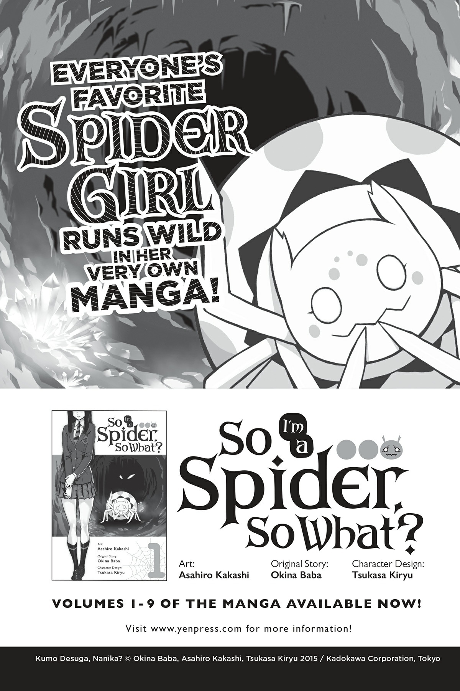
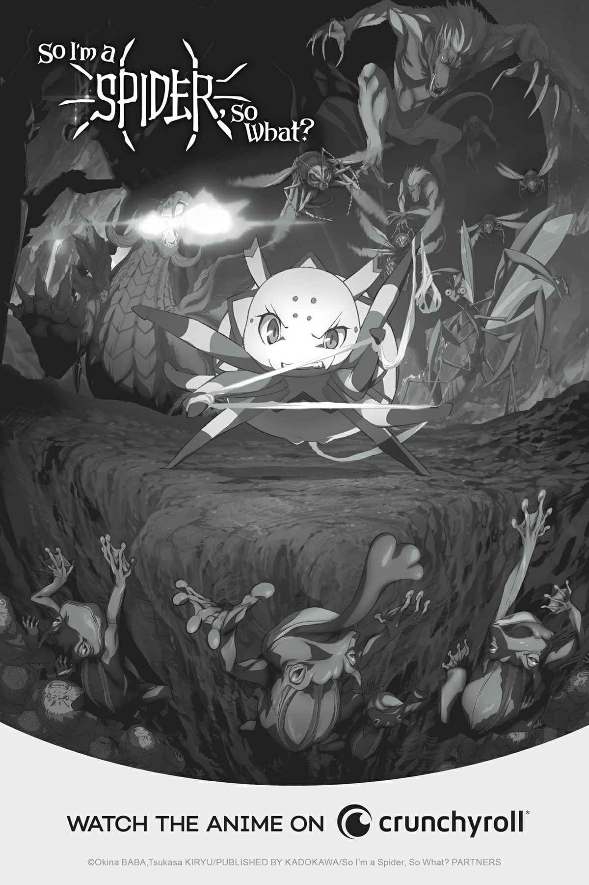

# Lời bạt
*(Afterword)*

Mọi người có khỏe không?! Tôi thì chắc chắn là khỏe rồi!

Vâng, xin chào, tôi là Baba Okina, vẫn khỏe như thường lệ.

Đây là Tập 13.

Con số mười ba vốn được coi là không may mắn, và năm nay chắc chắn là một năm kiểu như thế...

Với trường hợp của tôi, vì tôi là một tác giả nên vẫn có thể làm việc tại nhà, thế nên chuyện đó cũng không phải là vấn đề gì quá lớn.

May mắn thay, không ai trong gia đình tôi bị nhiễm bệnh. Tôi không dám nói là mọi chuyện vẫn bình yên vô sự, nhưng chúng tôi vẫn đang xoay xở ổn thỏa.

Tuy nhiên, dù vẫn viết lách bình thường, nhưng không phải là tôi hoàn toàn không bị ảnh hưởng gì. Đã có một số trở ngại ngoài ý muốn xảy ra.

Chẳng hạn như hiệu sách ở địa phương đã tự nguyện đóng cửa một thời gian...

Và bởi vì tất cả những chuyện này đều chưa từng có tiền lệ, bản thân toàn ngành công nghiệp này cũng đang phải lúng túng mò mẫm.

Dẫu vậy, tất cả những gì tôi thực sự có thể làm để giúp đỡ là tiếp tục viết lách tốt nhất có thể.

Tôi hy vọng những cuốn sách của mình có thể mang lại cho mọi người dù chỉ là một chút năng lượng.

Bây giờ, xin gửi vài lời cảm ơn.

Gửi đến Tsukasa Kiryu vì những bức tranh minh họa tuyệt vời như mọi khi.

Ngay cả trong hoàn cảnh này — không, chính xác là vì hoàn cảnh này — việc ngắm nhìn các tác phẩm nghệ thuật của Kiryu giúp xoa dịu tâm hồn tôi hơn bao giờ hết!

Khi nhìn thấy những bức tranh minh họa đó, tôi cảm thấy mình có thể tiếp tục vững bước.

Gửi đến Asahiro Kakashi, người đang vẽ bản chuyển thể manga.

Một lần nữa, khi nhìn thấy phiên bản manga của nhân vật chính đang nỗ lực hết mình, dù là trong tình huống hài hước hay nghiêm túc, tôi cũng được truyền cảm hứng để cố gắng hết sức.

Và Gratinbird, người đang đảm nhận phần ngoại truyện comic.

Đọc những trò nghịch ngợm ngớ ngẩn của bốn chị em khiến tôi mỉm cười, sưởi ấm trái tim tôi và đặt tôi vào một tâm trạng vui tươi.

Tôi hy vọng tập truyện này cũng sẽ khiến tất cả các độc giả cảm thấy tương tự... Ơ...

nhưng liệu có được thế không nhỉ?

...Thôi nào, tôi không thể bắt chước được khiếu hài hước của Gratinbird đâu!

Và gửi đến tất cả những ai tham gia vào quá trình sản xuất anime.

Bởi vì việc sản xuất anime liên quan đến rất nhiều người, tôi nghĩ nó càng bị tổn hại nặng nề hơn bởi ảnh hưởng của đợt bùng phát virus corona gần đây.

Vì đội ngũ nhân sự đều tiếp tục làm việc chăm chỉ, tôi cảm thấy bản thân mình cũng phải cố gắng nhiều hơn.

Và nhắc đến anime, chúng tôi có một thông báo cực kỳ lớn!

Phim sẽ được phát sóng vào tháng 1 năm 2021 dưới dạng chiếu liên tiếp 2-cour (hai mùa liên tục)!

Ban đầu phim dự kiến phát sóng vào năm 2020, nhưng đã bị hoãn sang năm 2021 do cái dịch corona chết tiệt đó...

Đây chắc chắn là một năm đầy biến động, nhưng xin vui lòng chờ đợi thêm một chút nữa cho đến khi phim lên sóng nhé!

Tôi cũng muốn gửi lời cảm ơn đến biên tập viên của tôi, cô W, và tất cả những người khác đã giúp đưa cuốn sách này đến với thế giới.

Và gửi đến tất cả các bạn, những người đã tử tế đón nhận cuốn sách này.

Cảm ơn các bạn rất nhiều.

---

[◀ Chương trước: Chương cuối: Tiêu diệt tộc Elf kiếm sống](16_final_destroying_the_elves_for_a_living.md) | [Chương tiếp theo: Bản tin Yen Press ▶](18_yen_newsletter.md)
