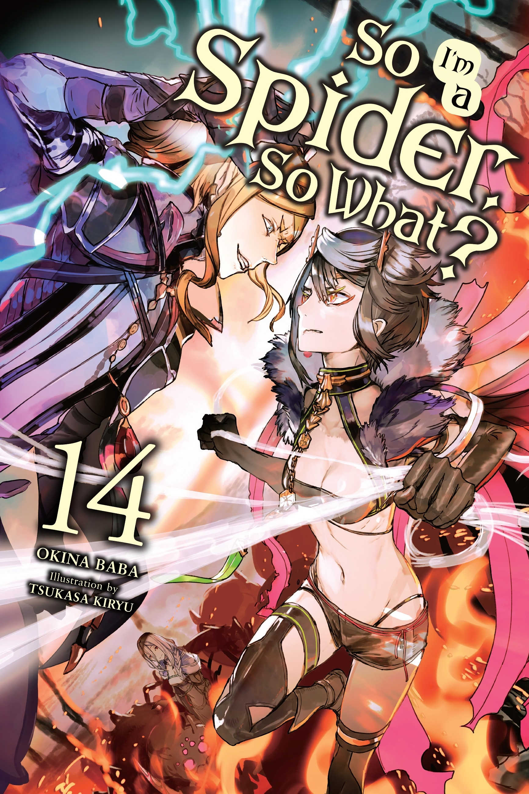
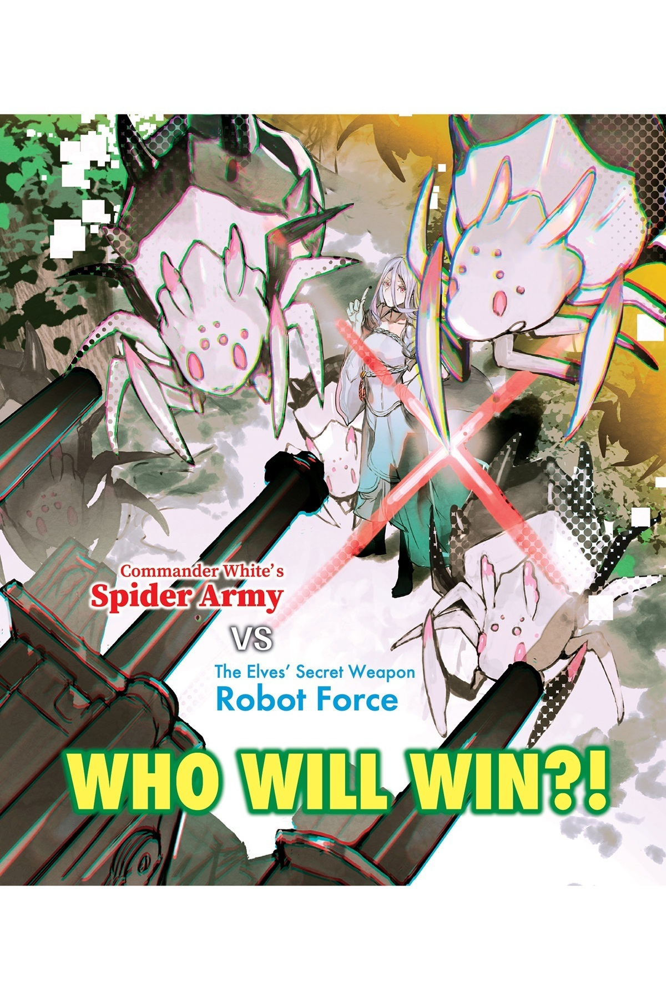
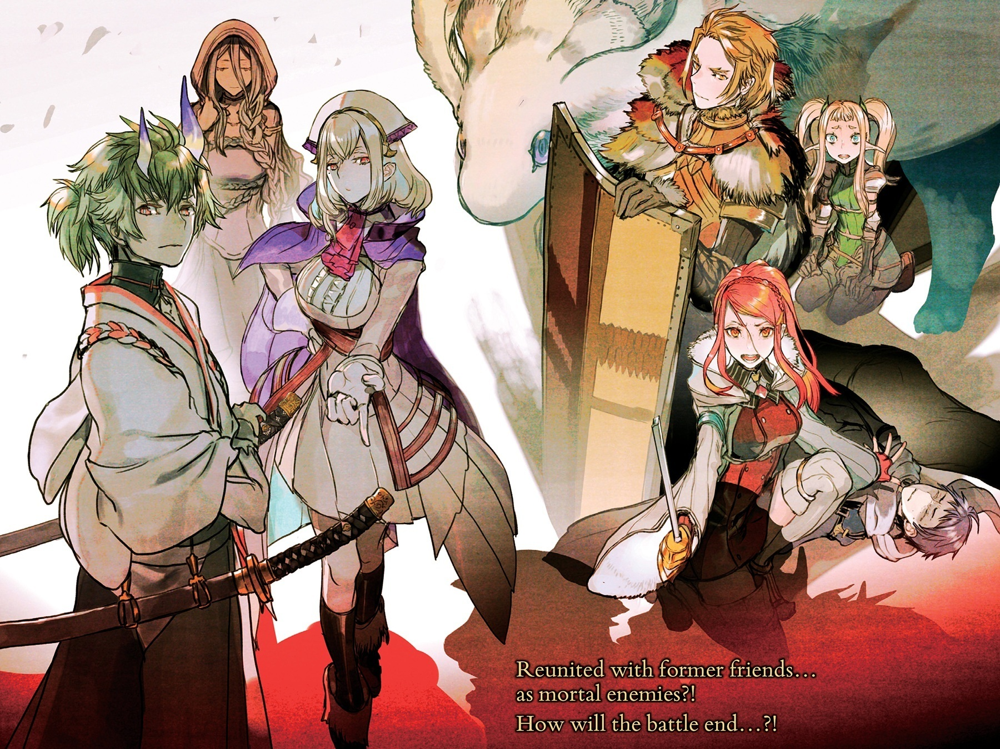
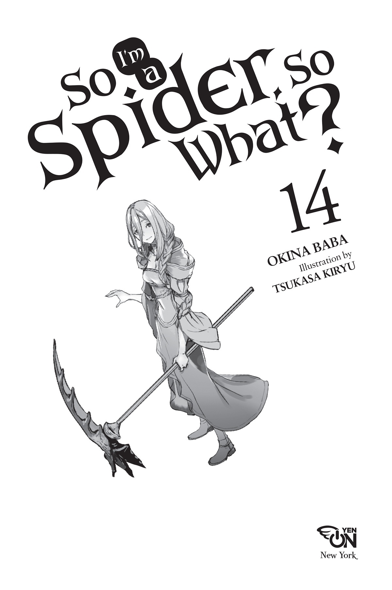

# Thông tin xuất bản & Ảnh minh họa
*(Copyright & Illustrations)*

---

## Mục lục

*   Lãnh chúa không tên
*   Chương 1: Trước trận chiến
*   Hồi tưởng: Cuộc gặp đầu tiên
*   Đoạn phụ: Sự khởi đầu của Potimas
*   Chương 2: Tiếng chuông bắt đầu trận chiến cuối cùng
*   Lãnh chúa từng là chuột thí nghiệm
*   Đoạn phụ: Những thí nghiệm của Potimas
*   Trầm tư: Thiên thần lạc lối và Rồng
*   Chương 3: Quyết chiến: Hủy diệt
*   Lãnh chúa từng có những người bạn
*   Trầm tư: Bị chặn đứng bởi Ma vương giới kinh doanh
*   Đoạn phụ: Potimas và Ma pháp triệu hồi
*   Chương 4: Quyết chiến: Nhện đấu Robot
*   Lãnh chúa rút ra bài học
*   Trầm tư: Ma cà rồng
*   Đoạn phụ: Potimas và Ma cà rồng
*   Chương 5: Quyết chiến: Nhện đấu Mega-Robot
*   Lãnh chúa dõi theo
*   Trầm tư: Năng lượng MA
*   Đoạn phụ: Potimas và sự phổ biến của Năng lượng MA
*   Chương 6: Quyết chiến: Cuộc chạm trán tình cờ
*   Đoạn phụ: Lão già và những tiểu thư phù thủy
*   Lãnh chúa cô độc
*   Trầm tư: Ragnarok
*   Đoạn phụ: Quyết định của Tổng thống
*   Đoạn phụ: Potimas và sự hy sinh của Thần
*   Chương 7: Quyết chiến: Vô số mắt nhện
*   Lãnh chúa được báo thù
*   Trầm tư: Lịch sử lại chuyển động như thế
*   Chương 8: Kết thúc trận chiến: Kẻ bước đi cùng Lãnh chúa
*   Lời bạt

---

[Chương tiếp theo: Lãnh chúa không tên ▶](01_l1_the_lord_who_had_no_name.md)
