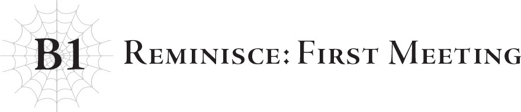
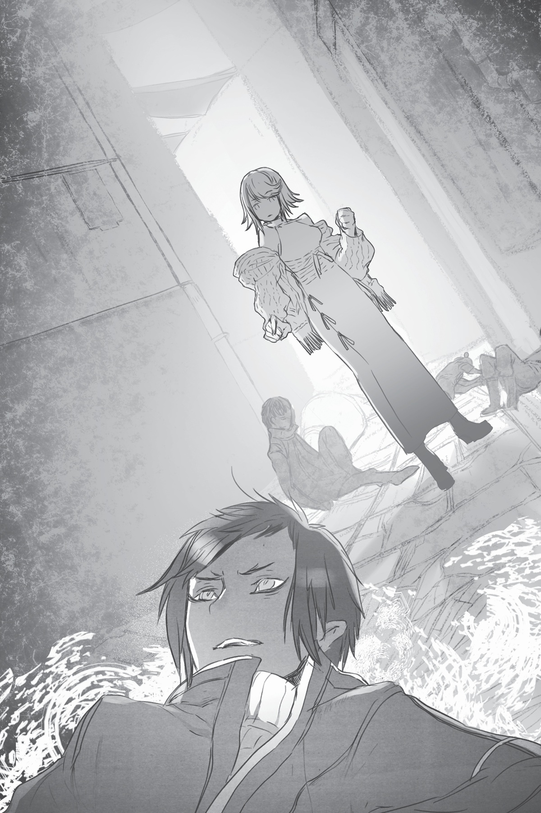

# Hồi tưởng: Cuộc gặp đầu tiên
*(Reminisce: First Meeting)*

Khởi đầu chuyện tình giữa tôi và Sariel cũng chẳng có gì thú vị cho lắm.

À không, tôi cho rằng đó là một cuộc chạm trán khá ấn tượng, đủ để khiến một số người cảm thấy tò mò.

Nhưng tôi cảm thấy cần phải nói trước rằng cuộc gặp gỡ đầu tiên của chúng tôi chẳng hề có chút yếu tố lãng mạn nào cả, đề phòng trường hợp đó là điều mà mọi người quan tâm.

Thật đáng tiếc, đó không phải là tình yêu sét đánh hay bất kỳ sự mơ mộng viễn vông nào tương tự.

Lần đầu tiên tôi gặp Sariel mang lại ấn tượng mạnh mẽ theo một nghĩa hoàn toàn khác.

Không phải theo nghĩa lãng mạn, mà đúng hơn là một cú "va chạm" theo đúng nghĩa đen.

Một cú tác động vật lý trực diện, nếu bạn muốn gọi thế.

Bởi vì ngay lần đầu tiên chạm trán, cô ấy đã đánh tôi ngã nhào xuống đất.

Rất ấn tượng, phải không nào?

Thế giới trước khi Hệ thống được vận hành là một thế giới hoàn toàn khác biệt.

Từ diện mạo, cách thức vận hành, cho đến mọi thứ liên quan.

Điều này có lẽ là hiển nhiên, nhưng nếu không có Hệ thống, thì sẽ chẳng có kỹ năng hay chỉ số nào cả.

Điều này đồng nghĩa với việc nhìn chung con người yếu hơn nhiều, nhưng vì bấy giờ cũng không có quái vật hay bất cứ thứ gì tương tự, nên họ chẳng cần phải mạnh mẽ làm gì.

Vì không thể sử dụng ma pháp, khoa học kỹ thuật đã phát triển thay thế; những tòa nhà được xây dựng cao chọc trời, những con đường bằng phẳng và kiên cố kết nối khắp mặt đất tự nhiên, và xe cộ đi lại đông đúc chật nêm trên những con đường đó.

Nếu con người thời đó có thể chứng kiến cuộc sống ở thế giới này ngày nay, tôi hình dung họ sẽ nghĩ rằng thời gian đang đi giật lùi.

Nhờ vào các kỹ năng, những con người vẫn còn lưu giữ tri thức thời cổ đại, và nhiều yếu tố khác, chúng ta đã không hoàn toàn đi giật lùi, nhưng tôi chắc chắn rằng những khác biệt như vậy chỉ có thể cảm nhận được bởi những kẻ đã biết đến thời đại trước kia, chẳng hạn như Ariel, Dustin và tôi.

Chắc chắn Potimas chẳng thèm bận tâm đến những chuyện như vậy.

Ngoài ra, tôi đoán những người tái sinh cũng có thể nhận ra.

Trước khi được tái sinh đến đây, có vẻ như họ cũng từng sống trên một hành tinh có nền văn minh khá phát triển.

Có lẽ vài người trong số họ đã nhận thấy những tàn tích sót lại của các công nghệ mà chúng tôi từng có, những thứ dường như hoàn toàn lạc lõng với lối sống hiện tại.

Hệ thống đã được lập trình để khiến sách vở và các phương tiện ghi chép khác phân hủy nhanh hơn nhằm xóa bỏ những thứ như thế, nhưng nó không thể xóa nhòa những gì đã được truyền miệng qua các thế hệ.

Như thể để chứng minh rằng ngay cả một chủng tộc yếu ớt như con người vẫn có thể kháng cự lại một vị thần tối cao như D... dù chỉ theo những cách nhỏ bé nhất.

Mặc dù tôi hoài nghi liệu đó có thực sự là chủ ý của loài người hay không. Đây chắc chắn chỉ là suy nghĩ chủ quan của tôi mà thôi...

À, tôi lại lạc đề mất rồi.

Dù sao đi nữa, mọi thứ đã thay đổi triệt để đến mức người ta có thể hoài nghi liệu đây có còn là thế giới của ngày xưa.

Và không chỉ thế giới thay đổi, mà ngay cả chính bản thân tôi cũng vậy.

Khi ấy tôi là một kẻ vô cùng kiêu ngạo, dù tự mình nói ra điều này nghe có hơi kỳ cục.

Tôi tin chắc rằng con người là lũ sinh vật hạ đẳng, và chưa bao giờ nghi ngờ điều đó dù chỉ một giây.

Để tự bào chữa, tôi xin làm rõ rằng điều tương tự cũng đúng với tất cả các loài rồng khác.

Tôi không có ý nói đến lũ quái vật được gọi là rồng trong thế giới hiện tại này, mà là những Chân Long thực thụ, chẳng hạn như tôi.

Chân Long chúng tôi là một chủng tộc hùng mạnh, được hứa hẹn sẽ chạm tới thần cấp ngay từ thời khắc chào đời.

Hệ quả là, chúng tôi tin tưởng tuyệt đối rằng rồng tộc là loài thượng đẳng, và mọi sinh vật khác đều là lũ thấp kém đứng dưới chân mình.

Bây giờ, sau khi đã chạm trán với vị thần tối cao mạnh mẽ đến phi lý là D, tôi không còn giữ niềm tin ấy một cách tự tin như trước nữa, nhưng ở thời điểm đó, trong tâm trí tôi chưa từng có lấy một chút nghi ngờ.

Thế nên, tôi chẳng hề thấy dễ chịu chút nào khi chứng kiến lũ nhân loại hạ đẳng sinh sôi khắp thế giới như thể chúng là chủ nhân của nơi này.

Tại sao các Chân Long cấp cao không dùng sức mạnh áp đảo của mình để bắt loài người phải khuất phục?

Tôi đã không hiểu được.

So với rồng tộc, hiện tại tôi vẫn còn tương đối trẻ, nhưng khi ấy tôi thậm chí còn non nớt hơn.

Tôi đoán bạn có thể gọi đó là sự ngạo mạn của tuổi trẻ.

Nên khi một đứa trẻ rồng bị bắt cóc bởi một tên người phàm hèn mọn, bạn có thể hình dung ra tôi đã cực kỳ phẫn nộ như thế nào.

Trong những ngày tháng đó, rồng tộc chỉ sống khép kín trong một lãnh địa nhỏ bé của riêng mình.

Trong số các Chân Long cai quản, rất nhiều người không hài lòng với lối sống như vậy.

Nhưng đối với loài rồng, quy tắc tôn ti trật tự theo tuổi tác là tuyệt đối.

Nếu một rồng trưởng lão ban lệnh, rồng trẻ tuổi bắt buộc phải tuân theo.

Chúng tôi kìm nén sự bất mãn của mình và chấp hành mệnh lệnh của các bậc trưởng bối.

Số năm một con rồng đã sống tương đương trực tiếp với sức mạnh của chúng.

Không giống như các loài sinh vật khác, độ mạnh yếu của rồng cha mẹ không quyết định sức mạnh của rồng con.

Đó là lý do tại sao tất cả các rồng già đều được tôn kính, và rồng con luôn được trân quý và đối xử bình đẳng như nhau.

Loài rồng sống thọ đến mức tuổi thọ trung bình của chúng không thể dự đoán được, và những cá thể rồng mạnh mẽ thì hầu như hiếm khi sinh con.

Bởi vì đó là sự kiện vô cùng hiếm hoi, rồng con luôn được nuôi dưỡng với sự chăm sóc cực kỳ cẩn thận.

Và việc cướp đi báu vật vô giá ấy của chúng tôi chắc chắn sẽ chọc giận rồng tộc đến mức không thể dung thứ.

Tôi không có mối liên hệ cá nhân nào với đứa trẻ đó; chúng tôi thậm chí còn chưa từng gặp mặt.

Nhưng ngay cả tôi cũng cảm thấy máu trong người sôi lên.

Thế nên bạn chỉ có thể tưởng tượng cơn thịnh nộ của rồng cha mẹ lớn đến nhường nào.

Sẽ chẳng có gì đáng ngạc nhiên nếu họ điên cuồng tàn sát các ngôi làng của loài người mà không phân biệt ai để tìm lại con mình.

Có lẽ đó chính là lý do tại sao tôi, một kẻ chẳng có can hệ gì, lại được giao nhiệm vụ canh chừng đứa trẻ.

Chỉ quan sát chứ không giải cứu.

Theo lời các rồng trưởng lão: “Vì đứa trẻ bị con người đánh cắp, nên lẽ tự nhiên là chính con người phải thực hiện cuộc giải cứu.”

Nếu không, rồng tộc sẽ chẳng còn lý do gì để tiếp tục dung thứ cho loài người nữa.

Khi nghe điều này, phản ứng chân thật của tôi lúc đó là: “Liệu chúng ta thực sự cần phải dung thứ cho chúng sao?”

Lúc ấy, tôi nghĩ chúng tôi chỉ cần đơn giản là thổi bay một hoặc hai thị trấn của loài người để thị uy.

Nhưng tôi không thể bất tuân lệnh của các rồng trưởng lão.

Thay vào đó, tôi phải giám sát đứa trẻ bị bắt cóc, đóng vai trò như một lưới an toàn phòng trường hợp có bất kỳ nguy hiểm nào đe dọa đến nó trước khi con người kịp giải cứu.

Băng nhóm bắt cóc đứa trẻ là một tổ chức tội phạm.

Rồng tộc là một chủng tộc sở hữu nhiều khả năng đặc dị. Ngay khi phát hiện đứa trẻ bị bắt cóc, chúng tôi đã lập tức tìm ra thủ phạm.

Sau đó, chúng tôi liên hệ với quốc gia nơi bọn tội phạm đó đang lẩn trốn và yêu cầu chính họ phải tự giải cứu đứa trẻ.

Con người biết rõ rồng tộc đáng sợ đến mức nào.

Và họ cũng hiểu rõ hậu quả của việc dám cả gan trộm đi một đứa con của loài rồng.

Khi đó, tôi coi bọn bắt cóc và những kẻ đi giải cứu đều là lũ người phàm cùng một giuộc, nhưng giờ nghĩ lại, bọn bắt cóc hẳn là đã mất trí rồi.

Bất kỳ con người nào có một chút lý trí bình thường cũng đều tự hiểu rằng không được động vào rồng con.

Chỉ vì băng nhóm này hoàn toàn vô tri vô giác nên mới dám làm chuyện điên rồ như vậy.

Nói một cách đơn giản, lũ người bắt cóc rồng con chỉ là một lũ ngu ngốc.

Đó là lý do tại sao chúng bị lợi dụng.

Đúng như những gì tôi tìm hiểu được rất lâu sau đó, kẻ đứng sau giật dây vụ bắt cóc ngớ ngẩn này không ai khác ngoài Potimas.

Hắn ta lợi dụng băng nhóm tội phạm này để nghiên cứu về chủng tộc siêu việt là rồng tộc.

Hắn thậm chí còn cẩn trọng đến mức sắp xếp vài tổ chức và cá nhân trung gian đứng giữa mình và nhóm thủ phạm trực tiếp, để chúng tôi không thể lần ra hắn là kẻ đứng sau tất cả.

Gã đàn ông đó biết quá rõ hậu quả dành cho những kẻ dám gieo rắc cơn thịnh nộ cho loài rồng.

Nếu không, hắn đã chẳng tốn công tốn sức đảm bảo chúng tôi sẽ không tìm thấy hắn như vậy.

Thật khó nói hành động này chứng tỏ hắn gan dạ vì dám can thiệp vào rồng tộc, hay hèn nhát khi phải dùng đến các biện pháp phòng ngừa rườm rà như thế để lẩn trốn chúng tôi.

Dù thế nào đi nữa, nhờ sự kiện đó, hắn đã có được một phần mô cơ thể của loài rồng: các mảnh tóc và vảy rồng từ đứa trẻ bị bắt cóc.

Hắn đã dùng phần mô đó để chế tạo ra một sinh vật lai (chimera), nhưng đó là câu chuyện của một lúc khác.

Tôi không thể tha thứ cho những kẻ trực tiếp ra tay, ngay cả khi chúng chỉ là quân cờ bị Potimas lợi dụng.

Đó chính là cái giá phải trả khi dám động đến loài rồng.

Vì tuyệt vọng muốn tránh bị liên lụy bởi hậu quả kéo theo, quốc gia nơi băng nhóm tội phạm ẩn náu đã vội vã đưa ra các biện pháp đối phó.

Họ bắt buộc phải thu hồi đứa trẻ bị đánh cắp một cách an toàn trước khi có chuyện kinh khủng gì xảy ra.

Nhưng nếu được chọn, tôi lại hy vọng bọn thủ phạm sẽ cố gắng làm hại đứa trẻ.

Nếu chúng làm thế, tôi sẽ có lý do chính đáng để thổi bay chúng, và cuốn phăng cả quốc gia này đi cùng với chúng.

Tôi được lệnh canh giữ đề phòng bất kỳ hiểm họa nào đe dọa đến đứa trẻ. Nếu có vẻ như nó sắp bị tổn hại, tôi phải bảo vệ nó bằng mọi giá.

Nếu các điều kiện đó được thỏa mãn, tôi sẽ được phép sử dụng vũ lực.

Tôi cực kỳ xuất sắc trong lĩnh vực ma pháp không gian và có thể dễ dàng dịch chuyển đến bên cạnh đứa trẻ trong tình huống khẩn cấp.

Trừ khi có chuyện gì đó vô cùng bất thường xảy ra, bằng không tôi sẽ chẳng gặp khó khăn gì để có mặt kịp thời.

Vì thế, thay vì sự việc kết thúc trong hòa bình, tôi lại mong muốn có cơ hội để cho lũ con người biết chuyện gì sẽ xảy ra nếu chúng dám làm hại một con rồng.

Đó chính là mức độ giận dữ phi lý đang dồn nén trong tâm trí tôi lúc bấy giờ.

Và để đổ thêm dầu vào lửa...

“Này, nhóc con. Không biết đây là địa bàn của bọn tao à?”

Cuộc đụng độ này càng khiến ngọn lửa giận dữ trong tôi bùng cháy dữ dội hơn.

Sai lầm của tôi là chọn một con hẻm tối tăm, khuất mắt người để làm điểm quan sát.

Cải trang thành con người và đứng một mình trong một con hẻm như thế, tôi hẳn trông giống như một con mồi béo bở đối với lũ hề vô học đó.

Chẳng mấy chốc, tôi đã bị bao vây bởi một nhóm thanh niên loài người bất lương.

Những băng nhóm kiểu này dường như tồn tại ở bất kỳ thế giới nào, bất kỳ thời đại nào.

Đúng là một sự phiền toái, dẫu lúc đó tôi không hề nghĩ như thế.

Tay tôi đã hành động trước khi tôi kịp suy nghĩ.

Cơn thịnh nộ của tôi đã chạm ngưỡng sôi sục, và trong những ngày tháng ấy, tôi không hề phân biệt đối xử giữa những con người với nhau.

Lũ bắt cóc đứa trẻ, những kẻ đang cố gắng tìm lại nó, và đám người đang vây quanh tôi lúc này, tất cả đều chỉ là "lũ loài người" trong mắt tôi.

Và giờ lũ con người đó lại đang đe dọa tôi.

Tôi chẳng cần thêm bất kỳ lý do nào khác để ra tay với chúng.

Đám thanh niên bất hảo đó có lẽ chỉ định đe dọa tôi để cướp ví tiền, chắc chắn chúng không thể ngờ được tôi sẽ đột ngột ra tay sát hại chúng.

Chắc chắn chúng cũng chưa từng mơ rằng tôi thực chất lại là một con rồng.

Và trước khi chúng kịp nhận thức được điều đó, nắm đấm của tôi đã vung về phía trước, sẵn sàng xé xác chúng thành từng mảnh trước khi chúng kịp nhận ra mình đã chết.

Thế nhưng, nắm đấm của tôi đã chẳng thể chạm tới chúng.

Bởi vì trước khi tôi kịp tung chiêu, đã có ai đó từ phía sau giữ chặt cánh tay tôi lại.

“...?!”

Theo bản năng, tôi cố gắng dùng cánh tay còn lại còn tự do để tấn công kẻ đã giữ mình.

Tuy nhiên, người đó đã đỡ được cú chặt tay ngược của tôi, tạo ra một làn sóng xung kích dữ dội.

Nó thổi bay lũ côn đồ ra xa, nhưng tôi chẳng còn tâm trí đâu mà bận tâm đến việc đó nữa.

Bởi vì chính bản thân tôi cũng bị chấn động của làn sóng xung kích ấy hất ngã nhào.

Trong một khoảnh khắc, tôi chẳng thể hiểu nổi chuyện gì vừa xảy ra. Khi nhận thức lại được, tôi đã thấy mình nằm chỏng gọng trên mặt đất, ngước mắt nhìn lên bầu trời.

“Cảnh báo. Tôi không cho phép có bất kỳ hành vi can thiệp vật lý nào gây tổn hại đến các chủng tộc bản địa.”

Người gây ra chuyện đó cúi xuống nhìn tôi, cất giọng đều đều, khô khốc như máy móc, chẳng chút cảm xúc.

“Phát hiện hành vi thù địch từ rồng đối với chủng tộc bản địa. Hành vi như vậy xung đột với sứ mệnh đã được phê duyệt. Mọi hành vi tiếp theo sẽ dẫn đến việc bị tiêu diệt.”

Đó là một lời tuyên bố tàn nhẫn và dứt khoát.

Người nói biết rõ tôi là một con rồng, nhưng vẫn khẳng định sẽ tiêu diệt tôi nếu tôi dám manh động.

Và cô ấy có thừa sức mạnh để biến lời tuyên bố đó thành sự thật.

Đây chính là lý do vì sao loài rồng không tìm cách thống trị thế giới, dù cho chúng luôn tự coi mình là chủng tộc thượng đẳng.

Bởi vì có một thực thể còn mạnh mẽ hơn thế đang bảo hộ các sinh vật bản địa.

Không ai khác ngoài người mà ngày nay họ gọi là Nữ thần: Sariel.

Trong lần chạm mặt đầu tiên của chúng tôi, cả hai đã lập tức lao vào tấn công nhau, và kết quả là tôi bị đánh ngã xuống đất cùng lời cảnh báo sẽ bị tiêu diệt.

Đó chính là cuộc gặp gỡ đầu tiên của tôi với Sariel đấy.

Thấy chưa? Chẳng có chút lãng mạn nào cả, phải không?

---

[◀ Chương trước: Chương 1: Trước trận chiến](02_ch1_before_the_battle.md) | [Chương tiếp theo: Đoạn phụ: Sự khởi đầu của Potimas ▶](04_interlude_potimass_beginning.md)
