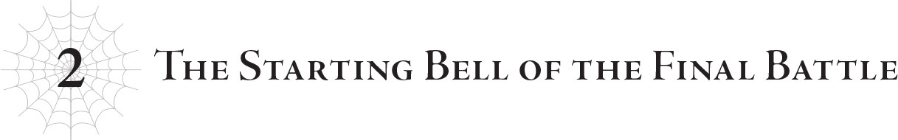

# Chương 2: Tiếng chuông bắt đầu trận chiến cuối cùng
*(Chapter 2: The Starting Bell of the Final Battle)*

Giữa khu rừng rậm rạp sừng sững một kết giới khổng lồ, trông hoàn toàn lạc lõng với thiên nhiên xung quanh.

Ma Vương, chị em nhện rối và tôi — tổng cộng sáu người — đang đứng trước kết giới đó, tách biệt hoàn toàn với phần còn lại của quân đoàn ma tộc.

Ở phía trước, quân đội Đế quốc cuối cùng cũng đã tiến sát rìa ngoài của kết giới bao phủ làng Elf.

Tất cả những gì chúng tôi cần làm là phá hủy kết giới này bằng cách nào đó, rồi tiến quân vào.

Mặc dù đó cũng chính là vấn đề.

Cái kết giới này dai sức một cách vô lý!

Bạn hỏi nó bền bỉ đến mức nào ư? Đủ cứng để không hề suy suyển ngay cả khi hứng chịu một cú phun thở toàn lực từ Taratect Nữ Vương đấy.

Sao cơ, bạn nghĩ cái ví dụ này cụ thể một cách kỳ lạ à?

Dĩ nhiên là vì tôi đã thực sự thử nghiệm nó rồi.

Số là, ngoài việc là nơi trú ngụ của tộc Elf ra, Rừng Lớn Garam còn nổi tiếng vì một điều khác nữa.

Cụ thể: nơi này có một con Taratect Nữ Vương sinh sống.

Phải đó, một cá thể cùng loài với bà mẹ tai tiếng của tôi ở Mê cung Lớn Elroe, hiện đang cư ngụ ngay tại khu rừng này.

Nhưng cũng dễ đoán lý do tại sao thôi.

Nó ở đây là để canh chừng Potimas, kẻ thù truyền kiếp của Ma Vương.

Kết giới ngăn không cho nó gây hại đến làng Elf, nhưng bằng cách đóng đô lãnh thổ của một con quái vật khổng lồ ngay sát vách, nó có thể tạo áp lực không ngừng nghỉ lên họ.

Nhờ con Taratect Nữ Vương này, Potimas có muốn hạ kết giới xuống cũng không dám.

Và để tránh đi vào vùng kiểm soát của Taratect Nữ Vương, tộc Elf không còn lựa chọn nào khác ngoài việc phụ thuộc vào dịch chuyển cự ly dài qua các cổng dịch chuyển.

Nhân tiện, con Taratect Nữ Vương đó hiện đã được di tản đi nơi khác để tránh cản đường cuộc xâm lăng của quân đội Đế quốc.

Tất nhiên là sang phía bên kia của làng Elf rồi!

Nói cách khác, tộc Elf hiện đang bị kẹp sườn từ cả hai phía bởi quân đội Đế quốc và đàn nhện của Taratect Nữ Vương.

Quá tuyệt!

Nhưng chờ đã! Để thực hiện thế gọng kìm đó, chúng tôi phải phá hủy cái kết giới mà ngay cả cú phun thở của Nữ Vương cũng không thể làm nứt nổi.

Nghe đâu kết giới này được tạo ra bằng cách tận dụng triệt để mớ kiến thức cấm ngu ngốc của Potimas, luôn duy trì mức phòng ngự điên rồ bằng cách ngốn một lượng lớn năng lượng MA.

Điều đó đồng nghĩa với việc nó đang lãng phí hàng tấn năng lượng mà hệ thống đã chậm rãi và bền bỉ thu thập suốt bấy lâu nay. Trời đất, nghĩ tới thôi là thấy ngứa mắt rồi!

Ư ư ư, tôi muốn đập nát cái thứ ngớ ngẩn này ra thành từng mảnh quá đi mất.

Nhưng không phải bây giờ. Vẫn chưa đến lúc.

Hiện tại, chúng tôi vẫn đang chờ tín hiệu.

Bởi vì có một việc khác chúng tôi bắt buộc phải làm trước khi phá hủy kết giới: phá hủy các cổng dịch chuyển.

Cổng dịch chuyển là phương thức di chuyển khoảng cách xa mà bất kỳ ai cũng có thể sử dụng.

Trong trường hợp của làng Elf bị cô lập bởi kết giới, đó cũng là cầu nối duy nhất của họ với thế giới bên ngoài.

Nếu không phá hủy các cổng dịch chuyển, tộc Elf vẫn có thể tẩu thoát ngay cả khi chúng tôi có bao vây họ về mặt vật lý đi chăng nữa.

Và rồi họ sẽ trốn thoát tới một vùng đất xa xôi nào đó ở phía bên kia cổng.

Khi đó, ngay cả khi chúng tôi muốn đuổi theo thì cũng vô phương nếu họ tự tay phá hủy cổng dịch chuyển sau khi thoát qua.

Hiện tại, nhờ sự theo dõi và điều tra của Thần Ngôn Giáo trong suốt nhiều năm, họ đã biết được vị trí của vài cổng dịch chuyển.

Nhưng chúng tôi không thể chắc chắn rằng không còn những cánh cổng khác mà mình chưa biết.

Vì vậy, kế hoạch của chúng tôi là sử dụng các cổng dịch chuyển đã biết để thâm nhập vào làng Elf, rồi phá hủy chúng từ bên trong.

May mắn cho chúng tôi là các cổng dịch chuyển trong làng Elf dường như đều được xây chung ở một chỗ, vì họ buộc phải tạo ra một lối đi vòng qua kết giới.

Do cách kết giới vận hành, họ phải đặt tất cả các cổng tại một điểm cố định, nơi họ sẽ tạm thời mở một lỗ hổng trên kết giới kết nối với bên ngoài để đưa tộc Elf đi.

Tôi đã phát hiện ra điều này trong lúc điều tra kết giới.

Vì đây là Potimas nên tôi không dám khẳng định chắc chắn rằng không có cổng dịch chuyển nào khác ở nơi khác, nhưng tôi không tìm thấy bất kỳ điểm yếu nào khác trên kết giới, nên tôi đoán đó là những cái duy nhất.

Nghĩa là việc phá hủy toàn bộ các cổng dịch chuyển trong một lượt là hoàn toàn khả thi.

Thế nên, tín hiệu mà chúng tôi đang chờ đợi chính là báo cáo rằng người của chúng tôi đã xâm nhập thành công qua kết giới và phá hủy các cổng dịch chuyển.

Và ai là người dẫn đầu nhiệm vụ bí mật này? Một người tái sinh tên Kusama.

Tên đầy đủ của cậu ấy ở kiếp trước là Kusama Shinobu.

Và kỹ năng độc quyền của cậu ấy dưới tư cách người tái sinh hình như là [Nhẫn Giả]...

Cái đó hoàn toàn là dựa theo tên mà đặt đúng không?

Như thế không phải là hơi lười à?

Đúng là tên D khốn kiếp, lúc nào cũng làm ăn tắc trách như mọi khi...

Dù sao thì, hóa ra Kusama đã đầu thai vào một gia tộc điều hành lực lượng mật vụ của Thần Ngôn Giáo.

Về cơ bản họ là những nhẫn giả phục vụ cho Thần Ngôn Giáo.

Ngay cả Potimas cũng không thể bắt cóc Kusama từ một gia tộc có tầm ảnh hưởng lớn đối với giáo hội như vậy, nghĩa là cậu ấy là người tái sinh duy nhất chưa từng đụng độ với tộc Elf trong suốt cuộc đời này.

Dù vậy, xét đến hoàn cảnh đặc biệt khi chào đời, tôi nghi ngờ cậu ấy cũng chẳng có những ngày tháng yên bình gì cho cam.

Chẳng hạn như, cậu ấy đã được huấn luyện nghiêm ngặt như một thành viên mật vụ, và kỹ năng độc quyền [Nhẫn Giả] lại khớp một cách hoàn hảo với công việc đó, giúp cậu ấy mạnh mẽ đến bất ngờ.

À thì, ít nhất là mạnh theo tiêu chuẩn của loài người.

Nhưng thế là đủ để chuyện đột nhập và thổi bay vài cổng dịch chuyển trở thành trò trẻ con đối với cậu ấy.

Nhân tiện, chúng tôi đang sử dụng những thanh kiếm nổ tự chế của cậu Oni cho phần "thổi bay" này.

Gọi là ma kiếm thế thôi, chứ thực chất chúng chỉ là những quả bom.

Hơn nữa, sức nổ của chúng lớn đến mức chỉ cần một quả là đủ để quét sạch toàn bộ các cổng dịch chuyển không chút khó khăn.

Vậy mà cậu Oni lại sản xuất hàng loạt những thứ đó như cơm bữa đấy, bạn biết không?

Trông thì giống kiếm sĩ đấy, nhưng thực chất cậu ta là chuyên gia phá hoại công trình thì đúng hơn hả?

Như thế đúng là treo đầu dê bán thịt chó mà.

Tôi thậm chí đã dùng tơ của mình để dệt cho cậu ta một bộ trang phục kiểu Nhật cổ điển rất hợp với thanh katana và mọi thứ khác.

Một samurai có sừng cầm kiếm hẳn hoi!

Nhưng hóa ra cậu ta chỉ đi cho nổ tung mọi thứ.

Thật không thể tin nổi.

Dù sao thì, hóa ra Kusama và cậu Oni từng là bạn khá thân ở kiếp trước; khi chúng tôi gặp gỡ Thần Ngôn Giáo, họ đã gặp lại nhau vài lần và nối lại tình bạn cũ, tôi đoán thế.

Có lẽ cậu Oni đã tặng thanh kiếm nổ cho cậu ấy làm quà chia tay chăng?

Tôi thì chịu rồi, vì làm gì có bạn cũ nào để mà hội ngộ cơ chứ!

Không phải là tôi đang ghen tị đâu nhé!

Trong khi đang tự biện hộ một cách kỳ quặc trong độc thoại nội tâm, tôi ghé mắt nhìn vào bên trong kết giới.

Nó đủ trong suốt để có thể nhìn xuyên qua từ bên ngoài.

Điều đó có nghĩa là các tia sáng khả kiến phải đi qua được, và tôi đoán là cả oxy các thứ nữa, vì có vẻ như nó không kín khí hoàn toàn.

Người ta sẽ nghĩ điều đó cho phép thực hiện một số trò gian lận nhất định, nhưng tôi chắc chắn rằng Ma Vương, Giáo hoàng và những người khác đã thử nghiệm mọi giả thuyết mà tôi có thể nghĩ ra rồi, nghĩa là họ phải có biện pháp đối phó cho những chuyện kiểu đó.

Trời ạ, đúng là một kết giới phiền phức.

Mặc dù việc phá vỡ nó chỉ là chuyện nhỏ đối với tôi!

Đây là kế hoạch một khi Kusama phá hủy thành công các cổng dịch chuyển:

Trước tiên, tôi sẽ chọc thủng kết giới bao quanh làng Elf giống như bong bóng.

Chúng tôi đã dàn dựng để trông như thể quân đội Đế quốc sử dụng một loại ma pháp diện rộng mới để phá hủy nó, điều này sẽ tạo nên một đòn đánh lạc hướng hoàn hảo.

Sau đó, Natsume và quân đội Đế quốc sẽ tiến lên.

Cậu ta đã chọc điên không ít người, nên tôi chắc chắn tộc Elf sẽ đổ xô ra tiêu diệt cậu ta ngay lập tức.

Ít nhất, tôi đoán nhóm Yamada sẽ tiến đến để đối đầu với cậu ta.

Thực ra, tôi cũng cần họ làm vậy.

Tôi phải tránh để Yamada chạm mặt Ma Vương bằng mọi giá.

Hy vọng tôi có thể tin tưởng vào phân thân Hyrince của Güli-güli để lo liệu chuyện đó.

Hyrince, anh lo được vụ này đúng không hả người bạn?

Tôi trông cậy cả vào anh để dẫn dắt cậu ta đi đúng hướng đấy nhé?

Dù sao đi nữa, trong lúc tộc Elf dồn sự chú ý vào quân đội Đế quốc, quân đoàn ma tộc cũng sẽ bắt đầu tiến công và đánh úp tộc Elf từ hai bên sườn.

Mera và cậu Oni chịu trách nhiệm chỉ huy quân đoàn ma tộc, còn Vampy thì đi tiên phong cùng quân đội Đế quốc. Chỗ đó thì không có vấn đề gì.

Phelmina cũng đi cùng phía sau để đề phòng bất kỳ sự cố ngoài ý muốn nào xảy ra.

Tôi tin chắc rằng ngay cả khi tộc Elf sở hữu lực lượng vượt quá dự tính, thì nhóm đó vẫn có thể kiên trì chiến đấu và tiêu diệt chúng mà không phải chịu bất kỳ tổn thất lớn nào.

Nói thật, tôi khá chắc rằng chỉ riêng Vampy và cậu Oni cũng thừa sức tự mình giải quyết hết sạch.

Và rồi, trong lúc tộc Elf bị ép phải chiến đấu trên hai mặt trận chống lại quân đội Đế quốc và quân đoàn ma tộc, tôi sẽ khuyến mãi thêm một binh đoàn Taratect miễn phí.

Đi kèm cả một con Nữ Vương nữa đấy!

Một mình Nữ Vương đã là một thế lực đáng gờm rồi, chưa kể còn có mười bốn con Thượng cổ (Arch).

Và năm mươi mốt con Vĩ đại (Greater).

Cộng thêm một bầy lúc nhúc các loại khác nữa.

Thật lòng mà nói, chỉ riêng đội hình này thôi chẳng phải cũng đủ để xóa sổ tộc Elf rồi sao?

Chắc chắn bấy nhiêu đó là dư sức tiễn hầu hết bọn họ lên đường rồi.

Tôi đang mong đợi một bến bờ chiến trường kinh hoàng như từ sâu thẳm địa ngục hiện về, và trong lúc đó, Ma Vương và tôi sẽ lẻn vào tận trung tâm làng Elf.

Mục đích chủ yếu là để gom các người tái sinh lại, tiễn bản thể thật của Potimas đi chầu ông bà một lần và mãi mãi, đại loại thế.

Nếu chúng tôi có thể tiêu diệt được cơ thể thật của Potimas, thì cuộc chiến này coi như đã thắng.

Chúng tôi đã dọn sạch toàn bộ đống cơ thể giả của lão ở bên ngoài làng Elf rồi.

Tôi khá chắc chắn rằng cái xác mà Vampy phá hủy ở vương quốc là cái cuối cùng.

Chúng tôi đã phải làm một cuộc đảo chính nho nhỏ ở vương quốc và đẩy nhóm Yamada qua đủ mọi tầng địa ngục chỉ để tóm được tên phân thân Potimas cuối cùng đó, nhưng chịu thôi, chúng tôi đâu còn lựa chọn nào khác?

Tất cả là tại Potimas cứ rắp tâm làm chuyện xấu xa ở vương quốc đấy chứ.

Hãy trách lão ta ấy, đừng trách tôi.

Dù sao thì mọi nỗ lực cũng hoàn toàn xứng đáng, bởi chúng tôi đã quét sạch được tầm ảnh hưởng của Potimas ở đó, bao gồm cả cơ thể phân thân của lão.

Ngay cả khi có bỏ sót một cái, Potimas cũng không thể chuyển giao bản thể chính của lão sang cơ thể thay thế giống như tôi làm.

Lão chỉ có một cơ thể thật duy nhất, phần còn lại chỉ là đống xác giả được điều khiển từ xa.

Nên chỉ cần tiêu diệt được hàng thật giá thật, thì dẫu có sót lại bao nhiêu phân thân đi nữa cũng chẳng còn nghĩa lý gì.

Quân đội Đế quốc, quân đoàn ma tộc, và thậm chí cả binh đoàn Taratect đều chỉ là những con mồi nhử.

Là đợt mồi nhử đầu tiên được tung vào, quân đội Đế quốc có lẽ sẽ phải chịu tổn thất không nhỏ, nhưng dù sao thì ngay từ đầu họ cũng chỉ là những quân cờ thí có thể vứt bỏ.

Tất cả những gì chúng tôi thực sự cần họ làm là dụ tộc Elf ra ngoài.

Sau đó chỉ việc dùng quân đoàn ma tộc và bầy Taratect để kiềm chân họ.

Giữa đống hỗn loạn đó, Ma Vương và tôi sẽ ra tay hành động — mục tiêu thực sự của chiến dịch.

Dù sao thì, thực lòng mà nói, hai chúng tôi cộng lại còn mạnh hơn tất cả các quân đoàn kia gộp lại nữa.

Thế mà vào lúc này, chúng tôi lại đang trợn mắt lườm nguýt nhau như muốn ăn tươi nuốt sống đối phương.

“Dù cô có nói gì đi nữa, White, đây là điều duy nhất ta quyết không nhượng bộ.”

“Tôi đã nói rồi, không thương lượng gì hết.”

Bầu không khí giữa hai chúng tôi căng thẳng đến mức như có tia lửa điện xẹt qua.

Mấy nhóc nhện rối của Ma Vương đi cùng xe kéo cũng đang run lẩy bẩy vì sợ hãi trước bầu không khí đầy thuốc súng này.

Chúng tôi tiếp tục trợn mắt đấu trí, không ai chịu nhường ai.

Bạn hỏi chúng tôi đang tranh cãi về chuyện gì ư? Đó là câu hỏi: ai sẽ là người tung đòn kết liễu Potimas.

Tôi muốn nện tên đó ra bã, đặc biệt là sau những gì lão ta đã gây ra cho cô Oka.

Tên khốn đó đã lừa lọc cô giáo từng cứu mạng tôi ở kiếp trước, vắt kiệt sức lao động của cô để thu gom những người tái sinh về cho lão, và thậm chí còn cấy một mảnh linh hồn ký sinh của lão vào người cô để sau này dùng làm cơ thể vật chủ chứa xác!

Bạn nghĩ tôi sẽ để lão ta yên ổn ra đi sau tất cả những chuyện đó sao?

Một điểm cộng nữa nghiêng về phía tôi là tôi mạnh hơn Ma Vương, nên việc để tôi kết liễu Potimas sẽ an toàn hơn, vì chúng tôi vẫn chưa biết rõ lão ta còn có thể giở ra những chiêu trò gì.

Ngược lại, Ma Vương thừa biết điều đó, nhưng vẫn khăng khăng đòi tự mình chiến đấu với lão.

Dĩ nhiên rồi, cô ấy có một lịch sử ân oán cực kỳ lâu đời với Potimas khi liên tục bị lão ta đâm sau lưng ở mọi thời điểm.

Tôi chắc chắn rằng oán hận của cô ấy sâu sắc hơn tôi rất nhiều ở phương diện này.

Nhưng người chúng tôi đang nói đến ở đây là Potimas Harrifenas.

Tên đã một mình đối đầu với cả thế giới trong bóng tối suốt thời gian qua.

Dựa trên những trận chiến từ trước đến nay của chúng tôi, tôi dự đoán sức mạnh của Potimas ít nhất cũng ngang ngửa với Ma Vương.

Nếu có dẫu chỉ là một phần vạn cơ hội Ma Vương bị giết vì một chuyện ngớ ngẩn như thế này, tôi thà chọn con đường an toàn nhất có thể.

Thế nhưng ngay cả sau khi tôi đã giải thích cặn kẽ mọi chuyện, Ma Vương vẫn cứng đầu không chịu lung lay.

Nếu mọi chuyện chỉ dừng lại ở đó thì cũng không đến mức to tát.

Tôi dĩ nhiên rất muốn xé xác Potimas bằng tay không, nhưng tôi chắc chắn Ma Vương cũng cảm thấy y hệt, và có lẽ còn mãnh liệt hơn nhiều.

Tôi cũng không ngại nhường cô ấy tung đòn kết liễu.

Miễn là cô ấy cho phép tôi hỗ trợ trước đó.

“Ít nhất thì hãy để tôi hỗ trợ một tay.”

“Không. Đây là trận chiến của ta. Không ai khác được phép xen vào. Nghe ngầu lòi đúng không?”

Đây chính là vấn đề.

Ma Vương khăng khăng đòi tự mình giải quyết dứt điểm mọi chuyện.

Không cần một chút giúp đỡ nào từ tôi, cũng như từ bất kỳ thuộc hạ nào dưới quyền cô ấy.

Cô ấy muốn đặt dấu chấm hết cho mối thù hằn truyền kiếp của họ bằng một trận đơn đấu tay đôi.

Mặc dù trước đó cô ấy vừa bảo không phải là cô ấy không cần tôi giúp đỡ.

“Ta biết mình đang vô lý. Nhưng ta quyết không thay đổi ý định đâu. Ta phải tự tay kết liễu Potimas. Hắn chính là kẻ đã...”

Ma Vương bỏ lửng câu nói, nhưng ánh mắt cô hiện rõ sự kiên định đầy nghiêm túc.

Khi cô ấy nhìn tôi với ánh mắt đó, nó khiến tôi có cảm giác như thể mình mới là kẻ đang làm sai vậy.

“Cô biết mình có thể sẽ chết đúng không?”

“Dĩ nhiên rồi. Dù sao thì ngay từ đầu thời gian sống của ta cũng chẳng còn bao nhiêu. Nếu có phải bỏ mạng tại đây, ta cũng không có gì hối tiếc. Nhất là khi ta biết rõ rằng nếu chuyện đó xảy ra, cô sẽ giúp ta tiễn Potimas lên đường.”

Tôi thật không thể tin nổi cô ấy lại có thể thản nhiên nói ra những lời kiểu như "nếu ta chết, ít nhất Potimas cũng phải chôn chung" mà mặt không hề biến sắc như thế.

Aiza...

Thật không thể tin nổi.

Tôi thở dài một tiếng thật dài.

Làm sao tôi có thể tiếp tục khăng khăng giữ vững lập trường của mình sau khi nghe cô ấy nói những lời như vậy chứ?

Ma Vương sẵn sàng đánh cược toàn bộ phần đời còn lại của cuộc sống lâu dài của mình để khiêu chiến Potimas.

Cô ấy đang đặt cả lòng kiêu hãnh của mình lên bàn cân.

Tôi đâu thể tước đoạt điều đó khỏi cô ấy đúng không?

Điều tồi tệ nhất là cô ấy chắc chắn đã cố ý nói như vậy vì biết thừa tôi sẽ không còn cách nào khác ngoài việc phải nhượng bộ.

“Tốt nhất là cô đừng có làm thế.”

“Hử?”

“Tốt nhất là cô đừng có chết. Nếu cô chết, tôi sẽ vứt bỏ cái thế giới ngu ngốc này đi mà không cần suy nghĩ lần thứ hai đâu. Cô phải hứa là sẽ sống sót để tôi không phải làm chuyện thiếu trách nhiệm như vậy. Hiểu chưa?”

“...Rõ thưa sếp.”

Tôi không thể chịu nổi nụ cười rơm rớm nước mắt của Ma Vương khi cô ấy giơ tay chào kiểu quân đội với tôi, nên đành quay mặt đi chỗ khác.

May mắn thay, đúng vào lúc đó, tôi bắt gặp một vụ nổ có căn giờ hoàn hảo ở phía xa.

Xem ra Kusama đã thành công trong việc thổi bay các cổng dịch chuyển rồi.

Bây giờ tôi có thể tự do phá toạc cái kết giới này ra rồi.

Và thế là, tôi lấy ra một món đồ mà mình cất giữ bấy lâu nay trong chiều không gian khác.

“Cá—?”

Ma Vương ngớ người nhìn chằm chằm vào món đồ đó, một dấu chấm hỏi to đùng như thể đang lơ lửng trên đầu cô ấy.

Tôi cũng không thể trách cô ấy được.

Bởi vì thứ mà tôi vừa lôi ra là một cây gậy bóng chày.

Đó là một trong những món quà đùa (gag gift) mà tôi nhặt được khi lục lọi nhà của D.

Khi vung cây gậy này, bạn chắc chắn sẽ đánh trúng một cú home run với bất kỳ quả bóng nào.

Nghe thì có vẻ giống một hiệu ứng ma pháp quen thuộc mơ hồ nào đó, nhưng đó chưa phải là tất cả những gì cây gậy cụ thể này có thể làm.

Nếu bạn đánh trúng một sinh vật sống bằng cây gậy này, bạn cũng sẽ đạt được một cú home run.

Tôi biết nghe có vẻ phi lý, nhưng về cơ bản, nó sẽ đánh bay mục tiêu đi.

Bay xa một cách lố bịch, bất chấp mọi định luật vật lý.

Thế nhưng nó lại chỉ gây ra một lượng sát thương siêu nhỏ.

Cho dù họ có bay xa đến đâu và rơi tự do xuống đất mạnh thế nào sau đó, họ cũng chỉ bị đau một xíu xiu mà thôi.

Bất kể bạn nắm chặt cây gậy đến mức nào và vung mạnh ra sao, lượng sát thương cũng không bao giờ vượt quá một ngưỡng nhất định.

Đúng vậy, hoàn toàn vô lý đùng đùng.

Nhưng dẫu có phi lý thế nào đi nữa, nó thực sự có thể thổi bay mọi thứ đi một cách vô cùng ngoạn mục.

Dù là quà đùa hay không, đây vẫn là một tạo tác cấp thần chính hiệu được mang về từ nhà của D.

Nhưng hiệu ứng của nó cực kỳ hạn chế — chỉ hoạt động trên những quả bóng và sinh vật sống.

Chuyện bóng bánh thì dễ hiểu rồi, nhưng tại sao sinh vật sống cũng được coi là mục tiêu home run hợp lệ thì là một bí ẩn hoàn toàn đối với tôi...

Dù sao đi nữa, nó chắc chắn sẽ không hoạt động trên bất kỳ thứ gì khác.

Thế nên việc nện cây gậy này vào kết giới sẽ chẳng mang lại tác dụng gì sứt.

Nhưng! Tôi đã có cách lách luật!

Tiếp theo, tôi lôi ra chiếc lưỡi hái màu trắng khổng lồ của mình, món vũ khí chính.

Lưỡi hái ở tay phải. Cây gậy ở tay trái.

Tôi hít một hơi thật sâu...

“Dung hợp!”

...và đập mạnh hai thứ vào nhau!

“Uôôôi...”

Phía sau tôi, Ma Vương rên lên một tiếng đầy hoài nghi.

Được rồi, tôi biết trông tôi ngớ ngẩn đến mức có lẽ bạn sẽ muốn giả vờ như không quen biết tôi, nhưng thực chất việc tôi đang làm cực kỳ nguy hiểm đấy nhé?!

Ngu ngốc hay không thì một trong hai thứ này là một vũ khí cấp thần do đích thân D chế tạo thủ công.

Và tôi đang nỗ lực dung hợp nó với món vũ khí chính của mình.

Thực lòng mà nói, về mặt kỹ thuật thì cây gậy đó còn là một vật phẩm tốt hơn cả lưỡi hái.

(Mặc dù nó chỉ là một món quà đùa ngớ ngẩn...)

Nghĩa là cuộc dung hợp cụ thể này thực chất cực kỳ, cực kỳ khó nhằn.

Tại sao tôi lại làm chuyện này vào phút chót ư? À thì, theo tính toán của tôi, ngay cả khi thất bại, lượng năng lượng bộc phát ra ít nhất cũng đủ để phá hủy kết giới.

Nếu chuyện đó xảy ra, cây gậy có lẽ sẽ biến mất, còn lưỡi hái của tôi vẫn giữ nguyên, hoặc tệ nhất là bị suy yếu đi.

Nhưng như thế vẫn rất đáng để đánh cược.

Bởi vì nếu thành công, tôi có thể giúp lưỡi hái của mình mạnh hơn nữa!

Nên là, làm ơơơơn đi!

Linh nghiệm giùm cái điii!

Chiếc lưỡi hái và cây gậy phát sáng trong tay tôi, rồi cây gậy bắt đầu bị hấp thụ vào trong lưỡi hái.

Tôi có thể cảm nhận được một lượng năng lượng điên rồ đang tràn vào lưỡi hái của mình.

Lượng năng lượng điên cuồng đó thôi thúc tôi giơ cao chiếc lưỡi hái vẫn đang tỏa sáng.

Vừa lúc để quân đội Đế quốc kích hoạt ma pháp diện rộng của họ.

Tất cả những gì tôi cần làm là vung mạnh chiếc lưỡi hái này vào cùng thời điểm.

Được rồi, bắt đầu nào.

White bước lên vị trí đánh bóng!

Vung gậy... và đánh trúng!

Một cú home run!

Mọi người có tin nổi không?!

Chiếc lưỡi hái chém ngọt xớt qua kết giới như cắt bơ và nghiền nát nó thành từng mảnh vụn, không tốn một giọt mồ hôi!

...Trời đất, cây gậy đó chắc chắn phải mạnh mẽ đến điên rồ thì mới phá hủy được kết giới một cách dễ dàng như thế.

Tôi kiểm tra chiếc lưỡi hái trong tay mình.

Tôi không còn cảm nhận được lượng năng lượng khổng lồ như lúc nãy nữa.

Hừm. Có vẻ như cuộc dung hợp đã thành công về mặt lý thuyết, nhưng hình như nó chỉ giúp lưỡi hái mạnh lên một xíu?

Tôi đoán việc phá vỡ kết giới có lẽ đã ngốn sạch phần lớn năng lượng, phần còn lại mới được lưỡi hái hấp thụ.

Nó trông có vẻ mạnh hơn trước một chút thật.

Dù sao thì, tôi nghĩ chúng ta có thể coi đây là một thành công.

“Ơ, White? Cây gậy mang hào quang cực kỳ đáng sợ vừa rồi là thứ gì thế?”

“Ma Vương này, cô không nhận ra trên đời có rất nhiều chuyện tốt nhất là không nên biết hay sao?”

Tôi không muốn Ma Vương hỏi quá nhiều về món bảo bối "deus ex machina" mà D chế tạo.

Vật phẩm càng hữu dụng thì có lẽ nó lại càng mang lại nhiều quả đắng cho bạn sau khi sử dụng.

Ý tôi là, đây là D cơ mà, bạn hiểu ý tôi chứ?

Chẳng phải khả năng rất cao là nó siêu cấp nguyền rủa hay gì đó tương tự sao?

Tôi dẫu đã kiểm tra nó cực kỳ cẩn thận xem có thứ gì kiểu đó không trước khi sử dụng, nhưng vẫn thấy lo.

Hiểu tính của D thì dẫu cô ta có tìm cách giấu giếm thứ gì đó mà tôi không tài nào nhận ra cho đến khi quá muộn cũng chẳng phải là chuyện lạ.

Nhưng chịu thôi, tôi không đời nào không xài nó.

Vì nó quá xá là hữu dụng!

Và nếu tôi không thực sự dùng cây gậy đó để phá hủy kết giới, có lẽ sẽ mất nhiều thời gian hơn rất nhiều.

Dù sao thì, vào lúc này điều quan trọng nhất là phải hành động.

Tôi sử dụng [Vạn Lý Nhãn] để quan sát toàn cảnh làng Elf từ trên cao, nơi tất cả bọn họ đang hoàn toàn hoảng loạn vì kết giới biến mất, trong khi Natsume đang đắc thắng dẫn đầu quân đội Đế quốc rầm rộ tiến vào.

Liếc nhìn qua khu vực của những người tái sinh, có vẻ như tộc Elf chưa có hành động gì đối với họ, ít nhất là vào lúc này.

Hừm, tốt thôi, tôi đoán mình có thể tạm thời kệ họ.

“Được rồi, đi thôi.”

Chúng tôi nên tranh thủ xử lý công việc của mình trong lúc tộc Elf đang bị phân tâm bởi quân đội Đế quốc.

Đã đến lúc di chuyển.

Tôi đi tiên phong, Ma Vương và những người khác bám sát ngay sau.

Nếu đi một mình, tôi có thể tự do dịch chuyển khắp nơi, nhưng Ma Vương thì không thể làm vậy.

Hơn nữa, tôi khá chắc rằng lão ta sẽ nhận ra sự biến động trong không gian và đoán ra ý đồ của chúng tôi nếu tôi thử dịch chuyển.

Dù sao thì cũng có khả năng lão đã phát giác ra chúng tôi rồi, nhưng tỉ lệ lão chưa biết cũng ngang ngửa. Chúng tôi cứ nên cố gắng hành động âm thầm thì hơn.

Chúng tôi tiến bước, lựa chọn những khu vực không có bóng dáng tộc Elf xung quanh.

Tôi phóng nhanh qua khu rừng với tốc độ vừa đủ chậm để mấy nhóc nhện rối có thể chật vật bám theo.

Cùng lúc đó, tôi tập trung tìm kiếm khắp làng Elf bằng [Vạn Lý Nhãn], nhưng vẫn không tài nào xác định được Potimas đang ở đâu.

Chắc chắn là lão ta trốn cực kỳ kỹ rồi.

Đúng là phong cách đa nghi của lão.

Nhưng việc tôi không thể tìm thấy lão vẫn gợi ý cho tôi một manh mối về nơi lão có thể ẩn náu.

Nếu đã tìm kiếm cẩn thận thế này mà vẫn không thấy bóng dáng lão, điều đó có nghĩa là lão đang ở một nơi tôi không thể dò tìm.

Nhưng không đời nào lão lại không ở trong làng.

Potimas sẽ không bao giờ sử dụng một kết giới mạnh mẽ như vậy chỉ để mạo hiểm để bản thể thật của mình ở bên ngoài.

Lão bắt buộc phải ở đâu đó trong phạm vi an toàn của kết giới.

Và cũng phải bằng cách nào đó ở một nơi tôi không tìm ra.

Nắm được chừng đó thông tin, tôi có thể dễ dàng đoán ra nơi lão trốn.

Dưới lòng đất.

Bởi vì tôi không thể tìm thấy lão sau khi đã lục tung toàn bộ mặt đất, chắc chắn lão phải ở bên dưới.

Nên bây giờ, chúng tôi phải tìm lối đi dẫn xuống dưới đó.

Nhưng chúng tôi sẽ không cần phải tốn công tìm kiếm quá nhiều đâu.

Tôi không thấy bất kỳ con robot siêu tiên tiến nào mà Potimas chắc chắn sở hữu ở trên mặt đất, nên chúng phải ở dưới lòng đất cùng với bản thể thật của lão.

Không đời nào lão có thể chống chịu được cuộc xâm lăng này mà không sử dụng đến chúng.

Sớm muộn gì lão cũng buộc phải phái lũ robot ra thôi.

Khi đó, chúng tôi chỉ việc đột nhập vào nơi lũ robot chui lên.

Đường đó chắc chắn sẽ dẫn thẳng tới Potimas thật.

Quả nhiên, mặt đất đột ngột nứt toác ra ở vị trí cách chúng tôi vài dặm phía trước, và lũ robot bắt đầu lục tục kéo ra hết con này đến con khác.

Ối chà chà.

Mấy thứ này trông như thể vừa bước ra từ một bộ phim chiến tranh vũ trụ nào đó vậy.

Bốn tay, và bốn chân.

Cả bốn tay đều được trang bị súng ở đầu.

Lũ robot siêu khoa viễn tưởng này trông lạc quẻ một cách kinh khủng trong cái thế giới giả tưởng này.

Ngay khi vừa xuất hiện, lũ robot đã lập tức xả súng thẳng về phía chúng tôi.

Xem ra kẻ địch đã phát hiện ra vị trí của đội nhỏ chúng tôi rồi.

Lũ robot sử dụng bốn chân một cách điêu luyện để phóng nhanh qua khu rừng.

Chà, nhanh đấy.

Xét về mặt chỉ số, trung bình của mỗi con có lẽ vào khoảng năm ngàn?

Tốc độ cỡ đó thì đối với Ma Vương và tôi chỉ là muỗi, nhưng có lẽ cũng đủ để khiến mấy nhóc nhện rối phải chật vật chạy đua đấy.

Chỉ số trung bình của các nhóc nhện rối là trên mười ngàn, nhưng chúng tôi không biết lũ robot đó được trang bị hỏa lực mạnh cỡ nào, và quan trọng hơn là số lượng của chúng đông như kiến.

“Địch tới,” tôi nói ngắn gọn với Ma Vương. “Tôi lo được.”

Rồi tôi lao nhanh về phía trước, và ngay trước khi lũ robot kịp lọt vào tầm mắt thường, tôi kích hoạt thuật thức.

Những viên đạn đen kịt bắn thẳng về phía binh đoàn robot.

Ngay khi trúng đòn, lũ robot ngã rạp xuống, vỡ vụn ngay lập tức.

...Hử.

Đó là tất cả những gì tốt nhất Potimas có thể làm sao?

Không, chắc chắn là không phải.

Tôi chắc chắn lão vẫn còn nhiều ngón bài tẩy hơn đống sắt vụn dễ vỡ này.

Nhưng dẫu thế nào, giờ chúng tôi đã tìm thấy lối vào dưới lòng đất.

Tôi ngó lơ đống tàn tích vụn vỡ của lũ robot và tiến lên phía trước, đi tới khu vực mà chúng vừa chui lên.

Cánh cửa sập đang vội vã trượt lại để đóng cửa, nhưng tôi đã chặn nó lại bằng lực lượng áp đảo.

Thực ra là tôi lỡ tay làm hỏng luôn cái cửa sập rồi.

Bên dưới cánh cửa là một con dốc sâu hun hút dẫn xuống.

Potimas đang ở đâu đó dưới này.

Tôi ra hiệu bằng mắt với Ma Vương, cô ấy khẽ gật đầu rồi bước xuống.

Từ giờ trở đi, Ma Vương sẽ phải tự mình chiến đấu.

Dù sao thì đó cũng là mong muốn của cô ấy.

Chúng tôi sẽ không can thiệp.

Nhưng tôi đã phái một phân thân nhện nhỏ tí teo đi theo sau cô ấy, chỉ để giám sát trận chiến.

Đừng có chết đấy nhé, Ma Vương.

Trong lúc đó, đã đến lúc tôi bắt tay vào việc chính của mình.

---

[◀ Chương trước: Đoạn phụ: Sự khởi đầu của Potimas](04_interlude_potimass_beginning.md) | [Chương tiếp theo: Lãnh chúa từng là chuột thí nghiệm ▶](06_l2_the_lord_who_was_once_a_lab_rat.md)
