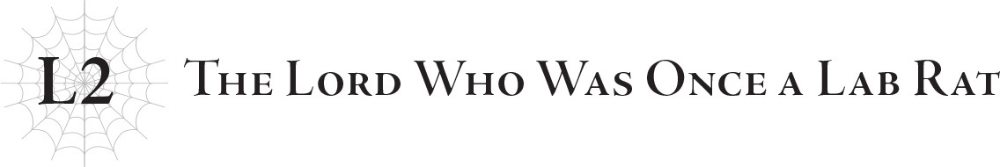

# Lãnh chúa từng là chuột thí nghiệm
*(The Lord Who Was Once a Lab Rat)*

Đáng căm phẫn thay, gã đàn ông tên Potimas Harrifenas lại đóng một phần không thể tách rời trong phần lớn cuộc đời tôi.

Từ thời khắc chào đời cho đến tận ngày hôm nay, tôi vẫn luôn bị ám ảnh bởi bóng đen của gã đàn ông đó.

Lý do vô cùng đơn giản, dù bản thân tôi cực kỳ không muốn thừa nhận chút nào: Hắn là cha tôi, dẫu chỉ là trên phương diện huyết thống.

Chắc chắn rằng hắn chưa một lần đối xử với tôi như một người con gái.

Giờ thì điều đó cũng chẳng còn quan trọng nữa, và tôi cũng chẳng cách nào xác nhận chuyện này, nhưng tôi ngờ rằng hắn thậm chí còn chưa bao giờ ghi nhận sự ra đời của tôi vào gia phả hay bất cứ thứ gì tương tự.

Nói cách khác, hắn chối bỏ sự tồn tại của tôi.

Điều đó cũng là lẽ hiển nhiên, bởi đối với hắn, tôi chẳng qua chỉ là một con chuột bạch phục vụ cho các thí nghiệm của mình.

Ký ức sớm nhất của tôi là hình ảnh đang nằm trên giường trong một phòng thí nghiệm, hoặc đại loại thế.

Rõ ràng là đến thời điểm này tôi chẳng thể nhớ rõ chi tiết, nhưng tôi biết mình đã nằm ở nơi đó suốt một thời gian rất dài.

Hoặc có lẽ nói rằng tôi không còn lựa chọn nào khác ngoài việc nằm đó sẽ chính xác hơn.

Tôi phải nằm liệt giường cả ngày lẫn đêm, thậm chí không có nổi khả năng ngồi dậy.

Vào lúc tôi bắt đầu có nhận thức về bản thân, tôi đã ở trong tình trạng đó rồi.

May mắn thay, tôi đã tự nhiên tiếp thu được khả năng hiểu ngôn ngữ, có lẽ là nhờ chiếc tivi luôn được bật trong căn phòng đó.

Vì Potimas thường chọn các chương trình giáo dục cho tôi xem, nên tôi cũng đã tích lũy được một lượng kiến thức kha khá mà không cần phải rời khỏi giường.

Dẫu vậy, tôi chắc chắn đó cũng chỉ là một phần trong thí nghiệm của hắn, nhằm kiểm tra xem liệu trí thông minh của tôi có phát triển với tốc độ như một con người bình thường hay không.

Phải, tất cả đều là một thí nghiệm.

Đó chính là lý do tôi được sinh ra đời.

Tôi chưa từng biết mẹ mình là ai.

Thực chất, tôi còn chẳng biết liệu mình có mẹ hay không.

Bởi vì tôi không phải là một con người bình thường.

Tôi là một chimera, đối tượng nghiên cứu của Potimas vào thời điểm đó.

Chimera được tạo ra khi kết hợp các yếu tố từ những sinh vật khác nhau để tạo ra một loài mới. Tôi chính là kết quả của một thí nghiệm như thế.

Khi tôi nói Potimas là cha mình, tôi không có ý nói rằng hắn đã thụ thai cho người mẹ giả định nào đó của tôi, rồi bà sinh ra tôi sau đó.

Tôi chỉ muốn nói rằng tôi là một chimera được tạo ra dựa trên bộ gen của Potimas.

Đến giờ tôi vẫn không biết mình được sinh ra trong ống nghiệm, hay thực sự có một người mẹ.

Ở thời điểm này, tôi hoàn toàn vô phương tìm hiểu.

Nhưng tôi ngờ rằng khả năng cao là vế trước hơn. Tôi đoán việc tôi được tạo ra không hề liên quan đến tử cung của người mẹ.

Dựa trên cấu trúc cơ thể của mình, tôi hoài nghi liệu có người mẹ nào có thể sống sót để mang thai tôi đủ tháng hay không.

Đó cũng chính là lý do tôi bị buộc phải chịu cảnh nằm liệt giường.

Cụ thể là: cơ thể tôi có độc.

Tôi rõ ràng được tạo ra bằng cách sử dụng DNA từ nhiều sinh vật khác nhau lấy gen của Potimas làm nền tảng, nhưng có vẻ như tác động mạnh mẽ nhất lại đến từ DNA của một loài nhện.

Cơ thể tôi có khả năng tự sản sinh độc tố.

Thời điểm đó hoàn toàn không có cách nào để biết được điều này bắt nguồn từ loài nhện; diện mạo của tôi hoàn toàn là con người, và tôi cũng chẳng sở hữu bất kỳ đặc điểm nào giống nhện cả.

Tôi chỉ biết được điều này rất lâu sau đó, khi Hệ thống được vận hành và rất nhiều kỹ năng cũng như danh hiệu của tôi có liên quan đến loài nhện.

Vào những ngày đó, tất cả những gì tôi biết là chất độc đang ăn mòn dần cơ thể mình.

Phải, trong khi cơ thể tôi sản sinh ra chất độc, nó đáng tiếc thay lại không có khả năng xử lý chất độc đó.

Vì thế, cơ thể tôi liên tục bị chính chất độc của mình hủy hoại, khiến tôi không thể sống một cuộc sống bình thường.

Cách duy nhất để cơ thể tôi có thể tiếp tục sinh tồn là nằm trên giường và liên tục tiếp nhận chất dinh dưỡng cùng thuốc trung hòa độc qua đường truyền tĩnh mạch.

Tôi không thực sự sống. Tôi chỉ đang được duy trì sự sống mà thôi.

Và suốt thời gian đó, tôi chẳng được đối xử gì khác ngoài một con chuột thí nghiệm, thỉnh thoảng lại bị rút máu và những việc tương tự.

Potimas không hề có lấy một chút cảm xúc hay sự đồng cảm nào. Có lẽ cuối cùng hắn cũng sẽ cho tôi cái chết nhân đạo một khi đã thu thập đủ dữ liệu từ cơ thể tôi.

May mắn thay, tôi đã được cô Sariel cứu thoát trước khi chuyện đó xảy ra.

Trong một khoảnh khắc hiếm hoi, Potimas dường như đã phạm phải một sai lầm nghiêm trọng không lâu trước khi tôi được cứu, và cuộc điều tra kéo theo sau đó đã lan rộng ra khắp thế giới.

Sau đó, những đứa trẻ chimera khác giống tôi vốn bị dùng làm vật thí nghiệm đã được tìm thấy trên khắp thế giới, và cô Sariel đã dẫn dắt Quỹ Sariella nhận nuôi tất cả bọn họ.

Bởi vì rất nhiều đứa trẻ chimera khác cũng rơi vào hoàn cảnh đặc biệt giống tôi, các cô nhi viện thông thường không thể tiếp nhận và bắt buộc phải có sự can thiệp của các cơ sở y tế.

Ban đầu, chính xã hội cũng lúng túng không biết phải xử lý những chimera như chúng tôi thế nào, vì thế thường xuyên xảy ra các cuộc tranh chấp về quyền công dân và những vấn đề tương tự.

Hơn nữa, một vài đứa trẻ sở hữu những đặc điểm độc nhất có thể gây nguy hiểm, có ích, hoặc cả hai, khiến việc xử lý các chimera trở thành một vấn đề vô cùng nhạy cảm.

Do đó, trong số tất cả các bên quan tâm, Quỹ Sariella đã được chọn để giải quyết vụ việc: một tổ chức từ thiện không thuộc về bất kỳ quốc gia riêng biệt nào.

Quỹ Sariella có mối liên kết với cả ngành chăm sóc sức khỏe lẫn quản lý cô nhi viện, và vì họ không có sự liên kết vùng miền nào nên họ có thể giữ thái độ hoàn toàn trung lập.

Họ chắc chắn sẽ không sử dụng các chimera như những thứ vũ khí sống.

Đó là một tổ chức hoàn hảo để ủy thác việc chăm sóc chúng tôi.

Một số quốc gia đã cố giữ lại những chimera có vẻ hữu dụng cho riêng mình, nhưng vì đích thân chủ tịch của Quỹ, cô Sariel, luôn trực tiếp xuất hiện tại hiện trường nên rất hiếm khi ý đồ đó thành công.

Dĩ nhiên, chỉ sau khi Hệ thống được đưa vào vận hành, chúng tôi mới phát hiện ra rằng hóa ra vẫn có một vài ngoại lệ.

Ngay cả cô Sariel và Quỹ Sariella cũng không thể cứu hết tất cả bọn họ.

Nhưng dẫu vậy, cô Sariel đã cống hiến hết mình để cứu nhiều người trong chúng tôi nhất có thể, để đón nhận tất cả chúng tôi.

Ngay cả những chimera như tôi, những kẻ có lẽ đã cận kề cái chết.

Cả về thể xác lẫn tinh thần.

Chuyện có thể đã kết thúc trong bi kịch, nhưng sự thật vẫn là cô Sariel đã gom chúng tôi lại và cứu sống tất cả.

Những đứa trẻ chimera đã cùng chung sống trong một cô nhi viện không tên.

Họ chính là anh chị em của tôi.

Và những ngày tháng ở cô nhi viện cùng họ là khoảng thời gian hạnh phúc nhất trong cuộc đời tôi.

Đó chính là lý do vì sao tôi không thể để Potimas yên ổn trốn thoát sau khi đã cướp đi niềm hạnh phúc quý giá đó.

Tôi sẽ tự tay tiêu diệt hắn.

…Bằng mọi giá.

“Thật thảm hại.”

Một giọng nói cực kỳ khó chịu vang lên từ chiếc loa ẩn nào đó.

“Tất nhiên đó là tất cả những gì ngươi có thể làm rồi. Kẻ duy nhất ta cần phải đề phòng chỉ có Güliedistodiez mà thôi. Ngươi thực sự nghĩ mình có thể đánh bại ta, trong khi ta đã chuẩn bị sẵn sàng cho trận chiến chống lại một thực thể không kém cạnh gì thần thánh sao? Đó là lý do vì sao ngươi sẽ chẳng bao giờ là gì khác ngoài một con nhóc thảm hại.”

Là do tôi tưởng tượng, hay hắn đang nói nhiều hơn bình thường nhỉ?

Ít nhất thì, có lẽ tôi nên thấy mừng vì điều đó.

“Dẫu sao thì, chúng ta cũng đã biết nhau rất nhiều năm rồi. Sẽ thật vô lễ nếu nương tay với ngươi trong những giờ khắc cuối cùng của cuộc đời. Ta tin rằng ngươi đã có được đặc quyền bị đánh bại bởi toàn bộ sức mạnh của ta. Vì thế, ta cho rằng ngươi xứng đáng để ta sử dụng mẫu Gloria Loại Ω này, thứ ta chế tạo ra để đối đầu với Güliedistodiez.”

Giọng nói truyền qua loa lạnh lùng đưa ra đánh giá mà tôi chẳng hề yêu cầu.

Trước mắt tôi, đang cúi xuống nhìn tôi, là một món vũ khí cơ giới.

“Thật là một khoảnh khắc đầy cảm xúc. Những năm tháng dài đằng đẵng của chúng ta cuối cùng cũng sẽ chấm dứt, ngay tại đây và ngay lúc này. Cuối cùng ta cũng có thể xóa sạch mọi dấu vết mà không để lại một tàn tích nào. Vĩnh biệt ngươi, thất bại lớn nhất của đời ta.”

Rồi cỗ máy vung thanh kiếm của nó chém xuống người tôi.

---

[◀ Chương trước: Chương 2: Tiếng chuông bắt đầu trận chiến cuối cùng](05_ch2_the_starting_bell_of_the_final_battle.md) | [Chương tiếp theo: Đoạn phụ: Những thí nghiệm của Potimas ▶](07_interlude_potimass_experiments.md)
