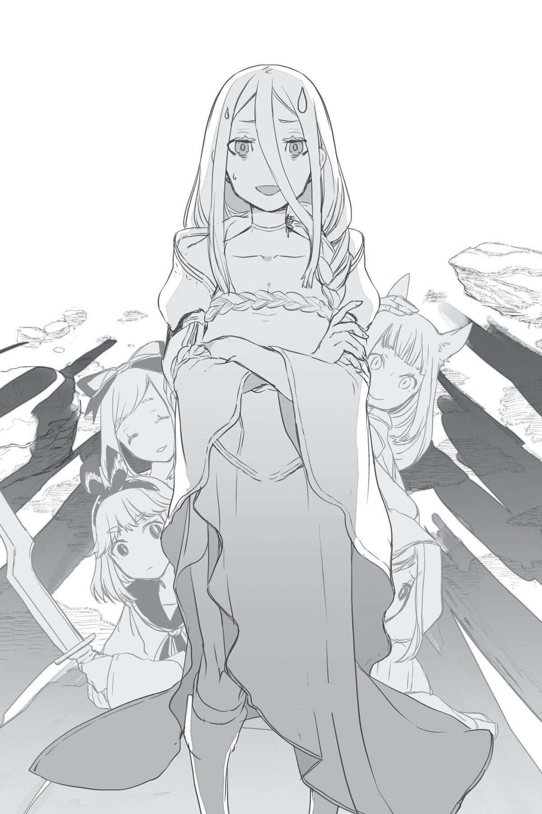

# Chương 3: Quyết chiến: Hủy diệt
*(Chapter 3: Showdown: Annihilation)*

Sau khi Ma Vương tiến vào hang ổ dưới lòng đất, tôi tự hỏi mình nên làm gì tiếp theo.

Không phải tôi không có việc gì để làm — hoàn toàn ngược lại là đằng khác: Có rất nhiều việc tôi có thể và nên làm.

Thực tế, tôi có nhiều sự lựa chọn đến mức chẳng biết phải bắt đầu từ đâu.

Trước tiên, tôi quyết định đánh giá toàn bộ chiến trường.

Sử dụng `[Vạn Lý Nhãn]`, tôi có được một góc nhìn từ trên cao của làng Elf.

Gần biên giới, nơi từng là kết giới, quân đội Đế quốc và quân đội Elf đang đụng độ.

Quân Đế quốc có vẻ đang gặp khó khăn khá lớn.

Đương nhiên rồi, lũ Elf có lợi thế sân nhà cực lớn ở giữa rừng.

Di chuyển tự do ở đây rất khó khăn, đó là lý do ban đầu chúng tôi phải chặt cây để mở đường hành quân.

Một khi trận chiến bắt đầu, cây cỏ và rễ cây dưới chân đã cản trở họ phát huy hết sức mạnh của mình.

Vì quân Đế quốc thường chiến đấu trên địa hình bằng phẳng, tôi đoán họ không quen với kiểu này cho lắm.

Họ thậm chí còn không giữ được đội hình vì bị cây cối bao quanh bốn bề.

Và vì cách phân bổ kỹ năng, các binh sĩ quân Đế quốc được chia thành các nhánh riêng biệt cực kỳ rõ ràng.

Kiếm sĩ chiến đấu bằng kiếm. Thuẫn sĩ chiến đấu bằng khiên. Ma pháp sư chiến đấu bằng ma pháp.

Mỗi người đều có vai trò riêng, và họ thực hiện chúng một cách máy móc.

Thông thường, họ sẽ sắp xếp đội hình tương ứng để tận dụng tối đa từng nhánh binh chủng.

...Nhưng rõ ràng lần này thì không ổn rồi.

Các kiếm sĩ không thể áp sát đủ gần để chiến đấu, khiên của thuẫn sĩ bị cung tên và ma pháp của lũ Elf né tránh, còn ma pháp sư quân Đế quốc thì gặp khó khăn trong việc nhắm bắn bằng phép thuật vì vướng đầy cây cối.

Trong khi đó, lũ Elf đang tận dụng tối đa lợi thế của những hàng cây.

Chúng nhảy từ cành này sang cành khác, dễ dàng né tránh quân Đế quốc.

Sau đó, chúng sử dụng những mũi tên và phép thuật chuẩn xác để hạ gục kẻ thù.

Chúng đã quá quen với việc chiến đấu trong rừng.

Thực chất, đánh giá qua các kỹ năng của chúng, có vẻ như chúng thực sự chuyên môn hóa về khoản này.

Xem ra chúng đang sử dụng `[Cơ động Không gian]` để nhảy nhót trên cây, đồng thời dùng cung tên hoặc ma pháp để nhắm vào kẻ địch từ xa mà không cần áp sát.

Sau đó chúng né tránh đòn phản công hoặc dùng thân cây làm khiên chắn.

Ngay cả khi số lượng hai bên tương đương nhau, việc đối phó với một đối thủ tối ưu hóa địa hình kỹ lưỡng như thế này vẫn rất khó khăn.

Quân Đế quốc tuy đông, nhưng họ không thể tận dụng được điều đó trong không gian chật hẹp của khu rừng, cũng như chẳng thể dùng số lượng áp đảo để càn quét.

Thứ họ cần lúc này là một sức mạnh có thể vô hiệu hóa lợi thế sân nhà của đối phương.

Hiện tại, những tiểu đội duy nhất đang thi đấu tốt là lực lượng chính do Natsume dẫn đầu, và một tiểu đội khác do một lão pháp sư trông quen mắt dẫn dắt.

Trông giống hệt lão già từng làm thầy của Dũng giả Julius.

Nhìn cách lão càn quét lũ Elf bằng những loạt ma pháp liên hoàn bắn nhanh là hiểu tại sao lão lại có được vị trí đó rồi.

Sự che chở của cây cối á?

Điều đó chẳng có nghĩa lý gì với lão già này cả!

Phép thuật của lão xuyên thẳng qua chúng.

Xem chừng lão già này vẫn còn rất nhiều năng lượng; lão hoàn toàn có thể thiêu rụi lũ Elf — và cả khu rừng này — thành tro bụi nếu thực sự muốn.

Miễn là chúng không tung lũ robot hay thứ gì tương tự ra, lão già đó sẽ ổn thôi.

Nhưng phần còn lại của quân Đế quốc đang bị đập cho tơi tả.

Có vẻ như họ cũng gây được chút ít thiệt hại cho phía Elf, nhưng tình hình trông không mấy khả quan.

Hy vọng ban đầu của tôi là quân Đế quốc sẽ gây ra tổn thất lớn cho quân đội Elf, sau đó quân ma tộc sẽ dọn dẹp chiến trường, nhưng với đà này lũ Elf sẽ hạ gục quân Đế quốc mà vẫn còn đủ sức để chống cự quyết liệt với quân ma tộc.

Phải thừa nhận là ngay từ đầu tôi đã không kỳ vọng nhiều vào quân Đế quốc, nhưng việc họ vô dụng hơn cả tôi tưởng thế này quả là một nỗi thất vọng lớn...

Dù thế nào đi nữa, nếu lũ robot xuất hiện, ngay cả lực lượng chính của quân ma tộc cũng chẳng làm ăn được gì nhiều. Xem ra những nỗ lực của quân Đế quốc đằng nào cũng không quá quan trọng.

Nhưng bên quân ma tộc có cậu Oni và Mera, còn bên quân Đế quốc cũng có Vampy và Phelmina.

Cho dù trận chiến này có trở nên khó khăn hơn dự kiến, tôi vẫn không nghĩ chúng tôi sẽ thua.

Đó là với điều kiện lũ Elf không tung lực lượng chủ lực của chúng — đám robot — vào sân đấu.

Tình hình của quân Đế quốc là thế đấy. Mặt khác, Nữ Vương và bầy Taratect đang hoàn toàn đè bẹp quân đội Elf ở hướng của họ.

Ý tôi là, lũ Taratect này vốn đã sống trong rừng suốt thời gian qua rồi.

Vì bản thân tôi đã có thể leo tường này nọ từ trước khi có được kỹ năng `[Cơ động Chiều không gian]`, nên rõ ràng loài Taratect cực kỳ thích hợp chiến đấu ở những địa hình nhiều chướng ngại vật.

Càng có nhiều bề mặt tiếp xúc thì càng dễ giăng tơ, đó là một lý do.

Dù lũ Elf có quen chiến đấu trong rừng đến mấy, chúng cũng không thể giỏi bằng loài Taratect vốn coi nơi này là ngôi nhà vĩnh viễn.

Thêm vào đó, lũ Taratect còn có Nữ Vương, cùng vài thực thể mạnh mẽ khác hoàn toàn vượt trội so với bất kỳ tên Elf nào.

Một nhóm Elf có lẽ có thể hạ gục được một con Taratect Vĩ đại, nhưng một con Taratect Thượng cổ hay bất kỳ thứ gì mạnh hơn thế sẽ là một thử thách khó nhằn hơn rất nhiều.

Mà đó là trong trường hợp một chọi nhiều thôi đấy.

Còn đằng này, số lượng Taratect lại nhiều hơn Elf, biến đây thành một cuộc tàn sát một chiều đúng nghĩa.

Lũ Elf về cơ bản đang bị nuốt chửng bởi làn sóng nhện mà không thể làm chúng chậm lại dù chỉ một chút.

Phải nói thật là, nhìn một biển nhện vô tận ùn ùn kéo ra từ khu rừng đủ để khiến bạn nổi hết da gà.

...Được rồi. Bên đó coi như không có vấn đề gì.

Tiếp theo, tình hình bên trong làng Elf thế nào rồi?

Đầu tiên, tôi liếc nhìn nhóm Yamada.

Có vẻ họ đang cố gắng bảo vệ khu vực có cổng dịch chuyển.

Nhưng Kusama đã nhanh chân hơn một bước và phá hủy chúng.

Nhận ra kết giới sắp sụp đổ, tất cả họ đều leo lên lưng Shinohara dưới hình dạng rồng và đang hướng về phía biên giới.

Có vẻ họ đang hướng đến vị trí của Natsume.

Trong khi đó, bản thân Natsume đang kẹt trong một trận quyết chiến sinh tử với cô Oka.

Có Vampy ở ngay đó, nên tôi không nghĩ tính mạng của cô Oka gặp nguy hiểm thực sự.

Mà nếu có nguy hiểm thật, tôi cũng sẽ tự tay tiễn sạch tất cả những kẻ liên quan đi chầu ông bà luôn.

Nếu nhóm Yamada đang hướng tới chỗ Natsume, họ sẽ phải đối đầu với Vampy, và họ cũng sẽ không đụng độ Ma Vương. Cứ lờ họ đi chắc cũng không sao.

Còn lũ Elf bên trong làng dường như không làm gì nhiều.

Những tên bình thường, tôi đoán là không biết gì về đám robot, đang trốn biệt trong nhà với vẻ mặt vô cùng sợ hãi.

Hầu hết những kẻ có khả năng chiến đấu đều đã ra tiền tuyến, chỉ còn lại lực lượng bảo an ít ỏi và những kẻ không có khả năng chiến đấu.

Không thấy bóng dáng robot nào.

Hửm. Hay là tôi nên tận dụng cơ hội này nhỉ?

Tôi có thể xóa sổ toàn bộ lũ Elf trong làng trước khi đám robot xuất hiện.

Chủng tộc Elf thực chất đều là tay chân và vật thí nghiệm do Potimas tạo ra.

Vì vậy, tất cả bọn chúng đều phải chết, ngoại trừ cô Oka.

Đó là một thực tế hiển nhiên.

Dù là kẻ không có khả năng chiến đấu, trẻ em, người già hay bất kỳ ai, chúng tôi cũng phải tiêu diệt không chừa một mống.

Và ngay lúc này, những mục tiêu đó đều đang trốn trong nhà mà không có sự bảo vệ thực sự nào.

Tôi có thể thực sự để cơ hội này tuột mất sao?

Không bao giờ có chuyện đó.

Vậy thì tôi biết mình phải làm gì rồi.

Hú hu! Đến giờ đi săn rồi, các em ơi!

Tôi tiến về khu dân cư của lũ Elf, dẫn theo bốn chị em nhện rối đi cùng.

Với tốc độ của chúng tôi, việc di chuyển từ rìa làng Elf đến khu dân cư chỉ mất trong nháy mắt.

Chớp mắt một cái, chúng tôi đã đến mục tiêu.

Có một tên lính gác Elf đang canh phòng, nhưng Ael đã chém bay đầu hắn trước khi hắn kịp phản ứng.

...Có phải do tôi tưởng tượng không, hay là tên đó thậm chí còn chưa kịp hiểu chuyện gì đang xảy ra thì đã thăng thiên rồi?

Dạo gần đây họ không có nhiều cơ hội để thể hiện, nhưng dù sao các nhện rối vẫn là những quái vật sở hữu chỉ số lên đến hơn mười ngàn.

Và vì đã lâu không được đứng dưới ánh đèn sân khấu, họ đang cực kỳ háo hức muốn ra trận.

Ngay lúc này, Ael trông có vẻ rất hài lòng với bản thân vì đã lấy đầu tên lính gác đó.

Trông cũng đáng yêu đấy, ngoại trừ việc con bé vừa mới chặt đầu người ta xong.

Được rồi, nếu họ đã muốn thể hiện đến thế, tôi cũng nên giao việc cho bốn chị em họ thôi.

"Tản ra."

Theo mệnh lệnh của tôi, bốn chị em tản ra bốn hướng.

Tôi nghĩ chia tách họ ra sẽ đạt hiệu quả tối đa.

Ngay cả khi có robot xuất hiện, tôi không nghĩ ai trong số họ sẽ thua trong một trận chiến tay đôi, và họ cũng đủ nhanh để chạy thoát đến nơi an toàn nếu bị tấn công bởi một nhóm đông.

Có lẽ tôi cũng nên bắt tay vào việc thôi.

Tôi chọn hướng ngược lại với các chị em nhện rối và lao thẳng tới.

Vừa đi, tôi vừa liên tục thả ra hàng loạt phân thân chiến đấu.

Cho dù các nhện rối có mạnh đến đâu, số lượng của họ vẫn là quá ít để có thể phong tỏa toàn bộ làng Elf.

Thế nên các phân thân chiến đấu của tôi bắt đầu quấy phá náo loạn khắp nơi để bù đắp vào phần đó.

Chỉ cần robot không xuất hiện, tộc Elf sẽ không có cách nào chống lại các phân thân chiến đấu hay các nhện rối.

Khu dân cư tuy lớn, nhưng chắc cũng không mất quá nhiều thời gian để kiểm soát toàn bộ.

Dù là đối đầu với phân thân chiến đấu hay nhện rối, tộc Elf cũng không đủ mạnh để có thể phản kháng.

Đó là một cuộc tàn sát.

Tất cả diễn ra chỉ trong vài khoảnh khắc ngắn ngủi giữa các bước di chuyển.

Việc lấy đầu ai đó khi bạn chạy lướt qua thật dễ dàng làm sao.

Trong lúc đó, tôi cắt ngang qua khu dân cư tiến thẳng về phía trung tâm làng Elf.

Đến đây, tạm thời tôi sẽ ngừng thả phân thân chiến đấu.

Tôi đang hướng đến khu vực giam giữ những người tái sinh.

Nếu tôi không bảo đảm an toàn cho họ, Potimas có thể sẽ giở trò gì đó khi hắn bị dồn vào đường cùng.

Có vẻ như hắn vẫn chưa làm gì như vậy, nhưng tôi sẽ yên tâm hơn nếu đảm bảo họ an toàn trước khi hắn có cơ hội ra tay.

Vì vậy tôi đến nơi giam giữ những người tái sinh, rồi không nói không rằng ném tất cả bọn họ vào một chiều không gian riêng biệt.

Tôi đoán là họ sẽ chẳng hiểu đầu đuôi tai nheo gì cả.

Họ thậm chí còn chưa kịp nhìn thấy mặt tôi.

...Sao cơ, bạn nghĩ như vậy là lười biếng à?

Nghe này, chúng tôi đang trong tình trạng khẩn cấp mà...

Và về mặt kỹ thuật thì họ sẽ an toàn nhất trong chiều không gian thay thế này, thế nên là...

Hoàn toàn không phải vì tôi lười gặp mặt trực tiếp những người tái sinh khác hay lý do ngớ ngẩn nào tương tự đâu nhé.

Không phải đâu đấy! Tôi thề.

Tôi đã chuẩn bị sẵn cho họ đủ thức ăn, nước uống và những thứ nhu yếu phẩm dùng trong vài ngày, cùng cả chỗ để ngủ.

Ngay cả khi tôi có mệnh hệ gì đi nữa, họ cũng sẽ được tự động chuyển đến một nơi an toàn trong thế giới này.

Dù rõ ràng là tôi không hề có kế hoạch đi chầu ông bà rồi.

Dù sao đi nữa, chuyện của những người tái sinh coi như đã xong.

Giờ tôi có thể bung lụa mà không cần lo lắng gì nữa.

Tôi quay lại khu dân cư, nơi cuộc dọn dẹp đã hoàn tất.

...Hửm.

Tôi đã đinh ninh rằng lũ robot sẽ xuất hiện trước khi chúng tôi dọn dẹp xong ở đây chứ.

Lẽ nào Potimas đã hết sạch robot rồi sao?

Potimas đời nào lại hài lòng với một lượng viện binh ít ỏi đến thế.

Và cũng không phải lão đang dồn toàn bộ lực lượng để chiến đấu với Ma Vương ở dưới lòng đất.

Đánh giá từ hình ảnh truyền về của con nhện giám sát siêu nhỏ mà tôi phái đi theo Ma Vương, rõ ràng cô ấy không hề phải chiến đấu với toàn bộ quân đoàn của lão.

Potimas chắc chắn vẫn đang giấu bớt lực lượng ở một xó xỉnh nào đó.

...Vậy tại sao lão vẫn chưa tung thêm bất kỳ thứ gì ra?

Lòng đầy nghi hoặc, tôi đáp xuống trung tâm khu dân cư.

Các chị em nhện rối cũng đã tập hợp lại đây.

Không có một vết xước nào trên người họ, thậm chí không có cả vết máu bắn từ các nạn nhân.

Thực tế, ngay cả những thanh kiếm trong tay họ cũng không dính lấy một giọt máu — chuyện này là sao chứ?

Chẳng lẽ họ chém người nhanh đến mức máu không kịp bám vào lưỡi kiếm luôn à?

Trời ạ, đáng sợ ở chỗ điều đó có khi lại là sự thật đấy chứ.

Nhìn quanh khu phố đầy những ngôi nhà của tộc Elf được khắc từ những thân cây khổng lồ, bầu không khí cổ tích đã bị phá hỏng hoàn toàn bởi một biển máu.

U là trời, cảnh tượng kinh hoàng thật sự.

Chúng tôi vẫn chưa quét sạch hoàn toàn khu vực này, nhưng một nhóm nhỏ Elf còn sống sót đang bị các phân thân chiến đấu của tôi truy sát ngay lúc này.

Đến thời điểm này, tôi buộc phải cho rằng Potimas chỉ đơn giản là đã quyết định bỏ rơi lũ Elf trên mặt đất.

Nhưng rồi, như thể muốn chứng minh tôi đã sai, con đường đi qua khu dân cư đột ngột nứt toác ra, để lộ một cái hố dẫn xuống lòng đất.

Và một con robot bò lên từ đó.

Tôi vẫn không hiểu tại sao Potimas lại để mặc chúng tôi giết sạch lũ Elf, nhưng có vẻ như đây mới là nơi trận chiến thực sự bắt đầu.

Các nhện rối bước lên phía trước để nghênh chiến với con robot.

Có lẽ họ đang phấn khích vì được chiến đấu thực sự chứ không chỉ là một cuộc tàn sát đơn thuần, vì họ vẫn chưa thể hiện đã tay.

Tôi đoán mình có thể để họ tự giải quyết một con robot cỏn con... này...

Những tiếng va chạm kim loại chói tai vang lên khắp khu vực, và một số lượng robot khổng lồ bắt đầu tuôn ra từ dưới lòng đất.

...Thế này có hơi quá đà không?

Và không chỉ ở khu vực này. Từng bầy robot đang trồi lên khắp làng Elf.

Chỉ cần liếc qua `[Vạn Lý Nhãn]`, số lượng của chúng dễ dàng lên tới hàng chục ngàn con.

...Nói nghiêm túc đấy, thế này chẳng phải là quá nhiều sao?

Mấy con tôi đập vỡ lúc trước trông khá mỏng manh, nhưng tôi không ngờ chúng lại được sản xuất hàng loạt nhiều đến thế.

Thật luôn, ai lại đi sản xuất hàng loạt robot chiến đấu thế này chứ?

Lại còn đông đến mức này nữa?!

Các nhện rối nhìn nhau.

Rồi họ lập tức lùi lại nấp sau lưng tôi.

...Vẻ mặt háo hức hăm hở lúc nãy đâu mất tiêu rồi hả?!

Ờ thì, tôi đoán như vậy cũng hợp lý thôi...

Số lượng đông đảo thế này có hơi quá sức đối với họ...

Tôi tự tin nói rằng họ có thể hạ gục lũ robot này trong thế một chọi một, hoặc thậm chí là một chọi hai hay chọi ba.

Nhưng đông thế này á? Không đời nào.

Trời đất ơi, ngay cả tôi cũng không ngờ tới chuyện này!

Tôi có thể bảo vệ các nhện rối vì họ đang ở ngay cạnh tôi, nhưng quân đội Đế quốc và quân ma tộc có lẽ sẽ gặp rắc rối to đây.

Chết tiệt, tình hình này có khi sẽ rất tệ cho cả Vampy và cậu Oni nữa...

Khi tâm trí tôi đang xoay như chong chóng, lũ robot đồng loạt chĩa súng về phía chúng tôi.

Và rồi những họng súng cùng lúc phun ra những tia lửa.

---

---

[◀ Chương trước: Trầm tư: Thiên thần lạc lối và Rồng](08_b2_ruminate_the_lost_angel_and_the_dragon.md) | [Chương tiếp theo: Lãnh chúa từng có những người bạn ▶](10_l3_the_lord_who_had_friends.md)
