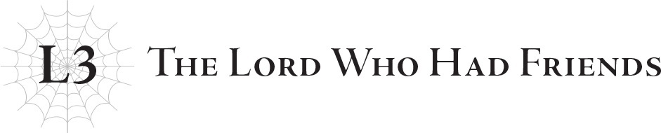

# Lãnh chúa từng có những người bạn
*(The Lord Who Had Friends)*

“Và sau đây, chúng ta sẽ chuyển sang tin tức tiếp theo.”

Phòng sinh hoạt chung của cô nhi viện rất rộng lớn.

Vì thế nên nó cũng được trang bị một chiếc tivi rất to, nơi tôi đã dành phần lớn thời gian để dán mắt vào.

Vì cuộc sống thường nhật của tôi gắn liền với chiếc xe lăn, tôi không thể chạy nhảy chơi đùa cùng những đứa trẻ khác.

Khi được đưa đến cô nhi viện, tôi cuối cùng cũng đã có thể giã từ những ngày tháng liệt giường.

Nhưng cơ thể tôi không hề lành lặn lại một cách thần kỳ.

Sau vài cuộc kiểm tra — lần này là nhằm mục đích điều trị thực sự chứ không phải để thí nghiệm — tôi được kê một loại thuốc mới giúp tôi có thể rời khỏi giường bệnh để ngồi lên xe lăn.

Tôi thậm chí còn có thể tự bước đi một chút nếu chống gậy.

Dẫu vậy, tôi vẫn không thể tháo bỏ những đường ống truyền dịch liên tục cung cấp thuốc men và chất dinh dưỡng cho cơ thể.

Bởi vì cơ thể tôi vẫn không ngừng sản sinh kịch độc, tôi buộc phải dùng đến thuốc giải cùng các chất bổ trợ dinh dưỡng để duy trì sự sống.

Trớ trêu thay, để có thể tiếp tục sản sinh lượng độc tố đó, cơ thể tôi lại cần nhiều chất dinh dưỡng hơn cả một người bình thường.

Có thể bạn sẽ tự hỏi liệu cơ thể tôi có ngừng tạo độc nếu tôi ngừng hấp thụ dinh dưỡng hay không, nhưng câu trả lời là không: cơ thể tôi vẫn sẽ tiếp tục sản sinh chất độc, và đã thế tôi còn bị suy dinh dưỡng thêm nữa.

Chỉ nhờ sự kết hợp giữa truyền dịch tĩnh mạch và chế độ ăn lỏng dễ tiêu hóa, cơ thể tôi mới có thể miễn cưỡng tự duy trì.

Đáng tiếc là điều đó khiến cơ thể tôi không còn lại bao nhiêu dưỡng chất để phát triển, đó là lý do vì sao cho đến tận ngày hôm nay tôi vẫn thấp bé nhẹ cân như thế này.

Dù nói một cách chính xác thì không phải là tôi hoàn toàn không lớn lên chút nào.

Một khi cơ thể phát triển và tôi có thêm một chút thể lực, tôi cuối cùng đã có thể tự mình di chuyển, dù chỉ trong chốc lát và cần phải chống gậy hỗ trợ.

Ngay cả vậy, tôi vẫn phải dành phần lớn thời gian trong ngày trên xe lăn, điều đó chắc chắn đã hạn chế các lựa chọn hoạt động của tôi.

Việc xem tivi trong phòng sinh hoạt chung là một trong số ít những hoạt động mà tôi có thể làm.

“Sáng nay, chúng tôi đã có cuộc phỏng vấn với ngài Dustin, Tổng thống của Daztrudia.”

Thỉnh thoảng tôi cũng giết thời gian bằng cách đọc sách, thêu thùa và những việc tương tự, nhưng tôi thích nhất là chẳng làm gì ngoài việc dán mắt vào màn hình.

Thực tế, tôi sẽ cảm thấy bồn chồn khó chịu nếu không được xem, có lẽ là do tôi chẳng làm gì khác ngoài xem tivi trước khi đến cô nhi viện.

“Tôi sẽ không cho phép sử dụng năng lượng MA ở đất nước chúng ta. Phải chăng tất cả chúng ta đã quên đi những tội ác của Potimas, kẻ đã phát hiện ra nó? Vẫn còn quá nhiều bí ẩn xoay quanh năng lượng MA. Tôi không thể chấp nhận nó cho đến khi chúng ta biết rõ những tác hại tiềm ẩn khi sử dụng thứ năng lượng này.”

Tôi rời mắt khỏi chiếc tivi và nhìn ra ngoài sân vườn, nơi những đứa trẻ sở hữu đủ loại đặc điểm dị biệt đang chạy nhảy vui đùa.

Tất cả chúng đều là các chimera, kết quả từ những thí nghiệm của Potimas.

Tôi không có bất kỳ năng lực nào biểu hiện rõ rệt qua diện mạo bên ngoài, nhưng hơn một nửa số trẻ em ở đây có thể dễ dàng phân biệt được với người bình thường chỉ bằng một cái nhìn thoáng qua.

Một cô bé có đôi tai dài nhọn đang đuổi bắt một cậu bé sở hữu làn da xanh lá.

Một cậu bé tóc hồng ném quả bóng về một hướng ngẫu nhiên, và một cậu bé khác với cơ thể bao phủ bởi lông thú đã nhảy cao hơn cả chiều cao của một người trưởng thành bình thường rồi dễ dàng bắt gọn lấy nó.

Những cảnh tượng như thế hoàn toàn là điều bình thường ở cô nhi viện này.

Đó là một nơi khá rộng lớn, bởi vì nó còn tích hợp cả các cơ sở y tế để chăm sóc cho các tác dụng phụ về mặt thể chất thường gặp ở các chimera.

Khoảng sân cũng rất rộng rãi, đủ để ngay cả những đứa trẻ chimera sở hữu năng lực thể chất siêu phàm cũng có thể tự do chơi đùa.

Những đứa trẻ từng bị Potimas giam cầm trong những căn phòng không thể tự do di chuyển giờ đây đã có thể thỏa thích vui chơi trong sân cô nhi viện.

Dẫu vậy, vẫn có một vài đứa trẻ giống như tôi không thể tham gia cùng do vấn đề sức khỏe.

May mắn thay, lũ trẻ chưa từng ôm giữ ác ý đối với nhau; tất cả chúng tôi đều thân thiết như nhau, bất kể có thể tự do đi lại hay không.

Tôi nghĩ đó là vì chúng tôi cảm thấy mình cùng một giuộc, cùng hội cùng thuyền.

Các chimera đều dị biệt đến mức mỗi đứa có thể được coi là một chủng tộc riêng, nhưng tất cả chúng tôi đều hiểu rằng mỗi người sở hữu những đặc điểm hoàn toàn khác nhau, và tôi nghĩ điều đó đã mang lại lợi thế cho chúng tôi.

Bởi vì mỗi người đều quá độc nhất, thế nên ở đây chưa bao giờ tồn tại khái niệm phân biệt đối xử.

Có lẽ đó chỉ là một sự may mắn ngẫu nhiên.

Những đứa trẻ bình thường sẽ đến trường, và học cách vận hành của thế giới ở đó.

Những nguồn thông tin như tivi không đem lại cảm giác hoàn toàn chân thực đối với trẻ con; chúng cần phải tận mắt nhìn thấy và tận tai nghe thấy mọi thứ.

Vì vậy, theo một nghĩa nào đó, lũ trẻ ở cô nhi viện bị cô lập với phần còn lại của thế giới, và biết rất ít về xã hội cũng như những kiến thức thông thường.

Dù vậy, điều này cũng không hẳn là xấu, và đằng nào thì bản chất của toàn bộ thế giới cũng sắp sửa thay đổi, nên việc chúng có biết gì về cách thế giới từng vận hành trước đây hay không cũng chẳng còn quan trọng nữa.

“Trong khi Tổng thống Dustin kiên quyết phản đối việc sử dụng năng lượng MA và cấm đoán thứ năng lượng này tại Daztrudia, ngày càng có nhiều quốc gia khác bắt đầu đưa vào áp dụng...”

Khi tôi lơ đãng theo dõi bản tin vào thời điểm đó, tôi không hề biết rằng thứ “năng lượng MA” này cuối cùng sẽ đẩy thế giới vào cảnh hỗn loạn và mang lại những thay đổi thậm chí còn to lớn hơn.

Ngay cả khi tôi có biết đi chăng nữa, tôi cũng chỉ là một đứa trẻ ngồi xe lăn. Tôi hoài nghi liệu mình có thể làm được gì để ngăn chặn nó hay không.

“Vào nhà đi nào, lũ trẻ nghịch ngợm này! Đến giờ ăn trưa rồi!”

Viện trưởng cô nhi viện bước phăm phăm ra sân.

Cô là một phụ nữ trung niên mũm mĩm, dễ mến, trước đây từng là bác sĩ nhi khoa.

Với tư cách là một trong những bác sĩ toàn thời gian của Quỹ Sariella, cô từng đi khắp thế giới đến đủ loại bệnh viện và cô nhi viện để điều trị cũng như chẩn đoán cho trẻ em ở khắp mọi nơi.

Vì sức khỏe và tuổi tác bắt đầu khiến cô khó lòng bay đi bay lại thường xuyên như thế, cô đã gửi yêu cầu lên Quỹ xin được công tác cố định tại một nơi, và từ đó trở thành viện trưởng cô nhi viện của chúng tôi.

Cô rất khéo léo trong việc chăm sóc trẻ con, đặc biệt là khi cô từng là một bác sĩ nhi khoa.

“Nào, vào nhà nhanh lên! Đi rửa tay đi!”

Trong ký ức của tôi, cô là một người phụ nữ mạnh mẽ với tính cách hào sảng tương xứng với vóc dáng của mình.

Lũ trẻ vâng lời, vừa la hét vừa cười đùa khi ùa vào trong nhà.

Cô Sariel cũng ở trong số đó, chắc hẳn đã bị lũ trẻ xô đẩy; quần áo của cô nhăn nhúm và vấy bẩn, và không hiểu sao trên tóc cô lại có vài bông hoa cắm lộn xộn.

“Khai mau! Đứa nghịch ngợm nào biến cô Sariel thành lọ hoa thế này?!”

“Không phải. Đây là quà tặng.”

Cô Sariel bình thản phản đối lời của viện trưởng.

Chắc hẳn một trong những đứa trẻ đã cố gắng tặng hoa cho cô.

Nhưng chúng làm một cách vụng về, cắm thẳng hoa lên đầu cô Sariel khi vẫn còn nguyên cả cành lá, tạo nên một vẻ ngoài thực sự kỳ khôi.

“Nếu muốn tặng hoa thì ít nhất phải kết thành vòng hoa hoặc ngắt bỏ phần cành đi chứ!”

“Dạ vâng ạ.”

Thủ phạm nhí rụt rè đáp lời, trong khi những cậu bé khác cười ồ lên.

Liền sau đó, viện trưởng gõ đầu mấy cậu nhóc kia.

“Còn lũ nghịch ngợm các người nữa, người ngợm lấm lem bùn đất thế kia! Vết bẩn trên quần áo cô Sariel chắc chắn cũng là do các người làm đúng không?! Tất cả đi tắm trước khi ăn trưa ngay!”

Nói rồi, cô túm lấy hai đứa trẻ đặc biệt lấm lem nhất, kẹp nách mỗi bên một đứa rồi xách thẳng chúng đi tắm.

Mọi người náo nhiệt đến thế.

Nhưng tôi đã quen với những cảnh tượng như vậy từ lâu.

Nhìn mọi người cùng nhau mỉm cười và vui vẻ cười đùa khiến tôi thấy hạnh phúc.

So với cuộc sống lạnh lẽo, cô độc một mình trên giường bệnh trước khi đến đây, cuộc sống ở cô nhi viện mang lại cảm giác vô cùng ấm áp.

Tôi chỉ hy vọng rằng những tháng ngày ấm áp, hạnh phúc như thế sẽ kéo dài mãi mãi.

“Những người biểu tình hiện đang xuống đường phản đối lập trường của Tổng thống Dustin về việc sử dụng năng lượng MA.”

Nhưng mong ước đó chỉ là vô vọng, bởi vì ngày tàn đã cận kề trước mắt.

---

[◀ Chương trước: Chương 3: Quyết chiến: Hủy diệt](09_ch3_showdown_annihilation.md) | [Chương tiếp theo: Trầm tư: Bị chặn đứng bởi Ma vương giới kinh doanh ▶](11_b3_ruminate_blocked_by_the_demon_lord_of_the_business_world.md)
