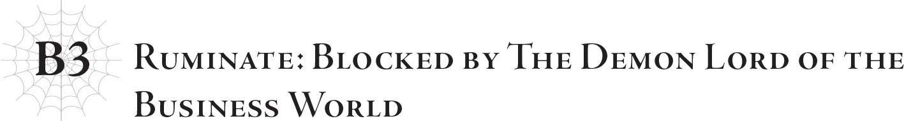

# Trầm tư: Bị chặn đứng bởi Ma vương giới kinh doanh
*(Ruminate: Blocked by the Demon Lord of the Business World)*

Nếu nói về mối quan hệ giữa tôi và Sariel, thì có một người khác mà tôi buộc phải nhắc đến.

Ariel ư?

Không phải.

Đúng là tôi đã quen biết cô ấy từ rất lâu rồi, nhưng vào những ngày đó, tôi chỉ biết lờ mờ rằng cô ấy là một trong những đứa trẻ được Sariel chăm sóc.

Chưa kể tất cả những đứa trẻ ở cô nhi viện đó đều là những cá nhân vô cùng đặc biệt.

Có vị anh hùng đời đầu, vị thánh nữ đời đầu, thú vương, cổ động vương...

Tất cả bọn họ đều đã làm loạn ngay sau khi hệ thống được thiết lập.

So với họ, Ariel chẳng có gì đáng chú ý.

Dù sao thì vào thời điểm đó, cô bé chỉ là một đứa trẻ yếu ớt không có sức mạnh.

Việc cô ấy có thể sống sót qua thời kỳ hỗn loạn ấy quả thực chẳng khác nào một phép màu.

Mặc dù đối với những ai biết cô ấy của hiện tại, điều này thật khó mà tưởng tượng nổi.

Dù thế nào đi nữa, Ariel thời ấy không để lại nhiều ấn tượng cho tôi.

…Hãy quay lại chủ đề chính nào.

Trước khi Sariel và tôi bắt đầu tương tác thường xuyên hơn, có một người đàn ông đã cản đường tôi.

Nói thẳng ra, ông ta khiến tôi khó mà gặp mặt cô ấy.

Tên của người đàn ông đó là Foduey.

Đúng vậy, chính là người đã quyên góp những khoản tiền khổng lồ cho Quỹ Sariella, và được biết đến với danh xưng "Ma Vương giới kinh doanh".

Dẫu vậy, vào thời điểm chúng tôi gặp nhau lần đầu, Foduey đã có tuổi.

Thời kỳ hoàng kim khi ông ta làm mưa làm gió khiến giới tài chính phải khiếp sợ đã lùi xa, và ông ta đang dành những năm tháng cuối đời để sử dụng một phần tài sản của mình, trong đó có một phần nhỏ hơn nữa được quyên góp cho Quỹ Sariella.

Dẫu thế, chỉ một tỷ lệ phần trăm ít ỏi từ lợi nhuận của ông ta thôi cũng đã đủ để tài trợ cho phần lớn các hoạt động của Quỹ, điều này phần nào cho thấy tổng tài sản của ông ta khổng lồ đến mức nào.

Nếu muốn, ông ta có thể hoàn thành hầu như mọi thứ bằng sức mạnh của khối tài sản đó.

Và ông ta không chỉ có mối quan hệ rộng rãi trong giới kinh doanh, mà cả trên chính trường nữa.

Sẽ không quá lời khi nói rằng sự hậu thuẫn của ông ta chính là lý do giúp Quỹ Sariella sở hữu tầm ảnh hưởng lớn đến thế.

Tất nhiên, nói đi cũng phải nói lại, khối tài sản của một con người tầm thường chỉ là thứ vụn vặt nhất đối với một con rồng như tôi.

Dù sao thì những thứ như thế chỉ có ý nghĩa trong xã hội loài người.

Một xấp tiền giấy thì có nghĩa lý gì với một con rồng chứ?

Hoàn toàn không.

Vì vậy đối với tôi, Foduey cũng chẳng khác nào bao con người tầm thường vô giá trị khác.

Cho đến khi tôi thực sự gặp ông ta.

Lần đầu tiên tôi giáp mặt Foduey là khi tôi đến gặp trực tiếp Sariel để nói thẳng cho cô ấy biết tôi nghĩ gì về các phương pháp của cô.

Như tôi đã nói trước đây, cách làm của Sariel khiến tôi vô cùng chướng tai gai mắt.

Suốt một thời gian, tôi chỉ bằng lòng với việc quan sát cô ấy, nhưng càng nhìn, sự thất vọng và bực dọc trong tôi càng chất chồng, cho đến một ngày tôi chạm giới hạn chịu đựng.

Thế là, tôi quyết định tìm gặp trực tiếp đối phương để khiếu nại.

Tôi hùng hổ bước thẳng vào một bệnh viện do Quỹ Sariella điều hành, đúng lúc Sariel đang đi thị sát nơi đó.

Thật không may cho tôi, đi cùng cô ấy lại có cả Foduey.

Phải, đó thực sự là một vận xui lớn, ít nhất là vào thời điểm ấy.

Khi nghĩ về những lần tương tác sau này của chúng tôi, tôi đoán mình sẽ không còn mô tả nó như thế nữa, nhưng đó chỉ là vì những gì tôi biết bây giờ.

Còn khi đó, cuộc gặp của chúng tôi chẳng khác nào một thảm họa.

Trong suốt cuộc đời mình, tôi chưa từng bị bất kỳ con người nào chế nhạo một cách triệt để đến thế, cả trước đó lẫn sau này.

Nghĩ lại thì việc tôi đứng hình kinh ngạc nhiều hơn là tức giận quả thực khá nực cười.

Thực sự thì vào những ngày đó, tôi bị chế giễu cũng đáng lắm.

Xét về thái độ của tôi lúc bấy giờ…

“Tại sao cô phải làm mọi chuyện một cách vòng vo như thế?”

Đó chính là những lời đầu tiên tôi nói với Sariel khi tìm thấy cô ấy.

Không nghi ngờ gì nữa, bất kỳ ai cũng sẽ coi đó là một lời gây sự.

Hoặc chí ít cũng là mở đầu cho một vụ rắc rối phiền toái.

Trên thực tế, Sariel đơn giản là lờ tôi đi và tiếp tục bước đi.

Foduey đi bên cạnh cô ấy cũng lướt qua tôi mà không thèm liếc nhìn lấy một cái.

“Này! Đứng lại đó!”

Lẽ tự nhiên, cái tôi non nớt của tôi coi việc bị ngó lơ là một sự xúc phạm không thể tin nổi, và hét lên để cản họ lại.

Mặc dù ngay từ đầu tôi mới là kẻ hành xử thô lỗ.

Tuy nhiên, ở thời điểm đó tôi đoán Foduey chỉ mới ngạc nhiên chứ chưa nổi giận.

Lời tiếp theo của tôi mới là thứ châm ngòi cho cơn giận của ông ta.

“Cô đã có thể cứu đứa trẻ đó! Tại sao cô lại để nó chết?!”

Bạn hỏi tôi có ý gì ư?

Đây là một bệnh viện do Quỹ Sariella vận hành.

Bản thân Sariel cũng thường xuyên đến đây thị sát.

Và tại đó, cô ấy biết tin một đứa trẻ cô từng trò chuyện trong lần ghé thăm trước đã qua đời vì bệnh tật.

Tôi đã chứng kiến cuộc trò chuyện cuối cùng của họ thông qua [Thiên Lý Nhãn].

“Cháu cảm ơn cô Sariel.”

“Không cần cảm ơn ta đâu. Đó là một phần sứ mệnh của ta.”

“Hẹn gặp lại cô lần sau nhé.”

“Ừ, hẹn gặp lại cháu.”

Thế nhưng sau khi chia tay, Sariel và đứa trẻ đó sẽ không bao giờ gặp lại nhau nữa.

Đứa bé mắc một căn bệnh nan y.

Nhưng đó chỉ là xét theo tiêu chuẩn của con người.

Với sức mạnh của Sariel, cô ấy chắc chắn có thể chữa lành hoàn toàn cho đứa trẻ.

Đây chính là lý do khiến sự thiếu kiên nhẫn của tôi trước cách làm việc gián tiếp của cô cuối cùng đã chạm tới giới hạn chịu đựng.

Có rất nhiều mạng sống mà Sariel có thể cứu được, ngay cả khi không cần mở bệnh viện hay những thứ tương tự.

Nhưng cô ấy đã chọn không làm điều đó.

Vậy mà cô ấy vẫn tỏ vẻ thoáng buồn khi nghe tin đứa trẻ qua đời ngày hôm đó.

Làm sao cô ấy có thể biểu lộ cảm xúc như thế khi bản thân có thể cứu mạng đứa trẻ mà lại không làm chứ?

Tôi cảm thấy điều đó vô cùng đáng ghét, đó là lý do tại sao tôi lại hét lên giận dữ đến vậy.

“Xin vui lòng giữ im lặng trong bệnh viện.”

Nhưng câu trả lời cho tiếng hét của tôi lại hoàn toàn không liên quan gì đến nội dung của nó.

Dù nghĩ lại thì tôi đoán đó là một cách phản ứng hoàn toàn hợp lý.

Nhưng vào lúc ấy, đó là câu trả lời cuối cùng mà tôi mong muốn được nghe cho câu hỏi của mình.

Sariel là thiên sứ duy nhất tôi quen biết, nhưng tôi nghĩ ngay lúc đó tôi đã nhận ra những thực thể như họ khó hiểu đến mức nào.

“Tôi không quan tâm đến chuyện đó!”

Tôi càng hét to hơn, cố gắng che giấu sự bối rối của mình trước cuộc đối thoại này.

Rồi tôi tiến lại gần Sariel hơn, và tôi tin là mình đã lớn tiếng tuyên bố rằng cô ấy có thể dễ dàng chữa lành cho người bệnh nếu cô muốn.

“Ta cảnh cáo ngươi thêm một lần nữa. Đây là bệnh viện. Giữ im lặng trong bệnh viện là lẽ thường tình.” Sariel vẫn dửng dưng. “Hơn nữa, bệnh viện này chuyên về nội khoa và ngoại khoa. Bệnh tâm thần nằm ngoài phạm vi chuyên môn của chúng tôi, vì vậy ta khuyên ngươi nên thử tìm một bệnh viện khác.”

Không chỉ dừng lại ở việc bảo tôi giữ im lặng, cô ấy còn bình thản xúc phạm tôi nữa.

Đến cả tôi cũng phải câm nín trước câu nói đó.

“Phụt!”

Rồi một người đàn ông dám cười khẩy trước vẻ mặt sững sờ của tôi.

Như bạn có thể đoán được từ ngữ cảnh, người này chính là Foduey.

Tôi lườm ông ta. “Đồ sinh vật hạ đẳng.”

“À, xin lỗi nhé. Nhưng tôi phải nói rằng, cậu nghĩ ai trong hai chúng ta trông có vẻ hạ đẳng hơn trong hoàn cảnh hiện tại?”

…Khi đó tôi còn rất trẻ con.

Trẻ con đến mức thản nhiên gọi thẳng một con người là "sinh vật hạ đẳng" ngay trước mặt họ.

Nhưng trong trường hợp này, câu trả lời của Foduey còn là một lời chỉ trích gay gắt hơn.

Chính lúc ấy, tôi mới nhận ra mình đã thu hút sự chú ý của mọi người xung quanh.

Tôi đoán đó là kết quả tất yếu của việc hét lớn trong bệnh viện.

Tất cả các bác sĩ, bệnh nhân, vân vân trong phạm vi nghe thấy đều đang dán mắt vào tôi với vẻ mặt vô cùng khó chịu.

Nếu tôi có thể tự bào chữa cho mình, thì vào thời điểm đó, sự chú ý của con người chẳng có nghĩa lý gì với tôi cả.

…Dù điều đó cũng chẳng phải là lời bào chữa gì cho cam.

Nhưng vào những ngày ấy, tôi luôn coi con người là những sinh vật vô giá trị.

Vì vậy tôi thấy không cần thiết phải lãng phí thời gian để bận tâm xem họ có đang nhìn mình hay không.

Thế rồi, tôi nhận ra sự khác biệt trong nhận thức của chúng tôi.

Dưới góc nhìn của tôi, Sariel là một vị thần, chứ không phải con người.

Vài tất nhiên, bản thân tôi là một con rồng, cũng chẳng phải con người nốt.

Tôi nói chuyện với giả định rằng con người là loài không đáng bận tâm, nhưng những người kia sẽ nghĩ gì khi nghe thấy lời tôi nói mà không hề biết tôi là ai?

Lải nhải về thần linh và khẳng định người phụ nữ này có thể chữa khỏi một căn bệnh mà không bác sĩ nào chữa được.

Một kẻ vô lý và thiếu suy nghĩ đến cực điểm.

Họ nhìn nhận tôi như vậy là hoàn toàn hợp lý.

Đó rõ ràng là hành vi của một kẻ nên được đưa vào bệnh viện tâm thần thì tốt hơn, đúng như lời Sariel nói.

Vì tôi đã cải trang, cả Sariel và tôi trông đều như những con người bình thường.

Việc những người không biết sự thật nhìn nhận chúng tôi như thế là điều hiển nhiên.

Đó là sai lầm của tôi khi không để tâm đến con người.

Nhưng lúc ấy tôi không thể dàn xếp ổn thỏa mọi chuyện, và dù sao thì tôi cũng không cảm thấy cần phải làm vậy với một con người tầm thường.

“Thật láo xược! Ngươi muốn chết sao?!”

Vì thế, tôi quyết định giữ vững thái độ của một con rồng.

“Ồ, thế này là sao? Không cãi lý được thì định dùng đến bạo lực hử? Một kẻ ngốc gọi đối thủ là hạ đẳng nhưng lại đấu trí không lại, thế mà vẫn thực sự tự cho mình là kẻ bề trên sao? Ồ, tôi hiểu rồi. Là vì cậu còn chẳng nhận thức được mình là kẻ ngốc đúng không? Xin lượng thứ cho tôi nhé. Tôi có thói xấu là hay lấy bản thân làm tiêu chuẩn. Điều đó khiến tôi khó lòng thấu hiểu những kẻ có đầu óc chậm tiêu hơn mình rất nhiều. Thứ lỗi cho tôi nhé. Tôi vô cùng xin lỗi.”

…Người đàn ông đó luôn như vậy.

Không chỉ là ông ta luôn có lời đối đáp cho mọi thứ—mà với mỗi câu nói hướng về mình, ông ta sẽ trả lại gấp mười lần.

Khi nói đến việc dùng lời lẽ để chế nhạo người khác, tôi chưa từng thấy ai tài ba hơn Foduey.

…Mặc dù tôi tự hỏi liệu có nên thực sự coi đó là một "tài năng" hay không.

Tuy nhiên, nhận xét của ông ta về việc dùng đến bạo lực nếu không cãi lý được đã làm tổn thương lòng tự trọng của tôi.

Nếu tôi ra tay với ông ta sau lời nhận xét đó, tôi sẽ thực sự trở thành kẻ ngốc đúng như những gì ông ta nói.

Và tôi quyết tâm không để chuyện đó xảy ra.

…Mặc dù mãi đến tận sau này tôi mới nhận ra mình đã thua cuộc tranh luận ngay từ khoảnh khắc ông ta thuyết phục tôi suy nghĩ theo hướng đó.

Nghĩ lại việc tôi để cho một con người mà mình khinh thường là hạ đẳng thao túng bằng lời nói dễ dàng đến vậy… Tôi không thể không tự cười nhạo sự ngớ ngẩn của chính mình.

“Tôi sẽ lắng nghe cậu nói nếu cậu chịu bước ra ngoài cùng tôi. Đây quả thực là bệnh viện. Đúng như ngài Sariel nói, nơi này không phải là chỗ để người ngoài xông vào gây náo loạn. Hay là đầu óc của cậu thực sự hạ đẳng đến mức không thể hiểu nổi một khái niệm đơn giản như thế?”

“Hự!”

Và thế là ông ta đã lợi dụng lòng tự trọng để ép tôi phải làm theo ý ông ta.

Vào thời điểm đó, tôi thực sự cảm thấy mình không còn lựa chọn nào khác ngoài việc làm theo lời Foduey.

Một con rồng như tôi lại bị ra lệnh bởi một con người tầm thường như ông ta sao?

Thật khó để nói điều này cho thấy Foduey đáng sợ hơn, hay bản thân tôi thảm hại hơn nữa.

Tôi muốn tin rằng không phải là vế sau…

…Mà thôi, tôi đoán giờ chuyện đó cũng chẳng còn quan trọng nữa.

Chẳng ích gì khi cứ cố tỏ ra vẻ ta đây quan trọng khi đã phơi bày những khía cạnh khó coi như thế này của bản thân.

Vì vậy, bị Foduey ép buộc, tôi rời bỏ Sariel và đi ra ngoài cùng ông ta, những lời của ông ta càng khẳng định thêm sự thật đó.

“Tôi phải nói rằng, cậu thực sự làm xấu mặt giới bám đuôi đấy.”

“Hả?”

Tôi chỉ biết há hốc mồm kinh ngạc đáp lại.

Kẻ bám đuôi?

Một con người lại dám gọi một con rồng hùng mạnh như tôi là… kẻ bám đuôi sao?

Làm sao người ta có thể không buồn cười cho được?

“Tôi yêu cầu cậu hãy kiềm chế bớt hành vi bám đuôi thái quá đó lại. Hay là cậu không nghe rõ tôi nói? Có vẻ như những 'sinh vật thượng đẳng' như cậu thường có xu hướng lãng tai thì phải. Điều đó không được hợp lý cho lắm dưới góc nhìn của tôi, nhưng thôi cứ coi đó là một trong nhiều bí ẩn của thế giới này đi. Chắc chắn phải có nền văn hóa nào đó coi việc lãng tai là niềm tự hào mà tôi chưa biết đến. Dù tôi không thể hiểu nổi logic đằng sau chuyện đó.”

Đó chính là phần thưởng cho câu trả lời ngớ ngẩn của tôi trước phát ngôn ban đầu của Foduey.

Giờ đây khi biết rằng thực ra lúc đó ông ta đã nương tay rất nhiều rồi, điều đó càng khiến mọi chuyện tệ hơn.

“Đừng có bôi nhọ danh dự của tôi. Tôi không hề lãng tai, và cũng chẳng phải kẻ bám đuôi nào cả.”

“Vậy sao? Thế thì cậu thực sự là một kẻ ngốc nếu bản thân còn không nhận thức được việc đó.”

“Ông nói cái gì?”

Một con rồng kiêu hãnh như tôi không bao giờ có thể thản nhiên chấp nhận cáo buộc là một kẻ bám đuôi.

Nhưng Foduey chỉ tiếp tục khiêu khích tôi.

Nếu không vì lời nhận xét trước đó của ông ta, tôi chắc chắn đã giết ông ta rồi.

“Ôi trời…”

Foduey thở dài một tiếng đầy kịch tính và giễu cợt, như thể đang thử thách giới hạn lý trí của tôi.

Tôi đã suýt chút nữa mất kiểm soát.

Nhưng những lời tiếp theo của ông ta đã khiến dòng suy nghĩ của tôi khựng lại.

“Nếu các vị tự coi mình là thượng đẳng như thế, ít nhất cũng nên học những điều cơ bản mà loài người hạ đẳng chúng tôi coi là kiến thức thường thức chứ. Cậu có đồng ý không, ngài Rồng?”

Lời đó khiến tôi chết lặng.

Tôi đã đinh ninh rằng Foduey hành xử như vậy mà không hề biết tôi là rồng.

Rằng ông ta chỉ có thể ngu xuẩn hành động như thế vì sự thiếu hiểu biết của mình.

Nhưng không phải vậy.

Ông ta biết tôi là rồng, vậy mà vẫn chế giễu tôi.

Điều này có vẻ là một khác biệt nhỏ, nhưng thực tế lại vô cùng lớn lao.

“Ngươi biết ta là rồng mà vẫn dám sỉ nhục ta?”

“Tất nhiên rồi. Nếu có lý do để chế giễu ai đó, tôi chắc chắn sẽ chế giễu họ, bất kể họ là ai đi chăng nữa.”

Ấn tượng thực sự của tôi lúc bấy giờ là ông ta quả là một kẻ vô cùng kỳ dị.

Con người thời đó đều biết rồng là loài không thể chọc vào.

Dù đây có lẽ chỉ là một nhận thức mơ hồ, vì hầu hết bọn họ cả đời sẽ không bao giờ gặp được một con rồng, nhưng việc coi việc đối đầu với rồng là cực kỳ ngu ngốc vẫn là quan điểm chung của toàn nhân loại.

Ông ta luôn đối xử với tôi như một kẻ ngốc suốt từ nãy đến giờ, nhưng chính ông ta mới là kẻ ngu xuẩn theo các tiêu chuẩn kiến thức của loài người.

Foduey chính là kiểu người như vậy đấy.

Thật khó hiểu đúng không?

“Dù sao đi nữa, với tình trạng hiện tại của cậu, chúng ta không thể có một cuộc đối thoại hiệu quả được. Hãy tạm thời rời đi đi. Và hãy cố gắng tìm hiểu về xã hội loài người ít nhất một chút trước lần quay lại tới. Có lẽ khi đó cậu sẽ hiểu tại sao tôi lại gọi cậu là kẻ bám đuôi và sỉ nhục cậu. Nếu vẫn không thể ngộ ra được ngần ấy điều, tôi e là cậu hết thuốc chữa rồi. Trong trường hợp đó, tôi phải yêu cầu cậu từ nay đừng bao giờ xuất hiện trước mặt ngài Sariel nữa.”

Ông ta nói về nhận thức của con người mặc dù bản thân lại là một ẩn số vô cùng kỳ lạ.

Đó là sự kiêu ngạo hay chỉ là sự liều lĩnh…?

Nhưng tôi đoán chỉ có một người như ông ta mới có thể đối phó thành công với một con rồng như tôi.

Ít nhất, những lời của ông ta đã khiến tôi nghĩ rằng mình nên lắng nghe ông ta nói.

Nếu không, tôi có lẽ sẽ không bao giờ bận tâm đến lời của một con người.

Nếu ông ta đã tính toán tất cả những điều đó khi đối đầu với tôi, tôi đoán Foduey thực sự đã chiến thắng.

Đó là cách tôi gặp Foduey lần đầu tiên.

Đó chắc chắn là một cuộc gặp gỡ vô cùng ấn tượng.

Thực tế, giữa cuộc chạm trán này và cuộc gặp mà Sariel đánh tôi bất tỉnh nhân sự, vẫn thật khó để nói cuộc gặp đầu tiên nào mang tính chấn động hơn.

Nó thực sự là một cú sốc lớn đối với hệ thống nhận thức của tôi.

Nếu mối quan hệ giữa tôi với Ariel là dài lâu nhưng thưa thớt, thì có thể nói mối quan hệ của tôi với Foduey ngắn ngủi nhưng sâu đậm.

Mặc dù "ngắn ngủi" theo tiêu chuẩn của tôi, nhưng nó có thể được coi là khá dài so với tuổi thọ của một con người.

…Không phải Foduey đã già khi tôi gặp ông ta lần đầu sao?

Đúng là như thế.

Xét theo tuổi thọ của con người thời bấy giờ, sẽ không có gì đáng ngạc nhiên nếu ông ta qua đời vì tuổi già trước khi Hệ thống được xây dựng.

Nhưng thực tế, ông ta vẫn sống sót một cách tràn đầy sinh lực ngay cả sau khi Hệ thống được tạo ra.

Thậm chí, ông ta còn quấy đảo điên cuồng đến mức cho đến tận ngày nay, một số phe phái vẫn nhắc về việc đó với thái độ sợ hãi.

Sau cùng, ông ta chính là thủy tổ của loài ma cà rồng trên thế giới này.

Hửm? Không, khi tôi gặp ông ta lần đầu, ông ta chắc chắn là một con người bình thường.

Ông ta trở thành ma cà rồng vào một thời gian sau đó.

Và cũng chẳng phải do ý muốn của bản thân.

Đó thực sự là một sự cố bất hạnh.

Có thể nói ông ta chỉ bị cuốn vào một thảm họa lớn hơn—mặc dù đó là nhân họa.

Và kẻ gây ra tai ương đó không ai khác chính là Potimas.

Potimas đứng sau hầu hết các vụ việc tồi tệ vào thời kỳ ấy.

Vì Foduey tài trợ cho Quỹ Sariella, nên sớm muộn gì ông ta cũng sẽ phải đối đầu với Potimas.

Chỉ là chuyện đó xảy ra vào một thời điểm đặc biệt tồi tệ mà thôi.

Nhưng chúng ta hãy thảo luận về các sự kiện dẫn đến việc Foduey trở thành ma cà rồng vào lần tới khi chúng ta có cơ hội trò chuyện nhé.

---

[◀ Chương trước: Lãnh chúa từng có những người bạn](10_l3_the_lord_who_had_friends.md) | [Chương tiếp theo: Đoạn phụ: Potimas và Ma pháp triệu hồi ▶](12_interlude_potimas_and_conjuring.md)
