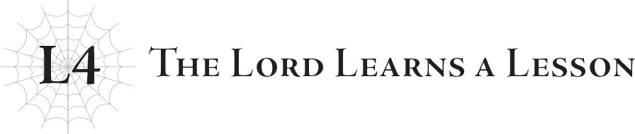
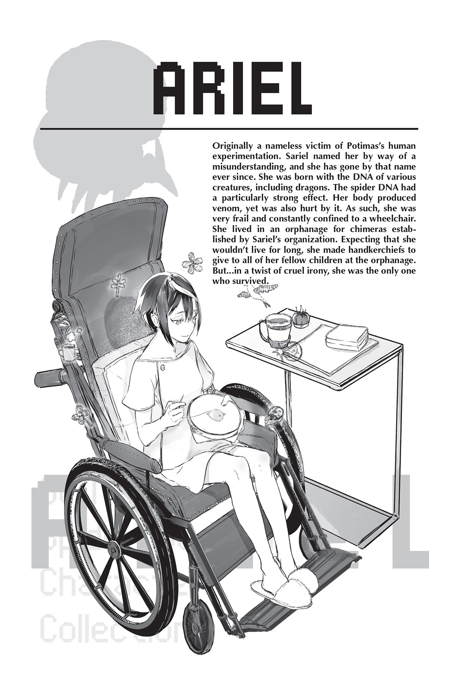

# Lãnh chúa rút ra bài học
*(The Lord Learns a Lesson)*

“Nghe đây hả lũ trẻ! Liệu mà ăn cho bằng sạch đấy!”

Giọng của viện trưởng vang vọng khắp nhà ăn cô nhi viện.

Giờ ăn thường khá ồn ào vì bọn trẻ lúc nào cũng nói cười tíu tít, nhưng tiếng hét của cô vẫn vang lên rõ mồn một.

“Gì đây? Vẫn còn thức ăn trên đĩa của em này!”

“Em đang giảm cân mà.”

Viện trưởng nhíu mày nhìn phần ăn của cô bé.

Vào thời điểm đó, hầu hết chúng tôi đều chuẩn bị bước vào tuổi thiếu niên và sắp sửa đến tuổi dậy thì.

“Đừng có vớ vẩn. Em trông gầy nhom như con gà con thế kia! Phải béo lên trước rồi mới tính chuyện giảm cân chứ!”

“Gì cơ ạ? Nhưng viện trưởng béo thế mà có thấy giảm cân đâu.”

“Tất nhiên là một đứa trẻ ranh như em làm sao hiểu được sức hấp dẫn của cơ thể đầy đặn quyến rũ này! Không ăn thì ngực không bao giờ lớn nổi đâu!”

Cô bé được nói đến nhìn xuống ngực mình, và tôi nhớ mình đã thấy cô bé miễn cưỡng ăn tiếp.

Tôi rất ghen tị với bữa ăn của cô bé.

Lúc đó, tôi vẫn chỉ có thể dùng chế độ ăn lỏng.

Cơ thể tôi đòi hỏi nhiều chất dinh dưỡng hơn người bình thường.

Đường truyền dịch liên tục cắm trên tay giúp bù đắp phần nào, nhưng như thế vẫn là chưa đủ; chỉ khi bổ sung thêm chế độ ăn lỏng dễ tiêu hóa và giàu dinh dưỡng thì tôi mới có thể miễn cưỡng duy trì sự sống.

Cơ thể tôi bị suy yếu do chất độc mà các cơ quan nội tạng không ngừng sản sinh ra, khiến tôi không thể tiêu hóa bất cứ thứ gì khác.

Vì vậy, tôi rất đố kỵ với những đứa trẻ khác, những đứa có thể ăn bất kỳ thức ăn đặc nào chúng muốn.

Nhưng tôi chưa bao giờ nói ra điều đó.

Mỗi người trong cô nhi viện đều có một khuyết tật nào đó.

Cô bé tự nhận mình đang giảm cân trông có vẻ giống một người bình thường, nhưng không nghi ngờ gì cô bé cũng là một chimera.

Cô bé rõ ràng đã được cấy DNA của nhiều loài động vật khác nhau, tất cả đều có những ảnh hưởng khác nhau lên cơ thể cô bé, dù mỗi ảnh hưởng riêng lẻ là rất nhỏ.

Tuy nhiên, ngay cả khi mỗi ảnh hưởng đều nhỏ, thì tác động tổng thể vẫn quá lớn để có thể phớt lờ.

Và không có cách nào để chữa trị dứt điểm tình trạng của chúng tôi, chỉ có thể điều trị triệu chứng.

Bởi vì chúng tôi sinh ra đã có những cơ thể như thế này rồi.

Cách duy nhất để thực sự chữa khỏi cho chúng tôi là phải tái tạo lại cơ thể theo đúng nghĩa đen.

Điều đó là bất khả thi với trình độ y học thời bấy giờ; tôi nghi ngờ ngay cả Potimas cũng không thể làm được.

Chúng tôi không có lựa chọn nào khác ngoài việc phải chung sống với cơ thể được ban tặng này cho đến khi chết.

Và chắc chắn rằng cái chết sẽ tìm đến chúng tôi sớm hơn so với một người bình thường.

Không một ai trong chúng tôi từng nghĩ rằng mình sẽ có tuổi thọ bằng một người bình thường.

Có lẽ đó là lý do vì sao mỗi người trong chúng tôi bắt đầu mơ hồ nghĩ về tương lai.

Khi bước vào tuổi dậy thì, chúng tôi tốt nghiệp khỏi thời thơ ấu ngây thơ và đặt những bước chân đầu tiên hướng tới tuổi trưởng thành.

Đó là lúc chúng tôi lần đầu tiên bắt đầu nghĩ về việc trở thành một người lớn sẽ có ý nghĩa như thế nào.

Và tự hỏi liệu chúng tôi có sống đủ lâu để điều đó xảy ra hay không…

Một ngày nọ, cô Sariel trở về, lôi theo hai đứa trẻ trông bầm dập phía sau.

*Lại nữa rồi,* tôi thầm nghĩ, ngán ngẩm.

Hai đứa trẻ được nói đến là những đứa nhanh chân gây sự nhất trong số tất cả bọn trẻ ở cô nhi viện.

Mỗi khi chúng bắt đầu đánh nhau bên ngoài cô nhi viện, cô Sariel luôn phạt chúng và dùng vũ lực đưa chúng trở lại đây.

Cô biết đây không phải là những cuộc xích mích bình thường giữa trẻ con.

Là các chimera, hai đứa họ mạnh hơn người bình thường. Nếu chúng đấm một đứa trẻ bình thường bằng tất cả sức mạnh của mình, chúng có thể gây thương tích nghiêm trọng hoặc thậm chí giết chết đứa trẻ đó.

Đó là lý do tại sao cô Sariel luôn chạy đi đón chúng ngay lập tức.

Hai đứa này không phải là những đứa duy nhất gây rắc rối.

Số ít những đứa trẻ có thể rời khỏi cô nhi viện luôn gây ra một số loại náo loạn, và cô Sariel lần nào cũng phải đi đón chúng về.

Chúng tôi không bị cấm rời khỏi cô nhi viện, nhưng chỉ có một vài đứa trẻ trong số chúng tôi thực sự có thể đi ra ngoài.

Trong trường hợp của tôi, đó là vì sức khỏe.

Đối với những đứa khác, đó là vì ngoại hình của chúng.

Cô nhi viện nằm ở một khu vực hẻo lánh, nhưng không phải hoàn toàn không có người ở.

Về mặt lý thuyết, những người sống gần đó đã được thông báo về bản chất đặc thù của cô nhi viện.

Nhưng điều đó không có nghĩa là họ sẽ chấp nhận vô điều kiện các chimera, những người có ngoại hình phân biệt họ với người bình thường ngay lập tức.

Trẻ con ở độ tuổi đó lại càng tàn nhẫn hơn.

Đây đều là những chuyện tôi nghe kể lại, vì bản thân tôi chưa bao giờ có thể rời khỏi cô nhi viện, nhưng tôi nghe nói có mấy đứa trẻ thực sự đã bị ném đá.

Tôi nhớ mình đã rất sốc khi thấy một cảnh tượng rập khuôn như vậy lại có thể thực sự xảy ra ngoài đời thực.

Nhưng ngay cả khi nghe như một câu chuyện cổ tích, thì đây vẫn là thực tế của chúng tôi.

Rõ ràng là những người khác sống gần cô nhi viện nghĩ gì về chúng tôi, ngay cả khi họ không ném đá như một số đứa trẻ đã làm.

Đối với họ, sự tồn tại của chúng tôi là một mối phiền toái.

Và khi họ đã xa lánh chúng tôi như thế, bất kỳ rắc rối nào chúng tôi gây ra sẽ chỉ khiến họ có ấn tượng xấu hơn về chúng tôi.

Đó là lý do tại sao cô Sariel luôn đi đón bọn trẻ trước khi điều đó xảy ra.

Nhưng rõ ràng, chúng tôi cũng chẳng vui vẻ gì khi bị ghét bỏ.

Hai đứa trẻ mà cô Sariel thường mang về rất nóng tính và nhanh chóng đánh nhau trên cơ sở “mắt đền mắt, răng đền răng!”

Vì những đứa trẻ hàng xóm gây sự với chúng, chúng liền trả đũa lại ngay.

Hai đứa đó là như thế.

May mắn thay, nhờ cô Sariel, hai đứa họ chưa bao giờ thực sự lôi được bọn trẻ hàng xóm vào một trận đánh nhau ra trò.

Nhưng điều đó không có nghĩa là chúng chưa từng cố gắng.

Sự thật là chúng đã giơ tay định đánh, nhưng đã bị cô Sariel ngăn lại trước khi kịp ra tay.

Nếu tay chúng thực sự chạm vào người họ, tôi nghi ngờ những đứa trẻ kia khó lòng mà lành lặn thoát thân.

Và khi đó sẽ không thể hàn gắn mối quan hệ giữa cô nhi viện và những người hàng xóm.

Ngay cả khi điều đó không xảy ra, việc chúng cố gắng khơi mào một trận chiến vẫn tồn tại, tạo ra một khoảng cách giữa chúng tôi.

Khoảng cách đó trở thành một sự ghê tởm thể hiện qua thái độ của người dân địa phương, và lũ trẻ cô nhi viện oán hận điều đó và gây ra nhiều vấn đề hơn.

Vòng xoáy luẩn quẩn này đã diễn ra từ trước khi những sự kiện này xảy ra.

Vì vậy, chúng tôi càng ngần ngại rời khỏi cô nhi viện hơn.

Nhưng vẫn có những đứa thuộc tuýp người năng nổ, từ chối bị giam cầm và tiếp tục đi ra ngoài, và những đứa trẻ rắc rối thản nhiên phớt lờ những mối lo ngại.

“Thả ra!”

Một trong những đứa trẻ rắc rối đó đang giãy giụa để thoát khỏi tay cô Sariel.

Sariel làm theo yêu cầu của cậu bé và thả cậu ra.

“Á?!”

Chuyện gì sẽ xảy ra khi cô thả tay ra trong khi đang giữ cậu bé lơ lửng trên không?

Rõ ràng là trọng lực đã khiến cậu ta rơi thẳng xuống sàn nhà.

Cậu bé tội nghiệp đập mặt xuống đất và cúi người xuống, ôm lấy mũi mình.

“Sao cô lại thả tay ra chứ?!”

“Đó là một lời khiếu nại hết sức phi lý.”

Cô Sariel lạnh lùng gạt đi câu trả lời của cậu bé.

Đối với một số người, đó có vẻ như một nỗ lực khiêu khích, nhưng chúng tôi đã biết cô Sariel đủ lâu để biết đây là chế độ mặc định của cô.

Cô ấy là một người rất kỳ quặc, nói một cách nhẹ nhàng nhất.

Biểu cảm của cô hiếm khi thay đổi.

Vì cô lúc nào trông cũng thờ ơ, nên rất dễ cho rằng cô ấy lạnh lùng và điềm tĩnh, nhưng không mất nhiều thời gian để nhận ra điều đó không phải vậy.

Tóm lại, cô Sariel là một người kỳ quặc.

Cô ấy hơi lệch chuẩn so với người bình thường theo nhiều cách khác nhau.

Đôi khi cô có vẻ có kiến thức sâu rộng mà không ai trong chúng tôi có, nhưng những lúc khác cô lại không hiểu những điều mà chúng tôi thậm chí không cần phải suy nghĩ.

Hành vi của cô rất bất thường.

Trường hợp này cũng không ngoại lệ: Cô thả ai đó ra khi được bảo “thả ra!”, rồi khi cậu bé đập mũi và hỏi “sao cô lại thả tay ra?!”, cô lại cho rằng cậu bé đang “phi lý.”

Tôi không nghĩ cô Sariel cố tình chế giễu cậu bé trong cuộc đối thoại đó.

Cô ấy cũng không hề tức giận; tôi nghĩ cô chỉ quan sát một cách khách quan rằng cậu bé đang tự mâu thuẫn với chính mình và quyết định thông báo cho cậu bé biết rằng điều đó là phi lý.

Tất nhiên, đây chỉ là suy đoán của riêng tôi. Đáng tiếc là không thể biết cô Sariel thực sự đang nghĩ gì.

Hành vi của cô nằm ngoài tầm hiểu biết thông thường của chúng tôi đến mức ngay cả chúng tôi cũng không thể hoàn toàn hiểu được cô.

Về mặt kiến thức, cô uyên bác và hiểu biết sâu rộng đến mức dường như không có gì là cô không biết; khi chúng tôi còn nhỏ và hỏi “tại sao?” về mọi thứ, cô trả lời từng câu hỏi mà không một chút do dự.

Nhưng khi liên quan đến cảm xúc hay cách suy nghĩ của con người, cô đột nhiên tỏ ra ngớ ngẩn.

Giống như cô hiểu phạm vi cảm xúc của con người về mặt lý thuyết, nhưng không thể áp dụng sự hiểu biết đó vào thực tế…

Thực tế, khi tôi biết cô ấy là một thiên thần chứ không phải con người, điều đó hoàn toàn hợp lý.

Lại càng hợp lý hơn khi Gülie kể cho tôi nghe về bản chất của các thiên thần sau này.

Con người và thiên thần dường như có quá trình tư duy khác nhau căn bản.

Từ những gì anh ấy kể, các thiên thần trung thành với nhiệm vụ được giao, và họ không bao giờ lãng phí thời gian nghĩ về bất cứ điều gì khác nhiều hơn mức cần thiết.

Tuy nhiên, cô Sariel không phải là một thiên thần bình thường, mà là một “thiên thần lạc lối” (lost angel), một vị trí bất thường có lẽ là lý do khiến cô trở nên gần gũi với con người như vậy.

“Khốn kiếp! Lần tới gặp mấy đứa đó, tớ sẽ đấm thẳng vào mặt tụi nó!”

“Bạo lực không phải là câu trả lời.”

Cậu bé đấm xuống sàn bằng bàn tay còn lại, tay kia vẫn ôm mũi.

“Bạo lực là phạm tội. Hành hung và cố ý gây thương tích.”

“Im đi! Hơn nữa, tụi nó mới là đứa khơi mào trước!”

“Dù vậy. Như thế là sai.”

Cô Sariel biết rõ mọi luật lệ của mọi quốc gia.

Vì tâm trí của một thiên thần hoạt động quá khác so với con người, tôi không biết cuối cùng cô đã thực sự hiểu chúng tôi đến mức nào.

Nhưng tôi nghĩ cô đã học được qua việc nghiên cứu luật pháp rằng con người ghét bạo lực.

“Lũ khốn đó…”

Cậu bé còn lại mà cô bắt được, người nãy giờ vẫn im lặng, cuối cùng cũng lên tiếng.

“Chúng chế giễu chúng ta. Chế giễu cô nhi viện, chế giễu cô Sariel…”

Cậu bé mím môi trong thất vọng.

Tôi hiểu cậu bé cảm thấy thế nào.

Chúng tôi là một gia đình, một gia đình không thể thay thế.

Làm sao ai có thể im lặng khi có kẻ nói xấu gia đình mình chứ?

“Ngay cả vậy, bạo lực không phải là câu trả lời.”

“Tại sao chứ?!”

“Bởi vì đó là những gì luật pháp đã quyết định.”

Câu trả lời của cô Sariel rất ngắn gọn.

Vì luật pháp nói cấm làm vậy, nên không được phép làm.

“Vậy cô nói luật pháp luôn luôn đúng sao?!”

“Không.”

Câu trả lời này dường như phủ nhận tuyên bố trước đó của cô.

Cô không bảo chúng tôi phải tuân theo luật pháp vì nó đúng đắn?

“Vậy thì tại sao chúng ta phải tuân theo nó chứ?!”

“Bởi vì nếu không làm vậy, em sẽ bị phán xét tương ứng.”

“Và đó là lý do đủ tốt để không phạm luật sao?!”

“Đúng vậy.”

Cô Sariel không nói về thiện hay ác.

Cô chỉ đơn giản dạy chúng tôi rằng nếu chúng tôi sử dụng bạo lực, chúng tôi sẽ bị bắt giữ, bất kể bạo lực đó có công bằng hay không.

“Nếu họ tấn công em bằng lời nói, em nên tranh luận bằng ngôn từ của chính mình, chứ không phải hành động.”

Điều đó đủ hợp lý.

Nhưng những đứa trẻ địa phương phân biệt đối xử với chúng tôi chỉ vì chúng tôi là chimera.

Chúng sử dụng hoàn cảnh ra đời của chúng tôi, thứ mà chúng tôi không thể nào thay đổi được, làm tài liệu để sỉ nhục chúng tôi.

Ngay cả khi chúng tôi muốn tranh luận với chúng, chúng đã tin chắc rằng chúng tôi là những kẻ thấp kém rồi.

Lý lẽ sẽ không hoạt động trên những loại người như vậy.

“Làm sao tụi em làm được điều đó đây…?”

Bọn con trai còn nhận thức rõ điều đó hơn tôi, vì bản thân tôi chưa bao giờ thực sự tiếp xúc với những đứa trẻ địa phương.

Chúng không chịu lắng nghe bất cứ điều gì chúng tôi nói.

Nhưng chúng tôi cũng không thể dùng bạo lực.

Không có lối thoát.

“Hãy suy nghĩ về điều đó.”

Đó là câu trả lời duy nhất của cô Sariel.

“Phương án tốt nhất là gì? Phương án tồi tệ nhất là gì? Các em nên luôn suy nghĩ về những điều này. Đó là cách con người trưởng thành.”

…Tôi không biết liệu chỉ nghĩ về nó có thể giải quyết được vấn đề này hay không.

Lời nói của cô Sariel rất tốt, nhưng tôi không chắc chúng có hoàn toàn phù hợp với hoàn cảnh lúc đó hay không.

Thực sự có điều gì đó kỳ lạ ở cô Sariel.

Nhưng tất cả chúng tôi đều có thể nhận ra cô đang cố gắng đưa ra lời khuyên cho chúng tôi vì cô quan tâm đến chúng tôi.

Chỉ riêng tấm lòng đó thôi cũng đã là thứ cứu rỗi chúng tôi rồi.

---

[◀ Chương trước: Chương 4: Quyết chiến: Nhện đấu Robot](13_ch4_showdown_spider_vs_robot.md) | [Chương tiếp theo: Trầm tư: Ma cà rồng ▶](15_b4_ruminate_vampires.md)
