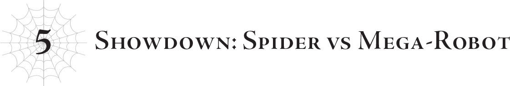
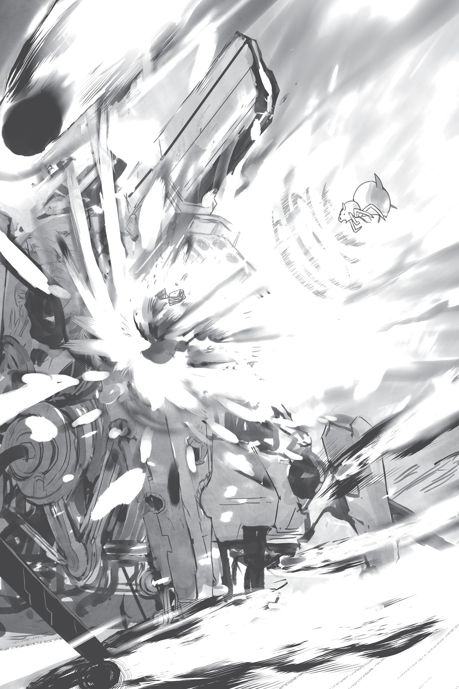

# Chương 5: Quyết chiến: Nhện đấu Mega-Robot
*(Chapter 5: Showdown: Spider vs. Mega-Robot)*

Được rồi, cái quái gì thế này?!

Mới nãy tôi còn đang đập lũ robot tơi bời hoa lá, cứ tưởng trận này dễ xơi như ăn kẹo chứ.

Hóa ra lũ robot mà tôi vừa bốc đầu hồi nãy chỉ là hạng rác rưởi sản xuất hàng loạt, còn bây giờ tôi lại phải đối phó với mấy thứ siêu robot khổng lồ tên là "Gloria".

Đã vậy, đến cả cái lũ siêu robot này cũng là hàng sản xuất hàng loạt nữa mới điên chứ...

Với lại chúng tôi vẫn chưa biết lũ siêu robot này mạnh tới cỡ nào.

Nếu những gì lão Potimas từng bốc phét hồi đó là thật, thì chúng còn mạnh hơn cả rồng cấp cao.

Mà số lượng của chúng lại còn nhiều như quân Nguyên...

Ừm, tình hình có vẻ không ổn chút nào rồi nhỉ...?

Tôi không nghĩ mình còn có thể nhởn nhơ kiểu "tiết kiệm sức lực" được nữa rồi.

Ban đầu, tôi đã hy vọng tránh làm hao hụt quá nhiều phân thân trong trận chiến này để dành dụm chúng cho giai đoạn sau của cuộc chiến, nhưng xem ra lúc này không phải là lúc lo nghĩ chuyện đó nữa.

Tôi sử dụng [Vạn Lý Nhãn] để nhẩm tính nhanh số lượng của lũ siêu robot.

Ôi mẹ ơi, có tới gần một ngàn con!

Ít nhất thì con số đó vẫn ít hơn lũ robot thông thường.

Nhưng chỉ cần nghĩ đến việc có ngần ấy con robot mạnh hơn rồng tụ tập lại là đủ thấy rùng mình rồi.

Điều này cũng áp dụng cho lũ nhện rối, nếu một nhóm sở hữu chỉ số trung bình trên mười ngàn thực sự muốn ra tay, họ dư sức thổi bay cả một quốc gia dễ như bỡn.

Cái lũ con người và ma tộc có chỉ số thường dưới một ngàn kia thì làm sao mà chống cự nổi.

Họa may có vài cá thể hiếm hoi có chỉ số trên một ngàn hợp lực với nhau thì mới có cơ may ngăn chặn được một con quái vật như vậy, và khả năng cao là họ cũng phải trả giá bằng cả mạng sống.

Trừ phi là trường hợp đặc biệt như Anh hùng, còn không thì việc cố gắng chiến đấu với chúng chỉ là một sai lầm ngu ngốc.

Mối đe dọa mà chúng ta đang nói đến ở đây là ở đẳng cấp đó đấy.

Và ngay cả trong cấp độ quái vật đó, các loài chân long vẫn là những thực thể cực kỳ mạnh mẽ.

Vậy mà nghe nói, mấy cỗ máy siêu robot này còn có thể đánh bại cả chân long.

Thế mà lại có tới hơn một ngàn con như thế á?!

Nghiêm túc luôn, một lực lượng thế này dư sức cân cả thế giới và giành chiến thắng...

Những kẻ duy nhất có thể ngăn chặn thứ như thế chắc chỉ có Ma Vương và Güli-güli mà thôi...

Ơ này, lão Poty kia? Lão đang định hủy diệt thế giới hay sao thế?

...Mà thật ra, ngay từ đầu việc thế giới này suýt bị xóa sổ cũng là do lỗi của lão Potimas mà ra.

Lão ta là thần hủy diệt hay sao vậy chứ?

...Tôi bắt đầu cảm thấy cách so sánh này có vẻ chuẩn xác đấy chứ.

Thôi được rồi, bớt nghĩ vớ vẩn lại nào. Tôi cần phải làm gì đó với đội tiên phong siêu robot của "vị thần hủy diệt" kia ngay lập tức.

Ý tôi là, ổn thôi, cứ bình tĩnh nào.

Potimas mới là kẻ rêu rao rằng chúng mạnh hơn chân long, đúng chứ?

Vậy nên hoàn toàn có khả năng là lão chỉ đang nói quá lên, chứ thực tế chúng không đến mức đáng sợ như vậy đâu, phải không nàooo?

Cỗ máy siêu robot trước mặt tôi cử động.

Bất chấp kích thước khổng lồ của mình, chỉ trong một chớp mắt, nó đã áp sát một trong những nhện rối—Riel—và vung kiếm chém tới tấp.

Riel suýt soát né được, cô bé ngửa người ra sau như đang làm tư thế uốn dẻo cây cầu để né tránh lưỡi kiếm trong gang tấc.

...Nhưng mà, tại sao con bé lại né kiểu đó làm gì chứ?

Ngay sau đó, ba cô chị em còn lại đồng loạt lao vào cỗ máy siêu robot đã tấn công Riel.

Lũ nhện rối đã rút ra sáu cánh tay ẩn của mình, mỗi tay trang bị đầy đủ vũ khí, chém xối xả vào cỗ máy!

Tiếng kim loại va chạm chan chát chói tai vang lên.

Riel cùng ba đứa còn lại đều nhảy lùi về phía sau như thể bị bật ra.

...Không hiểu sao Riel vẫn đang bò ngửa bằng lưng, tháo chạy theo kiểu cua bò, thôi thì cứ lờ đi vậy.

Còn cỗ máy siêu robot thì sao? Không một vết trầy xước!

Thế là lũ nhện rối chuyển sang bắn ma pháp.

Đó chính là phép Hắc Thương mà tôi vẫn hay xài hồi trước!

Những ngọn thương đen tuyền xuất hiện giữa không trung, lao vào cỗ máy siêu robot từ mọi hướng!

Thế nhưng, chúng biến mất ngay trước khi kịp chạm vào lớp giáp.

Đó chắc chắn là [Kết giới Phản Kỹ thuật] mà Potimas luôn sử dụng, thứ có khả năng triệt tiêu toàn bộ thuật thức.

Xem ra lũ siêu robot này không thể tạo ra kết giới trên diện rộng như Potimas, mà thay vào đó là bọc một lớp kết giới mỏng trực tiếp lên giáp của chúng.

Nói cách khác, cách duy nhất để đánh bại mấy thứ này là nghiền nát chúng bằng đòn tấn công vật lý thuần túy không liên quan đến thuật thức, hoặc nã một thứ gì đó khổng lồ đến mức phá vỡ luôn cả kết giới...

Thế nhưng đòn chém từ lũ nhện rối có chỉ số ở mức hàng vạn còn chẳng để lại nổi một vết xước, ma pháp của chúng lại vô dụng, nên cả tấn công vật lý lẫn ma pháp đều sẽ cực kỳ nan giải đây...

Tóm lại là sức phòng ngự của chúng rất đáng báo động.

Vậy còn sức tấn công thì sao...?

Cỗ máy siêu robot chĩa một hệ thống súng bắn nào đó về phía lũ nhện rối như thể để trả đũa.

Những chùm tia laser bắn ra dễ dàng xuyên qua các thân cây và găm thẳng xuống nền đất.

Tất nhiên, lũ nhện rối đã nhanh chân biến mất trước khi các tia sáng đó kịp chạm tới.

Nhưng nhìn vào độ sâu của những cái hố để lại trên mặt đất, một phát bắn trúng đích chắc chắn sẽ gây ra sát thương nghiêm trọng cho ngay cả lũ nhện rối.

Ngay khi Fiel vừa né được tia laser, một lưỡi kiếm lập tức quét xuống hướng về phía con bé.

Lũ siêu robot này có thể chuyển tiếp từ đòn tấn công này sang đòn tiếp theo quá nhanh.

Đối với một lũ robot khổng lồ, chúng quá nhanh và quá nhạy bén trong việc đánh giá tình hình.

À mà khoan, chắc vì chúng là robot nên mới giỏi khoản đó nhỉ?

Vấn đề là cơ thể cơ giới của chúng bằng cách nào đó lại có thể bắt kịp tốc độ tính toán tư duy nhanh nhạy đó.

Nếu quy đổi tốc độ đó thành chỉ số hệ thống, nó dư sức vượt qua mức mười ngàn.

Tôi có thể khẳng định điều đó vì ngay cả Fiel cũng không theo kịp.

Xét về mặt thời gian, Fiel sẽ không thể nào tự mình né được cú chém đó...

Lưỡi kiếm chém ngang qua vị trí Fiel vừa đứng ngay đúng lúc tôi dịch chuyển con bé về bên cạnh mình.

Lưỡi kiếm cắm xuống mặt đất, nhưng thay vì bị gãy, nó thực sự chém đứt mặt đất mà không hề giảm tốc độ.

Được rồi, hiểu rồi. Sức tấn công của chúng cũng thuộc dạng siêu khủng.

Quên mấy thứ rau củ cứng ngắc hay thịt dai nhách đi—thưa quý vị, lưỡi kiếm này có thể chém bay luôn cả cái thớt đấy!

...Vậy ra mấy thứ này thực sự đủ mạnh để hạ gục chân long sao.

Và thực sự có hơn một ngàn con như thế à...?

Tôi đã rất cẩn thận để không khinh thường Potimas rồi, nhưng chuyện này vẫn vượt ngoài dự liệu của tôi một chút đấy nhé?

...Được rồi, xin lỗi, tôi nói dối đấy.

Tôi quả thực có coi thường lão ta một tẹo. Tôi thừa nhận...

Nhưng ý tôi là, thôi nào!

Dạo gần đây chúng tôi toàn đập Potimas ra bã mà lị!

Giống như lần cựu Quân đoàn 7 của ma tộc nổi loạn ấy.

Tuy bên tôi cũng chẳng mấy êm đẹp, nhưng tôi đã đấm thẳng vào mặt lão, nhớ không?

Rồi khi lão lén lút hành động sau lưng trong trận đại chiến vừa qua, chúng tôi đã đi trước một bước và đập tan kế hoạch của lão, đúng chứ?

Thấy chưa? Dạo này Potimas có thắng nổi trận nào đâu!

Thế thì làm sao tôi không coi thường lão một chút cho được?

Sau ngần ấy chuyện, việc tính toán sai lệch một chút thế này thực tế là không thể tránh khỏi.

Nói cách khác, đây không phải lỗi của tôi.

Có chăng, chuyện này chỉ chứng minh rằng những lời khoác lác mà Potimas luôn huênh hoang không phải chỉ để cho oai.

Lý do dạo này lão trông có vẻ thảm hại có lẽ là vì lão không thể sử dụng toàn bộ thực lực của mình trong các cuộc đụng độ đó.

Chỉ cần lão thả rông dù chỉ một con siêu robot này ra ngoài, Güli-güli chắc chắn sẽ phát hiện và can thiệp ngay.

Tôi đoán Potimas rất sợ Güli-güli nên muốn tránh điều đó bằng mọi giá.

Điều này đồng nghĩa với việc lão không hề sợ bất kỳ ai khác.

Lần này lão thực sự có ý định nghiền nát chúng tôi.

Tôi chắc chắn lão ta bước vào trận này với sự tự tin tuyệt đối rằng mình đủ mạnh để chiến thắng.

Nghĩ rằng mình không thể nào thua được, y hệt như những gì tôi vẫn hay nói.

Tôi có thể hiểu tại sao lão lại nghĩ như vậy khi sở hữu một lượng hỏa lực khổng lồ được cất giấu thế này.

Nhưng điều đó không có nghĩa là lão có thể đánh bại tôi.

Tôi thừa nhận: Lực lượng của Potimas mạnh hơn tôi tưởng.

Nhưng chúng vẫn nằm trong tầm kiểm soát của tôi.

Có thể Potimas có sự tự tin tuyệt đối, nhưng tôi cũng vậy.

Đúng là lực lượng của lão vượt quá dự tính của tôi một chút, nhưng đó là do ước tính ban đầu của tôi chỉ kiểu "không biết nữa, chắc tầm này chăng?", và giờ nó cao hơn vạch đó một tí mà thôi.

Cái vạch mà tôi nói đến chính là điểm trung gian giữa kịch bản tốt nhất và tồi tệ nhất mà tôi có thể tưởng tượng ra.

Potimas đã vượt qua vạch đó, nhưng lão vẫn chưa chạm tới kịch bản tồi tệ nhất.

Ý tôi là, điều tồi tệ nhất tôi có thể nghĩ ra là lão có đủ sức mạnh để đối đầu trực diện một chín một mười với Güli-güli.

Tôi thực sự nghi ngờ việc Potimas có thể vượt qua mức đó.

Thừa biết tính lão, nếu lão có thể làm được điều như vậy thì lão đã ra tay từ lâu rồi.

Suốt thời gian qua lão tỏ ra tương đối ngoan ngoãn chẳng qua là vì e dè Güli-güli mà thôi.

Nếu có cách nào nhổ bỏ cái gai trong mắt đó, không đời nào lão lại bỏ qua cơ hội.

Vì lão vẫn chưa hạ gục được Güli-güli, điều đó có nghĩa là thực lực của Potimas vẫn yếu hơn hoặc cùng lắm là bằng với Güli-güli.

Tôi nói "có khả năng bằng" là vì tính cách quá đỗi thận trọng của Potimas; tôi cá là nếu tỷ lệ thắng chỉ ở mức năm mươi - năm mươi, lão sẽ không đời nào dám mạo hiểm thử nghiệm.

Güli-güli chắc chắn là một cái gai trong mắt Potimas, nhưng lão vẫn không phải loại người dám mạo hiểm đẩy bản thân vào nguy hiểm để khiêu chiến cái gai đó.

Dù sao thì, đánh bại Güli-güli cũng không phải là mục tiêu tối thượng của Potimas...

Lão tích lũy ngần ấy sức mạnh chẳng qua là để tự vệ phòng hờ mà thôi—đó không phải là mục tiêu chính của lão.

Đó là lý do tại sao tôi cho rằng sức mạnh của lão chỉ ở mức thấp, nhưng xem ra lão còn nhát gan hơn tôi nghĩ nhiều.

Lão chắc chắn phải cực kỳ khiếp sợ Güli-güli.

Nhưng nếu xét cho cùng, đó chính là lý do tôi tự tin mình có thể đánh bại Potimas.

Bởi vì tôi đã chuẩn bị tinh thần để chiến đấu với bất kỳ ai, thậm chí là có khả năng phải đối đầu với chính Güli-güli.

Kế hoạch lớn của chúng tôi là phá hủy hệ thống.

Khi Güli-güli phát hiện ra điều đó, không có gì đảm bảo anh ta sẽ không đích thân đứng ra ngăn cản chúng tôi.

Trái lại, tôi nghĩ khả năng cao là anh ta sẽ làm vậy.

Thế nên tôi đã chăm chỉ nghiên cứu học hỏi để ngay cả khi phải đối đầu với Güli-güli thì tôi vẫn có thể thắng!

Không đời nào tôi lại thua một gã nhút nhát suốt ngày trốn chui trốn lủi khỏi Güli-güli trong cái làng Elf này được!

Nghe rõ đây, hỡi toàn bộ các phân thân chiến đấu!

Kệ xác lũ robot thông thường đi!

Hãy tập trung toàn lực tiêu diệt lũ siêu robot kia!

Có khoảng một ngàn cỗ máy siêu robot.

Đối chọi với mười ngàn phân thân chiến đấu.

Phe ta có quân số gấp mười lần chúng.

Thế nhưng nếu quy đổi ra chỉ số tương đương, các phân thân chiến đấu trung bình cũng chỉ nhỉnh hơn mười ngàn một chút, không khác biệt mấy so với lũ nhện rối.

Xét đến việc cả bốn nhện rối hợp lực mà còn chẳng chạm nổi vào một sợi lông chân của một cỗ siêu robot, có vẻ như chỉ dùng số lượng thôi là chưa đủ để bù đắp sự chênh lệch về sức mạnh.

Đáng tiếc thay, sức mạnh chiến đấu không hoạt động theo phép toán cộng.

Sở hữu mười chiến binh có chỉ số tương đương mười ngàn không có nghĩa là cộng lại sẽ thắng được một đối thủ có chỉ số khoảng một trăm ngàn.

Bây giờ, tôi đoán sức mạnh của lũ siêu robot này nếu quy ra chỉ số sẽ rơi vào khoảng hai mươi ngàn.

Tầm tương đương với một Taratect Nữ Vương, hoặc có lẽ yếu hơn một chút.

Nếu lũ nhện rối chiến đấu với quyết tâm liều mạng, chúng có thể kéo theo một cỗ siêu robot xuống mồ cùng mình.

Nghĩa là, vì các phân thân chiến đấu có sức mạnh tương đương với lũ nhện rối, phe ta có thể thắng nếu tôi sẵn lòng hy sinh ít nhất bốn phân thân cho mỗi cỗ siêu robot.

Tất nhiên là tôi không hề có ý định chịu tổn thất lớn như vậy rồi.

Đúng là năng lực thể chất của phân thân chiến đấu nếu quy ra chỉ số sẽ ở mức mười ngàn.

Nhưng đó mới chỉ là đang nói về thể chất vật lý của chúng mà thôi.

Kết quả của các trận chiến trong thế giới này đâu phải chỉ do chỉ số quyết định.

Hồi xưa, tôi toàn giật lấy chiến thắng từ tay những đối thủ có chỉ số trung bình vượt trội hơn mình nhờ vào sức mạnh của các kỹ năng đấy thôi.

Giờ đây tuy đã nằm ngoài hệ thống và không dùng được kỹ năng nữa, nhưng tôi có thuật thức mà mình đã dày công luyện tập và hoàn thiện để tái hiện lại các kỹ năng đó.

Và điều đó cũng áp dụng cho các phân thân chiến đấu luôn.

Thật lòng mà nói, chỉ số thể chất mười ngàn của chúng chỉ là phần bổ trợ thêm thôi!

Dù sao thì, tôi chưa bao giờ là một tín đồ của cận chiến cả.

Thế mạnh của tôi, cũng như của các phân thân chiến đấu, là sử dụng tơ và độc từ khoảng cách vừa phải để làm suy yếu kẻ thù, hoặc tấn công bằng ma pháp từ khoảng cách xa.

Năng lực thể chất của chúng chỉ là để hỗ trợ cho việc đó mà thôi!

Bây giờ, để tôi biểu diễn cho mà xem nhé!

Các phân thân chiến đấu! Hãy dùng [Không Gian Trảm] lên lũ siêu robot!

Cho tôi giải thích một chút!

[Không Gian Trảm] là một chiêu thức kết liễu đặc biệt sử dụng thuật thức không gian để phân cắt khoảng không gian mà kẻ địch đang chiếm giữ, tạo ra một đòn chém không thể ngăn chặn!

Vì nó chia cắt chính bản thân không gian, nên không có cách nào dùng sức mạnh vật lý để phòng thủ cả!

Trừ phi đối phương có biện pháp đối phó nghiêm túc, còn không thuật thức không gian có thể trở thành một chiêu sát thủ không thể cản phá, y hệt như lần tôi dịch chuyển anh Quỷ lên tít trời cao rồi thả rơi tự do xuống đất hồi trước vậy.

Do sức mạnh quá đỗi gian lận này, kỹ năng [Ma pháp Không gian] từng có những giới hạn đối với loại chiến thuật sát thương tức thì đó, nhưng giờ đây tôi đâu còn bị ràng buộc bởi các quy tắc đó nữa!

Nói cách khác, tôi có thể thoải mái xài bao nhiêu chiêu ăn gian hạ gục nhanh tùy thích!

Ngay cả lũ siêu robot cũng không thể lành lặn trước một chiêu như th...

...ơ kìa.

Các phân thân chiến đấu đồng loạt sử dụng [Không Gian Trảm].

Thế nhưng tất cả đều thất bại thảm hại do lớp kết giới phản thuật thức phủ trên giáp của lũ siêu robot.

...Đ-được rồi, chưa việc gì phải hoảng loạn cả!

Phải tỏ ra thật ngầu... Thật bình tĩnh...

Phảiii rồi.

Tôi hơi vội vàng nã một loạt [Không Gian Trảm], nhưng nghĩ kỹ lại thì, hiển nhiên là chiêu đó không có tác dụng với lũ siêu robot rồi.

[Không Gian Trảm] là một thuật thức tác động lên chính không gian.

Còn lớp kết giới xung quanh giáp của lũ siêu robot lại ngăn chặn thuật thức kích hoạt trong một phạm vi nhất định.

Phải, nó có phạm vi hoạt động!

Nói cách khác, là trong một khoảng không gian nhất định!

Thế là tôi đã sử dụng thuật thức lên một khoảng không gian chứa kết giới chặn mọi thuật thức kích hoạt trong chính khoảng không gian đó.

Vâng! Và nhìn xem kết quả thế nào kìa!

Chẳng có tác dụng gì sất!

Chà! Đúng là một sự kết hợp tệ hại!

Hừm.

Điều đó có nghĩa là hầu như không có thuật thức không gian dạng tấn công nào khác của tôi có thể hoạt động.

Nếu không có biện pháp đối phó, thuật thức không gian quả thực là một đòn tấn công ăn gian không thể cản phá.

Khốn nỗi là nếu đối phương có cách khắc chế, thì chúng sẽ hoàn toàn vô dụng.

Chia cắt không gian như [Không Gian Trảm], bóp nát toàn bộ không gian, hay dịch chuyển chúng đến nơi hiểm trở như tôi từng làm với anh Quỷ... Không có một trò nào có thể áp dụng được với lũ này cả.

Vì thuật thức không gian hoạt động dựa trên không gian, nên tất cả những gì bạn cần làm là khiến cho thuật thức không thể sử dụng trên khoảng không gian đó, thế là chặn đứng được tất cả...

Tôi nghi ngờ việc kết giới của lũ siêu robot được tạo ra chỉ để nhắm vào thuật thức không gian, nhưng phải thừa nhận là chúng đã tạo nên một bức tường phòng ngự hoàn hảo chống lại nó.

Giờ tôi phải làm gì đây ta...?

Nếu không thể sử dụng thuật thức không gian, quân bài tẩy mạnh nhất và ăn gian nhất của tôi, thì các lựa chọn của tôi sẽ bị hạn chế nghiêm trọng...

Cách đơn giản nhất để phớt lờ kết giới phản thuật thức là tấn công vật lý, nhưng như tôi đã nói đi nói lại, năng lực thể chất của các phân thân chiến đấu cũng chỉ ở mức chỉ số mười ngàn mà thôi.

Nếu lũ nhện rối với chỉ số tương tự còn không để lại nổi một vết trầy trên bộ giáp đó, tôi thực sự nghi ngờ việc các phân thân chiến đấu có thể gây ra sát thương đáng kể chỉ bằng cách lao vào húc đầu.

Thực ra, đòn tấn công hủy diệt có lẽ sẽ hiệu quả nếu tôi sẵn lòng chấp nhận một loạt cái chết oanh liệt của các phân thân, nhưng...

Đòn tấn công hủy diệt chính là phiên bản tương đương với đòn mang thuộc tính Hủ thực của tôi.

Hồi tôi còn sở hữu kỹ năng, đó là một phương thức tấn công tự hại điên cuồng gây ra lượng sát thương khổng lồ để đổi lấy phản phệ cực nặng.

Mỗi khi tôi dùng đòn Hủ thực, các bộ phận trên cơ thể tôi sẽ lần lượt biến mất.

Nhưng hóa ra, ngay cả sự phản phệ kinh khủng từ kỹ năng đó vẫn còn là nhẹ chán.

Nếu một phân thân chiến đấu của tôi sử dụng đòn tấn công hủy diệt, toàn bộ phân thân đó sẽ tan biến thành cát bụi.

Về cơ bản, đó là một đòn tự sát hoàn toàn.

Đổi lại, uy lực của nó vô cùng khủng khiếp, nhưng việc kích hoạt nó đòi hỏi phải hy sinh một phân thân.

Nghĩa là nếu muốn tiêu diệt toàn bộ khoảng một ngàn cỗ siêu robot kia, tôi sẽ phải tổn hao một lượng phân thân tương ứng.

Nghe chừng không được kinh tế cho lắm nhỉ?

Ngoại lệ duy nhất là món vũ khí đặc trưng của tôi, chiếc lưỡi hái khổng lồ, có thể thi triển đòn tấn công hủy diệt mà không phải chịu sát thương phản phệ. Tuy nhiên, nếu một mình tôi tự đi loanh quanh tiêu diệt từng con siêu robot một thì chắc đến Tết Congo mới xong mất.

Tôi đoán việc để các phân thân sử dụng đòn tấn công hủy diệt sẽ phải là phương án cuối cùng nếu không còn cách nào khác.

Hiện tại, tôi sẽ bác bỏ chiến thuật phân thân cảm tử này.

Vậy là, về mặt thuật thức, chúng ta vừa loại trừ loại tốt nhất của tôi rồi.

Thế còn sở trường thứ hai của tôi, thuật thức hắc ám thì sao?

Tôi chỉ định đại một phân thân nhắm vào một cỗ siêu robot và cho nó sử dụng thuật thức dạng Hắc Thương.

Ngọn thương găm trúng giáp của cỗ siêu robot.

Phản ứng nào đó giữa kết giới phản thuật thức và năng lượng của hắc thương khiến cỗ siêu robot loạng choạng lùi lại vài bước.

Tương tự như kỹ năng [Long Mạc], kết giới phản thuật thức hạn chế việc sử dụng thuật thức, nhưng nó vẫn có giới hạn. Nếu bạn áp đảo kết giới bằng một sức mạnh vượt quá khả năng chịu đựng của nó, bạn vẫn có thể gây ra sát thương tương ứng, ít nhất là trên lý thuyết...

Nhưng cỗ siêu robot dính trọn phát Hắc Thương đó chỉ bị móp nhẹ một góc giáp.

...Ừm, thế này thì chịu rồi.

Đòn tấn công đó đáng lẽ phải gây ra nhiều sát thương hơn thế nhiều chứ...

Ý tôi là, ít ra nó cũng có chút tác dụng, nhưng phải bắn bao nhiêu ngọn thương thì mới thực sự hạ gục được nó đây?

Chắc đến lúc bắn xong thì mặt trời lặn mất rồi.

Không, trước đó nữa là tôi đã mất quá nhiều phân thân chiến đấu rồi ấy chứ.

Lúc đó trận chiến sẽ biến thành một cuộc đấu hao tổn vô nghĩa mất.

Hừm. Xem ra nã thuật thức vào chúng cũng không mấy hiệu quả rồi...

Vậy chỉ còn lại tơ và độc thôi sao?

Độc... độc tố tác dụng lên máy móc...

Ừ, tôi không nghĩ trò đó sẽ hiệu quả đâu.

Còn tơ vốn dĩ đâu phải là phương thức tấn công chủ đạo...

Nó giống như một loại bẫy dùng để kiềm chế cử động của kẻ địch hơn, một chiến thuật chỉ thực sự phát huy tác dụng khi bạn sở hữu các đòn tấn công khác đi kèm.

Mà ngặt nỗi là mấy đòn tấn công kia có cái nào dùng được ở đây đâu...

Khoan, cái gì cơ?

Tôi tiêu đời rồi sao?

...Không, không, không!

Vẫn chưa đâu!

Tôi vẫn chưa bỏ cuộc đâu nhé!

Được rồi, đùa chút thôi chứ tôi thực sự vẫn còn một cách để đánh bại lũ siêu robot này.

Và tôi có thể đảm bảo rằng cách này chắc chắn sẽ thành công.

Nếu không thì tôi đã chẳng đi huênh hoang khắp nơi với nụ cười tự mãn rằng mình "không bao giờ thua Potimas" rồi.

Có điều, nếu được thì tôi vẫn muốn dành dụm phương pháp đó cho sau này hơn.

Tôi chưa muốn phơi bày nó ra lúc này đâu.

Vậy làm thế nào để tiêu diệt lũ siêu robot mà không cần dùng đến chiêu đó đây...?

Hừm. Cảm giác hơi lãng phí một chút, nhưng tôi đoán đây là lựa chọn tốt nhất lúc này: những viên đạn đặc biệt mà tôi đã chuẩn bị để đối phó với Potimas.

Hãy dùng chúng vậy.

Tôi đã biết trước Potimas sẽ lại sử dụng kết giới phản thuật thức này, nên hiển nhiên là tôi cũng có sẵn vài chiêu đối phó lận lưng rồi.

Ban đầu tôi muốn để dành chiêu này để dùng lên chính bản thể Potimas cơ, nhưng giờ không quan trọng nữa rồi.

Nếu tôi không nhanh chóng hạ gục lũ siêu robot này, Vampy và những người khác có thể sẽ gặp nguy hiểm.

Nên giờ không ra tay thì còn đợi đến bao giờ nữa, đúng chứ?

Vậy nên không dài dòng nữa: KẾT NỐI!

Tôi mở ra một đường truyền kết nối bản thân với các phân thân chuyên trách không gian.

Đúng như tên gọi, các phân thân này được thiết kế chuyên biệt cho việc thi triển thuật thức không gian.

Thường thì tôi cất giữ chúng trong các chiều không gian riêng biệt do mình tạo ra.

Và lúc này, tôi có việc cần dùng đến một trong những chiều không gian riêng biệt đó, cái do các phân thân chuyên trách không gian kiến tạo và quản lý.

Tôi dùng bản thể chính để lấy một thứ bên trong ra ngoài.

Tôi phải ngắm nghía thật cẩn thận để không bị bắn trượt.

Dù sao thì mấy viên đạn này cũng quý giá lắm đấy!

Công đoạn chế tạo ra chúng phiền phức đến mức tôi gần như thấu hiểu được tại sao Potimas lại tiếc rẻ không muốn lãng phí đạn của lão đến thế, khỉ thật!

Dù mấy viên đạn này không giống loại Potimas xài, nên tôi cũng không chắc bên nào có giá trị cao hơn nữa.

Dù sao thì, hãy dùng thử một viên đạn đặc biệt này để tiêu diệt một cỗ siêu robot xem sao.

Chuẩn bị, ngắắắm...... bắn!

Viên đạn của tôi găm trúng cỗ siêu robot phía trước và xuyên thủng qua bộ giáp—thực tế là đập tan nát nó luôn.

Không chỉ dừng lại ở đó, viên đạn xuyên qua cỗ siêu robot rồi găm thẳng vào lũ robot yếu hơn đang hành quân ngay phía sau nó, con này nối tiếp con khác.

Nó thậm chí còn bay tiếp và găm trúng cỗ siêu robot thứ hai mà tôi còn chẳng buồn nhắm bắn, nghiền nát luôn cỗ máy đó, rồi cuối cùng bay mất hút về phía chân trời xa xăm.

...Ủa, kinh vậy?!

Tôi phải cực kỳ cẩn thận về hướng ngắm bắn của mấy thứ này mới được!

Nếu lỡ có đồng minh nào chắn đường, họ chắc chắn sẽ bị thương nặng cho mà xem!

Ý tôi là, tôi biết thừa mấy thứ này rất mạnh, nhưng thế này thì chẳng phải là thừa thãi hỏa lực quá mức rồi sao?

Thật lòng mà nói, đòn này đúng nghĩa là overkill luôn rồi...

Thấy chưa, sự thật là những viên đạn mạnh mẽ quá mức này chính là thứ mà bạn có thể gọi là thiên thạch đấy.

Phải. Thiên thạch.

Những khối đá khổng lồ mà tôi đã thả rơi xuống bề mặt hành tinh này từ ngoài vũ trụ bao la.

Về mặt lý thuyết, tôi đã chế tạo chúng từ xác của những con quái vật cấp huyền thoại.

Bạn biết đấy, chính là lũ quái vật mà tôi đã bắt nhóm Vampy và anh Quỷ đi săn để thu hồi năng lượng và thăng cấp cho họ ấy.

Tôi đã chọn ra vài cái xác trông có vẻ đặc biệt bền bỉ để chế tác thành đạn.

Thật ra tôi chẳng thèm bận tâm đến ngoại hình của chúng làm gì, vì đằng nào cũng có quan trọng đâu. Miễn là chúng đủ cứng cáp thì sao cũng được.

Tuy nhiên, chúng cũng phải có khả năng chống chịu nhiệt độ cực cao sinh ra khi đi vào bầu khí quyển. Yêu cầu đó đã loại bỏ khiếm khuyết này ở một số ứng cử viên tiềm năng.

Thế nên, tôi lấy những viên đạn đáp ứng đủ điều kiện, dịch chuyển chúng ra ngoài vũ trụ, rồi để chúng tự do rơi xuống hành tinh.

Chỉ cần chúng không ở quá xa đến mức bị kẹt vào quỹ đạo, chúng sẽ tự động rơi xuống nhờ trọng lực ngay khi được dịch chuyển.

Vấn đề nằm ở chỗ làm thế nào để hứng lấy những viên đạn đó sau khi chúng rơi xuống.

Nếu không làm vậy, chúng sẽ đâm sầm xuống mặt đất và gây tai họa mất.

Vậy chính xác thì tôi hứng chúng bằng cách nào? À thì, tôi di chuyển đến điểm rơi trước khi chúng kịp chạm đất, rồi ném chúng vào một chiều không gian riêng biệt ngay trước khi chúng va chạm.

Cụ thể là một chiều không gian chân không trống rỗng chạy theo đường thẳng và tự động lặp lại theo một vòng tròn khép kín.

Khi tôi ném viên đạn thiên thạch vào chiều không gian tuần hoàn đó, nó vẫn giữ nguyên vận tốc lúc đi vào, và cứ thế bay vòng quanh vô tận vì trong môi trường chân không làm gì có lực cản không khí.

Và vì nó duy trì được vận tốc cũ, nghĩa là nó vẫn giữ nguyên lực va chạm hủy diệt giống như lúc nó chuẩn bị đâm xuống hành tinh.

Thế nên khi tôi lôi nó ra khỏi chiều không gian đó, nó sẽ biến thành một đòn tấn công thiên thạch mà tôi có thể tự do nhắm bắn vào bất kỳ mục tiêu nào mình muốn.

Có lần, tôi đã đập Potimas bằng một tảng đá khổng lồ thả rơi từ trên trời xuống.

Thế nhưng cái đó có vẻ chưa đủ đô lực va chạm cho lắm, nên lần này tôi quyết định chơi hẳn thiên thạch đúng nghĩa luôn.

Tuy nhiên, nếu cứ để nó rơi trực tiếp từ trên trời xuống thì sẽ có độ trễ thời gian rất lớn, và ở khoảng cách đó bạn phải tính toán cực kỳ kỹ lưỡng nếu không muốn bắn trượt mục tiêu.

Chưa kể nếu mục tiêu di chuyển khỏi vị trí đó trước khi vật thể kịp lao xuống, coi như công cốc.

Đặc biệt là khoảng thời gian trễ đó dư sức cho chúng bỏ chạy.

Thế nên, tôi đã nghĩ ra cách giải quyết mọi vấn đề đó bằng việc cất giữ các thiên thạch đang rơi vào một chiều không gian khác để dành dùng dần.

Đó quả là một ý tưởng tuyệt vời, nếu tôi tự khen mình như vậy, ngoại trừ việc thực hiện nó trên thực tế thì siêu khó nhằn.

Như tôi đã nói, hứng một quả thiên thạch đang rơi tự do không phải là chuyện dễ như ăn cháo đâu.

Cứ nghĩ thế này đi: Việc đuổi theo và chụp lấy một quả bóng do cầu thủ bóng chày chuyên nghiệp vụt đi đã đủ trầy vi tróc vảy rồi, đúng không?

Với thiên thạch, bạn vẫn phải có mặt tại điểm rơi trước nó, chưa kể nếu chụp hụt thì cả khu vực đó sẽ bị san phẳng tành bành. Ý tôi là trò này đòi hỏi một tinh thần thép cực kỳ vững vàng đấy.

Đã vậy tôi còn phải thực hiện việc đó liên tục nhiều lần để tích trữ thêm số lượng đạn dược...

Dù vậy công sức bỏ ra hoàn toàn xứng đáng với sức mạnh phi lý mà nó mang lại.

Thực tế, bạn có thể tính toán sơ bộ lực va chạm của nó bằng công thức mgh đấy.

m là khối lượng.

g là gia tốc trọng trường.

h là độ cao.

Nếu nhân tất cả các con số đó lại với nhau, bạn sẽ có được thế năng tích lũy của vật thể đang bị lực hấp dẫn kéo xuống.

Mấy kiến thức này là vật lý cấp ba thôi nhé.

Nếu bạn vẫn chưa thuộc lòng đống này thì đây là cơ hội tốt để ôn lại đấy.

Nói vậy chứ, khối lượng m chắc chắn đã bị hao hụt một phần do bốc cháy trong bầu khí quyển, gia tốc g cũng phải khác biệt vì hành tinh này đâu phải là Trái Đất và kích thước cũng có phần khác nhau, còn độ cao h thì chẳng giúp ích được gì mấy vì nó được thả từ khoảng không vũ trụ nằm ngoài tầm hoạt động của trọng lực hành tinh.

Tóm lại là tôi không thể đưa ra một con số chính xác được đâu!

Thế thì lải nhải công thức làm cái gì chứ hả?

...Thôi nào, thỉnh thoảng cho tôi thể hiện ta đây là kẻ có học thức một tí cũng được chứ bộ.

Hả? Đừng có dùng kiến thức vật lý cấp ba cơ bản để đi lòe người khác á?

Ơ hay, đó đâu phải lỗi của tôi!

Ký ức của tôi cũng chỉ dừng lại ở cấp ba thôi mà!

Hiển nhiên là kiến thức của tôi cũng chỉ giới hạn trong những gì được học ở cấp ba, nên tôi buộc phải xài tạm đống đó nếu muốn ra vẻ thông thái rồi, còn phải hỏi sao!

Đúng là nếu chỉ có ngần ấy vốn liếng thì tốt nhất tôi đừng nên tỏ vẻ hiểu biết làm gì, nhưng con người ai chẳng có những lúc muốn tỏ ra thật ngầu cơ chứ.

Cái gì, giờ bạn lại bảo tôi thậm chí còn chẳng phải là con người á?

...Ừ thì, đâm trúng tim đen rồi đấy.

Được rồi, tôi nghĩ phần "tự tranh luận với hư không" này nên dừng lại ở đây thôi.

Quay lại chủ đề về những viên đạn thiên thạch tôi chế tạo để đối phó với Potimas nào.

Uy lực của chúng mạnh kinh hoàng, thật sự luôn.

Thực tế, chúng mạnh đến mức gần như hơi bị quá nguy hiểm, nhưng rõ ràng là dư sức thổi bay một cỗ siêu robot mà không gặp bất kỳ trở ngại nào.

Ý tôi là, chuẩn luôn.

Đây chỉ là sức mạnh vật lý thô thuần túy, kết giới phản thuật thức làm sao mà ngăn chặn nổi.

Lớp giáp đó cũng không đủ để chống đỡ lực va chạm ở đẳng cấp đó đâu.

Bản thân tôi cũng thừa nhận đòn này hơi quá tay, nhưng thôi, cẩn tắc vô ưu vẫn hơn.

Tôi đã liên tục chế tạo những viên đạn thiên thạch này làm đòn tấn công vật lý thuần túy để khắc chế kết giới phản thuật thức của Potimas, tranh thủ tích trữ chúng bất cứ khi nào có cơ hội.

Tính tổng cộng thì tôi nghĩ mình có khoảng mười ngàn viên.

Tôi biết là mình vừa nhìn vào số lượng siêu robot rồi lên án Potimas muốn hủy diệt thế giới này nọ, nhưng tôi khá chắc chắn là bản thân tôi cũng có thể làm được điều tương tự nếu trút hết cơn mưa thiên thạch đang cất trữ xuống đây...

Tất nhiên là tôi sẽ không làm vậy rồi, hiển nhiên mà.

Dù sao thì, bây giờ tôi sẽ phải tiêu tốn khoảng một ngàn viên ở đây, nên coi như giấc mơ hủy diệt thế giới cũng tan thành mây khói luôn rồi!

Được rồi, hãy quét sạch phần còn lại của lũ siêu robot này nào!

À, và hiển nhiên là phải ngắm bắn cho chuẩn đấy!

Tôi phải đảm bảo mình không lỡ tay tiễn một đồng minh nào lên đường vì đạn lạc hay điều gì tồi tệ tương tự.

Đúng là tôi quá đỗi bất cẩn khi nổ súng mà chẳng thèm suy nghĩ gì cả.

Thật may mắn khi trên đường đạn bay lại tình cờ có cỗ siêu robot thứ hai chứ không phải đồng minh nào của tôi.

Nhưng mà, giờ tôi đã biết mình có thể hạ gục ít nhất hai cỗ siêu robot bằng một viên đạn duy nhất nếu ngắm bắn chuẩn xác.

Vậy thì chỉ cần ngắm thật kỹ rồi bắn thôi!

Dù sao thì số lượng đạn dược của tôi cũng có hạn mà. Phải cố gắng tiết kiệm càng nhiều càng tốt nếu có thể.

Thế là tôi bắt đầu tính toán các quỹ đạo đường đạn sao cho găm trúng ít nhất hai cỗ siêu robot mà không làm bất kỳ đồng minh nào bị vạ lây.

Việc này dễ như trở bàn tay nếu tôi sử dụng [Vạn Lý Nhãn] để bao quát toàn cảnh trận địa.

Sau khi căn chỉnh được vài đường bắn đẹp mắt, tôi lập tức dịch chuyển một số phân thân chiến đấu vào vị trí và nổ súng nã đạn thiên thạch.

Những tiếng nổ lớn "UỲNH! UỲNH!" rền vang khắp khu vực xung quanh.

Húuuuuuuu!

Trời đất ơi! Nhìn thấy gì chưa?!

Một phát bắn đi tong luôn năm cỗ siêu robot!

Phêêêêêêêêêêêêêêêêêê!

Cảm giác phấn khích tột độ này có khi làm tôi nghiện mất thôi!

Chỉ một loạt đạn đó đã làm giảm đáng kể số lượng siêu robot.

Khởi đầu khá suôn sẻ đấy chứ, khi tôi có thể hạ gục tới tận năm cỗ siêu robot cùng lúc.

Mỗi phát bắn ra đều thổi bay tối thiểu là hai cỗ siêu robot.

Lũ siêu robot dĩ nhiên vẫn đang di chuyển, nhưng nhìn chung chúng đều hành quân về cùng một hướng.

Phần lớn bọn chúng đang hướng về phía liên quân Đế quốc và ma tộc, hoặc tiến về phía bầy nhện Taratect dưới quyền Nữ Vương.

Vì đã nắm rõ hướng di chuyển của chúng, việc nhắm mục tiêu vào nhiều con cùng lúc trở nên cực kỳ dễ dàng.

Bên cạnh uy lực hủy diệt siêu cấp của đạn thiên thạch, tốc độ bay của chúng khi bắn ra cũng nhanh đến phi lý, quá nhanh để ngay cả lũ siêu robot có thể né tránh kịp thời.

Ý tôi là, làm sao mà một kẻ có thể phản ứng kịp thời trước một vật thể bay với tốc độ bàn thờ đột ngột lao đến từ phía xa theo một hướng hoàn toàn không ngờ tới chứ?

Mà hình như cú vừa rồi cũng hơi bị quá tay thật.

Vì tôi đã quét sạch nhóm siêu robot chuẩn bị tiếp cận quân Đế quốc hay bất kỳ ai ở đó, số còn lại đồng loạt quay đầu, bắt đầu cảnh giác cao độ với môi trường xung quanh.

Hiển nhiên, chúng chuyển hướng nhắm vào các phân thân chiến đấu của tôi.

Tôi đã thực hiện thành công đợt tập kích bất ngờ đó bằng cách dịch chuyển các phân thân chiến đấu đến ngay cạnh lũ siêu robot ngay trước khi nổ súng, nhưng bây giờ khi chúng đã đề phòng rồi thì...

Không, khoan đã, việc này vẫn sẽ rất dễ dàng thôi.

Tôi chỉ việc dịch chuyển chúng một lần nữa rồi nổ súng từ một hướng đi mới là xong.

Tôi biết, việc tôi luôn được quyền ra tay trước mọi lúc mọi nơi thế này quả thực có hơi bất công.

Những đòn chơi bẩn kiểu này có lẽ chính là lý do kỹ năng [Ma pháp Không gian] từng có giới hạn bắt buộc hủy bỏ bất kỳ phép thuật nào bạn đang chuẩn bị ngay khi bạn dịch chuyển.

Không biết bao nhiêu lần tôi đã tự nhủ với bản thân: "Ước gì mình có thể làm cả hai việc cùng lúc nhỉ!"

Thế nhưng nhìn tôi bây giờ xem!

Kể từ khi thăng cấp thành thần, tôi đâu còn bị những giới hạn đó cản trở nữa!

Tấn công trực tiếp bằng thuật thức không gian không có tác dụng với kết giới phản thuật thức của lũ siêu robot.

Nhưng ngoài việc đó ra, không có giới hạn nào đối với cách tôi sử dụng thuật thức không gian cả.

Khi nói đến việc dịch chuyển các phân thân chiến đấu của mình hay phóng đạn thiên thạch từ đó ra, tôi muốn làm gì thì làm.

Cách duy nhất để ngăn cản tôi là tạo ra kết giới phản thuật thức trên diện rộng giống như cơ thể robot của Potimas, nhưng xem ra lũ siêu robot này không thể làm được điều đó.

Ngay cả khi chúng làm được, tất cả những gì tôi cần làm chỉ là bắn đạn thiên thạch từ bên ngoài phạm vi hoạt động của kết giới là xong.

Việc lấy đạn thiên thạch ra khỏi chiều không gian riêng biệt để bắn đòi hỏi thuật thức không gian, nhưng một khi đã bắn ra rồi thì chúng chỉ là các đòn tấn công vật lý thuần túy mà thôi.

Kể cả có dựng lên kết giới phản thuật thức trên diện rộng đi chăng nữa cũng chẳng thay đổi được gì.

Dù sao thì tôi đã dày công phát triển chiêu thức này để đối phó với chính bản thể Potimas mà lị.

Sẵn đà này, hãy nã loạt đạn thứ hai luôn nào, hay tôi đoán là loạt thứ ba nếu tính cả phát bắn đơn lẻ đầu tiên kia! Húúúúúúú!

Các phân thân chiến đấu, dịch chuyển! Và rồi, đợi một chúuuut nhé... đạn thiên thạch, bắắắn!

Và cứ thế, những cỗ siêu robot siêu cấp mạnh hơn chân long bị bắn nổ tung thành từng mảnh nhỏ chỉ bằng một phát đạn duy nhất.

Ô ô ô ô ô ô ô ô yeahhhhhhhhhhh!

Không có gì phê bằng việc lấy những đối thủ mạnh mẽ không tưởng rồi biến chúng thành đống sắt vụn phế thải bằng một kỹ thuật còn phi lý hơn nữa!

Cảm! Giác! Phê! Lắm! Luôn!

Lũ siêu robot này rất mạnh, không còn nghi ngờ gì nữa.

Dù sao thì, lũ nhện rối vốn thuộc nhóm "mạnh đến phi lý" theo tiêu chuẩn của thế giới này còn chẳng để lại nổi một vết trầy xước trên người chúng.

Ngay cả tôi cũng sẽ gặp khó khăn nếu phải đối đầu trực diện một chọi một với chúng.

Nhìn vào thực lực của chúng, tôi chỉ có thể đoán được Potimas đã phải bỏ ra bao nhiêu thời gian và công sức để chế tạo ra lũ siêu robot này.

Thế mà tôi lại biến mọi nỗ lực công sức đó thành tro bụi chỉ trong vòng vài giây ngắn ngủi!

Ực, phê chữ ê kéo dài luôn.

Chỉ cần tưởng tượng ra nét mặt cau có méo xệch của Potimas là đủ làm tôi vui vẻ suốt mấy ngày liền rồi.

Nếu tất cả những gì phải trả để có được mức độ thỏa mãn đó chỉ là tàn phá một chútttt rừng trong quá trình chiến đấu, thì mức giá đó vẫn còn quá hời.

...Vâng, tôi biết rồi.

Nếu tôi cứ liên tục ném thiên thạch đúng nghĩa thế này, nó chắc chắn sẽ phá hủy một lượng lớn diện tích khu rừng này...

Tôi đang bắn chúng theo chiều ngang để tránh đâm trực tiếp xuống đất, nghĩa là chúng không tàn phá địa hình quá nhiều, nhưng vẫn có những vệt hủy diệt rõ mồn một kéo dài ở bất kỳ nơi nào đạn thiên thạch đi qua.

Tàn phá môi trường. Cái này không tốt nha.

Nhưng nghe tôi giải thích đi! Về cơ bản đây là trường hợp bất khả kháng mà!

Một sự hy sinh cần thiết, hay bất cứ cái tên nào bạn muốn đặt cho nó!

Chứ một trận đại chiến với chỉ một con rồng cấp cao hay quái vật tương đương đã có thể tàn phá cả một khu vực rồi, đằng này phe ta lại phải đối mặt với tận một ngàn cỗ robot còn mạnh hơn thế. Bạn còn trông đợi điều gì nữa chứ...?

Thế nên tôi cũng chẳng ngạc nhiên nếu khu rừng Elf bị san phẳng hoàn toàn sau khi trận chiến này kết thúc đâu.

Nghe thật mỉa mai khi câu đó lại phát ra từ miệng kẻ đang tích cực góp công san phẳng nó nhất, tôi biết chứ.

Đặc biệt là khi tôi vẫn đang xả đạn thiên thạch liên tục và khai hoang đất đai ngay lúc này đây!

Đến nước này rồi, tôi không thể tin nổi là mình từng có ý nghĩ phải hy sinh một lượng lớn phân thân chiến đấu mới thắng được lũ siêu robot.

Sự kết hợp giữa dịch chuyển và đạn thiên thạch đang hạ gục chúng nhanh đến mức buồn cười luôn.

Số lượng siêu robot liên tục giảm mạnh.

Lúc này thì việc tiêu diệt nhiều mục tiêu bằng một phát bắn bắt đầu khó khăn hơn rồi, nhưng tôi chắc chắn có thể hạ gục ít nhất một con cho mỗi viên đạn.

Vâng, tôi đoán mọi chuyện đang diễn ra vô cùng suôn sẻ!

Với tốc độ này, tôi sẽ quét sạch cỗ siêu robot cuối cùng trước khi kịp... Hử?

Có vẻ như đã có những biến cố khác xảy ra trong lúc tôi mải mê đập phá robot.

Vampy và anh Quỷ.

Họ đang đối mặt với nhóm Yamada.

Mà khoan, alo?

Sao trông Yamada có vẻ như đang quằn quại trong đau đớn thế kia?

Vampy!

Lại làm trò gì nữa rồi hả con bé kia?!

---

[◀ Chương trước: Đoạn phụ: Potimas và Ma cà rồng](16_interlude_potimas_and_vampires.md) | [Chương tiếp theo: Lãnh chúa dõi theo ▶](18_l5_the_lord_looks_on.md)
