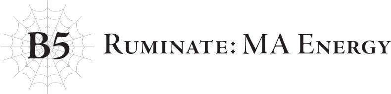
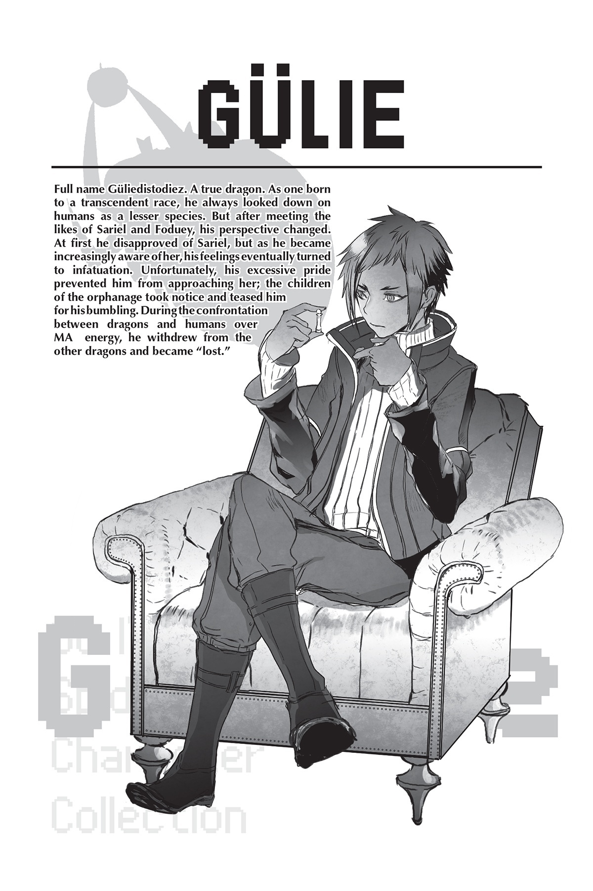

# Trầm tư: Năng lượng MA
*(Ruminate: MA Energy)*

Sự cố ma cà rồng tương tự gây ảnh hưởng đến Foduey cũng đã đưa tên của Potimas lên hàng đầu trong danh sách truy nã trên toàn thế giới.

Dù rất cẩn trọng, nhưng quy mô hành động của hắn lại quá lớn.

Rốt cuộc, ngay cả hắn cũng không thể che giấu hết toàn bộ những hoạt động vô số kể của mình.

Nhưng dĩ nhiên, hắn chưa bao giờ là kiểu người sẽ chỉ đơn giản là bỏ trốn.

Thật là một kẻ ngoan cố.

Vào khoảng thời gian Potimas trở thành tội phạm truy nã, hắn đã công bố một bước đột phá nghiên cứu nhất định.

Đó chính là: lý thuyết về năng lượng MA.

Nếu kỹ năng Cấm kỵ của một người đạt cấp 10, các chi tiết xoay quanh thuật ngữ năng lượng MA sẽ trở nên rõ ràng.

Ngay cả khi không có điều đó, rất có thể một số người đã từng nghe qua cụm từ này trước đây.

Dù sao thì, đó cũng là tội lỗi nghiêm trọng nhất mà con người thế giới này từng phạm phải.

Nhiều thời gian đã trôi qua kể từ đó, và hầu hết mọi người đã quên những gì xảy ra trong những ngày ấy, nhưng tôi nghi ngờ vẫn còn một số người tiếp tục nhắc về nó.

Dustin, chính Giáo hoàng của Thần Ngôn Giáo, là một cá nhân biết rõ sự thật.

Sẽ không có gì ngạc nhiên nếu ông ta bí mật phát tán vài phần manh mún của thông tin đó vào trong giáo lý của giáo hội mình.

Hửm? Bạn nói rằng cách diễn đạt đó nghe như thể tôi không mấy quen thuộc với giáo lý của Thần Ngôn Giáo?

Thực ra đúng là vậy đấy.

Tôi không biết chi tiết về Thần Ngôn Giáo.

Điều đó thực sự đáng ngạc nhiên đến thế sao?

Thẳng thắn mà nói, tôi không có chút hứng thú nào với những thứ như vậy.

…Bạn nghĩ đó là một lý do tàn nhẫn ư?

Có lẽ thế.

Nhưng hãy suy ngẫm một chút xem.

Dustin đã sáng lập ra Thần Ngôn Giáo để cứu nhân loại.

Nếu nhìn xuyên qua những chi tiết giáo lý ở bề nổi, bản chất thực sự của nó là một công cụ phục vụ cho chủ nghĩa nhân loại thượng đẳng.

Nó tìm cách cứu nhân loại bằng mọi giá mà không màng đến bất kỳ sự hy sinh nào, cho dù đó là ma tộc hay thậm chí là những vị thần như chính tôi.

Chỉ có thế thôi.

Tại sao tôi lại phải có bất kỳ sự hứng thú nào với chính cái giáo lý đã chọn cứu nhân loại bằng cách hiến tế Sariel cơ chứ?

Tôi hiểu tại sao Dustin lại chọn lèo lái mọi thứ theo hướng đó.

Về bản chất, nó là sự phản ánh ý chí sắt đá của cá nhân ông ta.

Vì thế tôi không trách ông ta.

Nhưng tôi có quyền tự do có định kiến riêng của mình về nó, chẳng phải sao?

Có lẽ tôi thật nhỏ nhen, nhưng tôi chưa bao giờ có thể tự bắt mình thỏa hiệp trong vấn đề đó.

Dù vậy, tôi muốn nghĩ rằng mình vẫn giữ thái độ trung lập trên tư cách là một quản trị viên.

Trên thực tế, đối với việc họ chống lại Potimas, tôi luôn hoàn toàn ủng hộ.

Nhưng nhắc đến Potimas, hãy quay lại với vấn đề chính nào.

Lý thuyết năng lượng MA mà hắn phát triển đã làm chấn động toàn thế giới.

Nhân tiện, theo những gì tôi được kể, các phương pháp tích lũy năng lượng ở thế giới của những người tái sinh phần lớn mang tính vật lý.

Thay vì dùng ma pháp hay thuật thức ma pháp, họ sử dụng các vật liệu tự nhiên như dầu mỏ và ánh sáng mặt trời.

Thế giới của chúng tôi khi đó cũng tương tự; năng lượng cần thiết cho các hoạt động thường nhật của con người được thu nhận thông qua các phương tiện vật lý.

Ngay cả với sự tồn tại của những thực thể như loài rồng và Sariel, khía cạnh đó cũng không có gì khác biệt so với thế giới của những người tái sinh.

Nhưng năng lượng MA đã thay đổi điều đó mãi mãi.

Đến đây, có lẽ bạn đã lờ mờ đoán được bản chất của cái gọi là năng lượng MA này rồi.

Thực vậy, năng lượng MA là một dạng năng lượng được thu thập thông qua các phương thức ma pháp, bằng con đường thuật thức.

Đối với con người, những kẻ vốn luôn thu nhận năng lượng từ các nguồn vật lý, lý thuyết cấu trúc năng lượng MA mà Potimas phát triển chắc hẳn trông giống như một cách tạo ra thứ gì đó từ hư không.

Quả thực, năng lượng MA đã được mô tả như vậy: một nguồn năng lượng kỳ diệu đến từ hư không.

Nguồn năng lượng vô hạn có thể sử dụng vô tận mà không gây ra bất kỳ tác hại nào cho môi trường.

…Thật là ngu xuẩn làm sao.

Làm gì có chuyện một thứ như thế có thể tồn tại được.

Mọi tài nguyên đều có giới hạn.

Sự thật đó áp dụng cho mọi thứ từ vật lý, ma pháp cho đến bất cứ thứ gì khác.

Nhưng con người đã không hiểu được điều đó.

Không, nói vậy không hoàn toàn chính xác. Vẫn có một vài người hiểu.

Dustin là một người như thế.

Tuy nhiên, đại đa số con người sẽ chỉ tin vào những thứ tiện lợi cho bản thân họ.

Huống hồ là khi họ đang ở thế tuyệt vọng.

Những kẻ nhanh chóng bấu víu vào năng lượng MA nhất chính là những con người tuyệt vọng nhất…

…đặc biệt là những con người — hay đúng hơn là những quốc gia — nghèo khổ nhất.

Sự chênh lệch giàu nghèo giữa các quốc gia loài người là vô cùng kinh khủng.

Những kẻ nghèo nhất trong số đó đã nhìn thấy hy vọng dưới hình hài của năng lượng MA.

Thuyết năng lượng MA mà Potimas công bố rộng rãi chỉ mô tả phương pháp thu hoạch năng lượng MA.

Hầu hết mọi người đều hoài nghi khi nó mới được công bố, nhưng các quốc gia đang cần nhất vẫn mặc kệ mà sử dụng.

Tôi tin đây chính là cái mà những người tái sinh gọi là "chết đuối vớ phải cọng rơm" nhỉ?

Nhưng quả thực, những "cọng rơm" này đã cho phép các quốc gia đó phục hồi thành công, ít nhất là lúc ban đầu.

Năng lượng MA chắc chắn là một nguồn năng lượng hiệu quả, ít nhất là ở bề nổi.

Các quốc gia sử dụng nó để giải quyết cuộc khủng hoảng năng lượng đã nhanh chóng có những bước tiến vượt bậc.

Có những sự phản đối từ các quốc gia sống dựa vào xuất khẩu tài nguyên như dầu mỏ, nhưng tôi sẽ bỏ qua những chi tiết đó vì chúng không còn liên quan nữa.

Và khi các quốc gia nghèo khổ bắt đầu phát triển nhanh chóng nhờ năng lượng MA, các nước phát triển hơn cũng bắt đầu đưa nó vào sử dụng.

Không nghi ngờ gì nữa, họ rất ghét việc bị bỏ lại phía sau bởi những quốc gia mà họ coi là yếu kém hơn.

Do đó, chậm rãi nhưng chắc chắn, ngày càng có nhiều quốc gia bắt đầu tham gia giao dịch năng lượng MA.

Tuy nhiên, không phải tất cả bọn họ.

Có một số quốc gia từ chối sử dụng năng lượng MA. Lý do của họ rất đa dạng: năng lượng MA được phát triển bởi một tội phạm bị truy nã như Potimas, bản chất của năng lượng MA vẫn chưa được làm rõ, các nước xuất khẩu dầu mỏ vẫn phản đối sự trỗi dậy của năng lượng MA, vân vân.

Quốc gia nơi Dustin làm tổng thống là một trong số những nước đó.

Đất nước của ông ta lớn và có sức ảnh hưởng mạnh mẽ. Nếu họ thể hiện lập trường cứng rắn chống lại năng lượng MA, các quốc gia khác chắc chắn cũng sẽ phải do dự.

Tuy nhiên, ngăn chặn dòng chảy của tiến trình lịch sử là một việc vô cùng khó khăn.

Chẳng bao lâu sau, ngày càng có nhiều người bắt đầu đồng tình với việc sử dụng năng lượng MA, khi thấy nó có hiệu quả rõ rệt trong việc giải quyết cuộc khủng hoảng năng lượng.

Trên hết, có một lý thuyết mang tính đột phá khác mà Potimas đã công bố cùng lúc với thuyết năng lượng MA.

Đó chính là: thuyết tiến hóa thông qua năng lượng MA.

Về cơ bản, nó gợi ý rằng năng lượng MA có thể được sử dụng để giúp con người tiến hóa.

Nó giống như một báo cáo tiến độ về kết quả nghiên cứu của Potimas đối với các dạng tiến hóa như ma cà rồng hóa.

Nhưng ngay cả khi nó chưa hoàn thiện theo tiêu chuẩn của hắn, nhân loại vẫn không thể phớt lờ những kết quả đó.

Bằng cách tiêu thụ một lượng khổng lồ năng lượng MA cho một ca phẫu thuật điều trị, con người có thể tiến tới một giai đoạn phát triển mới.

Có hai thay đổi lớn:

Năng lực thể chất được cải thiện và tuổi thọ kéo dài hơn.

Điều thứ hai đặc biệt thu hút sự chú ý.

Bởi vì quy trình này đòi hỏi một lượng năng lượng MA khổng lồ, nên về cơ bản chỉ có những người giàu có nhất mới có thể thực hiện.

Cho đến trước thời điểm đó, cuộc sống dài lâu hơn là thứ duy nhất mà tiền bạc của họ không thể mua được, bất kể họ khao khát nó đến mức nào.

Đáng tiếc là nó không ban cho sự trẻ mãi không già hay bất tử, nhưng nó vẫn là một sự đổi chác tiền bạc lấy thêm thời gian để sống.

Thật dễ hiểu khi con người đổ xô vào cơ hội đó.

Nhiều quốc gia phát triển đã dỡ bỏ lệnh cấm đối với năng lượng MA vì những công dân giàu có nhất của họ yêu cầu nó để thực hiện quy trình này.

So với toàn bộ nhân loại, có rất ít người thực sự thực hiện cuộc phẫu thuật này.

Ít nhất là dựa trên dân số vào thời điểm đó.

Dù thế nào đi nữa, lượng tiêu thụ năng lượng MA của họ vẫn là quá cao.

Con người dường như nghĩ rằng đó là một nguồn năng lượng vô tận, nhưng nó không thể được thu thập cùng một lúc.

Mặc dù hầu hết các quốc gia trên thế giới đều có thể kiếm đủ lượng năng lượng để phục vụ hoàn toàn cho các hoạt động vận hành của mình.

Nhưng lượng năng lượng MA cần thiết cho sự tiến hóa cao đến mức không tưởng, khiến cho cuối cùng không còn đủ để phân phát khắp nơi nữa.

Tôi hình dung đó là lý do tại sao Dustin ghét cay ghét đắng những kẻ đã trải qua cuộc phẫu thuật đó.

Dẫu bản thân họ vốn là con người, nhưng ông ta coi họ là những thực thể riêng biệt, là kẻ thù của nhân loại.

Đó là lý do tại sao ông ta gọi hậu duệ của những kẻ đã chọn tiến hóa là "ma tộc".

Bằng cách tiêu phí lượng lớn năng lượng MA cho lợi ích cá nhân, rốt cuộc họ đã đẩy nhanh sự hủy diệt của thế giới.

Họ đã từng là tầng lớp giàu có và đặc quyền của nhân loại.

Khi tôi nghĩ về việc ma tộc, những kẻ có nguồn gốc từ họ, hiện đang đứng trên bờ vực tuyệt chủng, thật khó để diễn tả cảm xúc của mình.

Tôi cho rằng theo một nghĩa nào đó, đó chính là sự trừng phạt dành cho họ.

Nhưng gác lại nguồn gốc của ma tộc, việc sử dụng năng lượng MA bắt đầu từ các quốc gia nghèo hơn cuối cùng đã lan sang cả các quốc gia đang phát triển và phát triển.

Có rất ít quốc gia phản đối.

Vào thời điểm đó, có lẽ chỉ có mỗi Dustin.

Nhưng có những người không thuộc về các quốc gia này vẫn tiếp tục phản đối.

Đó là: Chân Long chúng tôi, và Sariel.

Năng lượng MA được thu thập bằng con đường thuật thức ma pháp.

Thế nên những ai am hiểu sâu sắc về ma pháp như chúng tôi lập tức nhận ra bản chất thực sự của nó.

Đó là lý do tại sao chúng tôi đã cố gắng cảnh báo họ.

"Đừng sử dụng năng lượng MA."

Tôi đoán trạng thái hiện tại của thế giới này đã chứng minh liệu họ có thèm để tai đến những lời cảnh báo đó hay không.

Quả thực, con người đã từ chối lắng nghe.

Tôi tin rằng họ không đủ sợ hãi loài rồng, mặc cho sự thật là chúng tôi từng tiêu diệt cả một quốc gia của họ chỉ trong một đêm trong quá khứ.

Vào lúc đó, quốc gia cụ thể ấy không hiểu sao lại bị ám ảnh bởi ý nghĩ điên rồ là ném một loại bom mới vào quê hương của loài rồng.

Dĩ nhiên, những thứ như thế không bao giờ có thể tiêu diệt được chúng tôi.

Nhưng chúng tôi vẫn xóa sổ đất nước đó để trả thù.

Tuy nhiên, sự kiện trọng đại đó chỉ còn được ghi lại trong sách giáo khoa vào kỷ nguyên năng lượng MA; có rất ít con người đang sống thực sự nhớ được nó.

Khi các thế hệ trôi qua, nỗi sợ hãi mà chúng tôi gieo rắc vào họ tự khắc nhạt nhòa dần.

Mặc dù sự kiện đó vẫn có vẻ như mới xảy ra từ góc nhìn của loài rồng, nhưng đối với con người, nó đã lùi sâu vào quá khứ.

Nhưng vì đó là lần duy nhất chúng tôi can thiệp sâu sắc vào nhân loại, vì nể mặt Sariel, có lẽ chúng tôi đã tự gieo mầm mống cho sự hủy diệt.

Nó cho phép con người ảo tưởng rằng loài rồng thực ra chẳng đáng sợ đến thế, rằng họ có thể phớt lờ lời cảnh báo của chúng tôi.

Về bản chất, họ đặt mối đe dọa từ loài rồng lên bàn cân với cái lợi từ năng lượng MA và đã đưa ra phán quyết chọn cái sau.

Những lời cảnh báo của chúng tôi do đó đã bị ngó lơ, và Sariel cũng bị đẩy vào một tình thế tiến thoái lưỡng nan.

Vì cô ấy đang phải chịu áp lực từ chính những nhân viên của mình trong Quỹ Sariella.

Cuộc khủng hoảng năng lượng là một vấn đề cực kỳ quan trọng đối với những người làm việc trong ngành y tế, bởi thiết bị y tế hiện đại nhất không thể vận hành nếu thiếu năng lượng.

Trên hết, lý thuyết tiến hóa bằng năng lượng MA đã chứng tỏ giá trị vô giá cho việc nghiên cứu điều trị những căn bệnh nan y trước đây.

Quả thực, đối với giới y khoa, năng lượng MA là một ngọn hải đăng hy vọng.

Và dĩ nhiên, như tôi đã mô tả trước đó, các tầng lớp bình dân đã được giúp đỡ vô cùng nhiều bởi năng lượng MA.

Vì Quỹ Sariella tồn tại để hỗ trợ những người kém may mắn, họ không thể đồng tình với việc từ bỏ hoàn toàn việc sử dụng năng lượng MA.

Nếu Foduey có sức khỏe tốt, có lẽ ông ta đã xử lý được cuộc nội bộ mâu thuẫn kiểu này, nhưng ông ta lại đang bị cách ly do sự biến đổi thành ma cà rồng.

Thẳng thắn mà nói, Quỹ Sariella cũng đã trở nên quá lớn nhờ vào sự hỗ trợ của Foduey.

Nó lớn đến mức, trên thực tế, một lời của riêng Sariel không thể quyết định được phương hướng của họ, mặc dù cô ấy là người sáng lập kiêm chủ tịch.

Vì chính tổ chức của mình đang quay lưng lại với mình, Sariel cuối cùng đã rút lui khỏi tầm mắt của công chúng.

Vì lúc đó họ cũng vừa tiếp nhận những đứa trẻ là nạn nhân của các cuộc thí nghiệm trên người của Potimas, cô ấy đã dành toàn bộ tâm trí của mình để quản lý cô nhi viện thay vì điều hành Quỹ.

Tôi vẫn không thể nói liệu điều đó có tốt nhất hay không…

Những đứa trẻ từ cô nhi viện đó, bao gồm cả Ariel, sau này sẽ có ảnh hưởng vô cùng lớn đến tương lai.

Điều đó có lẽ đã không xảy ra nếu họ không gắn bó chặt chẽ với Sariel đến vậy, điều này làm tôi tự hỏi liệu mọi thứ có đi theo một hướng khác nếu không như thế.

Như vậy, tầm ảnh hưởng của Sariel đã bị gạt bỏ khỏi Quỹ Sariella.

Nhưng cả cô ấy lẫn tôi cùng những con rồng khác không thể nhắm mắt làm ngơ trước hành động của con người chỉ vì họ từ chối nghe theo lời cảnh báo của chúng tôi.

Chúng tôi thừa biết rằng mọi chuyện sẽ trở nên tồi tệ một cách thảm hại trước khi quá muộn nếu họ tiếp tục đi theo con đường này.

Tại sao ư? Bởi vì năng lượng MA là một sự bóc lột trực tiếp nguồn sinh mệnh lực của hành tinh.

Hành tinh cũng có sinh mệnh lực, giống như các sinh vật sống.

Những vị thần như chúng tôi hấp thụ phần năng lượng dư thừa do hành tinh tỏa ra để sinh tồn.

Có lẽ nó tương tự như cách thực vật tạo ra oxy và động vật tạo ra carbon dioxide.

Nhưng lượng năng lượng MA mà con người đang lấy đi thì không phải vậy.

Họ không sử dụng phần dư thừa được giải phóng tự nhiên, mà cưỡng ép vắt kiệt nguồn năng lượng hành tinh cần để duy trì sự sống.

Nếu họ cứ tiếp tục như thế này, hành tinh chắc chắn sẽ suy yếu và cuối cùng là sụp đổ.

Loài rồng cũng như Sariel đã bảo họ dừng lại để ngăn chặn điều đó.

Dĩ nhiên, chúng tôi cũng đã giải thích rõ lý do.

…Nhưng như tôi đã nói trước đây, con người chỉ tin vào những điều tiện lợi cho bản thân họ.

Và họ sẽ luôn tìm ra một cái cớ để không tin vào điều ngược lại.

Thật ngu ngốc.

Thật sự vô cùng ngu ngốc.

Tôi chắc chắn cái giá phải trả cho sự ngu ngốc đó lớn hơn nhiều so với những gì con người có thể tưởng tượng.

Từ bao giờ nhân loại đã quên đi nỗi sợ hãi loài rồng…?

Và tại sao họ lại lạc quan cho rằng loài rồng sẽ không hành động theo cơn thịnh nộ của mình…?

Tôi vẫn nhớ rõ như in.

Các vị rồng trưởng lão đã triệu tập tất cả loài rồng cho một buổi họp mặt.

Tại đó, họ đưa ra tuyên bố.

"Chúng ta sẽ thanh trừng loài người."

Ngày hôm đó, loài rồng đã bộc lộ nanh vuốt của mình chống lại nhân loại.

---

[◀ Chương trước: Lãnh chúa dõi theo](18_l5_the_lord_looks_on.md) | [Chương tiếp theo: Đoạn phụ: Potimas và sự phổ biến của Năng lượng MA ▶](20_interlude_potimas_and_the_popularization_of_ma_energy.md)
