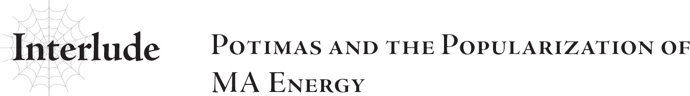

# Đoạn phụ: Potimas và sự phổ biến của Năng lượng MA
*(Interlude: Potimas and the Popularization of MA Energy)*

Thật phiền toái làm sao, ta lại trở thành một kẻ bị truy nã.

Nhưng thế cũng chẳng sao. Việc phổ cập năng lượng MA đang tiến triển thành công.

Cả thuyết tiến hóa cũng thế.

Cơ hội tuy mong manh, nhưng có lẽ sẽ có kẻ tận dụng hai học thuyết này và tạo ra những kết quả nghiên cứu thành công hơn ta.

Suy cho cùng, đâu nhất thiết cứ phải tự tay ta tìm ra con đường dẫn đến cuộc sống vĩnh hằng.

Đương nhiên, đó là phương án chắc chắn và đáng tin cậy nhất, nhưng nếu có kẻ khác tìm ra chìa khóa dẫn đến cuộc sống vĩnh hằng trước, thì đó vẫn là một chuyện đáng mừng.

Nghiên cứu của ta đã vấp phải một bức tường bế tắc.

Đúng như những gì ta đã công bố trong thuyết tiến hóa của mình, ta đã thành công trong việc kéo dài tuổi thọ.

Thực ra, ta còn tìm thấy một phương thức tiến hóa sang chủng tộc khác giúp kéo dài tuổi thọ hơn nữa.

Để cho tiện, ta đã tự tiến hóa sang chủng tộc này, chủng tộc mà ta gọi là "Elf".

Nhưng mạng sống của ta giờ chỉ dài hơn trước; chứ không phải là vĩnh hằng.

Cần phải tiến hành thêm nhiều nghiên cứu nữa, nhưng việc đó lại đòi hỏi một lượng năng lượng MA khổng lồ.

Lượng năng lượng MA mà một cá nhân có thể tự thu thập là có giới hạn.

Đó là lý do tại sao ta phổ biến nó.

Nếu biết được bản chất thực sự của năng lượng MA, loài rồng có lẽ sẽ không chịu khoanh tay đứng nhìn, nhưng cứ để chúng làm những gì chúng muốn.

Việc sử dụng năng lượng MA sẽ gây ra tác động gì đối với hành tinh này cũng chẳng quan trọng.

Nghiên cứu luôn đòi hỏi sự hy sinh.

Miễn là nghiên cứu của ta thành công trước khi hành tinh này bị hủy diệt, mọi chuyện đều sẽ tốt đẹp.

Nếu hành tinh này lụi tàn trước thời điểm đó, ta chỉ việc từ bỏ nó và đi sang nơi khác.

Ta không cần đến một nơi mà mình không thể làm nghiên cứu.

Tại sao ta phải bận tâm về một hành tinh thảm hại thậm chí còn không thể ban cho lấy một người cuộc sống vĩnh hằng?

Ta đã thực hiện xong những khâu chuẩn bị để bay vào không gian.

Kể từ khoảnh khắc chúng ta bắt đầu sử dụng năng lượng MA, hành tinh này sớm muộn gì cũng đã bị định đoạt là phải diệt vong.

Ta sẽ vắt kiệt đến giọt cuối cùng những thứ có thể phục vụ cho nghiên cứu của ta.

Lũ con người còn lại có thể thay ta hứng chịu cơn thịnh nộ của loài rồng.

Đằng nào thì khi hành tinh này lụi tàn, bọn chúng cũng sẽ tiêu vong cùng nó mà thôi.

Ít nhất thì bọn chúng cũng có thể có ích cho ta trước khi chết.

---

[◀ Chương trước: Trầm tư: Năng lượng MA](19_b5_ruminate_ma_energy.md) | [Chương tiếp theo: Chương 6: Quyết chiến: Cuộc chạm trán tình cờ ▶](21_ch6_showdown_chance_meeting.md)
