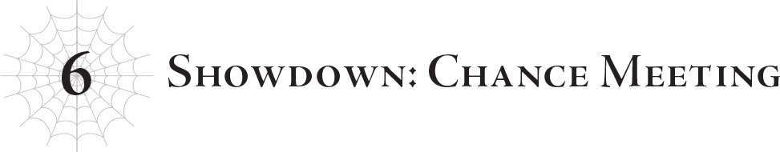
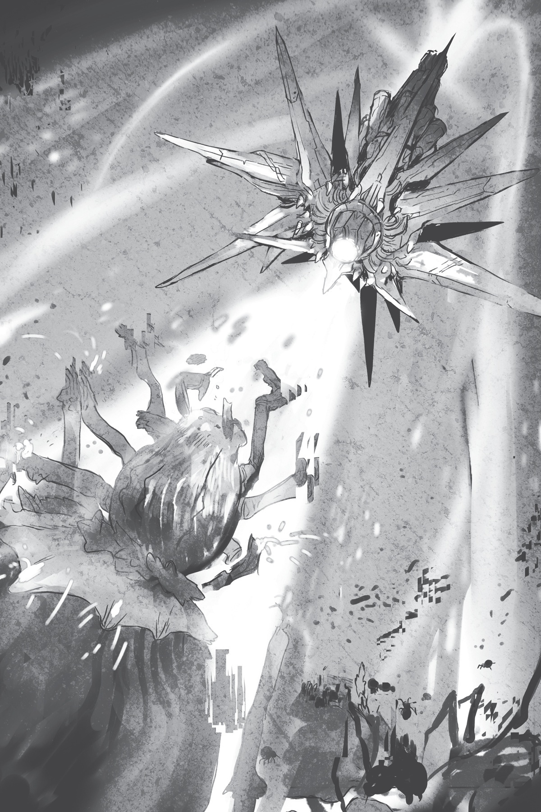

# Chương 6: Quyết chiến: Cuộc chạm trán tình cờ
*(Chapter 6: Showdown: Chance Meeting)*

Tôi hơi lo lắng cho nhóm Yamada, nhưng trước khi qua đó...

Tôi triệu hồi bốn phân thân chiến đấu và đặt các nhện rối lên trên chúng.

Như vậy, trong trường hợp gặp rắc rối lớn, chúng vẫn có thể trốn thoát bằng khả năng dịch chuyển của các phân thân chiến đấu.

Nhưng mà phải nói thật—cảnh tượng một cô bé sáu tay ngồi trên đỉnh phân thân chiến đấu, hay nói cách khác là một con nhện cao ba feet...

Đây chính là cái gọi là vừa đáng sợ vừa đáng yêu sao!

Các nhện rối oai phong lẫm liệt phi đi trên lưng các phân thân chiến đấu.

Hửm. Trông chúng có vẻ khá phấn khích, nhưng tôi chắc đó chỉ là do mình tưởng tượng thôi.

Dù sao thì, giờ không còn gì phải bận tâm nữa, tôi sẽ qua xem tình hình của nhóm Yamada thế nào.

Dịch chuyển, kích hoạt!

Thế là, tôi đã đến hiện trường, và... cái tình cảnh hỗn loạn gì thế này?

Trước tiên, Yamada đang nằm co rúm trên mặt đất, hai tay ôm chặt lấy đầu.

Cậu ta trông có vẻ chưa bất tỉnh, nhưng chắc chắn là đang phải chịu một cơn đau đớn dữ dội nào đó.

Và không hiểu sao, một cô nàng bán tinh linh lại đang nằm ngay bên cạnh cậu ta.

Ừm, tên cô ta là gì ấy nhỉ? Anna?

Tiếp đó là Ooshima, cô ấy đang ngồi sát bên và ôm lấy Yamada.

Hyrince và Shinohara đang đứng chắn trước Yamada, như thể để bảo vệ cậu ta.

Cô Oka thì ở cách đó một quãng phía sau bọn họ.

Thêm vào đó, Tagawa và Kushitani cũng đang nằm trên đất, hoàn toàn bất tỉnh nhân sự.

Như thể thế vẫn chưa đủ hỗn loạn, Natsume thì đang đứng đó lườm Vampy cháy mặt, còn Vampy cũng lườm ngược lại cậu ta không chút kiêng dè, chẳng thèm che giấu sát ý của mình.

Cậu Oni có vẻ không mấy quan tâm đến hai người kia; cậu ta chỉ đăm đăm nhìn Yamada với vẻ mặt bàng hoàng.

Ừm, xin chào?

Có chuyện gì đang xảy ra ở đây thế?

Ai đó giải thích giùm cái coi!

Nhưng không có thời gian để đứng đó mà hoang mang đâu, vì tình hình chỉ có tệ đi thôi.

Thế nên tôi quyết định giải quyết mối nguy hiểm nhãn tiền trước tiên: cụ thể là xen vào giữa Vampy và Natsume.

Hay đúng hơn, tôi dịch chuyển ra ngay sau lưng Natsume, nhưng ở khoảng cách đủ gần...

Tạm thời, tôi chậm rãi đưa tay ra, cẩn thận không để cậu ta phát giác.

Sau đó, tôi chộp mạnh lấy sau đầu cậu ta.

…Ủa, sao lúc đưa tay ra thì chậm rãi tao nhã thế mà hành động sau đó lại thô bạo vậy?

Không có thời gian cho việc đó đâu, đồ ngốc!

Ngay lập tức, tôi ra lệnh cho phân thân nhện đang sống trong đầu Natsume cho cậu ta ngủ một giấc.

Nhân tiện đây, tôi cũng thu hồi luôn con nhện ký sinh nhỏ kia về.

Vai trò mà tôi cần Natsume đóng về cơ bản đến thời điểm này đã hoàn thành rồi.

Từ giờ trở đi cậu ta muốn làm gì thì làm.

Kết quả sau đó thế nào thì cậu ta tự chịu trách nhiệm lấy.

Bạn có thể nghĩ việc vứt bỏ cậu ta sau khi đã lợi dụng chán chê như thế này là tàn nhẫn, nhưng hãy nhớ rằng, Natsume vốn dĩ đã chẳng phải hạng tốt lành gì trước khi chúng tôi bắt đầu lợi dụng cậu ta rồi.

Nên cứ tự nhủ là cậu ta đáng bị như thế đi nhé, xin cảm ơn!

Phân thân tí hon chui ra từ tai Natsume, và tôi thu nó lại.

Cùng lúc đó, Natsume ngã lăn ra đất ngất xỉu.

“Chủ nhân, cô có thể đừng có xen vào được không?”

Vampy hậm hực dậm chân đi về phía tôi, lộ rõ vẻ khó chịu ra mặt.

Này nhé, nếu tôi không can thiệp, cô chắc chắn đã giết phăng Natsume rồi đúng không hả?

Tôi không biết chuyện gì đã xảy ra, nhưng cô không thể cứ tùy tiện đi giết người bất cứ khi nào thấy ngứa mắt được.

Cô nên bổ sung thêm canxi đi thì hơn.

…Nhắc mới nhớ, hình như mấy nhóc nhện rối có một dạo chuyên cho Vampy ăn xương.

Hay là dạo này cô ta hay cáu bẳn là do thiếu canxi trong xương nhỉ?

Ủa mà không phải ma cà rồng là để hút máu chứ đâu phải ăn xương hả?

“Không thể nào… Nhưng bằng cách nào chứ?”

Ối.

Tôi mải mê suy nhiệt vẩn vơ đến mức cô Oka đã nói gì đó với tôi mất rồi.

Hoặc ít nhất, cô ấy đã tự lẩm bẩm gì đó về tôi.

“Chào cô, cô Oka.”

Tôi quyết định trả lời cô ấy.

Vampy và cậu Oni lộ rõ vẻ sửng sốt trước phản ứng của tôi.

N-này nhé, tôi cũng có thể chào hỏi người khác nếu tôi thực sự muốn, được chưa hả!

Dù phần lớn là do người đối diện là cô Oka đi chăng nữa!

“Wakaba…?”

Yamada rên rỉ, nhận ra tôi rồi thì thầm cái tên đó.

Sau đó cậu ta ngất đi, như một con rối bị đứt dây vậy.

Cậu ta có vẻ chưa chết. Nhưng nhìn vào tình trạng của cậu ta trước khi ngất, tôi cũng không thể cho rằng cậu ta vẫn ổn được.

Tôi phải kiểm tra tình trạng của cậu ta và trị thương ngay lập tức.

Thế là tôi bước lên một bước, nhưng lập tức bị chặn lại bởi một người đang đứng cản đường.

Đó là Ooshima, cô ấy đang nhìn tôi bằng ánh mắt tuyệt vọng, lăm lăm thanh kiếm gãy trong tay để cố gắng bảo vệ Yamada.

Này nhé, tôi đang cố cứu cậu ta đấy, được không? Đừng có quăng cho tôi cái ánh nhìn kiểu “muốn đụng vào cậu ấy thì bước qua xác tôi trước” như thế chứ.

Tôi liếc nhìn Hyrince, người đang đứng ngay cạnh Ooshima, nhưng anh ta lại cả gan phớt lờ ánh mắt kiểu “làm gì đó đi chứ!” của tôi.

Thực tế là anh ta cũng đang đứng cản đường tôi cùng với Ooshima luôn.

Ý anh ta là muốn tiếp tục đóng vai Hyrince ở đây, chứ không phải Güli-güli hả?

Hửm. Hừm.

Nếu Güli-güli đã tỏ thái độ như vậy, liệu tôi có thể yên tâm cho rằng tình trạng của Yamada không phải là trường hợp khẩn cấp không nhỉ?

Thế thì chắc không cần phải cuống lên làm gì.

Trong trường hợp đó, tôi đoán bước tiếp theo của mình là trừng trị kẻ đã gây ra đống hỗn loạn này.

“Sao tôi cảm thấy như cô đang tỏa ra một bầu không khí cực kỳ đáng sợ thế, Chủ nhân? Đó chỉ là do tôi tưởng tượng thôi đúng không?”

Ồ, nó cực kỳ thật đấy, Vampy cưng ạ.

Tôi biết chắc là cô đã đưa ra một quyết định ngu ngốc nào đó dẫn đến cơ sự này!

Mau khai ra mau, nhanh lên!

Cô đã làm cái gì?!

“Ôi, đừng có nhìn tôi bằng ánh mắt buộc tội đó chứ. Tôi đâu có làm gì đâu, được chưa? Tôi không nghĩ là tốt đẹp gì khi Chủ nhân cứ luôn đổ lỗi cho tôi mỗi khi có chuyện như thế này xảy ra đâu đấy.”

Đồ dối trá!

“Wakaba… là cậu đúng không? Chuyện này là sao hả?! Cậu đã làm gì Shun rồi?!”

Ooshima đang gào lên với tôi, nhưng việc đó phải đợi sau đã, vì tôi đang bận thẩm vấn kẻ mà tôi nghi ngờ là thủ phạm thực sự đã làm gì đó với Shun.

“Cô White, chúng tôi thực sự không làm gì cả.”

Ngay khi tôi đang định xách cổ áo Vampy lên bắt cô ta khai ra tất cả, thì cậu Oni đột nhiên bước lên bênh vực cô ta!

“Shun đã làm gì đó cho cô nàng bán tinh linh kia rồi bỗng nhiên lăn lộn đau đớn. Dựa trên tình hình, tôi đoán cậu ấy đã sử dụng một kỹ năng nào đó và bị dính tác dụng phụ chăng?”

Vampy gật đầu lia lịa hưởng ứng màn phân tích điềm tĩnh của cậu Oni.

“Thực ra, nếu có ai làm sai thì đó là tôi, chứ không phải Sophia.”

Cậu Oni nhìn tôi với vẻ mặt hối lỗi.

Hử? Không phải là do cái đứa ngốc nghếch đang gật đầu lia lịa với nụ cười đắc thắng kia à?

“Tôi đã chém cô nàng bán tinh linh đó, rồi Shun chữa trị cho cô ta, nhưng ngay khoảnh khắc tiếp theo thì cậu ấy đã ngã xuống đất lăn lộn vì đau đớn. Ít nhất thì đó là những gì tôi nhìn thấy.”

Phân tích xuất sắc lắm, cậu Oni.

Rất ngắn gọn và dễ hiểu.

Hửm? Khoan đã, cậu ta chữa trị cho cô ta rồi ngã xuống vì đau đớn?

“Nhân tiện thì, trừ khi tôi nhìn lầm một cách tai hại, chứ không đời nào cậu ta có thể chữa trị cho cô nàng bán tinh linh kia được. Đó chắc chắn là một vết thương chí mạng. Dù Shun có giỏi ma pháp đến mấy, cậu ta cũng không thể nào cứu kịp cô ta.”

Hửmmm?

Khoan, cái gì cơ? Ý cậu là cô nàng bán tinh linh nằm cạnh Yamada vốn dĩ đã chết rồi sao?

Nhưng cô ta rõ ràng vẫn đang thở mà… Rõ ràng là cô ta chỉ đang ngất thôi đúng không?

Mà như thế thì chỉ có thể nghĩa là… Yamada đã sử dụng kỹ năng [Từ Bi] để hồi sinh cô ta?

“Có phải Shun đã cứu cô ta từ cõi chết bằng cách nào đó không? Ý tôi là, một năng lực như thế không đời nào lại không có cái giá của nó đúng không? Tôi không biết hậu quả là gì, nhưng nó sẽ giải thích tại sao Shun lại có vẻ đau đớn như vậy. Nên đừng có đổ lỗi chuyện đó lên đầu tụi này, Kanata.”

Câu nói cuối cùng kia là hướng thẳng về phía Ooshima, người vẫn đang kiên cường giơ thanh kiếm gãy lên.

Ooshima đang mở to mắt nhìn với vẻ đầy hoang mang, nhưng đồng thời vẫn lấp lánh tia nhìn của một người đang cố gắng đánh giá tình hình, tuyệt vọng tìm kiếm lối thoát khỏi mớ bòng bong này.

Nhưng tôi chẳng có hơi sức đâu mà lo chuyện đó lúc này.

Chính tôi mới đang toát mồ hôi hột đây này.

Nghĩ lại thì, việc Yamada gục ngã không phải phần nào là do lỗi của tôi sao?

Kiểu như, nếu cậu ta dùng [Từ Bi] rồi ngã xuống vì đau đớn, điều đó nghĩa là kỹ năng [Cấm kỵ] của cậu ta đã đạt cấp tối đa đúng không?

Cái giá của việc sử dụng [Từ Bi] là cấp độ kỹ năng [Cấm kỵ] sẽ tăng lên.

Bản thân việc đó vốn dĩ không gây ra đau đớn gì… trừ phi [Cấm kỵ] đạt cấp tối đa.

Tôi đã tự mình trải nghiệm chuyện đó rồi, và để tôi nói cho bạn nghe, dù muốn hay không tôi vẫn nhớ như in cảm giác buồn nôn tột độ lúc ấy.

Ừ. Cậu ta ngất đi cũng là phải.

Mà nhắc mới nhớ, tôi tình cờ biết có một kẻ chủ mưu nào đó đã cố tình ném đống xác chết trước mặt Yamada để ép cậu ta tăng cấp độ [Cấm kỵ].

Ối! Là tôi chứ ai!

Đúng vậy, thủ phạm khiến kỹ năng [Cấm kỵ] của Yamada đạt cấp tối đa chính là tôi!

Cậu Oni có vẻ là người đã tung ra cú đẩy cuối cùng, nhưng sự thật là chính tôi đã giăng bẫy đưa cậu ta vào tròng.

Ui cha, tôi chẳng có tư cách gì để đi buộc tội Vampy nữa rồi...

“Nhưng mà Kanata này, không phải cậu đang làm quá lên trước việc Shun chỉ đơn thuần là bất tỉnh thôi sao?”

Trong lúc tôi đang vắt óc nghĩ cách giấu nhẹm cái sự thật nho nhỏ này đi, cậu Oni đã khéo léo đổi chủ đề.

“Shun vẫn còn sống. Cậu ấy chưa chết. Và đây là chiến trường, nơi cái chết có thể ập đến bất cứ lúc nào. Vậy nên tại sao cậu lại phải hoảng loạn đến mức này chỉ vì một người ngất xỉu chứ? Đừng nói với tôi là cậu đứng ở đây mà lại không có sự chuẩn bị tinh thần để chết, hoặc để mất đi ai đó nhé?”

Một luồng sát khí cuồn cuộn tỏa ra từ cậu Oni.

Nó dữ dội đến mức quân đội Đế quốc và quân tộc Elf đang chiến đấu gần đó cũng phải sững sờ khựng lại.

Ooshima tội nghiệp hứng chịu trực diện luồng sát khí đó, khiến cơ thể cô ấy run rẩy dữ dội và mồ hôi vã ra như tắm.

Nghiêm túc mà nói, trông cô ấy cứ như vừa bị ai đó dội cả xô nước lên đầu vậy, đến nỗi tôi phải ngạc nhiên khi Ooshima vẫn còn có thể đứng vững được.

“Nếu cậu thực sự bước vào đây với mức độ quyết tâm nửa vời như vậy, tôi vô cùng thất vọng về cậu. Cậu không biết sự thật, không chuẩn bị tinh thần để tìm hiểu nó, vậy mà vẫn nghênh ngang bước vào đây với niềm tin sắt đá rằng mình là những anh hùng sao? Nực cười đến mức chuyển thành phẫn nộ luôn rồi đấy. Tôi không muốn tin rằng người bạn cũ của mình lại là một kẻ ngu ngốc như vậy đâu.”

Cậu Oni thể hiện sự ghê tởm một cách khác thường khi buông lời sỉ nhục người bạn cũ của mình.

Cậu ta đang khỏa lấp cơn giận của mình bằng luồng sát khí áp đảo, nhưng có điều gì đó ở nó mang lại cảm giác giả tạo.

Mà thôi, tôi chắc là cậu ta đang có rất nhiều cảm xúc hỗn độn vì họ từng là bạn thân nhất của nhau mà.

Về phần mục tiêu kém may mắn kia, Ooshima chỉ còn giữ được chút ý thức mong manh trước cuộc tấn công bằng sát khí của cậu Oni.

“Kanata. Đây là lời cảnh cáo đầu tiên và duy nhất của tôi. Hãy buông vũ khí xuống và đầu hàng đi. Nếu không, tôi sẽ chém cậu, bất kể chúng ta có từng là bạn bè hay không. Đó mới là ý chí quyết tâm thực sự.”

Tôi rất nghi ngờ việc cậu ta thực sự có ý định làm thế, nhưng cậu Oni vẫn dồn toàn bộ sát khí áp đảo vào lời tuyên bố đó.

Vành đai sát khí đó là giọt nước tràn ly.

Đôi chân Ooshima khuỵu xuống, khiến cô nàng tội nghiệp ngã sụp xuống đất.

Tôi đoán đôi khi bản năng sẽ nhanh hơn lý trí và quyết định đầu hàng thay cho bạn, đặc biệt là khi đã quá rõ ràng rằng kẻ thù mạnh hơn bạn đến nhường nào.

Ai cũng có giới hạn mà đúng không?

Tôi tự hỏi liệu sự tuyệt vọng mà Ooshima đang cảm nhận lúc này có giống như cảm giác của tôi lần đầu tiên chạm trán Araba hay không.

Kiểu đối thủ mà chỉ cần cảm nhận sự hiện diện của họ thôi cũng đủ để bạn biết mình không có lấy một cơ hội chiến thắng, rằng sự chênh lệch giữa cả hai là quá đỗi xa vời...

Dù sao thì, Ooshima đã mất đi ý chí chiến đấu và rút lui khỏi trận chiến.

Yamada, cô nàng bán tinh linh, Tagawa và Kushitani đều đã gục ngã.

Chỉ còn lại cô Oka, Shinohara và thêm một Hyrince khuyến mãi.

“Này, Wakaba, tớ tưởng cậu đã chết rồi chứ.”

Một trong những người còn trụ lại, Shinohara, bắt chuyện với tôi bằng Thần giao cách cảm.

Theo những gì tôi thu thập được, cô Oka đã luôn nghĩ rằng tôi đã chết suốt thời gian qua.

D đã nói với tôi rằng cô Oka có một kỹ năng độc nhất cho cô ấy biết tình trạng hiện tại của tất cả những người tái sinh, và rõ ràng nó hiển thị rằng Wakaba Hiiro đã chết.

Tôi đoán có lẽ là vì tôi đã trở thành thần và bị loại bỏ khỏi hệ thống...

Kiểu như, hệ thống không thể tìm thấy tôi nữa, nên để cho tiện, nó chỉ hiển thị là tôi đã chết.

Mà thật ra… Wakaba Hiiro thực sự, tức là D, vốn dĩ ngay từ đầu đâu có đầu thai vào thế giới này, còn kẻ đóng thế của cô ta (là tôi) thì chưa chết, nghĩa là thông tin của cô Oka từ lâu đã đầy lỗ hổng rồi…

Vì mắt cô Oka đang dán chặt vào một khoảng không trống rỗng, tôi đoán cô ấy đang kiểm tra kỹ năng độc nhất đó ngay lúc này.

“…Cậu thực sự là Wakaba sao?”

“Vâng.”

Câu trả lời thực sự là không, nhưng giải thích chuyện đó thì tốn thời gian lắm, và ngay cả Ma Vương cũng không biết mối quan hệ thực sự giữa D và tôi.

Tạm thời cứ nhận là phải cho dễ.

“Nhưng mà…”

“Kỹ năng của cô không thể phát hiện ra em ở trạng thái hiện tại đâu, cô Oka.”

“Cái gì cơ?!”

Cô Oka trông cực kỳ ngạc nhiên.

Vampy và cậu Oni cũng vậy, dù rõ ràng là vì họ đang chứng kiến tôi thực sự nói chuyện một cách đàng hoàng...

N-này nhé, tôi cũng có thể trò chuyện với mọi người một chút nếu thực sự cố gắng đấy nhé!

Ự hự!

“Em rất muốn chúng ta hàn huyên lại chuyện cũ và giải thích mọi chuyện, nhưng em tin là hiện tại cả hai bên đều đang khá bận rộn. Hãy để khi khác chúng ta nói chuyện sau nhé.”

Tôi đành phải cắt ngang cuộc trò chuyện tại đây, dù làm vậy có hơi thô lỗ một chút.

Không phải vì tôi không thể chịu đựng việc phải nói chuyện thêm một giây nào nữa đâu đấy nhé, được chưa?

Chỉ là vì có một vấn đề nho nhỏ vừa mới phát sinh ở nơi khác.

Kiểu vấn đề mà tôi bắt buộc phải đích thân chạy qua để giải quyết.

Nên tôi sẽ để việc này lại cho đôi tay đảm đang của Vam... Ha ha, thôi dẹp đi, cứ giao cho cậu Oni vậy.

“Bảo quân Đế quốc và quân ma tộc rút lui đi.”

“Rút lui?” Cậu Oni chớp mắt ngơ ngác trước mệnh lệnh của tôi. “Còn tộc Elf thì sao?”

“Tập trung vào việc rút lui trước đi.”

Tôi thì muốn quét sạch tộc Elf hoàn toàn cơ, nhưng lúc này không có thời gian cho việc đó.

Còn về phần nhóm Yamada, tôi sẽ để Hyrince lo liệu.

Tôi mở mắt ra trong một khoảnh khắc ngắn ngủi và trao cho anh ta một cái nhìn đầy ẩn ý.

Hy vọng cái nhìn đó đủ để truyền đạt những gì tôi muốn nói...

Về cơ bản, tôi muốn anh ta thuyết phục cô Oka và Shinohara thu gom những người khác lại rồi rút lui.

Bởi vì tôi không chắc mình có thể đảm bảo khu vực này sẽ an toàn được bao lâu nữa.

“…Được rồi. Hãy cẩn thận nhé, cô White.”

“Này, khoan đã. Tôi vẫn chiến đấu được mà.”

Vampy trông có vẻ bất bình, nhưng tiếc là giai đoạn tiếp theo của trận chiến này sẽ vô cùng khó khăn ngay cả đối với cô ta.

Cô ta có lẽ có thể tự mình đối đầu với một cỗ siêu robot mà không hề hấn gì, nhưng một thứ thậm chí còn tồi tệ hơn thế vừa mới xuất hiện.

Tôi không có thời gian đứng đó để thuyết phục cô ta, nên chỉ biết hy vọng cậu Oni sẽ hoàn thành tốt nhiệm vụ này.

Tạm thời, tôi dịch chuyển đi.

Ngay khi vừa đến nơi, tôi cảm nhận được bầu không khí đang rung chuyển.

Đó chính là những dư chấn từ trận chiến khốc liệt nhất trong số vô vàn trận chiến đang diễn ra khắp làng Elf.

Một bên là Nữ Vương, một trong những quái vật mạnh nhất thế giới, đang chỉ huy binh đoàn Taratect.

Bên kia là vũ khí tối thượng của tộc Elf.

Vâng, rốt cuộc bọn họ cũng chịu lôi nó ra rồi.

Một thứ vũ khí khiến những cỗ siêu robot tôi chiến đấu trước đây trông không khác gì đồ chơi trẻ con.

Những cỗ siêu robot vốn dĩ đã mạnh hơn cả Chân Long hàng đầu, nhưng chỉ cần nhìn lướt qua là đủ biết thứ này còn mạnh hơn thế nhiều.

Điều đầu tiên tôi thấy khi đến nơi là cảnh tượng binh đoàn Taratect đang bị tiêu diệt sạch sẽ.

Từ những con nhện nhỏ nhất mà tôi từng khởi đầu, cho đến những con nhện lớn hơn là phiên bản trưởng thành của chúng, rồi đến những con nhện khổng lồ đã tiến hóa xa hơn nữa — tất cả đều đang bị đè bẹp như nhau mà không có lấy một cơ hội chống cự.

Ngay cả Nữ Vương cũng không thể tránh khỏi, những viên đạn bắn găm chi chít biến cơ thể bà ta thành một cái tổ ong.

Kẻ thù của chúng đang lơ lửng giữa không trung.

Nếu phải mô tả nó bằng một hoặc hai từ, tôi sẽ dùng từ: nhím biển.

Đó là một khối cầu có đường kính khoảng ba mươi feet.

Với vô số những cái gai tua tủa đâm ra xung quanh.

Ừ. Nó là một con nhím biển.

Một con nhím biển kim loại khổng lồ.

Tôi chẳng biết phải phản ứng thế nào trước vẻ ngoài của nó nữa, nhưng sức mạnh của nó thì tuyệt đối không phải chuyện đùa.

Mỗi cái gai của nó đều là một nòng súng, đang oanh tạc thảm khắp toàn bộ khu vực.

Không có chỗ nào để trốn thoát.

Một cơn mưa đạn trút xuống xối xả khắp nơi, thiêu rụi mặt đất thành một vùng hoang tàn đen kịt.

Khu rừng đang bị thổi bay, và binh đoàn Taratect cũng chung số phận.

Ngay cả Nữ Vương cũng không thể tránh khỏi, những viên đạn bắn găm chi chít biến cơ thể bà ta thành một cái tổ ong.

Với kích thước khổng lồ của mình, bà ta là một bia tập bắn dễ dàng cho cuộc oanh tạc.

Bình thường Nữ Vương có thể né tránh các đòn tấn công của kẻ thù nhờ tốc độ kinh ngạc của mình, nhưng tôi đoán chiêu đó vô dụng khi cơn mưa đạn bao phủ một phạm vi quá rộng lớn không lối thoát.

Tuy nhiên, Taratect Nữ Vương vẫn không hề tầm thường.

Vẫn giữ vững niềm kiêu hãnh của hoàng gia ngay cả dưới làn mưa đạn, bà ta đang tích tụ năng lượng dưới dạng ánh sáng đen đầy mâu thuẫn trong miệng.

Một đòn phun thở.

Toàn bộ sức mạnh của một quái vật thuộc hàng mạnh nhất thế giới được giải phóng dưới dạng năng lượng.

Một chùm tia sáng đen đặc quánh lao thẳng về phía con nhím biển đang bay lơ lửng trên không.

Luồng sáng thổi bay những viên đạn do con nhím biển bắn ra, cuồn cuộn lao thẳng về phía nguồn phát để quét sạch nó và vút thẳng vào tận ngoài không gian.

Tôi hoàn toàn có thể dễ dàng hình dung ra cảnh tượng đó, vì nó thực sự quá mạnh mẽ.

Nếu trúng đích, đòn tấn công toàn lực của Nữ Vương sở hữu sức tàn phá đủ để thổi bay cả một ngọn núi và làm thay đổi cả địa hình.

Chắc chắn nó phải thừa sức hủy diệt một khối kim loại rộng ba mươi feet mà không để lại dấu vết.

Thế nhưng, con nhím biển vẫn hoàn hảo không một vết xước.

Cú phun thở rõ ràng đã trúng mục tiêu.

Nó thậm chí còn không thèm né tránh.

Cứ như thể muốn tuyên bố rằng nó không cần thiết phải làm vậy.

Lớp kết giới xung quanh con nhím biển đã xóa sổ đòn phun thở của Nữ Vương.

Không chỉ là chặn đứng — mà là xóa sổ hoàn toàn.

Nó quét sạch toàn bộ đòn tấn công uy lực đó, cứ như thể thứ đó chưa từng tồn tại trên đời vậy.

Lũ siêu robot trước đây cũng được trang bị kết giới phản thuật thức.

Nhưng cái kết giới này có vẻ sở hữu năng lượng vượt trội hơn hẳn.

Tôi chắc chắn rằng đòn phun thở của Nữ Vương đủ sức xuyên thủng kết giới của lũ siêu robot.

Ngay cả khi không thể tiêu diệt chúng chỉ bằng một phát bắn, nó ít nhất cũng phải gây ra tổn hại đáng kể.

Nhưng nó lại chẳng thể để lại một vết xước nào trên con nhím biển này.

Nếu đòn phun thở của bà ta không có tác dụng, thì Nữ Vương cũng hoàn toàn bó tay.

Các đòn tấn công tầm xa đều bị chặn đứng bởi kết giới của con nhím biển.

Chỉ còn lại các đòn tấn công vật lý thuần túy, nhưng cơn mưa đạn không ngừng nghỉ khiến việc tiếp cận trở nên bất khả thi.

Nữ Vương cố gắng sử dụng [Cơ Động Không Gian] để bay lên không trung, nhưng bà ta bị những viên đạn ghìm chặt xuống đất, không thể tiến lên dẫu chỉ một bước.

Mỗi viên đạn bào mòn cơ thể bà ta, và viên tiếp theo găm vào trước khi bà ta kịp tái tạo.

Nữ Vương, người mạnh mẽ ngang ngửa với Mẹ trước đây, đang bị đánh tơi tả mà không có lấy một cơ hội để phản công.

Potimas đã chế tạo ra một thứ vũ khí đáng sợ làm sao.

Tôi có bị điên không khi nghĩ rằng chỉ cần một cỗ máy này thôi cũng đủ để thống trị cả thế giới?

Mặc dù tôi đoán việc kiếm đủ đạn dược, hay năng lượng để nó hoạt động, hoặc đại loại thế, sẽ rất khó khăn.

Nói là vậy, nhưng dường như nó chẳng hề có dấu hiệu cạn kiệt đạn gì cả.

Chắc chắn phải có thuật thức giãn nở không gian hoặc thứ gì tương tự bên trong, giúp lưu trữ đạn dược ở một chiều không gian khác.

Nếu không thì chuyện này chẳng có lý gì cả.

Khoan đã, đây đâu phải lúc đứng đây nhàn nhã quan sát cỗ máy đó chứ.

Cứ đà này thì Nữ Vương sẽ tiêu tùng mất.

Xem ra tôi nên nhúng tay vào trước khi chuyện đó xảy ra và tự mình bắn hạ con nhím biển kia thôi!

Được rồi, đạn thiên thạch, bắn!

Viên đạn thiên thạch găm thẳng vào con nhím biển!

Tiếng nổ lớn đến mức thực sự muốn làm rách màng nhĩ của tôi, thậm chí tôi có thể gọi nó là một làn sóng xung kích hơn là một âm thanh thuần túy.

Á á á á! Tai của tôôôôi!

Cái quái gì thế hả?!

Tại sao nó lại phát ra tiếng nổ hoành tráng hơn hẳn lúc tôi bắn trúng lũ siêu robot vậy?!

Và rồi, câu trả lời trở nên rõ ràng một cách đau đớn.

Con nhím biển vẫn nguyên vẹn.

Đùa tôi chắc...

Làm sao mà một thứ có thể lành lặn vô sự sau khi hứng chịu cú đánh trực diện từ đạn thiên thạch chứ...?

Tôi đoán tiếng nổ lớn vừa rồi chính là âm thanh của con nhím biển khi chặn đứng đòn tấn công.

Được rồi, lớp kết giới đó chắc chắn phải có cấu trúc hai lớp.

Đạn thiên thạch là một đòn tấn công quá mạnh mẽ để có thể chặn đứng chỉ bằng chỉ số kháng vật lý cao thông thường.

Thế nên kết luận tự nhiên là kết giới của nó cũng phòng thủ được cả các đòn tấn công vật lý.

Tôi đoán lớp bên trong là kết giới phòng thủ vật lý, còn lớp bên ngoài là kết giới phản thuật thức.

Nếu ngược lại, lớp kết giới phản thuật thức sẽ triệt tiêu lớp kia mất.

Vì vậy, các đòn ma pháp và thuật thức sẽ bị chặn lại bởi kết giới phản thuật thức, còn các đòn tấn công vật lý thì bị chặn lại bởi kết giới phòng thủ vật lý.

Phải tốn bao nhiêu năng lượng để vận hành một thứ vũ khí như thế này chứ...?

Tên Potimas chết tiệt kia! Đừng có dùng sạch nguồn năng lượng quý giá của thế giới này chỉ để chế tạo ra đống rác rưởi như thế này nữa!

Tôi biết có cằn nhằn với lão ta cũng chẳng đi đến đâu, nhưng tôi vẫn cứ muốn nói đấy!

Gừ gừ...

Nhưng mà tôi phải làm gì với thứ này bây giờ...?

Tôi không có phương pháp nào để đâm xuyên qua một lớp kết giới kép như vậy cả.

Ý tôi là, không phải là tôi hoàn toàn không làm được, bạn hiểu chứ?

Nhưng làm thế nghĩa là bản thân tôi cũng phải tiêu tốn một lượng năng lượng khổng lồ.

Nói thật thì, phí phạm lắm.

Nên tôi sẽ phải thử cách khác.

Sự thật là tôi không thực sự muốn phải dùng đến chiêu này.

Nhưng muốn làm món trứng cuộn thì phải chịu đập vài quả trứng thôi.

Khi chế tạo ra đống đạn thiên thạch kia, tôi nhận ra rằng bạn không thể để thời cơ chín muồi trôi qua mà không chịu lôi bài tẩy của mình ra sử dụng.

Nếu bây giờ tôi cứ ngần ngại giữ kẽ để con nhím biển này muốn làm gì thì làm thì tình hình sẽ còn tệ hại hơn nhiều.

Nên tôi cũng sẽ sử dụng một con bài tẩy khác của mình ngay bây giờ!

Tôi mở mắt ra.

Tập trung toàn bộ sức mạnh vào đồng tử.

Rồi tôi dán chặt mắt vào con nhím biển.

Kích hoạt [Bạo Thực Tà Nhãn]!

Đây là một Tà Nhãn mới mà tôi đã phát triển sau khi trở thành thần.

Khả năng của nó được mô phỏng theo kỹ năng [Bạo Thực] của Ma Vương, do đó mới có cái tên như vậy.

Về cơ bản, nó hấp thụ năng lượng từ mục tiêu.

Bất kỳ thuật thức nào lọt vào tầm mắt của tôi đều có thể bị phân rã thành năng lượng và bị hấp thụ.

Nói một cách chính xác, bản thân kết giới phản thuật thức xung quanh con nhím biển cũng là một loại thuật thức.

Một thuật thức dùng để cản trở và xua tan các thuật thức khác.

Bản chất của kết giới đó chỉ có vậy thôi.

Trong trường hợp đó, bạn chỉ cần phát triển một thuật thức để xóa bỏ thuật thức… vốn dùng để xóa bỏ các thuật thức khác.

Suy nghĩ đó đã dẫn tôi đến việc nghiên cứu kỹ năng thuộc dòng Thất Đại Tội của Ma Vương là [Bạo Thực].

Năng lực của [Bạo Thực] có thể chuyển hóa hoàn toàn bất kỳ thứ gì thành năng lượng, rồi nuốt chửng nó.

Bằng cách phân tích nguyên lý đó, tôi đã tìm ra cách để tập trung quá trình chuyển hóa năng lượng vào các thuật thức, và cải biến nó thành [Bạo Thực Tà Nhãn] này.

Đây là một trong những quân bài tẩy tôi phát triển để đề phòng trường hợp phải chiến đấu với Güli-güli.

Đó là lý do tại sao tôi thực sự không muốn anh ta nhìn thấy nó, nhưng thôi kệ đi vậy.

Vì tôi phát triển nó để dùng lên một vị thần thực sự như Güli-güli, hiệu quả của [Bạo Thực Tà Nhãn] là hàng thật giá thật.

Nó dễ dàng nuốt chửng kết giới phản thuật thức, tiếp theo là kết giới phòng thủ vật lý bên dưới, và thậm chí cả thuật thức giữ cho con nhím biển lơ lửng trên không trung, khiến cỗ máy rơi thẳng xuống đất.

Nơi Nữ Vương đang nằm chờ sẵn.

Con nhím biển cố gắng tự vệ bằng cách nã đạn xối xả, nhưng khi đã rơi xuống đất mà không có các lớp kết giới bảo vệ, nó hoàn toàn không có cửa.

Cặp răng nanh khổng lồ của Nữ Vương nghiền nát con nhím biển kim loại và xé toạc nó thành một đống sắt vụn.

Chúng tôi thắng rồi.

Tôi cứ ngỡ là như vậy — nhưng rồi con nhím biển đột ngột phát nổ.

Nữ Vương hứng chịu trọn vẹn cú nổ đó ở cự ly cực gần.

Phần thân trên của bà ta bị thổi bay không còn một vết tích, và phần thân dưới còn lại đổ sụp xuống đất không còn sức sống.

KHÔNGGG! Chết tiệt!

Tên khốn xảo quyệt đó, lại còn lén cài thêm chế độ tự hủy ở phút cuối nữa chứ.

Ừ thì, việc mất đi Nữ Vương và hầu hết binh đoàn Taratect là một tổn thất khá đau đớn, nhưng bạn cũng có thể nói đó là một cái giá nhỏ để tiêu diệt được vũ khí tối thượng của tộc Elf.

Tôi sẽ chỉ cần tự nhủ rằng đó là một sự hy sinh cần thiết.

Ngay khi ý nghĩ đó vừa thoáng qua trong đầu, mắt tôi chợt va phải một con nhím biển đang bay lơ lửng trên bầu trời.

Không, không chỉ một con — mà là cả một đống.

………Hả?

Cái gì?

Hửm?

Hửmmm?

Hửmmmm?!

Chờ chút coi!

Nghiêm túc đấy à?!

Cái gì cơ?!

Không phải chỉ có một con nhím biển đó thôi sao?!

Mà thật ra, sao lại nhiều quá mức thế này?!

Nhìn lướt qua, có vẻ như phải có ít nhất cả trăm con...

Và không hiểu vì lý do gì, có vẻ như có một thứ hình kim tự tháp còn to lớn hơn cả đám nhím biển kia đang lơ lửng ngay chính giữa.

Đừng nói với tôi mấy con nhím biển đó chỉ là một loại vũ khí được sản xuất hàng loạt thôi nhé...

Còn vũ khí tối thượng thực sự lại là cái kim tự tháp ở giữa kia?

Đầu tiên là robot, rồi đến siêu robot, và giờ là cái này...

Làm ơn đừng có xài đi xài lại một cái trò bẻ lái cũ rích đó nữa được không hả!

Á á á á á!

---

[◀ Chương trước: Đoạn phụ: Potimas và sự phổ biến của Năng lượng MA](20_interlude_potimas_and_the_popularization_of_ma_energy.md) | [Chương tiếp theo: Đoạn phụ: Lão già và những tiểu thư phù thủy ▶](22_interlude_the_old_man_and_the_witchy_little_ladies.md)
