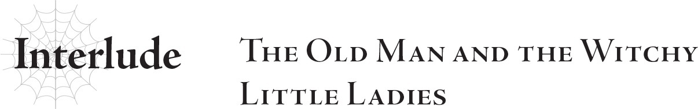

# Đoạn phụ: Lão già và những tiểu thư phù thủy
*(Interlude: The Old Man and the Witchy Little Ladies)*

“Thảảảm hại, thảảảm hại.”

…Tại sao trên đời này ta lại phải chịu sự chế giễu từ một nhóc tì sáu tay cưỡi nhện thế này hả?

Phù. Phải bình tĩnh lại đã.

Trước tiên, có lẽ ta nên hồi tưởng lại xem vì sao mình lại rơi vào hoàn cảnh này.

Tên ta là Ronandt.

Ta sinh ra ở... À không, thế thì ngược dòng thời gian xa quá rồi.

Nhưng tóm lại, ta có mặt tại khu rừng Elf này là do mệnh lệnh của Hoàng tử Hugo.

Dù trông ta thế này, ta vẫn là Trưởng pháp sư cung đình của Đế quốc, thế nên ta không thể từ chối mệnh lệnh của thái tử được.

Dù cho, nói giảm nói tránh nhất có thể, thì ta chẳng hề có chút hào hứng nào với viễn cảnh này...

Mà ai trách ta được chứ?

Chúng ta đang ở giai đoạn cao trào của cuộc chiến chống lại ma tộc, vậy mà đột nhiên lại đi tuyên chiến với tộc Elf rồi xua quân tấn công. Chuyện này hoàn toàn vô lý và chẳng có chút logic nào cả.

Chắc chắn phải có uẩn khúc gì đó đang diễn ra ở hậu trường.

Nhưng biết thế cũng chẳng có nghĩa là một mình ta có thể xoay chuyển được cục diện.

Người đời có thể ca tụng ta là ma pháp sư mạnh nhất nhân loại, nhưng vẫn có rất nhiều điều nằm ngoài tầm tay của ta.

Đó là lý do ta buộc phải lao mình vào cuộc chiến chống lại tộc Elf này theo như mệnh lệnh...

Nhưng ban đầu thì mọi chuyện vẫn rất ổn thỏa.

Ta được giao chỉ huy một cánh quân độc lập với Hoàng tử Hugo và được lệnh tiến quân theo một lộ trình khác.

Hiển nhiên, ta đã lợi dụng tình thế đó để vờ tiến quân một cách chậm rãi, thận trọng, nhằm trì hoãn cuộc hành quân càng nhiều càng tốt.

Bởi vì việc mạo hiểm mạng sống vì một trận chiến vô nghĩa như thế này quả thật ngu ngốc tột cùng.

Tuy nhiên, một khi đã chạm trán kẻ địch, chúng ta đương nhiên phải chiến đấu, và ta phải thừa nhận rằng có một phần trong ta luôn khao khát được thử giao chiến với tộc Elf một ngày nào đó.

Dù sao thì, truyền thuyết luôn đồn đại rằng tộc Elf vượt trội hơn tất cả các chủng tộc khác về mặt ma pháp.

Ta tuy là ma pháp sư mạnh nhất nhân tộc, nhưng người đời vẫn thường đem ta ra so sánh với tộc Elf, tự hỏi không biết ma pháp sư mạnh nhất của họ liệu có mạnh hơn ta hay không.

Đáng tiếc là ta chẳng biết ma pháp sư tộc Elf mạnh nhất là ai, và tộc Elf cũng hiếm khi sử dụng ma pháp trước mặt con người, khiến ta không có cách nào so sánh thực tế.

Liệu bản lĩnh ma pháp của ta có thể làm khó được tộc Elf không?

Ta phải thú thực là mình luôn tò mò về điều đó.

...Nhưng ta chưa từng ngờ rằng mình lại là bên nắm giữ lợi thế áp đảo tuyệt đối.

Tộc Elf vượt trội về ma pháp cái con khỉ mốc ấy.

Đến cả đòn ma pháp bắn tỉa của ta mà chúng cũng không thể đối phó nổi một cách tử tế!

Chết tiệt, đống đệ tử ngốc nghếch của ta còn làm tốt hơn thế này nhiều.

Thất vọng trước những lời đồn thổi vô căn cứ, ta đã ngốc nghếch trút cơn giận lên đầu bất kỳ binh lính Elf nào lọt vào tầm mắt.

Kết quả là khi ta kịp nhận ra, cánh quân của tụi ta đã tiến xa hơn cả tiểu đoàn của Hoàng tử Hugo.

Trời đất ơi, thật là sơ suất quá đi mà!

Giá mà ta biết sự bất cẩn đó sẽ dẫn mình đến đâu...

Đám Elf có thể là nỗi thất vọng lớn, nhưng rồi ta lại chạm trán một cỗ golem kim loại khổng lồ kỳ lạ chặn đường.

Thông thường, golem là quái vật hình người được làm từ đất đá, nhưng thứ đứng trước mặt ta lúc đó lại giống như một bộ giáp kim loại hơn.

Ta so sánh nó với golem vì thiếu một mô tả chuẩn xác hơn, chứ rõ ràng nó là một thứ hoàn toàn khác biệt.

Vì nó nằm trong phạm vi ranh giới của kết giới tộc Elf, nên chắc hẳn đây là sinh vật phục vụ cho họ chứ không phải quái vật hoang dã.

Chính khoảnh khắc ta cố gắng dùng Thẩm định lên nó, mọi thứ đã thay đổi.

`<Không thể Thẩm định>`

“Toàn quân, rút lui!”

Ngay giây phút nhìn thấy kết quả đó, ta lập tức ban lệnh rút quân.

Suốt cả cuộc đời ta, số lượng sinh vật mà ta không thể Thẩm định được chỉ đếm trên đầu ngón tay.

Quả thực, với kỹ năng Thẩm định đã đạt cấp 10, việc có bất kỳ thứ gì chống lại được Thẩm định của ta là điều cực kỳ kỳ lạ.

Có lẽ vì thế, khi ta không thể Thẩm định một thứ gì đó, ta buộc phải giả định rằng nó mạnh hơn rất nhiều so với những gì ta có thể đối phó.

Như để xác thực cho nỗi sợ hãi của ta, cỗ golem kim loại chĩa một thứ hình thù giống ống tẩu kỳ lạ về phía ta và bắn ra thứ gì đó.

Ta chỉ kịp né tránh trong gang tấc nhờ đã đề phòng ở mức cao nhất.

Dù vậy, sóng xung kích từ nó vẫn hất văng ta sang một bên.

Nhưng những binh lính ngay sau lưng ta thì không được may mắn như thế.

Họ bị thổi bay, máu phun tung tóe khắp nơi.

Cảnh tượng trông giống như họ vừa phát nổ theo đúng nghĩa đen.

Chân tay bay tư tung, những cái lỗ lớn hoác bị khoét sâu trên thân người họ.

Mỗi khi một trong những vật thể bí ẩn mà ta thậm chí không thể nhìn thấy bằng mắt thường lướt qua, lại có thêm nhiều thuộc hạ của ta phải bỏ mạng một cách thê thảm.

Ta lập tức bắn ma pháp vào cỗ golem kim loại.

Hoàn toàn không nương tay dẫu chỉ một chút.

Nhưng cỗ golem kim loại dễ dàng né tránh mũi tên lửa của ta.

Hừm. Đúng như ta lo ngại.

Quả nhiên, cỗ golem kim loại quá mạnh để có thể đánh bại bằng các phương thức thông thường.

Trong số chúng ta, chỉ có ta mới có cơ may chống cự.

Xem ra ta chỉ còn cách ở lại bọc hậu và câu giờ cho binh lính của mình chạy trốn.

Ta bắt đầu kiến tạo ma pháp.

Suốt cuộc đời mình, ta đã luôn mài giũa các nền tảng ma pháp đến giới hạn cao nhất có thể, đặc biệt là sau khi diện kiến vị sư phụ đó.

Những kiến thức nền tảng này cũng chính là bí kỹ của ta.

Ta tạo ra mười mũi tên lửa.

Từng mũi tên lao đi với tốc độ tối đa, hoàn toàn dưới sự điều khiển của ta.

Nhưng cỗ golem kim loại né được hơn phân nửa trong số đó.

Và ngay cả những mũi tên bắn trúng dường như cũng chẳng hề gây ra mấy sát thương.

Có lẽ nó sở hữu chỉ số phòng ngự rất cao, đúng như vẻ ngoài bọc giáp của mình.

Nó còn có cả khả năng di chuyển tốc độ cao, cùng với những đòn tấn công tầm xa bí ẩn kia nữa.

Dù thứ này là gì đi nữa, nó thực sự rất mạnh.

Đủ mạnh để khiến ta nhớ lại những con Địa Long ở Mê cung Lớn Elroe.

Một cơn lạnh sống lưng chạy dọc sống lưng ta.

Nhưng ít nhất, bằng việc dội ma pháp liên tục lên nó, ta đã câu được chút ít thời gian.

Các thuộc hạ còn sống sót của ta đều đã bắt đầu tháo chạy.

Nhưng với tốc độ của cỗ golem kim loại này, việc đuổi kịp họ là quá đỗi dễ dàng.

Chỉ câu giờ thôi thì không đủ.

Ta phải hủy hoại được ít nhất một chân của nó, dù có phải đánh đổi bằng mạng sống.

Ta dùng [Dịch chuyển], đáp xuống ngay phía sau cỗ golem kim loại.

Ngay lập tức, ta thi triển ma pháp.

Lớp băng đóng cứng chân của cỗ golem.

Sau đó ta dùng Phong ma pháp để bồi thêm một đòn.

Bàn chân kim loại bị đông cứng nứt toác ra một nửa.

Chỉ một nửa.

Nhưng dù thế, cũng đã là một nửa rồi.

Chừng đó đáng lẽ phải làm giảm khả năng cơ động của nó đi đáng kể.

Cỗ golem kim loại vung ngược cánh tay ra sau theo một hướng phi tự nhiên, đi ngược lại hoàn toàn cấu trúc khớp xương thông thường.

Ta sững người mất một giây, rồi lập tức nhào người sang bên cạnh né tránh.

Sinh vật này vốn không phải là một thực thể sống bình thường, nên hiển nhiên nó có thể xoay chuyển các khớp nối tùy ý muốn.

Nhưng ta đã không hiểu được điều đó cho tới khi tự mình tận mắt chứng kiến.

Và cái giá phải trả là cánh tay phải cùng cả hai chân của ta.

Ta đã không né tránh kịp thời.

Nhưng ta không đời nào chịu gục ngã mà không phản kháng.

Nghiến răng chịu đựng cơn đau buốt, ta kiến tạo một phép thuật khác.

Ta đã kịp hoàn thành nó trước khi cỗ golem kim loại kịp chĩa cái ống kỳ lạ kia về phía ta lần nữa.

Hỏa Ngục ma pháp cấp 4: [Ảo Ảnh Nhiệt].

Một quả cầu lửa nhỏ xuất hiện, kích thước không lớn hơn nắm tay của ta.

Nó lao vút đi, đánh thẳng vào cơ thể cỗ golem kim loại.

Hiệu ứng chỉ diễn ra trong tích tắc.

Nhưng trong tích tắc đó, ngọn lửa đã thiêu rụi mọi thứ.

[Ảo Ảnh Nhiệt] là phép thuật nén toàn bộ uy lực của một trận hỏa hoạn khổng lồ vào trong một đốm lửa nhỏ.

Ma pháp hệ hỏa là sở trường của ta, và đây là phép thuật lửa mạnh nhất mà ta có thể thi triển.

Đến cả cỗ golem kim loại cũng không thể chống đỡ nổi trước [Ảo Ảnh Nhiệt]: lớp khung giáp cứng cáp của nó bốc cháy, nóng chảy và bị hủy diệt hoàn toàn.

Diệt được ngươi rồi.

Ta nở một nụ cười đắc thắng, nhưng biểu cảm đó nhanh chóng đông cứng ngay khoảnh khắc tiếp theo.

Ở phía không xa, ta có thể thấy thêm vài cỗ golem kim loại tương tự đang tiến lại gần.

...Xem ra, hành trình của ta đến đây là kết thúc rồi.

Ngay khi ta bắt đầu từ bỏ hy vọng, bốn chiếc bóng bất ngờ từ trên trời lao xuống tấn công lũ golem kim loại.

Chúng tiêu diệt toàn bộ đống golem chỉ trong vài giây ngắn ngủi.

Rồi một trong số đó quay đầu nhìn về phía ta.

Trước sự ngạc nhiên tột độ của ta, đó hóa ra là một cô bé nhỏ nhắn đang cưỡi trên lưng một con nhện.

“Thảảảm hại, thảảảm hại.”

Và rồi con bé bắt đầu chế giễu ta...

Hừm.

Không, dù ta có xâu chuỗi lại mọi chuyện từ đầu thì nó vẫn vô lý hết sức!

Ta giả định rằng lũ golem kim loại kia là quái vật hoặc thứ gì đó phục vụ cho tộc Elf, nhưng còn những cô bé này rốt cuộc là cái quái gì chứ?

Dựa vào việc họ có tới sáu cánh tay, ta đoán chắc chắn họ không phải là con người.

Để thử nghiệm, ta dùng Thẩm định lên cô bé ngay trước mặt mình.

Kết quả hiển thị cho ta biết họ thuộc chủng tộc gọi là Nhện Rối (puppet taratect).

Vậy ra, đúng như ta nghĩ, họ là quái vật.

Taratect là một chủng tộc quái vật nhện vô cùng nổi tiếng.

Điều đó giải thích tại sao họ lại cưỡi những con nhện khổng lồ làm thú cưỡi.

Nhưng điều kỳ lạ hơn nữa là cô bé này lại có một cái tên riêng: Fiel.

Quái vật có tên (Named Monster)...

Chúng được đồn đại là những sinh vật cực kỳ quý hiếm, chỉ phụng sự dưới trướng của những con quái vật hùng mạnh nhất.

Dù sao thì, vì sở hữu tên riêng, chắc hẳn cái tên đó phải được ban cho bởi một thực thể cấp cao hơn.

Tuy nhiên, Fiel này lại có chỉ số cao gấp vài lần so với con Địa Long ta từng đối đầu trước đây, sinh vật mà ta thậm chí không thể để lại nổi một vết xước trên người nó.

Lũ golem kim loại kia trông cũng mạnh ngang ngửa con Địa Long đó, vậy mà sinh vật tên “Fiel” này rõ ràng còn mạnh hơn thế rất nhiều.

Và một con quái vật mạnh mẽ như thế lại đang phụng sự một thực thể còn vĩ đại hơn sao?

Vậy thì thực thể đó phải sở hữu sức mạnh kinh hoàng tới mức nào chứ...?

Trong đầu ta chỉ có thể nghĩ đến duy nhất một cái tên.

Con quái vật nhện huyền thoại được biết đến với danh xưng Cơn Ác Mộng của Mê cung, kẻ từng cho ta thấy bản thân mình thực sự thiếu hiểu biết về thế giới này đến nhường nào.

Và đây cũng là những con quái vật thuộc họ nhện.

Sự trùng hợp này quả thật quá đỗi kỳ lạ.

Chẳng lẽ điều đó là sự thật sao...?

Nhân vật tên “Fiel” này đang dán chặt mắt vào ta.

Đôi mắt con bé lạnh lùng và vô hồn một cách kỳ quặc, hoàn toàn không thể đoán biết được tâm tư.

Con bé có thể đã tiêu diệt lũ golem kim loại kia thật, nhưng chẳng có gì đảm bảo nó là đồng minh của ta cả.

Chưa kể, ta vừa mới dùng Thẩm định lên con bé, hành động đó hoàn toàn có thể bị coi là một sự khiêu khích thù địch.

Ta sẽ chẳng có tư cách gì để oán than nếu con bé chém bay đầu ta ngay tại chỗ.

...Dù cho con bé mới là kẻ mở miệng xúc phạm ta trước.

Trong lúc ta đang nín thở chờ đợi, một cô bé khác trong nhóm đột ngột vỗ nhẹ vào vai “Fiel”.

Rồi cô bé đó lắc đầu.

...Dù cô bé không hề mở miệng nói lời nào, nhưng cử chỉ đó rõ ràng là một sự nhắc nhở mang tính khiển trách kiểu như “đừng nói thế, dù đó có là sự thật đi nữa...”.

“...Lããão già?”

Sau sự can thiệp của cô bé kia, Fiel dường như đã sửa lại danh hiệu dành cho ta.

Nó chắc chắn nghe nhẹ nhàng hơn từ “thảảảm hại” rất nhiều, nhưng chẳng phải đó vẫn chỉ là sự đánh giá dựa trên ngoại hình già nua của ta sao?

“Thảảảm hại... lããão già... Thả-già!”

“Ngươi ghép chúng lại với nhau luôn đấy hả?! Thế không phải còn tệ hơn sao?!”

...Ôi trời đất ơi. Trái tim già nua của ta sắp tan vỡ đến nơi rồi đây này.

Tại sao ta lại bị một cô bé mới gặp mặt lần đầu chế giễu chứ, dẫu cho con bé thực chất là một con quái vật, rồi lại được an ủi bằng một từ mang tính sỉ nhục còn tệ hơn gấp bội?

Ta đã làm gì nên tội để phải gánh chịu nông nỗi này cơ chứ?

Đúng lúc đó, cây cối rẽ lối, và thậm chí còn có nhiều cỗ golem kim loại hơn lúc trước xuất hiện.

“Hự!”

Ta lập tức gượng dậy.

Suốt thời gian qua, ta đã liên tục thi triển [Ma pháp Trị liệu] để chữa lành những vết thương vừa gặp phải.

Chỉ một cỗ golem kim loại thôi đã đủ khiến ta chật vật lắm rồi, nhưng ta từ chối nằm một chỗ chờ chết trên mặt đất.

Lão già này cũng có lòng tự tôn của riêng mình chứ bộ!

“Thả-già...”

...Cô bé “Fiel” nói với ta bằng một giọng điệu dường như muốn bảo “đừng có cố quá”.

“Aaargh! Ta không phải là 'Thả-già', khốn khiếếếếp thật chứ!”

Đã bảo là ta có lòng tự trọng của riêng mình cơ mà!!

Ta bắt đầu kiến tạo ma pháp.

Hỏa Ngục ma pháp cấp 1: [Tiêu Thổ]!

Đây là một phép thuật tấn công diện rộng bao phủ mặt đất trong biển lửa.

Tuy nhiên, dù phạm vi ảnh hưởng của nó lớn hơn, uy lực lại không thể so bì với phép thuật cấp 4 [Ảo Ảnh Nhiệt].

Chừng này là không đủ để tung ra đòn chí mạng kết liễu lũ golem.

Nhưng ta mới chỉ bắt đầu thôi!

Tiếp theo, ta lập tức chuẩn bị phép thuật thứ hai!

Lần này là ma pháp Sương Giá cấp 1: [Đông Thổ]!

Đây là một phép tấn công diện rộng đóng băng mặt đất.

Chuyện gì sẽ xảy ra nếu ngươi bất ngờ nung nóng một đám golem kim loại bằng ma pháp Hỏa Ngục, rồi lập tức giáng xuống ma pháp Sương Giá để hạ nhiệt độ theo hướng ngược lại một cách đột ngột?

Khi một vật thể bị nung nóng cực độ rồi ngay lập tức bị làm lạnh siêu tốc, nó sẽ trở nên vô cùng giòn và dễ vỡ.

Chúng có thể chịu đựng được [Tiêu Thổ], nhưng không thể chống đỡ nổi trước [Đông Thổ] ngay sau đó.

Những vết nứt bắt đầu xuất hiện trên lớp giáp của lũ robot, và rồi chúng vỡ vụn ra thành từng mảnh.

“Hyooo-ho-ho-sho! Thế nào hả?! Có thấy chưa?!”

Ta ưỡn ngực đầy tự hào trước mặt các cô bé.

Thành thật mà nói, việc thi triển ma pháp cấp độ này hai lần liên tiếp là một thử thách khó khăn ngay cả đối với ta; đầu óc ta đau như búa bổ vì bị đẩy tới giới hạn, và lượng MP sụt giảm đột ngột khiến ta xây xẩm mặt mày.

Nhưng thỉnh thoảng, đấng nam nhi cũng phải thể hiện chút kiêu hãnh chứ!

“Oooh!”

Fiel vỗ tay tán thưởng bằng cả sáu cánh tay của mình.

Hừm. Xem ra ta đã chứng minh được mình rốt cuộc không phải kẻ thảảảm hại rồi nhé.

“Thả-già!”

“Ta đã bảo là ta không phải 'Thả-già' rồi mà! Hãy nhớ cho kỹ, ta có cái tên rất oai phong lẫm liệt đấy nhé. Là Ronandt!”

Ba cô bé còn lại im lặng đứng nhìn ta tương tác với “Fiel”.

Dưới ánh mắt của họ, ta bỗng nhiên có cảm giác len lỏi rằng bản thân mình trông chẳng được trưởng thành cho lắm.

Nhưng ta lập tức quên sạch nỗi xấu hổ đó khi Fiel lại bắt đầu trêu chọc ta lần nữa.

“Thảảảm hại?”

“Sao tự nhiên lại quay về cái từ đó nữa rồi?!”

Để mọi chuyện tồi tệ hơn, thậm chí còn có nhiều cỗ golem kim loại hơn đang tiến lại gần, có lẽ là bị thu hút bởi tiếng hét của ta.

Các tiểu thư nhỏ chuẩn bị vũ khí sẵn sàng chiến đấu với đám golem.

Cứ như thể họ đã hoàn toàn quên mất sự tồn tại của ta rồi vậy.

Lúc này, ta hầu như chẳng còn lại chút MP nào sau trận chiến phô diễn khi nãy.

Việc đối đầu với thêm bất kỳ cỗ golem nào nữa sẽ vô cùng nan giải.

Nếu những cô bé kia cũng mạnh như nhóc “Fiel” này, họ chắc chắn có thể tự lực đánh bại đám golem kim loại mà không cần ta giúp sức.

Nhưng chẳng lẽ ta lại chịu từ bỏ lúc này sao?

Chẳng lẽ ta lại rút lui một cách vô liêm sỉ sau khi bị gọi là kẻ “thảảảm hại” à?

“Yaargh! Cứ chờ đó mà xem! Ta sẽ chứng tỏ cho các ngươi thấy ai mới là kẻ thảảảm hại!”

Ta đã bảo là ta có lòng tự tôn của riêng mình mà!!

Ngay cả khi không thể sử dụng những chiêu thức lớn như thế nữa, ít nhất ta vẫn có thể hỗ trợ cho các cô bé này!

Ta sẽ chứng minh cho họ thấy ta tuyệt đối không phải kẻ thua cuộc!

...Hửm? Mà khoan đã, ban đầu ta tới đây để làm cái gì ấy nhỉ?

---

[◀ Chương trước: Chương 6: Quyết chiến: Cuộc chạm trán tình cờ](21_ch6_showdown_chance_meeting.md) | [Chương tiếp theo: Lãnh chúa cô độc ▶](23_l6_the_lord_alone.md)
