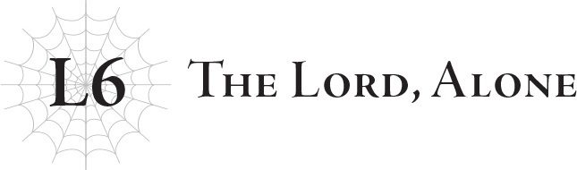
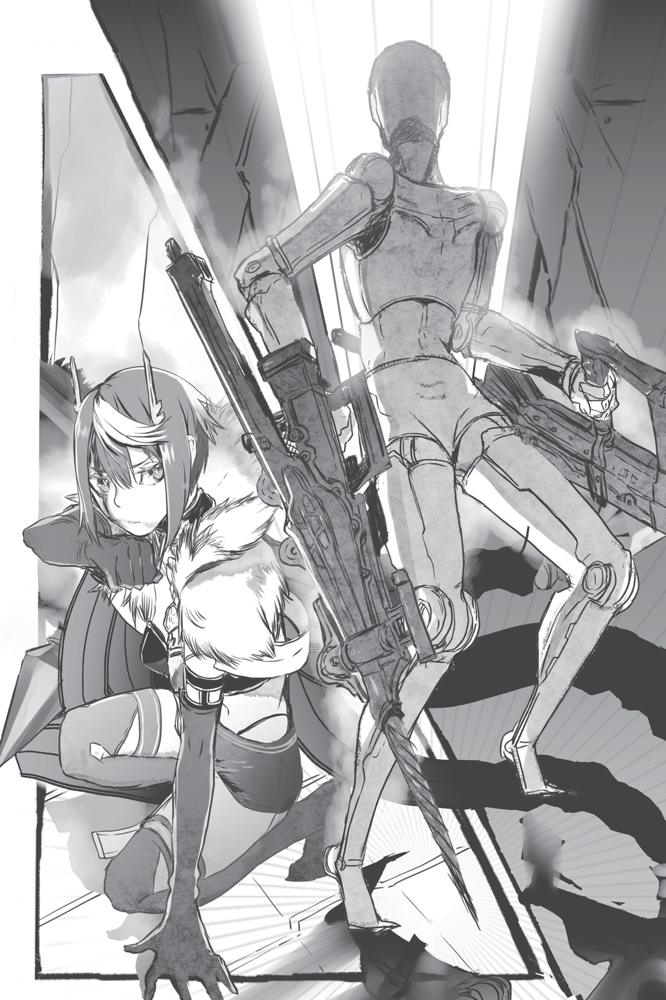

# Lãnh chúa cô độc
*(The Lord Alone)*

“...Tôi cần nói chuyện với Sariel.”

Ngày hôm đó, Gülie ghé thăm với biểu cảm nghiêm trọng đến đáng sợ.

Nghĩ lại thì, đó chính là ngày cuộc sống yên bình của chúng tôi bắt đầu sụp đổ.

“...Có khi nào cuối cùng anh ấy cũng chuẩn bị tỏ tình không?”

“Tớ thấy biểu cảm đó không giống như đang có tâm trạng ấy cho lắm...”

Một cô bé hào hứng có đôi tai hơi nhọn đang trò chuyện với một cậu nhóc da xanh lá. Cả hai đều lo lắng nhìn về phía căn phòng nơi ngài Sariel và Gülie đang thảo luận riêng tư.

Tôi vẫn không biết họ đã nói gì ở bên trong, vì đứng từ ngoài cửa chúng tôi không nghe thấy gì cả.

Nhưng tôi nghĩ mình có thể đoán được chủ đề của nó.

Bởi vì ngay khi hai người họ đang nói chuyện, một tin tức đột ngột ập đến.

“Chúng tôi xin tạm dừng chương trình để phát một bản tin khẩn cấp.”

Giọng nói phát ra từ chiếc tivi vẫn đang mở.

“Rồng tộc đã phát động tấn công.”

Người dẫn chương trình phát thanh truyền hình đọc bản tin với vẻ bối rối rõ rệt.

Bản tin đó quá ngắn, quá thiếu thông tin để có thể coi là một bản tin thời sự đúng nghĩa.

Nhưng đó chỉ là vấn đề tạm thời, bởi vì ngay khi những hình ảnh trực tiếp từ hiện trường được truyền về sau đó ít phút, mọi khoảng trống thông tin đều được lấp đầy.

Chỉ cần liếc nhìn một cái là đủ để hiểu chính xác chuyện gì đang xảy ra.

Dù chúng tôi có muốn hay không.

Đoạn phim quay rất rung và mờ, có lẽ được ghi lại bằng điện thoại di động.

Nó cho thấy tàn tích của một thành phố lớn từng tồn tại.

Các tòa nhà đổ nát hoang tàn, những chiếc xe hơi bay lơ lửng giữa không trung như những chiếc lá khô trước gió, và các tuyến đường cao tốc trên cao đổ sập hoàn toàn.

Giữa đống đổ nát hoang tàn đó, con người nhỏ bé đến mức thậm chí không thể nhìn thấy bằng mắt thường.

Nhưng thứ hiện lên rõ mồn một đến nhức nhối, đang bay trên bầu trời và dẫm đạp dưới mặt đất, chính là quân đoàn rồng.

Rồi đoạn phim đột ngột rung lắc dữ dội và bị cắt đứt hoàn toàn.

“Không thể nào...”

Trong lúc chúng tôi đang nhìn chăm chăm vào màn hình với vẻ kinh hoàng tột độ, Gülie tiến lại từ phía sau và đứng sững lại.

Ngài Sariel cũng đang đứng cạnh anh ấy.

Không nói một lời, cô xoay người bước ra phía cửa.

“Sariel! Cô đi đâu thế...?”

“Ta phải đi.”

Đó là một cuộc đối thoại ngắn ngủi.

Thế nhưng, chừng đó có vẻ là đủ để Gülie hiểu chính xác ngài Sariel định đi đâu.

Vào thời điểm đó, tôi vẫn còn quá sốc trước đoạn phim trên tivi nên không thể hiểu hết những gì đang diễn ra, cũng như ý nghĩa cuộc đối thoại giữa Gülie và ngài Sariel.

Những hình ảnh đó có vẻ quá xa rời thực tế để tôi có thể hoàn toàn chấp nhận rằng nó thực sự đang diễn ra.

“Sari—”

“Xin đừng cố gắng ngăn cản ta. Ta không muốn phải coi anh là kẻ thù.”

“......”

Bàn tay Gülie đang giơ ra định giữ ngài Sariel lại bỗng khựng lại giữa không trung trước câu trả lời của cô.

Cứ như thế, ngài Sariel bước ra khỏi cô nhi viện.

“...Cô ấy không nghĩ là mình sẽ bắt con tin sao? Cô ấy thực sự... tin tưởng mình đến thế sao?”

Gülie ngồi sụp xuống ghế, hai vai buông thõng xuống.

Bản tin thời sự căng thẳng vẫn tiếp tục được phát sóng trên màn hình tivi.

Ngài Sariel đã không quay trở lại.

Tất cả các kênh truyền hình đều không chiếu gì khác ngoài tin tức, đưa tin liên tục về rồng tộc.

Ngay cả các phương tiện truyền thông đại chúng cũng không có vẻ thu thập được thông tin toàn diện; các thông tin vô cùng hỗn loạn và rất khó để phân biệt thật giả.

Đoạn phim phát trực tiếp ở đầu bản tin dường như là tất cả những gì họ có từ hiện trường vụ tấn công, và họ chỉ có được nó vì tình cờ có một phóng viên đang có mặt tại đó.

Tung tích của người phóng viên đó hiện không rõ.

Với tình hình hiện tại, cơ hội sống sót là vô cùng mong manh.

Gülie ở lại cô nhi viện kể từ ngày hôm đó.

Lúc ấy, tôi không hiểu tại sao Gülie lại nghỉ đêm ở đây.

Nhưng nghĩ lại thì, tôi đoán anh ấy đang cố gắng giúp ích cho ngài Sariel.

By bảo vệ cô nhi viện, nơi vô cùng quý giá đối với cô.

Hành động đó chắc chắn là một sự phản bội đối với rồng tộc.

Tôi chắc chắn đây là một quyết định vô cùng nghiêm trọng đối với Gülie, nhưng anh ấy vẫn dịu dàng với chúng tôi, cố gắng giúp chúng tôi quên đi những lo lắng trong lúc chờ đợi ngài Sariel quay về.

Một ngày, hai ngày, một tuần, một tháng...

Chúng tôi mòn mỏi đợi chờ ngài Sariel trở lại.

Tất cả những đứa trẻ khác ở cô nhi viện đều đã quay về.

Ngay cả cậu bạn đã trở thành idol cũng nhất quyết xin nghỉ phép để trở về nhà.

“Giờ không phải là lúc để giải trí. Đằng này cũng hầu như chẳng có việc gì mấy, nên xin nghỉ phép dễ ợt.”

Tôi không biết bao nhiêu phần trong lời nói đó là sự thật, nhưng rõ ràng cậu ấy quay lại cô nhi viện vì lo lắng cho chúng tôi.

Tuy vậy, tất cả những gì chúng tôi có thể làm là hy vọng và cầu nguyện cho ngài Sariel bình an trở về.

Nhưng...

Ngài Sariel đã không bao giờ quay lại cô nhi viện nữa...

Không lâu sau đó, rồng tộc đã dừng cuộc tấn công của họ.

Tôi chỉ biết được từ tin tức rằng ngài Sariel đã chiến đấu chống lại rồng tộc và đánh đuổi được họ đi.

Có cả thước phim ghi lại trận chiến của họ trên bản tin, dù tôi không biết làm thế nào họ quay lại được.

Đoạn video ngắn đó là bản ghi duy nhất, nhưng nó được chiếu đi chiếu lại liên tục trên tivi, kèm theo những lời bình luận ca ngợi ngài Sariel.

Một số người nghi ngờ liệu đoạn phim có bị cắt ghép chỉnh sửa hay không, nhưng dù thế nào đi nữa, sự thật vẫn là mối đe dọa không thể vượt qua của rồng tộc đã bị đẩy lui, và chắc chắn đó không phải là công lao của loài người.

Nhiều chính phủ cũng chính thức công nhận chiến tích của ngài Sariel, giúp giảm thiểu đáng kể số lượng những kẻ phản đối.

Thế nhưng, sự nhẹ nhõm khi thoát khỏi cơn giận dữ của rồng tộc không kéo dài được bao lâu.

Bởi vì vào khoảng thời gian các cuộc tấn công của họ lắng xuống, các hiện tượng thời tiết cực đoan bắt đầu xảy ra trên khắp thế giới.

Tôi không biết liệu "thời tiết cực đoan" có phải là cụm từ chính xác để mô tả hay không, vì những thay đổi này quá khủng khiếp để có thể tóm gọn trong một cụm từ đơn giản như vậy.

Mặt đất nứt toác, các đại dương bắt đầu cạn kiệt, và bầu trời mất đi sắc xanh.

Cứ như thể thế giới đang đi đến hồi kết.

Và thực sự, đó chính là sự khởi đầu của ngày tàn.

“Tổng thống Dustin của Daztrudia chuẩn bị bắt đầu cuộc họp báo. Chúng tôi xin chuyển sang phát sóng trực tiếp từ hiện trường.”

“Xin chào các công dân. Không dài dòng nữa, trước hết chúng ta hãy thảo luận về những thông tin thu thập được từ cuộc tấn công của rồng tộc. Các quốc gia và vùng lãnh thổ bị tấn công trải dài trên một phạm vi rộng lớn đến mức tôi không thể liệt kê hết tên của họ lúc này. Quân đội của nước ta đã được phái đến các địa điểm bị tấn công, nhưng chúng ta vẫn chưa nắm bắt được toàn bộ số lượng thương vong. Chúng tôi cũng đã cố gắng do thám lãnh thổ của rồng tộc để đánh giá thực lực của họ, nhưng không thấy bóng dáng loài rồng đâu nữa. Thuộc cấp của tôi hiện đang điều tra xem họ đã biến mất đi đâu; tuy nhiên, đã có báo cáo từ các nhân chứng tại hiện trường về việc những vệt sáng biến mất vào khoảng không vũ trụ xa xôi. Giả thuyết hiện tại của chúng tôi là rồng tộc đã bay vào vũ trụ tĩnh lặng.

“Xin hãy trật tự! Về lý do rồng tộc tấn công, có thể giả định một cách an toàn rằng đó là vì chúng ta đã không để tâm đến những cảnh báo lặp đi lặp lại của họ về việc sử dụng năng lượng MA. Loài rồng liên tục thông báo với chúng ta rằng năng lượng MA chính là nguồn sinh mệnh của hành tinh mà chúng ta đang sống, và việc vắt kiệt nó sẽ làm hành tinh suy yếu. Do đó, họ đã nhiều lần yêu cầu chúng ta ngừng sử dụng năng lượng MA, nhưng như tất cả chúng ta đều biết, many quốc gia đã từ chối và tiếp tục ủng hộ việc sử dụng nó.

“Trật tự! Tôi không cố gắng đổ lỗi cho bất kỳ quốc gia cụ thể nào! Tôi chỉ đơn giản là chia sẻ những thông tin chúng tôi biết! Đúng vậy, đó là sự thật! Lý do cho những bất thường xảy ra kể từ khi loài rồng rời đi là do hành tinh đang yếu dần... Không, nó đang tiến thẳng tới bờ vực hủy diệt!”

Phần còn lại của cuộc họp báo của Tổng thống Dustin thuộc quốc gia Daztrudia rơi vào hỗn loạn.

Mọi người la ó và chế giễu, một số phóng viên thậm chí cố gắng tiến lại gần tổng thống để chất vấn dồn dập, buộc các nhân viên an ninh phải ngăn chặn họ, biến phòng họp báo thành một bãi chiến trường.

Đoạn phim kết thúc đột ngột với cảnh vị tổng thống được hộ tống ra ngoài bởi các vệ sĩ của mình.

Tôi đoán hầu hết mọi người không thể chấp nhận những gì ông ấy nói tại cuộc họp báo đó.

Suy cho cùng, nhiều quốc gia đã hoàn toàn phụ thuộc vào năng lượng MA.

Có một số ngoại lệ như quốc gia Daztrudia của Tổng thống Dustin, nhưng ngay cả họ cũng không thể kiểm soát hoàn toàn việc sử dụng năng lượng MA bất hợp pháp trong phạm vi biên giới của mình.

Chưa kể đến việc các quốc gia cấm sử dụng năng lượng MA vẫn không thể dừng giao thương với các quốc gia sử dụng nó.

Các sản phẩm mà họ nhập khẩu đều được sản xuất bằng năng lượng MA.

Nói cách khác, mọi quốc gia đều được hưởng lợi từ năng lượng MA bằng cách này hay cách khác.

Cô nhi viện của chúng tôi tuy được xây dựng ở Daztrudia, nơi cấm sử dụng năng lượng MA, nhưng tôi chắc chắn chúng tôi vẫn được hưởng lợi từ nó theo một cách nhỏ nào đó thông qua các sản phẩm nhập khẩu và những thứ tương tự.

Rồng tộc không hề đột nhiên trở nên hung dữ.

Tất cả là do lỗi của nhân loại ngay từ đầu.

Nhưng rất ít con người sẵn sàng thừa nhận điều đó.

Các quốc gia khác liên tục tổ chức họp báo chỉ để khẳng định rằng tuyên bố của Tổng thống Dustin là vô lý, hoặc cố gắng đổ lỗi cho các quốc gia khác hoặc cho loài rồng nói chung.

Nhưng dù họ có thừa nhận hay không, họ vẫn không thể ngăn cản thế giới tiến về phía hủy diệt.

Ngay cả khi con người cố gắng phớt lờ thực tế hay chỉ tay đổ lỗi cho nhau, ngày tàn của thế giới vẫn đang cận kề theo từng giây.

Thế giới ngày càng trở nên kém an toàn hơn.

Không, tôi nghĩ nói thế vẫn còn là giảm nhẹ mức độ.

Khi nhận ra thế giới sắp kết thúc, hành vi của hầu hết mọi người đã thay đổi chóng mặt.

Rất nhiều người trong số họ quyết định dùng chút thời gian ít ỏi còn lại để làm bất cứ điều gì họ thích, và thế giới về cơ bản đã trở thành một nơi vô pháp luật.

Bạo loạn, hành hung, trộm cắp, tự sát...

Ngay cả cảnh sát, những người đáng lẽ phải ngăn chặn những việc đó, cũng thường xuyên tham gia vào sự hỗn loạn này.

Tình hình xung quanh cô nhi viện cũng không hề yên ả.

Khi có chuyện tồi tệ xảy ra, rõ ràng bản tính của con người là muốn đổ lỗi cho kẻ khác để trút giận lên đầu họ.

Và kết quả là, các chimera của cô nhi viện đã trở thành những tấm bia nhắm hoàn hảo.

“Tất cả là tại tụi nó!” “Nếu không vì lũ quái thai đó...”

Chẳng hề có bất kỳ logic thực tế nào đằng sau những lời đó cả.

Chỉ là vì chúng tôi khác biệt với họ, và thế là đủ để coi chúng tôi là điềm gở, và biện minh cho các hành vi bạo lực nhắm vào chúng tôi.

May mắn thay, chúng tôi không phải đối mặt với những đám đông khổng lồ lập thành các băng nhóm bạo lực đến săn lùng mình.

Nhưng người ta vẫn ném đá vào chúng tôi, hoặc thậm chí bắn súng vào chúng tôi trong vài lần.

Tôi đoán họ không tấn công chúng tôi trực tiếp vì họ vẫn có phần e sợ các chimera như chúng tôi, và cũng vì sự hiện diện của ngài Sariel.

Ai cũng biết ngài Sariel đã đánh đuổi rồng tộc đi, và tất cả cư dân sống gần đó đều biết ngài Sariel là người quản lý cô nhi viện này.

Thế nên những người tốt biết ơn ngài Sariel sẽ không bao giờ nghĩ đến việc động vào cô nhi viện.

Tôi đoán việc chúng tôi vẫn bị bắn là bằng chứng cho thấy không phải ai trên thế giới cũng là người tốt.

Thông thường, chúng tôi sẽ trông cậy vào Gülie để bảo vệ mình vào những lúc như vậy, nhưng đáng tiếc là anh ấy đã biến mất không lâu sau khi tin tức ngài Sariel ngăn chặn cuộc tấn công của loài rồng được phát đi.

Lúc đó, tôi đã hờn dỗi rằng anh ấy không có mặt vào lúc chúng tôi cần anh ấy nhất, nhưng sau đó tôi mới biết rằng khi ấy anh đang tuyệt vọng tìm cách cứu ngài Sariel.

Có quá nhiều thứ mà tôi chỉ biết được sau khi mọi chuyện đã rồi.

Vào những ngày đó, tôi luôn thật bất lực, thật ngu muội, chẳng khác nào một gánh nặng...

Dù sao đi nữa, chúng tôi không thể dựa vào Gülie để tự cứu lấy mình.

Chúng tôi đóng chặt cửa cô nhi viện và chật vật sống sót, nhưng chúng tôi cũng đã thảo luận về các chiến lược cho kịch bản tồi tệ nhất.

Ý định của chúng tôi chỉ là cố gắng chạy trốn chứ không phải chiến đấu với bất kỳ ai.

Ngoại trừ một vài ngoại lệ như tôi, hầu hết các chimera đều rất mạnh mẽ.

Ngay cả khi đối thủ có vũ khí, chúng tôi vẫn khá tự tin rằng mình có thể xông thẳng lên phía trước và thoát ra ngoài mà không hề sứt mẻ gì.

Chúng tôi thậm chí còn có một chiếc xe cơ giới cỡ lớn đủ chỗ cho tất cả mọi người, chiếc xe mà một người trong số chúng tôi đã lái về khi họ quay lại sau các cuộc tấn công của rồng.

Tôi đã cười nhạo chuyện đó vào lúc ấy, tự hỏi tại sao họ lại mang về một chiếc xe lố bịch như vậy làm gì, nhưng có lẽ họ đã dự báo trước được rằng chuyện như thế này có thể xảy ra.

Nói cách khác, họ có tầm nhìn xa trông rộng mà tôi thiếu sót.

Tôi vẫn nhớ mình đã cảm thấy xấu hổ thế nào vì thái độ cười nhạo trước đó của bản thân.

Những ngày tháng căng thẳng đến kỳ lạ đó tiếp diễn trong một thời gian.

Chúng tôi không biết khi nào thì mọi chuyện sẽ bùng nổ.

Đó có thể là một trong những cư dân gần đó, hoặc một người trong chúng tôi, hay có lẽ chính thế giới này sẽ là thứ ra đi đầu tiên.

Nhưng thay vào đó, một thứ khác đã thay đổi.

“Chúng ta sẽ đi gặp ngài Sariel.”

Một trong những đứa trẻ ở cô nhi viện, một cậu nhóc cũng ốm yếu gần như tôi, đột nhiên đưa ra tuyên bố đó.

Cậu ấy không thể ngủ được về mặt thể chất, điều đó có nghĩa là luôn có quầng thâm vĩnh viễn dưới mắt cậu, và toàn thân toát ra vẻ thiếu sức sống.

Nhưng có một chất bất thường nào đó được tiết ra trong não cậu ấy, khiến cậu không bao giờ có thể ngồi yên trừ khi đang làm việc gì đó.

Mặc dù cậu ấy luôn miệng tuyên bố rằng mình không muốn làm gì cả, nhưng về bản chất, cậu luôn phải làm một việc gì đó.

Cậu thường ru rú trong phòng tự mày mò làm việc này việc kia, nên việc cậu nói mình sẽ ra ngoài là chuyện vô cùng bất thường.

Trên thực tế, đây có lẽ là lần đầu tiên.

Thông thường mắt cậu ấy trông rất đờ đẫn, nhưng lần này chúng lại sáng rực lên.

Những người khác dường như cũng ngạc nhiên giống như tôi, và ngay sau đó, tất cả chúng tôi đều trèo lên chiếc xe lớn và xuất phát.

Vì thời gian vô cùng cấp bách, cậu ấy bảo sẽ giải thích trên đường đi.

Chúng tôi từng dự định sẽ dùng chiếc xe này để trốn thoát khi thời khắc đến, nhưng không có ai tấn công khi chúng tôi lái xe rời đi.

Có rất nhiều thời gian để trò chuyện trong suốt chuyến hành trình.

Daztrudia là một lục địa rộng lớn hoạt động như một quốc gia thống nhất.

Nó vô cùng khổng lồ, và mất rất nhiều thời gian để đi xuyên qua, điều đó nghĩa là chúng tôi càng có thêm nhiều thời gian để nói chuyện.

Nhưng thực tế, rất ít thời gian được dành cho việc giải thích.

Tài cả những gì cậu ấy nói với chúng tôi trên đường đi chỉ đơn giản là: “Ngài Sariel đang chuẩn bị hy sinh bản thân để cứu thế giới thoát khỏi hoàn cảnh hiện tại.”

Tất nhiên, cậu ấy cũng giải thích hành động và lý do của cô, cách cô định thực hiện điều đó, v.v., nhưng chuyện đó không quan trọng với những người còn lại trong chúng tôi.

Khi nghe tin ngài Sariel muốn hy sinh bản thân, đó là tất cả những gì chúng tôi cần biết.

Chúng tôi thậm chí hầu như không thắc mắc làm thế nào cậu ấy biết được những chuyện này.

Cậu ta lúc nào cũng làm mấy thứ kỳ quặc trong phòng mình, nên chúng tôi chỉ giả định rằng cậu ấy thu thập được thông tin này qua một số phương thức mờ ám như một sự mở rộng của việc đó.

Nhưng trong khi dành rất ít thời gian cho việc giải thích, cuộc trò chuyện diễn ra bên trong chiếc xe sau đó lại kéo dài lê thê.

“Chúng ta phải ngăn ngài Sariel lại.”

“Rồi sau đó chúng ta sẽ làm gì?”

Về mặt cảm xúc, tất cả chúng tôi đều có chung một suy nghĩ.

Chúng tôi không muốn ngài Sariel phải hy sinh bản thân.

Nhưng nếu cô không làm vậy, thế giới sẽ bị diệt vong.

“Cái gì, vậy ra cậu muốn hy sinh ngài Sariel chỉ để cậu có thể tiếp tục sống cuộc đời quý giá của mình sao?!”

“Tất nhiên là không! Nhưng chính ngài Sariel đã tự mình chọn con đường này mà, đúng không?! Chúng ta lấy quyền gì để ngăn cản cô ấy chứ, hả?!”

Đó là một sự hỗn loạn tột cùng.

Bản thân tôi vốn đã chấp nhận rằng mình không còn sống được bao lâu nữa.

Cái chết của tôi có thể đến sớm hơn dự kiến một chút, nhưng tôi đã chuẩn bị tinh thần cho việc đó.

...Nếu đó chỉ là chuyện của riêng tôi, thì đúng là vậy.

Tôi không quan tâm nếu mình phải chết đi.

Nhưng nếu tất cả những người khác ở cô nhi viện cũng phải chết theo thì sao?

Ngay cả khi có cách để ngăn chặn điều đó?

Tôi muốn những người khác được sống tiếp.

Và khi tôi nghĩ rằng ngài Sariel có lẽ cũng cảm thấy như vậy, well, việc ngăn cản cô có vẻ không phải là điều đúng đắn...

Nhưng dẫu vậy, việc chấp nhận ý tưởng cô hy sinh bản thân vì điều đó vẫn thật khó khăn...

Tôi nghĩ những người khác cũng có những suy nghĩ tương tự như tôi.

Đến cuối cùng, hoàn toàn không có câu trả lời nào là hoàn toàn đúng đắn.

Thế là các luồng ý kiến xung đột nhau gay gắt, không ai sai, nhưng cũng chẳng thể tìm được tiếng nói chung...

“Đủ rồi đấy lũ trẻ ranh! Đừng có mè nheo thảm hại như thế nữa!”

Cô viện trưởng dập tắt mọi chuyện bằng một tiếng hét lớn.

“Cãi cọ luyên thuyên với nhau thì giải quyết được cái gì chứ? Bất kể lũ nhóc các em có nói gì đi chăng nữa, tất cả vẫn phụ thuộc vào quyết định của ngài Sariel. Nếu có điều gì muốn nói với cô ấy, tốt nhất hãy đến nói thẳng trước mặt cô ấy!”

Cô ấy nói đúng, tất nhiên rồi.

Đến cuối cùng, chúng tôi vẫn chỉ là những đứa trẻ bất lực, và mọi cuộc tranh luận của chúng tôi chẳng thể tạo nên một chút khác biệt nào.

Lời khiển trách của cô viện trưởng đã chấm dứt cuộc chiến tranh cãi, và trong một khoảng thời gian sau đó, không gian trong xe im ắng đến phát sợ.

Nhưng chặng đường phía trước vẫn còn rất dài. Cuối cùng, chúng tôi không thể kìm lòng mà bắt đầu trò chuyện nhỏ nhẹ với nhau.

Từ những lời nói nhảm nhí lộn xộn cho đến những cuộc thảo luận sâu sắc về tương lai, tôi chắc chắn rằng chúng tôi đã nói về rất nhiều chuyện, nhưng tôi không thể nhớ rõ chi tiết nào cụ thể cả.

Khả năng cao là vì tâm trí tôi khi ấy đang quay cuồng với quá nhiều suy nghĩ để có thể hoàn toàn chú tâm.

Tôi cũng không nhớ chi tiết về những suy nghĩ đó.

Có lẽ chuyện đó cũng là tự nhiên vì chính bản thân tôi lúc bấy giờ cũng không thể tự lý giải được bất cứ điều gì.

Nhưng có duy nhất một ý nghĩ mà tôi nhớ rất rõ.

Cụ thể là, tôi phải trao cho ngài Sariel chiếc khăn tay thêu khi gặp cô ấy.

Hàng loạt rắc rối đã làm chậm trễ việc hoàn thành các chiếc khăn tay thêu của tôi, nhưng cuối cùng tôi đã cố gắng hoàn thành mỗi người một chiếc cho tất cả các thành viên trong cô nhi viện.

Tôi không biết chuyện gì sẽ xảy ra sau việc này, nhưng tôi có cảm giác rằng dù thế nào đi nữa, tôi cũng cần phải trao chiếc khăn tay cho ngài Sariel lần này, nếu không tôi sẽ không bao giờ còn cơ hội nào khác nữa.

Và linh tính đó đã chứng minh là hoàn toàn chính xác.

Cuối cùng, chúng tôi cũng đến được nơi về cơ bản là trung tâm của chính quyền Daztrudia: phủ tổng thống.

Không hiểu bằng cách nào đó, chúng tôi được cho vào trong một cách dễ dàng, dù cho công dân bình thường bị nghiêm cấm bước chân vào đây.

Cho đến tận bây giờ tôi vẫn không biết làm thế nào chúng tôi có được sự cho phép đó.

Nhưng lúc đó chúng tôi không hề thắc mắc gì cả, vì việc đó đồng nghĩa với việc chúng tôi có thể gặp ngài Sariel như mong muốn.

Vâng, chúng tôi đã gặp được ngài Sariel thành công.

“Ta rất vui vì thấy tất cả các con đều có vẻ khỏe mạnh.”

Đó là câu đầu tiên cô ấy nói với chúng tôi sau chừng ấy thời gian xa cách.

Đó là một câu nói hơi lệch tông, hoàn toàn không đoái hoài đến việc chúng tôi đã lo lắng nhiều như thế nào, nhưng lại vô cùng đặc trưng cho ngài Sariel.

Sau đó, chúng tôi trò chuyện với cô bao lâu tùy ý thời gian cho phép.

Chúng tôi đã cố gắng thuyết phục cô suy nghĩ lại về quyết định của mình.

Nhưng lập trường của ngài Sariel vô cùng kiên định.

“Đó là một phần sứ mệnh của ta.”

Đến cuối cùng, chúng tôi hoàn toàn không thể làm cô thay đổi ý định. Bất kể chúng tôi có nói gì đi nữa, cô luôn dập tắt hy vọng của chúng tôi bằng chính câu nói đó.

Khi nhận ra không thể nào khuyên can được nữa, cuộc trò chuyện đương nhiên chuyển hướng sang việc ôn lại những kỷ niệm cũ.

Những đêm ngay sau khi cô nhận nuôi chúng tôi, khi chúng tôi không thể ngủ được và tất cả tụ tập lại để ngài Sariel đọc truyện cho nghe.

Cách mà mỗi khi có đứa trẻ bị chấn động bởi những ký ức kinh hoàng về cuộc thí nghiệm của Potimas, ngài Sariel sẽ ôm chầm lấy chúng và nhẹ nhàng xoa đầu chúng cho đến khi cơ thể ngừng run rẩy mới thôi.

Những ngày ngài Sariel đứng lớp dạy học cho chúng tôi vì chúng tôi không thể đến trường học bình thường.

Bữa tối nọ khi một đứa trẻ bị phục vụ món ăn mà nó ghét cay ghét đắng và cố tình đùn đẩy nó sang đĩa của đứa bên cạnh, chỉ để bị ngài Sariel bắt quả tang và đút thẳng món ăn đó vào miệng nó kèm lời nhắc nhở: “Kén ăn là không tốt.” (Nhân tiện, chuyện đó chỉ càng làm đứa trẻ được nói đến ghét món ăn đó hơn mà thôi.)

Rồi có lần trò lật váy các cô bé trở thành một trò tiêu khiển phổ biến của đám con trai, cho đến khi ngài Sariel tịch thu toàn bộ quần của đám con trai và bắt chúng phải dành cả ngày chỉ với đồ lót trên người. Không còn vụ lật váy nào diễn ra sau đó nữa cả.

Khoảng thời gian khi chúng tôi lớn khôn, bước qua thời thơ ấu và bước vào tuổi dậy thì, ngài Sariel đã bắt chúng tôi xem phim người lớn nhân danh giáo dục sức khỏe giới tính mà không hề có lấy một chút ngượng ngùng. Khi cô ấy thản nhiên giải thích về bản chất của các mối quan hệ tình dục, cô viện trưởng đột ngột lao vào lớp học, hét lên: “Cô đang cho lũ trẻ xem cái gì thế này?!” Ngài Sariel đã phải chịu đựng một bài thuyết giáo dài dằng dặc sau đó.

Vì không ai trong chúng tôi biết ngày sinh của mình, tất cả chúng tôi đều chọn ngày thành lập cô nhi viện làm ngày sinh nhật chung. Mỗi năm, cả ngày hôm đó đều là một bữa tiệc xa hoa. Ngài Sariel tặng quà cho từng đứa trẻ một.

Mỗi khi cần lời khuyên về chuyện tình cảm hay những thứ tương tự, chúng tôi tìm đến cô viện trưởng chứ không phải ngài Sariel. Dù sao thì ngài Sariel cũng chẳng giúp ích được gì mấy khi nói đến chuyện con tim. Nhưng cô ấy dường như vẫn luôn có chút hờn dỗi khi không được tham vấn về những vấn đề này.

Chúng tôi có rất nhiều kỷ niệm đẹp, những kỷ niệm khó khăn, và cả những kỷ niệm xấu hổ.

Nhưng chúng tôi chưa bao giờ cạn kiệt kỷ niệm để trò chuyện.

Ngài Sariel luôn là một phần trong cuộc sống của chúng tôi.

Cô là người đã cứu chúng tôi khỏi các thí nghiệm của Potimas và đưa chúng tôi từ những vật thí nghiệm trở thành con người thực thụ.

Đối với tất cả chúng tôi, việc nói về những kỷ niệm với ngài Sariel thực chất cũng giống như việc kể về toàn bộ cuộc đời của chính mình.

Thế nên đương nhiên chúng tôi không bao giờ thiếu chuyện để nói.

“...Đã đến lúc rồi.”

Cứ như vậy, thời gian của chúng tôi đã hết.

Thời khắc phải nói lời chia ly đã cận kề.

“Ngài Sariel, của cô đây ạ.”

Vì đây sẽ là cơ hội cuối cùng, tôi trao những chiếc khăn tay mình thêu ra.

Đầu tiên là cho ngài Sariel, rồi đến tất cả những người khác ở cô nhi viện.

Tôi nghĩ rằng nếu cô biết mọi người đều giữ chiếc khăn tay tôi trao, cô sẽ cảm thấy chúng tôi luôn ở bên cạnh cô.

Tôi vẫn không biết liệu tâm tư của mình có truyền tải được đến cô hay không.

Ngài Sariel lúc nào cũng hơi ngớ ngẩn trước tình cảm của con người.

Nhưng tôi vẫn muốn tin rằng cô đã hiểu...

“Tất cả các con. Hãy sống một cuộc đời hạnh phúc nhé. Hạnh phúc, nhưng phải bình yên.”

Đó là những lời cuối cùng ngài Sariel nói với chúng tôi.

Nhưng làm sao chúng tôi có thể hạnh phúc nếu cô không còn ở đây nữa?

Tôi chắc chắn mình không phải là người duy nhất có suy nghĩ đó.

Nhưng ngài Sariel vẫn cất bước ra đi, không một lần ngoảnh đầu nhìn lại.

Khi hình bóng của cô hoàn toàn khuất khỏi tầm mắt, và chúng tôi chỉ còn lại một mình, chúng tôi bắt đầu khóc.

Có lẽ tôi là người đầu tiên bật khóc nức nở, hoặc cũng có thể là ai đó khác.

Chúng tôi đều khóc oà lên như những đứa trẻ, đến mức không thể phân biệt được ai là người bắt đầu trước.

Dù thế nào đi nữa, chúng tôi chỉ biết tiếp tục khóc.

“Loài người. Các ngươi có nghe thấy ta nói không?”

Trong lúc chúng tôi vẫn đang nức nở, một giọng nói đột ngột vang lên trực tiếp trong đầu chúng tôi.

Đó là giọng nói quen thuộc của Gülie.

“Tên ta là Güliedistodiez. Như một vài người trong các ngươi có thể đã nhận ra, kể từ chính thời khắc này, thế giới đã thay đổi.”

Tất cả chúng tôi đều đang khóc nghẹn đến mức hầu như không nhận thức được chuyện gì đang diễn ra, nhưng không một ai hay biết rằng toàn bộ thế giới vừa bị biến đổi hoàn toàn.

“Từ nay về sau, hành tinh này sẽ được quản lý bởi một hệ thống mới. Và ta sẽ là quản trị viên của hệ thống đó.”

Đúng vậy, vào chính khoảnh khắc đó, Hệ thống đã được thiết lập.

“Như các ngươi đã biết, hành tinh này đang đi đến hồi kết của sự sống do hành vi ngu xuẩn của con người.”

Nhưng vào thời điểm đó, chúng tôi không có cách nào hiểu chính xác điều đó có nghĩa là gì.

“Các ngươi đang cố gắng hy sinh Sariel để hồi sinh hành tinh này. Nói cách khác, kế hoạch là giải quyết vấn đề do chính các ngươi gây ra bằng cách hy sinh một người khác.”

Trong lúc di chuyển trên xe, chúng tôi không có cách nào tiếp cận tin tức, nhưng rõ ràng Tổng thống Dustin đã tuyên bố rằng họ sẽ hy sinh ngài Sariel để cứu hành tinh.

Vài chính ngày hôm đó là lúc kế hoạch này được đưa vào thực hiện.

Sau này tôi mới biết rằng Tổng thống Dustin đã cố tình tránh để chúng tôi chứng kiến những giây phút cuối cùng của ngài Sariel.

Rõ ràng, ông ấy đã băn khoăn liệu có nên cho phép chúng tôi ở lại bên cạnh cô hay không, nhưng cuối cùng ông xác định rằng việc để lũ trẻ chúng tôi chứng kiến cái chết của người thân duy nhất là quá đỗi tàn nhẫn.

“Các ngươi không nghĩ rằng con người mới là những kẻ phải tự chuộc lại tội lỗi của mình sao?”

Lúc bấy giờ, chúng tôi không có cách nào biết được những thông tin đó, cũng chẳng hiểu tại sao mình lại nghe thấy giọng nói của Gülie vang lên trong đầu.

“Vì vậy, chúng ta đã quyết định trao cho con người các ngươi một cơ hội. Hệ thống chuẩn bị cai trị hành tinh này chính là phương tiện để thực hiện mục đích đó.”

Nhưng khi lắng nghe lời giải thích của Gülie, nguyên do dần trở nên sáng tỏ.

“Chúng ta sẽ bắt con người các ngươi phải chiến đấu. Bằng cách đó, giờ đây các ngươi có thể gia tăng năng lượng linh hồn của mình. Các ngươi sẽ trở thành những cỗ máy chiến đấu, chiến thắng và tích lũy năng lượng. Và khi các ngươi chết đi, chúng ta sẽ thu hồi lại phần năng lượng các ngươi đã kiếm được, rồi dùng nó để hồi phục cho hành tinh này.”

Đó chính là lời giải thích về cách thức hoạt động của Hệ thống.

“Tuy nhiên, chỉ chừng đó thôi sẽ kết thúc ngay khi các ngươi chết đi. Vì vậy, miễn là các ngươi còn ở trong Hệ thống này, chúng ta đã thiết lập để các ngươi được tái sinh ngay tại hành tinh này. Sau khi chết đi, rốt cuộc các ngươi sẽ lại sống lại, các ngươi sẽ lại chiến đấu và tích lũy năng lượng thêm lần nữa.”

Chiến đấu, chết đi, tái sinh, rồi lại chiến đấu và chết đi lần nữa...

Mệt nhoài vì khóc, chúng tôi hầu như không thể hiểu nổi cái hệ thống địa ngục này.

“Hiện tại, hành tinh này đang được giữ cho khỏi bị hủy diệt nhờ sức mạnh của Sariel. Các ngươi đã cố hy sinh Sariel, nhưng giờ đây các ngươi phải tự tay cứu lấy cô ấy. Chính các ngươi sẽ phải đảm nhận vai trò mà các ngươi từng cố ép buộc lên cô ấy. Đơn giản mà, đúng không?”

Nhưng mệnh lệnh “cứu lấy Sariel” đã găm chặt vào tâm trí chúng tôi.

Có một cách để cứu ngài Sariel.

Điều đó giống như một ngọn hải đăng hy vọng soi sáng cho chúng tôi.

“Đây là tội lỗi của các ngươi, loài người. Chuộc tội. Chuộc tội. Chuộc tội. Chuộc tội. Chuộc tội. Chuộc tội. Chuộc tội. Chuộc tội. Chuộc tội. Chuộc tội.”

Đối với nhân loại, giọng nói đó hẳn là một lời nhắc nhở đau đớn về tội lỗi của họ, một thứ khiến họ chỉ muốn bịt chặt tai lại.

“Chiến đấu. Chiến đấu. Chiến đấu. Chiến đấu. Chiến đấu. Chiến đấu. Chiến đấu. Chiến đấu. Chiến đấu. Chiến đấu. Rồi chết đi.”

Nhưng đối với chúng tôi, nó lại giống như một khúc nhạc cứu rỗi.

Kể từ ngày hôm đó, cuộc chiến của chúng tôi bắt đầu.

Cuộc chiến để giải cứu ngài Sariel.

Một cuộc chiến vô cùng, vô cùng dài đằng đẵng.

...Đó thực sự là một cuộc chiến dài lâu và tàn nhẫn đến tột cùng.

“Á!”

Bất thình lình, hai mắt tôi mở choàng ra.

Tôi vừa bị mất ý thức trong tích tắc.

...Úi, không ổn rồi.

Có phải cuộc đời tôi vừa mới lướt qua trước mắt không vậy?

“Oa?! Suýt nữa thì tiêu!”

Ngay khi vừa lấy lại ý thức, tôi né tránh một đòn tấn công đang lao thẳng về phía mình.

Suýt soát trong gang tấc.

Tôi suýt chút nữa đã đi thẳng từ chế độ hồi tưởng sang cõi chết.

Nhưng tôi chưa thể chết được. Chưa phải lúc này.

Tôi nhanh chóng lùi một bước dài để tạo khoảng cách với đối thủ.

May mắn thay, đối thủ của tôi không có ý định đuổi theo.

Khi đã ở một khoảng cách an toàn, tôi tranh thủ thở lấy thở để.

Khẽ chạm tay lên đầu, tôi cảm thấy một thứ gì đó ẩm ướt và dính nhớp.

Một lượng máu khá lớn đang rỉ ra từ đầu tôi.

Tôi tập trung tinh thần và bắt đầu chữa trị vết thương đó.

Đây chắc chắn là lý do khiến tôi bị ngất đi trong giây lát vừa rồi.

Sau đó, tôi tập trung sự chú ý vào kẻ địch một lần nữa.

Đó là một khối kim loại hình người đơn giản.

Trông nó gần như một con búp bê khớp cầu có kích thước bằng người thật được đơn giản hóa quá mức, nếu không tính đến việc cả hai cánh tay của nó đều kết thúc bằng những mũi khoan.

Thành thật mà nói, thoạt nhìn qua, thứ này trông chẳng giống vũ khí tối thượng của Potimas chút nào.

Nhưng chính xác nó là như thế đấy.

Gloria Loại Ω.

Đó dường như là tên gọi của cỗ máy này.

Potimas đã cố tình nhấn mạnh điều đó với tôi trước khi trận chiến bắt đầu.

Cỗ máy “Omega” này đột nhiên biến mất dạng.

Tôi không nên rời mắt khỏi nó dẫu chỉ một giây.

Thực tế, tôi thề là mình đã tập trung nhìn chăm chăm vào nó mà không hề chớp mắt.

Thế nhưng tôi vẫn bằng cách nào đó để mất dấu cỗ máy đó.

Ngay lập tức, tôi tin vào bản năng của mình và nhào người sang một bên.

Một khắc sau, bản năng của tôi đã chứng minh là hoàn toàn chính xác khi mũi khoan của Omega lao vút tới từ hướng ngược lại.

Nếu tôi né tránh chậm hơn dù chỉ một nano giây, tôi đã lãnh trọn mũi khoan đó vào người rồi.

Trái tim tôi như muốn nhảy ra khỏi lồng ngực.

“Tên khốn kiếp này!”

Tôi vung chân tung ra một cú đá phản công, nhưng cú đá chỉ quét qua khoảng không vô định.

Vào thời điểm tôi ra đòn, Omega đã di chuyển ra ngoài phạm vi tấn công của tôi từ lâu.

“...Không tồi.”

Dù không muốn, tôi vẫn phải lầm bầm một câu nghe chẳng khác nào thừa nhận thất bại.

Nhưng tôi không thể làm gì khác — tôi buộc phải công nhận thực lực của nó.

Đã bao lâu rồi kể từ khi có một thứ di chuyển nhanh hơn tốc độ bắt kịp của mắt tôi?

Không phải tôi đánh giá thấp nó vì vẻ bề ngoài đơn giản đó.

...Được rồi, tôi không thể phủ nhận là mình từng có thoáng nghĩ như vậy, nhưng Potimas đã mất công giới thiệu tên của nó cho tôi cơ mà.

Nên tôi thừa biết đây không phải là đối thủ mà mình có thể xem nhẹ.

Thế nhưng, đòn tấn công đầu tiên của Omega vẫn di chuyển nhanh hơn tốc độ phản ứng của tôi, và nện thẳng vào đầu tôi.

Để rồi sau đó tôi phải ngồi xem lại toàn bộ thước phim cuộc đời chết tiệt của mình lướt qua...

Tốc độ của Omega phải nói là bất thường.

Nó có lẽ ngang ngửa với tôi ở thời kỳ đỉnh cao phong độ, hoặc thậm chí còn nhanh hơn.

Tôi không nói thế chỉ để chống chế cho sự thất thế của mình.

Nhưng thật không may, ngay lúc này, tôi đang yếu hơn rất nhiều so với bình thường.

Chính là cái kết giới phản thuật thức khốn kiếp đó.

Kết giới đặc biệt của Potimas được chăng khắp khu vực này.

Rõ ràng là lão đã bố trí con Omega này nằm phục kích tôi ở đây.

Đương nhiên đây là một cái bẫy.

Đây là vùng tử địa của Potimas, và tôi đã tự mình bước thẳng vào đó.

Nhưng dĩ nhiên, tôi đã biết rõ điều này trước khi tiến vào.

Tôi không chỉ đơn giản là muốn đánh bại Potimas.

Tôi muốn nghiền nát toàn bộ lực lượng của lão, từ bẫy rập cho đến những món vũ khí tối thượng, và dồn lão vào tuyệt vọng tột cùng trước khi tiễn lão xuống mồ.

Đó là lý do tôi đã hiên ngang bước thẳng vào đây dù biết rõ đó là bẫy, nhưng giờ thì tôi có chút hối hận về quyết định đó rồi.

Thứ Omega này dễ dàng mạnh ngang ngửa với tôi thời kỳ đỉnh cao, nếu không muốn nói là còn mạnh hơn.

Tôi hoàn toàn tự tin rằng mình có thể nghiền nát hầu hết kẻ thù ngay cả bên trong kết giới phản thuật thức, nhưng lần này quả thực là một thử thách cam go.

Trông nó có vẻ yếu đuối, nhưng sức mạnh lại vô cùng kinh hoàng.

...Không, tôi đoán thế là không đúng.

Diện mạo đơn giản của nó là do đã lược bỏ hoàn toàn mọi thứ không thực sự cần thiết.

Thế này được chế tạo với hiệu năng là yếu tố quyết định duy nhất, không màng đến những thứ tầm thường như việc trông nó có ngầu hay không.

Đây là một kiệt tác của một kẻ bình thường vốn có vẻ là loại người luôn chăm chút cho tính thẩm mỹ, nay lại chỉ tập trung hoàn toàn vào sức mạnh.

Không có gì lạ khi nó mạnh mẽ đến vậy.

Hiểu rõ điều đó, tôi thay đổi cách tiếp cận của mình.

Đây không phải là một thử thách mà tôi có thể đối phó một cách nửa vời.

Phải, tôi thừa nhận đây là một thử thách thực sự.

Tôi là kẻ yếu thế hơn ở đây.

Tôi phải chiến đấu với tâm thế đó.

Thực sự, đã bao lâu rồi kể từ lần cuối tôi phải chiến đấu với một thứ vượt quá tầm kiểm soát của mình?

Tôi thành thật không thể nhớ nổi.

Đã quá lâu rồi kể từ lần cuối tôi rơi vào thế bất lợi trong một trận chiến, đến mức tôi thậm chí không thể nhớ nổi chuyện đó xảy ra khi nào.

Và nghĩ lại thì hồi đó tôi từng yếu đuối và bất lực đến nhường nào.

Nhưng tôi không còn là đứa trẻ bất lực ngày xưa nữa!

Tôi bước tới trước với quyết tâm mới.

Sẽ là một thảm họa nếu cứ để con Omega làm chủ nhịp độ trận đấu bằng tốc độ điên cuồng của nó.

Do ảnh hưởng của kết giới phản thuật thức, những năng lực duy nhất có thể hoạt động là những thứ kích hoạt bên trong cơ thể tôi.

Điều đó có nghĩa là các kỹ năng kích hoạt bên ngoài cơ thể, như các đòn tấn công tầm xa, hoàn toàn không hoạt động.

Tôi không thể sử dụng ma pháp hay tơ nhện.

Vì vậy, lựa chọn duy nhất còn lại của tôi là cận chiến vật lý thuần túy.

Về cơ bản, nếu muốn triệt tiêu lợi thế tốc độ của Omega và giành lấy cơ hội chiến thắng bất chấp kết giới, tôi buộc phải áp sát nó.

“Hây!”

Tôi tung một cú đấm về phía Omega, kẻ đang khom người chờ đợi tôi.

Omega dễ dàng né tránh cú đấm của tôi bằng cách lách người sang một bên.

Nhưng tôi đã đoán trước được điều đó.

Tôi bám sát theo nó với một loạt cú đấm nhanh như chớp.

Đó là một cơn mưa đòn liên hoàn không ngừng nghỉ, quá nhanh để Omega có thể phản công!

Nhưng nó cũng nhìn thấu tất cả những đòn đó, lao thẳng về phía hông tôi ngay khoảnh khắc sơ hở chỉ trong tích tắc, và cắm thẳng mũi khoan của nó vào bụng tôi.

“Ư?!”

Mũi khoan xoay tròn, nghiền nát da thịt tôi.

Tôi biết mình phải áp sát, nhưng trong tình huống này tôi không còn lựa chọn nào khác ngoài việc lùi lại.

Tôi nhảy giật lùi để thoát khỏi mũi khoan.

Đau quá... Tôi đoán là [Vô hiệu hóa đau đớn] không hoạt động do kết giới phản thuật thức rồi, hả...

Hơi thở của tôi trở nên dồn dập.

Nhưng ngay cả khi tôi cố gắng hít thở đều đặn, cơn đau vẫn không hề thuyên giảm.

Thực tế, từng ngụm không khí hít vào chỉ càng làm tôi cảm thấy tồi tệ hơn.

Tôi biết vết thương này rất sâu, nhưng không, nó còn tệ hơn thế...

Đây chắc chắn là chất độc.

Hệ thống được thiết lập để triệt tiêu tác động của bất kỳ chất độc khoa học nào vượt quá nồng độ nhất định, nhưng với Potimas, tôi sẽ không ngạc nhiên nếu lão tìm ra cách lách luật.

Lần này rắc rối to rồi đây.

Chất độc, cộng thêm kết giới phản thuật thức sao...?

Không thể tin được là tôi lại đang bị hạ gục bởi chính một trong những sở trường của mình...

Vết thương ở bụng của tôi cũng mất nhiều thời gian để lành hơn bình thường rất nhiều.

Thông thường, ngay cả khi một nửa cơ thể bị thổi bay, tôi cũng có thể tái tạo lại chỉ trong vài giây.

Nhưng thật nguy hiểm nếu cứ chiến đấu dựa trên những kinh nghiệm thông thường.

Tôi phải cẩn thận hơn bình thường để tránh bị trúng đòn.

Vì tôi có kháng cao với hầu hết các thuộc tính, nên tôi đoán mình đã dần đánh mất thói quen né tránh các đòn tấn công...

Hầu hết mọi thứ sẽ không thể gây tổn hại cho tôi ngay cả khi đánh trúng, và thông thường tôi có thể sử dụng [Bạo Thực] để nuốt chửng mọi thứ trước khi nó chạm vào người mình.

Ngay cả việc trở nên mạnh mẽ hơn cũng có những tác dụng phụ của nó... hay tôi nên gọi đó là sự kiêu ngạo nhỉ.

Khi chiến đấu với một kẻ mạnh hơn mình, nó sẽ giúp bạn nhận ra tất cả những điểm yếu của bản thân, giống như tôi đang thấy ngay lúc này.

Đã lâu lắm rồi tôi mới lại có cảm giác này.

Nên có lẽ tôi nên thử làm điều gì đó mà mình "không thường" làm... thử đánh một canh bạc xem sao.

Nếu không, tôi không thấy có cách nào để đánh bại thứ này cả.

Omega lao thẳng về phía tôi.

Trực diện!

Tốc độ của nó vô cùng điên cuồng, nhưng ít nhất tôi sẽ không để mất dấu một thứ đang lao thẳng về phía mình.

Khi đòn tấn công bằng mũi khoan trực diện lao tới, tôi gồng mình chịu đựng và để nó đâm thẳng vào ngực tôi.

“Áááá!”

Một cái lỗ lớn hoác bị khoét sâu trên thân người tôi.

“Bắt... được... ngươi... rồi...”

Nhưng đổi lại, tôi đã kịp dùng tay trái giữ chặt lấy cơ thể của Omega.

Sau đó, tôi siết chặt nắm đấm bên tay phải.

Tôi sẽ dồn toàn bộ sức mạnh của mình vào đòn tấn công duy nhất này!

Một cú móc phải chí mạng!

Cú đấm dồn toàn lực của tôi nện thẳng vào mặt Omega, đập nát đầu nó, đồng thời dư chấn từ cú đấm cũng thổi bay toàn bộ nửa thân trên của nó. Không những thế, ngay cả phần lớn nửa thân dưới cũng bị lực tác động phân rã thành trăm mảnh.

“Thế nào? Thấy sao hả?”

Cứ bảo là phải cẩn thận hơn để tránh bị trúng đòn đi.

Nhưng tôi nghĩ đây là cách duy nhất để hạ gục con Omega này.

Nếu cứ tiếp tục giữ khoảng cách vì sợ bị thương, tôi có lẽ đã bị tốc độ của Omega xoay như chong chóng và gục ngã trước khi kịp tung ra bất kỳ đòn tấn công nào của riêng mình.

Vì vậy, thay vào đó, tôi chấp nhận để mình bị trúng đòn, tóm chặt lấy Omega và kết liễu nó chỉ trong một đòn duy nhất.

Một trận chiến ngắn ngủi và quyết định.

Đây có lẽ là cách tốt nhất để bảo toàn năng lượng.

Tôi bị thương rất nặng, nhưng nó sẽ tự lành theo thời gian.

Cố gắng đẩy nhanh quá trình hồi phục vết thương có lẽ sẽ tiêu tốn nhiều năng lượng hơn là để nó tự chữa lành dần dần.

“Ta rất ghét phải dập tắt hy vọng của ngươi, nhưng mọi chuyện vẫn chưa kết thúc đâu.”

Nhưng ngay khi tôi đang tận hưởng khoảnh khắc chiến thắng, giọng nói của Potimas tàn nhẫn vang lên cắt ngang.

Những mảnh vỡ vụn của con Omega chảy tràn lại với nhau giống như kim loại lỏng, và tái tạo lại hình dạng ban đầu chỉ trong vòng vài giây.

“Hiệp hai chỉ vừa mới bắt đầu thôi.”

Trong lúc tôi đang nhìn chăm chăm với vẻ sửng sốt, giọng nói đầy thích thú của Potimas vang vọng xung quanh tôi.

Rồi Omega lại lao thẳng về phía tôi lần nữa.

---

[◀ Chương trước: Đoạn phụ: Lão già và những tiểu thư phù thủy](22_interlude_the_old_man_and_the_witchy_little_ladies.md) | [Chương tiếp theo: Trầm tư: Ragnarok ▶](24_b6_ruminate_ragnarok.md)
