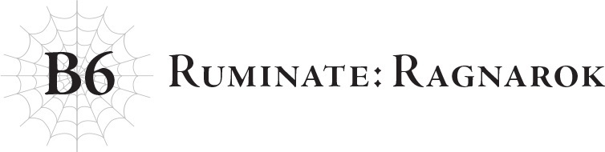

# Trầm tư: Ragnarok
*(Ruminate: Ragnarok)*

Cuộc chiến giữa con người và loài rồng đã bắt đầu.

Bản thân điều đó không có gì đáng ngạc nhiên.

Đối với loài rồng, con người chẳng khác nào rác rưởi.

Có trí tuệ hay không thì dưới góc nhìn của chúng tôi, họ cũng chẳng khác gì các loài động vật khác.

Đặc biệt là khi họ cứ tiếp tục rút cạn sinh mệnh lực của hành tinh dưới dạng năng lượng MA, phớt lờ vô số lời cảnh báo của chúng tôi.

Lẽ tự nhiên, loài rồng dần coi con người như lũ ký sinh trùng đang hút khô máu của hành tinh này.

Vì thế, dĩ nhiên họ không hề ngần ngại khi tiêu diệt lũ ký sinh trùng đó.

Có lẽ mọi chuyện đã khác nếu con người nằm dưới sự bảo hộ của loài rồng, nhưng đối với cư dân trên hành tinh này thì không phải vậy.

Đúng là có một nhóm nhỏ con người thờ phụng loài rồng, nhưng số lượng của họ quá ít ỏi so với tổng dân số nhân loại.

Có thể ban đầu rồng tộc cũng có ý định ban sự cứu rỗi cho vài kẻ thờ phụng đó vào phút cuối, nhưng đáng tiếc là điều đó đã không bao giờ xảy ra.

Vào thời điểm đó, tôi chỉ là một con rồng cấp thấp, không có tư cách để biết được suy nghĩ của các trưởng lão.

Tôi không còn cách nào để biết được những con rồng cấp cao nhất đã định đoạt tương lai như thế nào.

Mệnh lệnh duy nhất tôi nhận được là thuyết phục Sariel.

Loài rồng không thể làm ngơ trước hành vi của con người được nữa, và buộc phải tiêu diệt họ.

Hy vọng của họ là Sariel có thể nhắm mắt làm ngơ trước những hành động đó.

Đó là những gì tôi phải thương lượng với cô ấy.

Dưới góc nhìn của tôi, cuộc thương lượng đó hoàn toàn không có cơ hội thành công.

Họ chọn tôi cho vai trò này hẳn là vì tôi quen biết cô ấy, nhưng thành thật mà nói, tôi chẳng hào hứng chút nào với ý tưởng đó.

Ai lại muốn tiến hành một cuộc thương lượng khi biết chắc nó sẽ thất bại chứ?

Chưa kể đối phương lại là người mà tôi thầm thương trộm nhớ?

...Tôi không hề thoải mái chút nào, nhưng tôi không có lựa chọn nào khác.

Tuy nhiên, việc các rồng trưởng lão kỳ vọng điều gì vẫn là một ẩn số đối với tôi.

Họ thực sự nghĩ rằng cuộc thương lượng sẽ thành công, hay họ cũng thừa biết nó sẽ thất bại như tôi?

Tôi không rõ nữa.

Về mặt lý thuyết, dưới góc nhìn của một con rồng bình thường, có lý do để tin rằng cuộc đàm phán có thể thành công.

Sứ mệnh của Sariel là bảo vệ các sinh vật bản địa.

Nếu con người tiếp tục sử dụng năng lượng MA, hành tinh này chắc chắn sẽ bị hủy diệt.

Điều đó đồng nghĩa với việc các sinh vật bản địa cũng sẽ tuyệt diệt theo.

Trong trường hợp đó, hoàn toàn có khả năng Sariel sẽ chấp nhận nhắm mắt làm ngơ trước hành động của loài rồng để con người bị tiêu diệt.

Tất nhiên, logic đó sẽ sụp đổ ngay khi người ta nhận ra rằng Sariel không chỉ muốn bảo vệ các sinh vật bản địa, mà đặc biệt muốn bảo vệ cả nhân loại.

Có khả năng những con rồng nắm quyền lực đã không nhận ra điều này, và trong trường hợp đó, họ thực sự hy vọng cuộc đàm phán sẽ thành công.

Nhưng nếu họ đã biết ngay từ đầu rằng nó sẽ thất bại thì sao?

Điều đó chắc chắn sẽ lý giải tại sao cuộc tấn công vào nhân loại đã bắt đầu ngay trong lúc tôi đang thương lượng.

Nếu đúng là như vậy, thì vai trò "thương thuyết" của tôi thực chất chỉ là để câu giờ, nhằm giữ chân Sariel.

Tôi không muốn tin vào điều đó, vì nó về cơ bản biến tôi thành một con tốt thí...

Nhưng thực tế là cuộc tấn công đã bắt đầu khi tôi đang thương lượng dang dở, dù... về mặt lý thuyết... có khả năng họ chỉ quá nôn nóng và mặc định rằng tôi sẽ thành công...

...Tôi phải thừa nhận rằng, lời bào chữa đó nghe thật gượng gạo ngay cả đối với tôi.

Dù sao đi nữa, tôi sẽ không bao giờ biết chắc các trưởng lão đã nghĩ gì, bởi vì sau đó tôi không quay lại hàng ngũ loài rồng nữa.

Bây giờ có biết được sự thật thì cũng chẳng giải quyết được gì.

Đúng như tôi dự đoán, cuộc thương lượng với Sariel đổ vỡ, và thế là Sariel cùng loài rồng đã khai chiến.

Chỉ vậy thôi.

Tôi chắc chắn đó là một trận chiến khốc liệt.

Tôi không thể khẳng định chắc chắn vì tôi không có mặt ở đó để chứng kiến.

Nhưng Sariel đơn độc chống lại cả bầy rồng.

Chỉ cần một con rồng duy nhất là dư sức hủy diệt một quốc gia.

Về phía phòng thủ, Sariel chắc chắn có thể đánh bại một con rồng đơn lẻ, nhưng trong lúc đó, những con rồng khác có thể xóa sổ quốc gia bên dưới.

Bầy rồng tìm cách hủy diệt nhân loại, còn Sariel thì đuổi theo bầy rồng để tiêu diệt chúng...

Đó hẳn là một trò chơi mèo đuổi chuột chết chóc.

Lẽ tự nhiên, trận chiến đã kéo dài một thời gian.

Điều này giúp con người có đủ thời gian để bắt đầu xây dựng hệ thống phòng thủ chống lại chúng tôi.

Tôi chắc chắn họ không muốn đầu hàng mà không kháng cự, ngay cả khi điều đó hoàn toàn vô vọng.

Mới hôm nọ — không, tôi đoán là lâu hơn thế dưới góc nhìn của con người...

Thứ vũ khí đó xuất hiện từ sâu bên dưới vùng đất của Phong Long Hyuvan, thứ được thiết kế bởi Potimas và được chế tạo bởi một quốc gia nào đó.

Nó được con người tạo ra để chống lại loài rồng chúng tôi.

Tất nhiên, cuối cùng họ đã không thể hoàn thành nó kịp thời để chiến đấu với chúng tôi; mà ngay cả khi nó được hoàn thành thì cũng chẳng thay đổi được gì.

Quân đội nhân loại tất nhiên đã kháng cự lại cuộc tấn công của loài rồng, nhưng điều đó không kéo dài được lâu.

Thế nhưng chúng tôi đã phạm phải một sai lầm tính toán: Con người đã cướp đoạt thêm nhiều năng lượng MA hơn nữa cho những đội quân đó.

Để chế tạo và vận hành vũ khí của họ...

Thật trớ trêu làm sao, cuộc chiến nhằm ép buộc họ ngừng sử dụng năng lượng MA cuối cùng lại dẫn đến việc họ tiêu thụ nhiều năng lượng MA hơn nữa.

Tệ hơn nữa, Potimas lại đứng sau chuyện đó, bán bản thiết kế những món vũ khí này.

Ngay cả sau khi bị phát lệnh truy nã, lão vẫn được che chở dưới danh nghĩa chuyên gia hàng đầu về năng lượng MA.

Lão chắc chắn không thiếu nơi trú ẩn; tôi tin có rất nhiều con người thèm khát thành quả nghiên cứu của lão.

Và ngay cả khi đang lẩn trốn, lão vẫn cống hiến hết mình cho việc nghiên cứu, sống một cuộc đời tùy thích theo ý mình.

Tại sao lúc đó tôi lại để mặc lão chứ? Chẳng mấy điều làm tôi hối hận hơn thế.

Khi Foduey bị cuốn vào âm mưu của Potimas và bị biến thành ma cà rồng, khi tôi dần quen biết những đứa trẻ ở cô nhi viện và thấu hiểu chiều sâu tội lỗi của Potimas...

Giá như lúc đó tôi nghe theo sự thôi thúc săn lùng và tiêu diệt lão ngay tại chỗ...

Thì dù thế nào đi nữa, tôi tin mọi chuyện sẽ không trở nên phức tạp như bây giờ.

Đáng lẽ tôi không nên tự hợp lý hóa bằng lý do rằng một tên tội phạm loài người phải được phán xét bởi chính bàn tay con người, cùng những lời bào chữa tiện lợi tương tự.

Tôi đoán bài học ở đây là trong khi thất bại thường là kết quả của việc hành động theo cảm xúc thay vì lắng nghe lý trí, thì cũng có những lúc tốt nhất là hãy để cảm xúc quyết định.

Nhưng dĩ nhiên, phán xét mọi chuyện sau khi chúng đã rồi bao giờ cũng dễ dàng hơn, và trong hầu hết các trường hợp, người ta không thể biết được vào lúc đó điều gì mới là tốt nhất.

Dẫu vậy, nếu biết trước, tôi đã giết Potimas ngay lập tức.

Ngay cả bây giờ, tôi vẫn vô cùng muốn giết lão.

Nhưng vai trò đó không dành cho tôi, và tôi cũng không có tư cách.

Dù cảm thấy thật đáng xấu hổ, tôi không thể từ chối nhường lại nhiệm vụ đó cho người khác.

Tôi đoán cuối cùng một tên tội phạm loài người vẫn sẽ bị phán xét bởi chính bàn tay con người.

Mặc dù chắc chắn phải mất một thời gian rất dài sự phán xét đó mới giáng xuống...

Mà, trong thời gian đó lão cũng đã kịp tích lũy thêm không ít tội trạng rồi.

Tôi chắc chắn bất kỳ hình phạt nào cũng sẽ là quá nhẹ nhàng — ít nhất, tôi sẽ vui vẻ chấp nhận nó.

Cô ấy nên tận hưởng sự báo thù của mình một cách thỏa lòng nhất.

Nghĩ lại thì, thế giới này đã có quá nhiều tội lỗi, và tất cả đều đã được gánh vác bởi một ai đó.

Về phương diện cá nhân, những người sống trên thế giới này có lẽ đã trả xong phần lớn tội lỗi của họ rồi, dù Ariel chắc chắn sẽ nổi giận nếu nghe tôi nói vậy.

Dẫu vậy, tôi cảm thấy họ đã bị trừng phạt quá đủ rồi.

Thử nghĩ mà xem: họ đã phải chuyển kiếp đầu thai trong thế giới này hết lần này đến lần khác, không thể quay trở lại vòng luân hồi bình thường, trong khi sức mạnh linh hồn của họ liên tục bị vắt kiệt.

Bản thân họ không nhận thức được điều đó, vì họ không giữ lại ký ức từ kiếp này sang kiếp khác, nhưng dưới góc nhìn của tôi, đó chắc chắn là một hình phạt thích đáng.

Đến thời điểm này, linh hồn của họ đã hao mòn đến mức việc tái sinh thậm chí còn đang trở nên nguy hiểm đối với một vài người trong số họ.

Sự hao mòn linh hồn của ma tộc đặc biệt khắc nghiệt; vốn dĩ số lượng của họ đã quá ít ỏi, và bất chấp tuổi thọ dài lâu, vòng đời của họ vẫn bị rút ngắn bởi cuộc chiến liên miên chống lại nhân loại.

Có lẽ đó là hình phạt cho tội lỗi sử dụng quá nhiều năng lượng MA trong quá khứ để tiến hóa, nhưng khi nhìn chủng tộc của họ bị đẩy đến bờ vực tuyệt chủng, tôi không khỏi cảm thấy có lẽ họ đã chịu đựng quá đủ để chuộc tội rồi.

Ngay cả đối với con người, không phải tất cả bọn họ đều bị năng lượng MA mê hoặc.

Nhiều người trong số họ đơn giản là vô tình bị cuốn vào các vấn đề của thế giới này.

Đặc biệt là Dustin, ban đầu ông ấy không ở vào vị thế phải tự trách móc bản thân gay gắt như bây giờ.

Chắc chắn, tôi vẫn không thể chấp nhận quyết định cuối cùng của ông ấy.

Nhưng sự thật là đó là lựa chọn duy nhất mà ông ấy có.

Khi nghĩ theo cách đó, tôi không khỏi cảm thấy ông ấy đã phải nhận lấy phần thiệt thòi nhất.

Thế nhưng, bất chấp điều đó, ông ấy vẫn tiếp tục tự trách mình vì đã chọn con đường đó như thể đó là ý muốn của riêng ông, và chịu trách nhiệm tương ứng, điều đó thành thật mà nói khá là ấn tượng.

Không đời nào tôi nói thẳng điều này trước mặt ông ấy.

Dĩ nhiên là không rồi.

Dù tôi thấy ông ấy ấn tượng ở một khía cạnh nào đó, tôi vẫn không thể đồng tình với hướng đi của Thần Ngôn Giáo.

Đó lại là một câu chuyện hoàn toàn khác.

Nhưng tôi đoán tôi thực sự cảm thấy hơi mắc nợ Dustin, và đó là điều ngăn cản tôi chỉ trích lựa chọn cuối cùng của ông ấy quá gay gắt.

Tôi cảm thấy tội lỗi vì những gì đồng tộc rồng của mình đã làm, ngay cả khi tôi không hề tiếp tay cho họ làm điều đó.

Cảm giác đó càng mạnh mẽ hơn bởi vì, khác với con người trên thế giới này, những người đã phải chuộc tội trong suốt nhiều năm dài đằng đẵng qua, loài rồng đã không ở lại để làm việc đó.

Thay vào đó, loài rồng đã làm một điều thực sự không thể tưởng tượng nổi vào giờ phút cuối cùng.

Cụ thể là: họ đã rút cạn những giọt năng lượng MA cuối cùng từ thế giới này, rồi bỏ trốn cùng với nó.

Điều gì sẽ xảy ra nếu họ làm việc đó sau khi con người đã tiêu tốn quá nhiều năng lượng MA?

Câu trả lời đã quá rõ ràng: Thế giới sẽ đi đến hồi kết.

Đây chắc chắn chính là khởi đầu của ngày tàn.

Đó là lý do thực sự khiến thế giới đột ngột lao nhanh về phía hủy diệt ngay sau khi cuộc chiến giữa Sariel và loài rồng kết thúc.

Đó chính xác là những gì loài rồng định làm.

Tôi chắc chắn con người sống trên hành tinh này đã nghĩ rằng: Làm sao loài rồng lại có thể làm một chuyện như vậy chứ?!

Ngay cả tôi cũng cảm thấy như vậy.

Nhưng dưới góc nhìn của loài rồng, đó không phải là một ý tưởng kỳ lạ.

Nó có vẻ phi lý đối với con người, nhưng đối với loài rồng thì đó thực sự là một kết luận hoàn toàn hợp lý.

Về cơ bản, loài rồng đã gạch tên thế giới này và coi nó là vô vọng.

Con người chắc chắn cũng không muốn ở lại lâu trên một con tàu đang đắm, đúng không?

Không, họ sẽ tìm cách thoát khỏi con tàu đó càng sớm càng tốt.

Và nếu có bất kỳ hành lý giá trị nào trên tàu, họ sẽ mang theo nhiều nhất có thể.

Dẫu sao thì tàu cũng đang đắm, chẳng có lý do gì để không mang nó đi.

Đây chính là logic mà loài rồng đã tuân theo.

Còn một lý do khác nữa: Họ muốn tự tay đánh đắm nó, để đảm bảo nó sẽ không bao giờ có thể nổi lên mặt nước nữa.

Theo quan điểm của loài rồng, con người trên thế giới này là loài gây hại đã tự đẩy hành tinh của chính mình đến chỗ hủy diệt, phớt lờ vô số lời cảnh báo họ nhận được.

Lẽ tự nhiên, họ muốn đảm bảo rằng lũ sâu bọ đó sẽ không rời khỏi hành tinh để lan tràn sang các thế giới khác.

Loài rồng muốn quét sạch toàn bộ lũ sâu hại cùng một lúc để không bao giờ phải bận tâm về chúng nữa.

Chắc chắn đây không phải là một khái niệm dễ chịu gì đối với con người bị quét sạch, nhưng đó là sự thật về cách loài rồng nhìn nhận con người.

Họ rất tiếc khi phải bỏ đi một hành tinh có thể sinh sống được, nhưng đằng nào họ cũng không thể cai trị nơi này, vì Sariel đã ở sẵn đó khi họ đặt chân đến.

Vì ngay từ đầu hành tinh này đã không thuộc về loài rồng, nên việc từ bỏ nó không phải là một quyết định khó khăn.

Nói cách khác, họ từ bỏ việc cai trị thế giới và thay vào đó chọn cách hủy diệt nó.

Dù diễn đạt theo cách đó nghe có vẻ hơi phũ phàng...

Nhưng nó không hề sai, và chính bản thân tôi cũng nuôi lòng oán hận đối với quyết định cuối cùng này của loài rồng, thế nên tôi không muốn bào chữa cho nó làm gì.

Yes, dưới góc nhìn của một con rồng, đó là một quyết định chính xác.

Quyết định đó đem lại lợi ích cho họ mà không chịu bất cứ bất lợi nào: Một hành tinh họ không thể cai trị bị hủy diệt, và đổi lại họ lấy đi toàn bộ năng lượng còn sót lại của hành tinh đó.

Nghe có vẻ tàn nhẫn, nhưng thực tế là việc toàn bộ con người còn sống ở đó bị xóa sổ cũng là một lợi thế đối với loài rồng, vì điều đó có nghĩa là lũ sâu bọ đã bị diệt trừ sạch sẽ.

Họ không có chút thương hại nào dành cho con người, dù cho đó là sinh vật có trí tuệ.

Thực chất, tôi chắc chắn việc con người có trí tuệ chỉ càng khiến loài rồng khó tha thứ cho hành vi của họ hơn.

Nó giống như việc một đứa trẻ chưa bao giờ lắng nghe lời cảnh cáo cuối cùng đã phạm phải một sai lầm ngu ngốc không thể cứu vãn.

Bạn có thể trách cứ người lớn vì đã tức giận và từ chối giúp đỡ một đứa trẻ như vậy không?

...Bạn hỏi tôi đứng về phía ai sao?

Dĩ nhiên là tôi đứng về phía Sariel rồi.

Tôi không nhất thiết phải đứng về phía con người.

Trước khi tách ra hoạt động độc lập, tôi đã nhìn con người dưới lăng kính của loài rồng.

Tôi cũng từng bị chọc giận bởi sự ngu xuẩn của họ.

Chính loài rồng đã bóp cò súng cuối cùng để hủy diệt thế giới này, nhưng con người rõ ràng vẫn là kẻ phải chịu trách nhiệm khi đã dọn đường cho đến thời điểm đó.

Vì vậy, nếu phải lựa chọn giữa con người và loài rồng, tôi quả thực sẽ bảo vệ loài rồng.

Mặc dù tôi cũng không thể nói rằng mình thực sự còn đứng về phía loài rồng nữa...

Vốn dĩ ngay từ đầu tôi chỉ là một con rồng tầm thường không quan trọng.

Giờ đây tôi đã rời bỏ hàng ngũ của họ, nhưng tôi phải thừa nhận rằng mình vẫn ngần ngại khi nói xấu chủng tộc mà tôi được sinh ra.

Tôi không thể hoàn toàn tha thứ cho hành động lấy đi năng lượng MA rồi bỏ trốn của họ ở phút cuối, nhưng có một phần trong tôi vẫn tán đồng với hành động đó dưới góc nhìn của họ.

Bạn sẽ cười nhạo tôi vì sự dao động qua lại giữa hai bên chứ?

...Ừm, tôi đoán là bạn nói đúng.

Đến cuối cùng, tôi chưa bao giờ có thể đưa ra một quyết định dứt khoát nghiêng hẳn về bên nào.

Ngay cả bây giờ, tôi vẫn đang chật vật đấu tranh nội tâm tương tự như vậy, chẳng phải sao?

......

...Ít ra bạn cũng có thể cố gắng an ủi tôi một chút chứ.

.........Được rồi.

Sự thảm hại của tôi đâu phải mới xuất hiện gần đây.

Tôi tự biết rõ điều đó.

Nhưng đi cầu xin D giúp đỡ vẫn là quyết định đau đớn nhất trong cuộc đời tôi.

Ngay cả lúc này, chính tôi cũng phải kinh ngạc vì mình lại có gan làm một việc táo bạo đến vậy.

Trước đó tôi chưa từng thực sự gặp mặt trực tiếp D bao giờ.

Dĩ nhiên rồi. D là một vị thần quá đỗi hùng mạnh.

Ngay cả loài rồng, chủng tộc sở hữu tầm ảnh hưởng to lớn nhất đối với tất cả các vị thần, cũng phải tránh đụng độ với kẻ đó.

Bạn hỏi loài rồng chẳng phải cũng tránh đụng độ với Sariel sao?

Cách chúng tôi đối phó với Sariel và D rất khác nhau.

Đúng vậy, Sariel là một thiên sứ lạc lối mạnh mẽ, và loài rồng không muốn dây dưa với cô ấy.

Nhưng chúng tôi sống trong cùng một thế giới và hy vọng có thể dần dần lôi kéo cô ấy về phía mình trong một khoảng thời gian dài lâu.

Chúng tôi tìm cách vây ráp cô ấy một cách từ từ, chứ không phải hoàn toàn tránh né tiếp xúc.

Nhưng D lại là một câu chuyện hoàn toàn khác.

Chúng tôi thậm chí không bao giờ dám đến gần kẻ đó.

Không chạm vào, không tương tác, và nếu ả có bao giờ tiếp cận bạn, hãy bỏ chạy ngay tức khắc không chút chần chừ.

Đó là cách D được mô tả trong cộng đồng loài rồng.

Đối với một chủng tộc kiêu hãnh như chúng tôi, việc đưa ra một tuyên bố như vậy thực sự là vô cùng hiếm hoi.

Chân đó hẳn đã đủ cho bạn thấy loài rồng sợ hãi D đến nhường nào.

Thực chất, việc bàn luận về D gần như được coi là điều cấm kỵ đối với chủng tộc của chúng tôi.

Chúng tôi ngần ngại ngay cả khi phải thốt ra cái tên đó.

Thành thật mà nói, một số con rồng trẻ tuổi thậm chí còn không biết đến sự tồn tại của D.

Bản thân tôi cũng là một trong số những con rồng trẻ tuổi đó, nhưng tôi biết về ả chỉ vì tôi tình cờ có thiên phú vượt trội về các năng lực không gian.

Năng lực không gian cho phép một người dịch chuyển đến bất kỳ nơi nào, và đó chính là lý do những kẻ sở hữu năng lực này bắt buộc phải được thông báo về những nơi cấm kỵ không được phép bước chân tới.

Và dĩ nhiên, một trong những nơi đó chính là nơi ngụ cư của D.

Loài rồng sở hữu tầm ảnh hưởng cực lớn ngay cả khi so sánh với các vị thần khác, nhưng phải nói rằng dẫu thế họ cũng không phải là vô địch.

Có rất nhiều vị thần sẽ ra tay đáp trả nếu họ bị xúc phạm, bất kể kẻ xúc phạm là ai đi chăng nữa.

Ngay cả Long Thần vĩ đại, thực thể đứng đầu trong tộc rồng, tương truyền cũng từng bị đả thương từ rất lâu trước đây bởi vị thần cai quản địa ngục.

Truyền thuyết kể rằng Long Thần chưa từng bị thương tổn bất kỳ lần nào khác trước hay sau biến cố đó.

Hửm?

Tôi đã bao giờ gặp Long Thần chưa á?

Tôi á? Dĩ nhiên là chưa rồi.

Nói cho rõ thì, thế giới này là một vùng vô cùng hẻo lánh khuất nẻo theo tiêu chuẩn của loài rồng.

Hãy tưởng tượng nó giống như một ngôi làng nhỏ bé ở vùng nông thôn xa xoài hẻo lánh nhất của một lãnh thổ vô danh.

Mặt khác, Long Thần lại giống như một vị vua sống ở kinh đô, bạn hiểu chứ?

Một kẻ sinh ra và lớn lên ở chốn hẻo lánh vô danh phương xa thì làm sao có cơ hội được diện kiến một thực thể có địa vị cao sang như vậy.

Trong phép so sánh này, tôi đoán D sẽ là quốc vương của một vương quốc khác.

Thế nên mặc dù chưa bao giờ được gặp quốc vương của chính mình, tôi lại đi cầu xin sự trợ giúp từ vị vua của một vùng đất ngoại lai.

Nói một cách nhẹ nhàng nhất thì hành động đó vô cùng trơ tráo.

Thành thật mà nói, tôi vẫn kinh ngạc vì mình đã làm chuyện đó.

Tôi đoán bạn có thể gọi đó là hành động vớ được cọc cứu mạng.

Dù cái "cọc" mà tôi bám vào rốt cuộc lại là một thứ tà ác hơn rất nhiều...

...Liệu việc tìm đến D để cầu cứu có thực sự là quyết định đúng đắn?

Tôi vẫn chưa tìm thấy câu trả lời cho câu hỏi đó.

Nếu lúc ấy tôi không tìm đến D và thuyết phục ả can thiệp vào thế giới này, Sariel chắc chắn sẽ không còn sống nữa.

Không chỉ dừng lại ở đó: Cả linh hồn và sự tồn tại của cô ấy có lẽ đã hoàn toàn biến mất.

Nếu linh hồn cô ấy vẫn còn nguyên vẹn, ít nhất cô ấy có thể tái sinh và sống một cuộc đời khác.

Tôi không biết đó sẽ là cuộc đời như thế nào, nhưng ít nhất nếu cô ấy có thể quên đi tất cả và sống hạnh phúc...

Nhưng nếu linh hồn cô ấy đã cạn kiệt, thì khả năng đó sẽ hoàn toàn không còn nữa.

Tôi muốn cứu mạng Sariel.

Nếu không còn cách nào khác, ít nhất tôi muốn đảm bảo linh hồn cô ấy không bị tan biến.

Ước nguyện đó đã được thực hiện, hệ thống do D tạo ra đã giữ cho Sariel cùng thế giới này tiếp tục tồn tại.

Nhưng đó không phải là sự cứu rỗi mà tôi hằng mong đợi.

Đối với mỗi điều ước được thực hiện, luôn có một cái giá phải trả.

Đã không có một kết cục hoàn mỹ nơi Sariel và thế giới này có thể tiếp tục chung sống trong hòa bình như tôi muốn.

D hoàn toàn có khả năng làm điều đó, nhưng ả không có lý do gì để làm vậy cả.

Mọi chuyện có lẽ đã khác nếu tôi có thể đưa ra một khoản thanh toán thỏa đáng, nhưng tất nhiên một con rồng non nớt như tôi làm gì có thứ gì giá trị như vậy để dâng lên.

Do đó, để đổi lấy việc cứu mạng Sariel và hành tinh này, D đã biến thế giới thành món đồ chơi của ả.

Ả biến các tính năng giống như trong trò chơi điện tử như chỉ số và kỹ năng trở thành hiện thực.

Thế giới thực đã bị biến thành một trò chơi phục vụ cho sự tiêu khiển của ả.

Điều đó có vẻ như là quá sức chịu đựng đối với con người trên thế giới này, những kẻ bị giam cầm bên trong trò chơi, nhưng chính hành vi của họ đã dẫn đến hậu quả này.

Vì không có cách nào cứu thế giới ngoại trừ việc chơi trò chơi này, họ bắt buộc phải làm vậy, để vừa chuộc tội vừa sinh tồn.

Nhưng thỉnh thoảng tôi vẫn tự hỏi.

Chẳng phải chính tôi đã dâng nộp con người, những sinh vật mà Sariel đã hy sinh cả mạng sống để bảo vệ, làm món đồ chơi tiêu khiển cho D sao?

Và chẳng phải kết quả là tôi đã ép buộc Sariel phải chịu đựng nỗi đau đớn không ngừng sao?

Đúng vậy, mạng sống của cô ấy thực sự đã được bảo toàn.

Và thế giới này vẫn tiếp tục tồn tại, dù dưới một hình thức khác với trước đây.

Nhưng trong cả hai trường hợp, chẳng phải đó chỉ đơn giản là kéo dài sự đau khổ của họ một cách vô ích sao?

Tôi đã làm một việc hoàn toàn thừa thãi, hay thậm chí là tàn nhẫn chăng?

Tôi không thể ngăn mình chìm vào những suy hiện tiêu cực như vậy.

Tôi đoán đây là hệ quả tất yếu của việc phải dõi theo thế giới này từ phía sau hậu trường suốt một thời gian quá dài, mà không thể làm gì thêm được nữa.

Nỗi u sầu trong tôi đã tích tụ vô cùng lớn qua năm tháng.

Nhưng nghĩ lại thì, có lẽ đó cũng là một phần hình phạt dành cho tôi.

---

[◀ Chương trước: Lãnh chúa cô độc](23_l6_the_lord_alone.md) | [Chương tiếp theo: Đoạn phụ: Quyết định của Tổng thống ▶](25_interlude_the_presidents_decision.md)
