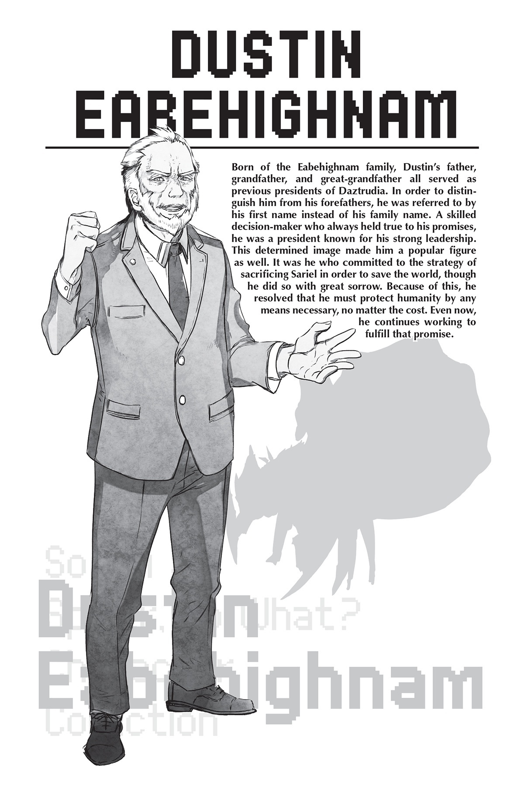

# Đoạn phụ: Quyết định của Tổng thống
*(Interlude: The President's Decision)*

“Tình hình thế nào rồi?”

“Hiện tượng thời tiết cực đoan cùng các hiện tượng kỳ lạ khác đang xảy ra trên toàn thế giới.”

“Bạo lực đang bùng phát giữa các công dân, bao gồm cả giết người và các tội ác khác.”

“Tỷ lệ tự sát cũng gia tăng. Đặc biệt, rất nhiều tín đồ thờ phụng rồng đã tự sát tập thể.”

“Hệ thống phân phối lương thực đang bị đình trệ.”

Mỗi báo cáo đưa ra đều tồi tệ như nhau.

Nhưng dĩ nhiên điều đó là hiển nhiên khi ngày tận thế đang cận kề.

“...Và chúng ta còn lại bao nhiêu thời gian?”

Không ai có thể trả lời câu hỏi của tôi ngay lập tức.

Không một ai phát ra tiếng động, như thể họ e sợ phải nói ra câu trả lời thành tiếng.

Nhưng rốt cuộc, vẫn phải có người phá vỡ bầu không khí im lặng.

Một bộ trưởng ngập ngừng lên tiếng.

“Theo lời Potimas Harrifenas, chúng ta có lẽ còn chưa đầy một năm.”

Nghe đến cái tên Potimas, tôi biết nét mặt của mình đã lộ rõ vẻ khó chịu.

Tôi không thể đổ hết mọi tội lỗi cho tình cảnh này lên đầu Potimas, nhưng gã chắc chắn là căn nguyên của mọi rắc rối.

Sự hoang tưởng tự đại của một kẻ đã đẩy thế giới đến bờ vực diệt vong.

Nhưng gã cũng là cá nhân duy nhất có khả năng giải quyết được chính tình cảnh mà gã đã tạo ra.

Thế nên, dù vô cùng đau lòng, chúng tôi vẫn không thể xử tử Potimas.

“Ngoài ra, gã cũng tuyên bố rằng đó chỉ là khoảng thời gian mà hành tinh này có thể duy trì được hình dạng... Nhưng khoảng thời gian mà sự sống có thể sinh tồn trên đó có lẽ còn ngắn hơn nhiều.”

“Xin phép được nói thêm, thời gian trôi qua càng lâu, tình hình sẽ càng trở nên tồi tệ hơn.”

Ý của người đó là nếu tôi định đưa ra quyết định, tôi phải hành động thật nhanh chóng.

Những người đàn ông và phụ nữ đã theo tôi suốt thời gian qua đều quyết tâm tuân theo quyết định của tôi, ngay cả trong tình cảnh thảm hại này.

Nói cách khác, họ sẵn sàng chấp nhận phán quyết của tôi dưới danh nghĩa một kẻ được gọi là "hiền giả" của thế giới, bất kể nó có phi lý đến thế nào.

Nhưng dù biết mình đã được trao quyền quyết định, tôi vẫn không thể mở miệng nổi.

Đất nước Daztrudia của chúng tôi phần lớn đã tránh được các cuộc tấn công của loài rồng, có lẽ vì chúng tôi đã cấm sử dụng năng lượng MA.

Trong khi các quốc gia khác phải gánh chịu thiệt hại thảm khốc, chúng tôi tương đối vô sự.

Do đó, giờ đây tôi đang được ca ngợi và gọi là một "hiền giả" vì đã cưỡng lại sự cám dỗ của năng lượng MA và tiếp tục lên án nó, đến mức hầu như không có quốc gia nào dám chống lại Daztrudia.

Chính vì vậy, tôi phải lựa chọn một cách cực kỳ cẩn trọng.

Trong tình cảnh này, nếu Daztrudia nói đen là trắng, thì cả thế giới cũng sẽ phải coi là như vậy.

“Hừm...”

Tôi thở dài một tiếng nặng nề.

Dù cho tôi có suy nghĩ lâu và kỹ đến đâu đi chăng nữa, tôi vẫn chỉ đi đến cùng một kết luận.

Với tư cách là tổng thống, là thủ lĩnh trên thực tế của nhân loại, tôi cần phải đưa ra quyết định dù cho đó là một viên thuốc đắng khó nuốt.

“Đây thực sự là cách duy nhất sao?”

Tôi hỏi điều đó không phải để tìm kiếm câu trả lời từ người khác, mà là để tự xác nhận với chính mình.

Quả nhiên, không một ai đưa ra câu trả lời.

Họ làm sao có thể chứ?

Một bầu không khí im lặng kéo dài bao trùm phòng họp.

“Hãy bảo Potimas Harrifenas tiến hành các chuẩn bị cần thiết.”

“...Rõ, thưa ngài!”

Tôi đã nói ra điều đó.

Không còn đường lui nữa rồi.

Đó là khoảnh khắc mà tôi, Tổng thống Dustin của Daztrudia, đã đưa ra quyết định mà về cơ bản đã định đoạt số phận của nhân loại.

Những người khác trong phòng họp cúi đầu xuống.

Một mình tôi đứng dậy khỏi ghế và bước về phía cửa sổ.

Qua lớp kính chống đạn dày cộp, bầu trời dường như đã mất đi ánh sáng, dù lúc này vẫn chưa phải là ban đêm.

Một tiếng bịch trầm đục vang lên trong phòng.

Đó là âm thanh tôi đập trán mình vào cửa sổ.

“Hiền giả? Làm sao có thể coi tôi là hiền giả chứ? Tôi chẳng qua chỉ là một kẻ ngu xuẩn vô liêm sỉ!”

Trong cơn tuyệt vọng, tôi lại đập đầu vào cửa sổ.

Hết lần này đến lần khác.

Liên tục không ngừng.

“Tổng thống! Tổng thống!”

Nhìn thấy trán tôi bị rách và máu bắt đầu rỉ ra, một bộ trưởng vội lao đến ngăn tôi lại.

Nhưng tôi vẫn tiếp tục đập đầu vào cửa kính.

Chỉ đến khi ba vị bộ trưởng giữ chặt và kéo tôi ra khỏi cửa sổ, tôi mới chịu thôi tự làm tổn thương mình.

“Kẻ rác rưởi! Tôi là một kẻ rác rưởi!”

Nhưng miệng tôi vẫn không ngừng lảm nhảm.

Tôi tiếp tục tự chửi rủa bản thân bằng những lời lẽ thậm tệ nhất.

“Tổng thống! Tổng thống! Ngài là một người đáng kính! Ngài không phải là kẻ rác rưởi!”

Tôi tin chắc vị bộ trưởng nói điều đó từ tận đáy lòng, nhưng những lời nói ấy lọt vào tai tôi nghe thật rỗng tuếch.

“Chúng ta đang lấy oán báo ân, lấy sự tàn nhẫn để trả ơn. Làm sao mà không phải là rác rưởi cho được?! Thật đáng xấu hổ, khốn kiếp thật!”

Hai vai tôi phập phồng khi tôi gầm lên, cho đến khi sức lực cạn kiệt, tôi gục xuống ghế.

“Cái tên của tôi sẽ bị bêu rếu và nguyền rủa muôn đời.”

“Chắc chắn là không đâu...”

“Không, nó sẽ như vậy. Và phải như vậy. Thế nên tôi phải tự tay tạo ra tương lai đó.”

Các bộ trưởng đều im lặng trước lời tuyên bố này.

“Từ giờ trở đi, tôi sẽ dùng bất cứ thủ đoạn nào cần thiết để bảo vệ nhân loại, đúng như tư cách của một kẻ rác rưởi. Tôi sẽ tiếp tục cho đến khi linh hồn này tiêu tan hoàn toàn. Đó là tất cả những gì một kẻ ngu xuẩn vô liêm sỉ như tôi có thể làm.”

Mắt tôi vằn lên những tia máu đỏ sọc, nhưng giọng nói vẫn đầy kiên định.

“Nữ thần Sariel đã cứu nhân loại khỏi loài rồng. Và giờ đây chúng ta sẽ hiến tế cô ấy để giữ cho thế giới này tồn tại.”

Nghe vậy, các bộ trưởng đều cúi đầu im lặng.

“Chúng tôi sẽ theo ngài xuống tận cùng địa ngục, thưa Tổng thống Dustin.”

---

[◀ Chương trước: Trầm tư: Ragnarok](24_b6_ruminate_ragnarok.md) | [Chương tiếp theo: Đoạn phụ: Potimas và sự hy sinh của Thần ▶](26_interlude_potimas_and_the_gods_sacrifice.md)
