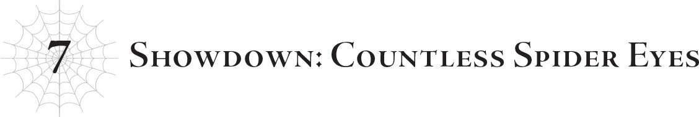

# Chương 7: Quyết chiến: Vô số mắt nhện
*(Chapter 7: Showdown: Countless Spider Eyes)*

Vô số nhím biển bay lơ lửng trên không trung.

Một kim tự tháp khổng lồ đang lượn lờ ngay chính giữa.

Đến tầm này rồi thì tôi cảm giác trận chiến này đáng lẽ phải diễn ra ngoài vũ trụ hay đại loại thế chứ.

Không thể nàooo.

Xem này, tôi xin lỗi nhé, những cư dân của thế giới này ơi.

Các bạn đã cố gắng hết sức rồi.

Mà thật sự, ai mà ngờ được các bạn có thể tích lũy được chút năng lượng nào khi có một gã dị hợm cứ liên tục tiêu xài sạch bách để làm mấy thứ rác rưởi ngu ngốc như thế này bay lơ lửng giữa trời chứ?

Lượng năng lượng mà hắn cần cho chỉ một con nhím biển kia đã đủ tệ rồi, đằng này với số năng lượng hắn đã ăn cắp để chế tạo cả một đội quân nhím biển thế này, các bạn chắc chắn đã cứu được một hoặc hai thế giới rồi ấy chứ.

Có khi tôi còn phải ngạc nhiên vì nơi này vẫn còn tồn tại được khi gã khốn đó liên tục rút cạn nhiều năng lượng đến vậy.

Điều đó chỉ chứng tỏ cư dân thế giới này đã chiến đấu kiên cường đến nhường nào.

Chà, phải cho họ điểm A vì sự nỗ lực thôi!

…Dù vậy, chuyện đó cũng chẳng thay đổi được những gì tôi sắp làm.

Nhưng chúng ta có thể lo lắng về việc đó sau khi trận chiến này kết thúc.

Trước tiên, tôi cần phải giải quyết bầy nhím biển đang bay lơ lửng kia và cái thứ kim tự tháp đó.

May mà tôi đã bảo cậu Oni phát lệnh rút lui trước rồi.

Ngay cả Nữ Vương cũng không thể hạ được một con nhím biển nếu không có tôi giúp đỡ, thế mà giờ đây số lượng của chúng nhiều không đếm xuể. Rút chạy là lựa chọn tốt nhất lúc này.

Mấy con nhím biển đó có vẻ cũng chuyên về tấn công diện rộng.

Với số lượng nhiều thế này tập trung một chỗ, chúng có thể dễ dàng san bằng cả khu rừng này thành bình địa.

Quân ma tộc và bất kỳ binh lính nào khác xuất hiện ở đây cũng chỉ làm bia đỡ đạn mà thôi.

Ngay cả những người như cậu Oni và Vampy cũng không đủ trình để đối đầu với cả bầy nhím biển này.

Đây chính là thứ mà người ta gọi là "rút lui chiến lược".

Mera đang làm rất tốt ở mặt trận đó.

Anh ta và quân đội của mình đã chống đỡ được các cuộc tấn công của tộc Elf và rút lui an toàn.

Tôi đã cảnh báo trước là anh ta đừng làm bất kỳ điều gì điên rồ nếu tình hình trở nên tồi tệ, nhưng tôi vẫn rất ấn tượng khi anh ta có thể rút quân một cách êm thấm như vậy.

Việc rút lui khi kẻ địch đang đuổi sát sau lưng có thể rất khó khăn, nhưng họ vẫn thực hiện thành công.

Bất chấp tất cả, tôi nghĩ Mera thực sự là người chỉ huy giỏi nhất trong số chúng tôi.

Trong khi đó, cậu Oni và Vampy đang bọc lót phía sau, càn quét sạch sẽ lũ Elf trước khi rút lui.

…Nhưng như thế thì có còn gọi là rút lui nữa không nhỉ?

Định nghĩa này có vẻ hơi đáng nghi ngờ khi mà chẳng còn kẻ địch nào để mà rút lui khỏi nữa cả.

Ngoài chuyện đó ra… ừm, có vẻ như các nhện rối đang chiến đấu với robot cùng với một lão già trông quen quen.

Mấy đứa đang làm cái gì thế hả?

Nói nghiêm túc đấy, cái gì vậy trời?

Tôi có thực sự muốn biết chuyện gì đã xảy ra ở đó không nhỉ?

…Thôi kệ đi.

Chắc tôi cứu lão già đó cùng với các nhện rối luôn vậy.

Tôi kích hoạt dịch chuyển tức thời thông qua các phân thân chiến đấu mà các nhện rối đang cưỡi, rồi sơ tán toàn bộ bọn họ đến nơi an toàn kèm theo cả ông lão kia.

Xong. Thế là bớt đi một mối lo.

Giờ tôi chỉ cần đối phó với bầy nhím biển này, và cả cái kim tự tháp trông có vẻ là trùm cuối kia nữa.

Đầu tiên là robot, rồi đến siêu robot, rồi đến nhím biển, và giờ là cái kim tự tháp này.

Triển khai lực lượng theo từng đợt riêng biệt là một kế hoạch ngu ngốc, nhưng tôi có thể hiểu tại sao bọn chúng lại chờ đến giờ mới tung đám nhím biển ra.

Đòn tấn công mạnh nhất của chúng là ném bom thảm bằng vô số những cái gai súng kia.

Việc đó có thể dễ dàng tiêu diệt luôn cả đám robot và siêu robot ở bên dưới trong quá trình thực hiện.

Đó có lẽ là lý do chúng không tung nhím biển ra ngay từ đầu.

Dù cũng có thể lũ Elf chỉ đơn giản nghĩ rằng đám robot kia là đã quá đủ rồi.

Rồi khi đám robot là không đủ, bọn chúng lại gửi siêu robot tới, và tôi đã nhanh chóng giải quyết chúng bằng đạn thiên thạch…

Phải rồi, có khi bọn chúng chỉ đang phân bổ lực lượng một cách vô tội vạ mà chẳng suy nghĩ gì cả.

Hoặc cũng có thể bọn chúng không còn lựa chọn nào khác vì robot và siêu robot vốn không được thiết kế để phối hợp tốt với nhím biển.

Thôi được rồi, dù thế nào đi nữa!

Lần này chắc chắn rồi! Đây PHẢI là vũ khí tối thượng của tộc Elf!

Không thể nào có thứ gì điên rồ hơn thế này xuất hiện sau đó nữa đâu! Đúng không?!

Ý tôi là tốt nhất đừng có thêm cái gì khác nữa đấy!

Tôi phát ngán cái trò đùa dai này lắm rồi!

Mọi chuyện đã bắt đầu nhạt nhẽo khi một đống siêu robot chui ra, rồi đến con nhím biển thậm chí còn mạnh hơn, và rồi một đống nhím biển cũng chui ra nốt?! Đang đùa tôi đấy à?!

Và giờ thậm chí còn có một kim tự tháp trông rất màu mè ở giữa, giống như quả anh đào trang trí trên ly kem sundae vũ khí ngu ngốc này vậy!

Thứ đó chắc chắn phải là con bài tẩy cuối cùng rồi!

Đúng vậy mà, phải không?! Làm ơn nói với tôi là không còn gì khác nữa đi!

Bình thường tôi vốn là một con nhện ôn hòa hiền lành, nhưng nếu sau chuyện này mà một đống kim tự tháp như thế lại chui ra nữa, tôi thề là tôi sẽ phát điên thực sự đấy!

Áaaa! Áaaaa!

À, sau khi gào thét xả giận một hồi thì tôi cảm thấy dễ chịu hơn một chút rồi.

Nghiêm túc đấy, dẹp đi cho rồi…

Không đời nào…

Potimas, ông cũng ra gì đấy…

Đến nước này thì tôi cũng phải ngả mũ bái phục lão ta thôi.

Cái này ấn tượng thật sự.

Bây giờ tôi đã hiểu tại sao lúc nào lão ta cũng tự phụ một cách ngu ngốc như vậy.

Sở hữu chừng này hỏa lực trong túi áo, thảo nào lão ta lại tự tin mình không thể thua…

Ý tôi là, bất kỳ ai khác chắc chắn sẽ không bao giờ đối phó nổi thứ này…

Nhưng tất nhiên là tôi đối phó được.

Được rồi, có vẻ giờ tôi phải nghiêm túc thôi.

Ưừừ.

Tôi thực sự không muốn phơi bày toàn bộ bài tẩy của mình ở đây, nhưng có vẻ như tôi không còn lựa chọn nào khác…

Ông nên tự hào về bản thân đi, Potimas.

Ông đã khiến tôi — một vị thần thực thụ, ít nhất là theo một cách gián tiếp — phải dốc toàn lực để đánh bại ông.

Thật lòng mà nói, tôi cứ nghĩ đây sẽ là một chiến thắng dễ dàng hơn cơ.

Ngay khi tôi đang chuẩn bị nghiêm túc, cái kim tự tháp đã đi nước cờ đầu tiên.

Một góc của nó bắt đầu phát sáng.

Đó có phải là súng sóng động không?

Vì trông nó cực kỳ giống súng sóng động luôn!

Đúng như tôi dự đoán, chỉ một khoảnh khắc sau, ánh sáng ngưng tụ thành một chùm tia laser đậm đặc và bắn thẳng vào tôi.

Rồi rồi, đi vào chiều không gian song song của tôi nào.

Vàaa giờ tôi sẽ trả nó lại cho ông đây!

Một cánh cổng dẫn đến chiều không gian song song trống rỗng xuất hiện ngay trước mắt tôi và nuốt chửng chùm tia laser.

Sau đó, tôi tạo ra một cánh cổng khác ngay bên cạnh để chùm tia laser bay ngược trở lại phía kim tự tháp.

Bất cứ chuyên gia thao túng không gian ra hồn nào cũng sẽ nghĩ đến chiêu này thôi!

Cái trò kết nối hai cổng dịch chuyển để phản lại đòn tấn công tầm xa về phía kẻ địch ấy mà!

Tia laser của chính kim tự tháp lao ngược về phía nó.

Nhưng, đúng như tôi đoán, cái kim tự tháp có một lớp kết giới làm lệch hướng tia laser trong một ánh chớp chói mắt.

Cái này có vẻ như là sự kết hợp giữa Kết giới Phản Kỹ thuật với phản xạ chăng?

Tia laser đập vào kết giới rồi dội ra, rẽ nhánh đi khắp mọi hướng, từng tia sáng phân tán bốc hơi bất cứ thứ gì nó chạm trúng.

…Ghê thật, cái thứ đó mạnh quá mức cho phép rồi đấy.

Nghiêm túc đấy, cái thứ đó bị làm sao thế?

Nó hoàn toàn xóa sổ mặt đất ở bất cứ nơi nào nó bắn trúng…

Tôi thậm chí còn không nói về mấy cái hố thiên thạch đâu; chúng căn bản là những cái hố sâu hoắm không đáy luôn rồi.

Ông đang định hủy diệt hành tinh này bằng sức mạnh vật lý đấy à?

Tôi cứ nghĩ nó là súng sóng động cơ, nhưng căn bản nó chính là siêu laser của Death Star rồi.

Tốn bao nhiêu năng lượng chỉ cho một phát bắn của thứ đó thế hả?

Trời ạ, may mà tôi không thử chặn trực tiếp thứ đó.

Tôi không nghĩ có cách nào để phòng thủ trước một đòn như vậy.

Hê, nhưng tấn công tầm xa vô dụng với tôi nhé!

Tôi sẽ chỉ gửi trả tất cả về đúng nơi sản xuất thôi!

Nhưng tôi phải hạ thứ này trước khi nó kịp bắn phát tiếp theo.

Đầu tiên, tôi liếc nhìn xem Hyrince đang làm gì.

Có vẻ như cậu Oni đang hối thúc anh ta rời đi.

Anh ta ngoảnh lại một giây, như thể nhận ra tôi đang theo dõi mình, nhưng rồi lại quay mặt về phía trước để tập trung sơ tán.

Đoán là anh ta không có ý định can thiệp vào trận chiến này rồi.

Như vậy thì tốt thôi, nhưng vẫn thật tệ khi anh ta sắp nhìn thấy những con bài tẩy trong túi tôi.

Mặc dù tôi không nghĩ mình có thể vượt qua trận chiến này mà không dốc toàn lực.

Ý tôi là, nếu có đủ thời gian thì tôi có thể làm ăn tắc trách một chút cũng được, nhưng cả khu vực này có khả năng sẽ biến thành hư vô mất nếu tôi kéo dài quá lâu.

Phù.

Được rồi, bắt đầu nào.

Nhưng trước tiên, tôi sẽ ném bản thân vào một chiều không gian khác.

Hê.

Dù đòn chùm tia sáng đó có mạnh mẽ đến đâu, nó cũng không thể chạm tới tôi nếu tôi đang ở một chiều không gian hoàn toàn khác!

Hỏi xem thao túng không gian gian lận ở điểm nào á?

Chà, có lẽ chính là việc bạn có thể làm bất cứ điều gì mình muốn với bất kỳ đối thủ nào không biết sử dụng thuật thức không gian mà không cho họ bất kỳ cơ hội nào để đánh trả.

Đó là lý do tại sao các vị thần cần có năng lực không gian, tôi đoán thế.

Mặc dù tôi có vẻ đặc biệt giỏi khoản này.

Dù sao thì, đến lúc mở nắp chiếc vạc địa ngục của tôi rồi.

Một vết nứt xuất hiện trong không gian phía trên nơi kim tự tháp và đám nhím biển đang lơ lửng.

Nó lan rộng ra theo hình mạng nhện, bao phủ bầu trời phía trên làng Elf.

Rồi vô số con mắt nhìn xuống qua những vết nứt đó.

Vô số con mắt, tất cả đều đang chăm chăm nhìn xuống mặt đất.

Đó là các phân thân của tôi, đang sử dụng `[Bạo Thực Tà Nhãn]`.

Đám mắt nhện lúc nhúc đồng loạt tung ra đòn tấn công, ngốn ngấu năng lượng của kim tự tháp và đám nhím biển.

Kim tự tháp và nhím biển đồng loạt nã pháo phòng không, nhưng chúng đều bị ngăn chặn bởi không gian hình mạng nhện, khiến không một đòn tấn công nào có thể chạm tới các phân thân.

À thì hiển nhiên rồi. Tôi đã dùng `[Phân tách Không gian]` lên toàn bộ hệ thống đó mà.

Không thứ gì lọt được vào trong đó đâu.

Bị vắt kiệt năng lượng, đám nhím biển rơi rụng xuống đất.

Đó là kết quả khi tôi dốc toàn lực đấy.

Tôi tận dụng tối đa năng lượng không gian của mình, giấu vô số phân thân trốn trong không gian "nhà" dị chiều, rồi dùng `[Bạo Thực Tà Nhãn]` hút sạch năng lượng của các người.

Không có năng lượng, ngay cả một vị thần cũng chỉ là một sinh vật bình thường mà thôi.

Sở hữu lượng năng lượng vượt quá khả năng chứa đựng của một sinh vật bình thường mới là thứ định nghĩa nên một vị thần, nên nếu tước đoạt đi thứ đó thì họ thậm chí không còn xứng gọi là thần nữa.

Đây là chiến lược mà tôi — một vị thần mới toe còn nửa mùa — đã phát triển để có thể đánh bại những kẻ như Güli-güli.

Ý tôi là, tôi còn lựa chọn nào khác đâu chứ?

Nếu chiến đấu sòng phẳng và công bằng, tôi chắc chắn sẽ thua.

Nên lựa chọn duy nhất của tôi là đẩy phương pháp đáng tin cậy sẵn có của mình lên mức cực đoan.

Thật lòng mà nói, đây là tất cả những gì tôi có.

Có quá ít việc tôi thực sự có thể làm đến mức bạn hầu như không thể gọi tôi là một vị thần thực thụ.

Nhưng với chiến lược "ru rú trong nhà" mới được mài giũa đến mức cực hạn này, tôi thực sự có thể hạ gục một vị thần cấp cao như Güli-güli, ít nhất là về mặt lý thuyết.

Đời nào nó lại thất bại trước mấy thứ vũ khí Elf ngu ngốc này.

Tôi có một triệu phân thân được giấu trong không gian nhà dị chiều ấm cúng mới của mình.

Nên nếu mỗi phân thân có tám mắt, tổng cộng sẽ có tám triệu `[Bạo Thực Tà Nhãn]`.

Tôi chỉ có thể vận hành tối đa mười nghìn phân thân chiến đấu cùng một lúc, nhưng nếu tất cả những gì tôi cần làm chỉ là kích hoạt `[Bạo Thực Tà Nhãn]`, tôi hoàn toàn có thể thực hiện được chuyện này.

Đó là một chiến lược vô cùng đơn giản, nhưng chính sự đơn giản đó lại khiến nó cực kỳ khó phòng thủ.

Dù vậy, sự đơn giản đó cũng đồng nghĩa với việc có thể có phương pháp để khắc chế nó mà tôi chưa nghĩ tới…

Đó là lý do tại sao tôi hy vọng tránh việc phơi bày chiêu thức cụ thể này…

Tôi kiểm tra tình hình của Hyrince lần nữa.

Ôi trời. Anh ta đang trố mắt nhìn kìa.

Thôi đi nhé! Đừng có nhìn!

Đây là tuyệt chiêu duy nhất trong tay áo của tôi đấy. Nếu anh tìm ra cách đối phó với nó, tôi tiêu đời nhà ma chắc luôn.

Đó là lý do tại sao tôi đã không muốn làm vậy đấy!

Nào, làm ơn đừng có nghĩ ra kế hoạch khắc chế trò này đấy nhé?

Trong lúc tôi đang bị phân tâm bởi việc đó, những con nhím biển cuối cùng rơi xuống đất, và cuối cùng cái kim tự tháp đã mất sạch năng lượng cũng rơi theo.

Cứ như vậy, vũ khí tối thượng của tộc Elf đã đi đời.

Xét đến việc một mình Nữ Vương còn không thể để lại một vết xước nào trên con nhím biển kia, cái kim tự tháp này chắc chắn phải mạnh hơn thế nhiều, có lẽ đến mức ngay cả Ma Vương cũng không thể đối phó nổi.

Tính toán dựa trên lượng năng lượng khổng lồ mà tôi vừa hút sạch khỏi nó bằng `[Bạo Thực Tà Nhãn]`, tôi ước tính thứ đó mạnh đến mức điên rồ.

Nhưng nó vẫn gục ngã chỉ trong vòng vài phút.

Cũng giống như việc Potimas tràn đầy tự tin xây dựng lực lượng cho tộc Elf, tôi cũng có nguồn sức mạnh tích trữ của riêng mình để hủy diệt bất cứ thứ gì lão ta ném về phía chúng tôi.

Vì vậy, chiến thắng này là kết quả hiển nhiên.

…Dù thế, tôi phải thừa nhận tim mình đang đập hơi nhanh đấy.

Ý tôi là, thật tình!

Cứ mỗi khi tôi nghĩ thế là hết rồi, thì lại có thêm nhiều viện binh chui ra, biết không hả?!

Đến nước này rồi thì tôi sẽ chẳng ngạc nhiên nếu tiếp theo lại có cả một bầy kim tự tháp chui ra đâu!

Ý tôi là tôi sẽ phát điên lên đấy, chứ không bất ngờ đâu!

Nhưng bạn hiểu tại sao tôi lại trở nên hoang tưởng đến mức này rồi đúng không?!

Làm ơn, nói với tôi là không còn cái gì nữa đi mà!

Nhưng như muốn nghiền nát giấc mơ của tôi, mặt đất nứt toác ra, và một thứ gì đó khổng lồ nổi lên lơ lửng trong tầm mắt.

…

………

……………

ĐỦ RỒI ĐẤY, KHỐN KIẾPPPP!!!!

Thế là quá đủ rồi!

Giờ tôi giận thật rồi đấy!

Hừ! Các người đã chính thức chọc giận con nhện ôn hòa hiền lành này lần cuối cùng rồi!!

Áaaa! Tôi hy vọng các người đã sẵn sàng trả giá!

GÀOOO! Ban đầu tôi chỉ định tiêu diệt các người thôi, nhưng giờ tôi sẽ THỰC SỰ nghiền nát các người thành cám luôn!!

…Khoan đã, là do tôi ảo giác hay cái thứ trông giống UFO vừa mới chui ra kia đang cố bỏ chạy thế?

Đứng lại đó cho tôi, đồ khốn kiếp!!

---

[◀ Chương trước: Đoạn phụ: Potimas và sự hy sinh của Thần](26_interlude_potimas_and_the_gods_sacrifice.md) | [Chương tiếp theo: Lãnh chúa được báo thù ▶](28_l7_the_lord_avenged.md)
