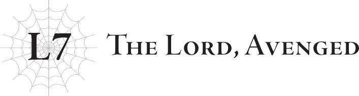
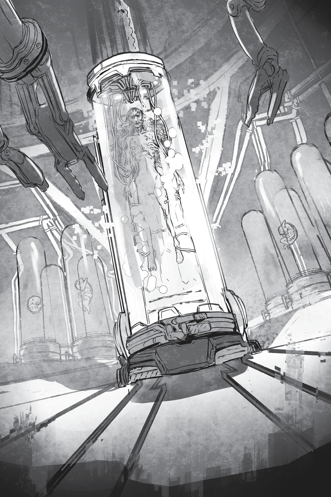
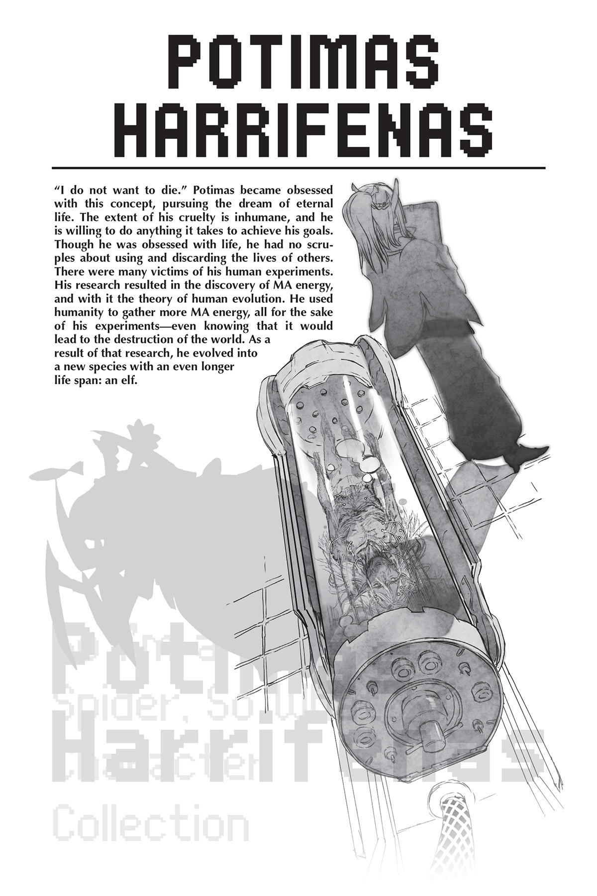

# Lãnh chúa được báo thù
*(The Lord Avenged)*

“Ariel! Cái quái gì thế kia?!”

Giọng của Potimas vang lên đầy hoảng loạn qua loa.

Đồng thời, những đòn tấn công dồn dập từ con Omega bỗng nhiên dừng hẳn.

“Hửm? 'Thứ gì' cơ? Ngươi phải nói rõ hơn chứ. Ta chẳng hiểu ngươi đang nói về cái gì cả...”

Tôi lắc đầu và nhún vai với vẻ đầy cợt nhả.

Bình thường thì tôi đoán hắn sẽ phớt lờ thái độ của tôi, nhưng lúc này hắn có vẻ đang căng thẳng tột độ: tôi thậm chí có thể nghe thấy tiếng nghiến răng ken két của hắn truyền qua loa.

“Cái thứ mà các ngươi gọi là 'White' ấy! Nó là cái gì?!”

Ra là thế.

Ừ, tôi cũng đoán vậy.

Tôi chỉ trêu chọc hắn khi vờ như không biết hắn muốn ám chỉ điều gì thôi.

Không ai ngoài White có thể khiến Potimas rơi vào trạng thái hoảng loạn đến mức này.

Hắn cũng có vẻ đang thực sự hoảng loạn tột cùng.

Lần cuối cùng tôi nghe thấy hắn gào thét với nhiều cảm xúc chân thực như vậy là từ khi nào nhỉ?

Chắc là cái lần White đập hắn ra bã...

Potimas thường nhìn xuống người khác với vẻ khinh miệt, không bao giờ biểu lộ bất kỳ cảm xúc nào.

Hắn nghĩ mình quá thượng đẳng để bị ảnh hưởng bởi bất kỳ điều gì mà những sinh vật thấp kém có thể làm.

Tôi dám cá là hắn nghĩ việc để cảm xúc của mình bị lay động bởi những sinh vật như vậy là một sự sỉ nhục.

Nhưng nay, hắn hoàn toàn mất kiểm soát.

Điều đó có nghĩa là một chuyện nằm ngoài sức tưởng tượng của Potimas chắc chắn đã xảy ra.

Phải rồi, nghe là biết ngay tác phẩm của White.

“Sao thế? White lại làm trò gì kỳ quặc rồi à?”

Tôi thừa biết hắn sẽ chẳng thèm trả lời, nhưng vẫn cứ hỏi thử xem sao.

“Ta mới là người hỏi ở đây! Mau khai ra nó là cái gì đi!”

Đến tầm này rồi thì hắn gần như đang hét toáng lên.

Tiếc thật đấy.

Tôi không biết nữa, thực lòng tôi khá muốn chính mình là người khiến hắn phải thảm hại như vậy...

Nhưng có vẻ White đã nhanh chân hơn tôi một bước rồi.

“Ta chẳng biết chuyện gì đã xảy ra, nhưng nghe chừng ngươi bị White chơi một vố đau rồi nhỉ? Ôi, thật là đáng tiếc làm sao? Đáng đời ngươi lắm.”

Khi tôi vừa buông lời chế giễu đích đáng đó, con Omega đang đứng hình bỗng nhiên lao vào hành động.

Tôi nhảy lùi lại, né tránh một cú đấm lộ liễu mang đầy sự giận dữ.

“Nóng máu rồi à? Ôi, nổi giận rồi cơ đấy? Sao mà nóng tính thế không biết. Hay là ngươi cần bổ sung thêm canxi đi? Đấy, vấn đề của mấy kẻ gầy gò suốt ngày ru rú trong nhà là thế đấy.”

Tôi càng khiêu khích, con Omega càng lao vào tôi một cách quá đỗi trực diện.

“Khốn kiếp! Chết tiệt thật! Tính toán của ta sai ở chỗ nào chứ? Cái thứ chết giẫm đó hoàn toàn đi ngược lại mọi logic!”

Lời chửi rủa của Potimas vang vọng trong vô vọng.

Một cái tôi thật mong manh dễ vỡ.

Gã đàn ông này chỉ là một kẻ yếu đuối, dẫu tôi đã biết rõ điều đó từ lâu.

Lý do duy nhất khiến hắn trông có vẻ mạnh mẽ là vì hắn chỉ toàn chiến đấu với những đối thủ yếu hơn mình.

Không phải vì hắn mạnh, mà là vì họ không mạnh bằng hắn.

Nhờ thế mà hắn mới có thể ngự trị trên đỉnh cao lâu đến vậy.

Và cũng là lý do hắn có thể phô trương sự tự tin của mình lâu như thế.

Nhưng tôi biết sự thật.

Sâu thẳm bên trong, hắn yếu đuối hơn bất kỳ ai.

Chính vì luôn yếu thế hơn tất cả, hắn mới thèm khát sức mạnh hơn ai hết.

Đó là lý do hắn đi đến bước đường này.

Hắn tưởng mình mạnh mẽ, tưởng mình đã vượt lên trên tất cả mọi người, nhưng thực chất hắn vẫn chỉ là một kẻ tiểu nhân yếu đuối.

Giờ đây, khi phải đối đầu với White, một người mạnh hơn hắn, lớp mặt nạ đã hoàn toàn rơi xuống, lộ ra bản chất yếu nhược vốn có của hắn.

“Thật là một kẻ yếu đuối thảm hại.”

“Ngươi nói cái gì?”

Potimas bắt được tiếng thì thầm của tôi và vặn lại một cách sắc lẹm.

“Ngươi yếu đuối lắm, Potimas.” Tôi không thực sự định để hắn nghe thấy, nhưng một khi hắn đã hỏi, tôi cũng chẳng ngại ngần gì mà không nói thẳng vào mặt hắn.

“Lời lẽ ngông cuồng đấy, từ một kẻ đang hài lòng với thứ sức mạnh tạm bợ do hệ thống ban cấp.”

Thế nhưng, đó hoàn toàn không phải là kiểu mạnh yếu mà tôi đang muốn nói đến.

Mà có giải thích thì hắn cũng chẳng đời nào hiểu được.

“À phải, cái hệ thống. Sức mạnh để trở thành thần đâu rồi? Ta hoàn toàn chưa trở thành thần! Nhưng còn cái thứ kia thì sao? Sao chuyện này có thể xảy ra được? A, khốn kiếp thật! Chết tiệt!”

Lúc này, Potimas chỉ đang lảm nhảm những lời vô nghĩa. Tôi thậm chí còn chẳng hiểu hắn đang nói cái gì nữa.

Con Omega cũng đang di chuyển một cách thất thường, có lẽ là do chịu ảnh hưởng từ trạng thái thảm hại của chủ nhân.

Chiếc mũi khoan áp sát vào mặt tôi.

Tôi dùng răng ngoạm chặt lấy nó.

Nó phát ra một tiếng rắc khó nghe, nhưng tôi dồn lực vào cơ hàm và nhai nát nó thành từng mảnh vụn.

“Khoan đã. Chờ một chút! Vô lý quá. Tại sao? Tại sao ngươi vẫn còn sống?”

Ồ?

Cuối cùng hắn cũng nhận ra rồi sao?

“Tại sao vết thương của ngươi lại lành rồi? Làm thế nào ngươi có thể đánh ngang ngửa với Gloria Loại Ω bên trong Kết giới Phản Thuật thức được? Rốt cuộc chuyện này là thế nào?!”

Nhận ra hơi muộn đấy, ông già.

Chiếc mũi khoan của con Omega đã đâm tôi tả tơi.

Nó xé toạc bụng tôi, đâm thủng ngực, chém đứt một cánh tay, và băm nát đôi chân tôi.

Nhưng những vết thương đó hiện tại đều đã lành lặn.

“Sao chuyện này có thể xảy ra được?!” Potimas thét lên. “Không thể nào... Hay là ngươi cũng đã trở thành thần rồi?!”

Sau khi khinh thường tôi suốt bấy lâu nay, giờ hắn lại nghĩ tôi đã đi trước một bước và đạt được giấc mơ trở thành thần của hắn.

Đối với Potimas, đó chắc chắn là nỗi sỉ nhục tồi tệ nhất có thể tưởng tượng được.

“Không đâu.”

Nhưng thật đáng tiếc, thực tế không phải như thế.

Tôi chưa trở thành thần.

Tôi không thể làm vậy.

Nếu việc đó dễ dàng đến thế, tôi chắc chắn Potimas cũng đã trở thành thần từ lâu rồi.

“Ta chưa trở thành thần hay gì cả. Nhưng lúc này ta có thể có được sức mạnh đủ để chiến đấu với một vị thần, dù chỉ là trong một khoảng thời gian ngắn. Ngươi cũng biết phương pháp này mà, đúng không?”

Con Omega lùi lại.

Cứ như thể chính Potimas đang co rúm người lại để tránh xa tôi vậy.

“Không lẽ nào.”

“Ngươi đoán đúng rồi đấy.”

“Ngươi điên rồi sao?”

Chà, nghe chẳng lọt tai chút nào.

Nhưng tôi đoán dưới góc nhìn của Potimas, đó thực sự là một hành động điên rồ.

Đó là lý do vì sao tôi bảo hắn là một kẻ yếu đuối.

Bản thân tôi nhìn chung cũng khá yếu đuối, nhưng tôi muốn nghĩ rằng ít nhất mình cũng đủ dũng cảm để đặt cược mạng sống của mình nhằm đạt được mục tiêu.

“Khiêm Nhường.”

Đó là kỹ năng mới thuộc dòng Bảy Đức Tính mà tôi vừa mới học được gần đây.

Hiệu ứng của nó tạm thời ban cho tôi khả năng chiến đấu với sức mạnh ngang tầm một vị thần.

Khi mảnh linh hồn "cựu thân thể não" của White dung hợp với tôi, nó đã tăng giới hạn linh hồn của tôi lên tương ứng.

Trước đó, linh hồn tôi từ lâu đã bị lấp đầy tới mức muốn nổ tung, giống như một chiếc bình rạn nứt sắp sửa vỡ tan.

Nhưng rồi, linh hồn của White đã tìm đến giống như để hàn gắn những vết nứt đó.

Nhờ có cô ấy, cuối cùng tôi đã có thể học được những kỹ năng mới sau một thời gian rất dài.

Tôi đã học những kỹ năng như Thần giao cách cảm, thứ mà tôi chưa từng cần đến vì luôn cô độc một mình... Và kỹ năng cuối cùng tôi học được chính là kỹ năng này: [Khiêm Nhường].

Quân bài tẩy của tôi, thứ mà tôi giữ bí mật với tất cả mọi người ngoại trừ White.

Vài tôi sẽ không ngần ngại sử dụng nó ngay lúc này.

Cho dù việc đó đồng nghĩa với việc thiêu rụi linh hồn này thành hư vô.

<[Khiêm Nhường]: n% quyền năng đạt đến thần giới. Cho phép người sử dụng tạm thời có được sức mạnh ngang tầm một vị thần bằng cách tiêu hao linh hồn của chính mình. Ngoài ra, người sử dụng sẽ đạt được năng lực vượt qua hệ thống W để can thiệp vào trường MA.>

Tôi chộp lấy đầu con Omega khi nó đang cố gắng tái tạo chiếc mũi khoan bị gãy và cắm răng vào đó.

Vị đắng ngắt của kim loại tràn ngập khoang miệng tôi.

Nhưng chỉ một khoảnh khắc sau, những mảnh kim loại bị nhai nát đã bị phân rã và hòa tan thành năng lượng thuần khiết.

Kỹ năng [Bạo Thực] của tôi vẫn hoạt động rất tốt ngay trong khoang miệng.

Điều đó nghĩa là trước tiên tôi phải đưa thứ đó vào miệng mình cái đã, nhưng một khi đã nằm trong đó, tôi có thể phân rã bất cứ thứ gì thành năng lượng và hấp thụ nó.

Và dù cho lượng năng lượng tôi có thể cướp được trong một ngụm là có hạn, nhưng nó có lẽ vẫn hiệu quả hơn là cứ liên tiếp đấm vào cái khối sắt chết tiệt đó.

Xem này, tôi đã hiểu cỗ máy Omega này được chế tạo ra để làm gì rồi.

Về cơ bản, nó được thiết kế để chiến đấu với một vị thần — cụ thể là Gülie.

Nó được nạp một lượng năng lượng khổng lồ để chuẩn bị cho một trận chiến tiêu hao kéo dài.

Bản thân lượng năng lượng khổng lồ đó đã nói lên tất cả, và nó đủ bền bỉ để có thể lập tức tái tạo lại trong nháy mắt bất kể bị đánh sập bao nhiêu lần đi chăng nữa.

Đó là mục tiêu duy nhất của nó, không hề có bất kỳ tính năng thừa thãi nào khác.

Không rõ tại sao lại có cái mũi khoan đó nữa... Chắc là do gu dị hợm của Potimas chăng?

...Không, tôi đoán khi xét về mặt phá hủy vật lý, một mũi khoan là tương đối hiệu quả.

Ngoài ra còn có Kết giới Phản Thuật thức và khí độc để làm kiệt sức đối thủ.

Một vị thần về cơ bản chỉ là một sinh vật sở hữu lượng năng lượng khổng lồ đến mức phi lý.

Nếu lượng năng lượng đó là thứ định nghĩa nên một vị thần, thì tất cả những gì bạn cần làm là tấn công nó bằng một thứ gì đó có khả năng tiếp tục chiến đấu cho đến khi vị thần đó hoàn toàn cạn kiệt năng lượng.

Phải, tôi hiểu rồi.

Đó là một phương pháp khá vòng vo, nhưng nó vẫn hợp lý nếu ngươi đang cố gắng đánh bại một vị thần bằng bất kỳ thứ gì có sẵn trong tay.

Ngay cả dưới tác động của [Khiêm Nhường], nó vẫn mang lại cho tôi một trận chiến ra trò.

Tôi không biết thứ này có thực sự hiệu quả khi đối đầu với Gülie hay không, nhưng tôi chắc chắn có thể nhận thấy Potimas đã dồn rất nhiều tâm huyết vào chiến lược này.

Nhưng vì hắn lại dùng nó để chống lại tôi, nó chắc chắn sẽ kết thúc trong thất bại.

Tôi thọc thẳng tay vào lồng ngực con Omega.

Và rồi kích hoạt phép thuật bên trong cơ thể nó.

Kết giới Phản Thuật thức không phải là vạn năng đâu.

Nó không hoạt động bên trong cơ thể của các sinh vật sống, đặc biệt là với đồng minh, những kẻ cần có khả năng sử dụng các thuật thức từ bên trong.

Ý tôi là, sự tái tạo của con Omega cũng là một thuật thức, và nếu ngươi chặn đứng điều đó thì nó cũng chỉ là một đống sắt vụn mà thôi.

Thế nên tôi vẫn có thể kích hoạt ma pháp... ngay từ bên trong cơ thể con Omega.

Tôi đang dùng một phép thuật Ma pháp Dị giáo cấp 10.

Nó được gọi là [Rend Soul].

Ma pháp Dị giáo tác động trực tiếp lên linh hồn của mục tiêu, và [Rend Soul] là phép thuật phá hủy hoàn toàn linh hồn đó.

Và tôi đang giáng đòn đó vào con Omega ngay từ bên trong.

Con Omega giãy giụa điên cuồng, đánh mạnh vào hông tôi.

Tôi nghe thấy một tiếng rắc khó chịu từ xương gò má bị gãy khi cơ thể bị đánh bay xa khỏi con Omega.

Ngay lập tức, tôi tiếp đất bằng chân, sẵn thế thủ chuẩn bị cho đòn tấn công tiếp theo.

Nhưng thay vào đó, nó cũng đang giữ khoảng cách, cảnh giác ở mức độ cao.

Có vẻ như đòn tấn công của tôi đã có tác dụng rồi.

Dĩ nhiên là tôi biết thế nào nó cũng có tác dụng rồi.

Năng lượng được tích trữ bên trong linh hồn.

Nếu không có vật chứa là linh hồn, năng lượng sẽ lập tức rò rỉ ra ngoài.

Các vị thần sở hữu linh hồn đặc biệt lớn để có thể dung chứa lượng năng lượng khổng lồ.

Để tiêu diệt một vị thần, bạn phải phá hủy vật chứa linh hồn của họ, hoặc ép họ sử dụng đến cạn kiệt lượng năng lượng bên trong.

Potimas đã chọn phương án thứ hai.

Hay đúng hơn, tôi đoán hắn chẳng còn sự lựa chọn nào khác.

Người ta cũng có thể dùng [Rend Soul] để trực tiếp hủy diệt một linh hồn, giống như tôi vừa làm.

Nhưng để làm vậy, người ta cần có sự hỗ trợ từ sức mạnh của hệ thống.

[Rend Soul] sẽ không thể hoạt động nếu thiếu đi sự trợ giúp của hệ thống.

Ngay cả White cũng không cách nào tái hiện lại hiệu ứng của phép thuật này.

Potimas dĩ nhiên cũng không thể thi triển [Rend Soul] nếu không có hệ thống hỗ trợ.

Đó là lý do hắn buộc phải chọn con đường khác.

Về mặt lý thuyết, Potimas vẫn có thể sử dụng [Rend Soul] nếu cho phép tộc Elf học Ma pháp Dị giáo.

Nhưng hắn sẽ không bao giờ chọn con đường đó.

Bởi vì Potimas thậm chí còn chẳng hề tin tưởng tộc Elf.

Đối với hắn, họ chỉ là những công cụ tiện lợi.

Và đã là công cụ thì phải sử dụng sao cho thật an toàn.

Do đó, hắn sẽ không bao giờ cho phép họ học bất cứ thứ gì có khả năng đe dọa đến hắn dù là nhỏ nhất.

Ma pháp Dị giáo là một con dao hai lưỡi quá nguy hiểm đối với hắn.

Việc phép thuật này có tác dụng lên con Omega chính là minh chứng rõ ràng cho điều đó.

Nếu nó có thể hiệu quả trên thứ vũ khí tối thượng này, tôi tin chắc nó cũng sẽ có tác dụng lên chính Potimas.

Thêm vào đó, nếu hắn muốn dùng nó để đối đầu với Gülie, chỉ dạy Ma pháp Dị giáo cho một hoặc hai Elf thôi thì hoàn toàn không thấm tháp gì.

Hắn có lẽ phải cần tới hàng trăm Elf cùng nhau thi triển thì mới mong hạ gục được Gülie.

Vậy chuyện gì sẽ xảy ra nếu hắn cho phép ngần ấy Elf học Ma pháp Dị giáo, rồi họ nổi dậy chống lại hắn?

Hắn sẽ không bao giờ chọn một phương án đầy rủi ro như thế.

Người ta thường nói đứng trên đỉnh cao luôn cô độc, nhưng Potimas đã đưa định nghĩa đó lên một tầm cao hoàn toàn mới.

Trong trường hợp của hắn, hắn cô độc vì bản thân hắn muốn như vậy.

Hắn hoàn toàn hài lòng với việc tự nhốt mình trong khu vườn thu nhỏ do chính mình tạo ra.

Miễn là hắn có thể làm chủ và tự ý làm bất cứ điều gì mình thích.

Thật là một kẻ có tầm nhìn hẹp hòi.

Và là một gã đê tiện nữa.

“Potimas. Ngươi đã phải dùng đến linh hồn của bao nhiêu người để chế tạo ra con Omega này thế?”

Tôi không kỳ vọng nhiều vào câu trả lời từ Potimas, kẻ vẫn đang lảm nhảm vô nghĩa qua loa.

Nhưng tôi vẫn không kìm được mà hỏi hắn.

Năng lượng được tích trữ bên trong linh hồn.

Vì con Omega có năng lượng, điều đó đồng nghĩa với việc nó phải sở hữu linh hồn.

Cũng có một giới hạn cho lượng năng lượng mà một linh hồn đơn lẻ có thể tích lũy.

Ngay cả một kẻ như Potimas hay bản thân tôi cũng không thể vượt qua ranh giới đó.

Trong khi đó, con Omega này lại chứa đựng lượng năng lượng đủ để chiến đấu với Gülie trên lý thuyết.

Linh hồn của một người duy nhất không thể nào chứa nổi ngần ấy năng lượng.

Nếu làm được chuyện đó, Potimas chắc chắn đã trở thành thần từ lâu rồi.

Vì thế, con Omega này chắc chắn đã được truyền linh hồn của vài người... không, phải là hàng chục, hoặc thậm chí hàng trăm người.

Tất cả những linh hồn sống đó, được tái cấu trúc vào bên trong một thực thể bằng kim loại này.

Tôi thực sự thương hại họ.

Nhưng tôi sẽ không nương tay.

Việc phá hủy những linh hồn đó bằng [Rend Soul] đồng nghĩa với việc đẩy họ vào cõi hư vô, vĩnh viễn không bao giờ có thể quay lại vòng luân hồi sinh tử.

Đúng là một phép thuật tà ác, hệt như cái tên Dị giáo của nó vậy.

Nhưng tôi vẫn sẽ không ngần ngại thực hiện điều đó.

Dù cho tôi có muốn, tôi cũng không thể nương tay cho họ vào lúc này.

[Bạo Thực], [Rend Soul], và hiệu ứng có thời hạn của [Khiêm Nhường].

Tôi sẽ dùng những thứ này để đột phá.

“Ta xin lỗi.”

Thầm thì lời xin lỗi đến những linh hồn đáng thương bị biến thành thứ vũ khí tàn độc này, tôi bước lên một bước.

Kể từ đó, đã bao lâu trôi qua trong cuộc chiến giằng co qua lại của chúng tôi rồi nhỉ?

Cảm giác như đã rất lâu rồi, nhưng tôi không thể chắc chắn.

Rất có thể tôi cảm thấy như vậy chỉ vì nhận thức thời gian bị kéo giãn ra, còn thực tế chỉ mới trôi qua vài phút hoặc vài giờ.

Tôi đã hoàn toàn mất dấu số lần mình ra đòn từ lâu.

Bàn tay tôi một lần nữa đâm xuyên qua lồng ngực con Omega, và Ma pháp Dị giáo của tôi lại tiêu diệt thêm một linh hồn khác bên trong bộ khung máy móc của nó.

Thân hình kim loại của con Omega giật mạnh một phát, rồi hoàn toàn đứng im.

Ngay cả khi tôi rút tay ra, cái lỗ lần này không còn khép lại nữa, và cơ thể nó ngã xuống sàn một cách vô hồn.

Tiếng va chạm kim loại vang lên yên ắng một cách đáng ngạc nhiên, giống như một cái xác rỗng tuếch đã mất đi sức nặng của linh hồn.

Kết thúc rồi.

Không... vẫn chưa.

Con Omega này có thể là con bài cuối cùng của Potimas, nhưng nó không phải là bản thể thực của Potimas.

Mọi chuyện chỉ thực sự kết thúc một khi tôi nói lời từ biệt trước cái xác không còn hơi thở của chính Potimas.

Phù, nhưng quả thực là một trận chiến kiệt sức.

Nhìn từ bên ngoài tôi trông có vẻ hoàn toàn bình yên vô sự, nhưng bên trong thì đã là một đống hỗn độn.

Hiệu ứng của [Khiêm Nhường] đang dần bào mòn linh hồn tôi.

Tôi đã có thể dùng lượng năng lượng cướp được từ con Omega để làm một lớp đệm giảm chấn, dẫu có còn hơn không, nhưng nó vẫn chẳng thấm tháp vào đâu.

Chuyện gì sẽ xảy ra khi tôi ngừng kích hoạt hiệu ứng của [Khiêm Nhường] đây?

Làm ơn, hãy cố chịu đựng cho đến khi tôi kết liễu Potimas.

“Nếu xong rồi thì ra ngoài đi.”

Một giọng nói vang vọng trực tiếp trong đầu tôi.

Có lẽ là tin nhắn từ White?

Tôi thực sự ước cô ấy đừng làm mấy việc đó một cách tự nhiên như thế trong khi Kết giới Phản Thuật thức vẫn đang có hiệu lực.

Cô làm tôi phát sinh phức cảm tự ti mất thôi.

Dù sao thì, nếu White đã cất công gọi tôi, tôi đoán mình nên ra ngoài thì hơn.

Tôi dùng sức đẩy cánh cửa đã đóng sập lại lúc tôi mới bước vào.

Vì nó được thiết kế để giam giữ một vị thần thực thụ, việc suy chuyển cái thứ chết tiệt đó quả thực không hề dễ dàng chút nào.

Tôi thở hổn hển khi cuối cùng cũng bẩy được nó ra, rồi tiếp tục vừa đi vừa thở dốc khi bước lên con dốc dài để ra ngoài.

Cảnh tượng hiện ra trước mắt tôi, nói thế nào nhỉ, quả thực còn điên rồ hơn cả những gì tôi có thể tưởng tượng.

Khu rừng đang bốc cháy dữ dội ở khắp mọi nơi.

Phần lớn ngọn lửa bùng lên từ những khối cầu tròn khổng lồ nằm rải rác trên mặt đất.

Giữa khung cảnh địa ngục này, một bóng đen thậm chí còn khổng lồ hơn nổi bật hẳn lên.

Đó là một vật thể hình đĩa khổng lồ, che khuất cả bầu trời khi đang bay lơ lửng giữa không trung.

Nó làm tôi nhớ đến thứ vũ khí cổ đại mà Potimas, Giáo hoàng, White và bản thân tôi, cùng những người khác, đã phải hợp lực một cách kỳ diệu mới có thể hạ gục được.

Potimas chính là kẻ đã thiết kế ra thứ đó, nên tôi đoán việc chúng trông giống nhau cũng là điều dễ hiểu.

Nói ngắn gọn, trông nó cực kỳ giống một chiếc UFO.

Kiểu như mấy thứ trong những câu chuyện nghe đầy hư cấu về người ngoài hành tinh hay gì đó đại loại thế.

Nhưng đó có lẽ lại là cách mô tả tương đối chính xác về vật thể này — bởi vì nó thực sự là một con tàu vũ trụ.

Dĩ nhiên Potimas biết rõ tình trạng tồi tệ của hành tinh này.

Hắn chỉ ở lại một nơi vốn dĩ chẳng khác nào một ngôi nhà xây trên cát này là vì hệ thống.

Tôi biết hắn vừa buông lời chê bai nó cách đây vài phút, nhưng đó chỉ là vì nó không đáp ứng được kỳ vọng của hắn mà thôi.

Potimas từng đặt rất nhiều kỳ vọng vào hệ thống.

Hắn nghĩ nó có thể giúp hắn trở thành một vị thần.

Potimas chưa bao giờ trở thành thần, nhưng hắn vẫn bám trụ lại hành tinh này với hy vọng mong manh rằng một ngày nào đó hắn có thể làm được điều đó nhờ sự trợ giúp của hệ thống.

Nhưng tôi tin chắc hắn hiểu rằng cơ hội xảy ra điều đó là vô cùng nhỏ nhoi.

Vì vậy, dĩ nhiên hắn phải chuẩn bị sẵn một thứ gì đó.

Một phương tiện để đào tẩu khỏi hành tinh này.

Potimas có thể rời bỏ hành tinh này bất cứ lúc nào hắn muốn.

Đó là lý do vì sao hắn có thể giữ thái độ điềm tĩnh như vậy ngay cả khi thế giới đang đứng trên bờ vực hủy diệt.

Và rõ ràng, thứ đang bay lơ lửng ở trên kia chính là kế hoạch đào thoát của hắn.

Thế nhưng, kế hoạch đào thoát đang được nhắc đến kia hiện lại đang bị giữ chặt bởi những sợi tơ màu trắng.

Trông nó không khác gì một con ruồi bị mắc vào mạng nhện, hoàn toàn bất động chỉ biết chờ đợi bị nuốt chửng.

Thật sự, cảnh tượng đó quá đỗi chuẩn xác đến mức tôi không thể nhịn được một nụ cười ẩn ý.

Cô quả thực là kẻ phi thường đấy, White.

Hóa ra cô đã làm việc này trong lúc tôi đang chật vật đối phó với con Omega kia sao?

Quá đỗi ấn tượng, hai chữ "làm tốt" thậm chí còn chẳng đủ để diễn tả.

Tôi không hề nghi ngờ việc bản thể thực của Potimas đang trốn ở trong đó.

Hắn chắc hẳn đã nhận ra tình thế đã xoay chuyển theo chiều hướng tồi tệ không thể cứu vãn, nên đã lập tức bỏ mặc con Omega để tìm đường tẩu thoát.

Bất kể đã tốn bao nhiêu thời gian và công sức để chế tạo, đối với Potimas thì con Omega vẫn chỉ là một công cụ không hơn không kém.

Nếu buộc phải lựa chọn giữa nó và mạng sống của mình, hắn sẽ không mất đến hai giây suy nghĩ.

Một trong những sợi tơ đang giữ chặt con tàu vũ trụ được neo vào mặt đất ngay sát bên cạnh tôi.

Nó đủ dày để một người có thể bước đi trên đó mà không gặp khó khăn gì.

Tôi liếc nhìn xung quanh, nhưng không thấy White đâu cả.

Dẫu vậy, vì sợi tơ này trông giống như một lời mời gọi rõ ràng để bước lên tàu vũ trụ, tôi chắc chắn đó chính xác là ý định của cô ấy.

Thế nên tôi bước lên sợi tơ và bắt đầu leo lên trên.

Cảm giác như tôi đã phải leo trèo rất nhiều trong vài phút qua rồi...

Tôi đã lo rằng con tàu vũ trụ có thể nã pháo vào mình hay gì đó, nhưng không lâu sau tôi đã tiếp cận được nó mà không gặp bất kỳ trở ngại nào.

Có vẻ như White đã vô hiệu hóa toàn bộ sức mạnh của nó từ trước rồi.

Nhảy lên nóc con tàu vũ trụ, tôi đảo mắt tìm kiếm một chiếc nắp hầm.

Chỉ một lát sau, tôi tìm thấy nó, dùng một lực mạnh để kéo nó ra rồi chui vào trong.

Bên trong con tàu vũ trụ tối tăm một cách đáng sợ.

Hoàn toàn không có một tia sáng nào.

Nhưng chuyện đó cũng chẳng sao, vì tôi có kỹ năng [Dạ Nhãn].

Tôi bước về phía trước.

Vì thứ này quá khổng lồ, các hành lang của nó dài một cách điên rồ.

Tôi tiếp tục bước đi.

Đằng sau những tấm kính là một khu vực trông giống như công xưởng, và một khu vực khác trông giống như nông trại, cứ thế tiếp diễn.

It có lẽ được thiết lập để có thể cung cấp mọi thứ cần thiết cho một người ngay bên trong con tàu vũ trụ.

Suy cho cùng, nó hoàn toàn có thể du hành xuyên qua không gian vũ trụ trong hàng trăm năm.

Rất có thể Potimas ở lại hành tinh này không chỉ vì đặt kỳ vọng vào hệ thống, mà còn là vì nỗi sợ hãi trước tương lai vô định đang chờ đợi hắn ngoài kia.

Gülie là vị thần duy nhất trên hành tinh này, nhưng rất có thể ngoài kia có nhiều vị thần khác ngự trị trên các hành tinh khác.

Đó hoàn toàn không phải là đối tượng mà bạn muốn dây dưa vào.

Tôi tiếp tục bước đi.

Vài robot lính gác trồi ra cản đường, nhưng chúng yếu một cách nực cười so với những cỗ máy tôi vừa chiến đấu dưới lòng đất cách đây không lâu.

Tôi dễ dàng hạ gục bọn chúng.

Trận đấu với những robot thông thường này càng chứng minh rõ ràng cho tôi thấy con Omega kia là một mẫu được chế tạo vô cùng đặc biệt.

Tôi tiếp tục bước đi.

Một phân thân của Potimas lao ra tấn công tôi, gầm rú lên những tiếng kỳ quặc.

Những đường nét thanh tú được điêu khắc hoàn hảo trên gương mặt hắn giờ đây méo mó một cách dị dạng trước sự sợ hãi và hoảng loạn.

Từ trước đến nay, ngay cả khi một phân thân của Potimas bị tiêu diệt, vẻ mặt điềm nhiên tự tại của hắn cũng chưa bao giờ dao động như thế này.

Hắn không bận tâm bản thân phải hy sinh bao nhiêu phân thân, nhưng tôi đoán việc bản thể thực bị tiêu diệt lại là một câu chuyện hoàn toàn khác.

Ý tôi là, hiển nhiên rồi.

Tôi nhanh chóng kết liễu tên phân thân lao vào mình.

Đến thời điểm này, dù cho nó có được gia cố bằng các bộ phận máy móc đi chăng nữa, tôi từ lâu đã không còn ở tầm để cho một kẻ phân thân ngăn cản bước tiến của mình.

“Nói ngắn gọn thì, ngươi tiêu đời rồi.”

Tôi tiếp tục bước đi, và khi đi đến điểm cuối cùng, tôi đã tìm thấy nó.

Một Elf già nua nằm bên trong một chiếc ống xi-lanh trong suốt.

Vô số đường ống cắm chặt vào cơ thể của lão Elf.

Lão Elf già không hề chuyển động chút nào; có lẽ cơ thể lão đã bị đóng băng bằng các vật liệu đặc biệt bên trong chiếc ống hoặc gì đó tương tự.

Thế nhưng, dù cho cơ thể không động đậy, những chiếc loa vẫn đang liên tiếp phát ra tiếng thét gào tuyệt vọng.

“Dừng lại! Không, không, đừng làm thế! Ta không muốn mọi chuyện kết thúc! Không, không thể kết thúc ở đây được! Ta phải tiếp tục sống vĩnh hằng! Ta xin ngươi! Làm ơn dừng lại đi!”

Những lời van xin khẩn thiết đòi tôi dừng tay không ngừng truyền ra từ loa, đan xen cùng tiếng la hét không thành tiếng.

Tôi đoán bạn hoàn toàn có thể tiếp tục la hét mãi mãi nếu không cần phải hít thở.

Đối với Potimas, cơ thể chỉ là một vật chứa cho sự sống, thế nên nó ở trạng thái nào cũng không quan trọng, miễn là vẫn còn sống.

Nếu muốn di chuyển, hắn chỉ cần sử dụng phân thân là xong.

Khối da thịt bên trong chiếc ống xi-lanh kia, tuy vẫn sống nhưng không hề suy suyển lấy một inch, chính là bản thể thực của Potimas.

Tôi từng tưởng tượng nó sẽ có dạng tương tự thế này, nhưng khi được tận mắt chứng kiến, trông quả thực vô cùng thảm hại.

Tuổi thọ của một Elf tuy dài, nhưng không phải là vô tận.

Potimas đã sống lâu hơn rất nhiều so với giới hạn tuổi thọ tự nhiên của một Elf.

Vì thế, tôi đoán hắn chắc chắn đã duy trì sự sống bằng các phương pháp cực kỳ cực đoan.

Và giờ đây, gã đàn ông vốn đã tuyệt vọng theo đuổi sự bất tử chỉ để bấu víu lấy sự sống... cuối cùng cũng sắp phải đón nhận kết cục của mình.

“Ta không muốn chết! Ta không muốn chết! Khôngggg! Ta không muốn chết!!!”

“Xin lỗi nhé, Potimas, nhưng ta e rằng ngươi sắp phải đối mặt với một kết cục còn tồi tệ hơn cả cái chết đấy.”

Tôi hoàn toàn không có một chút đồng cảm nào dành cho Potimas khi hắn tiếp tục gào rú.

Nhưng tôi cũng chẳng buồn buông lời chế giễu thêm vào mặt hắn làm gì.

Tôi luôn nghĩ bản thân có thể sẽ bị lấp đầy bởi một cảm xúc nào đó khi thời khắc này đến, nhưng thực sự tôi lại ngạc nhiên trước việc bản thân lạnh lùng đến thế nào.

“Ma pháp Vực sâu.”

Nghe thấy tiếng thì thầm khe khẽ của tôi, Potimas càng la hét điên cuồng hơn nữa.

Ma pháp Vực sâu vô cùng độc đáo.

Trong khi Ma pháp Dị giáo phá hủy linh hồn, Ma pháp Vực sâu lại phân rã linh hồn và trả nó về lại cho hệ thống.

Chỉ giết chết hắn thôi thì hoàn toàn chưa đủ.

Tôi sẽ bắt hắn dùng chính linh hồn của mình để đền bù lại cho thế giới này.

Tôi bắt đầu chuẩn bị thi triển Ma pháp Vực sâu.

Không giống như Ma pháp Dị giáo, các thuật thức của Ma pháp Vực sâu đòi hỏi quá trình kiến thiết vô cùng phức tạp.

Tôi chắc chắn D vĩ đại đã cố tình tạo ra nó như vậy.

Ma pháp Dị giáo được thiết kế để chống lại các vị thần.

Nhưng Ma pháp Vực sâu lại được tạo ra để cư dân thế giới này phán xét lẫn nhau.

Nó tước đi cơ hội luân hồi chuyển kiếp và phán quyết kẻ tội đồ phải bị trả lại cho hệ thống.

Về cơ bản, điều đó có nghĩa là người đó bị phán xét rằng việc quy trả năng lượng về cho thế giới sẽ có ích hơn là được tái sinh.

Về mặt cá nhân, tôi nghĩ đó chính là lý do vì sao nó mất quá nhiều thời gian để kích hoạt, khiến nó không phù hợp để sử dụng trong thực chiến chiến đấu.

Gã đàn ông này quả thực đã sống một khoảng thời gian vô cùng dài.

Hắn chắc hẳn đã tích lũy được một lượng năng lượng rất lớn, đủ để việc trả lại toàn bộ linh hồn của hắn về cho hệ thống mang lại chút lợi ích cho thế giới.

Ít nhất, tôi tin chắc hắn sở hữu kỹ năng [Bất Tử].

Không đời nào hắn lại không học nó, một khi khát vọng lớn nhất của hắn là cuộc sống vĩnh hằng.

Kỹ năng [Bất Tử] tiêu tốn lượng điểm kỹ năng khổng lồ, và vì thế đòi hỏi rất nhiều năng lượng.

Sẽ thật là lãng phí nếu không tận dụng tốt nguồn năng lượng đó.

Dẫu tôi không nghĩ chuyện này có thể bù đắp được hết tất cả tội ác của hắn.

“Khốn kiếp! Chết tiệt thật! Giá như ta có thể giải mã được bí mật đằng sau sự trẻ mãi không già của ngươi! Khốn nạn thật! Đồ khốn kiếp!!!”

Potimas trút ra những tiếng thét gào cay cú liên tiếp.

Vì lý do nào đó, tôi không hề già đi.

Tôi không biết chuyện đó là do thí nghiệm của Potimas đã thành công, hay chịu ảnh hưởng từ hệ thống, hay vì lý do nào khác.

Nhưng bất kể là gì, tôi bằng cách nào đó đã đạt được sự trẻ mãi không già, mục tiêu cốt lõi của cuộc sống vĩnh hằng mà Potimas luôn thèm khát.

Có lẽ đó là lý do vì sao hắn luôn đối xử đặc biệt tàn nhẫn với tôi.

Có lẽ là do đố kỵ.

Nhưng cơ thể có trẻ mãi không già đi chăng nữa thì cũng chẳng khác biệt là bao.

Bởi vì tôi đang chạm đến giới hạn tuổi thọ của linh hồn, chứ không phải thể xác vật lý.

Và tôi tin chắc mình không phải là người duy nhất.

...Nhiều khả năng Potimas cũng đã cảm nhận thấy giới hạn linh hồn của hắn, giống hệt như tôi.

Có vẻ như hắn đã thành công trong việc dùng phương pháp nhân tạo để duy trì sự sống cho thể xác, nhưng linh hồn thì không dễ bị đánh lừa như vậy.

Tương tự như tôi, linh hồn của hắn chắc hẳn đã suy yếu dưới sức nặng của lượng kỹ năng và chỉ số khổng lồ tích lũy qua quá nhiều năm tháng.

Cơ thể vật lý của hắn cũng có thể đang đi đến giới hạn, nhưng bất kể thế nào, Potimas cũng đã nhận thấy quỹ thời gian của mình không còn nhiều nữa.

Vì thế, hắn bắt đầu hoảng loạn.

Tôi chắc chắn đó là nguyên nhân hắn hoạt động đặc biệt tích cực trong vài năm gần đây.

Hắn hẳn đã đồng ý tiếp nhận những người tái sinh với hy vọng tìm thấy manh mối nào đó để kéo dài tuổi thọ của mình.

Có thể hắn nghĩ một trong những kỹ năng độc nhất của họ sẽ có khả năng đáp ứng ước nguyện của hắn.

Nhưng thật đáng tiếc cho hắn, mọi chuyện không đơn giản như thế.

Thế nhưng hắn vẫn không chịu đầu hàng, tiếp tục giãy giụa, và cuối cùng kết thúc như thế này đây.

Chạy trốn khỏi cái chết, luôn luôn chạy trốn...

“……”

Bỗng nhiên, một câu hỏi lóe lên trong đầu tôi, và tôi mở miệng.

Nhưng nhìn vào tiếng gào thét vô nghĩa không ngớt từ loa, tôi nghi ngờ việc Potimas có thể cho tôi câu trả lời mình muốn.

Thực tế, hỏi câu này có lẽ cũng chẳng để làm gì.

“Một cuộc đời chỉ dùng để chạy trốn cái chết, liệu có thực sự mang ý nghĩa gì không?”

Có lẽ tốt hơn là không nên hỏi...

“Tạm biệt, Cha.”

Khi bản thể thực của Potimas tiếp tục thét gào, không còn tạo thành bất kỳ từ ngữ nào có nghĩa nữa, tôi hướng Ma pháp Vực sâu về phía hắn và kích hoạt nó.

Và rồi, tất cả những gì còn lại chỉ là sự im lặng.

---

[◀ Chương trước: Chương 7: Quyết chiến: Vô số mắt nhện](27_ch7_showdown_countless_spider_eyes.md) | [Chương tiếp theo: Trầm tư: Lịch sử lại chuyển động như thế ▶](29_b7_ruminate_thus_history_moves_again.md)
