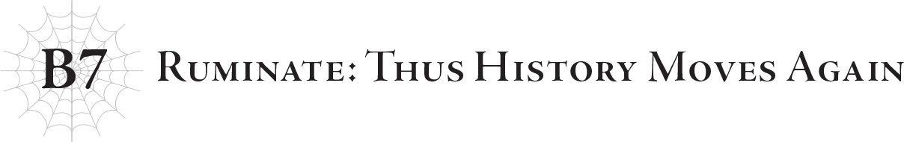

# Trầm tư: Lịch sử lại chuyển động như thế
*(Ruminate: Thus, History Moves Again)*

Việc tạo ra hệ thống là một bước ngoặt lớn trong lịch sử thế giới này.

... Khi nó mới được thiết lập, D đã đưa cho tôi một kịch bản và bắt tôi đọc nó, rồi phát sóng cho tất cả mọi người trên thế giới nghe.

Hãy ghi nhận lại rằng đó chỉ là những lời D ép tôi phải nói, chứ không phải suy nghĩ của cá nhân tôi.

Hèm! Thôi, chúng ta đừng bàn sâu thêm về sự cố đó làm gì.

Dù sao thì, khi hệ thống được áp dụng, thế giới này đã thay đổi một cách chóng mặt.

Sariel, loài rồng, và con người...

Sự cân bằng mong manh giúp thế giới này vận hành đã hoàn toàn bị đảo lộn kể từ khi D xuất hiện.

Nghe có vẻ không đúng lắm khi nói thế giới đã trở thành món đồ chơi của D, nhưng thực tế là kể từ thời điểm đó, nó thực sự đã thuộc về ả.

Kết quả là, không vị thần nào khác có thể can thiệp vào thế giới này nữa.

Sẽ không một ai trong số họ ngu ngốc đến mức liều lĩnh can thiệp vào lãnh địa của D.

Nhờ vậy, mặc dù thế giới của chúng tôi trở thành một món đồ chơi, nhưng đồng thời nó cũng được đặt dưới sự bảo hộ của D.

Trong chuỗi sự kiện hỗn loạn đó, con người đã rút cạn năng lượng MA, đẩy hành tinh này đến bờ vực diệt vong.

Loài rồng đã để lại một vết sẹo khổng lồ trên thế giới rồi bỏ trốn, còn Sariel thì cố gắng hy sinh bản thân mình để cứu vớt nó.

Mặc dù cuối cùng, có vẻ như cỗ máy mà Potimas chuẩn bị với danh nghĩa giải cứu thế giới sẽ chẳng mang lại hiệu quả đó.

Hửm? Sao cơ?

Bạn hỏi liệu Sariel không thể nhìn thấu lời nói dối đó sao?

... À thì, bạn thấy đấy, xét về mặt chuyên môn thì Sariel chỉ chuyên về chiến đấu.

Nói thẳng ra, cô ấy có phần là một kẻ đầu óc chỉ biết đến cơ bắp...

Tôi nghi ngờ việc Sariel có thể hiểu được chi tiết các thuật thức ma pháp cổ đại được tích hợp bên trong công nghệ của Potimas.

Dù sao thì, khi cô ấy kích hoạt cỗ máy, D đã can thiệp và đưa cô ấy đi để làm lõi cho hệ thống. Nếu không, cô ấy đã hy sinh một cách vô ích.

Và một mình Potimas sẽ hưởng hết mọi lợi lộc.

... Thật là một hành động không thể dung thứ.

Hãy nghĩ về cảm xúc của Sariel khi cô ấy hiến dâng bản thân làm vật tế, về cảm xúc của những đứa trẻ ở cô nhi viện khi chúng nói lời tạm biệt cô ấy...

Và cả quyết tâm của Dustin nữa.

Kế hoạch của Potimas đã chà đạp lên tất cả những tình cảm cao quý của họ.

Không thể bào chữa. Hoàn toàn không thể chấp nhận được!

... Thế nhưng, tôi lại bị cấm can thiệp vào Potimas.

"Chúng ta là các quản trị viên, chỉ nên quan sát và điều chỉnh thôi. Như thế mới giống các vị thần thực thụ, đúng không? Thế nên ta e là ngươi không được cố giết một cá nhân cụ thể nào đâu nhé. Sariel chắc cũng không muốn thế đâu nhỉ?"

Đó là những gì D đã nói với tôi...

Không nghi ngờ gì nữa, ả nghĩ rằng mọi chuyện sẽ thú vị hơn nếu Potimas còn sống.

D coi thế giới này như một công cụ giải trí, từ đầu đến cuối.

Nếu tôi vẫn quyết định xóa sổ Potimas, tôi không biết chuyện gì sẽ xảy ra với Sariel và hệ thống.

Vì thế, cuối cùng tôi đã không làm gì cả.

Dẫu vậy, ít nhất tôi cũng đã cảnh cáo Potimas một lời.

Nếu ngươi dám làm chuyện gì quá trớn, tôi bảo hắn, ta sẽ giết ngươi.

Nếu ngươi dám tìm cách rời khỏi hành tinh này, ta sẽ giết ngươi.

Phải nói rằng, lời đe dọa đó đã hoạt động cực kỳ hiệu quả.

Nhờ vậy, hắn chỉ dám thu mình lại bên trong kết giới của làng Elf và không thể thực hiện các âm mưu quy mô lớn như trước nữa.

Thực chất, tôi không thể đụng đến Potimas do mệnh lệnh của D, nhưng hắn đâu cần biết điều đó.

Hơn nữa, dù tôi không thể làm hại bản thân Potimas, ít nhất tôi cũng có thể triệt hạ các loại vũ khí cơ giới quá đà của hắn.

Tuy không thể giải quyết tận gốc vấn đề, nhưng ít nhất tôi vẫn có thể cản trở các hành động của hắn.

Suy cho cùng, Potimas vẫn dư sức hủy diệt thế giới này nếu hắn có ý định đó.

Tôi chắc chắn mình ít nhiều đã có ích trong việc ngăn cản hắn.

... Ít nhất, tôi phải tự nhủ bản thân như thế, nếu không tôi sẽ không thể chịu đựng nổi.

Làm một quản trị viên quả thực là một vị trí vô cùng áp lực.

Đó là lý do vì sao thỉnh thoảng tôi lại tìm cách thay đổi không khí.

Cụ thể là bằng cách tạo ra một cơ thể thứ hai cho mình và hòa mình vào cuộc sống của con người.

Giống như những gì tôi đang làm dưới danh phận Hyrince hiện tại.

Sống dưới tư cách một con người mang lại những góc nhìn mới mẻ và những bài học sâu sắc mà tôi sẽ không bao giờ có được khi chỉ đứng ngoài quan sát.

Và việc được sống tùy thích như một con người bình thường, thay vì làm một quản trị viên, chắc chắn vô cùng tự do.

Hơn nữa, nhờ tiếp xúc gần gũi như vậy với loài người, tôi dần cảm thấy sẵn sàng tha thứ cho họ.

Đối với tôi, mọi chuyện đã trở nên rõ ràng rằng họ cũng đang nỗ lực hết mình để sinh tồn.

Tôi từng làm một thương nhân, một nông dân, một mạo hiểm giả.

Trong vô số kiếp sống khác nhau dưới hình hài con người, tôi đã không ít lần có được những cuộc chạm trán tình cờ đầy may mắn.

Tất nhiên đôi khi tôi cũng gặp những kẻ không mấy dễ chịu, nhưng trong hầu hết mọi kiếp sống tôi từng trải qua, tôi luôn có thể kết giao với ít nhất một người bạn loài người mà tôi hoàn toàn tin tưởng.

Trong trường hợp của Hyrince, tôi đoán đó chính là Julius.

Yaana, Jeskan, Hawkin... Gặp gỡ tất cả bọn họ cũng là một ân huệ lớn lao, nhưng điều đó chỉ xảy ra vì tôi đã gặp Julius trước.

Việc người bạn thuở nhỏ của Hyrince là Julius trở thành anh hùng quả thực chỉ là một sự trùng hợp ngẫu nhiên.

Thông thường, tôi sẽ không bao giờ cố gắng tiếp cận anh hùng — một con người có tầm ảnh hưởng đặc biệt mạnh mẽ đối với thế giới, nhưng lần này tôi đã vô tình bị cuốn vào và cuối cùng can thiệp một chút.

Tôi đơn giản là không thể khoanh tay đứng nhìn cậu ấy tự xoay xở một mình.

Khả năng thu hút mọi người xung quanh có lẽ là thế mạnh lớn nhất của Julius.

... Cậu ấy thực sự là một người vĩ đại.

Đó là lý do vì sao tôi rất hy vọng cậu ấy sẽ được hạnh phúc, nhưng đáng tiếc thay...

Dẫu vậy, tôi nghi ngờ việc bản thân mình trong quá khứ có thể tin được rằng một ngày nào đó tôi lại đi cầu chúc hạnh phúc cho một con người.

Nhưng quá nhiều thời gian đã trôi qua, thật khó để cứ mãi giữ lòng oán giận suốt ngần ấy năm tháng.

Tôi nghĩ thời gian trôi qua đã đủ lâu để tôi, và cả thế giới này, có thể tha thứ cho con người.

Dù cho cô ấy có nói gì đi nữa, tôi tin rằng sâu trong thâm tâm, Ariel không thực sự căm ghét con người đến thế.

... Hoặc có lẽ đó chỉ là mong muốn chủ quan của tôi.

Nhưng Ariel đã dõi theo thế giới này suốt thời gian dài đằng đẵng giống như tôi.

Cô ấy cũng có đủ sức mạnh để mang lại sự hủy diệt cho nhân loại, dù không nhiều bằng Potimas.

Việc cô ấy không làm vậy dường như đã là câu trả lời quá đủ đối với tôi.

Trong số những đứa trẻ ở cô nhi viện vô cùng đặc biệt đó, Ariel từng là cô bé trầm tính và bình thường nhất trong tất cả.

Bất kể cô ấy đã đạt được bao nhiêu sức mạnh đi chăng nữa, sâu thẳm bên trong cô ấy vẫn là một cô gái nhân hậu, người sẽ không bao giờ có thể làm một chuyện tàn ác như vậy.

Nhưng giờ đây, tôi lại để cô ấy bị trói buộc vào vai trò Ma Vương...

Tôi cũng rất hy vọng cô ấy có thể được sống một cuộc đời êm đềm và yên bình...

Chẳng có việc gì diễn ra theo ý tôi muốn cả.

Sariel, Julius, Ariel...

Tất cả những người tôi từng cầu chúc hạnh phúc đều phải nhận phần thiệt thòi nhất và chịu đựng những nỗi đau thương khủng khiếp.

... Nhưng có vẻ như, chuyện đó cũng sắp sửa đi đến hồi kết rồi.

Trong khi tôi chỉ có thể khoanh tay đứng nhìn mà chẳng thể làm gì suốt nhiều thế kỷ đằng đẵng qua, thì thực thể đó lại mang đến những thay đổi chóng mặt cho thế giới này chỉ trong vòng vài năm ngắn ngủi.

Đến lúc này rồi thì không có gì cản nổi nữa.

Tôi không biết cái kết này sẽ có hình thức như thế nào.

Không, tôi sẽ không ước mong một cái kết hoàn mỹ, nơi mọi người và mọi thứ đều được cứu rỗi.

Tôi không thể làm thế.

Chúng tôi đã mất mát quá nhiều để giấc mơ đó có thể trở thành hiện thực.

Nhưng nếu tôi được phép cầu mong cho có nhiều người được cứu rỗi nhất có thể...

Thì tôi sẽ cầu nguyện.

Và nếu chỉ cầu nguyện thôi là chưa đủ, thì...

Thì tôi sẽ phải chuẩn bị sẵn sàng tinh thần.

Rất có thể thời điểm tôi bị buộc phải hành động sẽ đến, sau một thời gian quá dài nằm im bất động và vô tích sự.

Liệu tôi có quyền hành động vào lúc này không, khi từ trước đến nay chưa từng làm vậy?

Tôi không thể phủ nhận những nghi ngờ đó đang giày vò mình, nhưng đã đến lúc phải quên đi những suy nghĩ như vậy.

Ariel và những người khác đã phải nhận lấy phần thiệt thòi nhất suốt thời gian dài đằng đẵng qua rồi.

Đã đến lúc tôi tự rút lấy lá thăm của riêng mình.

Bất kể chuyện gì có thể xảy ra với tôi vì điều đó đi chăng nữa.

---

[◀ Chương trước: Lãnh chúa được báo thù](28_l7_the_lord_avenged.md) | [Chương tiếp theo: Chương 8: Kết thúc trận chiến: Kẻ bước đi cùng Lãnh chúa ▶](30_ch8_end_of_battle_she_who_walks_with_the_lord.md)
