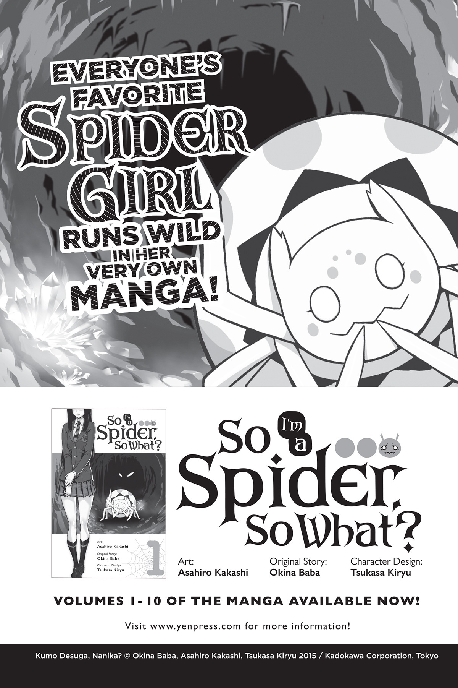

# Lời bạt
*(Afterword)*

Chúc mừng năm mới! Tôi là Baba Okina đây!

Năm ngoái quả là một năm đầy khó khăn, thế nên tôi rất hy vọng năm nay sẽ là một năm tốt đẹp.

Nhất là khi anime cuối cùng cũng đã bắt đầu khởi chiếu!

Đúng vậy đó! Bản chuyển thể anime đã chính thức lên sóng rồi. Mọi người nhất định phải đón xem nhé!

Đến khi cuốn sách này được bày bán, tôi cá là mọi người đã bắt đầu thảo luận về tập đầu tiên rồi. Chỉ nghĩ đến thôi cũng khiến tim tôi đập thình thịch!

Ủa?! Lẽ nào đây chính là tình yêu?! (Không hẳn đâu...)

Nó không thực sự là tình yêu, nhưng tôi hy vọng anime sẽ mang lại những cảm xúc hồi hộp, phấn khích cho toàn thể khán giả theo dõi.

Giờ thì, vì lần này tôi không còn nhiều khoảng trống (xét theo số trang) nữa, nên chúng ta hãy cùng đi nhanh qua những lời cảm ơn ngắn gọn nào!

Tsukasa Kiryu-sensei, họa sĩ minh họa.

Asahiro Kakashi-sensei, họa sĩ chuyển thể manga.

Gratinbird-sensei, tác giả của bộ truyện ngoại truyện.

Tất cả những ai tham gia vào việc sản xuất anime.

Biên tập viên W của tôi, và mọi người khác đã giúp đưa cuốn sách này đến với thế giới.

Tất cả các độc giả đã đón nhận cuốn sách này.

Và cuối cùng nhưng không kém phần quan trọng, khán giả theo dõi anime!

Cảm ơn mọi người từ tận đáy lòng.

---

---

[◀ Chương trước: Chương 8: Kết thúc trận chiến: Kẻ bước đi cùng Lãnh chúa](30_ch8_end_of_battle_she_who_walks_with_the_lord.md) | [Chương tiếp theo: Bản quyền ▶](32_copyright.md)
