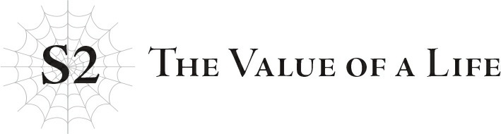

# S2: Giá trị của một mạng sống
*(The Value of a Life)*

Tôi nghĩ mình sẽ không bao giờ quên được lần đầu tiên bản thân tiêu diệt một con quái vật; đó là khi tôi hạ gục con Địa Phi Long kia.

Thế giới này sở hữu các kỹ năng, chỉ số và điểm kinh nghiệm, cho phép bạn tăng cấp nếu tiêu diệt được quái vật.

Được tái sinh vào một thế giới đậm chất RPG như thế này, tôi đã sống những chuỗi ngày với cảm giác rằng đây thực sự chỉ là một trò chơi.

Nhưng tôi đã nhận ra mình sai lầm đến mức nào khi Natsume, nay là Hugo, suýt chút nữa đã lấy mạng tôi.

Và rồi, tôi đã tự tay tước đoạt sinh mạng của một con quái vật.

Thành thật mà nói, chuyện đó xảy ra ngay sau sự kiện kia.

Khi Hugo suýt giết chết tôi, chuyện đó đã thay đổi hoàn toàn quan niệm của tôi về cuộc sống.

Nói thẳng ra thì, cho đến thời điểm đó, đầu óc tôi vẫn còn lơ lửng trên mây.

Tôi là Tứ hoàng tử, một hoàng tộc nửa mùa.

Tôi không thiếu thốn bất cứ thứ gì trên đời, nhưng là một hoàng tử thì tôi hầu như bị phớt lờ, dẫu vậy vẫn chưa đến mức có thể sống hoàn toàn theo ý mình.

Cũng giống như danh phận hoàng tộc của tôi, sự tự do mà tôi được ban cho cũng nửa vời như thế.

Nhưng tôi không hề có lời phàn nàn nào về chuyện đó.

Tôi được sống tương đối thảnh thơi và không phải lúc nào cũng phải hành xử như một hoàng tộc cứng nhắc.

Tôi đã luyện tập và mài giũa các kỹ năng của mình, háo hức lắng nghe những câu chuyện anh hùng của hoàng huynh Julius, và mơ mộng một ngày nào đó bản thân cũng sẽ trở nên oai hùng như vậy.

Ở vị thế của tôi, tôi được phép có những ảo tưởng trẻ con như thế.

Thế nhưng giấc mơ ngây thơ đó đã bắt đầu rạn nứt khi Hugo cố giết tôi, và cuối cùng nó đã vỡ vụn thành trăm mảnh khi tôi tiêu diệt một con Địa Phi Long ngay sau đó.

Tôi đã trải qua cảm giác suýt bị ai đó giết chết.

Rồi tôi lại trải qua cảm giác tự tay tiêu diệt một con quái vật.

Cả hai đều là những trải nghiệm mà tôi sẽ không bao giờ có được khi còn ở Nhật Bản.

Cho đến trước lúc đó, tôi vẫn luôn nghĩ cuộc sống này giống như một trò chơi hơn là sự tiếp nối của kiếp trước.

Giống như một màn chơi thưởng sau khi tôi đã qua đời.

Nhưng sát ý mà Hugo nhắm vào tôi là thật, và cảm giác khi đánh bại con Địa Phi Long kia cũng sống động đến đáng sợ.

Khi chiến đấu với Hugo, tôi đã vô cùng bối rối và choáng ngợp đến mức không có thời gian để cảm nhận nỗi sợ hãi, nhưng sau khi được cứu, cơ thể tôi bắt đầu run rẩy dữ dội.

Còn khi đối đầu với con Địa Phi Long, tôi đã quá cuốn vào trận chiến đến mức chẳng thể nghĩ ngợi gì về việc tước đoạt một sinh mạng, cho đến khi tận mắt nhìn thấy cái xác của nó và nôn thốc nôn tháo.

Trên hết, sau đó tôi mới biết được rằng con quái vật đó chính là cha mẹ của Fei.

Con Địa Phi Long đó có lẽ đã đi tìm Fei, đứa con của nó, suốt bao nhiêu năm trời.

Một khi ý nghĩ đó thoáng qua trong đầu, tôi không thể coi cuộc sống này là một trò chơi được nữa.

Kể từ đó, tôi đâm ra sợ hãi việc phải chiến đấu với quái vật.

Nhưng trải nghiệm suýt bị Hugo giết chết đã giữ cho nỗi sợ hãi đó nằm trong tầm kiểm soát.

Tôi buộc phải trở nên mạnh mẽ hơn, bằng không tôi sẽ chẳng thể tự bảo vệ nổi chính mình.

Sau khi chiến đấu với Hugo và rồi đến con Địa Phi Long, tôi biết chắc chắn rằng mình không thể trở thành một người anh hùng mạnh mẽ và cao quý bảo vệ toàn nhân loại như hoàng huynh Julius.

Tôi nhận ra việc được kề vai sát cánh chiến đấu cùng anh trai là một giấc mơ xa vời hơn nhiều so với những gì tôi từng tưởng tượng.

Tôi không bao giờ có thể gánh vác một gánh nặng to lớn như vận mệnh của cả nhân loại.

Nhưng tôi muốn mình đủ mạnh để bảo vệ những người xung quanh.

Vì vậy, tôi đã chọn đối mặt với quái vật một lần nữa.

Tại trường học, chúng tôi có các trận đấu tập một chọi một với quái vật.

Vì được dùng cho những học sinh chưa có kinh nghiệm thực chiến, lũ quái vật đó khá yếu.

Chúng thực chất chỉ giống như loài gặm nhấm, nhỏ đến mức ngay cả một người trưởng thành không có nhiều kinh nghiệm chiến đấu cũng có thể xử lý được.

Nhưng dẫu vậy, quái vật vẫn là quái vật.

Chúng là loài gây hại luôn chủ động tấn công con người; ngay cả những con yếu nhất cũng có thể gây họa nếu không bị tiêu diệt.

Bất kể yếu thế nào, quái vật nào cũng có khả năng gây nguy hiểm.

Chẳng hạn, loại quái vật mà bất kỳ người lớn nào cũng có thể đánh bại vẫn sẽ nguy hiểm đối với trẻ con.

Và một người lớn vẫn có thể bị thương khi đối phó với chúng, hoặc thậm chí là mất mạng nếu lơ là cảnh giác.

Ngay cả những con quái vật yếu ớt đó vẫn cướp đi sinh mạng hoặc làm bị thương nhiều người mỗi năm.

Trên thực tế, các trận chiến thực tế với quái vật tại học viện vừa nhằm mục đích giúp học sinh tích lũy kinh nghiệm, vừa để giảm bớt số lượng quái vật.

Thế nên việc do dự khi tiêu diệt một con quái vật là điều hoàn toàn vô lý.

Vậy mà...

Mỗi khi có một con quái vật cố gắng giết tôi, tôi đều có thể cảm nhận được ý chí sinh tồn của nó.

Nó đang tự suy nghĩ và hành động như một sinh vật sống, chứ không chỉ là một chương trình được lập trình sẵn trong game.

Tôi đã quá ngây thơ khi đối đầu với quái vật, hay nói đúng hơn là với bất kỳ sinh vật sống nào.

Và ý tôi không phải là tôi đang xem thường chúng.

Chỉ số của tôi thuộc dạng cao so với lứa tuổi, và tôi có thể dễ dàng tự mình đánh bại một con quái vật yếu ớt.

Nhưng vấn đề không phải ở chỗ đó.

Thật khó để diễn tả cảm xúc ấy bằng lời.

Nhưng sau khi đối mặt với một con quái vật dưới hình dạng Địa Phi Long, tôi hiểu ra rằng chiến đấu là một trải nghiệm vô cùng chân thực và đáng sợ.

Tóm lại, tôi đã sợ hãi.

Sợ con quái vật đang lao về phía mình để lấy mạng... và sợ cả ý nghĩ tự tay tiêu diệt nó.

Mỗi khi tôi vung kiếm định hạ gục một con quái vật, tôi lại nhớ về cái xác của con Địa Phi Long kia.

Kết quả là tôi đã không thể kết liễu con quái vật trong trận đấu đầu tiên, mà chỉ biết tránh né các đòn tấn công của nó.

Sau đó, Parton, một thành viên khác trong nhóm của tôi, nhận ra tôi đang chật vật nên đã ra tay kết liễu nó.

Chỉ đơn giản thế thôi.

“Tại sao chứ...?” Tôi hỏi cậu ấy.

Ngay cả chính tôi cũng không rõ mình đang hỏi “tai sao” về điều gì nữa.

Tôi chỉ buột miệng nói ra từ duy nhất xuất hiện trong đầu lúc đó.

“Ồ, xin lỗi Điện hạ. Trông người có vẻ đang gặp khó khăn nên tôi mới tự ý xen vào.”

Parton trả lời với giả định rằng tôi đang hạch hỏi lý do cậu ấy cướp con mồi của tôi.

“Nhưng chắc tôi làm hơi quá rồi. Tôi nên nhận ra là một con quái vật yếu thế này không thể làm khó được người chứ, Điện hạ Schlain. Ồ, tôi hiểu rồi! Người đang quan sát chuyển động của con quái vật phải không! Hóa ra người quan sát ngay cả những con quái vật yếu nhất mà không hề lơ là cảnh giác. Thật đáng học hỏi.”

Không. Cậu sai rồi.

Đó không phải là điều tôi muốn hỏi, cũng không phải là lý do tôi không thể đánh bại con quái vật.

Nhưng giờ thì tôi đã hiểu.

Dù tôi có muốn hay không.

Đây chính là sự khác biệt lớn giữa thế giới này và Nhật Bản.

Ở thế giới này, mạng sống bị coi nhẹ.

Quá đỗi nhẹ nhàng.

Việc giết quái vật là điều hiển nhiên.

Bạn buộc phải tiêu diệt chúng, bởi vì chúng là kẻ thù.

Thậm chí con người cũng có thể tàn sát lẫn nhau chỉ vì một lý do cỏn con.

Và người dân ở thế giới này hoàn toàn không hề bận tâm đến những sinh mạng mà họ đã tước đoạt.

Họ lấy đi mạng sống của kẻ khác như thể đó chỉ là một công việc vặt thường ngày.

Parton cũng không biểu lộ chút cảm xúc gì khi giết chết một con quái vật.

Dù tôi cũng chẳng có tư cách gì để nói người khác.

Tôi vẫn ăn thịt khi còn sống ở Nhật Bản, và thỉnh thoảng cũng giết côn trùng.

Tôi không thể khẳng định rằng mạng sống của côn trùng, thú vật và con người đều có giá trị ngang nhau.

Với lại tôi biết quái vật là loài sinh vật nguy hại chuyên tấn công con người, và bạn phải tiêu diệt chúng nếu không muốn chính mình bị giết.

Nhưng tôi cảm thấy việc giết quái vật một cách thản nhiên như giết côn trùng là điều không đúng đắn.

Dẫu vậy, cuối cùng tôi vẫn phải nghiến răng tự tay tiêu diệt một con quái vật vào ngày hôm đó.

Tôi sợ mình sẽ làm phản bội lại ánh mắt ngưỡng mộ của Parton.

Hơn tất cả, tôi nhớ lại lúc Hugo tấn công và suýt nữa đã giết chết tôi.

Tôi biết mình phải trở nên đủ mạnh để ít nhất có thể tự vệ, và tôi đã lấy đó làm động lực để tước đoạt mạng sống của một con quái vật hòng tăng cấp.

Tôi đã sát hại một sinh vật sống chỉ vì sự ích kỷ của bản thân.

Tôi sẽ không quên chuyện đó. Tôi không thể.

Cảm giác lưỡi kiếm của tôi xé toạc lớp da, rạch qua từng thớ thịt, chặt đứt xương tủy.

Mùi máu tươi phun ra tanh tưởi.

Tiếng kêu gào thảm thiết trước khi chết của con quái vật.

Tôi đã khắc sâu khoảnh khắc sinh vật đó trút hơi thở cuối cùng vào tâm trí mình.

Đó là một cái chết quá đỗi chân thực, hơn bất kỳ hình ảnh đồ họa CG nào trong trò chơi.

Ở Nhật Bản, các loài gây hại đôi khi cũng bị tiêu diệt.

Không chỉ vậy, thịt xếp trên các kệ hàng cũng từng thuộc về những chú bò, chú heo sống.

Con người bắt buộc phải tước đoạt sinh mạng của loài khác để duy trì sự sống.

Chúng ta, con người, đã cướp đi vô số sinh mạng trong suốt cuộc đời mình, dù là gián tiếp.

Nhưng tôi chưa từng nhận ra việc chủ động tước đoạt một sinh mạng lại mang lại cảm giác nặng nề đến nhường nào.

Và rồi tôi không khỏi suy nghĩ... nếu việc tiêu diệt một con quái vật đã tồi tệ đến thế này, thì cảm giác khi giết một con người sẽ còn kinh khủng đến mức nào nữa?

Thật đáng sợ.

Chỉ nghĩ đến thôi cũng đủ khiến tôi run sợ.

Làm sao Hugo lại có thể làm được một chuyện như vậy chứ?

Nếu cậu ta cũng từng trải qua những điều tương tự, chắc chắn cậu ta sẽ không nghĩ đây là một thế giới đẹp như mơ.

Thế giới này trông có vẻ giống một trò chơi, nhưng nó không phải vậy.

Ngay cả khi mạng sống ở đây có vẻ không đáng giá bằng, chúng vẫn trân quý hệt như khi còn ở Trái Đất.

Chỉ là người dân ở đây không nhận ra điều đó mà thôi.

Tôi hiểu rồi.

Trong một thế giới chiến tranh triền miên này, bạn không còn cách nào khác ngoài việc coi rẻ mạng sống của kẻ thù.

Họ tiêu diệt quái vật và ma tộc là để bảo toàn mạng sống của chính mình.

Dĩ nhiên là tôi sẽ không yêu cầu họ phải dừng lại.

Chính tôi cũng đã tiêu diệt quái vật vì bản thân mình đấy thôi.

Mỗi sinh mạng mà bạn tước đoạt là một cây thập giá mà bạn buộc phải gánh vác.

Tôi hiểu được nỗ lực giảm bớt gánh nặng bằng cách xem nhẹ mạng sống.

Nhưng điều đó không có nghĩa là tôi sẵn sàng thay đổi quan điểm của mình một cách chóng vánh chỉ để xuôi theo dòng chảy.

Bởi vì tôi từng biết một người anh hùng đã theo đuổi lý tưởng của mình cho đến tận lúc lâm chung, dù biết rõ rằng chúng là bất khả thi.

“Anh biết mình chỉ đang mơ mộng. Anh không quan tâm nếu mọi người cười nhạo anh là kẻ phi thực tế. Nhưng không có gì sai khi có một mục tiêu để phấn đấu cả. Mục tiêu của anh là một thế giới nơi mọi người đều có thể sống hạnh phúc trong hòa bình. Và anh sẽ tiếp tục theo đuổi lý tưởng đó cho đến ngày anh nhắm mắt xuôi tay.”

Julius đã nói như thế và tiếp tục chiến đấu.

Thật mâu thuẫn làm sao: chiến đấu vì hòa bình.

Anh ấy đã trăn trở với điều đó, nhưng chưa bao giờ để lộ sự đau khổ của mình trước mặt tôi mà cứ thế tiếp tục chiến đấu.

Tôi quyết định muốn tiếp nối lý tưởng của Julius.

Tôi sợ hãi việc chiến đấu.

Sợ việc tước đoạt mạng sống.

Và sợ cả việc bản thân bị cướp đi sinh mạng.

Tôi không thể trở thành một người anh hùng chiến đấu với lòng kiên quyết và quyết tâm sắt đá như Julius.

Ngay cả mục tiêu của tôi cũng chỉ là sự bắt chước lại những gì Julius từng nói với tôi.

Tôi chỉ là một anh hùng giả mạo, nửa vời và hèn nhát.

Nhưng một phần trong tôi nghĩ rằng, có lẽ chính nhờ con người này của mình mà tôi lại có thể làm được một số việc.

Chẳng hạn như, việc hiểu được giá trị thực sự của một mạng sống có lẽ chính là bước đầu tiên.

Có lẽ những giá trị quan có được từ việc sinh ra và lớn lên ở một đất nước hòa bình như Nhật Bản sẽ có ích phần nào ở thế giới này.

Ngay cả khi không thể chấm dứt toàn bộ chiến tranh, ít nhất tôi vẫn có thể ngăn chặn một vài cuộc xung đột.

Tôi không đủ tư cách để làm một anh hùng, nhưng tôi vẫn muốn tìm cách để trở nên có ích.

Tôi muốn làm tất cả những gì có thể, bằng tất cả khả năng của mình.

Tôi đã tin vào điều đó trước khi bị Natsume trục xuất khỏi vương quốc, và sau đó tôi vẫn tiếp tục kiên trì với nó, gánh vác bất kỳ trọng trách nào được giao phó.

Thế nên, khi nghe thấy sự thật về thế giới này được kể ra như thể đang giễu cợt đức tin của tôi và ước mơ của Julius, tôi đã không giữ được bình tĩnh.

Tôi nhận ra mình đã lỡ lời ngay khi nhìn vào khuôn mặt của Kyouya.

Cậu ấy trông như thể đang kiềm chế một nỗi đau đớn của riêng mình.

Khi nhìn thấy biểu cảm đó và nhận ra rằng Kyouya thực chất cũng chẳng hề muốn giết hại tộc Elf, một phần trong tôi cảm thấy nhẹ nhõm.

Nhưng chừng đó vẫn chưa đủ để làm dịu đi cơn bão cảm xúc trong lòng tôi, và tôi cũng chẳng thể mở lời buộc tội cậu ấy thêm nữa. Vì vậy, tôi chỉ biết tiếp tục nhìn đăm đăm vào gương mặt của Kyouya.

“...Xin lỗi cậu. Tớ đã hơi kích động và nói quá nhiều.”

Sau một lúc, cuối cùng tôi cũng bình tĩnh lại để nói lời xin lỗi với người bạn cũ.

Vì một lý do nào đó, tôi có cảm giác việc đổ hết mọi lỗi lầm lên đầu Kyouya là không đúng.

“Không, cậu không cần phải xin lỗi đâu. Cậu nói đúng đấy, Shun.” Kyouya khẽ lắc đầu. “Tớ thực sự ghen tị với khả năng kiên trì bảo vệ những điều đúng đắn của cậu.”

Đột nhiên, tôi cảm thấy thật khó tin khi vẻ mặt mỏng manh, kiệt quệ này lại thuộc về cùng một người đã tàn nhẫn sát hại tộc Elf không ghê tay.

Khuôn mặt đó cho tôi biết rằng Kyouya cũng đã phải trải qua rất nhiều chuyện và có những lý do của riêng mình.

Sau khi để lộ vẻ yếu đuối đó chỉ trong một khoảnh khắc, Kyouya nhắm mắt lại. Khi cậu ấy mở mắt ra lần nữa, ngọn lửa đã quay trở lại trong ánh nhìn.

“Cậu nói đúng. Nhưng tớ sẽ không thay đổi con đường của mình lúc này. Và tớ cũng sẽ không hối hận vì những gì mình đã làm.”

Trong đôi mắt ấy, tôi thấy được sự kiên định của một người đàn ông sẽ không bao giờ lùi bước trước đức tin của mình.

Những đức tin mà sẽ không bao giờ có thể dung hòa được với của tôi...

---

[◀ Chương trước: Chương 2: Thế giới này tàn nhẫn đến tột cùng](03_ch2_the_world_is_terribly_cruel.md) | [Chương tiếp theo: Chương 3: Nếu không đủ mạnh thì tốt nhất nên ngoan ngoãn cúi đầu ▶](05_ch3_if_you_re_not_strong_enough_you_d_better_get_groveling.md)
