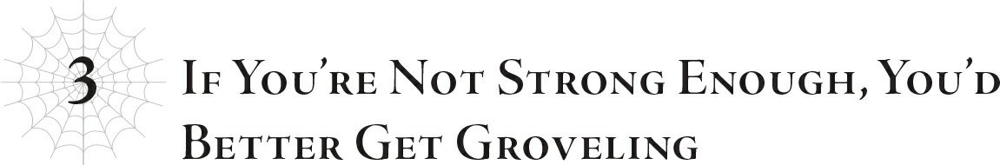
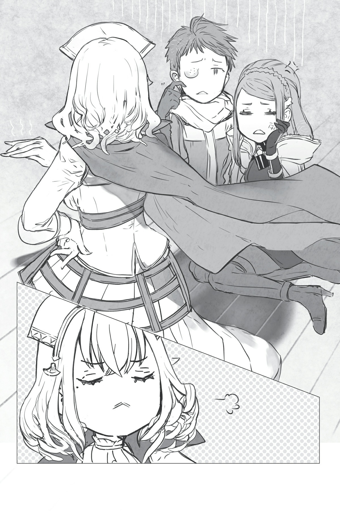
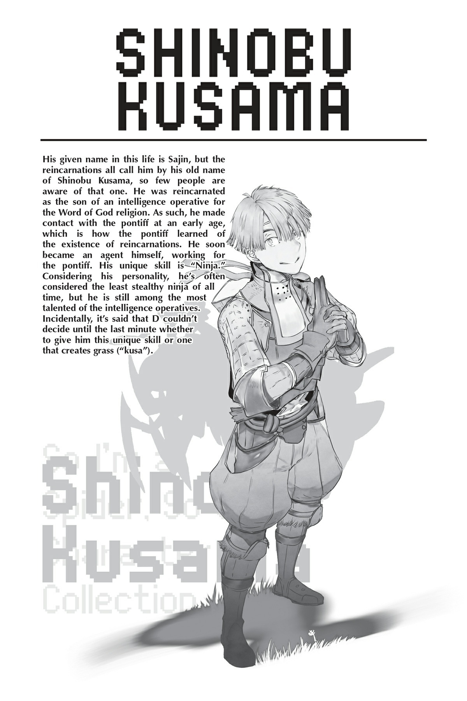

# Chương 3: Nếu không đủ mạnh thì tốt nhất nên ngoan ngoãn cúi đầu
*(If You’re Not Strong Enough, You’d Better Get Groveling)*

“Này, xin lỗi nha. Tớ biết các cậu đang nói chuyện siêu nghiêm túc, nhưng mà…”

Bầu không khí căng thẳng đến nghẹt thở đột nhiên bị cắt ngang bởi một người mà tất cả chúng tôi hoàn toàn quên mất: Kusama.

Vẫn đang bị trói mặt đối mặt với Ogiwara trong một tư thế cực kỳ lố bịch, cậu ta nheo mắt đầy nghiêm trọng khi tiếp lời.

“Tớ sắp tè ra quần rồi. Cho tớ đi vệ sinh được không?”

Sự thay đổi biểu cảm trên gương mặt Ogiwara diễn ra ngay tức khắc và trông cực kỳ buồn cười.

Nó chuyển từ vẻ mặt ngán ngẩm kiểu *thôi đi ông tướng, nhìn nhận hoàn cảnh hộ cái* sang kinh hoàng tột độ kiểu *mày đùa tao đấy à?!*

Mà cũng phải thôi, tôi chẳng thể trách cậu ta được khi bị trói chặt vào gã đó như vậy.

Nếu Kusama thực sự tè dầm, đó sẽ là một trải nghiệm kinh hoàng cho kẻ đang gần như dính chặt vào người cậu ta.

Ở vị thế của cậu ta, tôi chắc chắn cũng sẽ làm bộ mặt đó thôi.

“Tớ thấy đâu có vấn đề gì đâu nhỉ? Dù sao thì có vẻ như một số người trong chúng ta cũng cần hạ hỏa rồi. Đây có thể là thời điểm tốt để nghỉ giải lao đấy.”

Trước khi tôi kịp nói lời nào, Vampy đã tự ý tuyên bố tạm nghỉ.

Hơn nữa, ngay khi vừa dứt lời, cô nàng đã đứng dậy, vươn vai và thướt tha bước ra khỏi cửa.

Chà. Dù cô nàng không hề có ý định che giấu sự thờ ơ của mình, nhưng tôi đoán cô nàng còn thấy chán chường hơn cả tôi tưởng nữa.

“Vậy tớ đi tiểu đây!”

Kusama hét lên một tiếng rồi nhảy dựng lên biến mất.

Cậu ta đột ngột biến mất tăm, cứ như thể chưa từng bị trói bao giờ vậy.

Ồ, cừ khôi đấy.

Cái đó thực sự khá là giống ninja.

Hóa ra cậu ta có thể trốn thoát bất cứ lúc nào mình muốn à.

Nhưng vì cậu ta đã chọn cách chờ đợi và xin phép, biết đâu cậu ta lại là người biết nhìn nhận hoàn cảnh thì sao?

Thực tế, có lẽ cậu ta cố tình chọn đúng thời điểm nhạy cảm đó để thông báo nhu cầu của mình hòng giải tỏa bầu không khí căng thẳng?

…Ừm, không đờiii nào.

Đánh giá Kusama như thế thì quá đề cao cậu ta rồi.

Tôi cá chắc là bàng quang của cậu ta vừa chạm giới hạn chịu đựng vào đúng khoảnh khắc đó thôi.

Lúc nào cũng có một kiểu người đòi đi vệ sinh vào những thời điểm quan trọng nhất mà.

Kiểu như đang trong giờ kiểm tra ấy.

Sau khi Vampy và Kusama rời đi, những người tái sinh còn lại đứng ngơ ngác một lúc như thể không biết phải làm gì.

Nhưng rồi cậu Oni lặng lẽ nhắm mắt lại, và Yamada phản hồi bằng cách thở ra một hơi thật dài như để giải tỏa sự căng thẳng.

Điều đó thôi thúc những người khác cũng bắt đầu tự ý hành động.

Một số người bắt đầu trò chuyện với người bên cạnh, trong khi số khác thì đi lên cầu thang.

À! Nhắc đến tầng trên, đó là nơi cô Oka đang nghỉ ngơi!

Tôi sẽ đi xem tình hình cô ấy thế nào.

Nếu hỏi liệu tôi rời đi khi đang là người điều phối cuộc họp thế này có ổn không á?

À thì, sau ngần ấy kịch tính thì tôi cũng khá mệt mỏi rồi. Tôi chắc chắn họ có thể tự giải quyết được dù có tôi hay không.

Mà nói đúng hơn, tôi cảm thấy việc tôi có mặt ở đó lúc này cũng chẳng còn quan trọng nữa.

Tôi đứng dậy khỏi ghế và bắt đầu bước về phía cầu thang.

Cảm giác như mọi người còn lại trong phòng đang dán chặt mắt vào lưng tôi, nhưng thôi cứ giả vờ đó chỉ là do tôi tưởng tượng đi.

Kudo và Shinohara đặc biệt như muốn khoét một cái lỗ trên gáy tôi bằng ánh mắt hình viên đạn, nhưng đó đâu phải việc của tôi!

“Nếu cậu định đi xem tình hình cô Oka, tớ đi cùng có được không?”

Tôi đây đang cố gắng bước đi trên thảm đinh bằng thần kinh thép, thế mà một anh hùng nào đó lại cứ thích xen vào phá bĩnh.

Ừ thì, tôi đoán Yamada có tấm lòng của một vị anh hùng và đống giáo điều tương tự.

Hơn nữa, cậu ta đâu có thực sự cần sự cho phép của tôi, chưa kể là cậu ta đã đứng dậy bám theo tôi rồi, dù lời nói được diễn đạt dưới dạng câu hỏi.

Nghĩ đến thôi đã thấy phiền phức rồi, nên tôi chỉ im lặng gật đầu rồi tiếp tục bước đi, không bận tâm đến cậu ta nữa.

Phía sau cậu ta, Ooshima cũng đi theo, như thể chẳng có việc gì tốt hơn để làm.

Vài bước sau họ, Shinohara cũng lặng lẽ bám đuôi.

Tôi luôn nghĩ Shinohara là một kẻ khá là lắm lời, nhưng từ nãy đến giờ cô ta chẳng thốt ra lời nào.

Thế nhưng có thứ gì đó vô cùng căng thẳng trong ánh mắt im lặng của cô ta.

Cảm giác đó càng đáng sợ hơn khi tương phản với bản tính ồn ào thường ngày của cô ta.

Tất cả chúng tôi, bao gồm cả tôi, leo lên cầu thang trong im lặng và đến trước căn phòng cần tìm.

Tôi gõ cửa để tỏ ra lịch sự rồi đợi phản hồi.

Nhưng cánh cửa mở ra từ bên trong mà không ai nói lời nào.

Là Kushitani, người đang trông chừng cô Oka.

“Vào đi. Đi khẽ thôi nhé—cô ấy vẫn đang ngủ.”

Cô ấy hẳn là đã nhận ra chúng tôi đang đến bằng giác quan nhạy bén của một cựu mạo hiểm giả.

Kể từ khi cuộc họp bắt đầu, tôi đã nghĩ rằng Kushitani và Tagawa có vẻ thấu hiểu mọi chuyện hơn phần lớn những người khác vì họ đã trải nghiệm cuộc sống ở cả thế giới bên ngoài lẫn làng Elf.

Và với kinh nghiệm làm mạo hiểm giả độc lập, họ có khả năng đưa ra quyết định tốt hơn những người tái sinh còn lại.

Kushitani cũng đã rất tử tế khi ưu tiên chăm sóc cho cô Oka từ trước.

Theo khía cạnh đó, họ khác với nhóm Yamada, những người dù sống ở thế giới bên ngoài nhưng lại được nuôi dưỡng trong môi trường được bảo bọc kỹ càng hơn.

Khi tôi bước vào phòng theo lời mời của Kushitani, tôi thấy cô Oka đang nằm trên giường.

Lúc trước khi Kushitani bế ra ngoài cô ấy vẫn còn tỉnh táo, nhưng có lẽ đã ngất đi vì kiệt sức hoặc chấn động tâm lý gì đó.

Ngoài chiếc giường cô Oka đang ngủ ra, trong phòng còn có một chiếc giường khác. Trên đó là Hasebe.

Phelmina, người đang trông chừng Hasebe, đang ngồi lặng lẽ bên cạnh.

…Ánh mắt con bé nhìn tôi trông có vẻ hơi lạnh lùng.

Tôi chắc chắn đó chỉ là trí tưởng tượng của tôi mà thôi!

Hôm nay tôi cứ thấy đủ loại ánh nhìn khó chịu hướng về mình, nhưng tôi thề tất cả chỉ là do đầu óc tôi tự vẽ ra thôi!

Ít nhất thì tôi phải tự nhủ với bản thân như vậy!

Hiểu chưa hả?!

“Sức khỏe của cô Oka thế nào rồi?” Yamada hỏi Kushitani.

“Khó nói lắm. Dù sao thì thứ tổn thương là tâm hồn cô ấy chứ không phải thể xác. Hiện tại cô ấy đang ngủ để hồi phục sức lực, nhưng không biết khi tỉnh dậy cô ấy sẽ cảm thấy thế nào đâu.”

Nói đoạn, Kushitani nhún vai.

Cách diễn đạt và tông giọng của cô ấy có vẻ hơi hờ hững, nhưng tôi chắc chắn cô ấy vẫn đang lo lắng cho cô Oka theo cách riêng của mình.

“Thế dưới kia sao rồi?”

Kushitani nhìn tôi, chứ không phải Yamada, khi hỏi câu này.

Cô ấy có lẽ đang thắc mắc về chuyện xảy ra dưới nhà, vì chúng tôi lên đây quá sớm so với thời gian cần thiết để thảo luận xong xuôi mọi chuyện.

“Bọn tớ đang nghỉ giải lao. E là tớ đã làm chệch hướng câu chuyện một chút.”

Yamada nở một nụ cười ngượng ngập.

Hóa ra cậu ta cũng biết mình đã làm rối tung mọi chuyện lên cơ đấy?

“Ừm, tớ cũng không thể trách cậu được. Trong tình huống này, chúng ta có quá nhiều câu hỏi, thật khó để biết nên hỏi cái gì trước.”

Kushitani thở dài một tiếng nhỏ rồi liếc nhìn về phía tôi.

Tôi đoán cô ấy cũng hơi lo ngại về việc phe chúng tôi định làm gì tiếp theo.

Hóa ra ngay cả những cựu mạo hiểm giả dày dạn kinh nghiệm cũng cảm thấy bất an khi không biết chuyện gì sắp xảy ra sao?

“Nhưng có một điều tớ muốn hỏi ngay bây giờ.” Kushitani lấy hết can đảm. “Các cậu định làm gì với bọn tớ sau chuyện này đây, Wakaba?”

Hửm.

Rõ ràng là cô ấy phải lấy rất nhiều dũng khí mới dám hỏi câu đó, nhưng tôi chỉ có một câu trả lời duy nhất…

“Thực ra là không định làm gì cả.”

“Cái gì cơ?”

Ngay cả một người điềm tĩnh như Kushitani cũng lộ vẻ bối rối và không thuyết phục trước câu trả lời của tôi.

“Không định làm gì cả sao…?”

Trông cô ấy như thể sắp bó tay chịu trói đến nơi rồi. Nhưng tôi biết nói gì bây giờ?

Ý tôi là, sự thật đúng là như vậy mà.

Lý do lớn nhất để chúng tôi tấn công và tiêu diệt làng Elf là để hạ gục Potimas.

Lý do lớn thứ hai là giải phóng cô Oka khỏi nanh vuốt của lão ta; việc giải cứu những người tái sinh bị giam giữ chỉ xếp ở vị trí thứ ba mờ nhạt.

Nói thẳng ra thì, giải cứu đám người này chỉ là việc tiện tay sau khi đánh bại Potimas mà thôi.

Nên tôi thực sự chưa từng nghĩ về việc điều gì sẽ xảy ra với những người tái sinh sau chuyện này.

Thành thật mà nói, tôi nghĩ họ nên được tự do làm bất cứ điều gì họ muốn.

Mặc dù việc chỉ nói phũ phàng kiểu “Các cậu tự do rồi đấy. Tự lo liệu đi” rồi vứt họ ở xó xỉnh nào đó thì hơi tàn nhẫn thật. Ít nhất thì tôi cũng sẽ hỗ trợ họ một chút ít.

Nhưng ý tôi là, thôi nào. Bọn họ đều đã là những người trưởng thành cả rồi, đặc biệt là nếu tính cả kiếp trước nữa. Chỉ cần được chu cấp những thứ cơ bản ban đầu, tôi tin họ hoàn toàn có thể tự lo cho bản thân.

Dù tôi không thể ngăn bản thân cảm thấy họ vẫn chưa trưởng thành lên là bao, có lẽ là do đã bị nuôi nhốt quá kỹ ở nơi này.

Dù sao thì, tôi cũng nên giải thích tất cả những chuyện đó với họ, nhưng nghe chừng phiền phức vô cùng.

Nhìn khẩu hình miệng của tôi đây này: Tôi không muốn nói thêm lời nào nữa đâu!

“Tôi sẽ giải thích rõ ràng ở dưới nhà, bao gồm cả chuyện đó. Kushitani, phiền cậu lát nữa nhờ Tagawa kể lại sau nhé.”

Nếu bây giờ tôi giải thích, lát nữa tôi lại phải nói lại từ đầu với những người khác.

Tôi còn chẳng muốn nói đến một lần, nói gì đến hai lần chứ.

Giờ đã xem qua tình hình cô Oka xong, chẳng việc gì phải làm ồn ào thêm trong khi cô ấy đang cần ngủ.

Nên tôi chỉ đang thực hiện một đợt rút lui chiến thuật mà thôi.

Chắc chắn không phải là tôi đang cụp đuôi chạy trốn đâu nhé.

Không phải đâu, được chưa? Tôi thề đấy.

Mặc cho Kushitani, Yamada và những người khác đang trố mắt kinh ngạc nhìn tôi, tôi nhanh chóng quay ngoắt người bước ra khỏi phòng.

Cảm giác như Shinohara đang nhìn tôi bằng ánh mắt sắc lẹm như muốn đâm nát người tôi, nhưng chắc chắn lại là do tôi tự tưởng tượng ra thôi!

Khi tôi trở lại dưới nhà, rõ ràng là bầu không khí vừa mới tạm lắng dịu lại trở nên vô cùng căng thẳng.

Ngay khi tôi vừa xuất hiện, ánh mắt của mọi người lập tức đổ dồn vào tôi.

Hộc.

Hóa ra sự hiện diện của tôi mang lại nhiều áp lực cho các cậu đến thế à? Hiểu rồi.

Kusama vẫn chưa quay lại, và vài người khác cũng đang vắng mặt, nghĩa là chúng tôi vẫn đang trong giờ giải lao đúng không?

Được rồi, thế thì tôi xin phép chuồn khỏi biển ánh mắt này đây!

Ogiwara có vẻ đang quỳ trên sàn vì lý do nào đó, nhưng thôi tôi cứ giả vờ như không thấy gì đi.

Phớt lờ mọi ánh nhìn sắc lẹm như kim châm, tôi hướng thẳng về phía cánh cửa dẫn ra ngoài.

Phù.

Sao ở trong đó lại có cảm giác như đang đứng trên bàn chông thế nhỉ? Khó chịu chết đi đượccc!

Liệu tôi có thể cứ thế rời đi và không bao giờ quay lại nữa được không?

Không được sao?

Rõ rồi…

Khi giờ giải lao kết thúc, tôi lại phải tiếp tục giải thích mọi chuyện, nhưng người phiên dịch tốt nhất của tôi có vẻ đang không ở trong trạng thái tốt cho lắm.

Tôi chắc là không thể trông cậy nhiều vào sự hỗ trợ của cậu Oni rồi.

Trong trường hợp đó, tôi sẽ cần sự trợ giúp từ một người khác, mà thật không may chỉ có đúng một lựa chọn duy nhất…

Nhưng đối tượng được nhắc đến ở đây, tức là nhỏ Vampy, dường như đã triệu hồi một con sói đen để tựa lưng vào và đang thong thả tắm nắng.

Này, Vampy?

Cô nghiêm túc đấy chứ?

Chẳng phải cô là ma cà rồng sao?

Bởi vì việc cô cố tình tắm nắng thế này nghe cứ như đang bôi nhọ tất cả những ma cà rồng khác đang tồn tại trên đời vậy.

Nếu là người khác thì đây hẳn là một khung cảnh ngọt ngào thơ mộng rồi, nhưng con bé lại là ma cà rồng, nên là…

“…Có việc gì không ạ?”

À, thực ra là có đấy.

Bằng cách xin lỗi tất cả những ma cà rồng đang phải sống trong nỗi sợ hãi ánh mặt trời đi!

“Thời tiết đẹp thật đấy nhỉ? Nếu không phải vì cái mùi kinh khủng kia thì tôi đã có thể đánh một giấc ngay tại đây rồi.”

Xin lỗi đi!

Xin lỗi toàn thể ma cà rồng đi!

Nhưng thời tiết quả thực rất đẹp.

Mặt trời tỏa nắng rực rỡ đến khó tin.

Hơn nữa, con sói đen mà Vampy đang tựa vào trông giống như một chiếc đệm siêu mềm mại và êm ái.

Nếu không vì mùi bốc lên từ vùng đất hoang tàn cháy rụi xung quanh, tôi đoán hôm nay thực sự là một ngày tuyệt vời để ngủ trưa.

Ngay khi những suy nghĩ đó vừa lóe lên trong đầu tôi, Vampy thực sự đã có gan nhắm mắt lại và bắt đầu ngủ gật.

Chuyện đó làm tôi hơi ngứa mắt, nên tôi nhẹ nhàng đá vào hông cô nàng một cái.

“Ui da!”

Con bé lườm tôi như muốn hỏi xem tôi bị làm sao thế, nhưng tôi đâu có kiềm chế được chứ!

Đó là sự trừng phạt của thần thánh đấy!

Tất cả là tại cô đấy, Vampy!

“Gì chứ? Tôi không được phép ngủ à?”

Còn khuya nhé, không bao giờ!

“Tại sao lại không chứ? Đâu phải tôi cần thiết phải có mặt ở cái buổi họp nhỏ nhặt đó. Nếu sự hiện diện của tôi không bắt buộc, tôi thấy chẳng có lý do gì mình không thể rời đi cả.”

Trước đó cô nàng đúng là chẳng đóng góp được gì thật, nhưng bây giờ khi cậu Oni có vẻ đang quá bận tâm để giúp tôi, tôi sẽ cần cô nàng phải gánh vác việc này.

Tôi phải thuyết phục cô nàng đứng ra giải thích mọi chuyện thay tôi bằng cách nào đó mới được!

…Nhưng cô nàng thực sự có thể làm được việc đó sao?

Tôi hơi lo ngại khi giao phó công việc đó cho cô nàng đấy…

“Tôi chán đến mức buồn ngủ luôn rồi. Chứ tôi còn biết làm gì khác nữa đây?”

Nói đoạn, Vampy khẽ ngáp một cái trông khá dễ thương.

Tư thế uể oải của cô nàng toát ra một vẻ gợi cảm kỳ lạ.

Thật tình.

Cái màn biểu diễn nhỏ nhặt này là để cho ai xem thế hả?

Có muốn tôi xử lý bộ ngực đầy khiêu khích của cô không hả?

Ý tôi là, ừm, thôi bỏ đi.

Hình ảnh Ma vương đang nhe răng cười nham hiểm và làm động tác bóp bóp đột nhiên lóe lên trong đầu tôi, khiến tôi vội vàng dẹp ngay những suy nghĩ liên quan đến ngực sang một bên.

Tôi nghĩ Ma vương có chút mặc cảm về vóc dáng của mình…

“Mà suy cho cùng, tại sao ngài lại phải giải thích mọi chuyện cho những người đó chứ, thưa Chủ nhân? Tên anh hùng ngu ngốc kia cứ lải nhải về việc có quyền được biết, nhưng cậu ta thực sự có quyền đó sao? Theo như tôi thấy, chúng ta chỉ đang chỉ bảo họ vì lòng tốt mà thôi. Chúng ta không có nghĩa vụ phải nói cho họ bất cứ điều gì cả, vậy sao phải bận tâm làm gì chứ?”

Ồ, chà.

Tôi đoán Vampy thậm chí còn cảm thấy áp lực về cái buổi họp này hơn cả tôi nghĩ nữa.

Nhưng tôi cũng phần nào hiểu được suy nghĩ của cô nàng.

Vampy đã hoàn toàn rũ bỏ kiếp trước của mình rồi.

Cô nàng cảm nhận sâu sắc rằng cuộc đời này không liên quan gì đến kiếp trước cả, nên cô nàng có lẽ chỉ coi những người tái sinh khác như những người quen biết mơ hồ từ thuở xa xưa nào đó mà thôi.

Mà thực tế, thậm chí còn chẳng đến mức là người quen ấy chứ.

Nên cô nàng không nghĩ chúng tôi có nghĩa vụ phải tử tế với họ.

Và thành thật mà nói, cô nàng chẳng hề sai.

Chúng tôi thực sự không có nghĩa vụ phải giải thích bất cứ điều gì cho những người tái sinh cả.

Chỉ là, về mặt kỹ thuật họ là những nạn nhân, điều đó khiến tôi cảm thấy hơi áy náy nếu cứ thế vứt bỏ họ mà không nói một lời giải thích nào. Đó là lý do duy nhất tôi đang cố gắng giải thích chuyện gì đang xảy ra.

Đúng như Vampy nói, cái gọi là quyền được biết của Yamada thực chất cũng chỉ là ý kiến chủ quan thôi nhỉ…?

“Thực ra, tôi không thể hiểu nổi tại sao ngài lại đủ tử tế để đi giải thích mọi chuyện cho họ nữa, thưa Chủ nhân. Thật vô lý hết sức. Đặc biệt là khi ngài giải thích dở tệ như vậy nữa.”

Này, câu cuối cùng đó hơi thừa thãi rồi đấy nhé!

Dù đó có là sự thật đi chăng nữa, thì điều đó cũng không có nghĩa là cô được phép nói toẹt ra như thế đâu, đồ đáng ghét!

“Chưa kể ngài còn là kẻ máu lạnh và tàn nhẫn không có lấy một chút cảm xúc nữa chứ.”

Được rồi, giờ thì rõ ràng cô đang cố tình làm vậy rồi.

Có muốn ra ngoài phân tài cao thấp không hả, Vampy?

Xem ra tôi và cô vẫn cần phải nói chuyện để hiểu nhau hơn đấy nhỉ.

“Ồ, được rồi. Tôi sẽ làm việc đó, thưa Chủ nhân. Tôi sẽ thay ngài giải thích cho bọn họ.”

Ngay khi tôi đang định lôi tuột Vampy vào lưới tơ của mình để làm một buổi “trò chuyện” nho nhỏ, cô nàng lại thốt ra một điều hoàn toàn bất ngờ.

Khoan đã… Cái gì cơ…?!

Ý cô là Vampy thực sự đang biết nghĩ cho người khác sao?!

“Sao ngài lại trông ngạc nhiên thế? Ngài nghĩ tôi là kiểu người thế nào chứ, thưa Chủ nhân?”

Một con ma cà rồng vô dụng.

Có vẻ như Vampy có thể đọc được suy nghĩ của tôi; cô nàng cau mày đứng dậy.

Con sói đen mà cô nàng đang tựa vào biến mất như thể bị nuốt chửng vào trong bóng của cô nàng.

“Hừm. Tôi chắc chắn vở kịch hề này sẽ còn kéo dài lê thê hơn nữa nếu tôi để ngài tự mình giải quyết. Với lại Kyouya lúc này có vẻ đang quá phân tâm để trả lời các câu hỏi rồi. Cách duy nhất để giải quyết một công việc nhàm chán như thế này là hoàn thành nó càng nhanh càng tốt.”

Nói đoạn, Vampy sải bước về phía ngôi nhà cây nơi các người tái sinh đang chờ đợi.

Người phụ nữ đảm đang tháo vát này là ai thế, và cô ta đã làm gì với Vampy thật rồi?

“Ngài còn chờ gì nữa thế? Mau vào giải quyết cho xong đi thôi.”

Vampy quay lại trước cửa và sốt ruột gọi tôi.

Cảm giác như vừa bước vào một chiều không gian kỳ ảo kỳ lạ nào đó, tôi lảo đảo bước theo cô nàng trong trạng thái ngơ ngác.

Khi chúng tôi trở lại bên trong ngôi nhà cây, Kusama và Ogiwara lại bị trói cùng nhau một lần nữa.

Vẫn giống như trước đó, họ bị trói mặt đối mặt, trông cứ như đang ôm nhau thắm thiết của một cặp tình nhân vậy.

Tôi cá chắc là Ogiwara đang tự mình quỳ trên sàn khi tôi rời đi vài phút trước. Làm thế quái nào mà cậu ta lại bị cuốn vào dây thừng với Kusama một lần nữa thế kia?

…Được rồi, chịu.

Tôi thậm chí còn chẳng buồn thắc mắc làm gì nữa.

Vampy cũng hoàn toàn ngó lơ hai người họ.

Cô nàng đi thẳng đến khu vực chúng tôi ngồi lúc trước.

Nhưng thay vì ngồi xuống, cô nàng chỉ đứng đó khoanh tay trước ngực.

Cảm giác như cô nàng đang đợi tôi ngồi xuống trước, nên tôi cứ thế ngồi vào chỗ của mình.

“Được rồi, tiếp tục câu chuyện nào. Có ai vắng mặt không? Không hả? Nếu thấy ai chưa có mặt ở đây thì phiền ai đó đi gọi họ giúp nhé.”

Vampy vỗ tay một cái dứt khoát rồi cao giọng để cả phòng cùng nghe thấy.

Đầy ấn tượng là dù nói khá to, giọng điệu của cô nàng trông vẫn không bớt đi vẻ thanh lịch thường ngày chút nào.

Hửm?

Từ trước đến nay cô nàng vẫn luôn ấn tượng thế này sao?

Ngay khi cô nàng cất lời, những người tái sinh vốn đang bàn tán xôn xao lập tức im bặt.

Đồng thời, Kudo đứng dậy đi lên cầu thang.

Tôi đoán cô ấy đi gọi Yamada và những người khác vẫn chưa quay lại.

Nhìn theo bóng Kudo rời đi, Vampy lại khoanh tay đứng đợi trong im lặng.

Cậu Oni nhìn cô nàng với vẻ nghi ngờ.

Ừ.

Tôi chẳng thể trách cậu ta được.

Vampy chưa bao giờ tự mình đứng ra gánh vác trách nhiệm kiểu này cả.

Và mỗi khi cô nàng chủ động ra tay, điều đó thường đồng nghĩa với việc có chuyện gì đó kinh khủng sắp sửa xảy ra.

Cậu Oni gửi vài ánh mắt dò hỏi về phía tôi.

Tôi cũng hoang mang y như cậu thôi, người anh em ạ!

Không lâu sau, Kudo quay lại cùng với nhóm Yamada đi phía sau.

Mọi người lần lượt trở lại chỗ ngồi của mình.

“Vậy thì, bắt đầu lại nào.”

Một bầu không khí căng thẳng mang sắc thái khác hẳn bao trùm căn phòng khi Vampy đứng ra điều hành mọi chuyện.

Trước đó, có vẻ như mọi người đều sợ hãi trước tương lai bất định và những kẻ bí ẩn đang nói chuyện với họ, nhưng hiện tại trông họ giống như đang bị áp đảo trước Vampy hơn.

…Hửm?

Hóa ra họ sợ tôi còn hơn sợ cô nàng à?

Tôi chẳng hiểu nổi.

“Trước hết, để nói cho rõ ràng nhé: Bọn ta đã cứu sống tất cả các ngươi, điều đó đồng nghĩa với việc quyền quyết định các ngươi được sống hay phải chết hoàn toàn nằm trong tay bọn ta. Hãy khắc ghi điều đó vào đầu đi.”

Ơ kìa… cái gì thế hả?!

Mở màn gắt quá rồi đấy Vampy ơi…!

“Chờ một chút!”

“Câm miệng. Ta vẫn chưa nói xong.”

Yamada đứng dậy định phản đối, nhưng Vampy đã bắt cậu ta im lặng.

Bằng biện pháp vật lý, tất nhiên rồi.

“Hự!”

Tôi cá là ngoài tôi và cậu Oni ra thì chẳng ai hiểu nổi chuyện gì vừa xảy ra.

Ngay cả những người tái sinh có khả năng chiến đấu tốt như Ooshima và Tagawa có lẽ cũng không thể theo kịp chuyển động của Vampy.

Những gì cô nàng thực sự làm chỉ là áp sát Yamada và quét trụ chân cậu ta.

Có điều cô nàng đã thực hiện nó với tốc độ và sức mạnh không tưởng mà thôi.

Yamada bay thẳng ra khỏi ghế.

Chắc là cô nàng đã nương tay một chút, nếu không chân của Yamada chắc chắn đã gãy lìa—thực chất, cả nửa thân dưới của cậu ta có khi đã bị thổi bay rồi cũng nên.

“Nghe đây, bọn ta đang nói cho các ngươi biết tất cả những chuyện này hoàn toàn là vì lòng tốt, như một đặc ân đấy. Có hiểu rõ không hả? Bọn ta đang ban phát lòng thương cho các ngươi đấy.”

Trong khi Yamada đang rên rỉ đau đớn trên sàn, Vampy giảng giải mọi chuyện cho cậu ta như thể đang dạy dỗ một đứa trẻ.

“Nói thẳng ra, bọn ta chỉ cứu sống các ngươi như một việc phụ trong lúc quét sạch tộc Elf mà thôi. Bản thân ta thì cực kỳ sẵn lòng để các ngươi tự sinh tự sự mà không cần giải thích thêm nửa lời. Nhưng vì tôn trọng kiếp trước chung của chúng ta, bọn ta mới rộng lượng giải thích mọi chuyện như thế này đấy. Chẳng phải rất tử tế sao?”

Tôi không nghĩ những người “tử tế” lại đi quét trụ chân người khác mà không hề báo trước đâu.

Mà nói rộng ra, họ cũng chẳng bao giờ buông lời đe dọa nắm giữ mạng sống của người khác trong lòng bàn tay như thế cả.

“Này…”

“Cậu cũng im miệng đi, Kyouya. Tại cậu mà câu chuyện mới bị chệch hướng xa như vậy đấy. Cố gắng đừng có làm mọi chuyện thêm rắc rối nữa được không hả?”

Vampy cắt ngang lời cậu Oni trước khi cậu ta kịp đưa ra bất kỳ lời góp ý mang tính xây dựng nào.

Tiếc là người đang làm mọi chuyện rối tung lên nhất lại chính là cô nàng đấy!

“Ngươi nghĩ các ngươi có quyền được biết sao? Vậy thì để ta nói cho nghe đầu tiên nhé, các ngươi chẳng có cái quyền đó đâu. Hiện tại các ngươi về cơ bản chỉ là tù binh chiến tranh mà thôi. Chưa kể còn là những kẻ tị nạn không có nhà để về nữa. Đồng nghĩa với việc bọn ta có thể giết chết hay để các ngươi sống tùy vào tâm trạng. Ta nói thế đã đủ rõ ràng chưa?”

Trong khi Vampy đang mỉm cười rạng rỡ, sắc mặt của những người tái sinh khác nhanh chóng tối sầm lại.

Cho đến vài phút trước, bầu không khí căn phòng về cơ bản vẫn giống như một buổi họp lớp, nhưng hiện tại những từ ngữ như “tù binh” và “giết chết” rõ ràng đã khiến họ nhận ra tình hình nguy hiểm hơn họ tưởng rất nhiều.

Được thôi, được thôi.

Nhưng cô có thể nói với họ một cách nhẹ nhàng hơn chút được không hả!

Giờ chúng ta phải làm gì với cái bầu không khí đóng băng này đây?!

“Cậu không cần phải nói như…”

“Ta đã bảo ngươi câm miệng rồi mà.”

Khi Yamada cố gắng lên tiếng một lần nữa, Vampy không chút thương tiếc đá thẳng vào mặt cậu ta.

“Dừng lại đi!”

“Vampy, dừng tay lại!”

Khi Ooshima định xông vào ngăn cản, Vampy tiễn cô ta đo sàn bằng một cái tát.

Đánh vào mặt một cô gái như thế thì quá đáng thật chứ!

…Mà Ooshima bây giờ là một cô gái rồi đúng không nhỉ? Cơ mà thôi đi, lúc này bận tâm chuyện đó làm gì chứ.

“Nếu thấy có vấn đề gì thì cánh cửa ở ngay đằng kia kìa. Nhớ kỹ là bọn ta không có nghĩa vụ phải giải thích bất cứ điều gì cho các ngươi đâu nhé. Cho nên nếu không muốn nghe thì các ngươi hoàn toàn có thể cút đi. Nhưng nếu muốn biết thì hãy ngậm miệng lại và lắng nghe đi. Mỗi một giây các ngươi mở mồm ra là thêm một giây lãng phí thời gian đấy.”

Cả căn phòng lập tức chìm vào im lặng sau câu nói đó.

Yamada lặng lẽ lê người đến cạnh Ooshima và sử dụng Ma pháp Trị liệu lên chỗ cô ta bị tát, ngoài ra không một ai dám nhúc nhích dù chỉ một chút.

Cứ như thể tất cả bọn họ đều đang nín thở vậy.

“Tốt. Bây giờ thì hãy giữ trật tự và lắng nghe đi. Ta sẽ không nhận bất kỳ câu hỏi nào lúc này cả. Sau khi ta giải thích xong tất cả mọi chuyện, nếu thích thì ta mới cho phép hỏi vào lúc cuối. Cho đến lúc đó, hãy im lặng nghe ta nói. Rõ chưa?”

Không ai đưa ra lời phản đối nào cả.

Cô nàng hoàn toàn đang cai trị bằng bàn tay sắt ở đây rồi!

Dù đó có thể là cách hiệu quả nhất để giải thích điều gì đó cho một đám đông, nhưng chẳng phải chuyện này sẽ để lại ấn tượng cực kỳ tồi tệ sau đó sao? Trời ạ.

Tôi phải làm gì với cái đống hỗn độn này đây?

Mà thôi, chắc đâu phải việc của tôi.

“Giờ thì, chúng ta đã nói đến đâu rồi nhỉ? Để ta nghĩ xem nào…”

Vampy gõ nhẹ ngón tay lên cằm và hoàn toàn chìm vào suy nghĩ.

Trời ạ.

Hóa ra nãy giờ cô nàng chẳng thèm nghe lấy một chữ nào cả!

Mọi lời tôi nói nãy giờ cứ như nước đổ lá khoai, bay từ tai này sang tai kia của cô nàng, hệt như bài phát biểu dài dòng lê thê của hiệu trưởng trong buổi lễ toàn trường vậy.

“Ồ, thôi kệ đi. Sao cũng được.”

KỆ CÁI ĐẦU CÔ ẤY, QUAN TRỌNG LẮM ĐẤY!

“Bỏ qua phần hiện trạng thế giới đi nhé. Thành thật mà nói, kể cho các ngươi nghe chuyện hành tinh này đang trên bờ vực hủy diệt thì có ích gì chứ khi nó chỉ làm các ngươi thêm hoang mang? Dù các ngươi có biết hay không thì các ngươi cũng chẳng thể làm được gì cả. Ta lười giải thích lắm. Nếu thực sự muốn biết thêm thì lát nữa tự đi mà hỏi ta sau.”

Trời đất, đúng là nghĩ gì nói nấy mà.

Nhưng tôi đoán cô nàng cũng có phần đúng.

Đa số những người tái sinh ở đây đều vô dụng trong chiến đấu.

Bạn không thể đi yêu cầu một lũ người bình thường cố gắng cứu thế giới khỏi sự diệt vong hoàn toàn được.

Đây đâu phải là mấy bộ phim điện ảnh nơi một người ngẫu nhiên nào đó được gửi vào không gian để khoan một cái lỗ trên một mảnh thiên thạch khổng lồ sắp đâm vào trái đất hay đại loại thế đâu.

“Dù sao thì, hành tinh này cũng sẽ không bị hủy diệt trong suốt quãng đời còn lại của các ngươi đâu. Cho nên có nghĩ ngợi nhiều về nó cũng chẳng giải quyết được gì đúng không? Ta chắc chắn các ngươi bận tâm đến tương lai trước mắt của mình hơn là chuyện sẽ chỉ xảy ra sau khi các ngươi chết rồi. Ta nói có sai không?”

Vampy liếc nhìn một lượt những người tái sinh xung quanh.

Sau khi cô nàng vừa hạ đo ván Yamada và Ooshima xong, không một ai dại dột lên tiếng để rồi thu hút sự chú ý của cô nàng cả.

Nhưng ít nhất một vài người trong số họ cũng tỏ thái độ đồng tình thông qua dáng vẻ và cử chỉ: gật đầu nhè nhẹ, nhìn cô nàng với vẻ nghiêm túc, vân vân.

“Như ta đã nói lúc nãy, bọn ta đã tự tay tiêu diệt làng Elf. Cho nên tốt nhất là các ngươi nên nhận thức rõ rằng các ngươi về cơ bản là tù binh chiến tranh. Nhưng bọn ta cũng chẳng phải kẻ thù của các ngươi, nên bọn ta không có ý định làm hại các ngươi… tất nhiên là chỉ khi các ngươi ngoan ngoãn nghe lời mà thôi.”

Tôi cá chắc là mình vừa nghe thấy vài tiếng nuốt nước bọt ực ực của vài người tái sinh.

Ý tôi là, đúng vậy mà.

Cô không thể khẳng định mình không có ý xấu ngay sau khi vừa đập người ta ra bã được.

Chẳng ai thèm tin lời đó sau khi tận mắt chứng kiến những gì vừa diễn ra cả.

Tôi không thể trách họ nếu họ cho rằng điều đó nghĩa là họ sẽ bị đánh nhừ tử nếu không chịu nghe lời ngoan ngoãn.

Mà thực tế, biết đâu đó lại chính là điều cô nàng muốn họ nghĩ thì sao?

Hừm.

Tôi không chắc liệu Vampy có thực sự suy nghĩ sâu xa đến mức đó hay không nữa.

Hoàn toàn có khả năng cô nàng chỉ đang phun ra bất cứ thứ gì nảy lên trong đầu mà không thèm suy nghĩ thôi.

Nhắc đến Vampy thì chuyện này quá là bình thường luôn mà, đúng không?

“Giờ thì, về việc chuyện gì sẽ xảy ra với các ngươi từ nay về sau, bọn ta rất sẵn lòng chiều theo bất cứ lựa chọn nào của các ngươi. Bọn ta sẽ chăm sóc nếu các ngươi muốn được bảo vệ, còn không thì các ngươi hoàn toàn có thể tự do rời đi tùy thích. Nếu muốn ở lại đây cũng được thôi. Mặc dù ta không khuyến khích chuyện đó cho lắm, vì kết giới đã mất và bọn ta cũng đã tàn sát sạch sẽ toàn bộ tộc Elf rồi.”

Tuyệt vời, lại thêm một quả bom nữa được tung ra!

Một cơn rùng mình chạy dọc đám đông.

Tôi cá là họ đã hét toáng lên vào mặt chúng tôi rồi nếu như Vampy không ra lệnh cấm mở mồm trước đó.

Thực ra, tôi khá ấn tượng khi lời đe dọa của cô nàng lại có hiệu quả tốt đến thế để giữ chân họ.

Tất cả những người tái sinh rõ ràng đều bị chấn động mạnh sau khi biết tin tộc Elf đã bị thảm sát hàng loạt.

Ý tôi là, trách họ sao được? Những người đó mới hôm qua còn đi lại và trò chuyện với họ bình thường, thế mà hôm nay họ đã được biết tin tất cả đã chết sạch rồi.

Qua cách chúng tôi nói chuyện từ nãy đến giờ, tôi chắc chắn họ đoán được tộc Elf đã chiến đấu với chúng tôi và thua cuộc, nhưng tôi nghi ngờ việc họ có thể đi đến kết luận rằng chúng tôi đã tàn sát không chừa một mống nào.

Chưa kể, hầu hết những người tái sinh này vẫn luôn sống một cuộc sống yên bình nối dài từ kiếp trước ở Nhật Bản và chưa từng thấy chiến trường bao giờ trong suốt cả cuộc đời dị giới này.

Điều đó chỉ càng làm cho cú sốc thêm phần dữ dội hơn mà thôi.

Một vài người trong số họ mặt mũi tái mét đi, trong khi những người khác cố gắng cười trừ như thể không tin nổi, nhưng rồi cũng thất bại.

“Này.”

Không thể ngồi yên nhìn cảnh tượng hỗn loạn này, cậu Oni khẽ kéo tay áo Vampy.

“Gì chứ?”

“Có nhất thiết phải nhắc đến chuyện đó không?”

“Không nói bây giờ thì nói lúc nào? Dù chúng ta có cố giấu thì sớm muộn gì bọn họ cũng sẽ phát hiện ra thôi. Chẳng phải đau một lần rồi thôi thì tốt hơn sao?”

Vampy giật tay ra khỏi sự kìm giữ của cậu Oni.

Cậu ta không tiếp tục tranh cãi nữa; nói đúng hơn là không thể.

Hừm.

Nhưng đúng là vậy thật: Dù những người tái sinh có đang hoảng loạn tột độ, thì cuối cùng chúng tôi cũng bắt buộc phải nói cho họ biết thôi.

Dù nghe có vẻ gây sốc cho họ, nhưng việc cứ kéo dài vô tận mà không chịu khai nhận cũng chẳng tốt đẹp gì…

Có khi Vampy nói đúng, thà giải quyết dứt điểm một lần cho xong cho rồi.

“Vậy… đó là sự thật sao…?” Yamada thầm thì một cách yếu ớt.

Rõ ràng là cậu ta đã nhận ra từ cuộc đối thoại giữa Vampy và cậu Oni rằng thông báo của cô nàng không phải là trò đùa.

“Đúng vậy. À, nhưng đừng nói thêm từ nào nữa nhé, được chứ? Ta không rảnh nghe đống ý kiến ngớ ngẩn của ngươi đâu. Bất kể ngươi muốn nói gì với bọn ta, ta cũng chẳng có chút hứng thú nào để nghe cả. Nếu ngươi vẫn cứ khăng khăng muốn nói, ta đoán ngươi chỉ còn cách dùng vũ lực bắt ta im miệng mà thôi. Dù rằng ngươi còn lâu mới làm nổi chuyện đó.”

Trời đất ơi!

Phũ phàng quá đi mất!

Như thế thì quá là phũ luôn đấy!

Yamada thậm chí đang nghiến răng trừng mắt như sắp khóc đến nơi rồi kìa!

Tôi nghĩ cô nàng hoàn toàn có thể nói giảm nói tránh đi một chút được mà.

“Chuyện đã rồi thì có rên rỉ khóc lóc bao nhiêu đi nữa cũng chẳng thay đổi được gì đâu. Sao ngươi phiền phức thế hả? Nếu thấy có vấn đề gì thì đáng lẽ ngươi phải ngăn cản bọn ta từ trước rồi chứ. Đừng có đổ lỗi cho bọn ta vì sự yếu kém của chính các ngươi, rõ chưa?”

Trời đất ơi!

Quá phũ phàng luôn!

Quá là phũ phàng luôn đấy!

Nói gì đến nói giảm nói tránh nữa, cô nàng đang xát muối thẳng vào vết thương của người ta thì có!

Yamada đang nắm chặt nắm đấm và run rẩy cả người kìa!

Tội nghiệp cậu ta thật.

“Dù sao thì, tộc Elf đã biến mất rồi, bất kể chuyện đó xảy ra thế nào đi chăng nữa. Đó là tất cả những gì các ngươi cần biết. Và việc duy nhất các ngươi cần bận tâm lúc này là làm gì với cuộc đời của mình từ nay về sau mà thôi. Hãy quên cái cuộc sống ở đây đi, hay bất kỳ tinh thần trách nhiệm hay công lý đặt sai chỗ nào đó nữa. Bọn ta chẳng quan tâm mấy thứ đó đâu. Tự giải quyết với nhau đi.”

Dứt lời, Vampy quay lưng lại với Yamada, như thể cậu ta thậm chí còn không đáng để cô nàng liếc nhìn thêm một lần nào nữa.

“Không còn ai khác sống ở cái làng này nữa đâu. Thêm vào đó, kết giới bảo vệ nơi này cũng mất rồi, nghĩa là quái vật có thể tự do ra vào bất cứ lúc nào chúng muốn. Nếu có ai quá thiết tha với cái đống đổ nát này đến mức muốn ở lại bất chấp tất cả những điều đó, bọn ta sẽ tôn trọng nguyện vọng đó thôi. Có ai muốn ở lại không?”

Một vài người tái sinh lắc đầu lia lịa.

Ý tôi là, tất nhiên là phải thế rồi.

“Được rồi, nếu không muốn ở lại, bọn ta sẽ hộ tống các ngươi ra ngoài làng an toàn—hay nói đúng hơn là ra khỏi khu rừng này. Sau đó, như ta đã nói lúc nãy, các ngươi có thể lần lượt cho bọn ta biết mình muốn làm gì tiếp theo. Bọn ta sẽ cố gắng hết sức để thực hiện điều đó hoàn toàn vì lòng tốt của mình. Tất nhiên là chỉ khi nó nằm trong giới hạn hợp lý mà thôi.”

Ừm-hừm.

Tôi nghĩ chúng tôi ít nhất cũng có thể đáp ứng cho họ những nhu cầu cơ bản ban đầu.

Nhưng nếu có ai đó đòi sống trong cảnh nhung lụa xa hoa, tôi sẽ đập cho tên đó ngất lịm luôn.

Còn nếu họ không đưa ra những yêu cầu vô lý, tôi cũng rất sẵn lòng lắng nghe.

Chuyện đó chắc không quá khó khăn khi có sự giúp đỡ của Thần Ngôn Giáo đâu.

“Ồ, phải rồi. Nếu thực sự muốn, sao các ngươi không quay trở lại Trái Đất đi?”

Hửm?

Cái gì cơ?

“Chúng tớ có thể quay lại sao?!”

Kudo, người vẫn luôn cố gắng giữ im lặng suốt từ nãy đến giờ, buột miệng kêu lên một tiếng thất thanh rồi bật dậy khỏi ghế.

“Ngài có thể làm được việc đó đúng không?”

Vampy quay sang tôi để xác nhận.

Hả?

Ừm…

Thực ra thì không hẳn thế đâu nhỉ?

Nhưng dù tôi có muốn nói ra lời phủ nhận thế nào đi nữa, những ánh mắt tràn đầy hy vọng của đám người tái sinh đang dán chặt vào tôi như muốn đục lỗ trên người vậy.

Vampyyyy ơi là Vampyyyy…

Đúng là biết cách làm cho đống hỗn độn thêm phần hoành tráng mà!

Nhờ quả bom khổng lồ mà Vampy vừa quăng vào giữa phòng, những người tái sinh bắt đầu bàn tán xôn xao không ngừng.

Họ kích động đến mức ngay cả lời đe dọa của Vampy lúc này cũng chẳng còn tác dụng gì nữa.

Tôi đoán ý nghĩ rằng mình có thể quay trở lại Trái Đất thực sự gây chấn động mạnh đến thế đấy.

Nhưng tiếc thay, tôi không thể làm được chuyện đó.

Đúng là trước đó tôi từng hỏi Vampy xem cô nàng có muốn quay trở lại Trái Đất không.

Nhưng ý tôi là sau khi mọi chuyện đã kết thúc xuôi chèo mát mái cơ.

Là sau khi hệ thống đã bị phá hủy hoàn toàn kìa.

Chứ không phải là bây giờ, khi mà nó vẫn còn đang hoạt động.

Với tình trạng hiện tại, những người tái sinh không thể quay trở lại Trái Đất được.

Tại sao ư? Là vì kỹ năng [n% I = W].

Mặc dù ban đầu nó là một ẩn số lớn, nhưng công năng thực sự của kỹ năng này là liên kết những người tái sinh với hệ thống của thế giới này.

Dù sao thì, những người tái sinh vốn không thuộc về hành tinh này.

Đáng lẽ ra khi qua đời, họ phải đi vào vòng tuần hoàn sinh tử thông thường, chứ không phải chịu ảnh hưởng kỳ lạ từ hệ thống của hành tinh cụ thể này.

Thay vào đó, họ bị ép buộc tống vào hệ thống này để bắt đầu kiếp sống thứ hai.

Đó chính là bản chất của những người tái sinh.

Và thứ giữ cho linh hồn của họ gắn chặt với hệ thống này chính là kỹ năng [n% I = W].

Nhờ có kỹ năng này, những người tái sinh mới có thể nhận được các đặc ân của hệ thống như kỹ năng và chỉ số chỉ dành cho cư dân bản địa, dù họ là những kẻ ngoại lai.

Đồng thời, nó cũng ngăn cản việc họ bị hệ thống đồng hóa hoàn toàn.

Khác với cư dân của hành tinh này, nếu những người tái sinh qua đời, linh hồn của họ sẽ quay trở lại vòng tuần hoàn sinh tử thông thường.

Bằng không, nếu bị hệ thống đồng hóa hoàn toàn, họ sẽ bị mắc kẹt trong địa ngục vô tận của việc liên tục đầu thai đi đầu thai lại trên hành tinh này mãi mãi.

Do đó, kỹ năng [n% I = W] vừa mang lại cho những người tái sinh các lợi ích của hệ thống, vừa bảo vệ họ khỏi việc bị đồng hóa hoàn toàn vào đó.

Suy cho cùng, đối với hệ thống, những người tái sinh chỉ là những vị khách vãng lai tạm thời mà thôi.

Nên đúng vậy đấy, kỹ năng [n% I = W] là cực kỳ quan trọng đối với những người tái sinh, nhưng trong trường hợp cụ thể này nó lại mang tác dụng ngược lại.

Kỹ năng là thứ được khắc sâu vào linh hồn của mỗi người.

Và vì kỹ năng [n% I = W] là vô cùng thiết yếu đối với người tái sinh, nên nó được khóa chặt vào linh hồn của họ vô cùng kiên cố.

Và như tôi đã nói, kỹ năng này là chiếc cầu nối liên kết những người tái sinh với hệ thống.

Nghĩa là nó kết nối trực tiếp với hệ thống.

Không cách nào có thể cắt đứt mối liên kết đó cả.

Đồng nghĩa với việc tôi không thể đưa những người tái sinh rời khỏi hành tinh đang vận hành hệ thống này được.

Một khi hệ thống bị phá hủy, mối liên kết đó sẽ tự động đứt gãy.

Đó là lý do tại sao tôi hỏi Vampy và cậu Oni xem họ có muốn quay trở lại Trái Đất khi mọi chuyện kết thúc hay không.

Nhưng có vẻ như Vampy đã hiểu sai hoàn toàn ý tôi và mặc định rằng có thể quay về bất cứ lúc nào.

Thực lòng mà nói, vì bản thân tôi không còn chịu ảnh hưởng của các kỹ năng nữa, tôi có thể tự do qua lại Trái Đất tùy thích.

Nhưng đó là bởi vì tôi không còn sở hữu kỹ năng nữa mà thôi. Cách duy nhất để mang theo những người tái sinh đi cùng là phá hủy hệ thống, hoặc họ phải từ bỏ toàn bộ kỹ năng của mình giống như cách tôi đã làm.

Thực ra, về mặt lý thuyết thì có tồn tại một kỹ năng có thể xóa sạch mọi kỹ năng của bạn—một phương thức để dâng hiến sức mạnh của mình làm vật tế tế thần.

Nhưng ngay cả khi cô Oka sử dụng phương pháp đó để xóa bỏ kỹ năng của Natsume, kỹ năng [n% I = W] vẫn không hề mất đi.

Chừng đó đủ thấy kỹ năng [n% I = W] quan trọng đến mức nào, và việc cắt đứt nó khó khăn ra sao.

Ý tôi là, nó về cơ bản hoạt động như một thiết bị đầu cuối trung chuyển các hiệu ứng của hệ thống, nên việc bạn không thể xóa bỏ nó bằng các chức năng nằm bên trong chính hệ thống đó cũng là điều dễ hiểu.

Điều đó nghĩa là cách duy nhất để loại bỏ nó là phải trở thành một vị thần giống như tôi đây.

Đó là cái độ khó ác mộng cấp độ gì thế kia chứ?

Không đời nào làm đượccc.

Thế có cách nào tôi sử dụng quyền năng của mình để loại bỏ [n% I = W] không á? Không bao giờ có chuyện đó đâuuu.

Các cậu thừa biết D chính là kẻ đã tạo ra nó mà, đúng không?

Một kẻ ở đẳng cấp của tôi làm sao có thể làm gì được nó chứ.

Những thứ liên quan đến linh hồn đòi hỏi kỹ thuật cao siêu đến mức phi lý.

Một tân binh mới lên làm thần được vài năm như tôi làm sao có tuổi đụng vào mấy thứ tầm cỡ đó chứ.

Tôi còn sợ phát khiếp nếu thử làm việc đó đấy, lỡ tay làm tan biến luôn cả linh hồn người ta thì sao chứ?

Vậy nên kết luận lại là: Không, bọn họ không thể quay về được.

Nhưng mà, ừm, tôi biết phải giải thích chuyện này thế nào với họ đây?

Thôi thì, tôi nghĩ mình cũng chẳng cần phải đi sâu vào chi tiết làm gì cho mệt. Về mặt lý thuyết, tôi chỉ cần buông một câu “không được” rồi phủi tay bỏ mặc là xong.

Nhưng Kudo cùng vài người khác đang trố mắt nhìn tôi với bao nhiêu niềm hy vọng lấp lánh trong đôi mắt họ kìa.

Tôi thực sự phải dập tắt hy vọng của họ ngay lúc này sao?

“Chúng tớ… thực sự có thể… quay về sao…?”

Khóe mắt Kudo đã bắt đầu đong đầy những giọt nước mắt.

Ừm…

Eo ôi.

Nhưng mà đúng thật, nếu vẫn còn luyến tiếc Trái Đất thì tất nhiên ai cũng muốn quay về rồi.

Đặc biệt là với đám người này, những người gần như bị giam lỏng cả đời trong làng Elf. Tôi chắc chắn những trải nghiệm đau khổ càng khiến nỗi nhớ quê hương của họ thêm phần mãnh liệt.

Nhưng hãy nghĩ đến cảm xúc của tôi khi phải tạt gáo nước lạnh vào mặt họ lúc này xem!

Chết tiệt thật chứ!

Đáng ghét thật đấy, Vampy!

Cô làm cho chuyện này rắc rối hơn mức cần thiết rồi đấy!

Những người đầu tiên nhận ra sự do dự của tôi là Vampy và cậu Oni.

Vampy nghiêng đầu tỏ vẻ bối rối, trong khi mắt cậu Oni mở to khi đoán ra vấn đề từ thái độ của tôi.

Có vẻ như cả hai người họ đã nhận ra từ phản ứng của tôi là điều đó không khả thi.

Và từ đó, những người tái sinh còn lại bắt đầu nhận thấy cả ba chúng tôi đều có biểu hiện bất thường.

Sự ngạc nhiên và hy vọng tràn trề về việc quay trở về của họ bắt đầu chuyển dần sang cảm giác bất an.

Kudo, người hào hứng nhất trong số họ, dán chặt ánh mắt đầy tuyệt vọng vào tôi.

Hộc.

Tuyệt thật đấy, vô cùng cảm ơn cô nhé, Vampy.

Nếu cô nàng không khơi gợi cho họ niềm hy vọng có thể quay về, thì có lẽ họ thậm chí sẽ chẳng bao giờ nghĩ đến chuyện đó.

Không hy vọng thì sẽ không có thất vọng.

Nhưng một khi đã nhen nhóm hy vọng rồi, nỗi thất vọng tràn trề khi biết được sự thật lại càng cay đắng hơn gấp bội.

Tôi lấy hết can đảm và nói với họ.

“Không. Điều đó là không thể.”

Ngay lập tức, một bầu không khí khó tả bao trùm khắp căn phòng.

Vampy định mở miệng nói thêm gì đó, nhưng tôi lập tức sử dụng Tà Nhãn ép buộc cô nàng phải im lặng.

Tôi cá chắc cô nàng định bô bô cái miệng kiểu “Hả? Nhưng trước đó ngài bảo chúng ta có thể quay về cơ mà!” hay đại loại thế, đó là điều cuối cùng tôi muốn nghe lúc này.

Đúng là sau khi hệ thống bị phá hủy, việc quay trở về có thể là khả thi.

Nhưng tôi chẳng hề có ý định trông chừng họ cho đến tận thời điểm đó.

Thỏa thuận của tôi với D không rộng lượng đến mức đó đâu.

Hơn nữa, một khi hệ thống bị phá vỡ, tôi cũng không chắc chắn liệu mình có còn đủ sức làm việc đó hay không.

Tôi chỉ gợi ý chuyện đó cho Vampy và cậu Oni vì tôi nghĩ mình có thể thu xếp ổn thỏa cho hai người họ nếu có sự chuẩn bị từ trước.

Chứ tôi không có thời gian hay sức lực để lo liệu chuyện đó cho toàn bộ đám người tái sinh này đâu.

Cùng lắm chỉ được hai, hoặc ba người là cùng thôi.

Chuyện gì sẽ xảy ra nếu tôi nói toẹt tất cả những điều đó ra chứ?

Không còn nghi ngờ gì nữa, họ sẽ bắt đầu cấu xé tranh giành nhau xem ai sẽ là người được đi cho mà xem.

Nếu đã không thể đưa tất cả bọn họ quay về, tốt nhất là cứ để tất cả bọn họ ở lại đây đi.

Ít nhất như vậy thì sẽ không có chuyện tranh giành suất đi hay oán hận lẫn nhau.

Một sự im lặng đau đớn bao trùm căn phòng.

Giữa sự tĩnh lặng đó, Kudo ngồi phịch xuống ghế một cái bịch.

Hoặc nói chính xác hơn là cô ấy ngã quỵ xuống, và may mắn thay lại có một chiếc ghế ở ngay đó mà thôi.

Trông cô ấy như thể đã bị rút cạn hoàn toàn sinh khí vậy.

Không nói thêm lời nào, cô ấy cúi gằm mặt xuống.

Cũng có vài gương mặt khác không thể che giấu hoàn toàn sự thất vọng tràn trề của mình.

Tôi xin lỗi nhé.

Tôi không cố ý gieo giắc cho các cậu niềm hy vọng hão huyền đâu.

Đến cả Vampy trông cũng có vẻ khó xử, có lẽ cô nàng cũng đang cảm thấy áy náy vì những gì mình vừa gây ra.

Thấy vậy, tôi giải trừ Tà Nhãn đang đặt lên người Vampy.

“Hôm nay kết thúc tại đây thôi.”

Dứt lời, tôi đứng dậy.

Tôi cảm thấy tiếp tục buổi họp giải thích lúc này cũng chẳng còn ý nghĩa gì nữa.

Nhóm người tái sinh có lẽ cũng cần thêm chút thời gian để suy ngẫm.

Tôi nhanh chóng bước về phía cửa, như thể đang chạy trốn khỏi bầu không khí lạnh ngắt trong phòng.

Vampy và cậu Oni vội vã bám theo sau tôi.

Không một ai có ý định ngăn chúng tôi rời đi, và chúng tôi thong thả bước ra khỏi ngôi nhà cây mà không gặp bất kỳ trở ngại nào.

Cánh cửa đóng sập lại sau lưng chúng tôi, chia cắt chúng tôi với những người tái sinh còn lại.

---

[◀ Chương trước: S2: Giá trị của một mạng sống](04_s2_the_value_of_a_life.md) | [Chương tiếp theo: S3: Nuối tiếc những bất hạnh trong quá khứ cũng chẳng giải quyết được gì ▶](06_s3_there_s_no_point_dwelling_on_past_misfortunes.md)
