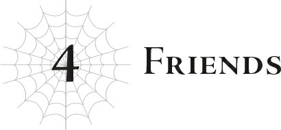
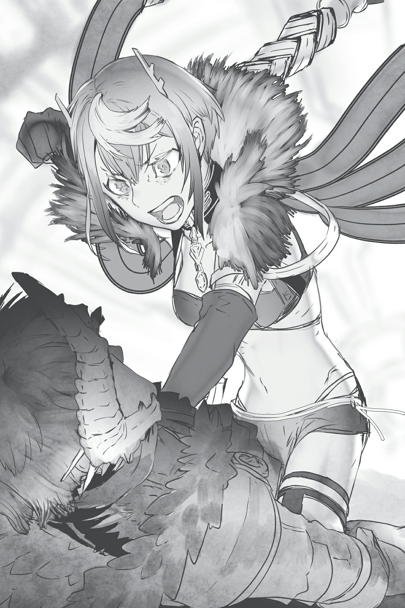

# Chương 4: Những người bạn
*(Friends)*

“Hự!”

Cú đá vòng cầu hoàn hảo của tôi khiến Vampy ngã nhào ra đất, hai tay ôm lấy bụng.

Thực sự, đó là một cú đá cực kỳ đẹp mắt, được căn lực vừa đủ để gây sát thương cho Vampy mà không làm cô nàng bay xa.

Một nỗ lực rất đáng tự hào, tôi tự nhủ.

“T-tại sao chứ...?”

Vampy rên rỉ khi lăn lộn trên mặt đất, nhưng tôi chẳng nghe thấy gì cả. Các bạn có nghe thấy gì không?

Tôi quấn cô nàng lại bằng tơ và bắt đầu kéo đi.

Người bình thường chắc chắn sẽ bị trầy da tróc vảy khi bị đối xử thế này, nhưng thôi nào. Chỉ số phòng ngự của cô nàng thừa cao để không gặp vấn đề gì.

Cứ để cô nàng tiếp tục hôn đất đi, tôi không quan tâm đâu.

“Cô White! Khoan đã!”

Khi tôi đang lôi xềnh xệch Vampy phía sau, cậu Oni chộp lấy vai tôi.

“Tôi biết cô Sophia đã lỡ lời, nhưng cô cũng chịu một phần trách nhiệm cho những gì xảy ra trong đó mà. Thế này không phải là hơi quá tay sao?”

Cái gì cơ?

Cậu Oni đang nói cái quái gì thế. Tôi trừng trừng nhìn thẳng vào mặt cậu ta.

Mười con ngươi thường ngày ẩn sau mí mắt nhắm nghiền của tôi khóa chặt vào mắt cậu Oni.

Uy lực từ các Tà Nhãn của tôi khiến cậu Oni có chút e dè, nhưng cậu ta vẫn cố gắng nói tiếp.

“Cô đáng lẽ phải giải thích nhiều hơn chứ. Bọn tôi quen với việc suy đoán ý nghĩa từ những câu ngắn ngủn của cô rồi, nhưng chuyện đó cũng có giới hạn thôi. Giữa chúng ta cần phải phối hợp tốt hơn (synergy). Cô Sophia phạm sai lầm là vì cô không giải thích rõ ràng đấy.”

Phối hợp á?

Nhưng chính năng lượng tội lỗi (sinful energy) mới là thứ đưa chúng ta vào đống hỗn độn này ngay từ đầu cơ mà!

...Được rồi, đùa nhạt thế là đủ rồi.

Thếếế cậu muốn nói cái gì?

Yêu cầu tôi giải thích rõ ràng hơn chứ gì?

Giải thích á? TÔI?!

Không bao giờ nhé.

“Cô White?”

“Nàyyyy?!”

Tôi ngó lơ cậu Oni và tiếp tục bước đi; cậu ta gọi với theo trong bối rối, còn Vampy thì la oai oái phản đối.

“Cô có nghe tôi nói không đấy?”

“Đúng thế! Tôi không đáng bị đối xử thế này!”

Cả hai người họ cứ làm ầm ĩ lên, nhưng tôi vẫn tiếp tục ngó lơ.

Vampy ra sức vùng vẫy để thoát khỏi đống tơ trói, tôi cũng ngó lơ nốt.

Cô nàng thực sự nghĩ có thể thoát khỏi tơ của tôi dễ dàng thế sao?

Chưa nghe câu này à?

Đã là thần thì chạy đằng trời.

Tôi tiếp tục kéo lê Vampy về phía đích đến.

Cô nàng cứ thế la hét om sòm suốt dọc đường, còn cậu Oni có vẻ đã tạm thời bỏ cuộc, im lặng lẳng lặng đi theo sau.

Tôi không nghĩ sự im lặng của cậu ta nghĩa là cậu ta đã thỏa mãn đâu.

Nhưng sự im lặng đó chỉ kéo dài cho đến khi điểm đến của chúng tôi lọt vào tầm mắt.

“Cái quái gì thế này...?”

Trong khi miệng cậu Oni há hốc mồm kinh ngạc, Vampy cuối cùng cũng chịu ngậm miệng lại.

Ừ thì, nhìn cũng hơi choáng ngợp thật.

Dù sao thì chúng tôi cũng đang đứng trước một chiếc phi thuyền UFO siêu to khổng lồ.

Đây chính là nơi tôi muốn đưa họ đến.

Đó là con tàu vũ trụ mà Potimas đã cố dùng để trốn khỏi hành tinh này vào phút chót.

Ngó lơ hai kẻ đang đứng đực ra vì sốc, tôi đi thẳng vào bên trong UFO.

Tất nhiên, đồng nghĩa với việc Vampy cũng bị kéo lê theo.

Không muốn bị bỏ lại phía sau, cậu Oni vội vã bám theo chúng tôi một lần nữa.

Cả hai đều trừng mắt tò mò nhìn ngắm bên trong chiếc UFO.

Nó rộng lớn đến mức phi lý, nếu đi bộ thì phải mất rất nhiều thời gian mới đi hết một vòng, nhưng chắc chắn là không thiếu thứ để xem.

Dù sao thì chiếc UFO này được chế tạo phục vụ cho một cuộc hành trình dài ngày ngoài vũ trụ, nên nó có hàng tá trang thiết bị chuẩn bị cho chuyến đi đó.

Chỉ riêng việc đi vòng quanh ngắm nghía đống đó thôi cũng đủ tính giải trí rồi.

Mặc dù dáng vẻ của Vampy trông khá buồn cười khi vừa bị trói ngược ra sau bằng tơ vừa há hốc mồm kinh ngạc ngắm nhìn xung quanh.

Tôi hiểu đó là tư thế duy nhất giúp cô nàng nhìn thấy mọi thứ, nhưng tôi vẫn nghĩ nó không được thục nữ cho lắm.

Hửm?

Ai là người đã trói cô nàng như thế ngay từ đầu á?

Tôi không thấy chuyện đó có liên quan gì ở đây cả.

Chuyến tham quan kết thúc khi chúng tôi đến đích đến cuối cùng.

Cụ thể là phần sâu nhất bên trong UFO, nơi Ma Vương đang chăm chú nhìn vào màn hình giám sát, hai bên là ba con nhện rối hộ vệ.

Tôi đoán họ bị thiếu một con là vì Fiel lại đang đi bám đuôi ông lão kia rồi sao?

“Hửm? Ồ, chào mọi người.”

Ma Vương chú ý đến chúng tôi và vẫy tay.

Tôi đoán cô ấy đã chuyển vào chiếc UFO này trong lúc chúng tôi đang nói chuyện với những người tái sinh.

Mặc dù đó cũng là lý do tôi đến đây, dĩ nhiên rồi.

“Cháu lại làm hỏng chuyện gì nữa rồi à, Sophia?”

“Ý cô là sao khi nói ‘lại’, cô Ariel? Sao nghe cứ như cháu luôn là người làm hỏng mọi chuyện thế.”

Hử? Cô nàng đang nghiêm túc đấy à?

Tôi không biết sao cô nàng có thể vô tư đến thế.

Thấy chưa? Ngay cả Ma Vương cũng đang cố nhịn cười kìa.

“Nhưng cháu cũng phải bớt bắt nạt con bé lại đi chứ, White.”

Tôi không có bắt nạt cô nàng nhé.

Tôi chỉ đang giáo dục cô nàng thôi, thếếế thôi.

“Thế lần này con bé đã làm gì?”

“Dạ, chuyện là thế này...”

Vì lý do nào đó, Ma Vương lại hỏi cậu Oni thay vì tôi, và cậu Oni bắt đầu trả lời cô ấy mà không một chút do dự.

Ý tôi là, ừ thì.

Quyết định đúng đắn đấy.

Nhưng dù vậy, cảm giác cứ như họ đang ám chỉ không thể trông cậy vào tôi vậy, thật là xúc phạm mà.

Tôi có thể giải thích được nếu tôi thực sự cố gắng đấy nhé!

Chỉ là tôi không thèm cố gắng vì tôi không muốn thôi!

Các bạn tin tôi đúng không?

“À. Ta hiểu rồi.”

Sau khi nghe cậu Oni giải thích xong, Ma Vương nhăn mặt nhìn Vampy.

“Ừ, Sophia có lỗi khi để lộ chuyện đó, nhưng ta nghĩ lỗi lớn hơn thuộc về White vì ngay từ đầu đã đưa ra một nhận định quá cụ thể.”

Phản đối!

Tôi không làm gì sai cả!

Đừng có đổ lỗi cho tôi!

“Vậy sự thật là thế nào? Họ thực sự không thể quay về Trái Đất sao?”

Ma Vương chăm chú nhìn tôi.

“Không thể,” tôi trả lời ngay lập tức.

“Được rồi. Nếu White nói không thể, thì ta đoán là không thể thật. Nhưng tại sao lại không? Sophia lỡ lời là vì cháu không giải thích những chi tiết quan trọng đó. Cháu hiểu rõ tầm quan trọng của thông tin và sự giao tiếp rõ ràng hơn ai hết cơ mà? Và vì cháu nắm rõ mọi chi tiết, cháu là người duy nhất biết thông tin nào là quan trọng nhất. Cháu phải đứng ở góc nhìn của Sophia chứ. Con bé thậm chí còn không biết đâu là thật đâu là giả nữa kìa.”

Trong khi Ma Vương nhẹ nhàng giáo huấn tôi bằng tông giọng ôn tồn, tôi phải tốn phần lớn năng lượng để giữ cho môi mình không bĩu ra.

Cô nghĩ cô là ai chứ, mẹ tôi chắc?

À phải rồi, cô là bà ngoại của tôi... Xin lỗi nhé.

“Cháu luôn cố tự mình gánh vác mọi chuyện, điều đó đồng nghĩa với việc cháu rất bất cẩn khi làm việc cùng người khác. Cháu không thấy việc trò chuyện với mọi người là cần thiết. Sao cháu phải bận tâm làm thế khi cháu có thể tự mình làm hết nếu muốn chứ? Về cơ bản, cháu là một kẻ cô độc từ trong xương tủy.”

Đau nhé. Lời nói thật sắc xảo, nhưng cô ấy không sai.

“Mặc dù ta đoán mình không thể thực sự trách cháu được. Trước khi gặp cháu, ta cũng từng như thế thôi. Có lẽ đó là những gì sẽ xảy ra khi một người sở hữu sức mạnh quá lớn vượt qua cả giới hạn của bản thân.”

Nếu chỉ tính riêng chỉ số, Ma Vương có lẽ là người mạnh nhất thế giới.

Ngay cả đội quân nhện dưới trướng cô ấy cũng được tạo ra từ kỹ năng Đẻ Trứng của cô ấy, nghĩa là chúng cơ bản là phân thân của chính cô ấy.

“Dẫu vậy, Sophia và Wrath là bạn bè và đồng minh của cháu. Dù khả năng giao tiếp của cháu có tệ đến đâu, cháu cũng phải ngừng trốn tránh và đối mặt với họ một cách đàng hoàng chứ, đúng không?”

Hả?

Bạn bè?

Cái gì?

Bạn bè.

Hửm...

Ồ, ra vậy.

Vampy và cậu Oni là bạn của tôi sao?

Ma Vương thực chất là một thiên tài à? Làm thế nào cô ấy nhận ra một điều điên rồ như vậy chứ?

Khoan đã nào.

Sao tôi lại cảm thấy bối rối thế này?

Chính xác thì “bạn bè” là gì?

Kiểu như những người có cùng họ với mình sao?

Hừm. Không, tôi khá chắc đó gọi là “gia đình”.

Vậy, bạn bè là gì?

Những người làm việc cùng bạn.

Những người ở cùng vị trí hoặc ngành nghề với bạn.

Những người giống bạn.

Tất cả những định nghĩa đó có chút khác biệt, nhưng về cơ bản thì chúng bổ trợ cho nhau.

Nói cách khác, những người đứng bên cạnh bạn.

Chúng tôi có đang đứng cạnh nhau không?

Thành thật mà nói, xét về thực lực thì họ còn lâu mới đuổi kịp tôi.

Tôi đi trước một quãng xa lắc xa lơ, còn họ thì tụt lại tít đằng sau.

Nên tôi không thể gọi họ là “bạn bè” theo nghĩa đó được.

Nhưng xét về việc cùng hướng tới một mục tiêu, chắc chắn có thể nói chúng tôi đang đứng cạnh nhau.

Vậy điều đó nghĩa là chúng tôi thực sự là bạn bè sao?

Chà, điên rồ thật.

Tôi luôn là một kẻ cô độc. Ai mà ngờ được cuối cùng tôi cũng có vài người bạn chứ?!

Hừm.

Ừmmm...?

Chính xác thì người ta phải tương tác với bạn bè thế nào đây?

Xin hãy chỉ giáo cho con, hỡi Đấng Tối Cao!

“Ôi chu choa, White đơ người luôn rồi. Không ổn rồi. Ta đoán đưa khái niệm tình bạn cho con bé lúc này là quá sớm. Ta cứ nghĩ cháu đã trải qua đủ khó khăn và chiến thắng để hiểu được rồi chứ, nhưng có vẻ là chưa...”

“Sao cơ ạ?”

“Nghe này, Wrath. Bất kể vẻ ngoài thế nào, White vẫn chỉ là một đứa trẻ ngây ngô khi nhắc đến cảm xúc. Đừng để diện mạo và thái độ của con bé đánh lừa. Mỗi khi con bé làm gì đó có vẻ phi lý, phần lớn thời gian là con bé đang cố dùng bạo lực để đánh lạc hướng khỏi bất kỳ thứ gì có thể làm xấu mặt mình. Thấy chưa? Nói thế nghe khá là trẻ con đúng không?”

“Dạ... đúng thế...”

“Nên khi con bé làm chuyện gì xấu, cậu phải mắng con bé như mắng trẻ con ấy, chứ đừng bày tỏ ý kiến như nói chuyện với người lớn. Nếu không, ta không nghiêng được con bé sẽ khá lên được đâu.”

“Mắng cô ấy sao? Tôi á?”

“Ừ, Sophia thì khỏi bàn rồi. Cậu là người duy nhất ta có thể trông cậy ở đây thôi. Chúc may mắn.”

“Khoan đã nào! Ý cô là sao khi nói cháu khỏi bàn hả?!”

Họ cứ làm ồn ào lên, khiến tôi bị phân tâm khỏi cuộc suy ngẫm sâu sắc về khái niệm kỳ lạ của con người gọi là “tình bạn” này.

Ừmmm, những người bạn duy nhất tôi biết là bạn bè trong game online!

Nên cũng giống như bạn bè trong game online, bạn sẽ đối tốt với họ khi tâm trạng vui vẻ, và bạn sẽ sút họ đi khi họ làm phiền bạn? Hiểu rồi!

Trong trường hợp đó, tôi nghĩ có lẽ mình nên xoa đầu Vampy để bày tỏ chút tình cảm, nhưng khi thấy cô nàng cứ nhảy tưng tưng trong đống tơ trói và la hét ầm ĩ, tự dưng tôi thấy hơi ngứa mắt, thế là tôi đá cô nàng một phát thay thế.

“Tại sao cô lại vừa đá tôi chứ?! Nghiêm túc đấy! Tại sao?!”

Uống thuốc hạ hỏa đi.

Đó là những gì bạn bè thường làm mà, đúng không?

“Ta có cảm giác White vừa mới tự suy diễn ra một kiểu hiểu biết cực kỳ sai lệch về chuyện này... Mà thôi, kệ đi.”

“Cô Ariel, xin cô đừng từ bỏ dễ dàng thế chứ.”

“Thôi, quan trọng hơn là...”

“Quan trọng hơn sao?!”

Màn đối đáp giữa Ma Vương và cậu Oni nghe cứ như một cặp diễn viên hài vậy.

Nhưng biểu cảm trên mặt Ma Vương lại hoàn toàn nghiêm túc.

Tôi đoán cô ấy thực sự muốn nói về chuyện gì đó quan trọng.

“White, cháu nghĩ sao về chuyện này?”

Ma Vương hếch cằm về phía màn hình.

Nhìn nét mặt của cô ấy, có vẻ như cả cậu Oni lẫn Vampy cũng nhận ra cô ấy đang nghiêm túc.

Tôi ngước lên nhìn kỹ màn hình.

...Bất chấp việc Vampy vẫn đang bị quấn chặt trong tơ.

“Chính xác thì có vấn đề gì ở đây vậy?”

Cậu Oni nhìn chằm chằm những dòng chữ trên màn hình một lúc nhưng dường như không hiểu Ma Vương đang lo ngại điều gì.

Vampy dù có lòng kiêu hãnh ngốc nghếch không muốn thừa nhận, biểu cảm của cô nàng cũng cho thấy cô nàng chả hiểu gì sất.

“Rất nhiều vấn đề.”

Ma Vương trầm ngâm nhìn chằm chằm màn hình.

Có vẻ đó là nhật ký của Potimas.

Vì lão ta là một người cực kỳ chú trọng chi tiết, có vẻ lão ta đã ghi chép lại các sự kiện diễn ra mỗi ngày không sót ngày nào.

Mặc dù nếu xét đây chỉ là một danh sách các chi tiết công việc khô khan, thẳng tuột, thì gọi nó là nhật ký có vẻ không được chính xác cho lắm.

Nó không có nhiều ý kiến cá nhân hay cảm xúc của lão.

Thỉnh thoảng có vài quan sát kỳ lạ về nghiên cứu của lão, nhưng ngay cả những thứ đó cũng cực kỳ hiếm hoi.

Thực tế, không có một chút vết tích cảm xúc nào trong đó cả. Nhìn chả giống nhật ký tí nào.

Tuy nhiên, phần Ma Vương đang hiển thị lúc này là một trong những trường hợp hiếm hoi mà bạn có thể nhận ra cảm xúc của Potimas.

Ấn tượng tôi nhận được từ nó là sự hoảng loạn.

Và hoài nghi.

[Đột nhiên, tổng lượng năng lượng MA sụt giảm nghiêm trọng. Nguyên nhân chưa rõ. Rất có khả năng có liên quan đến các rung chấn không gian mà tôi đã giám sát bằng thiết bị của mình, nhưng hiện tại tôi chưa thể khẳng định chắc chắn. Rõ ràng có điều gì đó bất thường. Tôi chưa từng chứng kiến sự việc như vậy kể từ khi hệ thống được thiết lập. Liệu đã xảy ra một lỗi nghiêm trọng nào đó bên trong hệ thống? Liệu có an toàn nếu tiếp tục ở lại hành tinh này? Câu trả lời vẫn chưa rõ ràng. Güliedistodiez đã cấm tôi rời khỏi hành tinh này, nhưng có lẽ tôi nên chuẩn bị sẵn phương án đào thoát để đề phòng.]

À.

Tôi hiểu rồi.

Đó là sự cố liên quan đến vị Anh hùng đời trước nữa và Ma Vương tiền nhiệm.

Họ đã cố sử dụng [Ma pháp Chiều không gian] để can thiệp vào thứ gì đó và thất bại, dẫn đến việc bắn chệch hướng vào một lớp học ở Nhật Bản.

Ghi chép này chính là về sự cố đã đưa những người tái sinh chúng tôi đến thế giới này.

Nhờ những sai lầm ngớ ngẩn của họ, chúng tôi mới được tái sinh vào đây, và Ma Vương đã phải lên nắm quyền chạy đôn chạy đáo khắp nơi để cố phục hồi toàn bộ lượng năng lượng MA bị tiêu hao sau hậu quả đó.

Vampy và cậu Oni đã nghe về sự cố này, nên họ không ngạc nhiên khi đọc được những dòng này.

Đó có lẽ là lý do họ bối rối không hiểu Ma Vương đang lo lắng điều gì.

Nhưng có một vấn đề cực kỳ lớn.

Vì chính Potimas là người đã viết những dòng này.

“Ý này nghĩa là sao? Rốt cuộc Potimas không phải là kẻ đã dụ dỗ vị cựu Anh hùng và Ma Vương tiền nhiệm làm chuyện đó à?”

Đúng vậy.

Chính xác.

Việc Potimas ngạc nhiên đến thế trước sự cố do vị Anh hùng trước Julius và Ma Vương tiền nhiệm gây ra có nghĩa là còn có kẻ khác đang giật dây đằng sau.

Hử?

Bạn hỏi họ tự mình làm chuyện đó theo ý chí của riêng họ sao?

Làm sao họ có thể làm được điều đó nếu ngay từ đầu không biết chút gì về cách thức vận hành của hệ thống chứ.

Chắc chắn phải có ai đó giải thích cho họ cách hoạt động của hệ thống.

Nếu không, hai người mù tịt thông tin làm sao có thể tung ra một đòn tấn công xuyên thời gian và không gian nhắm trúng D trong lớp học đó được.

Ngay cả Potimas còn dường như không biết đến sự tồn tại của D nữa là.

...Trong trường hợp này, rõ ràng thủ phạm là ai rồi.

Tôi tin chắc Ma Vương cũng biết điều đó.

Chỉ là cô ấy không muốn thừa nhận thôi.

“Chính xác. Ta chịu trách nhiệm cho tất cả chuyện đó.”

Một giọng nói mới vang lên, không thuộc về bất kỳ ai trong chúng tôi.

Người dịch chuyển vào phòng chính là kẻ tôi đã dự đoán.

Một quản trị viên của thế giới này, người dường như đang mặc một bộ giáp đen.

Đó chính là Hắc, hay còn gọi là Güliedistodiez.

Nào, xin kính chào quý vị và các bạn.

Chào mừng đến với trận thư hùng số một của dị giới.

Đương kim vô địch là Quản trị viên Güliedistodiez.

Đối mặt với kẻ thách thức của chúng ta, Ma Vương.

Thần đối đầu với Ma Vương: Một câu chuyện cổ xưa như Trái Đất, nhưng chính điều đó làm nên tính huyền thoại.

Liệu vị thần có giành chiến thắng?

Hay kẻ dưới cơ là Ma Vương sẽ lội ngược dòng thành công?

Dù thế nào đi nữa, chúng ta cũng sắp được chứng kiến một trận đấu tuyệt vời đây.

Nào, tiếng chuông bắt đầu trận đấu còn chưa ngân lên, Ma Vương đã chủ động tấn công trước!

Thật là một chiêu trò chơi bẩn!

Nhưng cô ấy là Ma Vương cơ mà.

Với cô ấy, chơi bẩn chính là một lời khen ngợi!

Đương kim vô địch nhận đòn tấn công bất ngờ này trực diện với một lực cực mạnh!

Một cú đấm thẳng tay phải trúng ngay mặt!

Nó khiến nhà vô địch phải lảo đảo lùi lại vài bước!

Bình luận viên Nhện B nghĩ sao về đòn tấn công này?

Tôi phải nói là nhà vô địch cố tình nhận cú đấm đó, phát thanh viên Nhện A ạ.

Ý anh là sao?

Vâng, nhà vô địch rõ ràng nhận biết được đòn tấn công bất ngờ của Ma Vương đang đến.

Nhưng thay vì né tránh hay đỡ đòn, anh ta lại cố tình để nó đấm thẳng vào mặt.

Có lẽ đó là sự tự tin của nhà vô địch đương nhiệm.

Ra vậy!

Anh ta quyết định để đòn tấn công đầu tiên của kẻ thách thức đánh trúng để chứng minh bản thân mạnh mẽ hơn thế nào!

Nhưng Ma Vương chưa dừng lại ở đó!

Cô ấy chộp lấy cổ áo anh ta—cổ áo sao? Có gọi đó là cổ áo được không nhỉ?

Thôi kệ, cô ấy túm lấy cổ áo anh ta và quật ngã xuống đất!

Giờ cô ấy đang ngồi đè lên người anh ta!

Đang ở vị thế áp đảo (mount position)!

“Chuyện này là thế nào hả?!”

Ma Vương yêu cầu một lời giải thích!

Có vẻ cô ấy vô cùng tức giận vì nhà vô địch để cô ấy muốn làm gì thì làm mà không hề kháng cự!

Nào, chiến đi chứ!

Chiến đấu thật sự với tôi đi, cô ấy như muốn nói thế!

“...Ta xin lỗi.”

Nhưng kìa!

Nhà vô địch không hề có hứng thú chiến đấu!

Chuyện này nghĩa là sao chứ?!

Lẽ nào đương kim vô địch đã mất đi ý chí chiến đấu rồi sao?!

Ma Vương bắt đầu đấm túi bụi vào nhà vô địch!

Phù.

Được rồi, tôi chán làm bình luận viên rồi.

“Cô Ariel! Dừng lại đi! Đừng làm thế!”

Cậu Oni giữ lấy hai tay Ma Vương và kéo cô ấy lại, ngăn cô ấy tiếp tục đấm liên tục vào mặt Hắc.

Cô ấy vùng vẫy trong vòng tay cậu ta, cố gắng tiếp tục đấm Hắc, nhưng sức mạnh của cậu Oni đã giữ chặt cô ấy lại.

Sau trận chiến với Potimas, Ma Vương đã mất đi phần lớn sức mạnh.

Giờ đây cô ấy không mạnh hơn một cô bé bình thường là bao—thế nhưng, thậm chí có khi còn yếu hơn thế nữa.

Cô ấy thậm chí không thể chống cự khi bị cậu Oni giữ lại.

Làm tốt lắm, cậu Oni.

Ma Vương về cơ bản hiện giờ chỉ là một người nghỉ hưu cần nghỉ ngơi tĩnh dưỡng nhiều trên giường.

Kiểu bạo lực đó không tốt cho sức khỏe của cô ấy đâu.

Dù vậy, tôi không can thiệp ngay lập tức vì tôi nghĩ cô ấy cần phải trút bớt cơn giận trước khi chúng tôi có thể bắt đầu nói chuyện, và Hắc dù sao cũng xứng đáng ăn vài đấm.

Vì thế đó là thời điểm thích hợp để can thiệp.

Cậu Oni đúng là biết đọc bầu không khí thật.

Hửm? Vampy á?

Cô nàng vẫn đang bị trói chặt và trông có vẻ chả hiểu mô tê gì đang diễn ra cả. Sao bạn lại hỏi thế?

“Có chuyện gì thế?”

“Ta xin lỗi.”

Ngay cả khi bị cậu Oni giữ lại, Ma Vương vẫn tiếp tục đòi một lời giải thích từ Hắc, còn anh ta chỉ biết lặp đi lặp lại câu: “Ta xin lỗi.”

Vừa để mắt đến tình huống đó, tôi vừa tiếp tục đọc nhật ký của Potimas từ chỗ Ma Vương bỏ dở.

[Güliedistodiez đã liên lạc với một trong những phân thân tôi đang vận hành ở bên ngoài. Mọi chuyện ngày càng trở nên kỳ lạ. Hắn hỏi liệu có điều gì bất thường xảy ra không, chắc chắn là ám chỉ lượng năng lượng MA đột ngột sụt giảm và chấn động không gian xảy ra cùng thời điểm. Tất nhiên, tôi không có ý định chia sẻ bất kỳ thông tin nào với hắn. Thay vào đó, tôi đã cố gắng dò hỏi thông tin từ hắn, nhưng có vẻ như bản thân hắn cũng không biết chính xác chuyện gì đã xảy ra. Cuối cùng, chúng tôi đường ai nấy đi mà không đạt được gì. Nếu ngay cả hắn cũng không biết gì về tình hình hiện tại, tôi phải tự mình thu thập thêm thông tin.]

[Anh hùng đã được thay thế. Anh hùng mới được phong hiệu là Hoàng tử Julius, con thứ hai của Vương quốc Analeit. Chuyện này tự bản thân nó không mấy quan trọng với tôi, nhưng việc có Anh hùng mới đồng nghĩa với việc Anh hùng trước đó, Darresmeig, đã chết. Xét theo dòng thời gian, chắc chắn có mối liên hệ nào đó với chấn động không gian vài ngày trước. Sẽ khá hợp lý nếu Darresmeig chính là kẻ gây ra chấn động đó. Tôi chưa thể xác nhận việc thay thế Ma Vương, nhưng nếu họ hợp tác với nhau, tôi đoán hắn cũng đã chết rồi. Và Güliedistodiez vẫn còn sống. Điều đó có nghĩa là họ đã thất bại. Thật vô dụng.]

[Cá thể mà tôi sắp xếp để sinh ra làm cơ thể chính tiếp theo của mình đã bắt đầu nói những điều kỳ lạ với tôi thông qua Thần giao cách cảm. Một trẻ sơ sinh được cho là chưa có nhận thức mà lại sử dụng được Thần giao cách cảm đã là chuyện không tưởng rồi, nhưng thông tin nhận được lại càng kỳ quái hơn. Tuy nhiên, những gì tôi thu thập được thực sự rất thú vị. Có vẻ như có những người tái sinh mang theo ký ức từ một thế giới khác với thế giới này. Tôi đã tự hỏi lượng năng lượng MA biến mất trong những chấn động không gian đó đã đi đâu, nhưng tôi chưa bao giờ ngờ rằng nó lại kết thúc ở một thế giới song song. Tôi không biết tại sao chuyện đó lại xảy ra khi đáng lẽ nó phải được chuyển hướng đến chỗ Güliedistodiez, nhưng kết quả thật sự rất hấp dẫn. Những người tái sinh, sở hữu linh hồn từ thế giới khác, khác biệt với chúng ta. Nếu sử dụng chúng, biết đâu có thể dẫn đến bước đột phá trong nghiên cứu vốn đang bị cản trở của tôi? Chắc chắn rất đáng để thử nghiệm. Trong trường hợp đó, tôi phải bắt đầu thu thập mẫu vật ngay lập tức. May mắn thay, cá thể đã kể cho tôi nghe về sự tồn tại của họ, Filimøs, muốn tôi chăm sóc những người tái sinh này. Vậy thì, tôi sẽ vui vẻ thực hiện tâm nguyện của cô ta.]

Hự.

Tôi phải bắt đầu nói từ đâu với đống này đây?

Nó tàn nhẫn đến mức chỉ cần đọc thôi cũng thấy như mình đang bị mài mòn đi sự tỉnh táo.

Đây chính là điều đáng sợ ở những kẻ phạm phải những tội ác kinh hoàng mà thậm chí không hề có cảm giác bản thân đang làm gì sai trái.

Rõ ràng ngay cả từ những ghi chép ngắn ngủi này, lão ta đã xem cựu Anh hùng, Ma Vương tiền nhiệm, và trên hết là cô Oka, không phải là những con người, mà chỉ là những công cụ phục vụ cho mục đích của lão.

Biết là chuyện cũ rồi, nhưng mà gã P đúng là kẻ tồi tệ nhất!

Nếu tôi đào sâu thêm dữ liệu của lão, tôi có thể tìm thấy một vài cuộc đối thoại với vị Anh hùng trước đó hoặc Ma Vương tiền nhiệm, nhưng tôi không nghĩ điều đó thực sự cần thiết.

Hơn nữa, tôi thực sự không muốn đọc thêm bất kỳ thứ gì của lão ta nữa.

Tôi nghĩ mình đã nắm được bức tranh toàn cảnh rồi.

Ý tôi là, không phải trước đây tôi chưa biết chuyện đó.

“Cậu biết đấy, Gülie... Ta đã luôn nghĩ chúng ta là bạn bè, những tâm hồn đồng điệu... Nhưng chỉ có một mình ta nghĩ thế sao? Hay ta đã tự mình ảo tưởng suốt bấy lâu nay?”

Chết dở rồi.

Trong lúc tôi để mặc Ma Vương và Hắc tự giải quyết chuyện của mình, tình hình đã có một bước ngoặt khá nghiêm trọng.

Ma Vương trông như sắp khóc đến nơi rồi.

Thật là một gã đàn ông tồi tệ, làm một cô bé khóc thế kia!

...Được rồi, đùa chút thôi, nhưng tôi đoán mình nên bước ra can thiệp.

“Đồ ngốc.”

Úi. Lỗi của tôi.

Tôi định nói gì đó với Hắc, nhưng cuối cùng lại lỡ miệng thốt ra suy nghĩ thật trong lòng về anh ta.

Mà thôi, sao cũng được.

“Cô ấy sẽ không hiểu nếu anh không giải thích rõ ràng đâu. Ngừng xin lỗi đi và kể toàn bộ câu chuyện từ đầu xem nào.”

Hắc, lúc này đang ngồi dậy một nửa trên mặt đất, trố mắt nhìn tôi kinh ngạc.

Ma Vương cũng quay sang phía tôi với biểu cảm sững sờ tương tự.

“...Thật sao ạ? Đúng là chuột chê khỉ ở trong hang, thưa Sư phụ...”

Vampy bắt đầu lảm nhảm mấy thứ vô nghĩa, nên tôi lại đá cô nàng thêm phát nữa.

Sau khi bắt cô nàng ngậm miệng, tôi quay lại tập trung bắt Hắc kể lại toàn bộ câu chuyện.

Phải mất một lúc lâu, vì anh ta cứ liên tục chèn vào mấy câu nhận xét vô thưởng vô phạt kiểu như: “Tất cả là lỗi của tôi” hay “Vì những sai lầm của tôi”, vân vân và mây mây.

Nhưng tóm tắt lại trong ba bước đơn giản như thế này:

Hắc đã kêu gọi Anh hùng và Ma Vương tạo dựng một thỏa ước đình chiến giữa con người và ma tộc.

Gã P đã bí mật thuyết phục Anh hùng và Ma Vương rằng các quản trị viên là kẻ xấu.

Thế là hai người đó quyết định: “Được rồi, cùng nhau tiêu diệt quản trị viên thôi!”

Chính xác thì làm thế nào họ đi đến kết luận đó?

Để đi vào chi tiết hơn một chút, mọi chuyện diễn ra đại khái thế này:

Đầu tiên, sự mài mòn linh hồn của cư dân thế giới này, đặc biệt là ma tộc, ngày càng trở nên nghiêm trọng, đến mức tỷ lệ sinh của ma tộc bị sụt giảm.

Bởi vì điều đó, ma tộc không ở thế có thể tiếp tục chiến tranh được nữa.

Nhận thấy chủng tộc ma tộc sẽ tuyệt chủng nếu cứ đà này, Hắc đã đề xuất một cuộc thỏa hiệp đình chiến với Ma Vương tiền nhiệm và Anh hùng.

Mọi chuyện cho đến lúc này vẫn tốt đẹp.

Quyết định đó của Hắc không có gì sai cả.

Tôi không biết tất cả các chi tiết về khoảng thời gian đó, nhưng dựa trên việc những người như Agner và Balto phải chật vật xoay xở để khôi phục lại nòi giống ma tộc, không khó để hình dung họ đã rơi vào cảnh khốn quẫn đến mức nào.

Đó là chưa kể, vì Hắc thường chỉ đứng ngoài quan sát mà không chủ động can thiệp, bạn biết tình hình hẳn phải tồi tệ lắm thì anh ta mới thực sự ra tay.

Nói thật, nếu anh ta không can thiệp và chiến tranh cứ tiếp tục, ma tộc có lẽ đã biến mất hoàn toàn vào thời điểm những người tái sinh chúng tôi xuất hiện.

Có lẽ nói vậy là hơi quá, nhưng đó chắc chắn là một cuộc khủng hoảng nghiêm trọng.

Nhưng đây là lúc Hắc phạm phải sai lầm.

Nói ngắn gọn, anh ta không nhận ra gã P đã tiếp cận cựu Anh hùng và Ma Vương tiền nhiệm từ trước.

And giống hệt như những gì lão đã làm với cô Oka, lão đã thuyết phục họ rằng các quản trị viên chính là kẻ thù.

Biết đấy, kiểu như tuyên bố rằng họ đang lợi dụng Anh hùng và Ma Vương để bắt cư dân thế giới này tàn sát lẫn nhau, rồi thu hoạch năng lượng của họ sau khi chết cùng hàng tá thứ hay ho khác.

Ý tôi là, điều đó hoàn toàn là sự thật, nhưng nói kiểu đó làm các quản trị viên trông như phản diện vậy.

Nếu bạn biết toàn bộ câu chuyện, bạn sẽ nhận ra họ làm tất cả những điều này là để phục hồi thế giới.

Còn việc vị cựu Anh hùng và Ma Vương tiền nhiệm nghĩ gì sau khi nghe câu chuyện từ cả Hắc lẫn gã P thì chẳng ai nói trước được.

Và vì họ hiện giờ đều đã chết, chúng tôi sẽ không bao giờ biết chắc chắn được.

Bất kể lý do của họ là gì, tất cả những gì chúng tôi biết là họ đã chọn một trận chiến thiếu khôn ngoan với các quản trị viên và làm lãng phí một lượng năng lượng MA khổng lồ.

Làm thế nào mà họ lại tiêu hao một lượng năng lượng MA khổng lồ đến vậy chứ?

Ngay cả khi bạn cố thách thức một quản trị viên, bản thân trận chiến đó không nên tiêu tốn năng lượng MA như vậy.

Trừ khi có sự tham gia của Anh hùng và Ma Vương.

Hai vai trò đó đi kèm với nhiều thuộc tính ẩn khác nhau, nhờ có một vị ác thần nào đó đã nhồi nhét vào đó những tính năng kỳ quái.

Anh hùng sẽ trở nên mạnh hơn khi đối đầu với Ma Vương.

Vì ma tộc sống lâu hơn và thường mạnh hơn con người, đây là một điểm chấp được tích hợp sẵn để giúp Anh hùng có cơ hội chiến thắng.

Khi một Anh hùng chiến đấu với một Ma Vương mạnh hơn đáng kể, Anh hùng sẽ tiêu hao năng lượng MA để có được một dạng gia tăng sức mạnh tạm thời.

Nhưng sự gia tăng sức mạnh này thực chất cũng áp dụng cho các tình huống khác ngoài việc chiến đấu với Ma Vương.

Cụ thể là khi Anh hùng chiến đấu với một vị thần.

Hiện tại, Hắc là vị thần thực sự duy nhất ở thế giới này.

Sariel không thể di chuyển vì cô ấy đã trở thành lõi của hệ thống.

Nói cách khác, Hắc là người duy nhất có thể chiến đấu chống lại một kẻ tấn công từ bên ngoài.

Các vị thần luôn chiến đấu tranh giành lãnh thổ, cướp đoạt các hành tinh của nhau.

Hành tinh này hiện tại không mấy hấp dẫn, vì loài rồng đã bỏ rơi nó và nó đang trên bờ vực sụp đổ, nghĩa là nó ít có khả năng bị nhắm tới.

Nhưng dù thế, không có gì đảm bảo chuyện đó sẽ không xảy ra.

Vẫn có khả năng loài rồng sẽ quay lại để đòi lại nó, hoặc một vị thần đi lạc nào đó sẽ ghé qua.

Anh hùng và Ma Vương là tuyến phòng thủ chính của thế giới chống lại các vị thần đó.

Khi một trong hai người thách thức một vị thần, họ có thể tiêu hao năng lượng MA để gia tăng sức mạnh.

Tất nhiên, đánh bại một vị thần là không hề dễ dàng, và việc nhồi nhét đủ năng lượng để chiến đấu với một vị thần vào một cá thể đơn lẻ, dù chỉ là tạm thời, là cực kỳ nguy hiểm.

Trên hết, khi đối phó với một vị thần, lượng năng lượng MA tiêu hao lớn hơn nhiều so với lượng năng lượng tiêu thụ trong bất kỳ trận chiến nào giữa Anh hùng và Ma Vương.

Nhưng tính năng này vẫn tồn tại.

And bạn đoán xem? Phạm vi đối tượng áp dụng cho tính năng này bằng cách nào đó bao gồm cả các quản trị viên.

Cái gì cơ?

Tôi biết—chuyện đó chả có lý nào cả.

Nếu đây là một trò chơi trực tuyến, nó sẽ giống như việc cung cấp cho người chơi các khả năng đặc biệt để chiến đấu với GM vậy.

Đó là chưa kể việc sử dụng nó rất có thể sẽ làm sập luôn toàn bộ máy chủ.

Về cơ bản, đó là một tính năng ngớ ngẩn đến mức có thể lật đổ toàn bộ nền tảng của trò chơi.

Thực tế, ở thời điểm đó tôi sẽ gọi nó là một lỗi lập trình chứ không phải tính năng.

Nhưng trong trường hợp này, tốt hơn hết bạn nên tin rằng đó là một tính năng có chủ ý chứ không phải lỗi.

Ý tôi là, hãy nghĩ về vị ác thần đã tạo ra nó xem.

Tôi đoán D đã cố ý để lại tính năng đó để cư dân thế giới này có quyền lựa chọn thách thức một quản trị viên.

Mặc dù tôi chắc chắn nếu bạn hỏi lý do tại sao, câu trả lời duy nhất bạn nhận được là: “vì làm thế trông có vẻ giải trí hơn”.

Một người bình thường, dám đối đầu với một vị thần.

Tôi không biết liệu điều đó cuối cùng có thay đổi được thế giới hay không, nhưng tôi cá là D sẽ thấy một sự kiện như vậy rất thú vị dù kết quả thế nào đi nữa, bạn có nghĩ thế không?

Ừ.

Nói cách khác, vị Anh hùng trước Julius và Ma Vương tiền nhiệm đã thách thức một vị thần dưới hình dạng một quản trị viên và thành công sử dụng năng lượng MA để tạm thời có được sức mạnh khổng lồ.

Tất nhiên, cái giá phải trả cho việc này là lãng phí một lượng năng lượng MA khổng lồ và mạng sống của cả hai người.

Không còn nghi ngờ gì nữa, cả hai đều cảm thấy sự hy sinh này là xứng đáng.

Nhưng cuối cùng, tất cả những gì nó mang lại là ném đi một đống năng lượng MA và đẩy thế giới vào một tình cảnh thậm chí còn tồi tệ hơn.

Như một phần thưởng khuyến mãi, họ thậm chí còn tiện tay tàn sát cả một lớp học chứa đầy những người tái sinh từ thế giới khác không vì một lý do chính đáng nào.

Đúng là một mớ hỗn độn thảm hại.

Nào, bạn có nhận ra điều gì từ câu chuyện này không?

Đúng thế: Hắc không thực sự chịu trách nhiệm chính cho bất kỳ sự kiện nào trong số này cả.

“Từ những gì cháu nói từ nãy đến giờ, chẳng phải phần lớn là lỗi của Potimas sao?”

“Không. Ta là người có lỗi vì đã không giải thích rõ ràng mọi chuyện cho Anh hùng và Ma Vương.”

Hắc vẫn bướng bỉnh khăng khăng đó là lỗi của mình, bất chấp nhận định hoàn toàn hợp lý của Ma Vương.

Anh ta cũng liên tục lải nhải về việc mình chịu trách nhiệm trong suốt quá trình giải thích.

Ừ thì, đúng là tôi không thể nói Hắc hoàn toàn vô tội 100% trong tình huống này.

Tôi không biết anh ta đã đưa ra lời giải thích thế nào cho vị cựu Anh hùng và Ma Vương tiền nhiệm, nhưng nếu anh ta thành công trong việc giành được lòng tin của họ, thì không có chuyện nào trong số này xảy ra cả.

Vì có vẻ họ tin tưởng gã P hơn anh ta.

Điều đó thật đáng buồn, chắc chắn rồi.

Nhưng dù vậy, rõ ràng gã P mới là kẻ có lỗi lớn nhất ở đây khi đã lừa gạt Ma Vương và Anh hùng.

Mặc dù dựa trên nhật ký của gã P, họ không làm việc trực tiếp với lão mà tự mình hành động theo cách khiến mọi chuyện nhanh chóng phản tác dụng.

Có lẽ gã P chỉ đang hy vọng một nửa là họ sẽ đánh bại Hắc thay cho lão.

Lão ta luôn giỏi một cách kỳ lạ trong việc đoán đúng sự thật dựa trên những thông tin thu thập được.

Điều đó chỉ làm lão ta càng thêm ngứa mắt hơn thôi!

“Gülie, cậu đang che giấu điều gì thế?”

“Ta không giấu gì cả. Ta đã thất bại trong nhiệm vụ của mình. Chỉ có thế thôi.”

Hắc vờ như không biết trước câu hỏi của Ma Vương.

Nhưng đến nước này rồi thì rõ ràng như ban ngày là anh ta đang che giấu thứ gì đó.

“Bi kịch xảy ra là vì ta đã ngu ngốc đưa cho họ những kiến thức nửa vời về hệ thống. Ta là người đáng trách cho chuyện đó.”

Hửmmm.

Ý tôi là, anh ta không nói dối.

But anh ta đang bỏ sót một chi tiết cực kỳ quan trọng.

Đúng là cựu Anh hùng và Ma Vương tiền nhiệm đã làm một chuyện ngu xuẩn.

Đúng là gã P là kẻ đã xúi giục họ làm vậy.

Và Hắc là người đã cung cấp cho họ những thông tin nửa vời về hệ thống.

Tất cả đã cộng dồn lại theo cách tồi tệ nhất có thể.

Bạn có thể nói tất cả những người liên quan đều chịu một phần trách nhiệm cho việc giật dây đằng sau.

Nhưng vẫn còn một thủ phạm nữa chưa được nêu tên.

“Nữ thần Sariel.”

Hắc giật mình lùi lại đầy kịch tính trước câu nói của tôi.

Ánh mắt anh ta như đang ra lệnh cho tôi không được nói thêm lời nào nữa.

Nhưng chuyện đó không ngăn được tôi đâu nhé!

“Ai đó đã chuyển hướng đòn tấn công nhắm vào Hắc sang phía D. Đó chính là Sariel.”

Lời tôi nói gợi ra những phản ứng khác nhau ở mỗi người.

Hắc vẫn giữ vẻ mặt vô cảm.

Ma Vương trông như thể toàn bộ ý chí chiến đấu đã bay sạch.

Cậu Oni trông như thể cuối cùng mọi chuyện đã trở nên hợp lý đối với cậu ta.

Còn Vampy trông giống như một đứa ngốc chả hiểu cái quái gì đang diễn ra vậy.

Nghĩ kỹ lại thì chuyện đó rất hiển nhiên thôi.

Vị cựu Anh hùng và Ma Vương tiền nhiệm không thể nào phát động đòn tấn công nhắm vào D khi ngay cả gã P còn không biết đến sự tồn tại của cô ta.

Về mặt kỹ thuật, nếu sử dụng hệ thống, có khả năng tìm ra người sáng tạo và điều hành nó là D.

Nhưng bạn phải cực kỳ am hiểu về cấu trúc bên trong của hệ thống mới làm được vậy.

Trừ khi bạn là một quản trị viên của hệ thống, như Nữ thần Sariel.

“Có thật thế không?”

Ma Vương nhìn Hắc, nhưng phản hồi duy nhất của anh ta chỉ là sự im lặng.

Chính sự im lặng đó đã đưa ra câu trả lời rồi, đúng không?

Từ góc nhìn của Hắc, đòn tấn công nhắm vào anh ta bằng cách nào đó đã bị Sariel chặn lại, dẫn đến việc mất đi một lượng năng lượng MA khổng lồ và sự xuất hiện của những người tái sinh cùng hàng tá chuyện khác. Bạn có thể hiểu tại sao anh ta cảm thấy tội lỗi vì đã gây ra một tình huống kỳ lạ như vậy.

Nếu ngay từ đầu anh ta không gặp gỡ Anh hùng và Ma Vương, họ sẽ không bao giờ biết cách nhắm mục tiêu đòn tấn công vào anh ta.

[Ma pháp Chiều không gian] không phải là toàn năng.

Là dạng tiến hóa của [Ma pháp Không gian] vốn đã rất tiện lợi, nó dĩ nhiên là cực kỳ hữu dụng.

Nhưng vẫn có nhiều thứ nó không thể làm được.

Mặc dù tôi đoán điều đó cũng áp dụng cho các kỹ năng nói chung.

Nếu bạn muốn làm gì đó vượt ngoài thiết kế chức năng của kỹ năng, bạn phải hiểu rõ về thuật thức (conjuring), nền tảng của kỹ năng.

Ngay từ đầu số người sử dụng được [Ma pháp Không gian] đã rất ít, nên vị cựu Anh hùng và Ma Vương tiền nhiệm hẳn phải là những thiên tài điên rồ mới sử dụng được [Ma pháp Chiều không gian].

Nhưng dù thế, vẫn có những giới hạn.

[Ma pháp Chiều không gian] không thể tấn công một mục tiêu mà bạn chưa từng nhìn thấy hay gặp mặt bao giờ.

Giống như [Ma pháp Không gian], bước đầu tiên của [Ma pháp Chiều không gian] là chỉ định một không gian.

Khi đã làm xong bước đó, bạn mới chuyển sang chọn phép thuật và kích hoạt nó, cho dù đó là dịch chuyển hay tấn công.

Và không gian duy nhất bạn có thể chỉ định ở bước đầu tiên đó là nơi người dùng đã từng trực tiếp đặt chân tới, hoặc khu vực chung quanh một người mà người dùng đã từng gặp mặt.

Bằng cách gặp gỡ cựu Anh hùng và Ma Vương tiền nhiệm, anh ta đã vô tình biến bản thân thành một mục tiêu khả dĩ cho đòn tấn công.

Nếu anh ta cẩn thận hơn và phái thuộc hạ đi thay vì đích thân đến gặp họ, họ đã không thể nhắm mục tiêu vào anh ta.

Dù tôi chắc chắn anh ta tự mình đi là để giành lấy lòng tin của họ...

Nhưng chuyện đó đã phản tác dụng nghiêm trọng.

Thế rồi, khi họ tấn công anh ta, Sariel đã can thiệp vào hệ thống để thay đổi mục tiêu thành D.

Thật lòng mà nói, tôi không biết tại sao cô ấy làm vậy.

Tôi có một vài giải thuyết, nhưng tôi không có cách nào để xác nhận vì tôi không biết chính xác cô ấy nghĩ gì.

Liệu cô ấy chỉ đang cố bảo vệ Hắc, muốn gây hại cho D, hay còn lý do nào khác?

Cách duy nhất để biết là hỏi trực tiếp cô ấy.

Không phải tôi đặc biệt muốn làm việc đó.

Nếu tôi có bao giờ gặp mặt cô ấy trực tiếp, chắc tôi sẽ thấy ngứa mắt và muốn đấm cô ấy một phát mất.

Dù sao thì, bất kể lý do của cô ấy là gì, tôi chắc chắn cô ấy không có ác ý.

Cô ấy chỉ phản ứng theo bản năng để tránh một thảm họa bất ngờ.

Mặc dù cô ấy tránh nó không được tốt cho lâu...

Nhưng nếu Sariel không can thiệp theo cách kỳ quặc của mình, và đòn tấn công của Anh hùng và Ma Vương thực sự trúng vào Hắc, anh ta hẳn đã chết hoặc bị suy yếu nghiêm trọng.

Khi đó tôi chắc chắn gã P sẽ nhận ra và làm mọi chuyện tồi tệ hơn nữa.

Lão ta thậm chí có khi đã tiêu diệt Hắc và xưng hùng xưng bá luôn rồi.

Dù vậy, khi đó toàn bộ năng lượng MA dùng để tấn công Hắc có lẽ đã được thu hồi, nên xét từ góc độ năng lượng MA thì có khi như thế lại tốt hơn.

Bởi vì nếu nó được sử dụng trong thế giới này, ít nhất hầu hết lượng năng lượng MA đó sẽ quay trở lại bể chứa, nếu không muốn nói là tất cả.

Đó là chưa kể việc Hắc chết có lẽ đồng nghĩa với việc thu hồi được một lượng năng lượng MA cực lớn.

Vì việc tấn công quản trị viên là khả thi, tôi không thấy lý do tại sao không có một tính năng tương tự được tích hợp sẵn ở đâu đó trong hệ thống.

Kiểu như một thứ sẽ hấp thụ một vị thần để phục hồi thêm năng lượng MA ấy.

Nhưng thay vào đó chúng tôi lại có tình cảnh hiện tại.

Hắc vẫn sống sót lành lặn, nhưng đổi lại, thế giới mất đi một lượng năng lượng MA khổng lồ.

Và những người tái sinh bị đẩy vào một thời đại đầy biến động.

Tôi đoán tình hình đằng nào thì cũng sẽ hỗn loạn thôi.

Nhưng ít nhất chúng tôi đã thành công tiêu diệt gã P.

Nghĩa là chúng tôi đã loại bỏ được phần mục ruỗng nhất thế giới, hay tế bào ung thư, hoặc bất kỳ tên gọi nào bạn muốn dành cho thực thể vô dụng nhất hành tinh này.

Hừm.

Nhìn nhận theo cách này, thật khó để nói con đường nào tốt hơn, vì cả hai đều có điểm cộng và điểm trừ.

Nhưng vì không thể hình dung ra mọi chuyện sẽ khá hơn thế nào nếu gã P vẫn còn sống, tôi đoán bạn có thể nói con đường hiện tại là đúng dắt, có lẽ vậy?

Ừ, cứ cho là thế đi.

Dù nó có hơi bất tiện cho tất cả những người tái sinh.

Ồ, ngoại trừ tôi ra.

Ý tôi là, tôi chỉ là một con nhện bình thường trước khi được tái sinh vào thế giới này. Tôi có lẽ đã chết ngỏm từ lâu rồi nếu ở lại bên kia.

Thay vào đó, tôi bằng cách nào đó đã trở thành một vị thần, nên tôi rất vui vì mình đã được tái sinh.

Hửmmm?

Trong trường hợp đó, có lẽ Sariel đã làm một việc tốt sao?

...Cảm ơn nhé, tôi đoán vậy.

“Gülie. Đó không phải lỗi của cậu.”

“Không... Ta vẫn tin là vậy. Đặc biệt là sau khi ta đã sống một cách bất cẩn suốt thời gian qua mà không hề biết mình đã gây ra tất cả những rắc rối này.”

Ma Vương có vẻ đã tạm gác lại những suy nghĩ về Sariel để trấn an Hắc.

Nhưng anh ta chỉ cười cay đắng.

Đúúúng rồi.

Gã Hắc ở đây đâu có biết có nhiều năng lượng MA bị tiêu hao đến thế, và anh ta cứ mặc định gã P là kẻ đáng trách cho mọi chuyện.

Một khi nhận ra bản thân vô tình có liên quan, tất nhiên tên ngốc này sẽ thấy có trách nhiệm rồi.

Tôi cá là một vị ác thần nào đó đã rất chu đáo kể cho anh ta nghe toàààn bộ câu chuyện.

Nếu không, anh ta sẽ không bao giờ biết chuyện gì đã xảy ra sau bức màn.

And vị ác thần đó là người duy nhất nắm rõ toàn bộ câu chuyện.

Nghiêm túc đấy, đúng là ác độc thật.

Hửm?

Bạn hỏi sao tôi biết tất cả những chuyện này á?

Đừng đánh giá thấp khả năng thu thập thông tin của tôi chứ, cảm ơn rất nhiều!

Các phân thân thu thập thông tin của tôi đã và đang theo dõi tình hình trên khắp thế giới, trong khi đội ngũ phân tích đã hack vào hệ thống và cung cấp cho tôi mọi thông tin liên quan. Thêm vào đó, thỉnh thoảng tôi cũng sử dụng [Khứ Hồi Tà Nhãn] (Past-Vision Evil Eye) của mình nữa.

Đá là một Tà Nhãn mới mà tôi mới nghĩ ra gần đây, có thể cho tôi thấy các cảnh tượng từ quá khứ, giúp tôi thu thập các bằng chứng ngoại phạm và nhân chứng vật chứng để tìm ra sự thật.

Giờ tôi cơ bản là một siêu thám hiểm có thể phá bất kỳ vụ án hóc búa nào một cách dễ dàng.

Mặc dù tôi không dùng [Khứ Hồi Tà Nhãn] nhiều lắm, vì nó không được thân thiện với người dùng cho lắm.

“Nếu thấy cắn rứt thế thì giờ hãy làm việc chăm chỉ hơn để chuộc lỗi đi.”

Tôi quyết định kết thúc cuộc trò chuyện trước khi đống than thở và vắt tay lên trán này trở nên phiền phức hơn.

“Ừ... cô nói đúng. Tôi sẽ làm thế.”

Được rồi, tốt lắm.

Anh cứ làm thế đi.

Tôi có một công việc siêuuu to khổng lồ cho anh xử lý sau chuyện này đấy nhé.

Sự cố mà cựu Anh hùng và Ma Vương gây ra đã dẫn đến con đường này, nhờ có sự can thiệp của Sariel.

Giờ thì.

Cư dân thế giới này sẽ lựa chọn con đường nào khi đối mặt với sự cố mà tôi sắp sửa gây ra đây?

Mặc dù rốt cuộc, sự lựa chọn của họ cũng chẳng ảnh hưởng gì đến kết quả cuối cùng cả.

---

[◀ Chương trước: S3: Nuối tiếc những bất hạnh trong quá khứ cũng chẳng giải quyết được gì](06_s3_there_s_no_point_dwelling_on_past_misfortunes.md) | [Chương tiếp theo: Đoạn phụ: Kunihiko Tagawa](08_interlude_kunihiko_tagawa.md)
