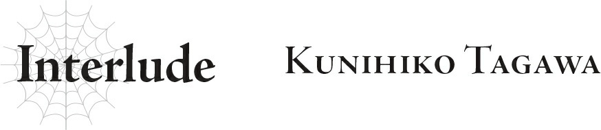

# Đoạn phụ: Kunihiko Tagawa
*(Interlude: Kunihiko Tagawa)*

…Phải rồi, mình làm hỏng chuyện rồi.

Nói thật, mình không thấy hối hận vì đã nổi giận với lớp trưởng đâu nhé?

Tất cả là tại những gì cô ta nói thôi.

Nhưng đáng lẽ ra mình không nên mất kiểm soát rồi suýt chút nữa ra tay đánh cô ta.

Lớp trưởng đã bị giam lỏng ở đây nhiều năm, nghĩa là các chỉ số của cô ta chắc chắn cực kỳ thấp.

Nếu mình lỡ ra đòn toàn lực, có khi cô ta đã chết thật rồi cũng nên…

“Theo cậu thì tớ nên làm gì?”

“Tớ nghĩ cậu nên xin lỗi đi.”

Tôi ngượng ngùng chạy đến chỗ Asaka, nhưng thái độ của cậu ấy có vẻ hơi lạnh lùng.

Lẽ nào cậu ấy không thể ít nhất cố gắng làm trung gian giảng hòa giữa tôi và lớp trưởng hay sao chứ?

“Thôi đi, đừng có xị mặt ra nữa. Nhớ xin lỗi cô ấy trong ngày hôm nay đấy nhé? Để càng lâu thì mọi chuyện sẽ càng khó xử hơn thôi.”

“…Được rồi.”

“Ý tớ là, không phải bây giờ—chắc cả hai đều cần bình tĩnh lại một chút đã. Hay là khoảng giờ ăn trưa cậu hãy đi?”

“Ừ, tớ sẽ làm thế.”

Có vẻ Asaka sẽ không đứng ra gánh vác hộ tôi vụ này rồi.

Những lúc thế này, tính thực tế của cậu ấy lại trỗi dậy thái quá…

Nhưng dù sao thì chuyện lần này đúng là lỗi của tôi thật.

Thế nhưng, điều đó có nghĩa là tôi có một khoảng thời gian trống để giết cho đến giờ trưa.

…Vậy thì, mình có nên đi giải quyết chuyện kia luôn không nhỉ?

Asaka vừa nói rằng trì hoãn những chuyện thế này chỉ tổ làm mọi thứ thêm khó xử.

Dù bản chất vụ này có hơi khác một chút, nhưng tôi nghĩ nếu để càng lâu thì sẽ càng khó thực hiện hơn thôi.

Chi bằng mình cứ cắn răng lao thẳng vào luôn cho xong.

“Asaka này.”

“…Gì thế? Tớ không thích cái ánh mắt đó của cậu đâu nhé.”

“Tớ định đi gặp Merazophis.”

Nghe vậy, Asaka đưa tay lên day day thái dương. “Chính xác là để làm gì cơ chứ…?”

“Không có gì to tát đâu. Rõ ràng là ở thời điểm này tớ không định lao vào quyết chiến với anh ta rồi. Nhất là khi vũ khí của tớ đã gãy làm đôi thế này.”

Thanh katana yêu quý của tôi đã bị tên khốn Kyouya đập nát trong trận chiến ngày hôm qua.

…Đúng thế, nó nát bét rồi.

Báu vật của tôi… Đi tong rồi…

“Cậu tự khơi chuyện ra rồi lại tự mình ngồi ủ rũ thế hả.”

“Nhưng thanh kiếếếm của tớ!”

Đó là món vũ khí tôi yêu thích nhất từ trước đến nay đấy!

Đó là kỷ vật từ hồi Asaka và tôi lập tổ đội với một nhóm mạo hiểm giả cấp cao, cùng nhau chung sức hạ gục một con quái vật siêu mạnh gọi là Lôi Long, rồi mang nguyên liệu thu thập được đến chỗ một thợ rèn tài hoa để rèn nên thanh katana tối thượng này!

Dĩ nhiên, cộng sự số một và tốt nhất của tôi luôn là Asaka, nhưng thanh katana đó chắc chắn xếp vị trí thứ hai sát nút!

Vậy mà giờ nó lại bị phá hủy tiêu tùng…

“Đừng có khóc nhè với tớ đấy nhé.”

“Tớ có khóc đâu!”

Dù đúng là tôi buồn phát khóc thật, nhưng rõ ràng tôi đã quá tuổi để thực sự rơi nước mắt vì một món đồ vật rồi.

“Gậy phép của cậu cũng bị gãy rồi còn gì? Cậu không thấy tiếc à?”

“Vũ khí thì trước sau gì cũng đến lúc phải gãy thôi.”

Lại là cái tính thực tế của cậu ấy nữa rồi…

“Haizz.” Cậu ấy thở dài. “Cậu chỉ định nói chuyện với anh ta thôi đúng không? Không làm gì khác chứ?”

“Ừm.”

Tôi không thể tính chuyện đối đầu với Merazophis khi không có vũ khí trong tay.

Mà ngay cả khi có kiếm, tôi đoán mình cũng chẳng có lấy một cơ hội chiến thắng nào nếu đấu tay đôi với anh ta.

Thế nên tôi không đến để khiêu khích hay gây sự.

Và nếu tôi không chủ động tấn công, tôi tin anh ta cũng sẽ không gây sự với tôi làm gì.

“Được rồi. Đi thôi.”

“Cậu cũng đi cùng tớ à?”

“Để cậu đi một mình tớ không yên tâm chút nào.”

“Nhưng cậu đi được không đấy?”

Tôi liếc nhìn về phía cô Oka đang nằm ngủ.

Asaka có nhiệm vụ túc trực theo dõi quá trình hồi phục của cô.

“Tớ sẽ gọi Chie vào thay ca trước khi đi.”

“À, Nanase sao?”

Người bạn tái sinh cùng lớp của chúng tôi, Nanase Chie, là một cô gái rất chu đáo. Tôi chắc chắn cậu ấy có thể lo liệu được chuyện này.

Thế là chúng tôi gọi Nanase đến bàn giao nhiệm vụ chăm sóc cô Oka trước khi rời đi.

Khi chúng tôi bước ra khỏi tòa nhà, một cô gái mặc áo choàng trắng khẽ phẩy tay ra lệnh, và tôi cảm nhận được có một kẻ mặc áo choàng trắng khác đang bám theo sau, nhưng tôi giả vờ như không nhận ra.

Việc họ giám sát chúng tôi cũng không có gì đáng ngạc nhiên.

Tôi tin chắc họ sẽ không tấn công chừng nào chúng tôi không có hành động gì kỳ lạ.

Nếu muốn giết chúng tôi, họ đã làm việc đó từ ngày hôm qua rồi.

Theo lời Wakaba và những người khác, họ giữ mạng cho chúng tôi “để tôn trọng mối liên kết từ kiếp trước”.

Dù vậy, vẫn có khả năng một bộ phận khác của quân đội ma tộc sẽ cố tấn công chúng tôi, nhưng tôi không nghĩ chúng tôi phải lo lắng về chuyện đó.

Ấn tượng của tôi về quân đội ma tộc cho đến nay là họ cực kỳ có kỷ luật.

Luôn trung thành tuyệt đối với nhiệm vụ.

Họ lạnh lùng thực hiện các mệnh lệnh được giao mà không để cảm xúc cá nhân xen vào, gần giống như những cỗ máy vậy.

Tôi không nghĩ họ dám làm trái lệnh của Wakaba, người rõ ràng có cấp bậc cao hơn họ rất nhiều.

Và điều tương tự cũng áp dụng cho Merazophis.

Thú thật, tôi không biết nhiều về anh ta lắm.

Chúng tôi mới chỉ thực sự gặp mặt nhau đúng ba lần.

Lần đầu tiên là tại quê hương của chúng tôi, khi anh ta tiêu diệt toàn bộ tộc của chúng tôi.

Anh ta đã giết tất cả mọi người, ngoại trừ tôi và Asaka.

Lần thứ hai là trong cuộc chiến chống lại ma tộc.

Dưới danh nghĩa là một thống lĩnh ma tộc, anh ta đã giao chiến với chúng tôi khi chúng tôi đang cố gắng phòng thủ một pháo đài.

Và lần thứ ba chính là trận chiến ngày hôm qua.

Nói là vậy, nhưng kẻ chiến đấu với chúng tôi ngày hôm qua chỉ là một cái bóng của anh ta được tạo ra bởi một kỹ năng nào đó mà thôi; tôi không chắc liệu chuyện đó có thực sự được tính là gặp mặt hay không.

Dù vậy, việc đó là bản thể thật hay phân thân bóng tối có lẽ không quá quan trọng, vì những lời nói và hành động đó vẫn là của chính anh ta.

Mặc dù chúng tôi hầu như không trao đổi lời nào.

Trong cả ba lần chạm trán này, lần đầu tiên anh ta đã hoàn toàn áp đảo chúng tôi, và hai lần sau đó chúng tôi giao chiến trên chiến trường.

Tự nhiên là không có cuộc gặp mặt nào trong số này có đủ thời gian cho một cuộc trò chuyện dài cả.

Nhưng sau hai lần đấu kiếm với anh ta, tôi nghĩ mình đã hiểu thêm được đôi chút về con người này.

Chẳng hạn như, tôi khá chắc chắn anh ta là một gã cực kỳ cứng nhắc và nghiêm túc.

Anh ta chính là hình mẫu lý tưởng của một người lính hoàn hảo.

Anh ta sẽ không bao giờ đi ngược lại mệnh lệnh của cấp trên, và chắc chắn sẽ không bao giờ tự ý tiêu diệt cả một ngôi làng theo ý muốn cá nhân.

Điều đó chỉ có thể dẫn đến một kết luận duy nhất.

Merazophis hủy diệt tộc của chúng tôi hẳn là do có mệnh lệnh từ cấp trên đưa xuống, đúng không?

Chẳng phải anh ta chỉ đang tuân lệnh sao?

Đó là giả thuyết của tôi.

Suốt thời gian qua, tôi đã chiến đấu với mục tiêu là một ngày nào đó sẽ đánh bại Merazophis, nhưng có lẽ tôi đã sai ngay từ đầu.

Thành thật mà nói, những gì Wakaba và những người khác tiết lộ quá đỗi chấn động, nó đã dập tắt phần nào ngọn lửa khát vọng trả thù của tôi.

Tôi muốn hiểu rõ hơn về họ, và về cả Merazophis, trước khi đưa ra quyết định tiếp theo.

Tôi muốn làm gì tiếp theo đây?

Để tìm ra câu trả lời cho việc đó, trước tiên tôi cần phải nói chuyện với Merazophis đã.

“Mà này, cậu có thực sự biết Merazophis ở đâu không thế?”

“Ờ thì…”

Chúng tôi đi lang thang không mục đích quanh làng Elf, cho đến khi kẻ mặc áo choàng trắng đang giám sát chúng tôi cuối cùng cũng chịu thua và đề nghị dẫn đường, giúp chúng tôi gặp được Merazophis trước giờ trưa.

…Xem ra lũ áo choàng trắng này cũng có mặt mềm mỏng đấy chứ.

Kẻ nào vừa bảo họ giống như những cỗ máy vô hồn ấy nhỉ? …À phải rồi, là tôi chứ ai.

“Vậy thì. Các cậu nói… các cậu muốn nói chuyện với tôi sao?”

Khi chúng tôi khăng khăng đòi nói chuyện với Merazophis, chúng tôi được dẫn vào một trong những ngôi nhà cây của tộc Elf.

Anh ta rõ ràng đang dọn dẹp chiến trường sau trận chiến, nhưng vẫn đồng ý tiếp đón chúng tôi ở đây.

Giờ đây, chúng tôi đang ngồi đối diện với anh ta qua một chiếc bàn.

“Phải. Trước hết, để tôi tự giới thiệu. Tôi là Tagawa Kunihiko, một người tái sinh.”

“Tôi là Kushitani Asaka, cũng là người tái sinh.”

“Tôi tên là Merazophis. Bản thân tôi không phải là người tái sinh, nhưng tôi có mối quan hệ thân thiết với ba người trong số họ.”

Chúng tôi bắt đầu bằng việc tự giới thiệu bản thân.

Asaka và tôi biết rất rõ về Merazophis, nhưng rất có thể anh ta còn chẳng biết nổi tên của chúng tôi.

Và còn một điều nữa tôi cần phải xác nhận.

“Có thể anh không nhớ chuyện này, nhưng khoảng mười năm trước, anh đã tiêu diệt một ngôi làng—thực chất là một khu định cư—và hai chúng tôi là những người sống sót duy nhất.”

“Tất nhiên là tôi nhớ chứ.”

Merazophis gật đầu.

May quá. Tôi không biết mình sẽ làm gì nếu anh ta bảo không nhớ nữa.

Tôi đã lo sợ rằng dù đây là một biến cố lớn làm thay đổi cuộc đời của Asaka và tôi, nhưng đối với Merazophis thì nó thậm chí còn không đáng để bận tâm ghi nhớ, nhưng hóa ra không phải vậy.

Nếu không, chắc tôi đã phải đấm cho anh ta một phát rồi.

Mặc dù tôi sẽ cố gắng kiềm chế bản thân, vì tôi vừa mới hứa với Asaka là không có ý định đánh nhau với anh ta.

…Nhưng tôi cũng không chắc liệu mình có thể nhịn nổi hay không nữa.

“Vậy thì câu chuyện sẽ dễ dàng hơn rồi. Tôi muốn biết tại sao quê hương và bộ tộc của chúng tôi lại phải bị hủy diệt. Và tôi muốn được nghe câu trả lời trực tiếp từ chính miệng anh.”

“Hừm…”

Merazophis có vẻ thực sự trầm ngâm suy nghĩ khi nghe câu hỏi của tôi.

Đúng như tôi dự đoán, anh ta không phải là một kẻ thủ ác điên cuồng quyết định xóa sổ cả một khu định cư mà không có lý do.

Chắc chắn phải có một lý do nào đó, và có ai đó đã giao nhiệm vụ này cho Merazophis thực hiện.

“…Các cậu định làm gì sau khi biết được thông tin đó?”

“Tôi không biết nữa,” tôi trả lời. “Tôi muốn nghe để giúp bản thân định hình xem mình nên làm gì tiếp theo.”

“Được thôi. Nhưng đó không phải là một câu chuyện dễ chịu gì đâu. Các cậu đã chuẩn bị tinh thần chưa?”

“Sẵn sàng rồi.”

Trước câu trả lời dứt khoát của tôi, Merazophis khẽ thở dài một tiếng.

Tôi đoán câu chuyện này có lẽ cũng chẳng dễ chịu gì đối với bản thân anh ta.

Anh ta chính là kẻ đã sát hại cha mẹ tôi cùng những người còn lại trong tộc, nhưng không hiểu sao thái độ của anh ta lại mang lại cho tôi một ấn tượng tốt.

Đồng thời, điều đó cũng khiến tôi có những cảm xúc lẫn lộn phức tạp.

Giống như kiểu, nếu anh ta chỉ là một tên phản diện điên loạn thuần túy, tôi đã có thể chiến đấu với anh ta mà không cần phải đắn đo hay do dự chút nào rồi.

“Vậy thì, chính xác là tôi nên bắt đầu từ đâu đây nhỉ…? Xin chờ một lát.”

Nói rồi, Merazophis đứng dậy và bước ra ngoài.

Sau đó anh ta quay lại với hai chiếc cốc lớn trên tay.

“Đây. Chuyện này có lẽ sẽ mất khá nhiều thời gian đấy.”

Anh ta đặt hai chiếc cốc xuống trước mặt tôi và Asaka.

Khốn kiếp, đúng là một gã chu đáo quá mức mà! Chắc anh ta đào hoa lắm đây!

“…Cảm ơn.”

“Xin cảm ơn anh.”

Tôi nén những suy nghĩ cằn nhằn trong đầu lại và gửi lời cảm ơn vì đồ uống.

Asaka lập tức cầm cốc lên và nhấp một ngụm.

Cậu ấy đúng là không bao giờ từ chối bất kỳ thứ gì được mời mà…

Lỡ như có độc hay gì đó thì sao? Mà không, tôi đoán Merazophis chẳng cần dùng đến những phương thức vòng vo như vậy để kết liễu chúng tôi làm gì, vả lại anh ta rõ ràng là không định giết chúng tôi rồi…

Tôi làm theo cậu ấy và uống thử một ngụm.

Đó là trà nóng có hương vị thoang thoảng giống như táo.

“Tôi sẽ cố gắng giải thích một cách khách quan nhất có thể, nhưng tôi đoán câu chuyện vẫn sẽ mang thiên hướng góc nhìn của ma tộc. Mong các cậu thông cảm.”

Những gì Merazophis kể tiếp theo thực sự chẳng dễ chịu chút nào, đúng như lời anh ta đã cảnh báo trước.

Thậm chí, nó còn cực kỳ u ám.

Đó là một lời giải thích rất dài dòng.

Đầu tiên, anh ta giải thích về cuộc nội chiến bên trong lãnh thổ ma tộc.

Thật khó để hình dung chuyện đó thì có liên quan gì đến việc quê hương của chúng tôi bị hủy diệt, nhưng tôi chắc chắn anh ta có lý do riêng khi bắt đầu từ đó.

Asaka và tôi im lặng ngồi lắng nghe.

Một đội quân phản loạn, được tộc Elf âm thầm hỗ trợ đằng sau, đã thành lập để chống lại Ma Vương.

Anh ta nói rằng cô Oka cũng nằm trong số những người Elf đó.

Nhưng quân phản loạn đã bị quân đội chính quy của ma tộc đè bẹp, khiến tộc Elf, bao gồm cả cô Oka, bị mắc kẹt lại trong lãnh thổ ma tộc và không có cách nào trở về lãnh thổ loài người một cách an toàn.

Chướng ngại lớn nhất ngăn cản con đường tẩu thoát của họ chính là Vùng Đệm Nhân-Ma, cụ thể là một bộ tộc sống ở đó.

Bộ tộc gồm những kẻ cướp bóc đê tiện này sẽ hạ thủ bất kỳ ai họ không quen biết ngay khi vừa nhìn thấy, và sống dựa trên những tài sản cướp đoạt được.

…Rõ ràng là anh ta đang ám chỉ quê hương của chúng tôi.

Thật thế sao?

Đó là những gì ma tộc nghĩ về bộ tộc của chúng tôi ư?

Tôi chết lặng vì sốc, nhưng Asaka trông có vẻ không mấy ngạc nhiên.

“À thì, rõ ràng là người trong tộc chúng ta rất dã man mà, cậu không nhớ sao?”

“Cááái gì cơ…?”

Hóa ra Asaka cũng nhìn nhận người trong tộc của chúng tôi như vậy sao.

Cậu ấy bảo tôi rằng bản thân cậu ấy từng hy vọng có thể rời bỏ khu định cư đó càng sớm càng tốt.

Thôi nào… thật đấy à…?

Tôi luôn nhớ về những người đàn ông trong bộ tộc đó như những người lớn mạnh mẽ và ngầu lòi. Lẽ nào tất cả chỉ là những ký ức được tô hồng suốt bấy lâu nay sao?

Sự thật bất ngờ và phũ phàng về bộ tộc của mình khiến tôi rơi vào trạng thái bàng hoàng hoang mang, nhưng Merazophis vẫn còn nhiều điều để nói.

Để đưa cô Oka trở về lãnh thổ loài người một cách an toàn, họ đã quyết định rằng lựa chọn duy nhất là chủ động tấn công và tiêu diệt quê hương của chúng tôi trước để dọn đường rút lui an toàn.

“Khoan đã. Tại sao các anh không đơn giản là bắt cô Oka làm tù binh chiến tranh hay gì đó tương tự?” Asaka hỏi.

“Tôi e rằng việc đó là bất khả thi, vì năng lực đặc biệt của Potimas Harrifenas.”

Tôi từng gặp Potimas, tộc trưởng của tộc Elf, một lần trước đây; hóa ra lão ta chính là lý do khiến thế giới này rơi vào cảnh hỗn loạn tàn tạ thế này.

Hơn nữa, lão ta có khả năng chiếm đoạt cơ thể của người khác.

Lão không thể làm thế với bất kỳ ai, nhưng rõ ràng nếu đối tượng đáp ứng đủ điều kiện, lão có thể xóa sạch tâm trí của họ và điều khiển cơ thể đó như của chính mình.

Cô Oka nằm trong số những vật chủ tiềm năng đó, vì vậy nếu họ giữ cô làm tù binh, Potimas có lẽ đã ngay lập tức chiếm đoạt cơ thể cô.

“…Khốn khiếp, đáng sợ thật.”

“Đúng vậy. Đó là lý do tại sao chúng tôi không thể động vào cô Oka được.”

Tôi đã biết từ những gì Wakaba nói rằng tộc Elf là rác rưởi, nhưng với năng lực đó, Potimas có vẻ còn tàn độc hơn tôi nghĩ nhiều.

Lão ta là một kẻ tồi tệ đến mức bản chất đó thể hiện ngay cả trong các năng lực của lão.

Nhưng chuyện này điên rồ thật…

“Vậy nói một cách gián tiếp, cô Oka chính là nguyên nhân khiến quê hương của chúng tôi bị hủy diệt sao?”

Hoàn toàn không phải lỗi của cô Oka chút nào, nhưng tôi vẫn cảm thấy có gì đó lấn cấn trong lòng.

“Đó là một phần lý do, nhưng sự hiện diện của các cậu ở đó cũng là một yếu tố nữa.”

“Hả? Là lỗi của chúng tôi sao?”

“Không, tôi không nghĩ có thể gọi đó là ‘lỗi’ của các cậu. Như các cậu đã biết, nơi đó là biên giới giữa lãnh thổ loài người và ma tộc. Một khi chiến tranh bùng nổ, nó sẽ sớm biến thành chiến trường, và bộ tộc của các cậu chắc chắn sẽ diệt vong. Sự thật là tình hình liên quan đến cô Oka đã đẩy nhanh sự hủy diệt của nó, nhưng bên cạnh đó cũng có mục tiêu là đưa hai người tái sinh các cậu ra khỏi vùng chiến sự và đến khu vực an toàn hơn càng sớm càng tốt trước khi cuộc chiến bắt đầu. Đồng thời, chúng tôi cũng không thể để các cậu chạm trán với cô Oka, người đang tập hợp các người tái sinh dưới sự kiểm soát của tộc Elf.”

“Cái… quái gì thế chứ? Chuyện này… tôi thậm chí còn…”

Tôi không thể thốt nên lời.

Anh ta đang nói cái gì vậy chứ?

Rằng chúng tôi cũng phải chịu một phần trách nhiệm cho việc cả bộ tộc bị xóa sổ sao?

Tôi đoán anh ta đã tha mạng cho tôi và Asaka là vì chúng tôi cũng là những người tái sinh.

“Ha-ha. Gì thế này, hóa ra những người tái sinh chúng tôi lại là những thiên sứ mang điềm tử thần hay sao chứ?”

“Như tôi đã nói, bộ tộc đó sớm muộn gì cũng sẽ bị cuốn vào cuộc chiến và bị hủy diệt mà thôi, bất kể thế nào đi nữa.”

Merazophis nói với tôi bằng tông giọng gần như là để an ủi khi tôi cười một cách cay đắng.

Thôi đi.

Đừng có tỏ ra tốt bụng với tôi khi anh đáng lẽ ra phải là mục tiêu trả thù của tôi chứ…

“Đó là toàn bộ câu chuyện về tình hình lúc bấy giờ.”

Merazophis kết thúc lời giải thích của mình.

Đúng như những gì chúng tôi đã được cảnh báo trước, tôi cảm thấy cực kỳ khó chịu sau khi nghe hết đống đó, nhưng nó cũng rất hợp lý.

Giờ đây, cuối cùng tôi cũng hiểu tại sao một kẻ mạnh đến mức phi lý như Merazophis lại bất ngờ tấn công khu định cư của chúng tôi mà không có bất kỳ lời cảnh báo nào.

Tôi đã dành nhiều năm tự hỏi anh ta từ đâu đến, và tại sao lại làm vậy.

Chưa kể đến lý do tại sao bộ tộc của chúng tôi lại là mục tiêu bị hủy diệt đột ngột như thế.

Bây giờ, những câu hỏi đó cuối cùng đã được giải đáp.

Ngay cả khi một phần trong tôi thầm nghĩ thà rằng mình đừng biết thì hơn.

“…Như các cậu thấy đấy, chúng tôi có lý do riêng để làm những gì mình đã làm. Nhưng điều đó không thay đổi được sự thật là chính tôi đã hủy hoại quê hương và sát hại bạn bè, người thân của các cậu. Các cậu hoàn toàn có quyền căm ghét tôi.”

Nói xong, Merazophis đứng dậy.

“Tôi không thể xin lỗi, và tôi cũng không thể tự nguyện dâng mạng sống của mình để chuộc tội. Nhưng tôi cũng sẽ không bao giờ từ chối lời khiêu chiến của các cậu. Tôi sẽ chiến đấu bất cứ khi nào các cậu muốn.”

Dứt lời, anh ta rời khỏi phòng.

Anh ta đang tỏ ra chu đáo với chúng tôi đấy à?

Có phải những lời cuối cùng đó là nỗ lực nhằm khích lệ tôi thoát khỏi trạng thái u uất rõ ràng này không?

Nói thật, tôi không muốn kẻ thù truyền kiếp của mình lại đối xử tốt với mình chút nào…

“…Mình đến đây để tìm kiếm sự thật nhằm biết được mình nên làm gì tiếp theo, nhưng giờ mình lại chưa bao giờ cảm thấy hoang mang như thế này, chết tiệt thật.”

Asaka im lặng đặt tay lên vai tôi.

Những chiếc cốc mà Merazophis rót cho chúng tôi giờ đã trống rỗng.

---

* [◀ Chương trước: Chương 4: Những người bạn](07_ch4_friends.md)
* [Chương tiếp theo: Đoạn phụ: Kengo Natsume](09_interlude_kengo_natsume.md)
