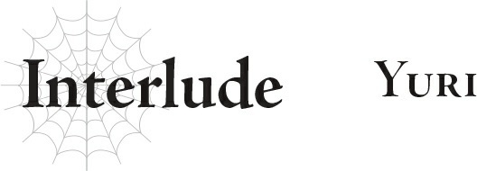

# Đoạn phụ: Yuri
*(Interlude: Yuri)*

“Chị Phelmina?”

Trở về phòng mình, tôi quay sang nhìn cô gái trẻ đã đi theo tôi vào trong.

Tôi thỉnh thoảng có gặp chị Phelmina kể từ khi tôi bị tẩy não.

Hiện tại, tôi đã biết chị ấy thuộc về một tổ chức hoàn toàn tách biệt với quân đội Đế quốc, nhưng ai mà ngờ nổi đó lại là quân đội ma tộc chứ?

Tôi đoán khi một người bị tẩy não, họ sẽ trở nên hoàn toàn mù tịt về những chuyện như thế.

Thế nên, tôi phải rút kinh nghiệm từ những sai lầm của mình bằng cách quan sát mọi thứ dưới mọi góc độ!

“Những lời Shun nói lúc nãy có phải là sự thật không?”

Tôi nhìn thẳng vào mắt chị Phelmina khi hỏi.

Chị ấy hơi ngả người ra sau như muốn né tránh tôi, nhưng tôi lại ghé mặt sát vào hơn nữa.

“…Ờm, cô ghé sát quá rồi đấy.”

“Trả lời em đi.”

“Tôi sẽ trả lời. Nhưng trước hết, xin cô vui lòng lùi lại được không?”

Chị Phelmina cắt đứt cuộc đọ mắt của hai chúng tôi và quay mặt đi chỗ khác.

Tin rằng chị ấy thực sự sẽ trả lời, tôi lùi lại một bước.

Dù sao thì việc có lòng tin và lòng thành kính cũng là điều vô cùng quan trọng mà.

“…Chỉ để cô biết trước, tôi chỉ có thể kể lại những gì mình nghe được từ Chủ nhân và Ma Vương thôi. Tôi không thể khẳng định tất cả có phải là sự thật hay không.”

Phelmina thở dài và chỉnh đốn lại tư thế trước khi tiếp tục.

“Chúng tôi không có cách nào chứng minh được liệu tình trạng hiện tại của thế giới này, hệ thống, cũng như những sự kiện trong quá khứ có được truyền đạt một cách chính xác hay không.”

“Tất nhiên rồi.”

Khi chị ấy nói như vậy, tôi nhận ra chị ấy nói đúng. Cả hai chúng tôi đều không thể chứng minh liệu những gì người khác kể cho mình có phải là sự thật hay không.

Ở thế giới cũ của chúng tôi, có rất nhiều thông tin trên Internet, nhưng độ chính xác của nhiều thông tin trong số đó cũng rất đáng nghi ngờ.

Thế nên chúng tôi cũng chẳng có cách nào biết được liệu những thông tin được dạy ở trường có hoàn toàn là sự thật hay không.

Bởi lẽ chúng tôi đâu có tự mình chứng kiến những sự kiện lịch sử đó, cũng như chưa bao giờ tận mắt nhìn thấy các nguyên tử mà chúng tôi học trong môn hóa học.

Tôi bắt đầu cảm thấy rằng việc biết cái gì là thật và nên tin vào cái gì thực sự rất quan trọng.

“Nhưng nếu cô không phiền, tôi rất sẵn lòng chia sẻ những gì mình nghe được, nếu cô muốn?”

“Xin chị hãy nói đi.”

“Được thôi.”

Thế là chị Phelmina kể cho tôi nghe mọi điều chị ấy biết.

Chị ấy có vẻ giải thích rất giỏi: Các ý chính đều dễ hiểu, và chị ấy không xen lẫn ý kiến hay cảm xúc cá nhân của mình khi nói.

Nhờ vậy, tôi có thể dễ dàng tiếp nhận mọi điều chị ấy kể.

“Đó là tất cả những gì tôi biết.”

“Em hiểu rồi. Cảm ơn chị.”

Sau khi chị ấy nói xong, tôi ngửa đầu hướng lên trời.

A, tâm trí tôi rối bời trong một mớ thông tin hỗn độn, tôi chẳng biết phải làm gì với chúng nữa.

Những lúc như thế này…

“Hả? Em-em đang làm gì thế?!”

Chị Phelmina kêu lên đầy sửng sốt, nhưng việc này thực sự giúp tôi bình tĩnh lại.

Về cơ bản, tôi tự cào mình bằng móng tay.

Phải, ngay cổ tay.

“Phải cầm máu ngay! Không, khoan đã! Ma pháp Trị liệu!”

Chị Phelmina lập tức chữa lành vết thương, nhưng vệt máu chảy ra và ký ức về cơn đau vẫn còn đọng lại.

Cảm giác lạnh lẽo khi móng tay tôi cứa rách da giúp tôi lấy lại sự tỉnh táo.

Sau đó, cơn đau và hơi ấm lan tỏa từ vết thương trấn an tôi.

Đã lâu lắm rồi tôi mới làm vậy, nhưng kiếp trước tôi lại làm chuyện này khá thường xuyên.

Vì thế giới này có Ma pháp Trị liệu nên nó thậm chí còn không để lại sẹo.

<Độ thông thạo đã đạt mức yêu cầu. Kỹ năng [Giảm Đau LV 8] đã trở thành [Giảm Đau LV 9].>

“A...”

Tôi nghe thấy một giọng nói.

Thần ngôn!

“Đúng vậy. Bất kể sự thật có thế nào đi chăng nữa, Thượng đế vẫn sẽ phán truyền cho chúng ta! Tôi có thể nghe thấy tiếng nói của Thượng đế!”

Tôi đưa tay hướng lên trời.

Tất cả những gì tôi nhìn thấy chỉ là trần nhà, nhưng tôi vẫn vươn tay hướng về những gì nằm ngoài tầm mắt đó!

“Lòng tin của tôi là ở ngay đây! Thượng đế! Ôi Thượng đế!”

Thượng đế là có thật.

Tôi có thể nghe thấy tiếng nói của Thượng đế.

Tôi không biết cái gì là thật, cái gì là giả, nhưng đây là sự thật duy nhất mà tôi sẽ không bao giờ nghi ngờ!

Dù cho giáo hội Thần Ngôn Giáo được xây dựng trên sự phô trương và giả dối, thì trái tim thành kính của tôi vẫn chân thật hơn bao giờ hết!

Tôi việc gì phải hoài nghi điều gì chứ!

Ngay từ đầu, tôi đã có câu trả lời cho riêng mình, và lòng tin của tôi chưa từng một lần lung lay!

“Hãy cầu nguyện nào! Hãy vui mừng nào! Thượng đế ơi! Nhân danh Thượng đế! Nữ thần Sariel! A, Nữ thần Sariel!”

A! Cảm giác thật phấn khích khi có thể thốt ra cái tên ban phước đó!

Tôi ước gì mình có thể chia sẻ niềm vui này với người khác!

“Chị Phelmina! Xin hãy cùng em!”

“Hả?! Ờ, tôi, k-không, xin kiếu...”

“Tiếc quá đi mà...”

---

* [◀ Chương trước: Đoạn phụ: Kengo Natsume](09_interlude_kengo_natsume.md)
* [Chương tiếp theo: Chương 5: Nhiệm vụ Thế giới](11_ch5_world_quest.md)
