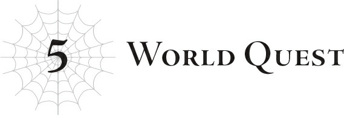

# Chương 5: Nhiệm vụ Thế giới
*(Chapter 5: World Quest)*

Mọi chuyện diễn ra quá nhanh.

Ngay sau khi Hắc và Ma Vương làm hòa, và bầu không khí bắt đầu dịu xuống...

Gương mặt Ma Vương bỗng nghiêm nghị trở lại, cùng lúc đó, Vampy và cậu Oni giật mình nhìn vào khoảng không vô định, làm như thể đang chăm chú lắng nghe thứ gì đó.

Nói thật nhé, tôi đã có linh cảm không lành về chuyện này rồi.

Tôi liền lệnh cho các phân thân hack vào hệ thống ngay lập tức.

Ở đó, tôi lén liếc nhìn nhật ký tin nhắn của Thần ngôn (tạm thời).

Nhìn biểu cảm của ba người bọn họ, tôi đồ rằng Thần ngôn (tạm thời) vừa đưa ra một loại thiên khải nào đó.

Và quả nhiên, tôi đoán chuẩn không cần chỉnh.

Ủa, cái gì thế này?

<Kích hoạt Nhiệm vụ Thế giới.
Một tà thần đang âm mưu hiến tế nhân loại để ngăn chặn sự sụp đổ của thế giới. Hãy ngăn chặn âm mưu này hoặc hỗ trợ thực hiện nó.>

...Ưưư, cái đồ D chết tiệt.

Lại tìm cách thọc gậy bánh xe vào kế hoạch của tôi rồi!

Áááá!

Nghiêm túc đấy, tha cho tôi đi! Chẳng nhờ vả được cái tích sự gì!

Tôi đã nghĩ thế nào cô ta cũng xen vào bằng cách này hay cách khác, nhưng không ngờ lại can thiệp một cách trắng trợn và rầm rộ thế này.

Cái danh xưng “tà thần” này chắc chắn là đang ám chỉ tôi chứ gì?

Nhưng D mới là tà thần duy nhất ở đây! Đúng là đồ tồi!

Ý tôi là, tôi cũng đã lờ mờ đoán được D sẽ không thấy vui vẻ gì nếu cứ để mọi chuyện tiếp diễn êm đềm như vậy.

Thế nên tôi đã chuẩn bị tinh thần cho một chuyện thế này xảy ra.

Nhưng mà, dù không hoàn toàn bất ngờ thì điều đó cũng đâu có nghĩa là tôi không được phép điên máu chứ.

Giống như kiểu có ai đó bảo “Tao sẽ đấm mày ngay bây giờ đấy! Chuẩn bị đi!”, rồi bạn gồng mình lên đợi bị đấm, và rồi họ đấm bạn thật và đau điếng người, tôi cá là bạn vẫn sẽ tức sôi máu lên đúng không?

Kịch bản lý tưởng của tôi vốn là tiếp tục âm thầm hoạt động ở hậu trường cho đến khi đạt được kết quả mong muốn.

Nói ngắn gọn, nếu tôi có thể phá hủy hệ thống mà không ai hay biết, tôi sẽ thắng.

Đến lúc mọi người nhận ra chuyện gì đang xảy ra thì hệ thống đã biến mất rồi. Và ừ thì, có lẽ một lượng lớn nhân loại sẽ chết trong quá trình đó, nhưng ít nhất thế giới và Nữ thần có thể sẽ được cứu.

Đối với những nạn nhân lớn nhất, hay chính là đại bộ phận nhân loại, chuyện này chẳng khác nào một thảm họa từ trên trời rơi xuống... nhưng đối với tôi, đó lại là kịch bản dễ dàng và tốt nhất.

Nhưng D có thực sự để mọi chuyện diễn ra dễ dàng như vậy không?

Đương nhiên là không rồi.

Dưới góc độ chơi game, chuyện đó giống như việc trùm cuối cứ lén lút hành động sau lưng, không hề đưa ra bất kỳ gợi ý nào cho người chơi về những gì đang diễn ra, cho đến khi họ đột ngột nhận một cú GAME OVER.

Thế thì ai thèm chơi nữa?

Ít nhất thì cũng phải đưa ra những gợi ý như kiểu “Trùm cuối đang âm mưu gì đó! Tốt nhất các ngươi nên ngăn hắn lại!” chứ.

Sau đó các anh hùng mới đứng lên để ngăn chặn kế hoạch của tên trùm tà ác!

Bạn không thể cứ đặt ra một giới hạn thời gian mà không bao giờ báo cho người chơi biết, để mặc họ tham gia vào một cuộc phiêu lưu chẳng liên quan gì cho đến khi đột ngột nhận một màn hình GAME OVER. Đó đúng là thiết kế game rác rưởi.

Nhưng dưới góc nhìn của trùm cuối thì thế lại dễ dàng hơn nhiều.

Mắc mớ gì mà trùm cuối phải đưa ra gợi ý cho các anh hùng, những kẻ hoàn toàn có thể sẽ tìm cách ngăn cản cô ta chứ?

Rõ ràng là cứ âm thầm thực hiện âm mưu tà ác của mình mà không cho ai biết vẫn tốt hơn.

Nếu hỏi tôi, tôi sẽ bảo game bất công với phe phản diện quá mức luôn ấy.

Và dù thế giới này có chỉ số và các tính năng giống như trong game, thì nó vẫn là thực tế.

Vậy thì mắc gì nó cứ phải hoạt động giống hệt như game chứ?

Thế nên tôi mới lén lút hoạt động sau hậu trường.

Oa-ha-ha, đến lúc các ngươi nhận ra chuyện gì đang diễn ra thì đã quá muộn rồi!

Ít nhất... đó là những gì tôi hy vọng sẽ diễn ra...

Thế giới này không phải là game, đúng là vậy.

Nhưng nó lại có một vị thần đóng vai trò như là Game Master.

Và còn là một kẻ phiền phức vô đối nữa.

Và giờ đây, dù muốn hay không, mọi thứ đã hội tụ đủ các yếu tố của giai đoạn cuối game.

Được thôi.

Nếu tôi là trùm cuối của trò chơi này, vậy ai sẽ là người chiến đấu chống lại tôi đây?

Trước hết là Giáo hoàng.

Giáo hoàng nỗ lực bảo vệ con người, cụ thể là nhân loại.

Về cơ bản, lão ta chính là người bảo hộ của nhân loại.

Vì tôi đang tìm cách gây hại cho nhân loại, lão ta chắc chắn sẽ chống lại tôi.

Chẳng có ích gì khi cố gắng thuyết phục lão thay đổi ý định đâu.

Không thể nào bẻ gãy được ý chí của người đàn ông đó. Ma Vương từng mô tả lão là một kẻ “kiên định đến mức quái dị”.

Lão ta là một lão già cứng đầu đã sống qua quá nhiều kiếp người đến mức thà bạn đi tranh luận với một bức tường gạch còn hơn.

Điều tồi tệ nhất về Giáo hoàng là, bên cạnh việc lão ta chắc chắn sẽ chống đối tôi, lão còn sở hữu một trong các kỹ năng Kẻ thống trị: [Tiết Chế].

Các đặc quyền Kẻ thống trị này, vốn đi kèm với các kỹ năng Thất Đại Tội và Thất Đại Đức Hạnh, chính là chìa khóa mở ra tính năng tự hủy bí mật của hệ thống.

Bằng cách mở khóa tất cả các chìa khóa Thống trị này, bạn có thể khiến hệ thống tự hủy.

Về mặt lý thuyết, tôi có thể dùng vũ lực để bẻ khóa một số chìa khóa đó.

Nhưng sự thật là tôi không hề biết chuyện đó sẽ để lại những hậu quả tiêu cực gì về sau.

Thế nên tôi muốn chọn giải pháp an toàn nhất có thể bằng cách thu thập tất cả các chìa khóa Thống trị.

Việc một trong những chìa khóa đó chắc chắn nằm ở phe địch thực sự khiến tôi điên tiết.

Nếu tôi muốn có được đặc quyền thống trị của [Tiết Chế], tôi phải thuyết phục Giáo hoàng giao nó ra hoặc biến lão thành một người chết.

Vàaa như tôi đã nói đấy, tôi chẳng thể thuyết phục lão ta làm bất cứ điều gì!

Thế là số phận của Giáo hoàng coi như đã được định đoạt.

Người khác chắc chắn sẽ chống lại tôi là Balto.

Bạn biết đấy, gã trợ lý đã theo hầu hạ Ma Vương suốt thời gian qua?

Ngạc nhiên lắm hả?

Không đáng ngạc nhiên thế đâu.

Balto đã dốc hết sức vì ma tộc suốt cả cuộc đời mình.

Phương pháp của anh ta có thể khác biệt, nhưng anh ta cũng chẳng khác gì Giáo hoàng hay Agner—những kẻ dốc hết lòng vì chủng tộc của mình.

Balto chỉ phục tùng Ma Vương vì anh ta đánh giá đó là lựa chọn tốt nhất cho toàn bộ ma tộc.

Nếu anh ta biết rằng sự sinh tồn của toàn thể ma tộc đang bị đe dọa, anh ta chắc chắn sẽ hạ quyết tâm chiến đấu chống lại mối hiểm họa đó, tức là tôi.

Anh ta đã từng đưa ra lựa chọn khó khăn là tiến hành chiến tranh chống lại nhân loại và chịu tổn thất nặng nề, thay vì thách thức Ma Vương và khiến chủng tộc của mình bị quét sạch hoàn toàn.

...Mặc dù anh ta có thể sẽ bị đau dạ dày trong quá trình đó.

Thế nên, Giáo hoàng và Balto.

Những người đại diện cho nhân loại và ma tộc chắc chắn sẽ tìm cách ngăn cản tôi.

Nói cách khác, về cơ bản tôi đang tự biến mình thành kẻ thù của đại đa số cư dân trên thế giới này.

Mặc dù xét đến việc từ thích hợp nhất để chỉ chung cả con người và ma tộc là “á nhân”, tôi nghĩ đã quá rõ ràng vị đại diện nào sẽ là kẻ phiền phức nhất rồi.

Nhưng có một người sẽ là vấn đề lớn hơn bất kỳ ai trong số họ—hoặc thậm chí là tất cả bọn họ cộng lại.

“Hừm...”

Người đó đang ở ngay trước mặt tôi, ngửa đầu lên trời thở dài một tiếng thườn thượt: Hắc, hay còn gọi là Quản trị viên Güliedistodiez.

Anh ta vẫn hướng mặt lên trời khi nói chuyện với tôi.

“...Ta đã nghi ngờ rằng mọi chuyện rồi sẽ dẫn đến thế này. Nếu cô phá hủy hệ thống, thế giới này sẽ được cứu. Ta không nghĩ đề xuất cứu thế đó của cô là giả dối. Thế nhưng...”

Hắc ngập ngừng một lát, rồi quay lại nhìn thẳng vào mặt tôi.

“Chưa bao giờ có chuyện thế giới đang hấp hối này, nơi chỉ còn cách sự hủy diệt một bước chân, lại có thể được cứu rỗi hoàn toàn mà không phải đánh đổi bằng bất kỳ sự hy sinh nào.”

Anh ta chậm rãi đứng dậy.

Ma Vương và cậu Oni cũng đứng dậy theo, vẻ mặt đầy căng thẳng.

Còn Vampy á? Ý tôi là, con bé vẫn đang bị trói chặt trong đống tơ của tôi, thế nên...

“Ariel. Về những gì chúng ta đã thảo luận trước đây, ta chỉ có thể tiếp tục chuộc lỗi như ta vẫn luôn làm. Ta sẽ tiếp tục cống hiến bản thân để kế thừa di nguyện của Sariel. Đó là tất cả những gì ta từng làm, và cũng là tất cả những gì ta sẽ làm. Vì thế...”

Anh ta quay đi tránh cái nhìn của tôi một lát để nhìn sang Ma Vương.

“Nếu bất kỳ ai có ý định chà đạp lên ước nguyện của Sariel, ta sẽ không cho phép, bất kể kẻ đó là ai. Cô vẫn có ý định tiến hành chuyện đó chứ?”

Ma Vương trả lời không một chút do dự.

“Đúng vậy. Chúng tôi đã quyết định rồi. Tôi xin lỗi.”

Câu trả lời dứt khoát ngay lập tức của cô ấy đã nói lên tất cả sự kiên định của mình.

“Đừng xin lỗi. Nếu có ai phải xin lỗi, thì đó phải là ta mới đúng. Một lần nữa, mọi chuyện dẫn đến thế này chỉ vì những thất bại của chính ta.”

Hắc mỉm cười, một nụ cười dịu dàng và đượm chút u buồn.

“Xin lỗi.”

Anh ta đã xin lỗi không ngừng từ nãy đến giờ, nhưng lời xin lỗi này mang lại cảm giác chứa đựng những ý nghĩa và cảm xúc nặng nề nhất.

Sau đó, anh ta rũ bỏ tất cả những điều đó, vẻ mặt trở nên vô cảm, quay đi khỏi Ma Vương để đối diện với tôi một lần nữa.

“Cô có nhớ những gì ta từng nói với cô không?”

Ờ, anh phải nói cụ thể hơn một chút chứ thế thì chịu.

“Nếu hành động của cô dẫn đến kết quả đi ngược lại với ý muốn của ta, thì rất có khả năng cô sẽ thấy ta đứng chặn đường cô đấy.”

Tôi không nghĩ anh ta biết chính xác tôi đang nghĩ gì, nhưng Hắc vẫn tiếp tục lặp lại câu nói mà anh ta đang đề cập.

Đó là điều anh ta đã nói với tôi khi Sariella và Ohts đang giao chiến, cụ thể hơn là sau khi Ma Vương xuất hiện ở đó và hai chúng tôi có một trận thư hùng quyết liệt.

Vào thời điểm đó, Ma Vương và tôi là kẻ thù, và Hắc đã giúp đỡ Ma Vương chỉ duy nhất một lần đó.

Sau đó, khi tôi sống sót qua chuyện đó, anh ta đã đến xin lỗi tôi.

Nhân tiện lúc đó, anh ta cũng yêu cầu tôi ngừng can thiệp vào chuyện của Ma Vương.

Lúc đó tôi đã từ chối thẳng thừng, và thế là anh ta trở nên suy sụp vì bản thân không thể làm được gì.

Tôi thấy hơi ái ngại nên đã bảo anh ta: “Anh nên làm bất cứ điều gì anh cảm thấy tốt nhất.”

(Nghĩ lại thì, đó có vẻ giống như loại lời khuyên mà một tà thần nào đó sẽ đưa ra.)

Chuyện đó có vẻ đã giúp anh ta lấy lại chút tinh thần, nhưng rồi anh ta lại đưa ra lời cảnh báo mà anh ta đang lặp lại lúc này.

“Có vẻ như thời khắc đó đã đến rồi.”

...Ừ thì, tôi cũng đoán thế rồi... Khốn kiếp thật chứ!

Hắc và tôi hành động gần như cùng một lúc.

Anh ta lao thẳng về phía tôi, vung nắm đấm lên.

Cậu Oni cố gắng chặn anh ta lại, nhưng cậu ta không đủ nhanh.

Ngay cả một con oni cũng không thể bắt kịp tốc độ của một vị thần thực thụ như Hắc.

Điều đó lại càng đúng với một Ma Vương đang kiệt sức, người thậm chí còn không kịp phản ứng.

Trong những phần triệu giây quý giá đó, tôi còn bận làm bất cứ điều gì có thể.

Không phải đối phó với Hắc, mà là về nhiều chuyện khác.

Tự nhiên, điều đó nghĩa là tôi quá bận tâm để phản ứng lại đòn tấn công của Hắc ngay lập tức, và nắm đấm của anh ta đâm xuyên thẳng qua ngực tôi.

Cánh tay anh ta cắm sâu vào tận nơi lẽ ra là vị trí của trái tim tôi.

Bất kỳ người bình thường nào chắc chắn đã chết rồi.

“Ta biết chỉ thế này thì không đủ để giết cô.”

Nhưng tất nhiên, một vị thần như Hắc không ngốc đến mức nghĩ rằng mình đã kết liễu tôi dễ dàng như vậy; anh ta bắt đầu bồi thêm một đòn tấn công tiếp theo.

Ngay lập tức, cảnh vật xung quanh tôi biến đổi.

Chúng tôi đang đứng trên một con đường thuộc một thành phố kỳ lạ, mang hơi hướng tương lai.

Ma Vương và những người khác đã biến mất không một dấu vết.

Trên thực tế, mặc dù nơi đây trông giống như một khu đô thị, nhưng hoàn toàn không có một bóng người.

Anh ta đã dịch chuyển chúng tôi.

Không, có lẽ chúng tôi hoàn toàn không còn ở trong cùng một thế giới nữa, mà là trên một chiến trường được dựng lên ở một chiều không gian tách biệt.

Giống như chiều không gian dị biệt nơi tôi chứa tất cả các phân thân nhí của mình vậy.

Hắc quật tôi xuống mặt đường cứng của không gian phi tự nhiên này.

Hự!

Ngay cả đối với một vị thần, việc cơ thể bị dập nát thế này cũng gây ra tổn thất không nhỏ.

Đặc biệt là khi bản thân tôi vẫn chỉ là một vị thần non trẻ.

Việc trái tim bị bóp nát rõ ràng là một đòn giáng nặng nề.

Nhưng không có chuyện tôi chết dễ dàng thế đâu nhé!

...Thực ra, nếu nghĩ kỹ lại thì, tôi đã từng trải qua đủ loại chấn thương kinh hoàng trước cả khi trở thành thần—bị xé xác thành trăm mảnh, trôi nổi ngoài đại dương chỉ còn mỗi cái đầu, đại loại thế. So với những trải nghiệm đó, việc bị đâm thủng tim cũng chẳng phải chuyện gì to tát cho lắm, đúng không?

Dù thế nào thì, tôi hoàn toàn ổn với mức độ sát thương này.

Nhưng điều đó không có nghĩa là tôi thích thú với việc bị ăn hành như thế này đâu!

Ưh! Gã này tàn nhẫn thật sự!

Nhưng tôi đoán từ đầu mình đã biết kiểu gì chuyện này cũng xảy ra rồi.

Đó chỉ là vấn đề về thứ tự ưu tiên, và ưu tiên của hai bên lại hoàn toàn khác biệt.

Ma Vương và tôi quan tâm hơn đến sự tồn tại tiếp tục của Nữ thần.

Hắc và Nữ thần lại quan tâm đến nguyện ước của Nữ thần hơn.

Chúng tôi đang cố gắng cứu mạng Nữ thần và ngó lơ ước nguyện của cô ấy trong quá trình đó.

Anh ta lại cố gắng tôn trọng ước nguyện của Nữ thần, ngay cả khi điều đó có nghĩa là để cô ấy tan biến.

Vì mục tiêu của hai bên xung đột trực tiếp nên việc va chạm là không thể tránh khỏi.

Trời đất ơi, phiền phức quá đi mất.

Mà Nữ thần mới là người bày ra cái mớ hỗn độn lớn nhất này đấy, biết không?

Chúng tôi ở đây cố gắng cứu mạng cô ấy, thế mà cô ấy lại muốn hy sinh cả sự tồn tại của mình vì lợi ích của nhân loại và mấy thứ nhảm nhí đại loại vậy.

Người mà chúng tôi đang cố gắng giải cứu thậm chí còn không muốn được cứu.

Thêm vào đó, phương pháp cứu cô ấy của chúng tôi là hy sinh phần lớn nhân loại, hoàn toàn đi ngược lại với mong muốn của cô ấy.

Tất nhiên là cô ấy sẽ nổi giận rồi.

Những gì chúng tôi đang cố gắng làm có lẽ trông thực sự tà ác dưới góc nhìn của một kẻ ngoài cuộc.

Nhưng chúng tôi vẫn sẽ làm.

Bởi vì đó là những gì Ma Vương mong muốn.

Cô ấy là người đã quyết định thực hiện chuyện đó, ngay cả khi điều đó có nghĩa là chống lại cả thế giới, ngay cả khi người cô ấy đang cố cứu sẽ căm ghét cô ấy vì việc đó.

Và tại sao Ma Vương lại không thể có ai đó đứng về phía mình chứ?

Nên tôi đã hạ quyết tâm này nọ rồi, nhưng thôi nào!

Thế này thì vẫn quá là khắc nghiệt đấy, ông bạn ơi!

Đành rằng tôi đã đoán trước kiểu gì mình cũng phải chiến đấu với Hắc, nhưng tôi không ngờ chuyện lại xảy ra sớm đến thế!

Cho tôi thêm chút thời gian chuẩn bị có được không hả?!

Anh có biết là tôi vẫn đang phải chạy đôn chạy đáo để giải quyết hậu quả của trận chiến với tộc Elf không?!

Làm sao tôi có thể chuẩn bị đầy đủ được khi anh lao vào tôi với một thời điểm thiếu tế nhị như thế chứ?!

Đồ D khốn kiếp!

Lúc nào cũng tìm cách đẩy tôi vào thế bất lợi!

Tôi lăn người sang một bên vừa kịp lúc để tránh bị nghiền nát bởi chân của Hắc.

Nó tạo ra một tiếng BÙM! điên cuồng khi đâm sầm xuống mặt đất nơi tôi vừa đứng.

Những vết nứt sâu hoắm hình thành trên mặt đất vốn bằng phẳng hoàn hảo bên dưới.

Nhưng tôi không thể chủ quan nghĩ rằng mọi chuyện không tệ chỉ vì mặt đất không bị vỡ vụn thành trăm mảnh.

Chúng tôi đang ở trong một chiều không gian do Hắc tạo ra.

Nếu tôi cứ đinh ninh các định luật vật lý hoạt động giống hệt như bình thường ở đây, tôi sẽ phải trả giá đắt.

Tôi đoán xương cốt của mình chắc chắn đã bị vỡ vụn thành trăm mảnh nếu dính trọn cú đó.

Vẫn tiếp tục lăn đi, tôi chống hai tay xuống đất và nhún người nhảy dựng lên.

Cái lỗ khổng lồ trên ngực tôi đã khép miệng.

Bất kỳ vị thần nào có chút bản lĩnh đều có thể ngay lập tức tái tạo lại từ một vết thương như vậy.

Nhưng mà, khoan đã, xin một giây ngưng bắn!

Tôi ngả người ra sau và suýt chút nữa là không né kịp nắm đấm của Hắc đang lao thẳng vào mặt!

Một cú ngả người Ina Bauer hoàn hảo!

Hay đúng hơn là giống như trong phim Ma Trận (The Matrix)!

Dù thế nào thì tôi cũng chống hai tay xuống đất tạo thành tư thế uốn dẻo hình cây cầu hoàn hảo!

Rồi tôi bò lùi đi như thế theo kiểu phim Quỷ Ám (The Exorcist)!

Gì cơ, trông rợn người lắm à?

Làm như tôi có thời gian để bận tâm về chuyện đó ấy!

Hắc, ông bạn ơi, ít ra thì cũng phải nương tay một chút chứ!

Anh quay sang cắn tôi ngay giây phút D phát đi cái nhiệm vụ thế giới ngu ngốc đó, rồi ném tôi vào kết giới của anh và tấn công tôi trước khi tôi kịp đứng dậy à?

Kẻ mạnh hơn mà chơi bài đó thì bất công quá thể!

Nếu anh biết mình mạnh hơn tôi, ít ra anh cũng nên có chút lịch sự mà tỏ ra tự tin thái quá đi chứ, giống như vị hoàng kim chi vương được mọi người yêu thích ấy!

Anh thậm chí còn chả phải là vua, anh là một vị thần chết tiệt kia mà!

Trong lúc tôi đang bò lùi điên cuồng, Hắc đuổi kịp tôi ngay lập tức và đá thẳng vào lưng tôi, tiễn tôi bay vút lên trời cao.

HỰC!

Ờm, tôi không nghĩ cơ thể người lại có thể phát ra âm thanh như thế!

A lô?! Chuyện này thực sự có vẻ là tin xấu đấy!

Khi cơ thể tôi đang bay lơ lửng trên không trung, nắm đấm của Hắc lại lao tới.

Nó đâm thẳng qua chính giữa ngực tôi, xuyên qua người tôi hệt như lần trước.

Ha ha ha.

Thế là đi tong cái kết giới phòng ngự tôi cất công dựng lên...

Tôi đoán chuyện này không có gì đáng cười cả.

Tình hình đang trở nên nghiêm trọng hơn tôi nghĩ rất nhiều.

Chân tay tôi có cảm giác chậm chạp như thể đang di chuyển dưới nước, và tôi cũng chẳng thể tự bảo vệ mình.

Tôi nghĩ lý do đầu tiên là vì đây là kết giới do Hắc tạo ra.

Chừng nào chủ nhân của kết giới còn ở đây, tôi sẽ không thể sử dụng toàn bộ sức mạnh của mình.

Và lý do khiến hàng phòng thủ của tôi vô dụng là vì kết giới của Hắc đang triệt tiêu kết giới của tôi.

Anh ta sở hữu một [Long Mạc] thực thụ nhất, loại kết giới mà chỉ những con rồng thực sự mới có thể sử dụng: một kết giới bá đạo vô đối có khả năng triệt tiêu mọi loại thuật thức cấu tạo mà không có bất kỳ ngoại lệ nào.

Dùng để phòng thủ, nó có thể vô hiệu hóa mọi thuật thức tấn công; dùng để tấn công, nó có thể phá vỡ trực tiếp các hàng phòng thủ của kẻ địch, giống như cách anh ta vừa làm.

Nghiêm túc đấy, cái này là ăn gian trắng trợn luôn.

Không công bằng chút nào.

Anh ta sở hữu sức mạnh gian lận siêu lỗi này, và đang sử dụng nó với độ chính xác tuyệt đối để tìm cách lấy mạng tôi.

Trong khi bản thân tôi còn lâu mới chuẩn bị được hoàn hảo!

Ôi trời, tôi không thể nào đối phó nổi với một đối thủ mạnh hơn mà lại không hề lơ là cảnh giác vì kiêu ngạo.

Tôi luôn nghĩ rằng nếu thời khắc quyết chiến sinh tử với Hắc đến, việc đầu tiên tôi làm sẽ là dụ anh ta vào lãnh địa của mình, nhưng giờ anh ta lại đi trước tôi một bước ngay trong trò chơi của chính tôi à?

Không thể nào.

Ưh.

Được rồi, than vãn cũng chẳng giải quyết được gì.

Tôi đoán mình không còn lựa chọn nào khác.

Chuyện này thậm chí còn chẳng giống một chút nào với những gì tôi hy vọng, nhưng điều đó không làm thay đổi những gì tôi phải làm.

Chỉ cần nện cho Hắc một trận tơi tả và đưa kế hoạch khôi phục thế giới của tôi vào hoạt động.

Hừm.

Tôi chộp lấy cánh tay của Hắc—nhân tiện thì nó vẫn đang đâm xuyên qua ngực tôi.

Cùng lúc đó, tôi biến phần thân dưới của mình thành dạng nhện và chém thẳng vào anh ta bằng hai cái chân trước dạng lưỡi hái.

Hắc rũ bỏ sự kìm kẹp của tôi, giật phắt cánh tay ra và nhảy lùi lại.

Tác động từ kết giới này đã làm chậm các lưỡi hái của tôi, khiến chúng dễ dàng bị né tránh.

Mà ngay cả khi có trúng đi chăng nữa, anh ta có lẽ vẫn sẽ bình an vô sự nhờ có [Long Mạc].

Tôi đoán điều đó có nghĩa là anh ta đang cực kỳ dè chừng tôi.

Nhưng may mắn là điều đó đã tạo ra chút khoảng cách giữa hai bên—dù chuyện đó cũng chẳng mang nhiều ý nghĩa cho lắm, vì đây là lãnh địa của Hắc.

Dù sao thì, một kết giới do thần tạo ra về cơ bản chính là phần mở rộng từ cơ thể của vị thần đó.

Nó mang lại cho anh ta lợi thế và đẩy tôi vào thế bất lợi.

Chừng nào chúng tôi còn ở trong này, anh ta luôn là người chiếm ưu thế.

Nhưng điều đó không có nghĩa là tôi sẽ cam chịu chịu đòn.

Những con nhện trắng bắt đầu bò ra từ cái bóng của tôi.

Nhiều vô số kể.

Mỗi khi một con nhện xuất hiện, kết giới xung quanh chúng tôi lại bị bóp méo, giống như thể chúng đang ăn mòn không gian.

“Đừng hòng!”

Hắc vung nắm đấm lao lên, nhưng bầy nhện trắng đã nhanh chóng tản ra trước mặt anh ta.

Tất nhiên, tôi cũng nhảy lùi lại để tránh đòn tấn công của anh ta.

Những con nhện trắng vừa tản ra lại tiếp tục gọi thêm đồng bọn, và bọn chúng lại kéo thêm nhiều con khác nữa.

Bầy nhện trắng không ngừng sinh sôi nảy nở xung quanh hai chúng tôi.

Và tất cả bọn chúng đều đang ngốn ngấu kết giới mà Hắc tạo dựng.

“Nhiều quá...”

Hê-hê-hê!

Anh tưởng tôi cứ thế ăn đòn vô cớ à?!

...Được rồi, đúng là thế thật.

Tôi đã bị ăn hành ngập mặt.

Nhưng mà, tôi cũng đang cho các phân thân hoạt động, sắp xếp để bọn chúng đột nhập vào kết giới của Hắc!

Cái lỗ trên ngực tôi lại khép miệng một lần nữa.

Phù. Giờ thì trận chiến thực sự mới bắt đầu!

Tôi chả có chút ký ức nào về việc mình bị ăn hành suốt từ nãy đến giờ nhé!

“Chậc!”

Hắc cau mày khó chịu.

Anh ta liên tục tìm cách tấn công bản thể của tôi, nhưng tôi đều đặn rút lui, duy trì khoảng cách giữa cả hai.

Tốc độ tấn công của anh ta và tốc độ rút lui của tôi cân tài cân sức.

Cơ thể tôi không còn bị làm chậm như lúc trước nữa.

Một trận chiến giữa hai bậc thầy cấu tạo không gian cũng giống như một ván cờ Othello vậy.

Mọi thứ xoay quanh việc mở rộng lãnh địa của bản thân và ngăn cản đối phương mở rộng lãnh địa của họ.

Và ngay lúc này, bầy phân thân nhện trắng của tôi đang chiếm đoạt kết giới của Hắc với tốc độ đáng kinh ngạc, biến nó thành của riêng tôi.

Oa-ha-ha-ha-ha!

Tôi đâu có luyện tập năng lực của mình một cách vô ích chứ, biết không!

Hãy cúi đầu trước các kỹ năng chuyên biệt hóa đến mức cực đoan của tôi đi!

Khi Hắc tiếp tục lao nhanh đuổi theo tôi, tôi tránh anh ta bằng cách rút lui với tốc độ tương đương.

Trong lúc đó, các phân thân không ngừng triệu hồi thêm phân thân khác, ghi đè lên lãnh địa của Hắc.

Tôi thở phào nhẹ nhõm khi thấy khả năng thao tác thuật thức không gian của mình có vẻ vượt trội hơn anh ta.

Nếu không thì tôi đã chẳng có lấy một cơ hội chiến thắng trong trận chiến này rồi.

Ít nhất tôi cũng phải tự lực gánh sinh được trong khoản cấu tạo không gian, nếu không thì tôi đã tiêu đời từ lâu rồi.

Bạn có thể thấy kết giới quan trọng và đáng sợ đến mức nào qua việc tôi bị ăn hành tơi tả ra sao khi mới bị lôi vào đây.

Về cơ bản thì nó giống như việc liên tục buff cho bản thân và áp debuff lên đối thủ vậy.

Nếu bạn không có cách nào để kháng cự lại chuyện đó, bạn sẽ bị hạ gục chỉ trong nháy mắt.

Đó là lý do tại sao cấu tạo không gian là năng lực sống còn đối với các vị thần.

Dù vậy, tất cả những điều này chỉ là điều kiện tiên quyết để cố gắng chiến đấu với một vị thần mạnh mẽ; về cơ bản, tôi chỉ mới bước chân tới vạch xuất phát mà thôi.

Nếu tôi không có kỹ năng cấu tạo không gian tương đương hoặc tốt hơn, tôi thậm chí còn chẳng đủ tư cách để chiến đấu với anh ta.

Tôi rất mừng vì năng lực của mình tốt hơn, nhưng điều đó về cơ bản vẫn bị triệt tiêu bởi tất cả những sát thương tôi phải nhận từ đòn tấn công phủ đầu của anh ta.

Vì anh ta được quyền đi trước, tôi đã bị chậm một bước trong việc triển khai kết giới của riêng mình.

Mặc dù hiện tại tôi đang tìm cách chiếm lấy kết giới của anh ta, nhưng tốc độ không được nhanh như tôi mong muốn.

Tôi phải chuẩn bị tinh thần cho một cuộc chiến trường kỳ nếu hy vọng chiếm được toàn bộ nơi này.

Thế nên, xét theo khía cạnh đó, tình thế hiện tại của tôi vẫn cực kỳyyyy tồi tệ.

Ngay từ đầu tôi đã đinh ninh khả năng cấu tạo không gian của mình phải ngang ngửa hoặc tốt hơn anh ta, và quả nhiên tôi đã đúng.

Nhưng tôi đã phải chịu nhiều sát thương hơn vì anh ta đi trước; thay vì dụ anh ta vào lãnh địa của tôi, chúng tôi lại bắt đầu ngay trong địa bàn của anh ta.

Thêm vào đó, Hắc mạnh hơn tôi.

Để tôi có thể đánh bại một đối thủ mạnh hơn, tôi buộc phải có được lợi thế sân nhà đứng về phía mình.

Vì chưa làm được điều đó nên tôi đang gặp rắc rối to.

“Hửm?!”

Những sợi tơ được chăng giữa các tòa nhà quấn chặt lấy cơ thể Hắc.

Các phân thân của tôi đã giăng những mạng nhện này từ trước.

Và tất nhiên đây không phải là những sợi tơ thông thường.

Tôi đã áp dụng thuật thức không gian trong quá trình dệt để biến các sợi tơ này thành thứ gần như không thể bị cắt đứt.

Một khi đã bị vướng vào đống tơ này, không bao giờ có chuyện thoát ra ngoài.

Hoặc ít nhất thì, lẽ ra là phải như thế...

Hắc chỉ khẽ vung tay một cách thản nhiên.

Chỉ thế thôi cũng đủ để chém đứt và phá hủy hoàn toàn những sợi tơ đáng tự hào của tôi.

Cái kết giới gian lận chết tiệt kia!

Những sợi tơ của tôi được tạo ra bằng thuật thức, nên chúng hoàn toàn vô hiệu trước [Long Mạc] của Hắc, thứ có thể xóa bỏ mọi loại thuật thức cấu tạo.

Tôi thừa biết điều đó trước khi lâm trận rồi, nhưng tôi vẫn thầm hy vọng được nhìn thấy một vị thần toàn năng bị mắc kẹt trong mạng nhện và giãy giụa bất lực. Không may mắn thế rồi hả?

Ừ thì, chuyện đó thực ra chỉ là phần thưởng thêm thôi, mục đích chính vẫn là câu kéo chút ít thời gian.

Chỉ trong vài giây ngắn ngủi Hắc bị đống tơ làm xao lãng, tôi đã kéo dài khoảng cách giữa mình và anh ta thêm một chút.

Hiện tại, ưu tiên hàng đầu của tôi là câu giờ cho đến khi biến được kết giới của Hắc thành của riêng mình.

Việc phản công có thể đợi đến khi chuyện đó hoàn thành.

Trên thực tế, bắt buộc phải như thế, vì lúc này tôi không còn lấy một giây rảnh rỗi nào để nghĩ đến chuyện đó!

Dù sao thì, tôi cũng chẳng có nhiều con bài tẩy trong tay.

Thành thật mà nói, tôi nghĩ mình chắc là không đủ tư cách làm thần cho lắm.

Tôi chỉ có cấu tạo không gian, phân thân và Tà Nhãn.

Gần như chỉ có thế mà thôi.

Nên tôi tạo dựng lợi thế sân nhà bằng cấu tạo không gian, trốn trong đó, rồi sử dụng vô số phân thân để dìm chết đối thủ bằng Tà Nhãn.

Tôi chẳng có mấy phương thức tấn công khác ngoài những thứ đó.

Một phần vấn đề là tôi không có nhiều thời gian để học các cách chiến đấu khác chống lại một vị thần thực sự, vô cùng mạnh mẽ.

Ý tôi là, tôi chỉ là một vị thần tân binh mới được thần hóa gần đây. Cách duy nhất để tôi có thể đương đầu với một cựu thần sừng sỏ như Hắc là chọn ra một thứ duy nhất để tập trung vào và hy vọng sẽ đánh bại anh ta ở khoản đó.

Nếu tôi cứ phô diễn đủ mọi chiêu trò nửa mùa có trong sách, tôi đồ rằng tất cả sẽ chẳng đi đến đâu.

Thế nên tôi quyết định tập trung hoàn toàn vào những thế mạnh của mình: cấu tạo không gian và Tà Nhãn.

Có điều, chuyện này hơi mang tính đánh bạc.

Về cơ bản tôi chỉ có duy nhất một phương thức tấn công là Tà Nhãn, nên nếu anh ta tìm ra cách vô hiệu hóa nó, tôi coi như cầm chắc cái chết.

Tôi không nghĩ đó là thứ có thể bị khắc chế dễ dàng như vậy, nhưng không gì là không thể.

Thế nên khi chiến đấu với đống vũ khí của Potimas, tôi đã cố gắng không để lão nhìn thấy các chiêu thức của mình.

Để thử nghiệm, tôi cho một phân thân sử dụng Tà Nhãn lên anh ta.

“Hự!”

Ồ? Có tác dụng sao?

Nhìn vào phản ứng của anh ta, có vẻ như Hắc không có cách nào để chặn được Tà Nhãn của tôi.

Chuyện đó chắc chắn là một sự nhẹ nhõm lớn, nhưng hiện tại tôi cần bầy phân thân tập trung vào việc ghi đè kết giới. Tôi không thể lãng phí thời gian để dùng Tà Nhãn lúc này.

Đòn tấn công phủ đầu đó thực sự đã tạo nên sự khác biệt quá lớn.

Giờ đây lợi thế sân nhà và Tà Nhãn của tôi đều nằm ngoài tầm với, buộc tôi phải rơi vào thế phòng ngự thụ động.

Nhưng ở chiều ngược lại, điều đó cũng có nghĩa là dù đang gặp bất lợi lớn, tôi vẫn xoay xở để tự lực cánh sinh trụ vững.

Đành rằng ban đầu tôi đã bị ăn hành ngập mặt và mất đi một lượng ma lực khổng lồ trong quá trình đó, nhưng tôi vẫn có thể đứng dậy khá dễ dàng.

Thành thật mà nói, việc tôi không phải nhận thêm nhiều sát thương giống như một sự may mắn lớn, bởi tôi cứ đinh ninh một đòn dính trọn cũng đủ giết chết mình rồi.

Sức tấn công của Hắc không cao như tôi nghĩ.

Và vì anh ta vẫn đang cố gắng tiếp cận cận chiến, anh ta hẳn cũng không có đòn tấn công tầm xa mạnh mẽ nào.

Tôi đoán Hắc thuộc kiểu thần chuyên phòng thủ, với [Long Mạc] và mấy thứ tương tự.

Bản chất các vị thần vốn dĩ đã cực kỳ bất công rồi.

Chẳng hạn như, ngay cả khi bạn xoay xở làm tổn thương họ, họ vẫn sẽ hoàn toàn hồi phục trong chớp mắt.

Ngay cả cơ thể tôi hiện tại cũng đã chữa lành hoàn toàn những sát thương mà Hắc gây ra.

Thế nên việc làm bất cứ điều gì để gây tổn thương vật lý cho một vị thần là cực kỳ khó khăn.

Bất kể bạn có bóp nát tim hay thổi bay đầu họ đi chăng nữa, họ vẫn sẽ lập tức quay trở lại trạng thái bình thường.

Nhưng tất nhiên, ngay cả thần thánh cũng sẽ mất khả năng suy nghĩ trong vài giây nếu bị mất đầu.

Trừ khi bọn họ đã chuẩn bị sẵn từ trước để tự động phục hồi.

Bản thân tôi cũng có một chiến sách đối phó cho chuyện đó, nên tôi chắc chắn bất kỳ ai tự xưng là thần cũng vậy thôi.

Chỉ có một số ít phương pháp để đánh bại một vị thần như thế.

Bạn có thể chia chúng thành hai loại chính: bào mòn thể lực, hoặc đập tan linh hồn.

Những ví dụ điển hình nhất mà tôi biết về cách sau là Tấn công Dị giáo và Ma pháp Vực sâu.

Đúng là chỉ có D mới thản nhiên xây dựng các kỹ năng có thể tiêu diệt một vị thần như vậy.

Hành động đó chẳng đáng yêu chút nào cả.

Rốt cuộc cô ta nghĩ cái quái gì không biết?

Dù thế nào thì, phương pháp đó vẫn là quá cao siêu đối với tôi.

Thế mà D lại để mặc cho những kẻ thậm chí còn chẳng phải là thần sử dụng nó.

Hành động đó chẳng đáng yêu chút nào cả.

Nghiêm túc đấy, rốt cuộc cô ta nghĩ cái quái gì vậy hả?

Tôi phải nói chuyện này hai lần, vì nó cực kỳ quan trọng.

Linh hồn là cốt lõi của một sinh thể.

Ngay cả thần thánh cũng không thể tiếp tục tồn tại nếu linh hồn của họ bị hủy diệt.

Nó thực sự giống như chân thể của một vị thần vậy.

Đó chính là diễn tiến cơ bản của một cuộc chiến giữa các vị thần.

Tìm cách tiêu diệt linh hồn của đối thủ và tìm cách ngăn chặn họ tiêu diệt linh hồn của mình.

Nghiên cứu ra một phương pháp có tác dụng lên họ và tìm ra sơ hở để sử dụng nó.

Ít nhất thì, lẽ ra là phải như thế.

Nhưng cái thân xác nhỏ bé này của tôi thì không làm được điều đóuu.

Về cơ bản tôi đã trở thành thần nhờ vào một mã gian lận kỳ lạ nào đó, khiến tôi không có bất kỳ năng lực bí mật đặc biệt nào.

Thế nên phương pháp khả thi duy nhất của tôi là phương án còn lại: bào mòn thể lực đối phương.

Bào mòn cái gì cơ, bạn hỏi thế à?

Tất nhiên là năng lượng rồi.

Đó là nguồn động lực cho bất kỳ vị thần nào.

Nếu linh hồn là trái tim của một vị thần, thì năng lượng chính là dòng máu của vị thần đó.

Họ sử dụng nó để thực hiện đủ loại phép mầu.

Ngay lập tức chữa lành một vết thương chí mạng chính là một trong những công dụng của nguồn năng lượng đó.

Tất nhiên, nếu cạn kiệt năng lượng, họ sẽ không thể làm việc đó được nữa.

Nói cách cách khác, họ sẽ chết.

Nhờ có Tà Nhãn, tôi chuyên về khoản đánh cắp nguồn năng lượng đó.

Tôi chậm rãi gặm nhấm đối thủ của mình, giống như chất độc đang ngấm dần vào cơ thể họ vậy.

Nhưng hãy nhìn xem, có một vấn đề duy nhất với phương pháp này...

Kiểu như, “thần” về cơ bản là một sinh thể có lượng năng lượng tích trữ khổng lồ đến điên rồ, đúng không?

Và kiểu như, tôi phải hút cạn sạch sành sanh đống năng lượng đó, đúng không?

Chuyện đó sẽ tốn hàng tá thời gian đấy, nhỉ?

Ừ, bạn biết thừa mà.

Phương pháp bào mòn này tốn cực kỳyyyy nhiều thời gian.

Thêm vào đó, Hắc lại có cái [Long Mạc] chết tiệt kia nữa.

Tôi không nghĩ nó có thể chặn hoàn toàn Tà Nhãn của mình, nhưng chắc chắn nó sẽ làm chậm hiệu quả đi đáng kể.

Thêm nữa, tôi vẫn đang bận rộn chuẩn bị căn cứ của mình cho kế hoạch đó.

Mà Hắc cũng không có đủ hỏa lực để hạ gục tôi chỉ trong một đòn.

Tất cả những điều này chỉ dẫn đến một kết quả duy nhất: một trận chiến kéo dài cực đoan.

Về cơ bản, chúng tôi đang bắt đầu một cuộc thi chạy marathon sức bền xem ai là người kiệt sức trước.

Uầy. Thế thì chẳng vui chút nào...

Trận chiến này sẽ mất bao nhiêu ngày mới kết thúc đây?

Không, thậm chí có khi phải mất vài tháng...

Có lẽ là không đến mức tính bằng năm đâu, hoặc ít nhất tôi thực sự hy vọng thế.

Nếu chuyện đó thực sự xảy ra, tôi cá chắc mình sẽ là người đổ gục trước.

Tôi phải sắp đặt mọi thứ sao cho Hắc là người ngã xuống.

Lý do tôi làm việc cật lực trước khi bị ném vào chiều không gian này là vì tôi biết trận chiến này sẽ mất rất nhiều thời gian.

Vì tôi sẽ hoàn toàn bị cuốn vào trận chiến này trong một khoảng thời gian, tôi muốn nhanh chóng hoàn thành mọi việc khác mà mình cần giải quyết trước.

Mặc dù rốt cuộc tôi lại để Hắc có cơ hội ra tay trước cũng chính vì lý do đó.

Thêm nữa, vì vội vã như vậy nên tôi gần như đã quẳng hết toàn bộ công việc còn lại cho những người khác gánh vác.

Nhưng giờ tôi cũng chẳng thể làm gì khác ngoài hy vọng bọn họ có thể giải quyết ổn thỏa.

Tất nhiên là tôi rất lo lắng, nhưng lúc này tôi không còn lấy một giây rảnh rỗi nào để nghĩ về chuyện đó cả.

Dù sao thì, đối thủ của tôi là Hắc, vị thần mạnh nhất thế giới này với khoảng cách chênh lệch cực lớn.

Anh ta cũng là đối thủ mạnh nhất mà tôi từng đối mặt.

Thẳng thắn mà nói, việc một vị thần tân binh như tôi đi đối đầu với anh ta có lẽ là một ý tưởng tồi tệ.

Nhưng kể từ khi trở thành thần, tôi đã không ngừng rèn luyện chính vì khoảnh khắc này.

Đừng có mà nghĩ là tôi sẽ dễ dàng gục ngã đấy nhé.

Không hề ngoa khi nói rằng kết cục của trận chiến này sẽ ảnh hưởng đến tiến trình của toàn bộ thế giới.

Được rồi, hãy phân định thắng thua một lần sòng phẳng luôn nào, Hắc và Bạch!

…Mặc dù vậy, tôi tốt nhất nên bắt đầu triển khai kế hoạch dự phòng của mình thôi.

---

* [◀ Chương trước: Đoạn phụ: Yuri](10_interlude_yuri.md)
* [Chương tiếp theo: S4: Thay đổi cảnh tượng](12_s4_change_of_scenery.md)
