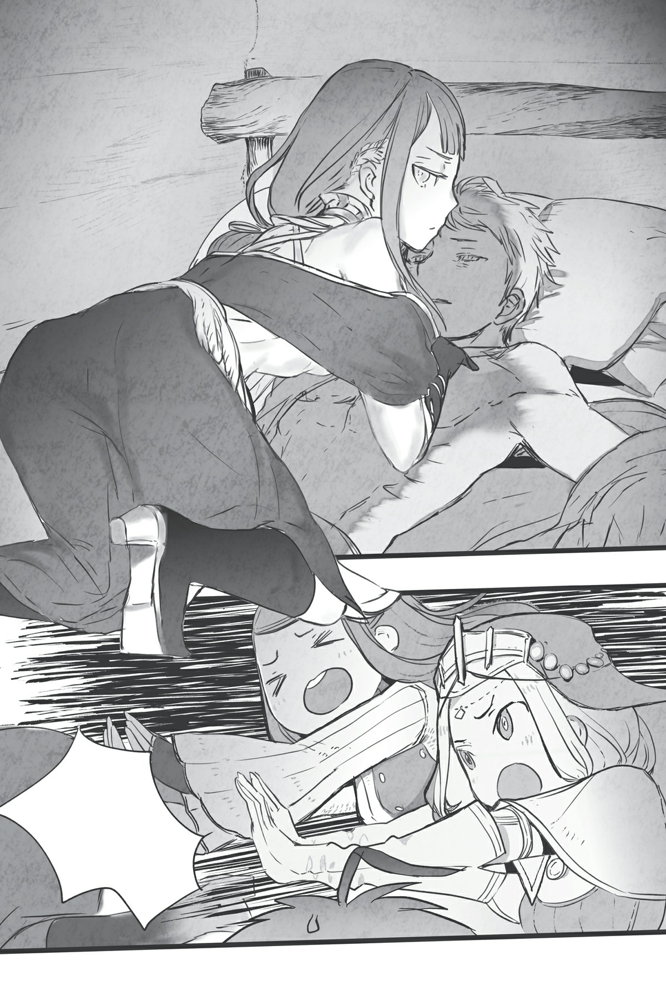

# Đoạn phụ: Katia
*(Interlude: Katia)*

Shun biến mất rồi.

Shun... biến mất tiêeeu rồi sao?!

“Hả?! Cái gì cơ?!”

Cú sốc khi nghe thấy cái Nhiệm vụ Thế giới kia lập tức tan thành mây khói.

Đầu óc tôi trống rỗng mất một giây, nhưng tôi nhanh chóng lấy lại tỉnh táo—không có thời gian để lãng phí nữa rồi.

Phải hành động ngay thôi.

Đầu tiên, tôi chạy thẳng đến phòng của Yuri.

“C-có chuyện gì thế?”

Yuri trông có vẻ giật mình khi thấy tôi hùng hổ lao vào phòng cô ấy với gương mặt đỏ bừng.

Nhưng! Tôi ở đây là vì người khác trong phòng, chứ không phải vì cô ấy!

“Shun biến mất rồi! Đây là do chủ nhân của cô làm, đúng không?!”

“...Hả?”

Tôi tiến lên áp sát cô gái mặc áo choàng trắng — tôi nhớ tên cô ta là Phelmina.

Cô ta làm việc cho Wakaba và hiện là một trong số ít những người còn lại trong tòa nhà này có liên quan đến cậu ấy.

Tôi cũng nhận thấy một vài đặc vụ mặc áo trắng khác đang ẩn nấp quanh đây, nhưng dựa trên cuộc đối thoại giữa Wakaba và Phelmina lúc nãy, tôi nghĩ cô ta hẳn là người có chức vụ cao nhất ở đây.

Tôi nghĩ người của Wakaba chắc chắn đứng sau sự biến mất của Shun.

Thực tế, tôi không nghĩ có thể là ai khác ngoài họ.

Với việc những đặc vụ mặc áo trắng đó luôn canh chừng cậu ấy chặt chẽ, tôi nghi ngờ việc có ai đó vượt qua được họ để dịch chuyển Shun đi nơi khác, trừ khi họ cùng phe.

Và phán đoán dựa vào thời điểm, việc này chắc chắn có liên quan đến Nhiệm vụ Thế giới kia.

Thông báo Nhiệm vụ Thế giới xuất hiện hoàn toàn đột ngột. Nếu thủ phạm hành động sau khi nghe thấy nó, họ sẽ càng có ít thời gian hơn để lách qua các đặc vụ bí mật.

Nói cho cùng, Shun biến mất ngay sau khi chúng tôi nghe thấy cái tin Nhiệm vụ Thế giới đó.

Chắc chắn Wakaba và người của cô ta đứng sau chuyện này!

Nhưng về cơ bản, hiện tại chúng tôi chẳng khác nào tù binh của họ.

Tôi phải bắt cô gái Phelmina này kết nối với Wakaba để chúng tôi có thể nói chuyện ôn hòa!

“Rốt cuộc các người đã đưa Shuuuun đi đâu rồi?!”

“Ái chà, lại thêm một kẻ điên nữa...”

Aaaaaah!

Mặc dù đã tự nhủ phải bình tĩnh, tôi lại túm chặt lấy cổ áo cô ta và bắt đầu lay mạnh!

Kể từ khi tôi nhận được kỹ năng [Phân thân Tư duy] (Parallel Minds), suy nghĩ và hành động của tôi đôi khi lại bị lệch pha như thế này.

Tôi đoán điều đó có nghĩa là tôi vẫn chưa hoàn toàn làm chủ được kỹ năng này.

Thông thường, tôi sẽ tắt kỹ năng [Phân thân Tư duy] đi, nhưng thỉnh thoảng nó lại tự động bật lên chỉ vì một kích thích nhỏ nhất rồi bắt đầu chạy loạn xạ.

Tôi đồ rằng điều này có nghĩa là bên trong tôi vẫn còn sót lại những mảnh vụn nam tính của kiếp trước.

Đôi khi cả tâm trí lẫn giọng nói của tôi đều có thể trở nên khá hỗn loạn.

Ôi, nhưng đây không phải là lúc đứng đây suy nghĩ vớ vẩn về mấy chuyện đó!

Được rồi, phải bình tĩnh lại nào.

K-Không biết giờ này còn kịp giải quyết mọi chuyện một cách hòa bình không nữa?

“Ôi, Katia thân mến...”

Trong khi tôi đứng đó gào thét trong lòng, Yuri nhẹ nhàng gỡ tay tôi ra khỏi cổ áo Phelmina.

“Nếu cậu muốn bóp cô ta, cậu nên bóp chỗ này này.”

Thế rồi cậu ấy hướng tay tôi đặt lên cổ cô ta.

“Không sao đâu. Chỉ cần siết nhẹ một cái ở đây là hầu hết mọi người sẽ đều chịu khai thôi mà.”

“Tôi chẳng thấy có chỗ nào 'không sao' ở đây cả...,” Phelmina nhận xét.

...Những lời của Yuri khiến tôi sốc tới mức lập tức bình tĩnh lại.

Thực ra, Phelmina trông có vẻ khá bình thản đối với một người đang bị bóp cổ.

Cô ta vẫn lạnh lùng nhìn Yuri, và mặc dù nói rằng chuyện này không ổn, cô ta vẫn không hề nhúc nhích.

Thái độ ung dung đĩnh đạc của cô ta ấn tượng đến mức tôi chợt cảm thấy ngượng ngùng vì sự hoảng loạn của chính mình, và nhanh chóng rụt tay lại.

Phelmina lặng lẽ chỉnh lại phần cổ áo bị nhàu nát.

“...Giờ thì. Các cô có phiền giải thích chuyện gì đang xảy ra ở đây không?”

Sự bình tĩnh đến khó tin của Phelmina khiến tôi liên tưởng đến hình ảnh một nữ doanh nhân diện bộ vest âu phục lịch lãm.

Ư. Quả là một người phụ nữ bản lĩnh!

Dù trông cô ta cũng chẳng lớn tuổi hơn tôi là bao!

Tuy có chút cảm giác bại trận kỳ lạ, tôi không thể để mất mặt thêm nữa, nên đã giải thích những chuyện vừa xảy ra một cách bình tĩnh nhất có thể.

Dù thực ra cũng chẳng có gì nhiều để kể: Chúng tôi nghe thấy thông báo Nhiệm vụ Thế giới, ngay sau đó một con nhện trắng (hay thứ gì đó đại loại vậy?) rơi trúng đầu Shun, rồi Shun biến mất.

“Một con nhện trắng sao...? Xin vui lòng đợi tôi một lát để xác nhận.”

Nói đoạn, Phelmina rút từ trong tay áo ra một thứ: một con nhện trắng nhỏ.

Hóa ra nhóm này thực sự đứng sau chuyện này.

“Chị nghe thấy gì chưa? Có lời phàn nàn ở đây này... Chủ nhân?”

Phelmina trò chuyện với con nhện nhỏ, nhưng nó hoàn toàn không có phản hồi nào.

Lần đầu tiên, nét mặt của cô ta thay đổi, tái đi một chút.

“Tôi vô cùng xin lỗi, nhưng có vẻ như đã xảy ra chuyện khẩn cấp. Ngay sau khi nắm rõ tình hình, tôi sẽ giải thích cho các cô. Xin vui lòng đợi tôi một lát.”

Rồi trước cả khi tôi kịp ngăn lại, cô ta đã nhanh chóng rời khỏi phòng.

Bên cạnh tốc độ đáng kinh ngạc, chuyển động của cô ta mượt mà đến mức cứ như thể cô ta đã lách qua điểm mù của tôi vậy.

Ngay cả khi không thèm xem bảng trạng thái của cô ta, tôi cũng có thể biết được Phelmina rất mạnh thông qua cách cô ta di chuyển.

Tôi đoán cô ta không hề nao núng trước sự ầm ĩ của Yuri và tôi vì cô ta biết mình chẳng có gì phải lo ngại.

Cô ta hẳn đã kết luận rằng chúng tôi không phải là mối đe dọa, kể cả khi cả hai chúng tôi có cùng lao vào tấn công cô ta đi chăng nữa.

Lẽ ra tôi đã gặp nguy hiểm nếu sơ suất chọc giận cô ta thêm nữa.

Nhưng nhờ có câu nói kỳ lạ của Yuri, chúng tôi đã tránh được kịch bản tồi tệ nhất đó.

Khi nghĩ theo hướng đó, có lẽ Yuri thực sự nói ra điều kỳ quặc như vậy chỉ để giúp tôi lấy lại tỉnh táo.

“Vậy chúng ta nên tước đoạt mạng sống của những kẻ đã bắt cóc Shun bằng cách nào đây nhỉ?”

Không, tôi rút lại lời vừa rồi. Cậu ấy vẫn đang đưa ra những lời đe dọa đáng sợ với một nụ cười rạng rỡ.

“Chúng ta sẽ không tước đoạt mạng sống của ai cả.”

“Thật sao?”

“Chắc chắn là không rồi.”

Yuri nghiêng đầu bối rối; với những đường nét khả ái của cậu ấy, tôi phải thừa nhận trông nó cũng hơi đáng yêu, hoặc ít nhất là lẽ ra phải thế.

Nhưng đôi mắt của cậu ấy dường như hoàn toàn mất đi ánh sáng lung linh...

Tôi không biết tả thế nào, nhưng có thứ gì đó vô cùng bất an ở cô bạn này.

Yuri vốn dĩ luôn có chút kỳ quái, nhưng hôm nay cảm giác rợn tóc gáy đó dường như đã tăng thêm một hai bậc.

...Tôi nghĩ tốt hơn hết mình không nên tìm hiểu quá sâu làm gì. Cứ để yên mọi chuyện đi thì hơn.

Tạm thời gạt Yuri sang một bên, mình nên làm gì bây giờ...?

Chắc chắn là tôi không định “tước đoạt mạng sống” của phe Wakaba rồi.

Nếu có cố thử, không nghi ngờ gì nữa, kẻ bị bóp cổ ngược lại chắc chắn sẽ là tôi.

Nhưng tôi cũng chẳng muốn cứ ngồi yên một chỗ chờ đợi...

“A! Shun đã bị dịch chuyển đi đâu đó đúng không?”

Trong lúc tôi đang chìm vào suy nghĩ, Yuri cất tiếng hỏi.

“Ừm, đúng thế.”

“Thế thì tớ nghĩ mình biết đúng người rồi đấy!”

“Đúng người sao?”

“Ôi, đúng thế! Trưởng lão Ronandt, bậc thầy Không gian Ma pháp!”

“Hửm. Không, ta nghĩ là không được đâu!”

Yuri và tôi đã có thể gặp Trưởng lão Ronandt ngay lập tức.

Đúng như tôi dự đoán, phe của Wakaba dường như đang quá bận rộn, nhờ thế chúng tôi có thể rời khỏi khu vực giam giữ mà không gặp trở ngại nào.

Chúng tôi không biết tìm Trưởng lão Ronandt ở đâu, nhưng ngay khi bước ra khỏi tòa nhà, chúng tôi tình cờ chạm mặt Natsume và Fei, và cậu ta biết chỗ của lão.

Dù sao thì, trên danh nghĩa Natsume vẫn là hoàng tử của Đế quốc, còn Trưởng lão Ronandt là ngự tiền pháp sư hàng đầu của triều đình.

Thế nên chúng tôi đã nhờ Trưởng lão Ronandt giúp đuổi theo Shun, nhưng câu trả lời của lão vừa nhanh chóng lại vừa không mấy khả quan.

“Tại sao lại không chứ?”

Yuri áp sát lại gần Ronandt.

“Các cô đâu có biết hiện giờ Hoàng tử Schlain đang ở đâu đúng chứ? Đến cả ta cũng chịu chết nếu không có lấy một manh mối về nơi cậu ta đã đi. Tuy nhiên, nếu các cô có chút gợi ý nào thì may ra ta mới lần theo dấu vết được.”

“Vậy chúng ta chỉ cần tìm ra nơi cậu ấy đang ở là được chứ gì?!”

Lần này, đến lượt Fei cũng dấn tới ép ông lão.

Khi cả Yuri lẫn Fei dồn dập áp sát đầy khẩn trương, Trưởng lão Ronandt uyển chuyển lùi lại một bước, xoa dịu hai người họ trước khi tiếp tục.

“Ngay cả khi biết được, chúng ta chưa chắc đã đi theo được. Dịch chuyển ma pháp chỉ hoạt động với những địa điểm mà người dùng đã từng đặt chân đến trước đó. Ta quả thực đã đi khắp mọi nơi, nhưng nếu Hoàng tử Schlain đang ở một nơi ta chưa từng tới, thì ta vẫn không thể giúp gì cho các cô.”

Vậy là hết cách rồi sao?

Nếu người được mệnh danh là pháp sư mạnh nhất nhân loại, kẻ sử dụng Không gian Ma pháp giỏi hơn bất kỳ ai, cũng nói rằng chẳng thể làm được gì...

“A!”

Đúng lúc tôi đang nghĩ rằng cả bọn sẽ phải kiên nhẫn chờ đợi như lời Phelmina dặn, Fei bỗng đập nắm đấm vào lòng bàn tay.

“Còn Triệu hồi thì sao?”

“Triệu hồi...? Ồ!”

Sau một thoáng, tôi chợt nhận ra.

Fei có khế ước với Shun!

Mặc dù giờ đây cậu ấy đang ở dạng người, cậu ấy vẫn là một Phi Long — về cơ bản là một ma thú — được xem là đã bị Shun “thuần hóa”.

Với khế ước đó, Shun có thể triệu hồi Fei bất cứ lúc nào cậu ấy muốn.

Đây là đường một chiều, nhưng ít nhất Fei cũng có thể đi đến bất cứ nơi nào Shun đang ở.

“Nhưng cậu có thể tự triệu hồi bản thân đến chỗ cậu ấy không, Fei?”

“...Không, tớ không làm được.”

Thế thì cũng bằng hòa.

Nghe chừng chỉ có Shun mới có thể triệu hồi Fei từ phía bên kia, chứ không có chiều ngược lại.

“Nếu tên Yamada vẫn chưa gọi Shinohara, chẳng phải điều đó có nghĩa là hắn ta không gặp nguy hiểm thực sự sao?” Natsume càu nhàu.

Cậu ta nói cũng có lý, nhưng...

“Tôi e là Shun đã hoàn toàn quên béng mất vụ triệu hồi rồi.”

Shun chưa bao giờ thực sự triệu hồi Fei cả. Cậu ấy luôn đối xử với cậu ấy như bạn bè bình đẳng, chứ chẳng bao giờ xem như kẻ hầu cận hay linh thú. Rất có thể cậu ấy đã quên sạch sành sanh về khế ước đó rồi, bao gồm cả khả năng triệu hồi Fei. Nói cho cùng, ngay cả tôi cũng đã quên mất chuyện đó mà.

“Bên cạnh đó, cũng có khả năng cậu ấy đang rơi vào tình cảnh hiểm nghèo tới mức không còn tâm trí đâu mà nghĩ đến những chuyện như vậy.”

“Liệu bọn họ có thực sự làm trò vòng vo tam quốc thế không?”

Những nghi ngờ của Natsume là hoàn toàn có cơ sở; tôi cũng đoán mạng sống của Shun không gặp nguy hiểm. Nếu Wakaba và phe cánh của cô ta muốn giết Shun, họ chỉ việc làm thế tại chỗ chứ cần gì phải nhọc công dịch chuyển cậu ấy đi đâu. Có thể an tâm giả định rằng họ đưa cậu ấy đi là vì một lý do nào khác.

“Hửm? Cô bé có khế ước với Hoàng tử Schlain sao?”

“Hử? Vâng, có vấn đề gì không ạ?”

“Hửmm...” Trưởng lão Ronandt trầm ngâm một lát. “Vậy thì, ta có thể Thẩm định bảng trạng thái của cô bé một chút được không?”

“Bảng trạng thái của tôi sao? Nếu ông cần thì cứ tự nhiên.”

“Vậy ta xin phép.”

Fei nhăn mặt một giây, có lẽ do cảm giác khó chịu đặc trưng khi bị Thẩm định.

Nhưng Trưởng lão Ronandt hy vọng tìm kiếm được gì từ việc Thẩm định chỉ số của cậu ấy chứ?

“Triệu hồi... Dịch chuyển... hửm. Nhỡ như... ồ? Ồ! Liệu cách này có được không nhỉ? Khả thi không?”

Lão lẩm bẩm một mình trong khi tay chân làm cái trò gì có trời mới biết.

“Ô hô hô! Rất có thể sẽ thành công đấy! Được chứ! Chắc chắn rồi! Người ta tuyệt đối không bao giờ được phép cho rằng điều gì đó là bất khả thi! Đúng vậy, ta có thể làm được!”

Ơ kìa, ông già này bị làm sao thế, tự nhiên lại nổi hứng phấn khích đùng đùng vậy?!

“Ngay tại đây, ngay lúc này! Một trang sử mới trong lịch sử dịch chuyển ma pháp sắp sửa được mở ra!”

Trưởng lão Ronandt giang rộng hai tay.

“Nếu cô bé có thể được triệu hồi, điều đó có nghĩa là có một lộ trình dịch chuyển ở đó! Chúng ta có thể tận dụng lối đi đó để dịch chuyển đến vị trí hiện tại của Hoàng tử Schlain!”

Khoan đã, chuyện đó thực sự khả thi sao?!

Hóa ra đó là lý do Trưởng lão Ronandt xem chỉ số của Fei! Quả không hổ danh là pháp sư mạnh nhất nhân loại. Ban đầu tôi còn tưởng đầu óc lão có vấn đề, hóa ra lão lại đỉnh đến thế!

“Nào, xuất phát thôi! Đến chỗ Hoàng tử Schlain nào!”

Một khắc sau, cảnh vật xung quanh chúng tôi lập tức thay đổi.

“Cá—?!”

Sự thay đổi đột ngột khiến tôi loạng choạng bước lui, nhưng may mắn thay, tôi kịp túm lấy một thứ gì đó để giữ thăng bằng khỏi ngã.

Thế nhưng khi nhìn thấy những gì đang diễn ra trước mắt, cảm giác nhẹ nhõm trong tôi lập tức tan biến sạch sẽ.

Thứ tôi vừa bấu vào chính là thành giường.

Và ở trên chiếc giường đó là một cậu con trai đang bị trói chặt cả tay lẫn chân, và quần áo thì đang bị lột sạch.

Một cậu chàng trần như nhộng không ai khác ngoài Shun!

Còn cô gái đang cởi đồ cậu ấy lại chính là em gái cậu ấy, Sue!

“E-em nghĩ mình đang làm cái trò gì thế hả??!” Tôi thét lên kinh hãi.

Làm sao mà tôi không thét lên cho được chứ?!

“Không được quan hệ trước hôn nhân! Trước hết, các người phải tuyên bố đính hôn trước mặt Thượng đế đã!” Yuri cũng hét lên, dù lập luận của cậu ấy có hơi kỳ quặc.

“Hơn nữa, em là em gái của cậu ấy mà! Làm sao kết hôn được!”

Đến cả Fei cũng mất bình tĩnh rồi sao...? Mà tôi nghĩ kết hôn đâu phải là vấn đề mấu chốt vào lúc này!

“Tránh xa cậu ấy ra! Ngay lập tức! Thật là đồi bại!”

Tôi đẩy mạnh Sue ra khỏi Shun.

Em ấy ngã nhào khỏi giường, lăn một vòng rồi nhanh chóng đứng bật dậy.

“Chị Katiaaaa... Đang đến đoạn hay... Tại sao chị lại phải xen vào phá bĩnh hả?!”

Giọng em ấy không quá lớn, nhưng bằng cách nào đó, nó ngập tràn sự căm phẫn và phẫn nộ.

“Rõ ràng quá rồi còn gì! Bởi vì em vẫn chưa tuyên bố ý định kết hôn trước mặt Thượng đế!”

Yuri à, đã bảo đấy không phải là vấn đề rồi mà...

“Cậu biết thừa không phải thế mà đúng không?! Anh em ruột thịt thì tuyệt đối không được làm chuyện như thế!”

“Lại thêm một người đàn bà lạ mặt nào nữa thế này?! Tại sao anh trai tôi lại có thể trăng hoa đến thế hả?!”

“Cái gì cơ?! Ồ, phải rồi! Em chưa từng thấy chị ở dạng người này bao giờ!”

Sue nổi đóa với Fei.

Nghĩ lại thì, Fei chỉ hóa thành hình người sau khi Sue đã đi khỏi. Tôi đoán vì Sue chỉ biết cậu ấy dưới hình dạng phi long nhỏ, nên việc em ấy tưởng cậu ấy là một người phụ nữ mới xen vào cũng là điều dễ hiểu. Mặc dù kể cả có biết Fei là ai thì chắc em ấy vẫn sẽ tức giận thôi. Hồi Fei còn là phi long nhỏ, cậu ấy cực kỳ thân thiết với Shun, suốt ngày ở trong phòng rồi đậu trên vai cậu ấy này nọ mà.

“Dù sao đi nữa, Shun phải tuyên bố kết hôn với tớ trước mặt Thượng đế, nên tớ sẽ đưa cậu ấy đi ngay bây giờ.”

Trong lúc Sue đang gầm gừ với Fei, Yuri lập tức nhảy vào bế xốc Shun lên.

“Đứng lại đó ngay! Tại sao cậu ấy lại phải đi với cậu?!”

Sao cậu ấy dám lợi dụng lúc hỗn loạn này chứ?! Thật là quá quắt! Cậu ấy luôn tìm cách dụ dỗ Shun gia nhập Thần Ngôn Giáo, nhưng giờ đây xem chừng cậu ấy đã lộ rõ dã tâm rồi! Mấy lần dụ dỗ trước đây đã đủ trơ trẽn rồi, chẳng lẽ giờ cậu ấy không màng đến thủ đoạn nữa luôn sao?!

Tôi túm lấy tay Shun và cố kéo cậu ấy ra khỏi Yuri. Nhưng Yuri vẫn bám chặt lấy cậu ấy không chịu buông.

“Tránh xa anh ấy ra!”

“Không đời nào!”

“Anh trai là của em!”

Sue cũng lao vào cuộc chiến kéo co.

Shun trông vô cùng đau đớn khi bị lôi kéo theo ba hướng.

“Khoan đã! Mấy người định xé xác cậu ấy ra đấy à!”

Bây giờ Fei cũng đã nhảy vào cuộc chiến. Cậu ấy nói đúng, tất nhiên rồi, nhưng tôi đơn giản là không thể chùn bước!

“...Gớm thật, Yamada. Xem ra cậu cũng có những nỗi khổ riêng của mình nhỉ.”

“Hô hô hô. Cậu nhóc đào hoa thật đấy. Nhưng chỉ được chọn một người thôi nhé?”

Natsume và Trưởng lão Ronandt đứng ngoài cuộc quan sát. Shun nhìn họ như thể đang cầu cứu, nhưng cả hai đều giả vờ như không thấy gì.

Nhưng nãy giờ dù hỗn loạn thế này mà Shun vẫn chưa hề nói năng hay tự cử động lấy một lời, chẳng phải điều đó nghĩa là cậu ấy đã bị đánh thuốc mê sao?

“Sue! Em đã đánh thuốc mê Shun đúng không?!”

“Chỉ là thuốc tê nhẹ thôi mà! Em cứ nghĩ thế này là gạo nấu thành cơm rồi, vậy mà...!”

“Cho dù gạo có nấu thành cơm, Thượng đế cũng không cho phép đâu!”

“Áaaa! Đủ rồi đấy cả ba người kia! Người Shun đang phát ra mấy tiếng răng rắc tớ chắc chắn là không bình thường chút nào đâu, buông tay ra mauuu!”

Tình hình thực sự đã vượt ra ngoài tầm kiểm soát khi cả bốn chúng tôi cứ nháo nhào cả lên.

Nhưng đúng lúc đó...

`<Nhiệm vụ Thế giới, tiến trình 1. Cài đặt Cấm Kỵ cho toàn bộ á nhân.>`

Chúng tôi lại nghe thấy Thần ngôn một lần nữa.

Tôi đã quên béng mất nó trong sự hỗn loạn kể từ khi Shun biến mất.

Nhưng đây là một lời thiên khải quá đỗi quan trọng không thể ngó lơ.

Ngay lập tức, một cơn đau buốt óc ập đến, và tầm nhìn của tôi tối đen lại.

---

* [◀ Chương trước: S4: Thay đổi cảnh tượng](12_s4_change_of_scenery.md)
* [Chương tiếp theo: Chương đặc biệt: Ma vương bị bỏ lại phía sau](14_special_chapter_the_demon_lord_left_behind.md)
