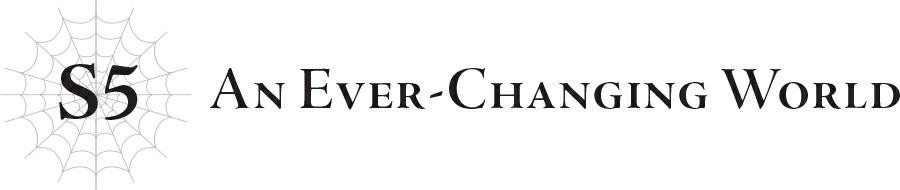

# S5: Một thế giới không ngừng thay đổi
*(S5: An Ever-Changing World)*

“Ư… ưm… Hự...”

Nghe thấy tiếng rên rỉ, tôi quay sang thì thấy Trưởng lão Ronandt đang nhăn mặt tỉnh dậy.

“Chào buổi sáng ạ. Ngài cảm thấy thế nào rồi?”

“Hừm! Phải thừa nhận là không được khỏe cho lắm.”

Trưởng lão Ronandt vừa lầm bầm “nào…” vừa lê cái thân già dậy khỏi sàn nhà.

Cách đây không lâu, thứ gọi là “Nhiệm vụ Thế giới, tiến trình 1” đã được kích hoạt, cài đặt [Cấm Kỵ] vào toàn bộ á nhân.

Vì lẽ đó, ngoại trừ tôi ra thì Trưởng lão Ronandt và mọi người ở đây đều bị ngất đi.

Có lẽ tôi là ngoại lệ vì đã đạt cấp tối đa của kỹ năng [Cấm Kỵ].

Dù vậy, do trước đó đã bị Sue đánh thuốc mê nên tôi cũng chẳng thể cử động được cho đến khi chất độc đào thải hết ra ngoài.

Trong một khoảng thời gian, tôi chỉ biết nằm im thin thít nhìn mọi người nằm la liệt dưới sàn.

Ngay khi lấy lại khả năng cử động, tôi liền đi một vòng để chỉnh lại tư thế nằm cho từng người đang bất tỉnh.

Tôi thấy ái ngại khi để một người lớn tuổi như Trưởng lão Ronandt nằm dưới sàn, nhưng trong phòng chỉ có duy nhất một chiếc giường. Hy vọng mấy tấm khăn tôi lót dưới lưng ngài ấy cũng đủ êm.

Nếu bạn thắc mắc tại sao tôi không đưa Trưởng lão Ronandt lên giường nằm, thì đó là vì chiếc giường duy nhất ấy đã bị các cô gái chiếm mất rồi.

Cụ thể là Sue, Yuri và Katia (tôi cũng hơi phân vân không biết có nên tính cả người cuối cùng không, nhưng chỗ nằm vẫn vừa đủ cho thêm một người nữa).

Có lẽ tôi nên đặt Fei lên đó thay vì Katia, nhưng có một vấn đề khá nan giải liên quan đến cân nặng.

Dù đang ở dạng người nhưng bản chất Fei vẫn là một con phi long khổng lồ.

Bất kể ngoại hình có thay đổi thế nào thì cân nặng của cô ấy vẫn giữ nguyên như hình dạng gốc.

Nếu đặt Fei lên giường, tôi e là nó sẽ sập mất.

Chúng tôi thật may mắn khi cô ấy không biến trở lại hình dạng gốc và đè bẹp tất cả khi ngất đi. Thay vào đó, tôi xếp cô ấy nằm dưới sàn giống như Trưởng lão Ronandt.

Xét đến kích thước khổng lồ ở dạng phi long của cô ấy, căn phòng này chắc chắn sẽ không thể chứa nổi. Tôi hình dung ra cảnh bức tường sẽ bị đổ sập hay gì đó tương tự.

Còn Natsume? Dĩ nhiên là nằm dưới sàn rồi.

“Ta đã ngất đi bao lâu rồi...?”

“Khoảng nửa ngày ạ.”

Trưởng lão Ronandt vươn vai, khớp lưng và hông kêu răng rắc.

…Xem ra để một người già nằm dưới sàn nhà đúng là một ý kiến tồi. Nhưng tôi cũng không thể nào xếp ngài ấy nằm chung giường với các cô gái được…

“Ơm… cháu rất tiếc về chuyện đó. Ý cháu là việc để ngài nằm dưới sàn ấy ạ.”

“Hửm? Ồ! Không sao, không sao cả.”

Khi tôi xin lỗi, Trưởng lão Ronandt liếc nhìn chiếc giường rồi lập tức hiểu ra vấn đề, lão cười ha hả đầy sảng khoái.

“Ở tiền tuyến, ta đã phải cắm trại ngủ ngoài đất gần như mỗi đêm đấy chứ. Chỉ cần có mái che trên đầu thế này là ta vui lắm rồi.”

“Thật ấn tượng ạ. Nhưng nếu thực sự muốn, chẳng phải ngài có thể dùng dịch chuyển để về nhà ngủ sao?”

“Sẽ thật không công bằng nếu ta được ngủ êm ấm trên giường của mình trong khi các đồng đội phải ngủ dưới đất đúng không? Hơn nữa, nếu có chuyện gì xảy ra trong đêm thì ta cũng chẳng thể hỗ trợ kịp thời.”

“À, ra vậy ạ. Cháu đã hỏi một câu ngớ ngẩn rồi.”

“Thực ra, đó cũng không phải là một lựa chọn tồi để đảm bảo ta giữ được thể trạng tốt nhất nhằm cống hiến hết mình trên chiến trường. Nhưng nếu lúc nào cũng chỉ nghĩ đến hiệu quả, ngươi sẽ đánh mất những thứ khác.”

“Cháu hiểu rồi ạ.”

Quả thực, có quá nhiều điều tôi không biết mà chúng tôi chưa từng được học ở học viện.

“Ngươi đúng là một học trò chăm chỉ, hệt như Julius vậy. Nhưng một cậu nhóc như ngươi vẫn còn nhiều cơ hội để học hỏi mà… hoặc có thể là không, trong thời buổi này…”

Trưởng lão Ronandt hạ giọng thở dài.

“Trưởng lão Ronandt, ngài nghĩ chuyện gì sẽ xảy ra tiếp theo?”

“Sao chứ, ta chịu thôi. Những sự kiện gần đây đã vượt quá phạm vi hiểu biết của ngay cả ta rồi.”

Nếu ngay cả cựu sư phụ của anh Julius kiêm trưởng pháp sư hoàng gia của Đế quốc còn không biết chuyện gì đang xảy ra, tôi cá là chẳng ai biết nổi.

“Ta rất muốn nói chuyện với ngươi thêm chút nữa, cậu nhóc, nhưng hiện tại ta muốn tập trung vào việc nghiên cứu cái gọi là [Cấm Kỵ] này đã. Cho ta xin phép một lát.”

“Dạ, vâng ạ…”

“Đừng lo, ta sẽ ở ngay bên ngoài thôi. Nếu có rắc rối gì, ngươi chỉ việc gọi ta.”

“Vâng ạ.”

Trưởng lão Ronandt bước ra khỏi tòa nhà với gương mặt vẫn còn nét nghiêm nghị.

Chắc ngài ấy muốn ở một mình để tự mình kiểm tra nội dung của [Cấm Kỵ].

Liệu ngài ấy có ổn không?

Chỉ cần sở hữu [Cấm Kỵ] thọc vào đầu bạn là một dòng suy nghĩ mãnh liệt, cưỡng ép.

“Hãy chuộc tội.”

Ngay cả khi không mở menu [Cấm Kỵ], dòng suy nghĩ đó vẫn không ngừng vang vọng.

Và một khi bạn mở menu ra, nó lại càng trở nên mạnh mẽ hơn nữa.

Chỉ cần nhìn vào đó một lúc ngắn ngủi cũng đủ khiến mặt tôi tái nhợt vì buồn nôn.

Bất chấp việc tôi là một người tái sinh đến từ thế giới khác.

Tôi nghĩ mình có thể chống lại dòng suy nghĩ đó là vì ở góc độ nào đó, tôi chỉ là một kẻ ngoài cuộc.

Nhưng liệu những người dân của thế giới này, những người liên đới trực tiếp đến toàn bộ chuyện này, có thể chịu đựng nổi lời đòi hỏi chuộc tội dồn dập đến ngạt thở đó không?

Trên menu [Cấm Kỵ] còn có một mục gọi là [Lịch sử Tái sinh].

Nếu những người bản xứ của thế giới này nhìn vào phần đầu của lịch sử đó, tức là cuộc sống của họ từ thời điểm hệ thống mới được tạo ra, tôi lo rằng họ sẽ bị nhấn chìm trong cảm giác tội lỗi.

Trong suốt nửa ngày qua, tôi đã kiểm tra [Lịch sử Tái sinh] của mình và thấy nó hoàn toàn trống trơn.

Tôi đoán nếu là người sinh ra ở thế giới này, nó sẽ hiển thị ghi chép về tất cả các kiếp trước của họ.

Vì vốn dĩ không thuộc về thế giới này nên tôi không cách nào biết được những cư dân bản địa sẽ nhìn thấy lượng chi tiết nhiều đến mức nào.

Nhưng nội dung của các tùy chọn khác như [Mô tả Đầu mục Hệ thống] và [Lịch sử Cập nhật] đều chứa đầy ắp chi tiết, nên tôi nghi ngờ lượng thông tin ở đó cũng không hề ít.

Nếu đó chỉ đơn giản là một danh sách thì đã đành, nhưng nếu nó thực sự đánh thức ký ức từ tiền kiếp thì lại là một chuyện hoàn toàn khác.

Nó thậm chí có thể ảnh hưởng đến cả nhân cách hiện tại của mỗi người.

Ngay cả khi có chung một linh hồn, tính cách của một người vẫn có thể thay đổi tùy thuộc vào nơi họ được sinh ra và cách họ được nuôi dưỡng.

…Tôi vô cùng ghét việc phải chứng kiến cảnh Sue đột ngột lầm đường lạc lối.

Mà thực ra, có khi đối với em ấy thì giờ đã là quá muộn rồi chăng?

Biết đâu việc nhớ lại kiếp trước lại giúp đầu óc em ấy tỉnh táo hơn một chút chăng…

Nhưng có lẽ đặt hy vọng vào một điều như thế là sai lầm. Với lại, một người anh trai có nên nghĩ về em gái mình như vậy không chứ?

Trong lúc những suy nghĩ của tôi cứ luẩn quẩn một hồi, Sue thực sự đã thức giấc.

Dù vậy, em ấy vẫn nằm yên trên giường không chịu dậy.

“Anh trai. Cho em hỏi tại sao em lại bị trói thế này?”

“Em thử tự đặt tay lên ngực rồi suy ngẫm một lúc xem?”

“Em e là mình không làm được, vì tay em đang bị trói rồi.”

“Nhưng em vẫn có thể nghĩ được mà, đúng không?”

Không có gì to tát cả. Hiện tại cả tay chân của Sue đều đang bị trói chặt.

Tôi không có ý định trả đũa chuyện lúc nãy, nhưng việc để em ấy tự do di chuyển xem chừng cũng không mấy khôn ngoan.

Việc một người anh trai trói em gái cùng cha khác mẹ của mình nghe có vẻ điên khùng thật, nhưng xét đến việc em ấy đã làm điều tương tự với tôi trước đó, lại còn đánh thuốc mê nữa, tôi nghĩ không ai có thể trách tôi vì đã đề phòng cả.

“…Vậy thì anh làm tiếp đi.”

“Ý em làm tiếp là thế nào?”

Sue đỏ mặt và nháy mắt đưa tình với tôi.

Tôi thực sự không thích hướng đi của câu chuyện này chút nào…

Rõ ràng là tôi sẽ chẳng bao giờ làm bất kỳ điều gì đồi bại với em gái mình, bất kể em ấy có bị trói hay không.

Nhưng giờ phải làm sao đây…? Nếu như việc em ấy đánh thuốc mê tôi trước đó chưa đủ rõ ràng, thì bây giờ mọi chuyện lại càng hiển nhiên hơn: Em gái tôi có vấn đề rồi.

Ý tôi là, sự ám ảnh của em ấy dành cho tôi trước giờ đúng là có phần không lành mạnh thật.

Nhưng em ấy vẫn có đủ lý trí để nhận ra rằng giữa anh em ruột thịt có những giới hạn không được phép vượt qua… ít nhất là tôi khá chắc chắn như vậy.

Em ấy từng có, đúng chứ? Tôi thật lòng hy vọng thế...

Dù sao đi nữa, chút lý trí ít ỏi đó của em ấy giờ chắc chắn đã bay biến sạch sẽ rồi.

Đây là sự thay đổi nhất thời hay là vĩnh viễn?

Nếu đây chỉ là trạng thái bối rối tạm thời, tôi vẫn có thể xử lý được.

Nhưng nếu là vĩnh viễn thì rắc rối to rồi. Một rắc rối lớn. Một rắc rối cực kỳ lớn.

Tại sao một cuộc khủng hoảng cá nhân hệ trọng như vậy lại xảy ra ngay lúc này, khi một cuộc khủng hoảng tầm cỡ thế giới—Nhiệm vụ Thế giới—vẫn đang diễn ra chứ?

Xét trên bức tranh toàn cảnh, tôi chắc chắn vấn đề này của mình trông thật nhỏ bé.

Nhưng đối với cá nhân tôi, đây lại là một chuyện gia đình cực kỳ nghiêm trọng.

Tôi có lẽ không thể tiếp tục trì hoãn chuyện này nữa…

Nếu có trách thì là vì trước giờ tôi đã trốn tránh nó quá lâu rồi nên giờ mọi chuyện mới thành ra thế này.

Từ lâu tôi đã biết Sue có tình cảm với tôi vượt trên mức tình cảm anh em bình thường.

Em ấy thể hiện lộ liễu đến mức gần như không thể nào không nhận ra.

Vậy mà tôi cứ liên tục gạt vấn đề đó sang một bên, giả vờ như không thấy gì.

Bởi vì tôi cũng chẳng biết phải làm sao.

Ý tôi là, cứ nghĩ thử xem.

Ở kiếp trước, tôi chỉ là một nam sinh trung học hoàn toàn bình thường, kiểu người mà bạn sẽ mô tả là “trung bình” hay “nhân vật làm nền”.

Tôi không có một cô em gái dễ thương hay cô bạn thanh mai trúc mã đáng yêu nào, nói gì đến chuyện có bạn gái.

Không phải tôi hoàn toàn không có bạn là nữ; vẫn có vài bạn nữ tôi trò chuyện cùng, như Hasebe Yuika—tức là Yuri ở kiếp này, nhưng chắc chắn là chẳng có triển vọng tiến tới mối quan hệ yêu đương nào.

Nói tóm lại là tôi hoàn toàn mù tịt về ba cái chuyện tình cảm nam nữ tinh tế này.

Thế nên với một kẻ như tôi, chuyện một cô em gái cùng cha khác mẹ đem lòng yêu anh trai mình nghe chẳng khác nào mấy câu chuyện giả tưởng xa vời.

Trong những hoàn cảnh bình thường tôi còn chẳng biết cách đối phó với con gái thế nào, nói gì đến một đứa em gái cùng cha khác mẹ.

Theo như tôi nhớ, tôi luôn đối xử với Sue như một đứa em gái bình thường, không hơn không kém.

Nhưng vì kiếp trước là con một nên tôi cũng không cách nào biết được liệu mình có đang làm tròn bổn phận của một người anh trai hay không.

Nhìn vào tình trạng hiện tại của Sue, tôi đoán chắc mình đã sai ở bước nào đó rồi.

Tôi nghĩ em ấy có lẽ đã bị khắc ghi hình bóng của tôi vì hai anh em luôn ở cạnh nhau từ khi còn nhỏ.

Kể từ lúc có nhận thức, chúng tôi đã luôn được nuôi dưỡng cùng nhau.

Và ngay từ nhỏ, hệt như một nhân vật chuyển sinh thực thụ, tôi đã nỗ lực hết mình để tích lũy thật nhiều kỹ năng.

Có vẻ Sue thấy tôi như vậy nên cho là “ngầu” và bắt đầu bám dính lấy tôi.

Dù khi còn nhỏ, mức độ bám dính của em ấy cũng không đến mức thái quá như vậy.

Do Sue và tôi được nuôi lớn trong một môi trường khá đặc biệt, chúng tôi có rất ít cơ hội được tiếp xúc với những đứa trẻ cùng trang lứa.

Đối với trường hợp của Sue, em ấy hầu như không bao giờ gặp bất kỳ người con trai nào khác ngoài tôi.

Thế nên tôi đã nghĩ rằng một khi hai đứa đi học và em ấy có nhiều cơ hội gặp gỡ những người bạn trai khác, em ấy sẽ tự động bớt bám tôi đi.

Chắc chắn em ấy chỉ đang nhầm lẫn giữa tình cảm gia đình và tình yêu nam nữ mà thôi, một vấn đề nhỏ nhặt sẽ tự động được giải quyết khi em ấy bước vào tuổi dậy thì, và sẽ càng nhanh chóng biến mất hơn một khi em ấy có đối tượng thầm thương trộm nhớ khác.

Nhưng kế hoạch này của tôi đã thất bại thảm hại, và Sue vẫn bám lấy tôi như cũ.

Quãng thời gian đó em ấy bắt đầu tỏ ra hơi xa cách, làm tôi cứ tưởng em ấy đã dần rời xa tôi, khiến tôi vừa thở phào nhẹ nhõm lại vừa có chút hụt hẫng.
Nhưng đến tận bây giờ, tôi mới nhận ra mình đã sai lầm khủng khiếp đến thế nào.

Việc em ấy tỏ ra xa cách chắc chắn là vì đang âm thầm hợp tác với phe của Wakaba.

Và kết cục là em ấy đã phải tự tay thực hiện hành vi tàn ác là sát hại phụ hoàng của chúng tôi.

Tôi không biết chuyện đó đã để lại vết sẹo tâm lý sâu sắc thế nào trong lòng Sue.

Nhưng nhìn vào cách em ấy hành xử lúc này, rõ ràng mọi chuyện còn nghiêm trọng hơn tôi tưởng rất nhiều.

Nếu lúc em ấy mới bắt đầu tỏ ra xa cách, tôi chịu khó quan tâm em ấy nhiều hơn một chút, có lẽ mọi chuyện đã không tồi tệ đến mức này.

Nếu thay vì do dự né tránh chỉ vì không biết phải đối phó thế nào, tôi chọn cách đối mặt trực diện với em ấy, có lẽ tôi đã sớm nhận ra có điều gì đó bất thường.

Việc đó có giúp tôi đi trước Wakaba và những người khác một bước hay không giờ cũng chẳng còn quan trọng nữa.

Tôi đã không nhận ra sự bất thường đang diễn ra với Sue.

Đó rõ ràng là một thất bại của tôi.

Dù vậy, tôi vẫn không thể đáp lại tình cảm của Sue.

“Anh không thể đáp lại tình cảm của em được, Sue. Nhưng anh vẫn có thể ở bên cạnh em… với tư cách là anh trai của em, không hơn không kém. Như vậy vẫn chưa đủ sao?”

Tôi biết mình nói vậy có vẻ đã quá dễ dãi với em ấy.

Tôi đâu phải là thánh nhân.

Một phần trong tôi muốn tra hỏi em ấy tại sao lại làm việc cho phe Wakaba.

Và phần lớn hơn nữa trong tôi muốn thẩm vấn xem tại sao em ấy lại đánh thuốc mê tôi, trói tôi lại, rồi định giở trò gì với tôi nữa chứ!

Nhưng nếu tôi tra hỏi lúc tinh thần em ấy đang không ổn định, tôi e rằng mình sẽ gây ra những tổn thương không thể cứu vãn.

Tuy nhiên, chiều theo ý muốn của em ấy cũng không phải là cách đúng đắn.

Việc cố gắng dỗ dành em ấy bằng cách đó sẽ chẳng mang lại điều gì tốt đẹp cho cả hai.

Dù điều đó có thể xoa dịu cảm xúc của em ấy nhất thời, một mối quan hệ vặn vẹo như vậy chắc chắn sẽ dẫn đến một kết cục tồi tệ.

Và rồi Sue sẽ càng bị tổn thương sâu sắc hơn nữa.

Vì thế, tôi phải đưa mối quan hệ giữa tôi và Sue trở lại đúng quỹ đạo của nó, ngay tại đây và ngay lúc này.
Như một cặp anh em bình thường.

Tôi nhìn thẳng vào mắt em ấy và chờ đợi câu trả lời.

Ngay khi bầu không khí im lặng kéo dài bắt đầu trở nên ngượng ngập, Sue đột ngột quay mặt đi.

“…Anh tàn nhẫn thật đấy, Anh trai.”

Rồi không nói thêm được lời nào rõ ràng nữa, em ấy bật khóc nức nở.

Tôi đã làm em ấy khóc.

P-Phải làm sao bây giờ?

Tôi chẳng biết câu trả lời đúng đắn là gì, nhưng tôi cảm giác nếu lúc này mình chọn cách bỏ chạy, hai đứa sẽ lập tức quay lại vạch xuất phát.

Thế là tôi rụt rè đưa tay ra và xoa đầu em ấy.

Dù hành động này có thể không phải là lựa chọn đúng đắn, nhưng việc cứ đứng đực ra đó im lặng xem chừng còn tồi tệ hơn.

Vậy nên tôi cứ tiếp tục xoa đầu cho đến khi em ấy nín khóc.

…Nhân tiện thì, có vẻ như Katia đã tỉnh dậy từ lúc nào đó trong suốt cuộc trò chuyện này, nhưng cậu ấy đã lịch sự giả vờ như vẫn đang ngủ.

Cậu ấy thậm chí còn tốt bụng đến mức niệm phép ngủ lên Yuri hộ chúng tôi nữa.

Bằng không, nếu Yuri mà thức giấc, tôi chắc chắn cậu ấy sẽ chẳng lịch sự được như vậy đâu…

`<Nhiệm vụ Thế giới, tiến trình 2. Tác động đến trận chiến giữa các vị thần bằng cách cầu nguyện.>`

“Nó tới rồi…”

Khoảng thời điểm Sue ngừng khóc—hoặc nói chính xác hơn là lúc em ấy cứ khóc mãi không thôi khiến tôi bắt đầu nghi ngờ em ấy đang giả vờ, rồi dần dần chắc chắn, và đang nghiêm túc cân nhắc xem có nên giáng cho em ấy một cú “vuốt sắt” (iron claw) thay vì cứ tiếp tục xoa đầu hay không—thì một thông báo Nhiệm vụ Thế giới khác lại vang lên.

Nó đã cho tôi một cái cớ hoàn hảo để rụt tay lại khỏi đầu Sue và lùi ra xa.

Tôi lập tức cảm nhận thấy sự bất mãn của em ấy, điều đó càng khẳng định phán đoán của tôi rằng em ấy đã bắt đầu giả vờ từ giữa chừng.

Không thể tin được em ấy lại lợi dụng lòng tốt của tôi vào lúc này…

Có khi tôi nên dạy cho em ấy một bài học bằng một cú vuốt sắt vào mặt luôn cho rồi?

Ngay khi tôi lùi ra xa Sue, Katia liền ngồi dậy một cách vô tội rồi đánh thức Yuri, người vừa giật mình tỉnh dậy sau giấc ngủ do ma pháp.

Trong lúc đợi Yuri hoàn toàn tỉnh táo, tôi mở menu [Cấm Kỵ] ra và kiểm tra lại lần nữa.

Menu Cấm Kỵ
Tổng quan Hệ thống
Mô tả Đầu mục Hệ thống
Lịch sử Cập nhật
Danh sách Điểm số
Lịch sử Tái sinh
Tùy chọn Đặc biệt n% I = W
Nhiệm vụ Thế giới

Có một tùy chọn mới xuất hiện ở dưới cùng của menu.

Tôi đoán nó vừa được thêm vào vì Nhiệm vụ Thế giới giả định người dùng đã có hiểu biết trước về [Cấm Kỵ].

Vì “tiến trình 1” đã cài đặt nó vào toàn bộ á nhân, nên “tiến trình 2” có lẽ đã tạo ra tùy chọn “Nhiệm vụ Thế giới” mới này trong menu để mọi người có thể đọc và nắm bắt thông tin về nó.

Tôi thận trọng mở đầu mục [Nhiệm vụ Thế giới].

`<Hiện tại, Nữ thần Sariel, người đóng vai trò là lõi của hệ thống, đang có nguy cơ biến mất dưới gánh nặng quá tải. Vị thần sắc ngà nhằm mục đích phá hủy hệ thống, sử dụng nguồn năng lượng đang vận hành hệ thống để hoàn thành việc khôi phục thế giới này và giải phóng Nữ thần Sariel, ngăn cô ấy biến mất. Tuy nhiên, nếu lựa chọn phương pháp này, khoảng một nửa nhân loại sẽ phải chết do tác dụng phụ từ việc phá hủy hệ thống, và linh hồn của họ sẽ bị tiêu hủy. Vị thần sắc mun cho rằng điều này là không thể chấp nhận được và đã khiêu chiến với vị thần sắc ngà. Nếu vị thần sắc ngà chiến thắng, một nửa nhân loại sẽ bị hiến tế, còn Nữ thần Sariel và hành tinh này sẽ được cứu. Nếu vị thần sắc mun chiến thắng, Nữ thần Sariel và người kế thừa của cô ấy, vị thần sắc mun, sẽ bị hiến tế, còn nhân loại và hành tinh này sẽ được cứu. Bằng cách dâng lời cầu nguyện lên một trong hai vị thần này, nhân loại có thể truyền một lượng nhỏ sức mạnh đến vị thần mà họ lựa chọn.>`

“Cái quái gì thế này…?”

Tôi không thể tin nổi vào những gì mình vừa đọc.

Chuyện này gây chấn động đến mức tôi chẳng biết phải xử lý thông tin nào trước.

“Vậy chuyện này giống như một trận quyết chiến… hay nói đúng hơn là một cuộc bỏ phiếu chung cuộc?”

Chắc hẳn Katia cũng đã đọc được nội dung của đầu mục Nhiệm vụ Thế giới.

Cuộc bỏ phiếu chung cuộc đúng là cách mô tả hoàn hảo nhất.

Mỗi chúng ta phải cầu nguyện cho vị thần trắng hoặc vị thần đen để truyền thêm sức mạnh cho họ.

Những “lá phiếu” này sẽ phá vỡ thế cân bằng sức mạnh giữa hai vị thần.

“Vậy là chúng ta chỉ có lựa chọn cứu nhân loại, hoặc cứu Nữ thần sao?”

Và số phận của thế giới đang ngàn cân treo sợi tóc.

Chúng ta sẽ cứu nhân loại, hay Nữ thần?

Quyền lựa chọn ai được sinh tồn và ai phải bị bỏ rơi hoàn toàn phụ thuộc vào chúng ta.

Nữ thần Sariel đã tự hiến tế mình để cứu lấy thế giới này, cơ thể cô ấy đã chậm rãi hao mòn suốt bấy lâu nay.

Vị thần sắc mun đã bảo vệ thế giới này vì cô ấy, nỗ lực kế thừa ý chí của cô ấy.

Thế giới này, cùng những con người sống trong đó, đang mang ơn hai vị thần một món nợ ân nghĩa khổng lồ.

Vậy mà giờ đây, chúng ta lại phải lựa chọn cứu lấy hai vị thần đó, hoặc cứu lấy chính mình.

“Nhưng… cả hai lựa chọn này đều tồi tệ!”

Không một ai đáng phải đưa ra lựa chọn giữa những thứ này cả!

Bất kể chọn bên nào, sự mất mát cũng là quá lớn.

“Không có cách nào để cứu cả hai sao?! Chắc chắn phải có cách chứ!”

“Rõ ràng là vì không còn cách nào khác nên chúng ta mới rơi vào tình cảnh này.”

Tôi giật mình quay lại thì thấy Trưởng lão Ronandt đã bước vào từ lúc nào.

“Ta không biết những vị thần đó sở hữu bao nhiêu sức mạnh. Nhưng ta biết quá rõ con người nhỏ bé và yếu đuối đến nhường nào. Chúng ta, loài người, vô cùng yếu đuối.”

“Vậy ý ngài là chúng ta không đủ mạnh để thay đổi tình hình này sao?”

“Đúng vậy.”

Câu nói đó làm tôi nổi giận.

“Anh Julius chắc chắn sẽ không bao giờ bỏ cuộc!”

Nếu anh trai Julius của tôi còn ở đây, tôi chắc chắn anh ấy sẽ không đầu hàng ngay cả vào thời khắc như thế này.

So sao Trưởng lão Ronandt, cựu sư phụ của anh ấy, lại có thể nói ra những lời hèn nhát như vậy chứ?

“Ngươi nói đúng lắm, cậu nhóc. Nhưng Julius đã chết rồi.”

Những lời đó khiến tôi vừa giận dữ vừa tuyệt vọng, nhưng đồng thời, chúng cũng là sự thật phũ phàng.

Tôi chắc chắn Julius chưa từng từ bỏ, kể cả vào những giây phút cuối đời.

Nhưng rốt cuộc anh ấy vẫn hy sinh mà chưa đạt được mục tiêu của mình.

Anh trai tôi thường nói về việc muốn kiến tạo một thế giới hòa bình, nơi mọi người đều có thể sống hạnh phúc.

Nhưng ngay cả anh ấy cũng không thể biến ước mơ đó thành hiện thực.

“Con người là những sinh vật nhỏ bé đáng thương. Dù có nỗ lực đến đâu, giới hạn cho những việc chúng ta có thể làm vẫn luôn tồn tại.”

Tôi nghiến răng và cúi đầu xuống.

Trưởng lão Ronandt nói đúng.

Chỉ mới ngày hôm qua thôi, tôi đã tự mình nhận ra bản thân bất lực đến nhường nào.

“Nhưng vẫn còn một lựa chọn nữa, đó là chiến đấu không từ bỏ cho đến lúc chết, hệt như những gì Julius đã làm.”

“Hả?”

Tôi ngẩng đầu lên.

“Con người rất yếu đuối. Ngay cả khi không từ bỏ, chúng ta cũng chẳng thể thay đổi được nhiều. Tình cảnh này cũng không ngoại lệ đúng không? Ta nghi ngờ việc không bỏ cuộc sẽ thay đổi được bất cứ điều gì. Nó có thể chỉ đồng nghĩa với việc chết một cách vô ích mà thôi. Thế nhưng, sự thật vẫn là chúng ta sẽ không bao giờ biết chắc chắn trừ khi tự mình thử nghiệm. Ngươi sẽ chấp nhận bản thân bất lực rồi bỏ cuộc, hay sẽ tiếp tục đấu tranh đến cùng, không sợ hãi trước một cái chết vô nghĩa? Ngươi sẽ chọn gì đây, hửm?”

Trưởng lão Ronandt nhìn tôi bằng ánh mắt đầy thách thức.

“Ngài đã biết rõ câu trả lời của cháu rồi.”

Tôi kiên định nhìn thẳng vào mắt ngài ấy.

Tôi thề rằng mình sẽ tiếp bước anh trai Julius.

Và Julius thì chưa từng bỏ cuộc.

“Trả lời tốt lắm.”

Trưởng lão Ronandt nở một nụ cười ranh mãnh, nét biểu cảm tinh nghịch hoàn toàn không tương thích với tuổi tác của lão.

“Vậy thì chúng ta bắt đầu cuộc họp chiến thuật thôi chứ nhỉ?”

Tôi cũng sẽ không từ bỏ.

---

* [◀ Chương trước: S4: Thay đổi cảnh tượng](12_s4_change_of_scenery.md)
* [Chương tiếp theo: Đoạn phụ: Dustin](16_interlude_dustin.md)
